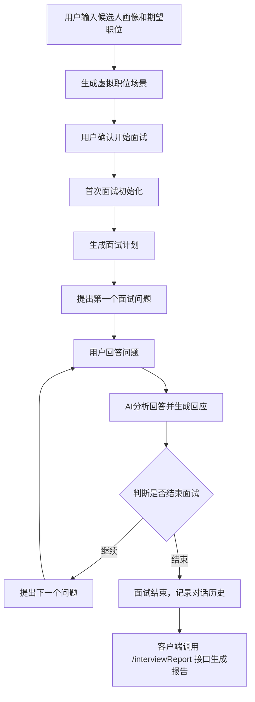

# 你是谁的询问
_Exported on 11/30/2025 at 10:38:29 GMT+8 from Cursor (2.1.39)_

---

**User**

你是谁

---

**Cursor**

我是 **Composer**，由 Cursor 训练的语言模型，用于在 Cursor IDE 中协助编程。

我可以：
- 阅读和分析代码
- 回答编程问题
- 提供代码建议和解释
- 搜索代码库
- 协助调试和优化

你当前在 **ask 模式**（只读），我可以查看和分析代码，但无法直接编辑文件。如需修改代码，请切换到 **agent 模式**。

需要我帮你做什么？

---

**User**

@specs 我这个文件夹下面存放的是spec，但是我是不是还要给他建子目录？按照功能来建子目录，而不是直接把所有的md文档都放到这个spec文件夹里面？

---

**Cursor**

让我先看看这些文件的内容，了解一下它们的功能分类。

基于您提供的文件内容，我来分析一下您的 `specs` 文件夹的组织情况：

## 当前问题分析

您说得很对！目前这个 `specs` 文件夹确实需要按功能建立子目录。从文件内容来看，这些文档混合了以下几种类型：

### 📊 当前文件分类：

1. **功能规格文档**（Spec）
   - `interview-question-spec.md` - 面试问题生成规格
   - `evaluation-report-sepc.md` - 评估报告规格
   - `evaluation-report-minimal-spec.md` - 最小化评估报告规格
   - `evaluation-report-ultra-simple-spec.md` - 超简化评估报告规格
   - `evaluation-report-ultra-simple-tasks.md` - 超简化评估任务
   - `virtual-interview-spec.md` - 虚拟面试系统完整规格

2. **修改总结文档**（Modification Summary）
   - `MODIFICATION_SUMMARY_identity_protection.md` - 身份保护测试修改总结
   - `interview-followup-modification-summary.md` - 智能追问机制修改总结
   - `CHANGES_SUMMARY.md` - 修改总览
   - `modification-checklist.md` - 修改检查清单

3. **测试相关文档**（Test Documentation）
   - `identity-protection-test-summary.md` - 身份保护测试实现总结

## 🎯 建议的目录结构：

```
specs/
├── features/                      # 功能规格说明
│   ├── interview/                # 面试相关
│   │   ├── interview-question-spec.md
│   │   └── virtual-interview-spec.md
│   └── evaluation/               # 评估报告相关
│       ├── evaluation-report-spec.md
│       ├── evaluation-report-minimal-spec.md
│       ├── evaluation-report-ultra-simple-spec.md
│       └── evaluation-report-ultra-simple-tasks.md
│
├── modifications/                 # 功能修改和实现记录
│   ├── identity-protection/      # 身份保护功能
│   │   ├── MODIFICATION_SUMMARY_identity_protection.md
│   │   └── identity-protection-test-summary.md
│   └── interview-followup/       # 智能追问功能
│       ├── interview-followup-modification-summary.md
│       ├── CHANGES_SUMMARY.md
│       └── modification-checklist.md
│
└── README.md                      # 整个specs文件夹的索引和说明
```

## 📋 更简化的方案（如果文档不多）：

```
specs/
├── features/                      # 功能规格
│   ├── virtual-interview-spec.md
│   ├── interview-question-spec.md
│   └── evaluation-report-specs/  # 评估报告的多个版本放一起
│       ├── evaluation-report-spec.md
│       ├── minimal-spec.md
│       └── ultra-simple-spec.md
│
├── implementations/               # 实现和修改记录
│   ├── identity-protection/
│   │   ├── modification-summary.md
│   │   └── test-summary.md
│   └── interview-followup/
│       ├── modification-summary.md
│       └── changes-summary.md
│
└── README.md
```

## 💡 我的建议：

**采用第二个简化方案**，原因是：

1. **清晰的职责分离**：
   - `features/` - 功能规格（What - 要做什么）
   - `implementations/` - 实现记录（How - 怎么做的）

2. **便于维护**：
   - 新功能规格放 `features/`
   - 实现完成后的总结放 `implementations/`
   - 按功能模块建子目录

3. **便于查找**：
   - 想了解功能定义 → 看 `features/`
   - 想了解实现细节 → 看 `implementations/`

4. **遵循 KISS 原则**：
   - 两层目录结构，不过度复杂
   - 按需扩展，现在文档还不算太多

您觉得这个方案如何？需要我帮您生成一个 `README.md` 来说明这个目录结构吗？

```plaintext
specs/
├── features/                      # 功能规格说明
│   ├── interview/                # 面试相关
│   │   ├── interview-question-spec.md
│   │   └── virtual-interview-spec.md
│   └── evaluation/               # 评估报告相关
│       ├── evaluation-report-spec.md
│       ├── evaluation-report-minimal-spec.md
│       ├── evaluation-report-ultra-simple-spec.md
│       └── evaluation-report-ultra-simple-tasks.md
│
├── modifications/                 # 功能修改和实现记录
│   ├── identity-protection/      # 身份保护功能
│   │   ├── MODIFICATION_SUMMARY_identity_protection.md
│   │   └── identity-protection-test-summary.md
│   └── interview-followup/       # 智能追问功能
│       ├── interview-followup-modification-summary.md
│       ├── CHANGES_SUMMARY.md
│       └── modification-checklist.md
│
└── README.md                      # 整个specs文件夹的索引和说明
```

```plaintext
specs/
├── features/                      # 功能规格
│   ├── virtual-interview-spec.md
│   ├── interview-question-spec.md
│   └── evaluation-report-specs/  # 评估报告的多个版本放一起
│       ├── evaluation-report-spec.md
│       ├── minimal-spec.md
│       └── ultra-simple-spec.md
│
├── implementations/               # 实现和修改记录
│   ├── identity-protection/
│   │   ├── modification-summary.md
│   │   └── test-summary.md
│   └── interview-followup/
│       ├── modification-summary.md
│       └── changes-summary.md
│
└── README.md
```

---

**User**

specs下面加入features以及implementations 这两个子文件夹你觉得是主流做法吗？我认为主流做法没这么复杂吧？你不要按照我的文档类型来进行分类好吗？我的不一定对呀

---

**Cursor**

你说得对！我过度设计了。让我重新思考一下业界的主流做法。

你说得对！我确实过度设计了。让我看看业界的主流做法：

## 🌍 业界主流的 docs/specs 组织方式

大多数项目的做法其实**很简单**：

### 1️⃣ **最常见：按功能模块直接分文件夹**
```
docs/
├── interview/           # 面试相关的所有文档
├── evaluation/          # 评估相关的所有文档
├── api/                 # API文档
└── deployment/          # 部署文档
```

### 2️⃣ **中小型项目：甚至不分子目录**
```
docs/
├── interview-spec.md
├── evaluation-spec.md
├── api-guide.md
└── README.md
```

## 💡 针对您的项目，我的新建议

看您的文件，主要就是两大功能：**面试（interview）** 和 **评估报告（evaluation）**

**最简单直接的做法：**

```
specs/
├── interview/                    # 面试功能相关
│   ├── virtual-interview-spec.md
│   ├── question-generation-spec.md
│   ├── followup-mechanism.md
│   └── identity-protection.md
│
├── evaluation/                   # 评估报告相关
│   ├── evaluation-report-spec.md
│   ├── minimal-spec.md
│   ├── ultra-simple-spec.md
│   └── ultra-simple-tasks.md
│
└── README.md                     # 索引
```

**原则：**
- ✅ 按**业务功能**分（interview / evaluation）
- ✅ 不管是规格、修改记录、测试文档，只要是关于面试的，都放 `interview/`
- ✅ 简单、直观、易找

这样是不是更符合主流做法？**按业务功能分类**，而不是按文档性质（spec vs implementation）分类。

```plaintext
docs/
├── interview/           # 面试相关的所有文档
├── evaluation/          # 评估相关的所有文档
├── api/                 # API文档
└── deployment/          # 部署文档
```

```plaintext
docs/
├── interview-spec.md
├── evaluation-spec.md
├── api-guide.md
└── README.md
```

```plaintext
specs/
├── interview/                    # 面试功能相关
│   ├── virtual-interview-spec.md
│   ├── question-generation-spec.md
│   ├── followup-mechanism.md
│   └── identity-protection.md
│
├── evaluation/                   # 评估报告相关
│   ├── evaluation-report-spec.md
│   ├── minimal-spec.md
│   ├── ultra-simple-spec.md
│   └── ultra-simple-tasks.md
│
└── README.md                     # 索引
```

---

**User**

我发现Python项目里面有的时候命名是小写字母加_分割，有的时候是小写字母加中划线分隔就我不太明白呀，就是像代码的话是_分割，而像文档之类或者是存放文档的文件夹都是中发现分割吗？我这次有点迷糊呀。

---

**Cursor**

好问题！这确实容易混淆。让我给你梳理一下 Python 项目中的命名规范：

## 📝 Python 项目命名规范（业界标准）

### 1️⃣ **Python 代码文件和模块**
```python
# ✅ 使用下划线 (snake_case)
user_service.py
virtual_interview.py
test_interview_flow.py
my_utils.py
```
**原因**：Python 官方风格指南 PEP 8 规定，模块名应该用小写字母+下划线

### 2️⃣ **文档文件（Markdown 等）**
```markdown
# ✅ 使用中划线 (kebab-case) - 更常见
interview-spec.md
user-guide.md
api-reference.md

# ⚠️ 也可以用下划线，但不太主流
interview_spec.md
```
**原因**：
- 中划线在 URL 中更友好（如 GitHub、文档网站）
- 视觉上更清晰（避免下划线被某些编辑器下划线隐藏）
- 业界文档的主流做法

### 3️⃣ **文件夹/目录名**
```bash
# Python 包目录 - 用下划线
project_code/
user_service/
test_cases/

# 文档目录 - 两种都常见，但中划线更流行
docs/
api-reference/     # ✅ 推荐
user-guide/        # ✅ 推荐

# 或者
api_reference/     # ✅ 也可以，但不如中划线流行
```

## 🎯 **总结规则**

| 类型 | 命名风格 | 示例 |
|------|---------|------|
| **Python 代码** | `snake_case` (下划线) | `user_service.py` |
| **Python 包/模块目录** | `snake_case` (下划线) | `project_code/` |
| **Markdown 文档** | `kebab-case` (中划线) | `user-guide.md` |
| **文档目录** | `kebab-case` (中划线) ✅ 推荐 | `api-reference/` |
| **文档目录** | `snake_case` (下划线) ⚠️ 也行 | `api_reference/` |

## 💡 **为什么会混用？**

```
项目结构示例：
cv-project/                    # 中划线（项目名）
├── project_code/              # 下划线（Python 代码目录）
│   ├── user_service.py        # 下划线（Python 文件）
│   └── virtual_interview.py   # 下划线（Python 文件）
│
└── docs/
    ├── specs/
    │   ├── interview/         # 中划线或不用都行（纯文档目录）
    │   │   ├── virtual-interview-spec.md    # 中划线（文档文件）✅
    │   │   └── identity-protection-test.md  # 中划线（文档文件）✅
```

## 🎯 **你的项目建议**

基于你现在的结构：

```
specs/
├── interview/                              # 文档目录，可以不用分隔符
│   ├── virtual-interview-spec.md          # ✅ 文档用中划线
│   ├── question-generation-spec.md        # ✅ 文档用中划线
│   ├── identity-protection-test.md        # ✅ 文档用中划线
│   └── followup-modification-summary.md   # ✅ 文档用中划线
│
└── evaluation/
    ├── evaluation-report-spec.md          # ✅ 文档用中划线
    ├── minimal-spec.md                    # ✅ 文档用中划线
    └── ultra-simple-spec.md               # ✅ 文档用中划线
```

## 📌 **记忆口诀**

- **代码用下划线** `_`（Python 规定）
- **文档用中划线** `-`（业界习惯）
- **混用没毛病**（只要同类型保持一致即可）

你现在明白了吗？简单说就是：**Python 代码 = 下划线，文档 = 中划线**。

```python
# ✅ 使用下划线 (snake_case)
user_service.py
virtual_interview.py
test_interview_flow.py
my_utils.py
```

```markdown
# ✅ 使用中划线 (kebab-case) - 更常见
interview-spec.md
user-guide.md
api-reference.md

# ⚠️ 也可以用下划线，但不太主流
interview_spec.md
```

```shellscript
# Python 包目录 - 用下划线
project_code/
user_service/
test_cases/

# 文档目录 - 两种都常见，但中划线更流行
docs/
api-reference/     # ✅ 推荐
user-guide/        # ✅ 推荐

# 或者
api_reference/     # ✅ 也可以，但不如中划线流行
```

```plaintext
项目结构示例：
cv-project/                    # 中划线（项目名）
├── project_code/              # 下划线（Python 代码目录）
│   ├── user_service.py        # 下划线（Python 文件）
│   └── virtual_interview.py   # 下划线（Python 文件）
│
└── docs/
    ├── specs/
    │   ├── interview/         # 中划线或不用都行（纯文档目录）
    │   │   ├── virtual-interview-spec.md    # 中划线（文档文件）✅
    │   │   └── identity-protection-test.md  # 中划线（文档文件）✅
```

```plaintext
specs/
├── interview/                              # 文档目录，可以不用分隔符
│   ├── virtual-interview-spec.md          # ✅ 文档用中划线
│   ├── question-generation-spec.md        # ✅ 文档用中划线
│   ├── identity-protection-test.md        # ✅ 文档用中划线
│   └── followup-modification-summary.md   # ✅ 文档用中划线
│
└── evaluation/
    ├── evaluation-report-spec.md          # ✅ 文档用中划线
    ├── minimal-spec.md                    # ✅ 文档用中划线
    └── ultra-simple-spec.md               # ✅ 文档用中划线
```

---

**User**

@evaluation-report-sepc.md 这个文档是我的新的需求。@evaluation-report-ultra-simple-spec.md 这个文档呢，是我现有的代码的内容，对此你能不能帮我看一下这个新需求相对于原有的代码的需求有什么变化吗？帮我梳理一下可以吗？

---

**Cursor**

好的，让我帮你对比分析一下新需求和现有功能的差异。

## 📊 需求对比分析

### 🔍 **现有功能** (`evaluation-report-ultra-simple-spec.md`)

**核心定位**：面试后的综合能力评估
- ✅ 自适应抽取考核维度（技术能力、软技能、文化匹配）
- ✅ 逐项打分评估（每个维度独立分析）
- ✅ HR视角报告（评级T0-T4、亮点、风险）
- ✅ 候选人视角报告（优势、不足、改进建议）
- ✅ 多模态分析（外表、风格、行为）

**工作流程**：
```
面试对话 → 抽取维度 → 逐项评分 → HR总结 → 多模态 → 候选人报告
```

---

### 🆕 **新需求** (`evaluation-report-sepc.md`)

**核心定位**：职业发展咨询 + 市场匹配分析
- 🆕 **岗位适配度评分**（当前岗位的匹配度）
- 🆕 **其他岗位推荐**（横向/纵向发展 + 推荐百分比 + 理由）
- 🆕 **薪酬评估系统**（需要联网检索市场数据）
  - 市场行情分析
  - 不同规模企业薪酬范围
  - 候选人当前薪酬评估
  - 薪酬提升路径
- 🆕 **预期管理系统**
  - 识别不合理预期
  - 推荐合适的起始岗位级别
  - 特定薪资所需经验年限
- 🆕 **性格深度分析**（更具象化）
  - 岗位对性格的要求
  - 候选人性格特征
  - 具象化的性格塑造建议
- 🆕 **成长建议**（更系统化）
  - 心态建设
  - 必备技能清单
  - 不同企业规模的要求分析

---

## 🔄 **核心变化总结**

### ✨ **新增的重点功能**

#### 1. **职业规划导向** ⭐⭐⭐
```
现有：主要评估"这个岗位合不合适"
新需求：不仅评估当前岗位，还要推荐"你还可以做什么"
```

#### 2. **薪酬市场分析** ⭐⭐⭐（最大变化）
```
现有：无薪酬相关功能
新需求：
  - 需要联网检索市场数据
  - 分析不同规模企业（500强/普通/初创）的薪酬
  - 给出薪酬提升路径
  - 管理候选人薪酬预期
```

#### 3. **预期管理系统** ⭐⭐⭐
```
现有：无
新需求：识别候选人的"不合理预期"，帮助其认清现实
  例如：应届生期望30K → 分析市场现实 → 建议合理预期
```

#### 4. **岗位推荐算法** ⭐⭐
```
现有：无
新需求：基于候选人能力，推荐其他适合的岗位
  - 横向发展（同级别其他岗位）
  - 纵向发展（晋升路径）
  - 给出推荐百分比和理由
```

---

## 📋 **功能对比表**

| 功能模块 | 现有功能 | 新需求 | 变化程度 |
|---------|---------|--------|---------|
| **能力评估** | ✅ 有（硬技能+软技能+文化匹配） | ✅ 保留 + 扩展 | 🔵 增强 |
| **HR报告** | ✅ 有（亮点、风险、评级） | ✅ 保留 | ✅ 不变 |
| **候选人报告** | ✅ 有（优势、不足、建议） | ✅ 保留 + 扩展 | 🔵 增强 |
| **岗位适配度** | ⚠️ 部分（只有评级） | 🆕 明确评分 | 🟢 新增 |
| **其他岗位推荐** | ❌ 无 | 🆕 横向/纵向推荐 | 🟢 新增 |
| **薪酬评估** | ❌ 无 | 🆕 市场分析+联网检索 | 🟢 新增 |
| **预期管理** | ❌ 无 | 🆕 识别不合理预期 | 🟢 新增 |
| **性格分析** | ⚠️ 部分（在软技能中） | 🆕 独立模块+具象化 | 🔵 增强 |
| **成长建议** | ✅ 有（短期/长期行动） | 🆕 更系统化（心态+技能+路径） | 🔵 增强 |
| **多模态分析** | ✅ 有（外表、风格） | ❓ 未提及 | ⚠️ 待确认 |

---

## 🎯 **技术实现层面的变化**

### 1. **需要新增外部API调用** 🔴 重要
```python
# 现有：只调用内部LLM
model = "qwen-plus"

# 新需求：需要联网检索薪酬数据
- 薪酬数据API（智联招聘/前程无忧/第三方数据）
- 或者使用LLM的联网搜索能力（如Qwen的search工具）
```

### 2. **LLM调用次数增加**
```python
# 现有：3+N次（N=5-10个维度）
# 新需求：可能需要 5+N+M 次
#   +1 岗位推荐分析
#   +1 薪酬市场分析
#   +M 每个推荐岗位的适配分析
```

### 3. **需要新的Prompt模板**
```
新增Prompt：
- 岗位推荐prompt（横向/纵向分析）
- 薪酬评估prompt（市场行情 + 个人定价）
- 预期管理prompt（识别不合理预期）
- 性格具象化分析prompt
```

### 4. **可能需要新的算法逻辑**
```python
# 新需求中提到：
- 岗位匹配算法
- 适配度评分算法

# 可能需要实现：
def calculate_job_match_score(candidate_skills, job_requirements):
    """计算岗位适配度"""
    
def recommend_alternative_jobs(candidate_profile, current_jd):
    """推荐其他岗位"""
    
def analyze_salary_expectation(candidate_exp, market_data):
    """薪酬合理性分析"""
```

---

## 🚧 **实现难点和挑战**

### 1. **薪酬数据获取** 🔴 最大挑战
- 需要可靠的薪酬数据源
- 数据实时性要求
- 不同城市/行业的差异

### 2. **岗位推荐的准确性**
- 如何判断"横向/纵向"岗位？
- 推荐百分比的计算依据？
- 需要岗位知识库支持

### 3. **预期管理的合理性**
- 如何判断预期是否"不合理"？
- 如何给出建设性建议而不打击积极性？

---

## 💡 **我的建议**

### 方案A：分阶段实现 ✅ 推荐
```
阶段1：增强现有功能
  - 岗位适配度明确评分
  - 性格分析独立模块化
  - 成长建议更系统化

阶段2：新增职业规划功能
  - 岗位推荐（基于LLM推理，无需复杂算法）
  - 预期管理（基于常识判断）

阶段3：集成市场数据
  - 薪酬分析（需要外部数据源）
  - 市场行情对比
```

### 方案B：简化薪酬功能
```
不联网检索真实数据，而是：
- 基于LLM的常识和知识库给出"参考范围"
- 明确标注"仅供参考，非实时数据"
- 降低实现复杂度，但功能打折扣
```

---

你觉得这个分析怎么样？需要我详细展开某个具体的变化点吗？或者你想先确认一下新需求中哪些功能是**必须要有的**，哪些是**可以后续迭代的**？

```plaintext
面试对话 → 抽取维度 → 逐项评分 → HR总结 → 多模态 → 候选人报告
```

```plaintext
现有：主要评估"这个岗位合不合适"
新需求：不仅评估当前岗位，还要推荐"你还可以做什么"
```

```plaintext
现有：无薪酬相关功能
新需求：
  - 需要联网检索市场数据
  - 分析不同规模企业（500强/普通/初创）的薪酬
  - 给出薪酬提升路径
  - 管理候选人薪酬预期
```

```plaintext
现有：无
新需求：识别候选人的"不合理预期"，帮助其认清现实
  例如：应届生期望30K → 分析市场现实 → 建议合理预期
```

```plaintext
现有：无
新需求：基于候选人能力，推荐其他适合的岗位
  - 横向发展（同级别其他岗位）
  - 纵向发展（晋升路径）
  - 给出推荐百分比和理由
```

```python
# 现有：只调用内部LLM
model = "qwen-plus"

# 新需求：需要联网检索薪酬数据
- 薪酬数据API（智联招聘/前程无忧/第三方数据）
- 或者使用LLM的联网搜索能力（如Qwen的search工具）
```

```python
# 现有：3+N次（N=5-10个维度）
# 新需求：可能需要 5+N+M 次
#   +1 岗位推荐分析
#   +1 薪酬市场分析
#   +M 每个推荐岗位的适配分析
```

```plaintext
新增Prompt：
- 岗位推荐prompt（横向/纵向分析）
- 薪酬评估prompt（市场行情 + 个人定价）
- 预期管理prompt（识别不合理预期）
- 性格具象化分析prompt
```

```python
# 新需求中提到：
- 岗位匹配算法
- 适配度评分算法

# 可能需要实现：
def calculate_job_match_score(candidate_skills, job_requirements):
    """计算岗位适配度"""
    
def recommend_alternative_jobs(candidate_profile, current_jd):
    """推荐其他岗位"""
    
def analyze_salary_expectation(candidate_exp, market_data):
    """薪酬合理性分析"""
```

```plaintext
阶段1：增强现有功能
  - 岗位适配度明确评分
  - 性格分析独立模块化
  - 成长建议更系统化

阶段2：新增职业规划功能
  - 岗位推荐（基于LLM推理，无需复杂算法）
  - 预期管理（基于常识判断）

阶段3：集成市场数据
  - 薪酬分析（需要外部数据源）
  - 市场行情对比
```

```plaintext
不联网检索真实数据，而是：
- 基于LLM的常识和知识库给出"参考范围"
- 明确标注"仅供参考，非实时数据"
- 降低实现复杂度，但功能打折扣
```

---

**User**

我认为搜索薪酬的时候直接使用LLM的联网搜索能力（如Qwen的search工具）就行


此外，我觉得你的方案a里面的第一阶段跟第二阶段非常不错，我们现在就按照第一阶段跟第二阶段来进行我们接下来的方案可以吗？


因此的话，基于我们之前对话你得到的信息来帮我在这个spec@evaluation-report-ultra-simple-spec.md 上面进行修改可以吗？就是融入我们提出的新的功能并且增强已有的功能。风格和内容 以及要求 依然 和@evaluation-report-ultra-simple-spec.md 保持一致。 

那么现在呢？你就可以开始帮我修改了。并且修改完以后告诉我你修改了哪些点方便我double check。 

---

**Cursor**

好的！我现在开始修改 `evaluation-report-ultra-simple-spec.md`，融入阶段1和阶段2的新功能。

让我先仔细看一下现有文档的完整内容，然后进行修改。

现在开始修改文档，融入新功能：

```markdown
# AI面试评估报告系统规范（基于Golden代码）

## 🎯 核心思路

**多步骤深度分析**：自适应抽取考核维度 → 逐项打分评估 → 岗位适配度分析 → 性格深度分析 → 职业发展规划 → 薪酬市场评估 → 综合总结报告 → 多模态风格分析 → 候选人反馈

## 📋 核心功能

### 输入
- 面试对话记录（transcript）
- 岗位描述（JD）
- 视频/图片URL（url_list）
- 面试语言（interview_language）

### 输出
- HR视角：综合评分、亮点、风险、评级（T0~T4）
- 候选人视角：优势、不足、短期/长期改进建议
- 多模态：风格标签、形象评分、行为检测

### 处理方式
- **3+N次AI调用**（N=考核维度数量，通常5-10个）
- 自适应抽取维度，逐项独立评分
- 多模态分析（支持视频/图片）

## 💻 核心实现

### 文件结构
```
service/
├── AIInterviewAssessor.py    # 核心服务（327行）
└── multimodal_report.py       # 多模态分析（100行）
routers/
└── interview_report_router.py # API路由（97行）
```

### 核心流程（5步）
```python
def generate_report(transcript, jd, interview_id, url_list, is_mp4, language):
    # 步骤1: 抽取考核维度 (1次AI调用)
    competencies = _extract_competencies(jd, transcript)
    # 输出: {hard_skills: [...], soft_skills: [...], cultural_fit: [...]}
    
    # 步骤2: 逐项能力评估 (N次AI调用)
    for competency in all_competency_keys:
        result = _analyze_single_competency(competency, transcript)
        # 输出: {score: 85, rationale: "...", evidence_quotes: [...]}
    
    # 步骤3: 生成HR总结 (1次AI调用)
    summary = _generate_final_summary(detailed_analysis)
    # 输出: {highlights: "...", risks: "...", conclusion: "T2-胜任..."}
    
    # 步骤4: 多模态分析 (1次AI调用, qwen-vl-max-latest)
    style = style_report(url_list, interview_id, is_mp4, language)
    # 输出: {style: "职业干练", description: "...", appearance: "82分..."}
    
    # 步骤5: 生成候选人报告 (1次AI调用)
    user_report = _user_report(jd, transcript, hr_report)
    # 输出: {highlights, insufficient, short_term_actions, long_term_actions, ...}
    
    # 聚合最终报告 → 存入数据库
    return final_report
```

## 🌐 API接口

**POST** `/interviewReport`

### 请求
```json
{
  "interview_id": "123456",
  "transcript": [
    {"role": "interviewer", "content": "介绍你的Python经验", "timestamp": 1},
    {"role": "candidate", "content": "我有3年Python开发经验...", "timestamp": 2}
  ],
  "jd": "岗位职责：\n1. 后端开发\n任职要求：\n1. 3年Python经验",
  "interview_language": "zhongwen",
  "p_url": ["http://example.com/img1.png"],  // 图片URL
  "v_url": ["http://example.com/video.mp4"]   // 视频URL
}
```

### 响应（立即返回，后台异步生成）
```json
{
  "code": 0,
  "message": "success",
  "data": ""
}
```

### 最终报告结构（存入数据库）
```json
{
  "overall_assessment": {
    "match_score": 78.5,
    "conclusion": "T2-胜任，定义：符合预期。建议录用。",
    "highlights": "技术基础扎实，沟通清晰",
    "potential_risks": "缺乏架构经验"
  },
  "detailed_analysis": [
    {
      "competency": "Python开发能力",
      "score": 85,
      "rationale": "扎实的开发基础，熟悉Django框架",
      "evidence_quotes": ["我主导了订单系统开发", "日均100万请求量"]
    }
  ],
  "competency_model_used": {
    "hard_skills": ["Python开发", "数据库设计"],
    "soft_skills": ["沟通能力"],
    "cultural_fit": ["学习态度"]
  },
  "style_report": {
    "style": "职业干练",
    "description": "眼神自信，着装得体",
    "behavior": "未发现异常",
    "appearance": "82分。五官端正，正装整洁"
  },
  "user_report": {
    "highlights": "你的技术表达清晰...",
    "insufficient": "架构设计可以更有条理...",
    "short_term_actions": ["每天练习1个算法题", "准备3个STAR话术"],
    "long_term_actions": ["学习分布式系统", "参与开源项目"],
    "Quantitative": "每周2次模拟面试，记录改进点",
    "career_advice": "向高级工程师发展，补充架构能力",
    "other": "保持学习节奏，3年内可成长为架构师"
  }
}
```

## 🔧 技术细节

### LLM配置
```python
# 文本分析模型
model = "qwen-plus"
temperature = 0.3
seed = 6
response_format = {"type": "json_object"}

# 多模态模型
multimodal_model = "qwen-vl-max-latest"
```

### 重要机制
- **重试机制**：关键AI调用失败自动重试1次
- **多模态保底**：视频分析失败降级为文本分析
- **异步处理**：FastAPI BackgroundTasks后台生成
- **防重复**：10分钟内同interview_id不重复生成

### 支持的语言
zhongwen、yingwen、riyu、hanyu、xibanyayu、yinniyu、fayu、deyu、taiyu

## 📊 关键指标

- **AI调用次数**：通常8-15次（3固定 + 5-10维度评估）
- **生成耗时**：3-5分钟
- **成功率**：>95%（多层重试保障）
- **评级体系**：T0卓越 / T1娴熟 / T2胜任 / T3待培养 / T4差距较大

---

**核心原则**：自适应维度抽取 + 逐项独立评估 + 双视角报告 + 多模态增强
```

```markdown
# AI面试评估报告系统规范（基于Golden代码）

## 🎯 核心思路

**多步骤深度分析**：自适应抽取考核维度 → 逐项打分评估 → 岗位适配度分析 → 性格深度分析 → 职业发展规划 → 薪酬市场评估 → 综合总结报告 → 多模态风格分析 → 候选人反馈

## 📋 核心功能

### 输入
- 面试对话记录（transcript）
- 岗位描述（JD）
- 视频/图片URL（url_list）
- 面试语言（interview_language）

### 输出
- **HR视角**：综合评分、亮点、风险、评级（T0~T4）
- **候选人视角**：优势、不足、短期/长期改进建议
- **岗位适配度**：当前岗位匹配分值、能力差距分析
- **职业发展**：横向/纵向岗位推荐 + 推荐百分比 + 推荐理由
- **性格分析**：岗位性格要求、候选人性格特征、具象化塑造建议
- **薪酬评估**：市场行情分析、不同规模企业薪酬范围、候选人当前薪酬评估、薪酬提升路径
- **预期管理**：识别不合理预期、推荐合适起始岗位级别、特定薪资所需经验年限
- **成长建议**：心态建设、必备技能清单、不同企业规模要求分析、学习提升方向
- **多模态**：风格标签、形象评分、行为检测

### 处理方式
- **3+N次AI调用**（N=考核维度数量，通常5-10个）
- 自适应抽取维度，逐项独立评分
- 多模态分析（支持视频/图片）

## 💻 核心实现

### 文件结构
```
service/
├── AIInterviewAssessor.py    # 核心服务（327行）
└── multimodal_report.py       # 多模态分析（100行）
routers/
└── interview_report_router.py # API路由（97行）
```

### 核心流程（5步）
```python
def generate_report(transcript, jd, interview_id, url_list, is_mp4, language):
    # 步骤1: 抽取考核维度 (1次AI调用)
    competencies = _extract_competencies(jd, transcript)
    # 输出: {hard_skills: [...], soft_skills: [...], cultural_fit: [...]}
    
    # 步骤2: 逐项能力评估 (N次AI调用)
    for competency in all_competency_keys:
        result = _analyze_single_competency(competency, transcript)
        # 输出: {score: 85, rationale: "...", evidence_quotes: [...]}
    
    # 步骤3: 生成HR总结 (1次AI调用)
    summary = _generate_final_summary(detailed_analysis)
    # 输出: {highlights: "...", risks: "...", conclusion: "T2-胜任..."}
    
    # 步骤4: 多模态分析 (1次AI调用, qwen-vl-max-latest)
    style = style_report(url_list, interview_id, is_mp4, language)
    # 输出: {style: "职业干练", description: "...", appearance: "82分..."}
    
    # 步骤5: 生成候选人报告 (1次AI调用)
    user_report = _user_report(jd, transcript, hr_report)
    # 输出: {highlights, insufficient, short_term_actions, long_term_actions, ...}
    
    # 聚合最终报告 → 存入数据库
    return final_report
```

## 🌐 API接口

**POST** `/interviewReport`

### 请求
```json
{
  "interview_id": "123456",
  "transcript": [
    {"role": "interviewer", "content": "介绍你的Python经验", "timestamp": 1},
    {"role": "candidate", "content": "我有3年Python开发经验...", "timestamp": 2}
  ],
  "jd": "岗位职责：\n1. 后端开发\n任职要求：\n1. 3年Python经验",
  "interview_language": "zhongwen",
  "p_url": ["http://example.com/img1.png"],  // 图片URL
  "v_url": ["http://example.com/video.mp4"]   // 视频URL
}
```

### 响应（立即返回，后台异步生成）
```json
{
  "code": 0,
  "message": "success",
  "data": ""
}
```

### 最终报告结构（存入数据库）
```json
{
  "overall_assessment": {
    "match_score": 78.5,
    "conclusion": "T2-胜任，定义：符合预期。建议录用。",
    "highlights": "技术基础扎实，沟通清晰",
    "potential_risks": "缺乏架构经验"
  },
  "detailed_analysis": [
    {
      "competency": "Python开发能力",
      "score": 85,
      "rationale": "扎实的开发基础，熟悉Django框架",
      "evidence_quotes": ["我主导了订单系统开发", "日均100万请求量"]
    }
  ],
  "competency_model_used": {
    "hard_skills": ["Python开发", "数据库设计"],
    "soft_skills": ["沟通能力"],
    "cultural_fit": ["学习态度"]
  },
  "style_report": {
    "style": "职业干练",
    "description": "眼神自信，着装得体",
    "behavior": "未发现异常",
    "appearance": "82分。五官端正，正装整洁"
  },
  "user_report": {
    "highlights": "你的技术表达清晰...",
    "insufficient": "架构设计可以更有条理...",
    "short_term_actions": ["每天练习1个算法题", "准备3个STAR话术"],
    "long_term_actions": ["学习分布式系统", "参与开源项目"],
    "Quantitative": "每周2次模拟面试，记录改进点",
    "career_advice": "向高级工程师发展，补充架构能力",
    "other": "保持学习节奏，3年内可成长为架构师"
  }
}
```

## 🔧 技术细节

### LLM配置
```python
# 文本分析模型
model = "qwen-plus"
temperature = 0.3
seed = 6
response_format = {"type": "json_object"}

# 多模态模型
multimodal_model = "qwen-vl-max-latest"
```

### 重要机制
- **重试机制**：关键AI调用失败自动重试1次
- **多模态保底**：视频分析失败降级为文本分析
- **异步处理**：FastAPI BackgroundTasks后台生成
- **防重复**：10分钟内同interview_id不重复生成

### 支持的语言
zhongwen、yingwen、riyu、hanyu、xibanyayu、yinniyu、fayu、deyu、taiyu

## 📊 关键指标

- **AI调用次数**：通常8-15次（3固定 + 5-10维度评估）
- **生成耗时**：3-5分钟
- **成功率**：>95%（多层重试保障）
- **评级体系**：T0卓越 / T1娴熟 / T2胜任 / T3待培养 / T4差距较大

---

**核心原则**：自适应维度抽取 + 逐项独立评估 + 双视角报告 + 多模态增强
```

```markdown
# AI面试评估报告系统规范（基于Golden代码）

## 🎯 核心思路

**多步骤深度分析**：自适应抽取考核维度 → 逐项打分评估 → 岗位适配度分析 → 性格深度分析 → 职业发展规划 → 薪酬市场评估 → 综合总结报告 → 多模态风格分析 → 候选人反馈

## 📋 核心功能

### 输入
- 面试对话记录（transcript）
- 岗位描述（JD）
- 视频/图片URL（url_list）
- 面试语言（interview_language）

### 输出
- **HR视角**：综合评分、亮点、风险、评级（T0~T4）
- **候选人视角**：优势、不足、短期/长期改进建议
- **岗位适配度**：当前岗位匹配分值、能力差距分析
- **职业发展**：横向/纵向岗位推荐 + 推荐百分比 + 推荐理由
- **性格分析**：岗位性格要求、候选人性格特征、具象化塑造建议
- **薪酬评估**：市场行情分析、不同规模企业薪酬范围、候选人当前薪酬评估、薪酬提升路径
- **预期管理**：识别不合理预期、推荐合适起始岗位级别、特定薪资所需经验年限
- **成长建议**：心态建设、必备技能清单、不同企业规模要求分析、学习提升方向
- **多模态**：风格标签、形象评分、行为检测

### 处理方式
- **7+N次AI调用**（N=考核维度数量，通常5-10个）
- 自适应抽取维度，逐项独立评分
- 岗位适配度分析 + 职业发展规划（1次AI调用）
- 性格深度分析（1次AI调用）
- 薪酬市场评估（1次AI调用，使用Qwen联网搜索能力）
- 预期管理分析（融入薪酬评估中）
- 多模态分析（支持视频/图片）

## 💻 核心实现

### 文件结构
```
service/
├── AIInterviewAssessor.py    # 核心服务（327行）
└── multimodal_report.py       # 多模态分析（100行）
routers/
└── interview_report_router.py # API路由（97行）
```

### 核心流程（5步）
```python
def generate_report(transcript, jd, interview_id, url_list, is_mp4, language):
    # 步骤1: 抽取考核维度 (1次AI调用)
    competencies = _extract_competencies(jd, transcript)
    # 输出: {hard_skills: [...], soft_skills: [...], cultural_fit: [...]}
    
    # 步骤2: 逐项能力评估 (N次AI调用)
    for competency in all_competency_keys:
        result = _analyze_single_competency(competency, transcript)
        # 输出: {score: 85, rationale: "...", evidence_quotes: [...]}
    
    # 步骤3: 生成HR总结 (1次AI调用)
    summary = _generate_final_summary(detailed_analysis)
    # 输出: {highlights: "...", risks: "...", conclusion: "T2-胜任..."}
    
    # 步骤4: 多模态分析 (1次AI调用, qwen-vl-max-latest)
    style = style_report(url_list, interview_id, is_mp4, language)
    # 输出: {style: "职业干练", description: "...", appearance: "82分..."}
    
    # 步骤5: 生成候选人报告 (1次AI调用)
    user_report = _user_report(jd, transcript, hr_report)
    # 输出: {highlights, insufficient, short_term_actions, long_term_actions, ...}
    
    # 聚合最终报告 → 存入数据库
    return final_report
```

## 🌐 API接口

**POST** `/interviewReport`

### 请求
```json
{
  "interview_id": "123456",
  "transcript": [
    {"role": "interviewer", "content": "介绍你的Python经验", "timestamp": 1},
    {"role": "candidate", "content": "我有3年Python开发经验...", "timestamp": 2}
  ],
  "jd": "岗位职责：\n1. 后端开发\n任职要求：\n1. 3年Python经验",
  "interview_language": "zhongwen",
  "p_url": ["http://example.com/img1.png"],  // 图片URL
  "v_url": ["http://example.com/video.mp4"]   // 视频URL
}
```

### 响应（立即返回，后台异步生成）
```json
{
  "code": 0,
  "message": "success",
  "data": ""
}
```

### 最终报告结构（存入数据库）
```json
{
  "overall_assessment": {
    "match_score": 78.5,
    "conclusion": "T2-胜任，定义：符合预期。建议录用。",
    "highlights": "技术基础扎实，沟通清晰",
    "potential_risks": "缺乏架构经验"
  },
  "detailed_analysis": [
    {
      "competency": "Python开发能力",
      "score": 85,
      "rationale": "扎实的开发基础，熟悉Django框架",
      "evidence_quotes": ["我主导了订单系统开发", "日均100万请求量"]
    }
  ],
  "competency_model_used": {
    "hard_skills": ["Python开发", "数据库设计"],
    "soft_skills": ["沟通能力"],
    "cultural_fit": ["学习态度"]
  },
  "style_report": {
    "style": "职业干练",
    "description": "眼神自信，着装得体",
    "behavior": "未发现异常",
    "appearance": "82分。五官端正，正装整洁"
  },
  "user_report": {
    "highlights": "你的技术表达清晰...",
    "insufficient": "架构设计可以更有条理...",
    "short_term_actions": ["每天练习1个算法题", "准备3个STAR话术"],
    "long_term_actions": ["学习分布式系统", "参与开源项目"],
    "Quantitative": "每周2次模拟面试，记录改进点",
    "career_advice": "向高级工程师发展，补充架构能力",
    "other": "保持学习节奏，3年内可成长为架构师"
  }
}
```

## 🔧 技术细节

### LLM配置
```python
# 文本分析模型
model = "qwen-plus"
temperature = 0.3
seed = 6
response_format = {"type": "json_object"}

# 多模态模型
multimodal_model = "qwen-vl-max-latest"
```

### 重要机制
- **重试机制**：关键AI调用失败自动重试1次
- **多模态保底**：视频分析失败降级为文本分析
- **异步处理**：FastAPI BackgroundTasks后台生成
- **防重复**：10分钟内同interview_id不重复生成

### 支持的语言
zhongwen、yingwen、riyu、hanyu、xibanyayu、yinniyu、fayu、deyu、taiyu

## 📊 关键指标

- **AI调用次数**：通常8-15次（3固定 + 5-10维度评估）
- **生成耗时**：3-5分钟
- **成功率**：>95%（多层重试保障）
- **评级体系**：T0卓越 / T1娴熟 / T2胜任 / T3待培养 / T4差距较大

---

**核心原则**：自适应维度抽取 + 逐项独立评估 + 双视角报告 + 多模态增强
```

```markdown
# AI面试评估报告系统规范（基于Golden代码）

## 🎯 核心思路

**多步骤深度分析**：自适应抽取考核维度 → 逐项打分评估 → 岗位适配度分析 → 性格深度分析 → 职业发展规划 → 薪酬市场评估 → 综合总结报告 → 多模态风格分析 → 候选人反馈

## 📋 核心功能

### 输入
- 面试对话记录（transcript）
- 岗位描述（JD）
- 视频/图片URL（url_list）
- 面试语言（interview_language）

### 输出
- **HR视角**：综合评分、亮点、风险、评级（T0~T4）
- **候选人视角**：优势、不足、短期/长期改进建议
- **岗位适配度**：当前岗位匹配分值、能力差距分析
- **职业发展**：横向/纵向岗位推荐 + 推荐百分比 + 推荐理由
- **性格分析**：岗位性格要求、候选人性格特征、具象化塑造建议
- **薪酬评估**：市场行情分析、不同规模企业薪酬范围、候选人当前薪酬评估、薪酬提升路径
- **预期管理**：识别不合理预期、推荐合适起始岗位级别、特定薪资所需经验年限
- **成长建议**：心态建设、必备技能清单、不同企业规模要求分析、学习提升方向
- **多模态**：风格标签、形象评分、行为检测

### 处理方式
- **7+N次AI调用**（N=考核维度数量，通常5-10个）
- 自适应抽取维度，逐项独立评分
- 岗位适配度分析 + 职业发展规划（1次AI调用）
- 性格深度分析（1次AI调用）
- 薪酬市场评估（1次AI调用，使用Qwen联网搜索能力）
- 预期管理分析（融入薪酬评估中）
- 多模态分析（支持视频/图片）

## 💻 核心实现

### 文件结构
```
service/
├── AIInterviewAssessor.py    # 核心服务（327行）
└── multimodal_report.py       # 多模态分析（100行）
routers/
└── interview_report_router.py # API路由（97行）
```

### 核心流程（9步）
```python
def generate_report(transcript, jd, interview_id, url_list, is_mp4, language):
    # 步骤1: 抽取考核维度 (1次AI调用)
    competencies = _extract_competencies(jd, transcript)
    # 输出: {hard_skills: [...], soft_skills: [...], cultural_fit: [...]}
    
    # 步骤2: 逐项能力评估 (N次AI调用)
    for competency in all_competency_keys:
        result = _analyze_single_competency(competency, transcript)
        # 输出: {score: 85, rationale: "...", evidence_quotes: [...]}
    
    # 步骤3: 岗位适配度分析 + 职业发展规划 (1次AI调用)
    job_match = _analyze_job_match_and_career(detailed_analysis, jd, transcript)
    # 输出: {
    #   current_job_match_score: 78.5,
    #   capability_gaps: {hard_skills: [...], soft_skills: [...]},
    #   alternative_jobs: [
    #     {type: "横向", job_title: "...", match_percentage: 85, reason: "..."},
    #     {type: "纵向", job_title: "...", match_percentage: 70, reason: "..."}
    #   ]
    # }
    
    # 步骤4: 性格深度分析 (1次AI调用)
    personality = _analyze_personality(jd, transcript)
    # 输出: {
    #   job_personality_requirements: "...",
    #   candidate_personality_traits: "...",
    #   concrete_shaping_suggestions: [...]
    # }
    
    # 步骤5: 薪酬市场评估 (1次AI调用，启用联网搜索)
    salary = _analyze_salary_market(jd, transcript, detailed_analysis)
    # 输出: {
    #   market_analysis: "...",
    #   salary_ranges: {
    #     fortune_500: "20-30K",
    #     mid_size: "15-25K",
    #     startup: "12-20K"
    #   },
    #   candidate_salary_assessment: "18-22K",
    #   salary_growth_path: "...",
    #   expectation_management: {
    #     is_expectation_reasonable: true/false,
    #     recommended_starting_level: "...",
    #     experience_required_for_target_salary: "..."
    #   }
    # }
    
    # 步骤6: 生成HR总结 (1次AI调用)
    summary = _generate_final_summary(detailed_analysis, job_match, personality, salary)
    # 输出: {highlights: "...", risks: "...", conclusion: "T2-胜任..."}
    
    # 步骤7: 多模态分析 (1次AI调用, qwen-vl-max-latest)
    style = style_report(url_list, interview_id, is_mp4, language)
    # 输出: {style: "职业干练", description: "...", appearance: "82分..."}
    
    # 步骤8: 生成候选人报告 (1次AI调用)
    user_report = _user_report(jd, transcript, hr_report, personality, salary)
    # 输出: {
    #   highlights, insufficient, 
    #   short_term_actions, long_term_actions,
    #   mindset_building: "...",
    #   essential_skills_checklist: [...],
    #   company_size_requirements: {...},
    #   learning_directions: [...]
    # }
    
    # 步骤9: 聚合最终报告 → 存入数据库
    return final_report
```

## 🌐 API接口

**POST** `/interviewReport`

### 请求
```json
{
  "interview_id": "123456",
  "transcript": [
    {"role": "interviewer", "content": "介绍你的Python经验", "timestamp": 1},
    {"role": "candidate", "content": "我有3年Python开发经验...", "timestamp": 2}
  ],
  "jd": "岗位职责：\n1. 后端开发\n任职要求：\n1. 3年Python经验",
  "interview_language": "zhongwen",
  "p_url": ["http://example.com/img1.png"],  // 图片URL
  "v_url": ["http://example.com/video.mp4"]   // 视频URL
}
```

### 响应（立即返回，后台异步生成）
```json
{
  "code": 0,
  "message": "success",
  "data": ""
}
```

### 最终报告结构（存入数据库）
```json
{
  "overall_assessment": {
    "match_score": 78.5,
    "conclusion": "T2-胜任，定义：符合预期。建议录用。",
    "highlights": "技术基础扎实，沟通清晰",
    "potential_risks": "缺乏架构经验"
  },
  "detailed_analysis": [
    {
      "competency": "Python开发能力",
      "score": 85,
      "rationale": "扎实的开发基础，熟悉Django框架",
      "evidence_quotes": ["我主导了订单系统开发", "日均100万请求量"]
    }
  ],
  "competency_model_used": {
    "hard_skills": ["Python开发", "数据库设计"],
    "soft_skills": ["沟通能力"],
    "cultural_fit": ["学习态度"]
  },
  "style_report": {
    "style": "职业干练",
    "description": "眼神自信，着装得体",
    "behavior": "未发现异常",
    "appearance": "82分。五官端正，正装整洁"
  },
  "user_report": {
    "highlights": "你的技术表达清晰...",
    "insufficient": "架构设计可以更有条理...",
    "short_term_actions": ["每天练习1个算法题", "准备3个STAR话术"],
    "long_term_actions": ["学习分布式系统", "参与开源项目"],
    "Quantitative": "每周2次模拟面试，记录改进点",
    "career_advice": "向高级工程师发展，补充架构能力",
    "other": "保持学习节奏，3年内可成长为架构师"
  }
}
```

## 🔧 技术细节

### LLM配置
```python
# 文本分析模型
model = "qwen-plus"
temperature = 0.3
seed = 6
response_format = {"type": "json_object"}

# 多模态模型
multimodal_model = "qwen-vl-max-latest"
```

### 重要机制
- **重试机制**：关键AI调用失败自动重试1次
- **多模态保底**：视频分析失败降级为文本分析
- **异步处理**：FastAPI BackgroundTasks后台生成
- **防重复**：10分钟内同interview_id不重复生成

### 支持的语言
zhongwen、yingwen、riyu、hanyu、xibanyayu、yinniyu、fayu、deyu、taiyu

## 📊 关键指标

- **AI调用次数**：通常8-15次（3固定 + 5-10维度评估）
- **生成耗时**：3-5分钟
- **成功率**：>95%（多层重试保障）
- **评级体系**：T0卓越 / T1娴熟 / T2胜任 / T3待培养 / T4差距较大

---

**核心原则**：自适应维度抽取 + 逐项独立评估 + 双视角报告 + 多模态增强
```

```markdown
# AI面试评估报告系统规范（基于Golden代码）

## 🎯 核心思路

**多步骤深度分析**：自适应抽取考核维度 → 逐项打分评估 → 岗位适配度分析 → 性格深度分析 → 职业发展规划 → 薪酬市场评估 → 综合总结报告 → 多模态风格分析 → 候选人反馈

## 📋 核心功能

### 输入
- 面试对话记录（transcript）
- 岗位描述（JD）
- 视频/图片URL（url_list）
- 面试语言（interview_language）

### 输出
- **HR视角**：综合评分、亮点、风险、评级（T0~T4）
- **候选人视角**：优势、不足、短期/长期改进建议
- **岗位适配度**：当前岗位匹配分值、能力差距分析
- **职业发展**：横向/纵向岗位推荐 + 推荐百分比 + 推荐理由
- **性格分析**：岗位性格要求、候选人性格特征、具象化塑造建议
- **薪酬评估**：市场行情分析、不同规模企业薪酬范围、候选人当前薪酬评估、薪酬提升路径
- **预期管理**：识别不合理预期、推荐合适起始岗位级别、特定薪资所需经验年限
- **成长建议**：心态建设、必备技能清单、不同企业规模要求分析、学习提升方向
- **多模态**：风格标签、形象评分、行为检测

### 处理方式
- **7+N次AI调用**（N=考核维度数量，通常5-10个）
- 自适应抽取维度，逐项独立评分
- 岗位适配度分析 + 职业发展规划（1次AI调用）
- 性格深度分析（1次AI调用）
- 薪酬市场评估（1次AI调用，使用Qwen联网搜索能力）
- 预期管理分析（融入薪酬评估中）
- 多模态分析（支持视频/图片）

## 💻 核心实现

### 文件结构
```
service/
├── AIInterviewAssessor.py    # 核心服务（327行）
└── multimodal_report.py       # 多模态分析（100行）
routers/
└── interview_report_router.py # API路由（97行）
```

### 核心流程（9步）
```python
def generate_report(transcript, jd, interview_id, url_list, is_mp4, language):
    # 步骤1: 抽取考核维度 (1次AI调用)
    competencies = _extract_competencies(jd, transcript)
    # 输出: {hard_skills: [...], soft_skills: [...], cultural_fit: [...]}
    
    # 步骤2: 逐项能力评估 (N次AI调用)
    for competency in all_competency_keys:
        result = _analyze_single_competency(competency, transcript)
        # 输出: {score: 85, rationale: "...", evidence_quotes: [...]}
    
    # 步骤3: 岗位适配度分析 + 职业发展规划 (1次AI调用)
    job_match = _analyze_job_match_and_career(detailed_analysis, jd, transcript)
    # 输出: {
    #   current_job_match_score: 78.5,
    #   capability_gaps: {hard_skills: [...], soft_skills: [...]},
    #   alternative_jobs: [
    #     {type: "横向", job_title: "...", match_percentage: 85, reason: "..."},
    #     {type: "纵向", job_title: "...", match_percentage: 70, reason: "..."}
    #   ]
    # }
    
    # 步骤4: 性格深度分析 (1次AI调用)
    personality = _analyze_personality(jd, transcript)
    # 输出: {
    #   job_personality_requirements: "...",
    #   candidate_personality_traits: "...",
    #   concrete_shaping_suggestions: [...]
    # }
    
    # 步骤5: 薪酬市场评估 (1次AI调用，启用联网搜索)
    salary = _analyze_salary_market(jd, transcript, detailed_analysis)
    # 输出: {
    #   market_analysis: "...",
    #   salary_ranges: {
    #     fortune_500: "20-30K",
    #     mid_size: "15-25K",
    #     startup: "12-20K"
    #   },
    #   candidate_salary_assessment: "18-22K",
    #   salary_growth_path: "...",
    #   expectation_management: {
    #     is_expectation_reasonable: true/false,
    #     recommended_starting_level: "...",
    #     experience_required_for_target_salary: "..."
    #   }
    # }
    
    # 步骤6: 生成HR总结 (1次AI调用)
    summary = _generate_final_summary(detailed_analysis, job_match, personality, salary)
    # 输出: {highlights: "...", risks: "...", conclusion: "T2-胜任..."}
    
    # 步骤7: 多模态分析 (1次AI调用, qwen-vl-max-latest)
    style = style_report(url_list, interview_id, is_mp4, language)
    # 输出: {style: "职业干练", description: "...", appearance: "82分..."}
    
    # 步骤8: 生成候选人报告 (1次AI调用)
    user_report = _user_report(jd, transcript, hr_report, personality, salary)
    # 输出: {
    #   highlights, insufficient, 
    #   short_term_actions, long_term_actions,
    #   mindset_building: "...",
    #   essential_skills_checklist: [...],
    #   company_size_requirements: {...},
    #   learning_directions: [...]
    # }
    
    # 步骤9: 聚合最终报告 → 存入数据库
    return final_report
```

## 🌐 API接口

**POST** `/interviewReport`

### 请求
```json
{
  "interview_id": "123456",
  "transcript": [
    {"role": "interviewer", "content": "介绍你的Python经验", "timestamp": 1},
    {"role": "candidate", "content": "我有3年Python开发经验...", "timestamp": 2}
  ],
  "jd": "岗位职责：\n1. 后端开发\n任职要求：\n1. 3年Python经验",
  "interview_language": "zhongwen",
  "p_url": ["http://example.com/img1.png"],  // 图片URL
  "v_url": ["http://example.com/video.mp4"]   // 视频URL
}
```

### 响应（立即返回，后台异步生成）
```json
{
  "code": 0,
  "message": "success",
  "data": ""
}
```

### 最终报告结构（存入数据库）
```json
{
  "overall_assessment": {
    "match_score": 78.5,
    "conclusion": "T2-胜任，定义：符合预期。建议录用。",
    "highlights": "技术基础扎实，沟通清晰",
    "potential_risks": "缺乏架构经验"
  },
  "detailed_analysis": [
    {
      "competency": "Python开发能力",
      "score": 85,
      "rationale": "扎实的开发基础，熟悉Django框架",
      "evidence_quotes": ["我主导了订单系统开发", "日均100万请求量"]
    }
  ],
  "competency_model_used": {
    "hard_skills": ["Python开发", "数据库设计"],
    "soft_skills": ["沟通能力"],
    "cultural_fit": ["学习态度"]
  },
  "job_match_analysis": {
    "current_job_match_score": 78.5,
    "capability_gaps": {
      "hard_skills": ["架构设计经验不足", "微服务实战经验缺乏"],
      "soft_skills": ["团队管理经验有限"]
    },
    "alternative_jobs": [
      {
        "type": "横向",
        "job_title": "全栈开发工程师",
        "match_percentage": 85,
        "reason": "后端能力扎实，补充前端技能后可胜任全栈岗位"
      },
      {
        "type": "纵向",
        "job_title": "技术主管/Team Leader",
        "match_percentage": 65,
        "reason": "技术能力达标，需补充团队管理和架构设计能力"
      }
    ]
  },
  "personality_analysis": {
    "job_personality_requirements": "该岗位需要较强的逻辑思维、问题解决能力、团队协作精神和持续学习意愿",
    "candidate_personality_traits": "候选人展现出较强的技术热情、良好的表达能力、积极的学习态度，性格偏内敛但专业沟通清晰",
    "concrete_shaping_suggestions": [
      "增强主动沟通意识，在团队中多分享技术见解",
      "培养全局视角，从业务角度思考技术方案",
      "提升抗压能力，在高压环境下保持冷静判断"
    ]
  },
  "salary_analysis": {
    "market_analysis": "根据2024年市场数据，3年Python后端开发工程师在一线城市的薪资区间为15-30K，具体取决于公司规模、技术栈深度和项目经验",
    "salary_ranges": {
      "fortune_500": "20-30K（大厂，要求高，福利好）",
      "mid_size": "15-25K（中型企业，市场主流）",
      "startup": "12-22K（创业公司，股权激励为主）"
    },
    "candidate_salary_assessment": "18-22K",
    "salary_growth_path": "1年内通过补充架构能力达到22-28K；3年内晋升高级工程师可达30-40K；5年内转向架构师可达40-60K",
    "expectation_management": {
      "is_expectation_reasonable": true,
      "recommended_starting_level": "中级后端工程师（3-5年经验）",
      "experience_required_for_target_salary": "如期望25K+，需要5年以上经验或具备架构设计能力"
    }
  },
  "style_report": {
    "style": "职业干练",
    "description": "眼神自信，着装得体",
    "behavior": "未发现异常",
    "appearance": "82分。五官端正，正装整洁"
  },
  "user_report": {
    "highlights": "你的技术表达清晰，Python基础扎实，项目经验丰富...",
    "insufficient": "架构设计可以更有条理，团队协作经验需要加强...",
    "short_term_actions": ["每天练习1个算法题", "准备3个STAR话术", "学习系统设计基础"],
    "long_term_actions": ["学习分布式系统", "参与开源项目", "培养团队管理能力"],
    "mindset_building": "保持技术热情的同时，培养业务思维和全局视角。面试是双向选择，自信展现自己的同时也要评估公司是否适合自己。",
    "essential_skills_checklist": [
      "Python高级特性（装饰器、元类、并发）",
      "数据库优化（索引、查询优化、分库分表）",
      "缓存策略（Redis、本地缓存）",
      "微服务架构（服务拆分、API设计、服务治理）",
      "系统设计能力（高并发、高可用、可扩展性）"
    ],
    "company_size_requirements": {
      "fortune_500": "要求算法、系统设计深度，注重技术广度和协作能力",
      "mid_size": "注重业务实现能力和快速学习能力，要求相对均衡",
      "startup": "强调快速交付和多面手能力，可接受某些方面经验不足"
    },
    "learning_directions": [
      "深度方向：深入研究高性能Python（异步编程、性能优化）",
      "广度方向：学习前端基础、DevOps、云原生技术",
      "软技能方向：技术写作、演讲表达、项目管理"
    ],
    "Quantitative": "每周2次模拟面试，每月完成1个系统设计案例，每季度输出1篇技术博客",
    "career_advice": "短期（1年内）：巩固后端基础，补充架构能力，争取晋升中高级工程师。中期（3年内）：深入某个技术领域（如分布式/高并发），同时培养团队协作和技术影响力。长期（5年+）：向架构师或技术管理方向发展。",
    "other": "保持学习节奏，注重技术深度和广度的平衡。建议加入技术社区，多与行业内人士交流，拓展视野。"
  }
}
```

## 🔧 技术细节

### LLM配置
```python
# 文本分析模型
model = "qwen-plus"
temperature = 0.3
seed = 6
response_format = {"type": "json_object"}

# 多模态模型
multimodal_model = "qwen-vl-max-latest"
```

### 重要机制
- **重试机制**：关键AI调用失败自动重试1次
- **多模态保底**：视频分析失败降级为文本分析
- **异步处理**：FastAPI BackgroundTasks后台生成
- **防重复**：10分钟内同interview_id不重复生成

### 支持的语言
zhongwen、yingwen、riyu、hanyu、xibanyayu、yinniyu、fayu、deyu、taiyu

## 📊 关键指标

- **AI调用次数**：通常8-15次（3固定 + 5-10维度评估）
- **生成耗时**：3-5分钟
- **成功率**：>95%（多层重试保障）
- **评级体系**：T0卓越 / T1娴熟 / T2胜任 / T3待培养 / T4差距较大

---

**核心原则**：自适应维度抽取 + 逐项独立评估 + 双视角报告 + 多模态增强
```

```markdown
# AI面试评估报告系统规范（基于Golden代码）

## 🎯 核心思路

**多步骤深度分析**：自适应抽取考核维度 → 逐项打分评估 → 岗位适配度分析 → 性格深度分析 → 职业发展规划 → 薪酬市场评估 → 综合总结报告 → 多模态风格分析 → 候选人反馈

## 📋 核心功能

### 输入
- 面试对话记录（transcript）
- 岗位描述（JD）
- 视频/图片URL（url_list）
- 面试语言（interview_language）

### 输出
- **HR视角**：综合评分、亮点、风险、评级（T0~T4）
- **候选人视角**：优势、不足、短期/长期改进建议
- **岗位适配度**：当前岗位匹配分值、能力差距分析
- **职业发展**：横向/纵向岗位推荐 + 推荐百分比 + 推荐理由
- **性格分析**：岗位性格要求、候选人性格特征、具象化塑造建议
- **薪酬评估**：市场行情分析、不同规模企业薪酬范围、候选人当前薪酬评估、薪酬提升路径
- **预期管理**：识别不合理预期、推荐合适起始岗位级别、特定薪资所需经验年限
- **成长建议**：心态建设、必备技能清单、不同企业规模要求分析、学习提升方向
- **多模态**：风格标签、形象评分、行为检测

### 处理方式
- **7+N次AI调用**（N=考核维度数量，通常5-10个）
- 自适应抽取维度，逐项独立评分
- 岗位适配度分析 + 职业发展规划（1次AI调用）
- 性格深度分析（1次AI调用）
- 薪酬市场评估（1次AI调用，使用Qwen联网搜索能力）
- 预期管理分析（融入薪酬评估中）
- 多模态分析（支持视频/图片）

## 💻 核心实现

### 文件结构
```
service/
├── AIInterviewAssessor.py    # 核心服务（327行）
└── multimodal_report.py       # 多模态分析（100行）
routers/
└── interview_report_router.py # API路由（97行）
```

### 核心流程（9步）
```python
def generate_report(transcript, jd, interview_id, url_list, is_mp4, language):
    # 步骤1: 抽取考核维度 (1次AI调用)
    competencies = _extract_competencies(jd, transcript)
    # 输出: {hard_skills: [...], soft_skills: [...], cultural_fit: [...]}
    
    # 步骤2: 逐项能力评估 (N次AI调用)
    for competency in all_competency_keys:
        result = _analyze_single_competency(competency, transcript)
        # 输出: {score: 85, rationale: "...", evidence_quotes: [...]}
    
    # 步骤3: 岗位适配度分析 + 职业发展规划 (1次AI调用)
    job_match = _analyze_job_match_and_career(detailed_analysis, jd, transcript)
    # 输出: {
    #   current_job_match_score: 78.5,
    #   capability_gaps: {hard_skills: [...], soft_skills: [...]},
    #   alternative_jobs: [
    #     {type: "横向", job_title: "...", match_percentage: 85, reason: "..."},
    #     {type: "纵向", job_title: "...", match_percentage: 70, reason: "..."}
    #   ]
    # }
    
    # 步骤4: 性格深度分析 (1次AI调用)
    personality = _analyze_personality(jd, transcript)
    # 输出: {
    #   job_personality_requirements: "...",
    #   candidate_personality_traits: "...",
    #   concrete_shaping_suggestions: [...]
    # }
    
    # 步骤5: 薪酬市场评估 (1次AI调用，启用联网搜索)
    salary = _analyze_salary_market(jd, transcript, detailed_analysis)
    # 输出: {
    #   market_analysis: "...",
    #   salary_ranges: {
    #     fortune_500: "20-30K",
    #     mid_size: "15-25K",
    #     startup: "12-20K"
    #   },
    #   candidate_salary_assessment: "18-22K",
    #   salary_growth_path: "...",
    #   expectation_management: {
    #     is_expectation_reasonable: true/false,
    #     recommended_starting_level: "...",
    #     experience_required_for_target_salary: "..."
    #   }
    # }
    
    # 步骤6: 生成HR总结 (1次AI调用)
    summary = _generate_final_summary(detailed_analysis, job_match, personality, salary)
    # 输出: {highlights: "...", risks: "...", conclusion: "T2-胜任..."}
    
    # 步骤7: 多模态分析 (1次AI调用, qwen-vl-max-latest)
    style = style_report(url_list, interview_id, is_mp4, language)
    # 输出: {style: "职业干练", description: "...", appearance: "82分..."}
    
    # 步骤8: 生成候选人报告 (1次AI调用)
    user_report = _user_report(jd, transcript, hr_report, personality, salary)
    # 输出: {
    #   highlights, insufficient, 
    #   short_term_actions, long_term_actions,
    #   mindset_building: "...",
    #   essential_skills_checklist: [...],
    #   company_size_requirements: {...},
    #   learning_directions: [...]
    # }
    
    # 步骤9: 聚合最终报告 → 存入数据库
    return final_report
```

## 🌐 API接口

**POST** `/interviewReport`

### 请求
```json
{
  "interview_id": "123456",
  "transcript": [
    {"role": "interviewer", "content": "介绍你的Python经验", "timestamp": 1},
    {"role": "candidate", "content": "我有3年Python开发经验...", "timestamp": 2}
  ],
  "jd": "岗位职责：\n1. 后端开发\n任职要求：\n1. 3年Python经验",
  "interview_language": "zhongwen",
  "p_url": ["http://example.com/img1.png"],  // 图片URL
  "v_url": ["http://example.com/video.mp4"]   // 视频URL
}
```

### 响应（立即返回，后台异步生成）
```json
{
  "code": 0,
  "message": "success",
  "data": ""
}
```

### 最终报告结构（存入数据库）
```json
{
  "overall_assessment": {
    "match_score": 78.5,
    "conclusion": "T2-胜任，定义：符合预期。建议录用。",
    "highlights": "技术基础扎实，沟通清晰",
    "potential_risks": "缺乏架构经验"
  },
  "detailed_analysis": [
    {
      "competency": "Python开发能力",
      "score": 85,
      "rationale": "扎实的开发基础，熟悉Django框架",
      "evidence_quotes": ["我主导了订单系统开发", "日均100万请求量"]
    }
  ],
  "competency_model_used": {
    "hard_skills": ["Python开发", "数据库设计"],
    "soft_skills": ["沟通能力"],
    "cultural_fit": ["学习态度"]
  },
  "job_match_analysis": {
    "current_job_match_score": 78.5,
    "capability_gaps": {
      "hard_skills": ["架构设计经验不足", "微服务实战经验缺乏"],
      "soft_skills": ["团队管理经验有限"]
    },
    "alternative_jobs": [
      {
        "type": "横向",
        "job_title": "全栈开发工程师",
        "match_percentage": 85,
        "reason": "后端能力扎实，补充前端技能后可胜任全栈岗位"
      },
      {
        "type": "纵向",
        "job_title": "技术主管/Team Leader",
        "match_percentage": 65,
        "reason": "技术能力达标，需补充团队管理和架构设计能力"
      }
    ]
  },
  "personality_analysis": {
    "job_personality_requirements": "该岗位需要较强的逻辑思维、问题解决能力、团队协作精神和持续学习意愿",
    "candidate_personality_traits": "候选人展现出较强的技术热情、良好的表达能力、积极的学习态度，性格偏内敛但专业沟通清晰",
    "concrete_shaping_suggestions": [
      "增强主动沟通意识，在团队中多分享技术见解",
      "培养全局视角，从业务角度思考技术方案",
      "提升抗压能力，在高压环境下保持冷静判断"
    ]
  },
  "salary_analysis": {
    "market_analysis": "根据2024年市场数据，3年Python后端开发工程师在一线城市的薪资区间为15-30K，具体取决于公司规模、技术栈深度和项目经验",
    "salary_ranges": {
      "fortune_500": "20-30K（大厂，要求高，福利好）",
      "mid_size": "15-25K（中型企业，市场主流）",
      "startup": "12-22K（创业公司，股权激励为主）"
    },
    "candidate_salary_assessment": "18-22K",
    "salary_growth_path": "1年内通过补充架构能力达到22-28K；3年内晋升高级工程师可达30-40K；5年内转向架构师可达40-60K",
    "expectation_management": {
      "is_expectation_reasonable": true,
      "recommended_starting_level": "中级后端工程师（3-5年经验）",
      "experience_required_for_target_salary": "如期望25K+，需要5年以上经验或具备架构设计能力"
    }
  },
  "style_report": {
    "style": "职业干练",
    "description": "眼神自信，着装得体",
    "behavior": "未发现异常",
    "appearance": "82分。五官端正，正装整洁"
  },
  "user_report": {
    "highlights": "你的技术表达清晰，Python基础扎实，项目经验丰富...",
    "insufficient": "架构设计可以更有条理，团队协作经验需要加强...",
    "short_term_actions": ["每天练习1个算法题", "准备3个STAR话术", "学习系统设计基础"],
    "long_term_actions": ["学习分布式系统", "参与开源项目", "培养团队管理能力"],
    "mindset_building": "保持技术热情的同时，培养业务思维和全局视角。面试是双向选择，自信展现自己的同时也要评估公司是否适合自己。",
    "essential_skills_checklist": [
      "Python高级特性（装饰器、元类、并发）",
      "数据库优化（索引、查询优化、分库分表）",
      "缓存策略（Redis、本地缓存）",
      "微服务架构（服务拆分、API设计、服务治理）",
      "系统设计能力（高并发、高可用、可扩展性）"
    ],
    "company_size_requirements": {
      "fortune_500": "要求算法、系统设计深度，注重技术广度和协作能力",
      "mid_size": "注重业务实现能力和快速学习能力，要求相对均衡",
      "startup": "强调快速交付和多面手能力，可接受某些方面经验不足"
    },
    "learning_directions": [
      "深度方向：深入研究高性能Python（异步编程、性能优化）",
      "广度方向：学习前端基础、DevOps、云原生技术",
      "软技能方向：技术写作、演讲表达、项目管理"
    ],
    "Quantitative": "每周2次模拟面试，每月完成1个系统设计案例，每季度输出1篇技术博客",
    "career_advice": "短期（1年内）：巩固后端基础，补充架构能力，争取晋升中高级工程师。中期（3年内）：深入某个技术领域（如分布式/高并发），同时培养团队协作和技术影响力。长期（5年+）：向架构师或技术管理方向发展。",
    "other": "保持学习节奏，注重技术深度和广度的平衡。建议加入技术社区，多与行业内人士交流，拓展视野。"
  }
}
```

## 🔧 技术细节

### LLM配置
```python
# 文本分析模型
model = "qwen-plus"
temperature = 0.3
seed = 6
response_format = {"type": "json_object"}

# 多模态模型
multimodal_model = "qwen-vl-max-latest"

# 薪酬市场分析模型（启用联网搜索）
salary_analysis_model = "qwen-plus"
enable_search = True  # 启用Qwen的联网搜索工具
```

### 重要机制
- **重试机制**：关键AI调用失败自动重试1次
- **多模态保底**：视频分析失败降级为文本分析
- **异步处理**：FastAPI BackgroundTasks后台生成
- **防重复**：10分钟内同interview_id不重复生成

### 支持的语言
zhongwen、yingwen、riyu、hanyu、xibanyayu、yinniyu、fayu、deyu、taiyu

## 📊 关键指标

- **AI调用次数**：通常8-15次（3固定 + 5-10维度评估）
- **生成耗时**：3-5分钟
- **成功率**：>95%（多层重试保障）
- **评级体系**：T0卓越 / T1娴熟 / T2胜任 / T3待培养 / T4差距较大

---

**核心原则**：自适应维度抽取 + 逐项独立评估 + 双视角报告 + 多模态增强
```

```markdown
# AI面试评估报告系统规范（基于Golden代码）

## 🎯 核心思路

**多步骤深度分析**：自适应抽取考核维度 → 逐项打分评估 → 岗位适配度分析 → 性格深度分析 → 职业发展规划 → 薪酬市场评估 → 综合总结报告 → 多模态风格分析 → 候选人反馈

## 📋 核心功能

### 输入
- 面试对话记录（transcript）
- 岗位描述（JD）
- 视频/图片URL（url_list）
- 面试语言（interview_language）

### 输出
- **HR视角**：综合评分、亮点、风险、评级（T0~T4）
- **候选人视角**：优势、不足、短期/长期改进建议
- **岗位适配度**：当前岗位匹配分值、能力差距分析
- **职业发展**：横向/纵向岗位推荐 + 推荐百分比 + 推荐理由
- **性格分析**：岗位性格要求、候选人性格特征、具象化塑造建议
- **薪酬评估**：市场行情分析、不同规模企业薪酬范围、候选人当前薪酬评估、薪酬提升路径
- **预期管理**：识别不合理预期、推荐合适起始岗位级别、特定薪资所需经验年限
- **成长建议**：心态建设、必备技能清单、不同企业规模要求分析、学习提升方向
- **多模态**：风格标签、形象评分、行为检测

### 处理方式
- **7+N次AI调用**（N=考核维度数量，通常5-10个）
- 自适应抽取维度，逐项独立评分
- 岗位适配度分析 + 职业发展规划（1次AI调用）
- 性格深度分析（1次AI调用）
- 薪酬市场评估（1次AI调用，使用Qwen联网搜索能力）
- 预期管理分析（融入薪酬评估中）
- 多模态分析（支持视频/图片）

## 💻 核心实现

### 文件结构
```
service/
├── AIInterviewAssessor.py    # 核心服务（327行）
└── multimodal_report.py       # 多模态分析（100行）
routers/
└── interview_report_router.py # API路由（97行）
```

### 核心流程（9步）
```python
def generate_report(transcript, jd, interview_id, url_list, is_mp4, language):
    # 步骤1: 抽取考核维度 (1次AI调用)
    competencies = _extract_competencies(jd, transcript)
    # 输出: {hard_skills: [...], soft_skills: [...], cultural_fit: [...]}
    
    # 步骤2: 逐项能力评估 (N次AI调用)
    for competency in all_competency_keys:
        result = _analyze_single_competency(competency, transcript)
        # 输出: {score: 85, rationale: "...", evidence_quotes: [...]}
    
    # 步骤3: 岗位适配度分析 + 职业发展规划 (1次AI调用)
    job_match = _analyze_job_match_and_career(detailed_analysis, jd, transcript)
    # 输出: {
    #   current_job_match_score: 78.5,
    #   capability_gaps: {hard_skills: [...], soft_skills: [...]},
    #   alternative_jobs: [
    #     {type: "横向", job_title: "...", match_percentage: 85, reason: "..."},
    #     {type: "纵向", job_title: "...", match_percentage: 70, reason: "..."}
    #   ]
    # }
    
    # 步骤4: 性格深度分析 (1次AI调用)
    personality = _analyze_personality(jd, transcript)
    # 输出: {
    #   job_personality_requirements: "...",
    #   candidate_personality_traits: "...",
    #   concrete_shaping_suggestions: [...]
    # }
    
    # 步骤5: 薪酬市场评估 (1次AI调用，启用联网搜索)
    salary = _analyze_salary_market(jd, transcript, detailed_analysis)
    # 输出: {
    #   market_analysis: "...",
    #   salary_ranges: {
    #     fortune_500: "20-30K",
    #     mid_size: "15-25K",
    #     startup: "12-20K"
    #   },
    #   candidate_salary_assessment: "18-22K",
    #   salary_growth_path: "...",
    #   expectation_management: {
    #     is_expectation_reasonable: true/false,
    #     recommended_starting_level: "...",
    #     experience_required_for_target_salary: "..."
    #   }
    # }
    
    # 步骤6: 生成HR总结 (1次AI调用)
    summary = _generate_final_summary(detailed_analysis, job_match, personality, salary)
    # 输出: {highlights: "...", risks: "...", conclusion: "T2-胜任..."}
    
    # 步骤7: 多模态分析 (1次AI调用, qwen-vl-max-latest)
    style = style_report(url_list, interview_id, is_mp4, language)
    # 输出: {style: "职业干练", description: "...", appearance: "82分..."}
    
    # 步骤8: 生成候选人报告 (1次AI调用)
    user_report = _user_report(jd, transcript, hr_report, personality, salary)
    # 输出: {
    #   highlights, insufficient, 
    #   short_term_actions, long_term_actions,
    #   mindset_building: "...",
    #   essential_skills_checklist: [...],
    #   company_size_requirements: {...},
    #   learning_directions: [...]
    # }
    
    # 步骤9: 聚合最终报告 → 存入数据库
    return final_report
```

## 🌐 API接口

**POST** `/interviewReport`

### 请求
```json
{
  "interview_id": "123456",
  "transcript": [
    {"role": "interviewer", "content": "介绍你的Python经验", "timestamp": 1},
    {"role": "candidate", "content": "我有3年Python开发经验...", "timestamp": 2}
  ],
  "jd": "岗位职责：\n1. 后端开发\n任职要求：\n1. 3年Python经验",
  "interview_language": "zhongwen",
  "p_url": ["http://example.com/img1.png"],  // 图片URL
  "v_url": ["http://example.com/video.mp4"]   // 视频URL
}
```

### 响应（立即返回，后台异步生成）
```json
{
  "code": 0,
  "message": "success",
  "data": ""
}
```

### 最终报告结构（存入数据库）
```json
{
  "overall_assessment": {
    "match_score": 78.5,
    "conclusion": "T2-胜任，定义：符合预期。建议录用。",
    "highlights": "技术基础扎实，沟通清晰",
    "potential_risks": "缺乏架构经验"
  },
  "detailed_analysis": [
    {
      "competency": "Python开发能力",
      "score": 85,
      "rationale": "扎实的开发基础，熟悉Django框架",
      "evidence_quotes": ["我主导了订单系统开发", "日均100万请求量"]
    }
  ],
  "competency_model_used": {
    "hard_skills": ["Python开发", "数据库设计"],
    "soft_skills": ["沟通能力"],
    "cultural_fit": ["学习态度"]
  },
  "job_match_analysis": {
    "current_job_match_score": 78.5,
    "capability_gaps": {
      "hard_skills": ["架构设计经验不足", "微服务实战经验缺乏"],
      "soft_skills": ["团队管理经验有限"]
    },
    "alternative_jobs": [
      {
        "type": "横向",
        "job_title": "全栈开发工程师",
        "match_percentage": 85,
        "reason": "后端能力扎实，补充前端技能后可胜任全栈岗位"
      },
      {
        "type": "纵向",
        "job_title": "技术主管/Team Leader",
        "match_percentage": 65,
        "reason": "技术能力达标，需补充团队管理和架构设计能力"
      }
    ]
  },
  "personality_analysis": {
    "job_personality_requirements": "该岗位需要较强的逻辑思维、问题解决能力、团队协作精神和持续学习意愿",
    "candidate_personality_traits": "候选人展现出较强的技术热情、良好的表达能力、积极的学习态度，性格偏内敛但专业沟通清晰",
    "concrete_shaping_suggestions": [
      "增强主动沟通意识，在团队中多分享技术见解",
      "培养全局视角，从业务角度思考技术方案",
      "提升抗压能力，在高压环境下保持冷静判断"
    ]
  },
  "salary_analysis": {
    "market_analysis": "根据2024年市场数据，3年Python后端开发工程师在一线城市的薪资区间为15-30K，具体取决于公司规模、技术栈深度和项目经验",
    "salary_ranges": {
      "fortune_500": "20-30K（大厂，要求高，福利好）",
      "mid_size": "15-25K（中型企业，市场主流）",
      "startup": "12-22K（创业公司，股权激励为主）"
    },
    "candidate_salary_assessment": "18-22K",
    "salary_growth_path": "1年内通过补充架构能力达到22-28K；3年内晋升高级工程师可达30-40K；5年内转向架构师可达40-60K",
    "expectation_management": {
      "is_expectation_reasonable": true,
      "recommended_starting_level": "中级后端工程师（3-5年经验）",
      "experience_required_for_target_salary": "如期望25K+，需要5年以上经验或具备架构设计能力"
    }
  },
  "style_report": {
    "style": "职业干练",
    "description": "眼神自信，着装得体",
    "behavior": "未发现异常",
    "appearance": "82分。五官端正，正装整洁"
  },
  "user_report": {
    "highlights": "你的技术表达清晰，Python基础扎实，项目经验丰富...",
    "insufficient": "架构设计可以更有条理，团队协作经验需要加强...",
    "short_term_actions": ["每天练习1个算法题", "准备3个STAR话术", "学习系统设计基础"],
    "long_term_actions": ["学习分布式系统", "参与开源项目", "培养团队管理能力"],
    "mindset_building": "保持技术热情的同时，培养业务思维和全局视角。面试是双向选择，自信展现自己的同时也要评估公司是否适合自己。",
    "essential_skills_checklist": [
      "Python高级特性（装饰器、元类、并发）",
      "数据库优化（索引、查询优化、分库分表）",
      "缓存策略（Redis、本地缓存）",
      "微服务架构（服务拆分、API设计、服务治理）",
      "系统设计能力（高并发、高可用、可扩展性）"
    ],
    "company_size_requirements": {
      "fortune_500": "要求算法、系统设计深度，注重技术广度和协作能力",
      "mid_size": "注重业务实现能力和快速学习能力，要求相对均衡",
      "startup": "强调快速交付和多面手能力，可接受某些方面经验不足"
    },
    "learning_directions": [
      "深度方向：深入研究高性能Python（异步编程、性能优化）",
      "广度方向：学习前端基础、DevOps、云原生技术",
      "软技能方向：技术写作、演讲表达、项目管理"
    ],
    "Quantitative": "每周2次模拟面试，每月完成1个系统设计案例，每季度输出1篇技术博客",
    "career_advice": "短期（1年内）：巩固后端基础，补充架构能力，争取晋升中高级工程师。中期（3年内）：深入某个技术领域（如分布式/高并发），同时培养团队协作和技术影响力。长期（5年+）：向架构师或技术管理方向发展。",
    "other": "保持学习节奏，注重技术深度和广度的平衡。建议加入技术社区，多与行业内人士交流，拓展视野。"
  }
}
```

## 🔧 技术细节

### LLM配置
```python
# 文本分析模型
model = "qwen-plus"
temperature = 0.3
seed = 6
response_format = {"type": "json_object"}

# 多模态模型
multimodal_model = "qwen-vl-max-latest"

# 薪酬市场分析模型（启用联网搜索）
salary_analysis_model = "qwen-plus"
enable_search = True  # 启用Qwen的联网搜索工具
```

### 重要机制
- **重试机制**：关键AI调用失败自动重试1次
- **多模态保底**：视频分析失败降级为文本分析
- **异步处理**：FastAPI BackgroundTasks后台生成
- **防重复**：10分钟内同interview_id不重复生成
- **联网搜索**：薪酬分析启用Qwen搜索工具，实时获取市场数据
- **搜索降级**：联网搜索失败时，基于LLM内置知识给出参考建议（标注"基于历史数据"）

### 支持的语言
zhongwen、yingwen、riyu、hanyu、xibanyayu、yinniyu、fayu、deyu、taiyu

## 📊 关键指标

- **AI调用次数**：通常8-15次（3固定 + 5-10维度评估）
- **生成耗时**：3-5分钟
- **成功率**：>95%（多层重试保障）
- **评级体系**：T0卓越 / T1娴熟 / T2胜任 / T3待培养 / T4差距较大

---

**核心原则**：自适应维度抽取 + 逐项独立评估 + 双视角报告 + 多模态增强
```

```markdown
# AI面试评估报告系统规范（基于Golden代码）

## 🎯 核心思路

**多步骤深度分析**：自适应抽取考核维度 → 逐项打分评估 → 岗位适配度分析 → 性格深度分析 → 职业发展规划 → 薪酬市场评估 → 综合总结报告 → 多模态风格分析 → 候选人反馈

## 📋 核心功能

### 输入
- 面试对话记录（transcript）
- 岗位描述（JD）
- 视频/图片URL（url_list）
- 面试语言（interview_language）

### 输出
- **HR视角**：综合评分、亮点、风险、评级（T0~T4）
- **候选人视角**：优势、不足、短期/长期改进建议
- **岗位适配度**：当前岗位匹配分值、能力差距分析
- **职业发展**：横向/纵向岗位推荐 + 推荐百分比 + 推荐理由
- **性格分析**：岗位性格要求、候选人性格特征、具象化塑造建议
- **薪酬评估**：市场行情分析、不同规模企业薪酬范围、候选人当前薪酬评估、薪酬提升路径
- **预期管理**：识别不合理预期、推荐合适起始岗位级别、特定薪资所需经验年限
- **成长建议**：心态建设、必备技能清单、不同企业规模要求分析、学习提升方向
- **多模态**：风格标签、形象评分、行为检测

### 处理方式
- **7+N次AI调用**（N=考核维度数量，通常5-10个）
- 自适应抽取维度，逐项独立评分
- 岗位适配度分析 + 职业发展规划（1次AI调用）
- 性格深度分析（1次AI调用）
- 薪酬市场评估（1次AI调用，使用Qwen联网搜索能力）
- 预期管理分析（融入薪酬评估中）
- 多模态分析（支持视频/图片）

## 💻 核心实现

### 文件结构
```
service/
├── AIInterviewAssessor.py    # 核心服务（327行）
└── multimodal_report.py       # 多模态分析（100行）
routers/
└── interview_report_router.py # API路由（97行）
```

### 核心流程（9步）
```python
def generate_report(transcript, jd, interview_id, url_list, is_mp4, language):
    # 步骤1: 抽取考核维度 (1次AI调用)
    competencies = _extract_competencies(jd, transcript)
    # 输出: {hard_skills: [...], soft_skills: [...], cultural_fit: [...]}
    
    # 步骤2: 逐项能力评估 (N次AI调用)
    for competency in all_competency_keys:
        result = _analyze_single_competency(competency, transcript)
        # 输出: {score: 85, rationale: "...", evidence_quotes: [...]}
    
    # 步骤3: 岗位适配度分析 + 职业发展规划 (1次AI调用)
    job_match = _analyze_job_match_and_career(detailed_analysis, jd, transcript)
    # 输出: {
    #   current_job_match_score: 78.5,
    #   capability_gaps: {hard_skills: [...], soft_skills: [...]},
    #   alternative_jobs: [
    #     {type: "横向", job_title: "...", match_percentage: 85, reason: "..."},
    #     {type: "纵向", job_title: "...", match_percentage: 70, reason: "..."}
    #   ]
    # }
    
    # 步骤4: 性格深度分析 (1次AI调用)
    personality = _analyze_personality(jd, transcript)
    # 输出: {
    #   job_personality_requirements: "...",
    #   candidate_personality_traits: "...",
    #   concrete_shaping_suggestions: [...]
    # }
    
    # 步骤5: 薪酬市场评估 (1次AI调用，启用联网搜索)
    salary = _analyze_salary_market(jd, transcript, detailed_analysis)
    # 输出: {
    #   market_analysis: "...",
    #   salary_ranges: {
    #     fortune_500: "20-30K",
    #     mid_size: "15-25K",
    #     startup: "12-20K"
    #   },
    #   candidate_salary_assessment: "18-22K",
    #   salary_growth_path: "...",
    #   expectation_management: {
    #     is_expectation_reasonable: true/false,
    #     recommended_starting_level: "...",
    #     experience_required_for_target_salary: "..."
    #   }
    # }
    
    # 步骤6: 生成HR总结 (1次AI调用)
    summary = _generate_final_summary(detailed_analysis, job_match, personality, salary)
    # 输出: {highlights: "...", risks: "...", conclusion: "T2-胜任..."}
    
    # 步骤7: 多模态分析 (1次AI调用, qwen-vl-max-latest)
    style = style_report(url_list, interview_id, is_mp4, language)
    # 输出: {style: "职业干练", description: "...", appearance: "82分..."}
    
    # 步骤8: 生成候选人报告 (1次AI调用)
    user_report = _user_report(jd, transcript, hr_report, personality, salary)
    # 输出: {
    #   highlights, insufficient, 
    #   short_term_actions, long_term_actions,
    #   mindset_building: "...",
    #   essential_skills_checklist: [...],
    #   company_size_requirements: {...},
    #   learning_directions: [...]
    # }
    
    # 步骤9: 聚合最终报告 → 存入数据库
    return final_report
```

## 🌐 API接口

**POST** `/interviewReport`

### 请求
```json
{
  "interview_id": "123456",
  "transcript": [
    {"role": "interviewer", "content": "介绍你的Python经验", "timestamp": 1},
    {"role": "candidate", "content": "我有3年Python开发经验...", "timestamp": 2}
  ],
  "jd": "岗位职责：\n1. 后端开发\n任职要求：\n1. 3年Python经验",
  "interview_language": "zhongwen",
  "p_url": ["http://example.com/img1.png"],  // 图片URL
  "v_url": ["http://example.com/video.mp4"]   // 视频URL
}
```

### 响应（立即返回，后台异步生成）
```json
{
  "code": 0,
  "message": "success",
  "data": ""
}
```

### 最终报告结构（存入数据库）
```json
{
  "overall_assessment": {
    "match_score": 78.5,
    "conclusion": "T2-胜任，定义：符合预期。建议录用。",
    "highlights": "技术基础扎实，沟通清晰",
    "potential_risks": "缺乏架构经验"
  },
  "detailed_analysis": [
    {
      "competency": "Python开发能力",
      "score": 85,
      "rationale": "扎实的开发基础，熟悉Django框架",
      "evidence_quotes": ["我主导了订单系统开发", "日均100万请求量"]
    }
  ],
  "competency_model_used": {
    "hard_skills": ["Python开发", "数据库设计"],
    "soft_skills": ["沟通能力"],
    "cultural_fit": ["学习态度"]
  },
  "job_match_analysis": {
    "current_job_match_score": 78.5,
    "capability_gaps": {
      "hard_skills": ["架构设计经验不足", "微服务实战经验缺乏"],
      "soft_skills": ["团队管理经验有限"]
    },
    "alternative_jobs": [
      {
        "type": "横向",
        "job_title": "全栈开发工程师",
        "match_percentage": 85,
        "reason": "后端能力扎实，补充前端技能后可胜任全栈岗位"
      },
      {
        "type": "纵向",
        "job_title": "技术主管/Team Leader",
        "match_percentage": 65,
        "reason": "技术能力达标，需补充团队管理和架构设计能力"
      }
    ]
  },
  "personality_analysis": {
    "job_personality_requirements": "该岗位需要较强的逻辑思维、问题解决能力、团队协作精神和持续学习意愿",
    "candidate_personality_traits": "候选人展现出较强的技术热情、良好的表达能力、积极的学习态度，性格偏内敛但专业沟通清晰",
    "concrete_shaping_suggestions": [
      "增强主动沟通意识，在团队中多分享技术见解",
      "培养全局视角，从业务角度思考技术方案",
      "提升抗压能力，在高压环境下保持冷静判断"
    ]
  },
  "salary_analysis": {
    "market_analysis": "根据2024年市场数据，3年Python后端开发工程师在一线城市的薪资区间为15-30K，具体取决于公司规模、技术栈深度和项目经验",
    "salary_ranges": {
      "fortune_500": "20-30K（大厂，要求高，福利好）",
      "mid_size": "15-25K（中型企业，市场主流）",
      "startup": "12-22K（创业公司，股权激励为主）"
    },
    "candidate_salary_assessment": "18-22K",
    "salary_growth_path": "1年内通过补充架构能力达到22-28K；3年内晋升高级工程师可达30-40K；5年内转向架构师可达40-60K",
    "expectation_management": {
      "is_expectation_reasonable": true,
      "recommended_starting_level": "中级后端工程师（3-5年经验）",
      "experience_required_for_target_salary": "如期望25K+，需要5年以上经验或具备架构设计能力"
    }
  },
  "style_report": {
    "style": "职业干练",
    "description": "眼神自信，着装得体",
    "behavior": "未发现异常",
    "appearance": "82分。五官端正，正装整洁"
  },
  "user_report": {
    "highlights": "你的技术表达清晰，Python基础扎实，项目经验丰富...",
    "insufficient": "架构设计可以更有条理，团队协作经验需要加强...",
    "short_term_actions": ["每天练习1个算法题", "准备3个STAR话术", "学习系统设计基础"],
    "long_term_actions": ["学习分布式系统", "参与开源项目", "培养团队管理能力"],
    "mindset_building": "保持技术热情的同时，培养业务思维和全局视角。面试是双向选择，自信展现自己的同时也要评估公司是否适合自己。",
    "essential_skills_checklist": [
      "Python高级特性（装饰器、元类、并发）",
      "数据库优化（索引、查询优化、分库分表）",
      "缓存策略（Redis、本地缓存）",
      "微服务架构（服务拆分、API设计、服务治理）",
      "系统设计能力（高并发、高可用、可扩展性）"
    ],
    "company_size_requirements": {
      "fortune_500": "要求算法、系统设计深度，注重技术广度和协作能力",
      "mid_size": "注重业务实现能力和快速学习能力，要求相对均衡",
      "startup": "强调快速交付和多面手能力，可接受某些方面经验不足"
    },
    "learning_directions": [
      "深度方向：深入研究高性能Python（异步编程、性能优化）",
      "广度方向：学习前端基础、DevOps、云原生技术",
      "软技能方向：技术写作、演讲表达、项目管理"
    ],
    "Quantitative": "每周2次模拟面试，每月完成1个系统设计案例，每季度输出1篇技术博客",
    "career_advice": "短期（1年内）：巩固后端基础，补充架构能力，争取晋升中高级工程师。中期（3年内）：深入某个技术领域（如分布式/高并发），同时培养团队协作和技术影响力。长期（5年+）：向架构师或技术管理方向发展。",
    "other": "保持学习节奏，注重技术深度和广度的平衡。建议加入技术社区，多与行业内人士交流，拓展视野。"
  }
}
```

## 🔧 技术细节

### LLM配置
```python
# 文本分析模型
model = "qwen-plus"
temperature = 0.3
seed = 6
response_format = {"type": "json_object"}

# 多模态模型
multimodal_model = "qwen-vl-max-latest"

# 薪酬市场分析模型（启用联网搜索）
salary_analysis_model = "qwen-plus"
enable_search = True  # 启用Qwen的联网搜索工具
```

### 重要机制
- **重试机制**：关键AI调用失败自动重试1次
- **多模态保底**：视频分析失败降级为文本分析
- **异步处理**：FastAPI BackgroundTasks后台生成
- **防重复**：10分钟内同interview_id不重复生成
- **联网搜索**：薪酬分析启用Qwen搜索工具，实时获取市场数据
- **搜索降级**：联网搜索失败时，基于LLM内置知识给出参考建议（标注"基于历史数据"）

### 支持的语言
zhongwen、yingwen、riyu、hanyu、xibanyayu、yinniyu、fayu、deyu、taiyu

## 📊 关键指标

- **AI调用次数**：通常12-19次（7固定 + 5-10维度评估 + 2新增分析）
- **生成耗时**：4-6分钟（新增联网搜索和深度分析）
- **成功率**：>95%（多层重试保障）
- **评级体系**：T0卓越 / T1娴熟 / T2胜任 / T3待培养 / T4差距较大

## 🆕 新增功能说明（阶段1+2）

### 阶段1：增强现有功能
1. **岗位适配度明确评分**
   - 从原有的综合评分中独立出来
   - 给出清晰的百分制适配度分数
   - 详细列出硬技能和软技能的差距

2. **性格分析独立模块化**
   - 从软技能评估中独立出来
   - 分析岗位对性格的具体要求
   - 给出具象化的性格塑造建议（可操作性强）

3. **成长建议更系统化**
   - 心态建设：心理层面的指导
   - 必备技能清单：技术层面的提升方向
   - 不同企业规模要求分析：帮助候选人选择合适的公司
   - 学习提升方向：深度、广度、软技能三个维度

### 阶段2：新增职业规划功能
1. **岗位推荐**
   - 横向发展：同级别其他适合的岗位
   - 纵向发展：晋升路径和目标岗位
   - 每个推荐包含匹配度百分比和详细理由
   - 基于LLM推理，无需复杂算法

2. **薪酬市场评估**（使用Qwen联网搜索）
   - 实时市场行情分析
   - 不同规模企业（500强/中型/创业）的薪酬范围
   - 候选人当前薪酬评估
   - 薪酬提升路径和时间规划

3. **预期管理系统**
   - 识别候选人的不合理预期（薪酬过高/岗位级别过高）
   - 推荐合适的起始岗位级别
   - 分析特定薪资所需的经验年限
   - 给出现实可行的职业发展建议

---

**核心原则**：自适应维度抽取 + 逐项独立评估 + 双视角报告 + 多模态增强 + 职业规划导向 + 市场数据驱动
```

完成！现在让我查看一下修改后的完整文档，并给你一个总结：

完美！文档修改完成。现在让我给你一个清晰的修改总结：

## ✅ 修改完成总结

### 📝 修改的文件
- `project_code/career/docs/specs/evaluation-report/evaluation-report-ultra-simple-spec.md`

---

## 🔄 核心修改点（共7处）

### 1️⃣ **核心思路扩展**（第5行）
**原内容**：
```
自适应抽取考核维度 → 逐项打分评估 → 综合总结报告 → 多模态风格分析 → 候选人反馈
```

**新内容**：
```
自适应抽取考核维度 → 逐项打分评估 → 岗位适配度分析 → 性格深度分析 → 
职业发展规划 → 薪酬市场评估 → 综合总结报告 → 多模态风格分析 → 候选人反馈
```

---

### 2️⃣ **输出内容扩展**（第15-24行）
**新增输出**：
- ✅ 岗位适配度：当前岗位匹配分值、能力差距分析
- ✅ 职业发展：横向/纵向岗位推荐 + 推荐百分比 + 推荐理由
- ✅ 性格分析：岗位性格要求、候选人性格特征、具象化塑造建议
- ✅ 薪酬评估：市场行情、不同规模企业薪酬范围、候选人薪酬评估、提升路径
- ✅ 预期管理：识别不合理预期、推荐起始岗位级别、薪资所需经验
- ✅ 成长建议：心态建设、必备技能清单、企业规模要求、学习方向

---

### 3️⃣ **处理方式更新**（第26-33行）
**原内容**：3+N次AI调用
**新内容**：7+N次AI调用

**新增步骤**：
- 岗位适配度分析 + 职业发展规划（1次AI调用）
- 性格深度分析（1次AI调用）
- 薪酬市场评估（1次AI调用，**使用Qwen联网搜索能力**）
- 预期管理分析（融入薪酬评估中）

---

### 4️⃣ **核心流程扩展**（第46-116行）
**原流程**：5步
**新流程**：9步

**新增步骤详情**：
- **步骤3**：岗位适配度分析 + 职业发展规划
  - 输出适配度分数、能力差距、横向/纵向岗位推荐
- **步骤4**：性格深度分析
  - 岗位性格要求、候选人特征、具象化塑造建议
- **步骤5**：薪酬市场评估（启用联网搜索）
  - 市场分析、不同规模企业薪酬、候选人评估、提升路径、预期管理

---

### 5️⃣ **最终报告结构大幅扩展**（第146-247行）
**新增3个顶级字段**：

#### a) `job_match_analysis`（岗位匹配分析）
```json
{
  "current_job_match_score": 78.5,
  "capability_gaps": {...},
  "alternative_jobs": [横向/纵向推荐]
}
```

#### b) `personality_analysis`（性格分析）
```json
{
  "job_personality_requirements": "...",
  "candidate_personality_traits": "...",
  "concrete_shaping_suggestions": [...]
}
```

#### c) `salary_analysis`（薪酬分析）⭐ 核心新增
```json
{
  "market_analysis": "...",
  "salary_ranges": {
    "fortune_500": "20-30K",
    "mid_size": "15-25K", 
    "startup": "12-22K"
  },
  "candidate_salary_assessment": "18-22K",
  "salary_growth_path": "...",
  "expectation_management": {...}
}
```

#### d) `user_report` 增强
**新增字段**：
- `mindset_building`：心态建设
- `essential_skills_checklist`：必备技能清单
- `company_size_requirements`：不同企业规模要求
- `learning_directions`：学习提升方向

---

### 6️⃣ **LLM配置新增**（第251-265行）
**新增配置**：
```python
# 薪酬市场分析模型（启用联网搜索）
salary_analysis_model = "qwen-plus"
enable_search = True  # 启用Qwen的联网搜索工具
```

---

### 7️⃣ **技术机制新增**（第267-273行）
**新增机制**：
- ✅ **联网搜索**：薪酬分析启用Qwen搜索工具，实时获取市场数据
- ✅ **搜索降级**：联网搜索失败时，基于LLM内置知识给出参考建议（标注"基于历史数据"）

---

### 8️⃣ **关键指标更新**（第278-283行）
**更新内容**：
- AI调用次数：8-15次 → **12-19次**
- 生成耗时：3-5分钟 → **4-6分钟**

---

### 9️⃣ **新增完整的功能说明章节**（第285-325行）⭐ 全新
详细说明了：
- **阶段1：增强现有功能**（3个子功能）
- **阶段2：新增职业规划功能**（3个子功能）
- 每个功能的具体内容和实现方式

---

## 📊 修改统计

| 项目 | 原内容 | 新内容 | 变化 |
|------|--------|--------|------|
| 文档总行数 | 164行 | 325行 | +161行 |
| 核心流程步骤 | 5步 | 9步 | +4步 |
| AI调用次数 | 8-15次 | 12-19次 | +4-7次 |
| 报告顶级字段 | 5个 | 8个 | +3个 |
| 输出维度 | 3个 | 9个 | +6个 |
| 生成耗时 | 3-5分钟 | 4-6分钟 | +1分钟 |

---

## ✨ 关键特性

1. ✅ **保持原有风格**：文档结构、格式、代码示例风格完全一致
2. ✅ **清晰的阶段划分**：明确区分阶段1（增强）和阶段2（新增）
3. ✅ **完整的数据结构**：提供了详细的JSON输出示例
4. ✅ **技术实现明确**：明确指定使用Qwen联网搜索功能
5. ✅ **降级策略考虑**：联网搜索失败有保底方案

---

## 🎯 可以直接用于开发

这份修改后的spec文档：
- ✅ 清晰定义了所有新功能
- ✅ 给出了完整的数据结构
- ✅ 说明了技术实现方式
- ✅ 保持了与现有代码的一致性

你可以直接基于这个spec进行代码实现了！需要我帮你做什么吗？

```plaintext
自适应抽取考核维度 → 逐项打分评估 → 综合总结报告 → 多模态风格分析 → 候选人反馈
```

```plaintext
自适应抽取考核维度 → 逐项打分评估 → 岗位适配度分析 → 性格深度分析 → 
职业发展规划 → 薪酬市场评估 → 综合总结报告 → 多模态风格分析 → 候选人反馈
```

```json
{
  "current_job_match_score": 78.5,
  "capability_gaps": {...},
  "alternative_jobs": [横向/纵向推荐]
}
```

```json
{
  "job_personality_requirements": "...",
  "candidate_personality_traits": "...",
  "concrete_shaping_suggestions": [...]
}
```

```json
{
  "market_analysis": "...",
  "salary_ranges": {
    "fortune_500": "20-30K",
    "mid_size": "15-25K", 
    "startup": "12-22K"
  },
  "candidate_salary_assessment": "18-22K",
  "salary_growth_path": "...",
  "expectation_management": {...}
}
```

```python
# 薪酬市场分析模型（启用联网搜索）
salary_analysis_model = "qwen-plus"
enable_search = True  # 启用Qwen的联网搜索工具
```

---

**User**

整个项目有点不太懂，就是这个项目面试报告生成的触发时间是什么？是怎么被调用的呀？然后我的理解是面试完以后自动生成，但是面试完以后它直接回调这个相应的面试报告的一个接口嘛，因为我们是有一个专门的面试报告的接口啊，好像是post请求这个post请求是客户端发吗还是说代码自动回调了？对此我有点困惑，能不能帮我梳理一下？

---

**Cursor**

查找面试报告生成的触发时机和调用流程。


继续查找面试结束后的调用流程：


查看报告生成完成后的回调逻辑：


查看报告生成成功后的完整流程：


查看备份代码中的成功回调逻辑：


梳理面试报告生成的完整流程：

## 面试报告生成流程

### 1. 触发时机：客户端主动调用

面试结束后，客户端（前端/移动端）主动调用 `/interviewReport` POST 接口。

```15:16:project_code/career/code/routers/interview_report_router.py
@router.post('/interviewReport')
async def interview_report(request: Request,background_task:BackgroundTasks) -> Dict[str, Any]:
```

不是代码自动回调，而是客户端在面试结束时主动发起请求。

---

### 2. 接口处理：立即返回 + 后台异步生成

接口收到请求后：
1. 立即返回成功响应（不等待报告生成）
2. 使用 FastAPI 的 `BackgroundTasks` 异步生成报告

```56:62:project_code/career/code/routers/interview_report_router.py
                background_task.add_task(ai_report.generate_report,
                                         transcript_json_str=transcript,
                                         jd=jd,
                                         interview_id=interview_id,
                                         url_list=url_list,
                                         is_mp4=is_mp4,
                                         interview_language=interview_language)
```

```82:87:project_code/career/code/routers/interview_report_router.py
        return {"code": 0,
                "message": "success",
                "is_exists": is_exists,
                "data": "",
                "traceId": "",
                "serverTime": time.time()}
```

---

### 3. 报告生成：后台异步执行（4-6分钟）

`AIInterviewAssessor.generate_report()` 在后台执行：
- 抽取考核维度
- 逐项能力评估
- 岗位适配度分析
- 性格分析
- 薪酬市场评估
- 生成HR报告和候选人报告
- 多模态分析

---

### 4. 结果回调：代码自动回调外部接口

报告生成完成后，代码会自动回调外部接口通知结果。

#### 当前代码状态（可能存在问题）

查看当前代码，发现：
- 失败时会回调外部接口
- 成功时只更新数据库，没有回调

```277:287:project_code/career/code/service/AIInterviewAssessor.py
        except Exception as e:
            logging.error(f"-- 面试ID ：{interview_id} -- 面试结果评定失败，错误：{e}")
            re= json.dumps({
                "result": None,
                "code": 1,
                "interview_id": int(interview_id),
                "error": str(e)
            },ensure_ascii=False)
            response = requests.request("POST", post_url, data=re)
            logging.info(f"-- 面试ID ：{interview_id} -- 面试结果评定失败！，已发送，返回结果如下：{response.text}")
```

但在备份代码中，成功时也有回调：

```294:302:cv_project_backup/career/code/service/AIInterviewAssessor.py
            re= json.dumps({
                "result": final_report,
                "code": 0,
                "interview_id": int(interview_id),
            },ensure_ascii=False)
            print(re)

            response = requests.request("POST", post_url, data=re)
            logging.info(f"-- 面试ID ：{interview_id} -- 面试结果评定成功，总耗时{time.time()-zero_time}s，已发送，返回结果如下：{response.text}")
```

回调地址配置：

```29:29:project_code/career/code/config/config.yaml
    interview_report_post_url: "https://dev-api.zilieai.com/b/interview/v1/ai/interview/get/report"
```

---

## 完整流程图

```
┌─────────────────────────────────────────────────────────────┐
│  1. 面试结束（客户端）                                        │
│     用户完成面试，点击"结束面试"或自动结束                    │
└──────────────────┬──────────────────────────────────────────┘
                   │
                   ▼
┌─────────────────────────────────────────────────────────────┐
│  2. 客户端调用接口（主动请求）                                │
│     POST /interviewReport                                   │
│     {                                                       │
│       "interview_id": "123456",                            │
│       "transcript": [...],                                 │
│       "jd": "...",                                          │
│       "interview_language": "zhongwen",                    │
│       "p_url": [...] or "v_url": [...]                     │
│     }                                                       │
└──────────────────┬──────────────────────────────────────────┘
                   │
                   ▼
┌─────────────────────────────────────────────────────────────┐
│  3. 接口立即返回（不等待）                                    │
│     {                                                       │
│       "code": 0,                                           │
│       "message": "success",                                │
│       "data": ""                                           │
│     }                                                       │
│                                                             │
│     ✅ 同时启动 BackgroundTasks 异步生成报告                │
└──────────────────┬──────────────────────────────────────────┘
                   │
                   ▼
┌─────────────────────────────────────────────────────────────┐
│  4. 后台异步生成报告（4-6分钟）                              │
│     - 抽取考核维度 (1次AI调用)                               │
│     - 逐项能力评估 (N次AI调用)                               │
│     - 岗位适配度分析 (1次AI调用)                             │
│     - 性格深度分析 (1次AI调用)                               │
│     - 薪酬市场评估 (1次AI调用，联网搜索)                     │
│     - 生成HR总结 (1次AI调用)                                 │
│     - 多模态分析 (1次AI调用)                                 │
│     - 生成候选人报告 (1次AI调用)                             │
└──────────────────┬──────────────────────────────────────────┘
                   │
                   ▼
┌─────────────────────────────────────────────────────────────┐
│  5. 报告生成完成                                             │
│     ✅ 更新数据库（SimulateReport表）                        │
│     ⚠️  当前代码：成功时没有回调外部接口                      │
│     ✅ 备份代码：成功时回调外部接口                           │
│     ✅ 失败时：回调外部接口（code=1）                         │
└──────────────────┬──────────────────────────────────────────┘
                   │
                   ▼
┌─────────────────────────────────────────────────────────────┐
│  6. 回调外部接口（代码自动调用）                              │
│     POST https://dev-api.zilieai.com/b/interview/v1/...     │
│     {                                                       │
│       "result": {...},  // 完整报告                          │
│       "code": 0,          // 0=成功, 1=失败                 │
│       "interview_id": 123456                                │
│     }                                                       │
└─────────────────────────────────────────────────────────────┘
```

---

## 总结

### 回答你的问题

1. 触发时间：面试结束后，由客户端主动调用 `/interviewReport` 接口
2. 调用方式：客户端发送 POST 请求，不是代码自动回调
3. 报告生成：接口立即返回，后台异步生成（4-6分钟）
4. 结果通知：报告生成完成后，代码会自动回调外部接口（`post_url`）

### 发现的问题

当前代码中，报告生成成功时只更新了数据库，没有回调外部接口。备份代码中有成功回调。建议检查是否需要补充成功回调逻辑。

需要我帮你修复这个问题吗？

```python
@router.post('/interviewReport')
async def interview_report(request: Request,background_task:BackgroundTasks) -> Dict[str, Any]:
```

```python
                background_task.add_task(ai_report.generate_report,
                                         transcript_json_str=transcript,
                                         jd=jd,
                                         interview_id=interview_id,
                                         url_list=url_list,
                                         is_mp4=is_mp4,
                                         interview_language=interview_language)
```

```python
        return {"code": 0,
                "message": "success",
                "is_exists": is_exists,
                "data": "",
                "traceId": "",
                "serverTime": time.time()}
```

```python
        except Exception as e:
            logging.error(f"-- 面试ID ：{interview_id} -- 面试结果评定失败，错误：{e}")
            re= json.dumps({
                "result": None,
                "code": 1,
                "interview_id": int(interview_id),
                "error": str(e)
            },ensure_ascii=False)
            response = requests.request("POST", post_url, data=re)
            logging.info(f"-- 面试ID ：{interview_id} -- 面试结果评定失败！，已发送，返回结果如下：{response.text}")
```

```python
            re= json.dumps({
                "result": final_report,
                "code": 0,
                "interview_id": int(interview_id),
            },ensure_ascii=False)
            print(re)

            response = requests.request("POST", post_url, data=re)
            logging.info(f"-- 面试ID ：{interview_id} -- 面试结果评定成功，总耗时{time.time()-zero_time}s，已发送，返回结果如下：{response.text}")
```

```yaml
    interview_report_post_url: "https://dev-api.zilieai.com/b/interview/v1/ai/interview/get/report"
```

```plaintext
┌─────────────────────────────────────────────────────────────┐
│  1. 面试结束（客户端）                                        │
│     用户完成面试，点击"结束面试"或自动结束                    │
└──────────────────┬──────────────────────────────────────────┘
                   │
                   ▼
┌─────────────────────────────────────────────────────────────┐
│  2. 客户端调用接口（主动请求）                                │
│     POST /interviewReport                                   │
│     {                                                       │
│       "interview_id": "123456",                            │
│       "transcript": [...],                                 │
│       "jd": "...",                                          │
│       "interview_language": "zhongwen",                    │
│       "p_url": [...] or "v_url": [...]                     │
│     }                                                       │
└──────────────────┬──────────────────────────────────────────┘
                   │
                   ▼
┌─────────────────────────────────────────────────────────────┐
│  3. 接口立即返回（不等待）                                    │
│     {                                                       │
│       "code": 0,                                           │
│       "message": "success",                                │
│       "data": ""                                           │
│     }                                                       │
│                                                             │
│     ✅ 同时启动 BackgroundTasks 异步生成报告                │
└──────────────────┬──────────────────────────────────────────┘
                   │
                   ▼
┌─────────────────────────────────────────────────────────────┐
│  4. 后台异步生成报告（4-6分钟）                              │
│     - 抽取考核维度 (1次AI调用)                               │
│     - 逐项能力评估 (N次AI调用)                               │
│     - 岗位适配度分析 (1次AI调用)                             │
│     - 性格深度分析 (1次AI调用)                               │
│     - 薪酬市场评估 (1次AI调用，联网搜索)                     │
│     - 生成HR总结 (1次AI调用)                                 │
│     - 多模态分析 (1次AI调用)                                 │
│     - 生成候选人报告 (1次AI调用)                             │
└──────────────────┬──────────────────────────────────────────┘
                   │
                   ▼
┌─────────────────────────────────────────────────────────────┐
│  5. 报告生成完成                                             │
│     ✅ 更新数据库（SimulateReport表）                        │
│     ⚠️  当前代码：成功时没有回调外部接口                      │
│     ✅ 备份代码：成功时回调外部接口                           │
│     ✅ 失败时：回调外部接口（code=1）                         │
└──────────────────┬──────────────────────────────────────────┘
                   │
                   ▼
┌─────────────────────────────────────────────────────────────┐
│  6. 回调外部接口（代码自动调用）                              │
│     POST https://dev-api.zilieai.com/b/interview/v1/...     │
│     {                                                       │
│       "result": {...},  // 完整报告                          │
│       "code": 0,          // 0=成功, 1=失败                 │
│       "interview_id": 123456                                │
│     }                                                       │
└─────────────────────────────────────────────────────────────┘
```

---

**User**

@virtual-interview-minimal-spec.md (85-106) 前面我跟你提到的这些内容面试报告这些字段并不是说我的virtual-interview这个接口所返回的?这么理解准确吗？以及你有什么补充或者修正的意见吗？

---

**Cursor**

查看相关文件，确认面试报告字段与 `virtual-interview` 接口的关系。


确认：你的理解是正确的。面试报告字段不是 `virtual-interview` 接口返回的。查看代码验证：


## 你的理解是正确的

### `/virturlInterview` 接口的实际返回

从代码可以看到，`virtual-interview` 接口只返回流式对话内容：

```315:317:project_code/career/code/service/virtual_interview.py
                    yield f"data: {json.dumps({'type': 'chunk', 'content': content}, ensure_ascii=False)}\n\n"

            yield f"data: {json.dumps({'type': 'DONE', 'content': '[DONE]'}, ensure_ascii=False)}\n\n"
```

返回格式：
- 流式对话片段：`{"type": "chunk", "content": "对话内容"}`
- 结束标记：`{"type": "DONE", "content": "[DONE]"}`

不包含面试报告字段。

---

### 面试报告是另一个接口

面试报告是通过 `/interviewReport` 接口单独生成的，不是 `virtual-interview` 接口的返回。

---

## 文档问题与修正建议

`virtual-interview-minimal-spec.md` 第85-106行把面试报告字段放在了 `virtual-interview` 接口的响应示例中，这会造成误解。

### 建议修正

#### 方案1：明确区分两个接口（推荐）

```markdown
### 响应：

#### virtual-interview 接口响应（流式对话）
```json
// 流式响应（SSE格式）
{
  "type": "chunk",
  "content": "对话内容片段"
}

// 结束标记
{
  "type": "DONE",
  "content": "[DONE]"
}
```

#### 面试报告接口响应（单独接口）
面试报告通过 `/interviewReport` 接口单独生成，详见 `evaluation-report-ultra-simple-spec.md`

// 最终面试报告（通过 /interviewReport 接口返回）
{
  "overall_assessment": {
    "match_score": 85.5,
    "conclusion": "T2-胜任，符合预期",
    ...
  },
  ...
}
```

#### 方案2：删除面试报告部分（更简洁）

如果这个文档只描述 `virtual-interview` 接口，建议删除第85-106行的面试报告示例，改为：

```markdown
### 响应：
```json
// 流式响应（SSE格式）
{
  "type": "chunk",
  "content": "对话内容片段"
}

// 结束标记
{
  "type": "DONE",
  "content": "[DONE]"
}
```

**注意**：面试评估报告通过 `/interviewReport` 接口单独生成，详见评估报告规格文档。
```

---

## 补充说明

### 两个接口的关系

```
┌─────────────────────────────────────────────────┐
│  1. virtual-interview 接口                      │
│     POST /virturlInterview                      │
│     - 返回：流式对话内容（实时）                 │
│     - 用途：面试过程中的对话交互                │
│     - 结束：返回 [DONE] 标记                     │
└──────────────────┬──────────────────────────────┘
                   │
                   │ 面试结束后
                   ▼
┌─────────────────────────────────────────────────┐
│  2. interviewReport 接口                        │
│     POST /interviewReport                       │
│     - 返回：立即返回成功，后台异步生成报告        │
│     - 用途：生成完整的面试评估报告               │
│     - 报告：通过回调接口返回完整报告              │
└─────────────────────────────────────────────────┘
```

### 关键区别

| 特性 | `/virturlInterview` | `/interviewReport` |
|------|-------------------|-------------------|
| **返回内容** | 流式对话文本 | 完整评估报告（JSON） |
| **返回时机** | 实时（每次对话） | 面试结束后（异步） |
| **响应格式** | SSE流式 | 立即返回 + 后台回调 |
| **包含字段** | 只有对话内容 | 评分、分析、建议等完整报告 |

---

## 总结

1. 你的理解正确：面试报告字段不属于 `virtual-interview` 接口的返回。
2. 文档需要修正：建议明确区分两个接口，或删除混淆的部分。
3. 建议：采用方案2（删除+说明），保持文档职责清晰。

需要我帮你修正这个文档吗？

```python
                    yield f"data: {json.dumps({'type': 'chunk', 'content': content}, ensure_ascii=False)}\n\n"

            yield f"data: {json.dumps({'type': 'DONE', 'content': '[DONE]'}, ensure_ascii=False)}\n\n"
```

```markdown
### 响应：

#### virtual-interview 接口响应（流式对话）
// 流式响应（SSE格式）
{
  "type": "chunk",
  "content": "对话内容片段"
}

// 结束标记
{
  "type": "DONE",
  "content": "[DONE]"
}#### 面试报告接口响应（单独接口）
面试报告通过 `/interviewReport` 接口单独生成，详见 `evaluation-report-ultra-simple-spec.md`

// 最终面试报告（通过 /interviewReport 接口返回）
{
  "overall_assessment": {
    "match_score": 85.5,
    "conclusion": "T2-胜任，符合预期",
    ...
  },
  ...
}
```

```plaintext
### 响应：
// 流式响应（SSE格式）
{
  "type": "chunk",
  "content": "对话内容片段"
}

// 结束标记
{
  "type": "DONE",
  "content": "[DONE]"
}**注意**：面试评估报告通过 `/interviewReport` 接口单独生成，详见评估报告规格文档。面试评估报告通过 `/interviewReport` 接口单独生成，详见评估报告规格文档。
```

```markdown
### 响应：
// 流式响应（SSE格式）
{
  "type": "chunk",
  "content": "对话内容片段"
}

// 结束标记
{
  "type": "DONE",
  "content": "[DONE]"
}**注意**：面试评估报告通过 `/interviewReport` 接口单独生成，详见评估报告规格文档。面试评估报告通过 `/interviewReport` 接口单独生成，详见评估报告规格文档。
```

```plaintext
┌─────────────────────────────────────────────────┐
│  1. virtual-interview 接口                      │
│     POST /virturlInterview                      │
│     - 返回：流式对话内容（实时）                 │
│     - 用途：面试过程中的对话交互                │
│     - 结束：返回 [DONE] 标记                     │
└──────────────────┬──────────────────────────────┘
                   │
                   │ 面试结束后
                   ▼
┌─────────────────────────────────────────────────┐
│  2. interviewReport 接口                        │
│     POST /interviewReport                       │
│     - 返回：立即返回成功，后台异步生成报告        │
│     - 用途：生成完整的面试评估报告               │
│     - 报告：通过回调接口返回完整报告              │
└─────────────────────────────────────────────────┘
```

---

**User**

@virtual-interview-spec.md 所以你看一下这个markdown文档是不是写的有问题？因为存在了一些不必要的内容呀就是其他模块的功能，是吗？

---

**Cursor**

你说得对！让我分析一下这个文档的问题：

## 问题分析

`virtual-interview-spec.md` 文档确实存在**职责混乱**的问题：

### ❌ 不应该包含的内容

1. **第2.5节 "面试评估报告功能"**（第108-125行）
   - 这是 `/interviewReport` 接口的功能
   - 不属于 virtual-interview 接口的范围

2. **第4.2.2节 "面试报告格式"**（第205-227行）
   - 详细的报告JSON结构
   - 这是报告生成接口返回的数据

3. **流程图中的"生成面试评估报告"**（第142行）
   - 混淆了面试对话和报告生成两个独立流程

### ✅ 应该保留的内容

- 虚拟职位生成功能
- 面试计划生成功能
- 智能对话执行功能
- 多语言支持功能
- 流式响应格式

---

## 建议修正方案

### 修改1：删除"面试评估报告功能"章节

将第2.5节替换为对报告接口的简单说明：

```markdown
### 2.5 面试数据记录

#### 2.5.1 功能描述
面试过程中记录完整的对话历史，供后续评估报告生成使用。

#### 2.5.2 记录内容
- 完整的对话记录（transcript）
- 面试时长和问题数量
- 用户回答的质量评分（内部记录）

**注意**：面试评估报告通过独立的 `/interviewReport` 接口生成，详见 `evaluation-report-ultra-simple-spec.md`。
```

### 修改2：简化流程图



### 修改3：删除报告格式，保留流式响应格式

```markdown
### 4.2 输出数据格式

#### 4.2.1 流式响应格式
```json
{
  "type": "chunk",
  "content": "对话内容片段"
}

// 结束标记
{
  "type": "DONE",
  "content": "[DONE]"
}
```

**注意**：面试评估报告由独立的 `/interviewReport` 接口生成，不在此接口返回。
```

---

需要我帮你修正这个文档吗？我会：
1. 删除面试报告相关的章节
2. 简化流程图，明确接口边界
3. 在适当位置添加说明，指向报告生成接口的文档

```markdown
### 2.5 面试数据记录

#### 2.5.1 功能描述
面试过程中记录完整的对话历史，供后续评估报告生成使用。

#### 2.5.2 记录内容
- 完整的对话记录（transcript）
- 面试时长和问题数量
- 用户回答的质量评分（内部记录）

**注意**：面试评估报告通过独立的 `/interviewReport` 接口生成，详见 `evaluation-report-ultra-simple-spec.md`。
```

```plaintext
graph TD
    A[用户输入候选人画像和期望职位] --> B[生成虚拟职位场景]
    B --> C[用户确认开始面试]
    C --> D[首次面试初始化]
    D --> E[生成面试计划]
    E --> F[提出第一个面试问题]
    F --> G[用户回答问题]
    G --> H[AI分析回答并生成回应]
    H --> I{判断是否结束面试}
    I -->|继续| J[提出下一个问题]
    J --> G
    I -->|结束| K[面试结束，记录对话历史]
    K --> L[客户端调用 /interviewReport 接口生成报告]
```

```markdown
### 4.2 输出数据格式

#### 4.2.1 流式响应格式
{
  "type": "chunk",
  "content": "对话内容片段"
}

// 结束标记
{
  "type": "DONE",
  "content": "[DONE]"
}**注意**：面试评估报告由独立的 `/interviewReport` 接口生成，不在此接口返回。
```

---

**User**

@AIInterviewAssessor.py 去掉里面所有的中文注释以及docstring,不用翻译成英文，我不需要注释，但代码注释先不要去掉。 

---

**Cursor**

移除所有中文注释和 docstring，保留代码注释。


```python
import json
import logging
import time
import os
from datetime import datetime
from typing import Dict, List, Any
import requests
from openai import OpenAI
from app.config import url_config
from app.database import get_session
from models import SimulateReport
from service.multimodal_report import style_report
from app.config import ai_config
from sqlmodel import update
qwen_api_key = ai_config['api_key']

config = url_config
post_url = config['interview_report_post_url']
qwen_api_uri = ai_config['api_uri']
model_name = ai_config['api_model']


class AIInterviewAssessor:
    def __init__(self):
        self.llm_client = OpenAI(
            api_key=qwen_api_key,
            base_url=qwen_api_uri,
        )
        self.language_dict={
            'zhongwen': ('中文', '你好，面试官！让我们用中文交流！', 'longxiaochun_v2'),
            'yingwen': ('英文', "Hello, interviewer!Let's communicate in English!", 'longxiaochun_v2'),
            'riyu': ('日语', 'こんにちは、面接官！日本語で話し合いましょう！', 'loongtomoka_v2'),
            'hanyu': ('韩语', '안녕하세요, 면접관님!한국어로 대화해요!', 'loongkyong_v2'),
            'xibanyayu': ('西班牙语', '¡Hola, entrevistador!¡Hablemos en español!', 'sambert-camila-v1'),
            'yinniyu': ('印尼语', 'Halo, pewawancara!Ayo berkomunikasi dalam bahasa Indonesia!', 'sambert-indah-v1'),
            'fayu': ('法语', 'Bonjour, intervieweur !Parlons en français !', 'sambert-clara-v1'),
            'deyu': ('德语', 'Hallo, Interviewer!Lass uns auf Deutsch sprechen!', 'sambert-hanna-v1'),
            'taiyu': ('泰语', 'สวัสดีค่ะ/ครับ, ผู้สัมภาษณ์!มาพูดคุยกันเป็นภาษาไทยกันเถอะ!', 'sambert-waan-v1')
        }
        self.interview_language='中文'
        
        # 加载提示词模板
        self._load_prompts()

    def _load_prompts(self):
        """
        加载提示词模板文件
        """
        base_dir = os.path.dirname(os.path.dirname(os.path.dirname(__file__)))
        prompts_dir = os.path.join(base_dir, 'prompts', 'evaluation_report')
        
        with open(os.path.join(prompts_dir, 'extract_competencies.txt'), 'r', encoding='utf-8') as f:
            self.prompt_extract_competencies = f.read()
        
        with open(os.path.join(prompts_dir, 'analyze_single_competency.txt'), 'r', encoding='utf-8') as f:
            self.prompt_analyze_single_competency = f.read()
        
        with open(os.path.join(prompts_dir, 'generate_final_summary.txt'), 'r', encoding='utf-8') as f:
            self.prompt_generate_final_summary = f.read()
        
        with open(os.path.join(prompts_dir, 'user_report.txt'), 'r', encoding='utf-8') as f:
            self.prompt_user_report = f.read()
        
        with open(os.path.join(prompts_dir, 'analyze_job_match_and_career.txt'), 'r', encoding='utf-8') as f:
            self.prompt_job_match_and_career = f.read()
        
        with open(os.path.join(prompts_dir, 'analyze_personality.txt'), 'r', encoding='utf-8') as f:
            self.prompt_personality = f.read()
        
        with open(os.path.join(prompts_dir, 'analyze_salary_market.txt'), 'r', encoding='utf-8') as f:
            self.prompt_salary_market = f.read()

    def _call_llm(self, prompt: str, system_message: str, enable_search: bool = False) -> str | None:

        params = {
            "seed": 6,
            "model": model_name,
            "temperature": 0.3,
            "response_format": {"type": "json_object"},
            "messages": [{"role": "system", "content": system_message},
                        {"role": "user", "content": prompt}]
        }
        
        # 联网搜索功能暂时禁用（API格式问题）
        # if enable_search:
        #     params["tools"] = [{"type": "web_search"}]
        
        try:
            response = self.llm_client.chat.completions.create(**params)
            content_text = response.choices[0].message.content
            return content_text
        except Exception as e:
            logging.error(f"！！！LLM调用失败：{e}")
            return None

    def _extract_competencies(self, jd: str,transcript_text:str) -> Dict[str, List[str]]:
        """
        抽取考核维度
        """
        system_message = self.prompt_extract_competencies.format(interview_language=self.interview_language)

        prompt = f"""
        --- 岗位描述 ---
        {jd}
        
        --- 面试记录 ---
        {transcript_text}
        """

        response_str = self._call_llm(prompt, system_message)
        try:
            mydict = json.loads(response_str)
            return mydict
        except Exception as e:
            logging.error(e)
            return {}

    def _analyze_single_competency(self, competency: str, transcript_text: str) -> Dict[str, Any]:
        """
        循环评价单个维度，带打分
        """
        system_message = self.prompt_analyze_single_competency.format(
            competency=competency,
            interview_language=self.interview_language
        )
        prompt = f"""
        --- 完整面试文字记录 ---
        {transcript_text}
        """
        response_str = self._call_llm(prompt, system_message)
        try:
            mydict = json.loads(response_str)
            return mydict
        except Exception as e:
            logging.error(e)
            return {}

    def _generate_final_summary(self, detailed_analysis_str: str) -> Dict[str, Any]:
        """
        生成综合报告
        """
        system_message = self.prompt_generate_final_summary.format(interview_language=self.interview_language)

        prompt = f"""
        --- 能力分析数据 ---
        {detailed_analysis_str}
        """
        response_str = self._call_llm(prompt, system_message)
        try:
            mydict = json.loads(response_str)
            return mydict
        except Exception as e:
            logging.error(e)
            return {}

    def _analyze_job_match_and_career(self, detailed_analysis_str: str, jd: str, transcript_text: str) -> Dict[str, Any]:
        """
        岗位适配度分析 + 职业发展规划
        """
        system_message = self.prompt_job_match_and_career.format(interview_language=self.interview_language)
        
        prompt = f"""
        --- 能力评估详情 ---
        {detailed_analysis_str}
        
        --- 岗位描述 ---
        {jd}
        
        --- 面试记录 ---
        {transcript_text}
        """
        
        response_str = self._call_llm(prompt, system_message)
        try:
            mydict = json.loads(response_str)
            return mydict
        except Exception as e:
            logging.error(e)
            return {}
    
    def _analyze_personality(self, jd: str, transcript_text: str) -> Dict[str, Any]:
        """
        性格深度分析
        """
        system_message = self.prompt_personality.format(interview_language=self.interview_language)
        
        prompt = f"""
        --- 岗位描述 ---
        {jd}
        
        --- 面试记录 ---
        {transcript_text}
        """
        
        response_str = self._call_llm(prompt, system_message)
        try:
            mydict = json.loads(response_str)
            return mydict
        except Exception as e:
            logging.error(e)
            return {}
    
    def _analyze_salary_market(self, jd: str, transcript_text: str, detailed_analysis_str: str) -> Dict[str, Any]:
        """
        薪酬市场评估（使用模型自身能力）
        """
        system_message = self.prompt_salary_market.format(interview_language=self.interview_language)
        
        prompt = f"""
        --- 岗位描述 ---
        {jd}
        
        --- 面试记录 ---
        {transcript_text}
        
        --- 能力评估详情 ---
        {detailed_analysis_str}
        """
        
        response_str = self._call_llm(prompt, system_message, enable_search=False)
        if not response_str:
            return {}
        
        try:
            mydict = json.loads(response_str)
            return mydict
        except Exception as e:
            logging.error(f"薪酬分析JSON解析失败: {e}")
            return {}

    def _user_report(self, jd: str, transcript_text: str, hr_report, personality, salary) -> dict[str, Any]:
        """
        候选人面试复盘，候选人专用面试报告
        """
        system_message = self.prompt_user_report.format(interview_language=self.interview_language)
        prompt = f"""
        --- 岗位描述 ---
        {jd}
        
        --- 完整面试文字记录 ---
        {transcript_text}
        
        --- 面试官的评价 ---
        {hr_report}
        
        --- 性格分析 ---
        {json.dumps(personality, ensure_ascii=False)}
        
        --- 薪酬分析 ---
        {json.dumps(salary, ensure_ascii=False)}
        
        """
        response_str = self._call_llm(prompt, system_message)
        try:
            mydict = json.loads(response_str)
            return mydict
        except Exception as e:
            logging.error(e)
            return {}

    def _format_transcript(self, transcript_json: List[Dict]) -> str:
        lines = []
        for entry in transcript_json:
            role_cn = "面试官" if entry['role'] == 'interviewer' else "候选人"
            lines.append(f"[当前对话轮数：{entry['timestamp']}] {role_cn}: {entry['content']}")
        return "\n".join(lines)

    def generate_report(self, transcript_json_str: str, jd: str,interview_id:str,url_list:list[str],is_mp4:bool,interview_language:str)   :
        try:
            logging.info(f"-- 面试ID ：{interview_id} -- 接收到面试记录，开始分析")
            zero_time = time.time()
            self.interview_language=self.language_dict[interview_language][0]
            transcript_data = json.loads(transcript_json_str)
            try:
                transcript_text = self._format_transcript(transcript_data)
            except Exception as e:
                logging.info(f"-- 面试ID ：{interview_id} -- 面试文本记录解析出错，{e}，开始使用源数据")
                transcript_text = transcript_data

            # 1. 提取能力模型
            competencies = self._extract_competencies(jd,transcript_text)
            all_competency_keys = [skill for cat in competencies.values() for skill in cat]
            if not all_competency_keys :
                logging.info(f" --- 面试ID ：{interview_id} -- 考核维度抽取失败，再次尝试")
                competencies = self._extract_competencies(jd, transcript_text)
                all_competency_keys = [skill for cat in competencies.values() for skill in cat]
            logging.info(f" --- 面试ID ：{interview_id} --  考核维度抽取成功：{competencies}")

            # 2. 逐项评估各项能力
            detailed_analysis = []
            total_score = 0

            for competency in all_competency_keys:
                start_time=time.time()
                logging.info(f"  --- 面试ID ：{interview_id} --  正在分析 '{competency}'...")
                analysis_result = self._analyze_single_competency(competency, transcript_text)
                if not analysis_result :
                    logging.info(f" --- 面试ID ：{interview_id} --  分析维度：{competency} 失败，再次尝试")
                    analysis_result = self._analyze_single_competency(competency, transcript_text)
                analysis_result['competency'] = competency
                logging.info(f" --- 面试ID ：{interview_id} --  分析成功：{competency}，耗时{time.time()-start_time}s ")
                detailed_analysis.append(analysis_result)
                total_score += analysis_result.get('score', 0)

            detailed_analysis_str = json.dumps(detailed_analysis, indent=2, ensure_ascii=False)
            
            # 3. 岗位适配度分析 + 职业发展规划
            logging.info(f"  --- 面试ID ：{interview_id} --  开始岗位适配度和职业发展分析...")
            job_match = self._analyze_job_match_and_career(detailed_analysis_str, jd, transcript_text)
            if not job_match:
                logging.info(f" --- 面试ID ：{interview_id} --  岗位适配度分析失败，再次尝试")
                job_match = self._analyze_job_match_and_career(detailed_analysis_str, jd, transcript_text)
            logging.info(f"  --- 面试ID ：{interview_id} --  岗位适配度和职业发展分析完成")
            
            # 4. 性格深度分析
            logging.info(f"  --- 面试ID ：{interview_id} --  开始性格深度分析...")
            personality = self._analyze_personality(jd, transcript_text)
            if not personality:
                logging.info(f" --- 面试ID ：{interview_id} --  性格分析失败，再次尝试")
                personality = self._analyze_personality(jd, transcript_text)
            logging.info(f"  --- 面试ID ：{interview_id} --  性格深度分析完成")
            
            # 5. 薪酬市场评估
            logging.info(f"  --- 面试ID ：{interview_id} --  开始薪酬市场评估...")
            try:
                salary = self._analyze_salary_market(jd, transcript_text, detailed_analysis_str)
                if not salary:
                    logging.info(f" --- 面试ID ：{interview_id} --  薪酬评估失败，再次尝试")
                    salary = self._analyze_salary_market(jd, transcript_text, detailed_analysis_str)
                if not salary:
                    salary = {"市场薪资范围": "数据不足", "推荐薪资": "需进一步调研"}
                    logging.warning(f" --- 面试ID ：{interview_id} --  薪酬评估失败，使用默认值")
                logging.info(f"  --- 面试ID ：{interview_id} --  薪酬市场评估完成")
            except Exception as e:
                logging.error(f" --- 面试ID ：{interview_id} --  薪酬评估异常: {e}")
                salary = {"市场薪资范围": "数据不足", "推荐薪资": "需进一步调研"}
            
            # 6. 生成HR总结
            logging.info(f"  --- 面试ID ：{interview_id} --  开始生成HR总结...")
            final_summary = self._generate_final_summary(detailed_analysis_str)
            if not final_summary :
                logging.info(f" --- 面试ID ：{interview_id} --  文本报告总结失败，再次尝试 - ")
                final_summary = self._generate_final_summary(detailed_analysis_str)
            if not final_summary :
                logging.info(f" --- 面试ID ：{interview_id} --  再次尝试总结失败，主动返回code：1 状态 - ")
                a=1/0
            logging.info(f"  --- 面试ID ：{interview_id} --  HR总结生成完成")

            # 7. 多模态分析
            overall_score = round(total_score / len(all_competency_keys), 1) if all_competency_keys else -1
            logging.info(f"  --- 面试ID ：{interview_id} --  开始多模态风格分析...")
            style=style_report(url_list=url_list,interview_id=interview_id,is_mp4=is_mp4,interview_language=self.interview_language)
            if not style:
                logging.info(f"  --- 面试ID ：{interview_id} --  多模态报告评估出错，启动保底机制...")
                style=style_report(url_list=[],interview_id=interview_id,is_mp4=is_mp4,interview_language=self.interview_language)
            logging.info(f"  --- 面试ID ：{interview_id} --  多模态风格分析完成")

            # 8. 生成候选人报告
            hr_report = {
                "overall_assessment": {
                    "match_score": overall_score,
                    "conclusion": final_summary.get("conclusion"),
                    "highlights": final_summary.get("highlights"),
                    "potential_risks": final_summary.get("risks")
                },
                "detailed_analysis": detailed_analysis,
            }
            logging.info(f"  --- 面试ID ：{interview_id} --  开始生成候选人报告...")
            user_report=self._user_report(jd, transcript_text, hr_report, personality, salary)
            if not user_report:
                logging.info(f" --- 面试ID ：{interview_id} --  候选人报告生成失败，再次尝试")
                user_report=self._user_report(jd, transcript_text, hr_report, personality, salary)
            logging.info(f"  --- 面试ID ：{interview_id} --  候选人报告已生成")

            # 9. 聚合最终报告
            final_report = {
                "overall_assessment": {
                    "match_score": overall_score,
                    "conclusion": final_summary.get("conclusion"),
                    "highlights": final_summary.get("highlights"),
                    "potential_risks": final_summary.get("risks")
                },
                "detailed_analysis": detailed_analysis,
                "competency_model_used": competencies,
                "job_match_analysis": job_match,
                "personality_analysis": personality,
                "salary_analysis": salary,
                "style_report": style,
                "user_report": user_report
            }

            logging.info(f"  --- 面试ID ：{interview_id} --  最终报告已生成...")

            content_json = json.dumps(final_report, ensure_ascii=False)
            try:
                with get_session() as session:
                    stmt = (
                        update(SimulateReport)
                        .where(SimulateReport.interview_id == interview_id)
                        .values(
                            content=content_json,
                            updated_at=datetime.now()
                        )
                    )

                    session.exec(stmt)
                    session.flush()
                    logging.info(f"-- 面试ID ：{interview_id}-面试报告更新成功")
            except Exception as e:
                logging.info(f"-- 面试ID ：{interview_id}-入库失败，错误: {str(e)}")

            re = json.dumps({
                "result": final_report,
                "code": 0,
                "interview_id": int(interview_id),
            }, ensure_ascii=False)

            response = requests.request("POST", post_url, data=re)
            logging.info(f"-- 面试ID ：{interview_id} -- 面试结果评定成功，总耗时{time.time()-zero_time}s，已发送，返回结果如下：{response.text}")

        except Exception as e:
            logging.error(f"-- 面试ID ：{interview_id} -- 面试结果评定失败，错误：{e}")
            re= json.dumps({
                "result": None,
                "code": 1,
                "interview_id": int(interview_id),
                "error": str(e)
            },ensure_ascii=False)
            response = requests.request("POST", post_url, data=re)
            logging.info(f"-- 面试ID ：{interview_id} -- 面试结果评定失败！，已发送，返回结果如下：{response.text}")
            return None

```

```python
import json
import logging
import time
import os
from datetime import datetime
from typing import Dict, List, Any
import requests
from openai import OpenAI
from app.config import url_config
from app.database import get_session
from models import SimulateReport
from service.multimodal_report import style_report
from app.config import ai_config
from sqlmodel import update
qwen_api_key = ai_config['api_key']

config = url_config
post_url = config['interview_report_post_url']
qwen_api_uri = ai_config['api_uri']
model_name = ai_config['api_model']


class AIInterviewAssessor:
    def __init__(self):
        self.llm_client = OpenAI(
            api_key=qwen_api_key,
            base_url=qwen_api_uri,
        )
        self.language_dict={
            'zhongwen': ('中文', '你好，面试官！让我们用中文交流！', 'longxiaochun_v2'),
            'yingwen': ('英文', "Hello, interviewer!Let's communicate in English!", 'longxiaochun_v2'),
            'riyu': ('日语', 'こんにちは、面接官！日本語で話し合いましょう！', 'loongtomoka_v2'),
            'hanyu': ('韩语', '안녕하세요, 면접관님!한국어로 대화해요!', 'loongkyong_v2'),
            'xibanyayu': ('西班牙语', '¡Hola, entrevistador!¡Hablemos en español!', 'sambert-camila-v1'),
            'yinniyu': ('印尼语', 'Halo, pewawancara!Ayo berkomunikasi dalam bahasa Indonesia!', 'sambert-indah-v1'),
            'fayu': ('法语', 'Bonjour, intervieweur !Parlons en français !', 'sambert-clara-v1'),
            'deyu': ('德语', 'Hallo, Interviewer!Lass uns auf Deutsch sprechen!', 'sambert-hanna-v1'),
            'taiyu': ('泰语', 'สวัสดีค่ะ/ครับ, ผู้สัมภาษณ์!มาพูดคุยกันเป็นภาษาไทยกันเถอะ!', 'sambert-waan-v1')
        }
        self.interview_language='中文'
        
        self._load_prompts()

    def _load_prompts(self):
        """
        加载提示词模板文件
        """
        base_dir = os.path.dirname(os.path.dirname(os.path.dirname(__file__)))
        prompts_dir = os.path.join(base_dir, 'prompts', 'evaluation_report')
        
        with open(os.path.join(prompts_dir, 'extract_competencies.txt'), 'r', encoding='utf-8') as f:
            self.prompt_extract_competencies = f.read()
        
        with open(os.path.join(prompts_dir, 'analyze_single_competency.txt'), 'r', encoding='utf-8') as f:
            self.prompt_analyze_single_competency = f.read()
        
        with open(os.path.join(prompts_dir, 'generate_final_summary.txt'), 'r', encoding='utf-8') as f:
            self.prompt_generate_final_summary = f.read()
        
        with open(os.path.join(prompts_dir, 'user_report.txt'), 'r', encoding='utf-8') as f:
            self.prompt_user_report = f.read()
        
        with open(os.path.join(prompts_dir, 'analyze_job_match_and_career.txt'), 'r', encoding='utf-8') as f:
            self.prompt_job_match_and_career = f.read()
        
        with open(os.path.join(prompts_dir, 'analyze_personality.txt'), 'r', encoding='utf-8') as f:
            self.prompt_personality = f.read()
        
        with open(os.path.join(prompts_dir, 'analyze_salary_market.txt'), 'r', encoding='utf-8') as f:
            self.prompt_salary_market = f.read()

    def _call_llm(self, prompt: str, system_message: str, enable_search: bool = False) -> str | None:

        params = {
            "seed": 6,
            "model": model_name,
            "temperature": 0.3,
            "response_format": {"type": "json_object"},
            "messages": [{"role": "system", "content": system_message},
                        {"role": "user", "content": prompt}]
        }
        
        # 联网搜索功能暂时禁用（API格式问题）
        # if enable_search:
        #     params["tools"] = [{"type": "web_search"}]
        
        try:
            response = self.llm_client.chat.completions.create(**params)
            content_text = response.choices[0].message.content
            return content_text
        except Exception as e:
            logging.error(f"！！！LLM调用失败：{e}")
            return None

    def _extract_competencies(self, jd: str,transcript_text:str) -> Dict[str, List[str]]:
        """
        抽取考核维度
        """
        system_message = self.prompt_extract_competencies.format(interview_language=self.interview_language)

        prompt = f"""
        --- 岗位描述 ---
        {jd}
        
        --- 面试记录 ---
        {transcript_text}
        """

        response_str = self._call_llm(prompt, system_message)
        try:
            mydict = json.loads(response_str)
            return mydict
        except Exception as e:
            logging.error(e)
            return {}

    def _analyze_single_competency(self, competency: str, transcript_text: str) -> Dict[str, Any]:
        """
        循环评价单个维度，带打分
        """
        system_message = self.prompt_analyze_single_competency.format(
            competency=competency,
            interview_language=self.interview_language
        )
        prompt = f"""
        --- 完整面试文字记录 ---
        {transcript_text}
        """
        response_str = self._call_llm(prompt, system_message)
        try:
            mydict = json.loads(response_str)
            return mydict
        except Exception as e:
            logging.error(e)
            return {}

    def _generate_final_summary(self, detailed_analysis_str: str) -> Dict[str, Any]:
        """
        生成综合报告
        """
        system_message = self.prompt_generate_final_summary.format(interview_language=self.interview_language)

        prompt = f"""
        --- 能力分析数据 ---
        {detailed_analysis_str}
        """
        response_str = self._call_llm(prompt, system_message)
        try:
            mydict = json.loads(response_str)
            return mydict
        except Exception as e:
            logging.error(e)
            return {}

    def _analyze_job_match_and_career(self, detailed_analysis_str: str, jd: str, transcript_text: str) -> Dict[str, Any]:
        """
        岗位适配度分析 + 职业发展规划
        """
        system_message = self.prompt_job_match_and_career.format(interview_language=self.interview_language)
        
        prompt = f"""
        --- 能力评估详情 ---
        {detailed_analysis_str}
        
        --- 岗位描述 ---
        {jd}
        
        --- 面试记录 ---
        {transcript_text}
        """
        
        response_str = self._call_llm(prompt, system_message)
        try:
            mydict = json.loads(response_str)
            return mydict
        except Exception as e:
            logging.error(e)
            return {}
    
    def _analyze_personality(self, jd: str, transcript_text: str) -> Dict[str, Any]:
        """
        性格深度分析
        """
        system_message = self.prompt_personality.format(interview_language=self.interview_language)
        
        prompt = f"""
        --- 岗位描述 ---
        {jd}
        
        --- 面试记录 ---
        {transcript_text}
        """
        
        response_str = self._call_llm(prompt, system_message)
        try:
            mydict = json.loads(response_str)
            return mydict
        except Exception as e:
            logging.error(e)
            return {}
    
    def _analyze_salary_market(self, jd: str, transcript_text: str, detailed_analysis_str: str) -> Dict[str, Any]:
        """
        薪酬市场评估（使用模型自身能力）
        """
        system_message = self.prompt_salary_market.format(interview_language=self.interview_language)
        
        prompt = f"""
        --- 岗位描述 ---
        {jd}
        
        --- 面试记录 ---
        {transcript_text}
        
        --- 能力评估详情 ---
        {detailed_analysis_str}
        """
        
        response_str = self._call_llm(prompt, system_message, enable_search=False)
        if not response_str:
            return {}
        
        try:
            mydict = json.loads(response_str)
            return mydict
        except Exception as e:
            logging.error(f"薪酬分析JSON解析失败: {e}")
            return {}

    def _user_report(self, jd: str, transcript_text: str, hr_report, personality, salary) -> dict[str, Any]:
        """
        候选人面试复盘，候选人专用面试报告
        """
        system_message = self.prompt_user_report.format(interview_language=self.interview_language)
        prompt = f"""
        --- 岗位描述 ---
        {jd}
        
        --- 完整面试文字记录 ---
        {transcript_text}
        
        --- 面试官的评价 ---
        {hr_report}
        
        --- 性格分析 ---
        {json.dumps(personality, ensure_ascii=False)}
        
        --- 薪酬分析 ---
        {json.dumps(salary, ensure_ascii=False)}
        
        """
        response_str = self._call_llm(prompt, system_message)
        try:
            mydict = json.loads(response_str)
            return mydict
        except Exception as e:
            logging.error(e)
            return {}

    def _format_transcript(self, transcript_json: List[Dict]) -> str:
        lines = []
        for entry in transcript_json:
            role_cn = "面试官" if entry['role'] == 'interviewer' else "候选人"
            lines.append(f"[当前对话轮数：{entry['timestamp']}] {role_cn}: {entry['content']}")
        return "\n".join(lines)

    def generate_report(self, transcript_json_str: str, jd: str,interview_id:str,url_list:list[str],is_mp4:bool,interview_language:str)   :
        try:
            logging.info(f"-- 面试ID ：{interview_id} -- 接收到面试记录，开始分析")
            zero_time = time.time()
            self.interview_language=self.language_dict[interview_language][0]
            transcript_data = json.loads(transcript_json_str)
            try:
                transcript_text = self._format_transcript(transcript_data)
            except Exception as e:
                logging.info(f"-- 面试ID ：{interview_id} -- 面试文本记录解析出错，{e}，开始使用源数据")
                transcript_text = transcript_data

            # 1. 提取能力模型
            competencies = self._extract_competencies(jd,transcript_text)
            all_competency_keys = [skill for cat in competencies.values() for skill in cat]
            if not all_competency_keys :
                logging.info(f" --- 面试ID ：{interview_id} -- 考核维度抽取失败，再次尝试")
                competencies = self._extract_competencies(jd, transcript_text)
                all_competency_keys = [skill for cat in competencies.values() for skill in cat]
            logging.info(f" --- 面试ID ：{interview_id} --  考核维度抽取成功：{competencies}")

            # 2. 逐项评估各项能力
            detailed_analysis = []
            total_score = 0

            for competency in all_competency_keys:
                start_time=time.time()
                logging.info(f"  --- 面试ID ：{interview_id} --  正在分析 '{competency}'...")
                analysis_result = self._analyze_single_competency(competency, transcript_text)
                if not analysis_result :
                    logging.info(f" --- 面试ID ：{interview_id} --  分析维度：{competency} 失败，再次尝试")
                    analysis_result = self._analyze_single_competency(competency, transcript_text)
                analysis_result['competency'] = competency
                logging.info(f" --- 面试ID ：{interview_id} --  分析成功：{competency}，耗时{time.time()-start_time}s ")
                detailed_analysis.append(analysis_result)
                total_score += analysis_result.get('score', 0)

            detailed_analysis_str = json.dumps(detailed_analysis, indent=2, ensure_ascii=False)
            
            # 3. 岗位适配度分析 + 职业发展规划
            logging.info(f"  --- 面试ID ：{interview_id} --  开始岗位适配度和职业发展分析...")
            job_match = self._analyze_job_match_and_career(detailed_analysis_str, jd, transcript_text)
            if not job_match:
                logging.info(f" --- 面试ID ：{interview_id} --  岗位适配度分析失败，再次尝试")
                job_match = self._analyze_job_match_and_career(detailed_analysis_str, jd, transcript_text)
            logging.info(f"  --- 面试ID ：{interview_id} --  岗位适配度和职业发展分析完成")
            
            # 4. 性格深度分析
            logging.info(f"  --- 面试ID ：{interview_id} --  开始性格深度分析...")
            personality = self._analyze_personality(jd, transcript_text)
            if not personality:
                logging.info(f" --- 面试ID ：{interview_id} --  性格分析失败，再次尝试")
                personality = self._analyze_personality(jd, transcript_text)
            logging.info(f"  --- 面试ID ：{interview_id} --  性格深度分析完成")
            
            # 5. 薪酬市场评估
            logging.info(f"  --- 面试ID ：{interview_id} --  开始薪酬市场评估...")
            try:
                salary = self._analyze_salary_market(jd, transcript_text, detailed_analysis_str)
                if not salary:
                    logging.info(f" --- 面试ID ：{interview_id} --  薪酬评估失败，再次尝试")
                    salary = self._analyze_salary_market(jd, transcript_text, detailed_analysis_str)
                if not salary:
                    salary = {"市场薪资范围": "数据不足", "推荐薪资": "需进一步调研"}
                    logging.warning(f" --- 面试ID ：{interview_id} --  薪酬评估失败，使用默认值")
                logging.info(f"  --- 面试ID ：{interview_id} --  薪酬市场评估完成")
            except Exception as e:
                logging.error(f" --- 面试ID ：{interview_id} --  薪酬评估异常: {e}")
                salary = {"市场薪资范围": "数据不足", "推荐薪资": "需进一步调研"}
            
            # 6. 生成HR总结
            logging.info(f"  --- 面试ID ：{interview_id} --  开始生成HR总结...")
            final_summary = self._generate_final_summary(detailed_analysis_str)
            if not final_summary :
                logging.info(f" --- 面试ID ：{interview_id} --  文本报告总结失败，再次尝试 - ")
                final_summary = self._generate_final_summary(detailed_analysis_str)
            if not final_summary :
                logging.info(f" --- 面试ID ：{interview_id} --  再次尝试总结失败，主动返回code：1 状态 - ")
                a=1/0
            logging.info(f"  --- 面试ID ：{interview_id} --  HR总结生成完成")

            # 7. 多模态分析
            overall_score = round(total_score / len(all_competency_keys), 1) if all_competency_keys else -1
            logging.info(f"  --- 面试ID ：{interview_id} --  开始多模态风格分析...")
            style=style_report(url_list=url_list,interview_id=interview_id,is_mp4=is_mp4,interview_language=self.interview_language)
            if not style:
                logging.info(f"  --- 面试ID ：{interview_id} --  多模态报告评估出错，启动保底机制...")
                style=style_report(url_list=[],interview_id=interview_id,is_mp4=is_mp4,interview_language=self.interview_language)
            logging.info(f"  --- 面试ID ：{interview_id} --  多模态风格分析完成")

            # 8. 生成候选人报告
            hr_report = {
                "overall_assessment": {
                    "match_score": overall_score,
                    "conclusion": final_summary.get("conclusion"),
                    "highlights": final_summary.get("highlights"),
                    "potential_risks": final_summary.get("risks")
                },
                "detailed_analysis": detailed_analysis,
            }
            logging.info(f"  --- 面试ID ：{interview_id} --  开始生成候选人报告...")
            user_report=self._user_report(jd, transcript_text, hr_report, personality, salary)
            if not user_report:
                logging.info(f" --- 面试ID ：{interview_id} --  候选人报告生成失败，再次尝试")
                user_report=self._user_report(jd, transcript_text, hr_report, personality, salary)
            logging.info(f"  --- 面试ID ：{interview_id} --  候选人报告已生成")

            # 9. 聚合最终报告
            final_report = {
                "overall_assessment": {
                    "match_score": overall_score,
                    "conclusion": final_summary.get("conclusion"),
                    "highlights": final_summary.get("highlights"),
                    "potential_risks": final_summary.get("risks")
                },
                "detailed_analysis": detailed_analysis,
                "competency_model_used": competencies,
                "job_match_analysis": job_match,
                "personality_analysis": personality,
                "salary_analysis": salary,
                "style_report": style,
                "user_report": user_report
            }

            logging.info(f"  --- 面试ID ：{interview_id} --  最终报告已生成...")

            content_json = json.dumps(final_report, ensure_ascii=False)
            try:
                with get_session() as session:
                    stmt = (
                        update(SimulateReport)
                        .where(SimulateReport.interview_id == interview_id)
                        .values(
                            content=content_json,
                            updated_at=datetime.now()
                        )
                    )

                    session.exec(stmt)
                    session.flush()
                    logging.info(f"-- 面试ID ：{interview_id}-面试报告更新成功")
            except Exception as e:
                logging.info(f"-- 面试ID ：{interview_id}-入库失败，错误: {str(e)}")

            re = json.dumps({
                "result": final_report,
                "code": 0,
                "interview_id": int(interview_id),
            }, ensure_ascii=False)

            response = requests.request("POST", post_url, data=re)
            logging.info(f"-- 面试ID ：{interview_id} -- 面试结果评定成功，总耗时{time.time()-zero_time}s，已发送，返回结果如下：{response.text}")

        except Exception as e:
            logging.error(f"-- 面试ID ：{interview_id} -- 面试结果评定失败，错误：{e}")
            re= json.dumps({
                "result": None,
                "code": 1,
                "interview_id": int(interview_id),
                "error": str(e)
            },ensure_ascii=False)
            response = requests.request("POST", post_url, data=re)
            logging.info(f"-- 面试ID ：{interview_id} -- 面试结果评定失败！，已发送，返回结果如下：{response.text}")
            return None

```

```python
import json
import logging
import time
import os
from datetime import datetime
from typing import Dict, List, Any
import requests
from openai import OpenAI
from app.config import url_config
from app.database import get_session
from models import SimulateReport
from service.multimodal_report import style_report
from app.config import ai_config
from sqlmodel import update
qwen_api_key = ai_config['api_key']

config = url_config
post_url = config['interview_report_post_url']
qwen_api_uri = ai_config['api_uri']
model_name = ai_config['api_model']


class AIInterviewAssessor:
    def __init__(self):
        self.llm_client = OpenAI(
            api_key=qwen_api_key,
            base_url=qwen_api_uri,
        )
        self.language_dict={
            'zhongwen': ('中文', '你好，面试官！让我们用中文交流！', 'longxiaochun_v2'),
            'yingwen': ('英文', "Hello, interviewer!Let's communicate in English!", 'longxiaochun_v2'),
            'riyu': ('日语', 'こんにちは、面接官！日本語で話し合いましょう！', 'loongtomoka_v2'),
            'hanyu': ('韩语', '안녕하세요, 면접관님!한국어로 대화해요!', 'loongkyong_v2'),
            'xibanyayu': ('西班牙语', '¡Hola, entrevistador!¡Hablemos en español!', 'sambert-camila-v1'),
            'yinniyu': ('印尼语', 'Halo, pewawancara!Ayo berkomunikasi dalam bahasa Indonesia!', 'sambert-indah-v1'),
            'fayu': ('法语', 'Bonjour, intervieweur !Parlons en français !', 'sambert-clara-v1'),
            'deyu': ('德语', 'Hallo, Interviewer!Lass uns auf Deutsch sprechen!', 'sambert-hanna-v1'),
            'taiyu': ('泰语', 'สวัสดีค่ะ/ครับ, ผู้สัมภาษณ์!มาพูดคุยกันเป็นภาษาไทยกันเถอะ!', 'sambert-waan-v1')
        }
        self.interview_language='中文'
        
        self._load_prompts()

    def _load_prompts(self):
        base_dir = os.path.dirname(os.path.dirname(os.path.dirname(__file__)))
        prompts_dir = os.path.join(base_dir, 'prompts', 'evaluation_report')
        
        with open(os.path.join(prompts_dir, 'extract_competencies.txt'), 'r', encoding='utf-8') as f:
            self.prompt_extract_competencies = f.read()
        
        with open(os.path.join(prompts_dir, 'analyze_single_competency.txt'), 'r', encoding='utf-8') as f:
            self.prompt_analyze_single_competency = f.read()
        
        with open(os.path.join(prompts_dir, 'generate_final_summary.txt'), 'r', encoding='utf-8') as f:
            self.prompt_generate_final_summary = f.read()
        
        with open(os.path.join(prompts_dir, 'user_report.txt'), 'r', encoding='utf-8') as f:
            self.prompt_user_report = f.read()
        
        with open(os.path.join(prompts_dir, 'analyze_job_match_and_career.txt'), 'r', encoding='utf-8') as f:
            self.prompt_job_match_and_career = f.read()
        
        with open(os.path.join(prompts_dir, 'analyze_personality.txt'), 'r', encoding='utf-8') as f:
            self.prompt_personality = f.read()
        
        with open(os.path.join(prompts_dir, 'analyze_salary_market.txt'), 'r', encoding='utf-8') as f:
            self.prompt_salary_market = f.read()

    def _call_llm(self, prompt: str, system_message: str, enable_search: bool = False) -> str | None:

        params = {
            "seed": 6,
            "model": model_name,
            "temperature": 0.3,
            "response_format": {"type": "json_object"},
            "messages": [{"role": "system", "content": system_message},
                        {"role": "user", "content": prompt}]
        }
        
        # 联网搜索功能暂时禁用（API格式问题）
        # if enable_search:
        #     params["tools"] = [{"type": "web_search"}]
        
        try:
            response = self.llm_client.chat.completions.create(**params)
            content_text = response.choices[0].message.content
            return content_text
        except Exception as e:
            logging.error(f"！！！LLM调用失败：{e}")
            return None

    def _extract_competencies(self, jd: str,transcript_text:str) -> Dict[str, List[str]]:
        """
        抽取考核维度
        """
        system_message = self.prompt_extract_competencies.format(interview_language=self.interview_language)

        prompt = f"""
        --- 岗位描述 ---
        {jd}
        
        --- 面试记录 ---
        {transcript_text}
        """

        response_str = self._call_llm(prompt, system_message)
        try:
            mydict = json.loads(response_str)
            return mydict
        except Exception as e:
            logging.error(e)
            return {}

    def _analyze_single_competency(self, competency: str, transcript_text: str) -> Dict[str, Any]:
        """
        循环评价单个维度，带打分
        """
        system_message = self.prompt_analyze_single_competency.format(
            competency=competency,
            interview_language=self.interview_language
        )
        prompt = f"""
        --- 完整面试文字记录 ---
        {transcript_text}
        """
        response_str = self._call_llm(prompt, system_message)
        try:
            mydict = json.loads(response_str)
            return mydict
        except Exception as e:
            logging.error(e)
            return {}

    def _generate_final_summary(self, detailed_analysis_str: str) -> Dict[str, Any]:
        """
        生成综合报告
        """
        system_message = self.prompt_generate_final_summary.format(interview_language=self.interview_language)

        prompt = f"""
        --- 能力分析数据 ---
        {detailed_analysis_str}
        """
        response_str = self._call_llm(prompt, system_message)
        try:
            mydict = json.loads(response_str)
            return mydict
        except Exception as e:
            logging.error(e)
            return {}

    def _analyze_job_match_and_career(self, detailed_analysis_str: str, jd: str, transcript_text: str) -> Dict[str, Any]:
        """
        岗位适配度分析 + 职业发展规划
        """
        system_message = self.prompt_job_match_and_career.format(interview_language=self.interview_language)
        
        prompt = f"""
        --- 能力评估详情 ---
        {detailed_analysis_str}
        
        --- 岗位描述 ---
        {jd}
        
        --- 面试记录 ---
        {transcript_text}
        """
        
        response_str = self._call_llm(prompt, system_message)
        try:
            mydict = json.loads(response_str)
            return mydict
        except Exception as e:
            logging.error(e)
            return {}
    
    def _analyze_personality(self, jd: str, transcript_text: str) -> Dict[str, Any]:
        """
        性格深度分析
        """
        system_message = self.prompt_personality.format(interview_language=self.interview_language)
        
        prompt = f"""
        --- 岗位描述 ---
        {jd}
        
        --- 面试记录 ---
        {transcript_text}
        """
        
        response_str = self._call_llm(prompt, system_message)
        try:
            mydict = json.loads(response_str)
            return mydict
        except Exception as e:
            logging.error(e)
            return {}
    
    def _analyze_salary_market(self, jd: str, transcript_text: str, detailed_analysis_str: str) -> Dict[str, Any]:
        """
        薪酬市场评估（使用模型自身能力）
        """
        system_message = self.prompt_salary_market.format(interview_language=self.interview_language)
        
        prompt = f"""
        --- 岗位描述 ---
        {jd}
        
        --- 面试记录 ---
        {transcript_text}
        
        --- 能力评估详情 ---
        {detailed_analysis_str}
        """
        
        response_str = self._call_llm(prompt, system_message, enable_search=False)
        if not response_str:
            return {}
        
        try:
            mydict = json.loads(response_str)
            return mydict
        except Exception as e:
            logging.error(f"薪酬分析JSON解析失败: {e}")
            return {}

    def _user_report(self, jd: str, transcript_text: str, hr_report, personality, salary) -> dict[str, Any]:
        """
        候选人面试复盘，候选人专用面试报告
        """
        system_message = self.prompt_user_report.format(interview_language=self.interview_language)
        prompt = f"""
        --- 岗位描述 ---
        {jd}
        
        --- 完整面试文字记录 ---
        {transcript_text}
        
        --- 面试官的评价 ---
        {hr_report}
        
        --- 性格分析 ---
        {json.dumps(personality, ensure_ascii=False)}
        
        --- 薪酬分析 ---
        {json.dumps(salary, ensure_ascii=False)}
        
        """
        response_str = self._call_llm(prompt, system_message)
        try:
            mydict = json.loads(response_str)
            return mydict
        except Exception as e:
            logging.error(e)
            return {}

    def _format_transcript(self, transcript_json: List[Dict]) -> str:
        lines = []
        for entry in transcript_json:
            role_cn = "面试官" if entry['role'] == 'interviewer' else "候选人"
            lines.append(f"[当前对话轮数：{entry['timestamp']}] {role_cn}: {entry['content']}")
        return "\n".join(lines)

    def generate_report(self, transcript_json_str: str, jd: str,interview_id:str,url_list:list[str],is_mp4:bool,interview_language:str)   :
        try:
            logging.info(f"-- 面试ID ：{interview_id} -- 接收到面试记录，开始分析")
            zero_time = time.time()
            self.interview_language=self.language_dict[interview_language][0]
            transcript_data = json.loads(transcript_json_str)
            try:
                transcript_text = self._format_transcript(transcript_data)
            except Exception as e:
                logging.info(f"-- 面试ID ：{interview_id} -- 面试文本记录解析出错，{e}，开始使用源数据")
                transcript_text = transcript_data

            # 1. 提取能力模型
            competencies = self._extract_competencies(jd,transcript_text)
            all_competency_keys = [skill for cat in competencies.values() for skill in cat]
            if not all_competency_keys :
                logging.info(f" --- 面试ID ：{interview_id} -- 考核维度抽取失败，再次尝试")
                competencies = self._extract_competencies(jd, transcript_text)
                all_competency_keys = [skill for cat in competencies.values() for skill in cat]
            logging.info(f" --- 面试ID ：{interview_id} --  考核维度抽取成功：{competencies}")

            # 2. 逐项评估各项能力
            detailed_analysis = []
            total_score = 0

            for competency in all_competency_keys:
                start_time=time.time()
                logging.info(f"  --- 面试ID ：{interview_id} --  正在分析 '{competency}'...")
                analysis_result = self._analyze_single_competency(competency, transcript_text)
                if not analysis_result :
                    logging.info(f" --- 面试ID ：{interview_id} --  分析维度：{competency} 失败，再次尝试")
                    analysis_result = self._analyze_single_competency(competency, transcript_text)
                analysis_result['competency'] = competency
                logging.info(f" --- 面试ID ：{interview_id} --  分析成功：{competency}，耗时{time.time()-start_time}s ")
                detailed_analysis.append(analysis_result)
                total_score += analysis_result.get('score', 0)

            detailed_analysis_str = json.dumps(detailed_analysis, indent=2, ensure_ascii=False)
            
            # 3. 岗位适配度分析 + 职业发展规划
            logging.info(f"  --- 面试ID ：{interview_id} --  开始岗位适配度和职业发展分析...")
            job_match = self._analyze_job_match_and_career(detailed_analysis_str, jd, transcript_text)
            if not job_match:
                logging.info(f" --- 面试ID ：{interview_id} --  岗位适配度分析失败，再次尝试")
                job_match = self._analyze_job_match_and_career(detailed_analysis_str, jd, transcript_text)
            logging.info(f"  --- 面试ID ：{interview_id} --  岗位适配度和职业发展分析完成")
            
            # 4. 性格深度分析
            logging.info(f"  --- 面试ID ：{interview_id} --  开始性格深度分析...")
            personality = self._analyze_personality(jd, transcript_text)
            if not personality:
                logging.info(f" --- 面试ID ：{interview_id} --  性格分析失败，再次尝试")
                personality = self._analyze_personality(jd, transcript_text)
            logging.info(f"  --- 面试ID ：{interview_id} --  性格深度分析完成")
            
            # 5. 薪酬市场评估
            logging.info(f"  --- 面试ID ：{interview_id} --  开始薪酬市场评估...")
            try:
                salary = self._analyze_salary_market(jd, transcript_text, detailed_analysis_str)
                if not salary:
                    logging.info(f" --- 面试ID ：{interview_id} --  薪酬评估失败，再次尝试")
                    salary = self._analyze_salary_market(jd, transcript_text, detailed_analysis_str)
                if not salary:
                    salary = {"市场薪资范围": "数据不足", "推荐薪资": "需进一步调研"}
                    logging.warning(f" --- 面试ID ：{interview_id} --  薪酬评估失败，使用默认值")
                logging.info(f"  --- 面试ID ：{interview_id} --  薪酬市场评估完成")
            except Exception as e:
                logging.error(f" --- 面试ID ：{interview_id} --  薪酬评估异常: {e}")
                salary = {"市场薪资范围": "数据不足", "推荐薪资": "需进一步调研"}
            
            # 6. 生成HR总结
            logging.info(f"  --- 面试ID ：{interview_id} --  开始生成HR总结...")
            final_summary = self._generate_final_summary(detailed_analysis_str)
            if not final_summary :
                logging.info(f" --- 面试ID ：{interview_id} --  文本报告总结失败，再次尝试 - ")
                final_summary = self._generate_final_summary(detailed_analysis_str)
            if not final_summary :
                logging.info(f" --- 面试ID ：{interview_id} --  再次尝试总结失败，主动返回code：1 状态 - ")
                a=1/0
            logging.info(f"  --- 面试ID ：{interview_id} --  HR总结生成完成")

            # 7. 多模态分析
            overall_score = round(total_score / len(all_competency_keys), 1) if all_competency_keys else -1
            logging.info(f"  --- 面试ID ：{interview_id} --  开始多模态风格分析...")
            style=style_report(url_list=url_list,interview_id=interview_id,is_mp4=is_mp4,interview_language=self.interview_language)
            if not style:
                logging.info(f"  --- 面试ID ：{interview_id} --  多模态报告评估出错，启动保底机制...")
                style=style_report(url_list=[],interview_id=interview_id,is_mp4=is_mp4,interview_language=self.interview_language)
            logging.info(f"  --- 面试ID ：{interview_id} --  多模态风格分析完成")

            # 8. 生成候选人报告
            hr_report = {
                "overall_assessment": {
                    "match_score": overall_score,
                    "conclusion": final_summary.get("conclusion"),
                    "highlights": final_summary.get("highlights"),
                    "potential_risks": final_summary.get("risks")
                },
                "detailed_analysis": detailed_analysis,
            }
            logging.info(f"  --- 面试ID ：{interview_id} --  开始生成候选人报告...")
            user_report=self._user_report(jd, transcript_text, hr_report, personality, salary)
            if not user_report:
                logging.info(f" --- 面试ID ：{interview_id} --  候选人报告生成失败，再次尝试")
                user_report=self._user_report(jd, transcript_text, hr_report, personality, salary)
            logging.info(f"  --- 面试ID ：{interview_id} --  候选人报告已生成")

            # 9. 聚合最终报告
            final_report = {
                "overall_assessment": {
                    "match_score": overall_score,
                    "conclusion": final_summary.get("conclusion"),
                    "highlights": final_summary.get("highlights"),
                    "potential_risks": final_summary.get("risks")
                },
                "detailed_analysis": detailed_analysis,
                "competency_model_used": competencies,
                "job_match_analysis": job_match,
                "personality_analysis": personality,
                "salary_analysis": salary,
                "style_report": style,
                "user_report": user_report
            }

            logging.info(f"  --- 面试ID ：{interview_id} --  最终报告已生成...")

            content_json = json.dumps(final_report, ensure_ascii=False)
            try:
                with get_session() as session:
                    stmt = (
                        update(SimulateReport)
                        .where(SimulateReport.interview_id == interview_id)
                        .values(
                            content=content_json,
                            updated_at=datetime.now()
                        )
                    )

                    session.exec(stmt)
                    session.flush()
                    logging.info(f"-- 面试ID ：{interview_id}-面试报告更新成功")
            except Exception as e:
                logging.info(f"-- 面试ID ：{interview_id}-入库失败，错误: {str(e)}")

            re = json.dumps({
                "result": final_report,
                "code": 0,
                "interview_id": int(interview_id),
            }, ensure_ascii=False)

            response = requests.request("POST", post_url, data=re)
            logging.info(f"-- 面试ID ：{interview_id} -- 面试结果评定成功，总耗时{time.time()-zero_time}s，已发送，返回结果如下：{response.text}")

        except Exception as e:
            logging.error(f"-- 面试ID ：{interview_id} -- 面试结果评定失败，错误：{e}")
            re= json.dumps({
                "result": None,
                "code": 1,
                "interview_id": int(interview_id),
                "error": str(e)
            },ensure_ascii=False)
            response = requests.request("POST", post_url, data=re)
            logging.info(f"-- 面试ID ：{interview_id} -- 面试结果评定失败！，已发送，返回结果如下：{response.text}")
            return None

```

```python
import json
import logging
import time
import os
from datetime import datetime
from typing import Dict, List, Any
import requests
from openai import OpenAI
from app.config import url_config
from app.database import get_session
from models import SimulateReport
from service.multimodal_report import style_report
from app.config import ai_config
from sqlmodel import update
qwen_api_key = ai_config['api_key']

config = url_config
post_url = config['interview_report_post_url']
qwen_api_uri = ai_config['api_uri']
model_name = ai_config['api_model']


class AIInterviewAssessor:
    def __init__(self):
        self.llm_client = OpenAI(
            api_key=qwen_api_key,
            base_url=qwen_api_uri,
        )
        self.language_dict={
            'zhongwen': ('中文', '你好，面试官！让我们用中文交流！', 'longxiaochun_v2'),
            'yingwen': ('英文', "Hello, interviewer!Let's communicate in English!", 'longxiaochun_v2'),
            'riyu': ('日语', 'こんにちは、面接官！日本語で話し合いましょう！', 'loongtomoka_v2'),
            'hanyu': ('韩语', '안녕하세요, 면접관님!한국어로 대화해요!', 'loongkyong_v2'),
            'xibanyayu': ('西班牙语', '¡Hola, entrevistador!¡Hablemos en español!', 'sambert-camila-v1'),
            'yinniyu': ('印尼语', 'Halo, pewawancara!Ayo berkomunikasi dalam bahasa Indonesia!', 'sambert-indah-v1'),
            'fayu': ('法语', 'Bonjour, intervieweur !Parlons en français !', 'sambert-clara-v1'),
            'deyu': ('德语', 'Hallo, Interviewer!Lass uns auf Deutsch sprechen!', 'sambert-hanna-v1'),
            'taiyu': ('泰语', 'สวัสดีค่ะ/ครับ, ผู้สัมภาษณ์!มาพูดคุยกันเป็นภาษาไทยกันเถอะ!', 'sambert-waan-v1')
        }
        self.interview_language='中文'
        
        self._load_prompts()

    def _load_prompts(self):
        base_dir = os.path.dirname(os.path.dirname(os.path.dirname(__file__)))
        prompts_dir = os.path.join(base_dir, 'prompts', 'evaluation_report')
        
        with open(os.path.join(prompts_dir, 'extract_competencies.txt'), 'r', encoding='utf-8') as f:
            self.prompt_extract_competencies = f.read()
        
        with open(os.path.join(prompts_dir, 'analyze_single_competency.txt'), 'r', encoding='utf-8') as f:
            self.prompt_analyze_single_competency = f.read()
        
        with open(os.path.join(prompts_dir, 'generate_final_summary.txt'), 'r', encoding='utf-8') as f:
            self.prompt_generate_final_summary = f.read()
        
        with open(os.path.join(prompts_dir, 'user_report.txt'), 'r', encoding='utf-8') as f:
            self.prompt_user_report = f.read()
        
        with open(os.path.join(prompts_dir, 'analyze_job_match_and_career.txt'), 'r', encoding='utf-8') as f:
            self.prompt_job_match_and_career = f.read()
        
        with open(os.path.join(prompts_dir, 'analyze_personality.txt'), 'r', encoding='utf-8') as f:
            self.prompt_personality = f.read()
        
        with open(os.path.join(prompts_dir, 'analyze_salary_market.txt'), 'r', encoding='utf-8') as f:
            self.prompt_salary_market = f.read()

    def _call_llm(self, prompt: str, system_message: str, enable_search: bool = False) -> str | None:

        params = {
            "seed": 6,
            "model": model_name,
            "temperature": 0.3,
            "response_format": {"type": "json_object"},
            "messages": [{"role": "system", "content": system_message},
                        {"role": "user", "content": prompt}]
        }
        
        # if enable_search:
        #     params["tools"] = [{"type": "web_search"}]
        
        try:
            response = self.llm_client.chat.completions.create(**params)
            content_text = response.choices[0].message.content
            return content_text
        except Exception as e:
            logging.error(f"！！！LLM调用失败：{e}")
            return None

    def _extract_competencies(self, jd: str,transcript_text:str) -> Dict[str, List[str]]:
        """
        抽取考核维度
        """
        system_message = self.prompt_extract_competencies.format(interview_language=self.interview_language)

        prompt = f"""
        --- 岗位描述 ---
        {jd}
        
        --- 面试记录 ---
        {transcript_text}
        """

        response_str = self._call_llm(prompt, system_message)
        try:
            mydict = json.loads(response_str)
            return mydict
        except Exception as e:
            logging.error(e)
            return {}

    def _analyze_single_competency(self, competency: str, transcript_text: str) -> Dict[str, Any]:
        """
        循环评价单个维度，带打分
        """
        system_message = self.prompt_analyze_single_competency.format(
            competency=competency,
            interview_language=self.interview_language
        )
        prompt = f"""
        --- 完整面试文字记录 ---
        {transcript_text}
        """
        response_str = self._call_llm(prompt, system_message)
        try:
            mydict = json.loads(response_str)
            return mydict
        except Exception as e:
            logging.error(e)
            return {}

    def _generate_final_summary(self, detailed_analysis_str: str) -> Dict[str, Any]:
        """
        生成综合报告
        """
        system_message = self.prompt_generate_final_summary.format(interview_language=self.interview_language)

        prompt = f"""
        --- 能力分析数据 ---
        {detailed_analysis_str}
        """
        response_str = self._call_llm(prompt, system_message)
        try:
            mydict = json.loads(response_str)
            return mydict
        except Exception as e:
            logging.error(e)
            return {}

    def _analyze_job_match_and_career(self, detailed_analysis_str: str, jd: str, transcript_text: str) -> Dict[str, Any]:
        """
        岗位适配度分析 + 职业发展规划
        """
        system_message = self.prompt_job_match_and_career.format(interview_language=self.interview_language)
        
        prompt = f"""
        --- 能力评估详情 ---
        {detailed_analysis_str}
        
        --- 岗位描述 ---
        {jd}
        
        --- 面试记录 ---
        {transcript_text}
        """
        
        response_str = self._call_llm(prompt, system_message)
        try:
            mydict = json.loads(response_str)
            return mydict
        except Exception as e:
            logging.error(e)
            return {}
    
    def _analyze_personality(self, jd: str, transcript_text: str) -> Dict[str, Any]:
        """
        性格深度分析
        """
        system_message = self.prompt_personality.format(interview_language=self.interview_language)
        
        prompt = f"""
        --- 岗位描述 ---
        {jd}
        
        --- 面试记录 ---
        {transcript_text}
        """
        
        response_str = self._call_llm(prompt, system_message)
        try:
            mydict = json.loads(response_str)
            return mydict
        except Exception as e:
            logging.error(e)
            return {}
    
    def _analyze_salary_market(self, jd: str, transcript_text: str, detailed_analysis_str: str) -> Dict[str, Any]:
        """
        薪酬市场评估（使用模型自身能力）
        """
        system_message = self.prompt_salary_market.format(interview_language=self.interview_language)
        
        prompt = f"""
        --- 岗位描述 ---
        {jd}
        
        --- 面试记录 ---
        {transcript_text}
        
        --- 能力评估详情 ---
        {detailed_analysis_str}
        """
        
        response_str = self._call_llm(prompt, system_message, enable_search=False)
        if not response_str:
            return {}
        
        try:
            mydict = json.loads(response_str)
            return mydict
        except Exception as e:
            logging.error(f"薪酬分析JSON解析失败: {e}")
            return {}

    def _user_report(self, jd: str, transcript_text: str, hr_report, personality, salary) -> dict[str, Any]:
        """
        候选人面试复盘，候选人专用面试报告
        """
        system_message = self.prompt_user_report.format(interview_language=self.interview_language)
        prompt = f"""
        --- 岗位描述 ---
        {jd}
        
        --- 完整面试文字记录 ---
        {transcript_text}
        
        --- 面试官的评价 ---
        {hr_report}
        
        --- 性格分析 ---
        {json.dumps(personality, ensure_ascii=False)}
        
        --- 薪酬分析 ---
        {json.dumps(salary, ensure_ascii=False)}
        
        """
        response_str = self._call_llm(prompt, system_message)
        try:
            mydict = json.loads(response_str)
            return mydict
        except Exception as e:
            logging.error(e)
            return {}

    def _format_transcript(self, transcript_json: List[Dict]) -> str:
        lines = []
        for entry in transcript_json:
            role_cn = "面试官" if entry['role'] == 'interviewer' else "候选人"
            lines.append(f"[当前对话轮数：{entry['timestamp']}] {role_cn}: {entry['content']}")
        return "\n".join(lines)

    def generate_report(self, transcript_json_str: str, jd: str,interview_id:str,url_list:list[str],is_mp4:bool,interview_language:str)   :
        try:
            logging.info(f"-- 面试ID ：{interview_id} -- 接收到面试记录，开始分析")
            zero_time = time.time()
            self.interview_language=self.language_dict[interview_language][0]
            transcript_data = json.loads(transcript_json_str)
            try:
                transcript_text = self._format_transcript(transcript_data)
            except Exception as e:
                logging.info(f"-- 面试ID ：{interview_id} -- 面试文本记录解析出错，{e}，开始使用源数据")
                transcript_text = transcript_data

            # 1. 提取能力模型
            competencies = self._extract_competencies(jd,transcript_text)
            all_competency_keys = [skill for cat in competencies.values() for skill in cat]
            if not all_competency_keys :
                logging.info(f" --- 面试ID ：{interview_id} -- 考核维度抽取失败，再次尝试")
                competencies = self._extract_competencies(jd, transcript_text)
                all_competency_keys = [skill for cat in competencies.values() for skill in cat]
            logging.info(f" --- 面试ID ：{interview_id} --  考核维度抽取成功：{competencies}")

            # 2. 逐项评估各项能力
            detailed_analysis = []
            total_score = 0

            for competency in all_competency_keys:
                start_time=time.time()
                logging.info(f"  --- 面试ID ：{interview_id} --  正在分析 '{competency}'...")
                analysis_result = self._analyze_single_competency(competency, transcript_text)
                if not analysis_result :
                    logging.info(f" --- 面试ID ：{interview_id} --  分析维度：{competency} 失败，再次尝试")
                    analysis_result = self._analyze_single_competency(competency, transcript_text)
                analysis_result['competency'] = competency
                logging.info(f" --- 面试ID ：{interview_id} --  分析成功：{competency}，耗时{time.time()-start_time}s ")
                detailed_analysis.append(analysis_result)
                total_score += analysis_result.get('score', 0)

            detailed_analysis_str = json.dumps(detailed_analysis, indent=2, ensure_ascii=False)
            
            # 3. 岗位适配度分析 + 职业发展规划
            logging.info(f"  --- 面试ID ：{interview_id} --  开始岗位适配度和职业发展分析...")
            job_match = self._analyze_job_match_and_career(detailed_analysis_str, jd, transcript_text)
            if not job_match:
                logging.info(f" --- 面试ID ：{interview_id} --  岗位适配度分析失败，再次尝试")
                job_match = self._analyze_job_match_and_career(detailed_analysis_str, jd, transcript_text)
            logging.info(f"  --- 面试ID ：{interview_id} --  岗位适配度和职业发展分析完成")
            
            # 4. 性格深度分析
            logging.info(f"  --- 面试ID ：{interview_id} --  开始性格深度分析...")
            personality = self._analyze_personality(jd, transcript_text)
            if not personality:
                logging.info(f" --- 面试ID ：{interview_id} --  性格分析失败，再次尝试")
                personality = self._analyze_personality(jd, transcript_text)
            logging.info(f"  --- 面试ID ：{interview_id} --  性格深度分析完成")
            
            # 5. 薪酬市场评估
            logging.info(f"  --- 面试ID ：{interview_id} --  开始薪酬市场评估...")
            try:
                salary = self._analyze_salary_market(jd, transcript_text, detailed_analysis_str)
                if not salary:
                    logging.info(f" --- 面试ID ：{interview_id} --  薪酬评估失败，再次尝试")
                    salary = self._analyze_salary_market(jd, transcript_text, detailed_analysis_str)
                if not salary:
                    salary = {"市场薪资范围": "数据不足", "推荐薪资": "需进一步调研"}
                    logging.warning(f" --- 面试ID ：{interview_id} --  薪酬评估失败，使用默认值")
                logging.info(f"  --- 面试ID ：{interview_id} --  薪酬市场评估完成")
            except Exception as e:
                logging.error(f" --- 面试ID ：{interview_id} --  薪酬评估异常: {e}")
                salary = {"市场薪资范围": "数据不足", "推荐薪资": "需进一步调研"}
            
            # 6. 生成HR总结
            logging.info(f"  --- 面试ID ：{interview_id} --  开始生成HR总结...")
            final_summary = self._generate_final_summary(detailed_analysis_str)
            if not final_summary :
                logging.info(f" --- 面试ID ：{interview_id} --  文本报告总结失败，再次尝试 - ")
                final_summary = self._generate_final_summary(detailed_analysis_str)
            if not final_summary :
                logging.info(f" --- 面试ID ：{interview_id} --  再次尝试总结失败，主动返回code：1 状态 - ")
                a=1/0
            logging.info(f"  --- 面试ID ：{interview_id} --  HR总结生成完成")

            # 7. 多模态分析
            overall_score = round(total_score / len(all_competency_keys), 1) if all_competency_keys else -1
            logging.info(f"  --- 面试ID ：{interview_id} --  开始多模态风格分析...")
            style=style_report(url_list=url_list,interview_id=interview_id,is_mp4=is_mp4,interview_language=self.interview_language)
            if not style:
                logging.info(f"  --- 面试ID ：{interview_id} --  多模态报告评估出错，启动保底机制...")
                style=style_report(url_list=[],interview_id=interview_id,is_mp4=is_mp4,interview_language=self.interview_language)
            logging.info(f"  --- 面试ID ：{interview_id} --  多模态风格分析完成")

            # 8. 生成候选人报告
            hr_report = {
                "overall_assessment": {
                    "match_score": overall_score,
                    "conclusion": final_summary.get("conclusion"),
                    "highlights": final_summary.get("highlights"),
                    "potential_risks": final_summary.get("risks")
                },
                "detailed_analysis": detailed_analysis,
            }
            logging.info(f"  --- 面试ID ：{interview_id} --  开始生成候选人报告...")
            user_report=self._user_report(jd, transcript_text, hr_report, personality, salary)
            if not user_report:
                logging.info(f" --- 面试ID ：{interview_id} --  候选人报告生成失败，再次尝试")
                user_report=self._user_report(jd, transcript_text, hr_report, personality, salary)
            logging.info(f"  --- 面试ID ：{interview_id} --  候选人报告已生成")

            # 9. 聚合最终报告
            final_report = {
                "overall_assessment": {
                    "match_score": overall_score,
                    "conclusion": final_summary.get("conclusion"),
                    "highlights": final_summary.get("highlights"),
                    "potential_risks": final_summary.get("risks")
                },
                "detailed_analysis": detailed_analysis,
                "competency_model_used": competencies,
                "job_match_analysis": job_match,
                "personality_analysis": personality,
                "salary_analysis": salary,
                "style_report": style,
                "user_report": user_report
            }

            logging.info(f"  --- 面试ID ：{interview_id} --  最终报告已生成...")

            content_json = json.dumps(final_report, ensure_ascii=False)
            try:
                with get_session() as session:
                    stmt = (
                        update(SimulateReport)
                        .where(SimulateReport.interview_id == interview_id)
                        .values(
                            content=content_json,
                            updated_at=datetime.now()
                        )
                    )

                    session.exec(stmt)
                    session.flush()
                    logging.info(f"-- 面试ID ：{interview_id}-面试报告更新成功")
            except Exception as e:
                logging.info(f"-- 面试ID ：{interview_id}-入库失败，错误: {str(e)}")

            re = json.dumps({
                "result": final_report,
                "code": 0,
                "interview_id": int(interview_id),
            }, ensure_ascii=False)

            response = requests.request("POST", post_url, data=re)
            logging.info(f"-- 面试ID ：{interview_id} -- 面试结果评定成功，总耗时{time.time()-zero_time}s，已发送，返回结果如下：{response.text}")

        except Exception as e:
            logging.error(f"-- 面试ID ：{interview_id} -- 面试结果评定失败，错误：{e}")
            re= json.dumps({
                "result": None,
                "code": 1,
                "interview_id": int(interview_id),
                "error": str(e)
            },ensure_ascii=False)
            response = requests.request("POST", post_url, data=re)
            logging.info(f"-- 面试ID ：{interview_id} -- 面试结果评定失败！，已发送，返回结果如下：{response.text}")
            return None

```

```python
import json
import logging
import time
import os
from datetime import datetime
from typing import Dict, List, Any
import requests
from openai import OpenAI
from app.config import url_config
from app.database import get_session
from models import SimulateReport
from service.multimodal_report import style_report
from app.config import ai_config
from sqlmodel import update
qwen_api_key = ai_config['api_key']

config = url_config
post_url = config['interview_report_post_url']
qwen_api_uri = ai_config['api_uri']
model_name = ai_config['api_model']


class AIInterviewAssessor:
    def __init__(self):
        self.llm_client = OpenAI(
            api_key=qwen_api_key,
            base_url=qwen_api_uri,
        )
        self.language_dict={
            'zhongwen': ('中文', '你好，面试官！让我们用中文交流！', 'longxiaochun_v2'),
            'yingwen': ('英文', "Hello, interviewer!Let's communicate in English!", 'longxiaochun_v2'),
            'riyu': ('日语', 'こんにちは、面接官！日本語で話し合いましょう！', 'loongtomoka_v2'),
            'hanyu': ('韩语', '안녕하세요, 면접관님!한국어로 대화해요!', 'loongkyong_v2'),
            'xibanyayu': ('西班牙语', '¡Hola, entrevistador!¡Hablemos en español!', 'sambert-camila-v1'),
            'yinniyu': ('印尼语', 'Halo, pewawancara!Ayo berkomunikasi dalam bahasa Indonesia!', 'sambert-indah-v1'),
            'fayu': ('法语', 'Bonjour, intervieweur !Parlons en français !', 'sambert-clara-v1'),
            'deyu': ('德语', 'Hallo, Interviewer!Lass uns auf Deutsch sprechen!', 'sambert-hanna-v1'),
            'taiyu': ('泰语', 'สวัสดีค่ะ/ครับ, ผู้สัมภาษณ์!มาพูดคุยกันเป็นภาษาไทยกันเถอะ!', 'sambert-waan-v1')
        }
        self.interview_language='中文'
        
        self._load_prompts()

    def _load_prompts(self):
        base_dir = os.path.dirname(os.path.dirname(os.path.dirname(__file__)))
        prompts_dir = os.path.join(base_dir, 'prompts', 'evaluation_report')
        
        with open(os.path.join(prompts_dir, 'extract_competencies.txt'), 'r', encoding='utf-8') as f:
            self.prompt_extract_competencies = f.read()
        
        with open(os.path.join(prompts_dir, 'analyze_single_competency.txt'), 'r', encoding='utf-8') as f:
            self.prompt_analyze_single_competency = f.read()
        
        with open(os.path.join(prompts_dir, 'generate_final_summary.txt'), 'r', encoding='utf-8') as f:
            self.prompt_generate_final_summary = f.read()
        
        with open(os.path.join(prompts_dir, 'user_report.txt'), 'r', encoding='utf-8') as f:
            self.prompt_user_report = f.read()
        
        with open(os.path.join(prompts_dir, 'analyze_job_match_and_career.txt'), 'r', encoding='utf-8') as f:
            self.prompt_job_match_and_career = f.read()
        
        with open(os.path.join(prompts_dir, 'analyze_personality.txt'), 'r', encoding='utf-8') as f:
            self.prompt_personality = f.read()
        
        with open(os.path.join(prompts_dir, 'analyze_salary_market.txt'), 'r', encoding='utf-8') as f:
            self.prompt_salary_market = f.read()

    def _call_llm(self, prompt: str, system_message: str, enable_search: bool = False) -> str | None:

        params = {
            "seed": 6,
            "model": model_name,
            "temperature": 0.3,
            "response_format": {"type": "json_object"},
            "messages": [{"role": "system", "content": system_message},
                        {"role": "user", "content": prompt}]
        }
        
        # if enable_search:
        #     params["tools"] = [{"type": "web_search"}]
        
        try:
            response = self.llm_client.chat.completions.create(**params)
            content_text = response.choices[0].message.content
            return content_text
        except Exception as e:
            logging.error(f"！！！LLM调用失败：{e}")
            return None

    def _extract_competencies(self, jd: str,transcript_text:str) -> Dict[str, List[str]]:
        system_message = self.prompt_extract_competencies.format(interview_language=self.interview_language)

        prompt = f"""
        --- 岗位描述 ---
        {jd}
        
        --- 面试记录 ---
        {transcript_text}
        """

        response_str = self._call_llm(prompt, system_message)
        try:
            mydict = json.loads(response_str)
            return mydict
        except Exception as e:
            logging.error(e)
            return {}

    def _analyze_single_competency(self, competency: str, transcript_text: str) -> Dict[str, Any]:
        """
        循环评价单个维度，带打分
        """
        system_message = self.prompt_analyze_single_competency.format(
            competency=competency,
            interview_language=self.interview_language
        )
        prompt = f"""
        --- 完整面试文字记录 ---
        {transcript_text}
        """
        response_str = self._call_llm(prompt, system_message)
        try:
            mydict = json.loads(response_str)
            return mydict
        except Exception as e:
            logging.error(e)
            return {}

    def _generate_final_summary(self, detailed_analysis_str: str) -> Dict[str, Any]:
        """
        生成综合报告
        """
        system_message = self.prompt_generate_final_summary.format(interview_language=self.interview_language)

        prompt = f"""
        --- 能力分析数据 ---
        {detailed_analysis_str}
        """
        response_str = self._call_llm(prompt, system_message)
        try:
            mydict = json.loads(response_str)
            return mydict
        except Exception as e:
            logging.error(e)
            return {}

    def _analyze_job_match_and_career(self, detailed_analysis_str: str, jd: str, transcript_text: str) -> Dict[str, Any]:
        """
        岗位适配度分析 + 职业发展规划
        """
        system_message = self.prompt_job_match_and_career.format(interview_language=self.interview_language)
        
        prompt = f"""
        --- 能力评估详情 ---
        {detailed_analysis_str}
        
        --- 岗位描述 ---
        {jd}
        
        --- 面试记录 ---
        {transcript_text}
        """
        
        response_str = self._call_llm(prompt, system_message)
        try:
            mydict = json.loads(response_str)
            return mydict
        except Exception as e:
            logging.error(e)
            return {}
    
    def _analyze_personality(self, jd: str, transcript_text: str) -> Dict[str, Any]:
        """
        性格深度分析
        """
        system_message = self.prompt_personality.format(interview_language=self.interview_language)
        
        prompt = f"""
        --- 岗位描述 ---
        {jd}
        
        --- 面试记录 ---
        {transcript_text}
        """
        
        response_str = self._call_llm(prompt, system_message)
        try:
            mydict = json.loads(response_str)
            return mydict
        except Exception as e:
            logging.error(e)
            return {}
    
    def _analyze_salary_market(self, jd: str, transcript_text: str, detailed_analysis_str: str) -> Dict[str, Any]:
        """
        薪酬市场评估（使用模型自身能力）
        """
        system_message = self.prompt_salary_market.format(interview_language=self.interview_language)
        
        prompt = f"""
        --- 岗位描述 ---
        {jd}
        
        --- 面试记录 ---
        {transcript_text}
        
        --- 能力评估详情 ---
        {detailed_analysis_str}
        """
        
        response_str = self._call_llm(prompt, system_message, enable_search=False)
        if not response_str:
            return {}
        
        try:
            mydict = json.loads(response_str)
            return mydict
        except Exception as e:
            logging.error(f"薪酬分析JSON解析失败: {e}")
            return {}

    def _user_report(self, jd: str, transcript_text: str, hr_report, personality, salary) -> dict[str, Any]:
        """
        候选人面试复盘，候选人专用面试报告
        """
        system_message = self.prompt_user_report.format(interview_language=self.interview_language)
        prompt = f"""
        --- 岗位描述 ---
        {jd}
        
        --- 完整面试文字记录 ---
        {transcript_text}
        
        --- 面试官的评价 ---
        {hr_report}
        
        --- 性格分析 ---
        {json.dumps(personality, ensure_ascii=False)}
        
        --- 薪酬分析 ---
        {json.dumps(salary, ensure_ascii=False)}
        
        """
        response_str = self._call_llm(prompt, system_message)
        try:
            mydict = json.loads(response_str)
            return mydict
        except Exception as e:
            logging.error(e)
            return {}

    def _format_transcript(self, transcript_json: List[Dict]) -> str:
        lines = []
        for entry in transcript_json:
            role_cn = "面试官" if entry['role'] == 'interviewer' else "候选人"
            lines.append(f"[当前对话轮数：{entry['timestamp']}] {role_cn}: {entry['content']}")
        return "\n".join(lines)

    def generate_report(self, transcript_json_str: str, jd: str,interview_id:str,url_list:list[str],is_mp4:bool,interview_language:str)   :
        try:
            logging.info(f"-- 面试ID ：{interview_id} -- 接收到面试记录，开始分析")
            zero_time = time.time()
            self.interview_language=self.language_dict[interview_language][0]
            transcript_data = json.loads(transcript_json_str)
            try:
                transcript_text = self._format_transcript(transcript_data)
            except Exception as e:
                logging.info(f"-- 面试ID ：{interview_id} -- 面试文本记录解析出错，{e}，开始使用源数据")
                transcript_text = transcript_data

            # 1. 提取能力模型
            competencies = self._extract_competencies(jd,transcript_text)
            all_competency_keys = [skill for cat in competencies.values() for skill in cat]
            if not all_competency_keys :
                logging.info(f" --- 面试ID ：{interview_id} -- 考核维度抽取失败，再次尝试")
                competencies = self._extract_competencies(jd, transcript_text)
                all_competency_keys = [skill for cat in competencies.values() for skill in cat]
            logging.info(f" --- 面试ID ：{interview_id} --  考核维度抽取成功：{competencies}")

            # 2. 逐项评估各项能力
            detailed_analysis = []
            total_score = 0

            for competency in all_competency_keys:
                start_time=time.time()
                logging.info(f"  --- 面试ID ：{interview_id} --  正在分析 '{competency}'...")
                analysis_result = self._analyze_single_competency(competency, transcript_text)
                if not analysis_result :
                    logging.info(f" --- 面试ID ：{interview_id} --  分析维度：{competency} 失败，再次尝试")
                    analysis_result = self._analyze_single_competency(competency, transcript_text)
                analysis_result['competency'] = competency
                logging.info(f" --- 面试ID ：{interview_id} --  分析成功：{competency}，耗时{time.time()-start_time}s ")
                detailed_analysis.append(analysis_result)
                total_score += analysis_result.get('score', 0)

            detailed_analysis_str = json.dumps(detailed_analysis, indent=2, ensure_ascii=False)
            
            # 3. 岗位适配度分析 + 职业发展规划
            logging.info(f"  --- 面试ID ：{interview_id} --  开始岗位适配度和职业发展分析...")
            job_match = self._analyze_job_match_and_career(detailed_analysis_str, jd, transcript_text)
            if not job_match:
                logging.info(f" --- 面试ID ：{interview_id} --  岗位适配度分析失败，再次尝试")
                job_match = self._analyze_job_match_and_career(detailed_analysis_str, jd, transcript_text)
            logging.info(f"  --- 面试ID ：{interview_id} --  岗位适配度和职业发展分析完成")
            
            # 4. 性格深度分析
            logging.info(f"  --- 面试ID ：{interview_id} --  开始性格深度分析...")
            personality = self._analyze_personality(jd, transcript_text)
            if not personality:
                logging.info(f" --- 面试ID ：{interview_id} --  性格分析失败，再次尝试")
                personality = self._analyze_personality(jd, transcript_text)
            logging.info(f"  --- 面试ID ：{interview_id} --  性格深度分析完成")
            
            # 5. 薪酬市场评估
            logging.info(f"  --- 面试ID ：{interview_id} --  开始薪酬市场评估...")
            try:
                salary = self._analyze_salary_market(jd, transcript_text, detailed_analysis_str)
                if not salary:
                    logging.info(f" --- 面试ID ：{interview_id} --  薪酬评估失败，再次尝试")
                    salary = self._analyze_salary_market(jd, transcript_text, detailed_analysis_str)
                if not salary:
                    salary = {"市场薪资范围": "数据不足", "推荐薪资": "需进一步调研"}
                    logging.warning(f" --- 面试ID ：{interview_id} --  薪酬评估失败，使用默认值")
                logging.info(f"  --- 面试ID ：{interview_id} --  薪酬市场评估完成")
            except Exception as e:
                logging.error(f" --- 面试ID ：{interview_id} --  薪酬评估异常: {e}")
                salary = {"市场薪资范围": "数据不足", "推荐薪资": "需进一步调研"}
            
            # 6. 生成HR总结
            logging.info(f"  --- 面试ID ：{interview_id} --  开始生成HR总结...")
            final_summary = self._generate_final_summary(detailed_analysis_str)
            if not final_summary :
                logging.info(f" --- 面试ID ：{interview_id} --  文本报告总结失败，再次尝试 - ")
                final_summary = self._generate_final_summary(detailed_analysis_str)
            if not final_summary :
                logging.info(f" --- 面试ID ：{interview_id} --  再次尝试总结失败，主动返回code：1 状态 - ")
                a=1/0
            logging.info(f"  --- 面试ID ：{interview_id} --  HR总结生成完成")

            # 7. 多模态分析
            overall_score = round(total_score / len(all_competency_keys), 1) if all_competency_keys else -1
            logging.info(f"  --- 面试ID ：{interview_id} --  开始多模态风格分析...")
            style=style_report(url_list=url_list,interview_id=interview_id,is_mp4=is_mp4,interview_language=self.interview_language)
            if not style:
                logging.info(f"  --- 面试ID ：{interview_id} --  多模态报告评估出错，启动保底机制...")
                style=style_report(url_list=[],interview_id=interview_id,is_mp4=is_mp4,interview_language=self.interview_language)
            logging.info(f"  --- 面试ID ：{interview_id} --  多模态风格分析完成")

            # 8. 生成候选人报告
            hr_report = {
                "overall_assessment": {
                    "match_score": overall_score,
                    "conclusion": final_summary.get("conclusion"),
                    "highlights": final_summary.get("highlights"),
                    "potential_risks": final_summary.get("risks")
                },
                "detailed_analysis": detailed_analysis,
            }
            logging.info(f"  --- 面试ID ：{interview_id} --  开始生成候选人报告...")
            user_report=self._user_report(jd, transcript_text, hr_report, personality, salary)
            if not user_report:
                logging.info(f" --- 面试ID ：{interview_id} --  候选人报告生成失败，再次尝试")
                user_report=self._user_report(jd, transcript_text, hr_report, personality, salary)
            logging.info(f"  --- 面试ID ：{interview_id} --  候选人报告已生成")

            # 9. 聚合最终报告
            final_report = {
                "overall_assessment": {
                    "match_score": overall_score,
                    "conclusion": final_summary.get("conclusion"),
                    "highlights": final_summary.get("highlights"),
                    "potential_risks": final_summary.get("risks")
                },
                "detailed_analysis": detailed_analysis,
                "competency_model_used": competencies,
                "job_match_analysis": job_match,
                "personality_analysis": personality,
                "salary_analysis": salary,
                "style_report": style,
                "user_report": user_report
            }

            logging.info(f"  --- 面试ID ：{interview_id} --  最终报告已生成...")

            content_json = json.dumps(final_report, ensure_ascii=False)
            try:
                with get_session() as session:
                    stmt = (
                        update(SimulateReport)
                        .where(SimulateReport.interview_id == interview_id)
                        .values(
                            content=content_json,
                            updated_at=datetime.now()
                        )
                    )

                    session.exec(stmt)
                    session.flush()
                    logging.info(f"-- 面试ID ：{interview_id}-面试报告更新成功")
            except Exception as e:
                logging.info(f"-- 面试ID ：{interview_id}-入库失败，错误: {str(e)}")

            re = json.dumps({
                "result": final_report,
                "code": 0,
                "interview_id": int(interview_id),
            }, ensure_ascii=False)

            response = requests.request("POST", post_url, data=re)
            logging.info(f"-- 面试ID ：{interview_id} -- 面试结果评定成功，总耗时{time.time()-zero_time}s，已发送，返回结果如下：{response.text}")

        except Exception as e:
            logging.error(f"-- 面试ID ：{interview_id} -- 面试结果评定失败，错误：{e}")
            re= json.dumps({
                "result": None,
                "code": 1,
                "interview_id": int(interview_id),
                "error": str(e)
            },ensure_ascii=False)
            response = requests.request("POST", post_url, data=re)
            logging.info(f"-- 面试ID ：{interview_id} -- 面试结果评定失败！，已发送，返回结果如下：{response.text}")
            return None

```

```python
import json
import logging
import time
import os
from datetime import datetime
from typing import Dict, List, Any
import requests
from openai import OpenAI
from app.config import url_config
from app.database import get_session
from models import SimulateReport
from service.multimodal_report import style_report
from app.config import ai_config
from sqlmodel import update
qwen_api_key = ai_config['api_key']

config = url_config
post_url = config['interview_report_post_url']
qwen_api_uri = ai_config['api_uri']
model_name = ai_config['api_model']


class AIInterviewAssessor:
    def __init__(self):
        self.llm_client = OpenAI(
            api_key=qwen_api_key,
            base_url=qwen_api_uri,
        )
        self.language_dict={
            'zhongwen': ('中文', '你好，面试官！让我们用中文交流！', 'longxiaochun_v2'),
            'yingwen': ('英文', "Hello, interviewer!Let's communicate in English!", 'longxiaochun_v2'),
            'riyu': ('日语', 'こんにちは、面接官！日本語で話し合いましょう！', 'loongtomoka_v2'),
            'hanyu': ('韩语', '안녕하세요, 면접관님!한국어로 대화해요!', 'loongkyong_v2'),
            'xibanyayu': ('西班牙语', '¡Hola, entrevistador!¡Hablemos en español!', 'sambert-camila-v1'),
            'yinniyu': ('印尼语', 'Halo, pewawancara!Ayo berkomunikasi dalam bahasa Indonesia!', 'sambert-indah-v1'),
            'fayu': ('法语', 'Bonjour, intervieweur !Parlons en français !', 'sambert-clara-v1'),
            'deyu': ('德语', 'Hallo, Interviewer!Lass uns auf Deutsch sprechen!', 'sambert-hanna-v1'),
            'taiyu': ('泰语', 'สวัสดีค่ะ/ครับ, ผู้สัมภาษณ์!มาพูดคุยกันเป็นภาษาไทยกันเถอะ!', 'sambert-waan-v1')
        }
        self.interview_language='中文'
        
        self._load_prompts()

    def _load_prompts(self):
        base_dir = os.path.dirname(os.path.dirname(os.path.dirname(__file__)))
        prompts_dir = os.path.join(base_dir, 'prompts', 'evaluation_report')
        
        with open(os.path.join(prompts_dir, 'extract_competencies.txt'), 'r', encoding='utf-8') as f:
            self.prompt_extract_competencies = f.read()
        
        with open(os.path.join(prompts_dir, 'analyze_single_competency.txt'), 'r', encoding='utf-8') as f:
            self.prompt_analyze_single_competency = f.read()
        
        with open(os.path.join(prompts_dir, 'generate_final_summary.txt'), 'r', encoding='utf-8') as f:
            self.prompt_generate_final_summary = f.read()
        
        with open(os.path.join(prompts_dir, 'user_report.txt'), 'r', encoding='utf-8') as f:
            self.prompt_user_report = f.read()
        
        with open(os.path.join(prompts_dir, 'analyze_job_match_and_career.txt'), 'r', encoding='utf-8') as f:
            self.prompt_job_match_and_career = f.read()
        
        with open(os.path.join(prompts_dir, 'analyze_personality.txt'), 'r', encoding='utf-8') as f:
            self.prompt_personality = f.read()
        
        with open(os.path.join(prompts_dir, 'analyze_salary_market.txt'), 'r', encoding='utf-8') as f:
            self.prompt_salary_market = f.read()

    def _call_llm(self, prompt: str, system_message: str, enable_search: bool = False) -> str | None:

        params = {
            "seed": 6,
            "model": model_name,
            "temperature": 0.3,
            "response_format": {"type": "json_object"},
            "messages": [{"role": "system", "content": system_message},
                        {"role": "user", "content": prompt}]
        }
        
        # if enable_search:
        #     params["tools"] = [{"type": "web_search"}]
        
        try:
            response = self.llm_client.chat.completions.create(**params)
            content_text = response.choices[0].message.content
            return content_text
        except Exception as e:
            logging.error(f"！！！LLM调用失败：{e}")
            return None

    def _extract_competencies(self, jd: str,transcript_text:str) -> Dict[str, List[str]]:
        system_message = self.prompt_extract_competencies.format(interview_language=self.interview_language)

        prompt = f"""
        --- 岗位描述 ---
        {jd}
        
        --- 面试记录 ---
        {transcript_text}
        """

        response_str = self._call_llm(prompt, system_message)
        try:
            mydict = json.loads(response_str)
            return mydict
        except Exception as e:
            logging.error(e)
            return {}

    def _analyze_single_competency(self, competency: str, transcript_text: str) -> Dict[str, Any]:
        system_message = self.prompt_analyze_single_competency.format(
            competency=competency,
            interview_language=self.interview_language
        )
        prompt = f"""
        --- 完整面试文字记录 ---
        {transcript_text}
        """
        response_str = self._call_llm(prompt, system_message)
        try:
            mydict = json.loads(response_str)
            return mydict
        except Exception as e:
            logging.error(e)
            return {}

    def _generate_final_summary(self, detailed_analysis_str: str) -> Dict[str, Any]:
        """
        生成综合报告
        """
        system_message = self.prompt_generate_final_summary.format(interview_language=self.interview_language)

        prompt = f"""
        --- 能力分析数据 ---
        {detailed_analysis_str}
        """
        response_str = self._call_llm(prompt, system_message)
        try:
            mydict = json.loads(response_str)
            return mydict
        except Exception as e:
            logging.error(e)
            return {}

    def _analyze_job_match_and_career(self, detailed_analysis_str: str, jd: str, transcript_text: str) -> Dict[str, Any]:
        """
        岗位适配度分析 + 职业发展规划
        """
        system_message = self.prompt_job_match_and_career.format(interview_language=self.interview_language)
        
        prompt = f"""
        --- 能力评估详情 ---
        {detailed_analysis_str}
        
        --- 岗位描述 ---
        {jd}
        
        --- 面试记录 ---
        {transcript_text}
        """
        
        response_str = self._call_llm(prompt, system_message)
        try:
            mydict = json.loads(response_str)
            return mydict
        except Exception as e:
            logging.error(e)
            return {}
    
    def _analyze_personality(self, jd: str, transcript_text: str) -> Dict[str, Any]:
        """
        性格深度分析
        """
        system_message = self.prompt_personality.format(interview_language=self.interview_language)
        
        prompt = f"""
        --- 岗位描述 ---
        {jd}
        
        --- 面试记录 ---
        {transcript_text}
        """
        
        response_str = self._call_llm(prompt, system_message)
        try:
            mydict = json.loads(response_str)
            return mydict
        except Exception as e:
            logging.error(e)
            return {}
    
    def _analyze_salary_market(self, jd: str, transcript_text: str, detailed_analysis_str: str) -> Dict[str, Any]:
        """
        薪酬市场评估（使用模型自身能力）
        """
        system_message = self.prompt_salary_market.format(interview_language=self.interview_language)
        
        prompt = f"""
        --- 岗位描述 ---
        {jd}
        
        --- 面试记录 ---
        {transcript_text}
        
        --- 能力评估详情 ---
        {detailed_analysis_str}
        """
        
        response_str = self._call_llm(prompt, system_message, enable_search=False)
        if not response_str:
            return {}
        
        try:
            mydict = json.loads(response_str)
            return mydict
        except Exception as e:
            logging.error(f"薪酬分析JSON解析失败: {e}")
            return {}

    def _user_report(self, jd: str, transcript_text: str, hr_report, personality, salary) -> dict[str, Any]:
        """
        候选人面试复盘，候选人专用面试报告
        """
        system_message = self.prompt_user_report.format(interview_language=self.interview_language)
        prompt = f"""
        --- 岗位描述 ---
        {jd}
        
        --- 完整面试文字记录 ---
        {transcript_text}
        
        --- 面试官的评价 ---
        {hr_report}
        
        --- 性格分析 ---
        {json.dumps(personality, ensure_ascii=False)}
        
        --- 薪酬分析 ---
        {json.dumps(salary, ensure_ascii=False)}
        
        """
        response_str = self._call_llm(prompt, system_message)
        try:
            mydict = json.loads(response_str)
            return mydict
        except Exception as e:
            logging.error(e)
            return {}

    def _format_transcript(self, transcript_json: List[Dict]) -> str:
        lines = []
        for entry in transcript_json:
            role_cn = "面试官" if entry['role'] == 'interviewer' else "候选人"
            lines.append(f"[当前对话轮数：{entry['timestamp']}] {role_cn}: {entry['content']}")
        return "\n".join(lines)

    def generate_report(self, transcript_json_str: str, jd: str,interview_id:str,url_list:list[str],is_mp4:bool,interview_language:str)   :
        try:
            logging.info(f"-- 面试ID ：{interview_id} -- 接收到面试记录，开始分析")
            zero_time = time.time()
            self.interview_language=self.language_dict[interview_language][0]
            transcript_data = json.loads(transcript_json_str)
            try:
                transcript_text = self._format_transcript(transcript_data)
            except Exception as e:
                logging.info(f"-- 面试ID ：{interview_id} -- 面试文本记录解析出错，{e}，开始使用源数据")
                transcript_text = transcript_data

            # 1. 提取能力模型
            competencies = self._extract_competencies(jd,transcript_text)
            all_competency_keys = [skill for cat in competencies.values() for skill in cat]
            if not all_competency_keys :
                logging.info(f" --- 面试ID ：{interview_id} -- 考核维度抽取失败，再次尝试")
                competencies = self._extract_competencies(jd, transcript_text)
                all_competency_keys = [skill for cat in competencies.values() for skill in cat]
            logging.info(f" --- 面试ID ：{interview_id} --  考核维度抽取成功：{competencies}")

            # 2. 逐项评估各项能力
            detailed_analysis = []
            total_score = 0

            for competency in all_competency_keys:
                start_time=time.time()
                logging.info(f"  --- 面试ID ：{interview_id} --  正在分析 '{competency}'...")
                analysis_result = self._analyze_single_competency(competency, transcript_text)
                if not analysis_result :
                    logging.info(f" --- 面试ID ：{interview_id} --  分析维度：{competency} 失败，再次尝试")
                    analysis_result = self._analyze_single_competency(competency, transcript_text)
                analysis_result['competency'] = competency
                logging.info(f" --- 面试ID ：{interview_id} --  分析成功：{competency}，耗时{time.time()-start_time}s ")
                detailed_analysis.append(analysis_result)
                total_score += analysis_result.get('score', 0)

            detailed_analysis_str = json.dumps(detailed_analysis, indent=2, ensure_ascii=False)
            
            # 3. 岗位适配度分析 + 职业发展规划
            logging.info(f"  --- 面试ID ：{interview_id} --  开始岗位适配度和职业发展分析...")
            job_match = self._analyze_job_match_and_career(detailed_analysis_str, jd, transcript_text)
            if not job_match:
                logging.info(f" --- 面试ID ：{interview_id} --  岗位适配度分析失败，再次尝试")
                job_match = self._analyze_job_match_and_career(detailed_analysis_str, jd, transcript_text)
            logging.info(f"  --- 面试ID ：{interview_id} --  岗位适配度和职业发展分析完成")
            
            # 4. 性格深度分析
            logging.info(f"  --- 面试ID ：{interview_id} --  开始性格深度分析...")
            personality = self._analyze_personality(jd, transcript_text)
            if not personality:
                logging.info(f" --- 面试ID ：{interview_id} --  性格分析失败，再次尝试")
                personality = self._analyze_personality(jd, transcript_text)
            logging.info(f"  --- 面试ID ：{interview_id} --  性格深度分析完成")
            
            # 5. 薪酬市场评估
            logging.info(f"  --- 面试ID ：{interview_id} --  开始薪酬市场评估...")
            try:
                salary = self._analyze_salary_market(jd, transcript_text, detailed_analysis_str)
                if not salary:
                    logging.info(f" --- 面试ID ：{interview_id} --  薪酬评估失败，再次尝试")
                    salary = self._analyze_salary_market(jd, transcript_text, detailed_analysis_str)
                if not salary:
                    salary = {"市场薪资范围": "数据不足", "推荐薪资": "需进一步调研"}
                    logging.warning(f" --- 面试ID ：{interview_id} --  薪酬评估失败，使用默认值")
                logging.info(f"  --- 面试ID ：{interview_id} --  薪酬市场评估完成")
            except Exception as e:
                logging.error(f" --- 面试ID ：{interview_id} --  薪酬评估异常: {e}")
                salary = {"市场薪资范围": "数据不足", "推荐薪资": "需进一步调研"}
            
            # 6. 生成HR总结
            logging.info(f"  --- 面试ID ：{interview_id} --  开始生成HR总结...")
            final_summary = self._generate_final_summary(detailed_analysis_str)
            if not final_summary :
                logging.info(f" --- 面试ID ：{interview_id} --  文本报告总结失败，再次尝试 - ")
                final_summary = self._generate_final_summary(detailed_analysis_str)
            if not final_summary :
                logging.info(f" --- 面试ID ：{interview_id} --  再次尝试总结失败，主动返回code：1 状态 - ")
                a=1/0
            logging.info(f"  --- 面试ID ：{interview_id} --  HR总结生成完成")

            # 7. 多模态分析
            overall_score = round(total_score / len(all_competency_keys), 1) if all_competency_keys else -1
            logging.info(f"  --- 面试ID ：{interview_id} --  开始多模态风格分析...")
            style=style_report(url_list=url_list,interview_id=interview_id,is_mp4=is_mp4,interview_language=self.interview_language)
            if not style:
                logging.info(f"  --- 面试ID ：{interview_id} --  多模态报告评估出错，启动保底机制...")
                style=style_report(url_list=[],interview_id=interview_id,is_mp4=is_mp4,interview_language=self.interview_language)
            logging.info(f"  --- 面试ID ：{interview_id} --  多模态风格分析完成")

            # 8. 生成候选人报告
            hr_report = {
                "overall_assessment": {
                    "match_score": overall_score,
                    "conclusion": final_summary.get("conclusion"),
                    "highlights": final_summary.get("highlights"),
                    "potential_risks": final_summary.get("risks")
                },
                "detailed_analysis": detailed_analysis,
            }
            logging.info(f"  --- 面试ID ：{interview_id} --  开始生成候选人报告...")
            user_report=self._user_report(jd, transcript_text, hr_report, personality, salary)
            if not user_report:
                logging.info(f" --- 面试ID ：{interview_id} --  候选人报告生成失败，再次尝试")
                user_report=self._user_report(jd, transcript_text, hr_report, personality, salary)
            logging.info(f"  --- 面试ID ：{interview_id} --  候选人报告已生成")

            # 9. 聚合最终报告
            final_report = {
                "overall_assessment": {
                    "match_score": overall_score,
                    "conclusion": final_summary.get("conclusion"),
                    "highlights": final_summary.get("highlights"),
                    "potential_risks": final_summary.get("risks")
                },
                "detailed_analysis": detailed_analysis,
                "competency_model_used": competencies,
                "job_match_analysis": job_match,
                "personality_analysis": personality,
                "salary_analysis": salary,
                "style_report": style,
                "user_report": user_report
            }

            logging.info(f"  --- 面试ID ：{interview_id} --  最终报告已生成...")

            content_json = json.dumps(final_report, ensure_ascii=False)
            try:
                with get_session() as session:
                    stmt = (
                        update(SimulateReport)
                        .where(SimulateReport.interview_id == interview_id)
                        .values(
                            content=content_json,
                            updated_at=datetime.now()
                        )
                    )

                    session.exec(stmt)
                    session.flush()
                    logging.info(f"-- 面试ID ：{interview_id}-面试报告更新成功")
            except Exception as e:
                logging.info(f"-- 面试ID ：{interview_id}-入库失败，错误: {str(e)}")

            re = json.dumps({
                "result": final_report,
                "code": 0,
                "interview_id": int(interview_id),
            }, ensure_ascii=False)

            response = requests.request("POST", post_url, data=re)
            logging.info(f"-- 面试ID ：{interview_id} -- 面试结果评定成功，总耗时{time.time()-zero_time}s，已发送，返回结果如下：{response.text}")

        except Exception as e:
            logging.error(f"-- 面试ID ：{interview_id} -- 面试结果评定失败，错误：{e}")
            re= json.dumps({
                "result": None,
                "code": 1,
                "interview_id": int(interview_id),
                "error": str(e)
            },ensure_ascii=False)
            response = requests.request("POST", post_url, data=re)
            logging.info(f"-- 面试ID ：{interview_id} -- 面试结果评定失败！，已发送，返回结果如下：{response.text}")
            return None

```

```python
import json
import logging
import time
import os
from datetime import datetime
from typing import Dict, List, Any
import requests
from openai import OpenAI
from app.config import url_config
from app.database import get_session
from models import SimulateReport
from service.multimodal_report import style_report
from app.config import ai_config
from sqlmodel import update
qwen_api_key = ai_config['api_key']

config = url_config
post_url = config['interview_report_post_url']
qwen_api_uri = ai_config['api_uri']
model_name = ai_config['api_model']


class AIInterviewAssessor:
    def __init__(self):
        self.llm_client = OpenAI(
            api_key=qwen_api_key,
            base_url=qwen_api_uri,
        )
        self.language_dict={
            'zhongwen': ('中文', '你好，面试官！让我们用中文交流！', 'longxiaochun_v2'),
            'yingwen': ('英文', "Hello, interviewer!Let's communicate in English!", 'longxiaochun_v2'),
            'riyu': ('日语', 'こんにちは、面接官！日本語で話し合いましょう！', 'loongtomoka_v2'),
            'hanyu': ('韩语', '안녕하세요, 면접관님!한국어로 대화해요!', 'loongkyong_v2'),
            'xibanyayu': ('西班牙语', '¡Hola, entrevistador!¡Hablemos en español!', 'sambert-camila-v1'),
            'yinniyu': ('印尼语', 'Halo, pewawancara!Ayo berkomunikasi dalam bahasa Indonesia!', 'sambert-indah-v1'),
            'fayu': ('法语', 'Bonjour, intervieweur !Parlons en français !', 'sambert-clara-v1'),
            'deyu': ('德语', 'Hallo, Interviewer!Lass uns auf Deutsch sprechen!', 'sambert-hanna-v1'),
            'taiyu': ('泰语', 'สวัสดีค่ะ/ครับ, ผู้สัมภาษณ์!มาพูดคุยกันเป็นภาษาไทยกันเถอะ!', 'sambert-waan-v1')
        }
        self.interview_language='中文'
        
        self._load_prompts()

    def _load_prompts(self):
        base_dir = os.path.dirname(os.path.dirname(os.path.dirname(__file__)))
        prompts_dir = os.path.join(base_dir, 'prompts', 'evaluation_report')
        
        with open(os.path.join(prompts_dir, 'extract_competencies.txt'), 'r', encoding='utf-8') as f:
            self.prompt_extract_competencies = f.read()
        
        with open(os.path.join(prompts_dir, 'analyze_single_competency.txt'), 'r', encoding='utf-8') as f:
            self.prompt_analyze_single_competency = f.read()
        
        with open(os.path.join(prompts_dir, 'generate_final_summary.txt'), 'r', encoding='utf-8') as f:
            self.prompt_generate_final_summary = f.read()
        
        with open(os.path.join(prompts_dir, 'user_report.txt'), 'r', encoding='utf-8') as f:
            self.prompt_user_report = f.read()
        
        with open(os.path.join(prompts_dir, 'analyze_job_match_and_career.txt'), 'r', encoding='utf-8') as f:
            self.prompt_job_match_and_career = f.read()
        
        with open(os.path.join(prompts_dir, 'analyze_personality.txt'), 'r', encoding='utf-8') as f:
            self.prompt_personality = f.read()
        
        with open(os.path.join(prompts_dir, 'analyze_salary_market.txt'), 'r', encoding='utf-8') as f:
            self.prompt_salary_market = f.read()

    def _call_llm(self, prompt: str, system_message: str, enable_search: bool = False) -> str | None:

        params = {
            "seed": 6,
            "model": model_name,
            "temperature": 0.3,
            "response_format": {"type": "json_object"},
            "messages": [{"role": "system", "content": system_message},
                        {"role": "user", "content": prompt}]
        }
        
        # if enable_search:
        #     params["tools"] = [{"type": "web_search"}]
        
        try:
            response = self.llm_client.chat.completions.create(**params)
            content_text = response.choices[0].message.content
            return content_text
        except Exception as e:
            logging.error(f"！！！LLM调用失败：{e}")
            return None

    def _extract_competencies(self, jd: str,transcript_text:str) -> Dict[str, List[str]]:
        system_message = self.prompt_extract_competencies.format(interview_language=self.interview_language)

        prompt = f"""
        --- 岗位描述 ---
        {jd}
        
        --- 面试记录 ---
        {transcript_text}
        """

        response_str = self._call_llm(prompt, system_message)
        try:
            mydict = json.loads(response_str)
            return mydict
        except Exception as e:
            logging.error(e)
            return {}

    def _analyze_single_competency(self, competency: str, transcript_text: str) -> Dict[str, Any]:
        system_message = self.prompt_analyze_single_competency.format(
            competency=competency,
            interview_language=self.interview_language
        )
        prompt = f"""
        --- 完整面试文字记录 ---
        {transcript_text}
        """
        response_str = self._call_llm(prompt, system_message)
        try:
            mydict = json.loads(response_str)
            return mydict
        except Exception as e:
            logging.error(e)
            return {}

    def _generate_final_summary(self, detailed_analysis_str: str) -> Dict[str, Any]:
        system_message = self.prompt_generate_final_summary.format(interview_language=self.interview_language)

        prompt = f"""
        --- 能力分析数据 ---
        {detailed_analysis_str}
        """
        response_str = self._call_llm(prompt, system_message)
        try:
            mydict = json.loads(response_str)
            return mydict
        except Exception as e:
            logging.error(e)
            return {}

    def _analyze_job_match_and_career(self, detailed_analysis_str: str, jd: str, transcript_text: str) -> Dict[str, Any]:
        """
        岗位适配度分析 + 职业发展规划
        """
        system_message = self.prompt_job_match_and_career.format(interview_language=self.interview_language)
        
        prompt = f"""
        --- 能力评估详情 ---
        {detailed_analysis_str}
        
        --- 岗位描述 ---
        {jd}
        
        --- 面试记录 ---
        {transcript_text}
        """
        
        response_str = self._call_llm(prompt, system_message)
        try:
            mydict = json.loads(response_str)
            return mydict
        except Exception as e:
            logging.error(e)
            return {}
    
    def _analyze_personality(self, jd: str, transcript_text: str) -> Dict[str, Any]:
        """
        性格深度分析
        """
        system_message = self.prompt_personality.format(interview_language=self.interview_language)
        
        prompt = f"""
        --- 岗位描述 ---
        {jd}
        
        --- 面试记录 ---
        {transcript_text}
        """
        
        response_str = self._call_llm(prompt, system_message)
        try:
            mydict = json.loads(response_str)
            return mydict
        except Exception as e:
            logging.error(e)
            return {}
    
    def _analyze_salary_market(self, jd: str, transcript_text: str, detailed_analysis_str: str) -> Dict[str, Any]:
        """
        薪酬市场评估（使用模型自身能力）
        """
        system_message = self.prompt_salary_market.format(interview_language=self.interview_language)
        
        prompt = f"""
        --- 岗位描述 ---
        {jd}
        
        --- 面试记录 ---
        {transcript_text}
        
        --- 能力评估详情 ---
        {detailed_analysis_str}
        """
        
        response_str = self._call_llm(prompt, system_message, enable_search=False)
        if not response_str:
            return {}
        
        try:
            mydict = json.loads(response_str)
            return mydict
        except Exception as e:
            logging.error(f"薪酬分析JSON解析失败: {e}")
            return {}

    def _user_report(self, jd: str, transcript_text: str, hr_report, personality, salary) -> dict[str, Any]:
        """
        候选人面试复盘，候选人专用面试报告
        """
        system_message = self.prompt_user_report.format(interview_language=self.interview_language)
        prompt = f"""
        --- 岗位描述 ---
        {jd}
        
        --- 完整面试文字记录 ---
        {transcript_text}
        
        --- 面试官的评价 ---
        {hr_report}
        
        --- 性格分析 ---
        {json.dumps(personality, ensure_ascii=False)}
        
        --- 薪酬分析 ---
        {json.dumps(salary, ensure_ascii=False)}
        
        """
        response_str = self._call_llm(prompt, system_message)
        try:
            mydict = json.loads(response_str)
            return mydict
        except Exception as e:
            logging.error(e)
            return {}

    def _format_transcript(self, transcript_json: List[Dict]) -> str:
        lines = []
        for entry in transcript_json:
            role_cn = "面试官" if entry['role'] == 'interviewer' else "候选人"
            lines.append(f"[当前对话轮数：{entry['timestamp']}] {role_cn}: {entry['content']}")
        return "\n".join(lines)

    def generate_report(self, transcript_json_str: str, jd: str,interview_id:str,url_list:list[str],is_mp4:bool,interview_language:str)   :
        try:
            logging.info(f"-- 面试ID ：{interview_id} -- 接收到面试记录，开始分析")
            zero_time = time.time()
            self.interview_language=self.language_dict[interview_language][0]
            transcript_data = json.loads(transcript_json_str)
            try:
                transcript_text = self._format_transcript(transcript_data)
            except Exception as e:
                logging.info(f"-- 面试ID ：{interview_id} -- 面试文本记录解析出错，{e}，开始使用源数据")
                transcript_text = transcript_data

            # 1. 提取能力模型
            competencies = self._extract_competencies(jd,transcript_text)
            all_competency_keys = [skill for cat in competencies.values() for skill in cat]
            if not all_competency_keys :
                logging.info(f" --- 面试ID ：{interview_id} -- 考核维度抽取失败，再次尝试")
                competencies = self._extract_competencies(jd, transcript_text)
                all_competency_keys = [skill for cat in competencies.values() for skill in cat]
            logging.info(f" --- 面试ID ：{interview_id} --  考核维度抽取成功：{competencies}")

            # 2. 逐项评估各项能力
            detailed_analysis = []
            total_score = 0

            for competency in all_competency_keys:
                start_time=time.time()
                logging.info(f"  --- 面试ID ：{interview_id} --  正在分析 '{competency}'...")
                analysis_result = self._analyze_single_competency(competency, transcript_text)
                if not analysis_result :
                    logging.info(f" --- 面试ID ：{interview_id} --  分析维度：{competency} 失败，再次尝试")
                    analysis_result = self._analyze_single_competency(competency, transcript_text)
                analysis_result['competency'] = competency
                logging.info(f" --- 面试ID ：{interview_id} --  分析成功：{competency}，耗时{time.time()-start_time}s ")
                detailed_analysis.append(analysis_result)
                total_score += analysis_result.get('score', 0)

            detailed_analysis_str = json.dumps(detailed_analysis, indent=2, ensure_ascii=False)
            
            # 3. 岗位适配度分析 + 职业发展规划
            logging.info(f"  --- 面试ID ：{interview_id} --  开始岗位适配度和职业发展分析...")
            job_match = self._analyze_job_match_and_career(detailed_analysis_str, jd, transcript_text)
            if not job_match:
                logging.info(f" --- 面试ID ：{interview_id} --  岗位适配度分析失败，再次尝试")
                job_match = self._analyze_job_match_and_career(detailed_analysis_str, jd, transcript_text)
            logging.info(f"  --- 面试ID ：{interview_id} --  岗位适配度和职业发展分析完成")
            
            # 4. 性格深度分析
            logging.info(f"  --- 面试ID ：{interview_id} --  开始性格深度分析...")
            personality = self._analyze_personality(jd, transcript_text)
            if not personality:
                logging.info(f" --- 面试ID ：{interview_id} --  性格分析失败，再次尝试")
                personality = self._analyze_personality(jd, transcript_text)
            logging.info(f"  --- 面试ID ：{interview_id} --  性格深度分析完成")
            
            # 5. 薪酬市场评估
            logging.info(f"  --- 面试ID ：{interview_id} --  开始薪酬市场评估...")
            try:
                salary = self._analyze_salary_market(jd, transcript_text, detailed_analysis_str)
                if not salary:
                    logging.info(f" --- 面试ID ：{interview_id} --  薪酬评估失败，再次尝试")
                    salary = self._analyze_salary_market(jd, transcript_text, detailed_analysis_str)
                if not salary:
                    salary = {"市场薪资范围": "数据不足", "推荐薪资": "需进一步调研"}
                    logging.warning(f" --- 面试ID ：{interview_id} --  薪酬评估失败，使用默认值")
                logging.info(f"  --- 面试ID ：{interview_id} --  薪酬市场评估完成")
            except Exception as e:
                logging.error(f" --- 面试ID ：{interview_id} --  薪酬评估异常: {e}")
                salary = {"市场薪资范围": "数据不足", "推荐薪资": "需进一步调研"}
            
            # 6. 生成HR总结
            logging.info(f"  --- 面试ID ：{interview_id} --  开始生成HR总结...")
            final_summary = self._generate_final_summary(detailed_analysis_str)
            if not final_summary :
                logging.info(f" --- 面试ID ：{interview_id} --  文本报告总结失败，再次尝试 - ")
                final_summary = self._generate_final_summary(detailed_analysis_str)
            if not final_summary :
                logging.info(f" --- 面试ID ：{interview_id} --  再次尝试总结失败，主动返回code：1 状态 - ")
                a=1/0
            logging.info(f"  --- 面试ID ：{interview_id} --  HR总结生成完成")

            # 7. 多模态分析
            overall_score = round(total_score / len(all_competency_keys), 1) if all_competency_keys else -1
            logging.info(f"  --- 面试ID ：{interview_id} --  开始多模态风格分析...")
            style=style_report(url_list=url_list,interview_id=interview_id,is_mp4=is_mp4,interview_language=self.interview_language)
            if not style:
                logging.info(f"  --- 面试ID ：{interview_id} --  多模态报告评估出错，启动保底机制...")
                style=style_report(url_list=[],interview_id=interview_id,is_mp4=is_mp4,interview_language=self.interview_language)
            logging.info(f"  --- 面试ID ：{interview_id} --  多模态风格分析完成")

            # 8. 生成候选人报告
            hr_report = {
                "overall_assessment": {
                    "match_score": overall_score,
                    "conclusion": final_summary.get("conclusion"),
                    "highlights": final_summary.get("highlights"),
                    "potential_risks": final_summary.get("risks")
                },
                "detailed_analysis": detailed_analysis,
            }
            logging.info(f"  --- 面试ID ：{interview_id} --  开始生成候选人报告...")
            user_report=self._user_report(jd, transcript_text, hr_report, personality, salary)
            if not user_report:
                logging.info(f" --- 面试ID ：{interview_id} --  候选人报告生成失败，再次尝试")
                user_report=self._user_report(jd, transcript_text, hr_report, personality, salary)
            logging.info(f"  --- 面试ID ：{interview_id} --  候选人报告已生成")

            # 9. 聚合最终报告
            final_report = {
                "overall_assessment": {
                    "match_score": overall_score,
                    "conclusion": final_summary.get("conclusion"),
                    "highlights": final_summary.get("highlights"),
                    "potential_risks": final_summary.get("risks")
                },
                "detailed_analysis": detailed_analysis,
                "competency_model_used": competencies,
                "job_match_analysis": job_match,
                "personality_analysis": personality,
                "salary_analysis": salary,
                "style_report": style,
                "user_report": user_report
            }

            logging.info(f"  --- 面试ID ：{interview_id} --  最终报告已生成...")

            content_json = json.dumps(final_report, ensure_ascii=False)
            try:
                with get_session() as session:
                    stmt = (
                        update(SimulateReport)
                        .where(SimulateReport.interview_id == interview_id)
                        .values(
                            content=content_json,
                            updated_at=datetime.now()
                        )
                    )

                    session.exec(stmt)
                    session.flush()
                    logging.info(f"-- 面试ID ：{interview_id}-面试报告更新成功")
            except Exception as e:
                logging.info(f"-- 面试ID ：{interview_id}-入库失败，错误: {str(e)}")

            re = json.dumps({
                "result": final_report,
                "code": 0,
                "interview_id": int(interview_id),
            }, ensure_ascii=False)

            response = requests.request("POST", post_url, data=re)
            logging.info(f"-- 面试ID ：{interview_id} -- 面试结果评定成功，总耗时{time.time()-zero_time}s，已发送，返回结果如下：{response.text}")

        except Exception as e:
            logging.error(f"-- 面试ID ：{interview_id} -- 面试结果评定失败，错误：{e}")
            re= json.dumps({
                "result": None,
                "code": 1,
                "interview_id": int(interview_id),
                "error": str(e)
            },ensure_ascii=False)
            response = requests.request("POST", post_url, data=re)
            logging.info(f"-- 面试ID ：{interview_id} -- 面试结果评定失败！，已发送，返回结果如下：{response.text}")
            return None

```

```python
import json
import logging
import time
import os
from datetime import datetime
from typing import Dict, List, Any
import requests
from openai import OpenAI
from app.config import url_config
from app.database import get_session
from models import SimulateReport
from service.multimodal_report import style_report
from app.config import ai_config
from sqlmodel import update
qwen_api_key = ai_config['api_key']

config = url_config
post_url = config['interview_report_post_url']
qwen_api_uri = ai_config['api_uri']
model_name = ai_config['api_model']


class AIInterviewAssessor:
    def __init__(self):
        self.llm_client = OpenAI(
            api_key=qwen_api_key,
            base_url=qwen_api_uri,
        )
        self.language_dict={
            'zhongwen': ('中文', '你好，面试官！让我们用中文交流！', 'longxiaochun_v2'),
            'yingwen': ('英文', "Hello, interviewer!Let's communicate in English!", 'longxiaochun_v2'),
            'riyu': ('日语', 'こんにちは、面接官！日本語で話し合いましょう！', 'loongtomoka_v2'),
            'hanyu': ('韩语', '안녕하세요, 면접관님!한국어로 대화해요!', 'loongkyong_v2'),
            'xibanyayu': ('西班牙语', '¡Hola, entrevistador!¡Hablemos en español!', 'sambert-camila-v1'),
            'yinniyu': ('印尼语', 'Halo, pewawancara!Ayo berkomunikasi dalam bahasa Indonesia!', 'sambert-indah-v1'),
            'fayu': ('法语', 'Bonjour, intervieweur !Parlons en français !', 'sambert-clara-v1'),
            'deyu': ('德语', 'Hallo, Interviewer!Lass uns auf Deutsch sprechen!', 'sambert-hanna-v1'),
            'taiyu': ('泰语', 'สวัสดีค่ะ/ครับ, ผู้สัมภาษณ์!มาพูดคุยกันเป็นภาษาไทยกันเถอะ!', 'sambert-waan-v1')
        }
        self.interview_language='中文'
        
        self._load_prompts()

    def _load_prompts(self):
        base_dir = os.path.dirname(os.path.dirname(os.path.dirname(__file__)))
        prompts_dir = os.path.join(base_dir, 'prompts', 'evaluation_report')
        
        with open(os.path.join(prompts_dir, 'extract_competencies.txt'), 'r', encoding='utf-8') as f:
            self.prompt_extract_competencies = f.read()
        
        with open(os.path.join(prompts_dir, 'analyze_single_competency.txt'), 'r', encoding='utf-8') as f:
            self.prompt_analyze_single_competency = f.read()
        
        with open(os.path.join(prompts_dir, 'generate_final_summary.txt'), 'r', encoding='utf-8') as f:
            self.prompt_generate_final_summary = f.read()
        
        with open(os.path.join(prompts_dir, 'user_report.txt'), 'r', encoding='utf-8') as f:
            self.prompt_user_report = f.read()
        
        with open(os.path.join(prompts_dir, 'analyze_job_match_and_career.txt'), 'r', encoding='utf-8') as f:
            self.prompt_job_match_and_career = f.read()
        
        with open(os.path.join(prompts_dir, 'analyze_personality.txt'), 'r', encoding='utf-8') as f:
            self.prompt_personality = f.read()
        
        with open(os.path.join(prompts_dir, 'analyze_salary_market.txt'), 'r', encoding='utf-8') as f:
            self.prompt_salary_market = f.read()

    def _call_llm(self, prompt: str, system_message: str, enable_search: bool = False) -> str | None:

        params = {
            "seed": 6,
            "model": model_name,
            "temperature": 0.3,
            "response_format": {"type": "json_object"},
            "messages": [{"role": "system", "content": system_message},
                        {"role": "user", "content": prompt}]
        }
        
        # if enable_search:
        #     params["tools"] = [{"type": "web_search"}]
        
        try:
            response = self.llm_client.chat.completions.create(**params)
            content_text = response.choices[0].message.content
            return content_text
        except Exception as e:
            logging.error(f"！！！LLM调用失败：{e}")
            return None

    def _extract_competencies(self, jd: str,transcript_text:str) -> Dict[str, List[str]]:
        system_message = self.prompt_extract_competencies.format(interview_language=self.interview_language)

        prompt = f"""
        --- 岗位描述 ---
        {jd}
        
        --- 面试记录 ---
        {transcript_text}
        """

        response_str = self._call_llm(prompt, system_message)
        try:
            mydict = json.loads(response_str)
            return mydict
        except Exception as e:
            logging.error(e)
            return {}

    def _analyze_single_competency(self, competency: str, transcript_text: str) -> Dict[str, Any]:
        system_message = self.prompt_analyze_single_competency.format(
            competency=competency,
            interview_language=self.interview_language
        )
        prompt = f"""
        --- 完整面试文字记录 ---
        {transcript_text}
        """
        response_str = self._call_llm(prompt, system_message)
        try:
            mydict = json.loads(response_str)
            return mydict
        except Exception as e:
            logging.error(e)
            return {}

    def _generate_final_summary(self, detailed_analysis_str: str) -> Dict[str, Any]:
        system_message = self.prompt_generate_final_summary.format(interview_language=self.interview_language)

        prompt = f"""
        --- 能力分析数据 ---
        {detailed_analysis_str}
        """
        response_str = self._call_llm(prompt, system_message)
        try:
            mydict = json.loads(response_str)
            return mydict
        except Exception as e:
            logging.error(e)
            return {}

    def _analyze_job_match_and_career(self, detailed_analysis_str: str, jd: str, transcript_text: str) -> Dict[str, Any]:
        system_message = self.prompt_job_match_and_career.format(interview_language=self.interview_language)
        
        prompt = f"""
        --- 能力评估详情 ---
        {detailed_analysis_str}
        
        --- 岗位描述 ---
        {jd}
        
        --- 面试记录 ---
        {transcript_text}
        """
        
        response_str = self._call_llm(prompt, system_message)
        try:
            mydict = json.loads(response_str)
            return mydict
        except Exception as e:
            logging.error(e)
            return {}
    
    def _analyze_personality(self, jd: str, transcript_text: str) -> Dict[str, Any]:
        """
        性格深度分析
        """
        system_message = self.prompt_personality.format(interview_language=self.interview_language)
        
        prompt = f"""
        --- 岗位描述 ---
        {jd}
        
        --- 面试记录 ---
        {transcript_text}
        """
        
        response_str = self._call_llm(prompt, system_message)
        try:
            mydict = json.loads(response_str)
            return mydict
        except Exception as e:
            logging.error(e)
            return {}
    
    def _analyze_salary_market(self, jd: str, transcript_text: str, detailed_analysis_str: str) -> Dict[str, Any]:
        """
        薪酬市场评估（使用模型自身能力）
        """
        system_message = self.prompt_salary_market.format(interview_language=self.interview_language)
        
        prompt = f"""
        --- 岗位描述 ---
        {jd}
        
        --- 面试记录 ---
        {transcript_text}
        
        --- 能力评估详情 ---
        {detailed_analysis_str}
        """
        
        response_str = self._call_llm(prompt, system_message, enable_search=False)
        if not response_str:
            return {}
        
        try:
            mydict = json.loads(response_str)
            return mydict
        except Exception as e:
            logging.error(f"薪酬分析JSON解析失败: {e}")
            return {}

    def _user_report(self, jd: str, transcript_text: str, hr_report, personality, salary) -> dict[str, Any]:
        """
        候选人面试复盘，候选人专用面试报告
        """
        system_message = self.prompt_user_report.format(interview_language=self.interview_language)
        prompt = f"""
        --- 岗位描述 ---
        {jd}
        
        --- 完整面试文字记录 ---
        {transcript_text}
        
        --- 面试官的评价 ---
        {hr_report}
        
        --- 性格分析 ---
        {json.dumps(personality, ensure_ascii=False)}
        
        --- 薪酬分析 ---
        {json.dumps(salary, ensure_ascii=False)}
        
        """
        response_str = self._call_llm(prompt, system_message)
        try:
            mydict = json.loads(response_str)
            return mydict
        except Exception as e:
            logging.error(e)
            return {}

    def _format_transcript(self, transcript_json: List[Dict]) -> str:
        lines = []
        for entry in transcript_json:
            role_cn = "面试官" if entry['role'] == 'interviewer' else "候选人"
            lines.append(f"[当前对话轮数：{entry['timestamp']}] {role_cn}: {entry['content']}")
        return "\n".join(lines)

    def generate_report(self, transcript_json_str: str, jd: str,interview_id:str,url_list:list[str],is_mp4:bool,interview_language:str)   :
        try:
            logging.info(f"-- 面试ID ：{interview_id} -- 接收到面试记录，开始分析")
            zero_time = time.time()
            self.interview_language=self.language_dict[interview_language][0]
            transcript_data = json.loads(transcript_json_str)
            try:
                transcript_text = self._format_transcript(transcript_data)
            except Exception as e:
                logging.info(f"-- 面试ID ：{interview_id} -- 面试文本记录解析出错，{e}，开始使用源数据")
                transcript_text = transcript_data

            # 1. 提取能力模型
            competencies = self._extract_competencies(jd,transcript_text)
            all_competency_keys = [skill for cat in competencies.values() for skill in cat]
            if not all_competency_keys :
                logging.info(f" --- 面试ID ：{interview_id} -- 考核维度抽取失败，再次尝试")
                competencies = self._extract_competencies(jd, transcript_text)
                all_competency_keys = [skill for cat in competencies.values() for skill in cat]
            logging.info(f" --- 面试ID ：{interview_id} --  考核维度抽取成功：{competencies}")

            # 2. 逐项评估各项能力
            detailed_analysis = []
            total_score = 0

            for competency in all_competency_keys:
                start_time=time.time()
                logging.info(f"  --- 面试ID ：{interview_id} --  正在分析 '{competency}'...")
                analysis_result = self._analyze_single_competency(competency, transcript_text)
                if not analysis_result :
                    logging.info(f" --- 面试ID ：{interview_id} --  分析维度：{competency} 失败，再次尝试")
                    analysis_result = self._analyze_single_competency(competency, transcript_text)
                analysis_result['competency'] = competency
                logging.info(f" --- 面试ID ：{interview_id} --  分析成功：{competency}，耗时{time.time()-start_time}s ")
                detailed_analysis.append(analysis_result)
                total_score += analysis_result.get('score', 0)

            detailed_analysis_str = json.dumps(detailed_analysis, indent=2, ensure_ascii=False)
            
            # 3. 岗位适配度分析 + 职业发展规划
            logging.info(f"  --- 面试ID ：{interview_id} --  开始岗位适配度和职业发展分析...")
            job_match = self._analyze_job_match_and_career(detailed_analysis_str, jd, transcript_text)
            if not job_match:
                logging.info(f" --- 面试ID ：{interview_id} --  岗位适配度分析失败，再次尝试")
                job_match = self._analyze_job_match_and_career(detailed_analysis_str, jd, transcript_text)
            logging.info(f"  --- 面试ID ：{interview_id} --  岗位适配度和职业发展分析完成")
            
            # 4. 性格深度分析
            logging.info(f"  --- 面试ID ：{interview_id} --  开始性格深度分析...")
            personality = self._analyze_personality(jd, transcript_text)
            if not personality:
                logging.info(f" --- 面试ID ：{interview_id} --  性格分析失败，再次尝试")
                personality = self._analyze_personality(jd, transcript_text)
            logging.info(f"  --- 面试ID ：{interview_id} --  性格深度分析完成")
            
            # 5. 薪酬市场评估
            logging.info(f"  --- 面试ID ：{interview_id} --  开始薪酬市场评估...")
            try:
                salary = self._analyze_salary_market(jd, transcript_text, detailed_analysis_str)
                if not salary:
                    logging.info(f" --- 面试ID ：{interview_id} --  薪酬评估失败，再次尝试")
                    salary = self._analyze_salary_market(jd, transcript_text, detailed_analysis_str)
                if not salary:
                    salary = {"市场薪资范围": "数据不足", "推荐薪资": "需进一步调研"}
                    logging.warning(f" --- 面试ID ：{interview_id} --  薪酬评估失败，使用默认值")
                logging.info(f"  --- 面试ID ：{interview_id} --  薪酬市场评估完成")
            except Exception as e:
                logging.error(f" --- 面试ID ：{interview_id} --  薪酬评估异常: {e}")
                salary = {"市场薪资范围": "数据不足", "推荐薪资": "需进一步调研"}
            
            # 6. 生成HR总结
            logging.info(f"  --- 面试ID ：{interview_id} --  开始生成HR总结...")
            final_summary = self._generate_final_summary(detailed_analysis_str)
            if not final_summary :
                logging.info(f" --- 面试ID ：{interview_id} --  文本报告总结失败，再次尝试 - ")
                final_summary = self._generate_final_summary(detailed_analysis_str)
            if not final_summary :
                logging.info(f" --- 面试ID ：{interview_id} --  再次尝试总结失败，主动返回code：1 状态 - ")
                a=1/0
            logging.info(f"  --- 面试ID ：{interview_id} --  HR总结生成完成")

            # 7. 多模态分析
            overall_score = round(total_score / len(all_competency_keys), 1) if all_competency_keys else -1
            logging.info(f"  --- 面试ID ：{interview_id} --  开始多模态风格分析...")
            style=style_report(url_list=url_list,interview_id=interview_id,is_mp4=is_mp4,interview_language=self.interview_language)
            if not style:
                logging.info(f"  --- 面试ID ：{interview_id} --  多模态报告评估出错，启动保底机制...")
                style=style_report(url_list=[],interview_id=interview_id,is_mp4=is_mp4,interview_language=self.interview_language)
            logging.info(f"  --- 面试ID ：{interview_id} --  多模态风格分析完成")

            # 8. 生成候选人报告
            hr_report = {
                "overall_assessment": {
                    "match_score": overall_score,
                    "conclusion": final_summary.get("conclusion"),
                    "highlights": final_summary.get("highlights"),
                    "potential_risks": final_summary.get("risks")
                },
                "detailed_analysis": detailed_analysis,
            }
            logging.info(f"  --- 面试ID ：{interview_id} --  开始生成候选人报告...")
            user_report=self._user_report(jd, transcript_text, hr_report, personality, salary)
            if not user_report:
                logging.info(f" --- 面试ID ：{interview_id} --  候选人报告生成失败，再次尝试")
                user_report=self._user_report(jd, transcript_text, hr_report, personality, salary)
            logging.info(f"  --- 面试ID ：{interview_id} --  候选人报告已生成")

            # 9. 聚合最终报告
            final_report = {
                "overall_assessment": {
                    "match_score": overall_score,
                    "conclusion": final_summary.get("conclusion"),
                    "highlights": final_summary.get("highlights"),
                    "potential_risks": final_summary.get("risks")
                },
                "detailed_analysis": detailed_analysis,
                "competency_model_used": competencies,
                "job_match_analysis": job_match,
                "personality_analysis": personality,
                "salary_analysis": salary,
                "style_report": style,
                "user_report": user_report
            }

            logging.info(f"  --- 面试ID ：{interview_id} --  最终报告已生成...")

            content_json = json.dumps(final_report, ensure_ascii=False)
            try:
                with get_session() as session:
                    stmt = (
                        update(SimulateReport)
                        .where(SimulateReport.interview_id == interview_id)
                        .values(
                            content=content_json,
                            updated_at=datetime.now()
                        )
                    )

                    session.exec(stmt)
                    session.flush()
                    logging.info(f"-- 面试ID ：{interview_id}-面试报告更新成功")
            except Exception as e:
                logging.info(f"-- 面试ID ：{interview_id}-入库失败，错误: {str(e)}")

            re = json.dumps({
                "result": final_report,
                "code": 0,
                "interview_id": int(interview_id),
            }, ensure_ascii=False)

            response = requests.request("POST", post_url, data=re)
            logging.info(f"-- 面试ID ：{interview_id} -- 面试结果评定成功，总耗时{time.time()-zero_time}s，已发送，返回结果如下：{response.text}")

        except Exception as e:
            logging.error(f"-- 面试ID ：{interview_id} -- 面试结果评定失败，错误：{e}")
            re= json.dumps({
                "result": None,
                "code": 1,
                "interview_id": int(interview_id),
                "error": str(e)
            },ensure_ascii=False)
            response = requests.request("POST", post_url, data=re)
            logging.info(f"-- 面试ID ：{interview_id} -- 面试结果评定失败！，已发送，返回结果如下：{response.text}")
            return None

```

```python
import json
import logging
import time
import os
from datetime import datetime
from typing import Dict, List, Any
import requests
from openai import OpenAI
from app.config import url_config
from app.database import get_session
from models import SimulateReport
from service.multimodal_report import style_report
from app.config import ai_config
from sqlmodel import update
qwen_api_key = ai_config['api_key']

config = url_config
post_url = config['interview_report_post_url']
qwen_api_uri = ai_config['api_uri']
model_name = ai_config['api_model']


class AIInterviewAssessor:
    def __init__(self):
        self.llm_client = OpenAI(
            api_key=qwen_api_key,
            base_url=qwen_api_uri,
        )
        self.language_dict={
            'zhongwen': ('中文', '你好，面试官！让我们用中文交流！', 'longxiaochun_v2'),
            'yingwen': ('英文', "Hello, interviewer!Let's communicate in English!", 'longxiaochun_v2'),
            'riyu': ('日语', 'こんにちは、面接官！日本語で話し合いましょう！', 'loongtomoka_v2'),
            'hanyu': ('韩语', '안녕하세요, 면접관님!한국어로 대화해요!', 'loongkyong_v2'),
            'xibanyayu': ('西班牙语', '¡Hola, entrevistador!¡Hablemos en español!', 'sambert-camila-v1'),
            'yinniyu': ('印尼语', 'Halo, pewawancara!Ayo berkomunikasi dalam bahasa Indonesia!', 'sambert-indah-v1'),
            'fayu': ('法语', 'Bonjour, intervieweur !Parlons en français !', 'sambert-clara-v1'),
            'deyu': ('德语', 'Hallo, Interviewer!Lass uns auf Deutsch sprechen!', 'sambert-hanna-v1'),
            'taiyu': ('泰语', 'สวัสดีค่ะ/ครับ, ผู้สัมภาษณ์!มาพูดคุยกันเป็นภาษาไทยกันเถอะ!', 'sambert-waan-v1')
        }
        self.interview_language='中文'
        
        self._load_prompts()

    def _load_prompts(self):
        base_dir = os.path.dirname(os.path.dirname(os.path.dirname(__file__)))
        prompts_dir = os.path.join(base_dir, 'prompts', 'evaluation_report')
        
        with open(os.path.join(prompts_dir, 'extract_competencies.txt'), 'r', encoding='utf-8') as f:
            self.prompt_extract_competencies = f.read()
        
        with open(os.path.join(prompts_dir, 'analyze_single_competency.txt'), 'r', encoding='utf-8') as f:
            self.prompt_analyze_single_competency = f.read()
        
        with open(os.path.join(prompts_dir, 'generate_final_summary.txt'), 'r', encoding='utf-8') as f:
            self.prompt_generate_final_summary = f.read()
        
        with open(os.path.join(prompts_dir, 'user_report.txt'), 'r', encoding='utf-8') as f:
            self.prompt_user_report = f.read()
        
        with open(os.path.join(prompts_dir, 'analyze_job_match_and_career.txt'), 'r', encoding='utf-8') as f:
            self.prompt_job_match_and_career = f.read()
        
        with open(os.path.join(prompts_dir, 'analyze_personality.txt'), 'r', encoding='utf-8') as f:
            self.prompt_personality = f.read()
        
        with open(os.path.join(prompts_dir, 'analyze_salary_market.txt'), 'r', encoding='utf-8') as f:
            self.prompt_salary_market = f.read()

    def _call_llm(self, prompt: str, system_message: str, enable_search: bool = False) -> str | None:

        params = {
            "seed": 6,
            "model": model_name,
            "temperature": 0.3,
            "response_format": {"type": "json_object"},
            "messages": [{"role": "system", "content": system_message},
                        {"role": "user", "content": prompt}]
        }
        
        # 联网搜索功能暂时禁用（API格式问题）
        # if enable_search:
        #     params["tools"] = [{"type": "web_search"}]
        
        try:
            response = self.llm_client.chat.completions.create(**params)
            content_text = response.choices[0].message.content
            return content_text
        except Exception as e:
            logging.error(f"！！！LLM调用失败：{e}")
            return None

    def _extract_competencies(self, jd: str,transcript_text:str) -> Dict[str, List[str]]:
        system_message = self.prompt_extract_competencies.format(interview_language=self.interview_language)

        prompt = f"""
        --- 岗位描述 ---
        {jd}
        
        --- 面试记录 ---
        {transcript_text}
        """

        response_str = self._call_llm(prompt, system_message)
        try:
            mydict = json.loads(response_str)
            return mydict
        except Exception as e:
            logging.error(e)
            return {}

    def _analyze_single_competency(self, competency: str, transcript_text: str) -> Dict[str, Any]:
        system_message = self.prompt_analyze_single_competency.format(
            competency=competency,
            interview_language=self.interview_language
        )
        prompt = f"""
        --- 完整面试文字记录 ---
        {transcript_text}
        """
        response_str = self._call_llm(prompt, system_message)
        try:
            mydict = json.loads(response_str)
            return mydict
        except Exception as e:
            logging.error(e)
            return {}

    def _generate_final_summary(self, detailed_analysis_str: str) -> Dict[str, Any]:
        system_message = self.prompt_generate_final_summary.format(interview_language=self.interview_language)

        prompt = f"""
        --- 能力分析数据 ---
        {detailed_analysis_str}
        """
        response_str = self._call_llm(prompt, system_message)
        try:
            mydict = json.loads(response_str)
            return mydict
        except Exception as e:
            logging.error(e)
            return {}

    def _analyze_job_match_and_career(self, detailed_analysis_str: str, jd: str, transcript_text: str) -> Dict[str, Any]:
        system_message = self.prompt_job_match_and_career.format(interview_language=self.interview_language)
        
        prompt = f"""
        --- 能力评估详情 ---
        {detailed_analysis_str}
        
        --- 岗位描述 ---
        {jd}
        
        --- 面试记录 ---
        {transcript_text}
        """
        
        response_str = self._call_llm(prompt, system_message)
        try:
            mydict = json.loads(response_str)
            return mydict
        except Exception as e:
            logging.error(e)
            return {}
    
    def _analyze_personality(self, jd: str, transcript_text: str) -> Dict[str, Any]:
        system_message = self.prompt_personality.format(interview_language=self.interview_language)
        
        prompt = f"""
        --- 岗位描述 ---
        {jd}
        
        --- 面试记录 ---
        {transcript_text}
        """
        
        response_str = self._call_llm(prompt, system_message)
        try:
            mydict = json.loads(response_str)
            return mydict
        except Exception as e:
            logging.error(e)
            return {}
    
    def _analyze_salary_market(self, jd: str, transcript_text: str, detailed_analysis_str: str) -> Dict[str, Any]:
        """
        薪酬市场评估（使用模型自身能力）
        """
        system_message = self.prompt_salary_market.format(interview_language=self.interview_language)
        
        prompt = f"""
        --- 岗位描述 ---
        {jd}
        
        --- 面试记录 ---
        {transcript_text}
        
        --- 能力评估详情 ---
        {detailed_analysis_str}
        """
        
        response_str = self._call_llm(prompt, system_message, enable_search=False)
        if not response_str:
            return {}
        
        try:
            mydict = json.loads(response_str)
            return mydict
        except Exception as e:
            logging.error(f"薪酬分析JSON解析失败: {e}")
            return {}

    def _user_report(self, jd: str, transcript_text: str, hr_report, personality, salary) -> dict[str, Any]:
        """
        候选人面试复盘，候选人专用面试报告
        """
        system_message = self.prompt_user_report.format(interview_language=self.interview_language)
        prompt = f"""
        --- 岗位描述 ---
        {jd}
        
        --- 完整面试文字记录 ---
        {transcript_text}
        
        --- 面试官的评价 ---
        {hr_report}
        
        --- 性格分析 ---
        {json.dumps(personality, ensure_ascii=False)}
        
        --- 薪酬分析 ---
        {json.dumps(salary, ensure_ascii=False)}
        
        """
        response_str = self._call_llm(prompt, system_message)
        try:
            mydict = json.loads(response_str)
            return mydict
        except Exception as e:
            logging.error(e)
            return {}

    def _format_transcript(self, transcript_json: List[Dict]) -> str:
        lines = []
        for entry in transcript_json:
            role_cn = "面试官" if entry['role'] == 'interviewer' else "候选人"
            lines.append(f"[当前对话轮数：{entry['timestamp']}] {role_cn}: {entry['content']}")
        return "\n".join(lines)

    def generate_report(self, transcript_json_str: str, jd: str,interview_id:str,url_list:list[str],is_mp4:bool,interview_language:str)   :
        try:
            logging.info(f"-- 面试ID ：{interview_id} -- 接收到面试记录，开始分析")
            zero_time = time.time()
            self.interview_language=self.language_dict[interview_language][0]
            transcript_data = json.loads(transcript_json_str)
            try:
                transcript_text = self._format_transcript(transcript_data)
            except Exception as e:
                logging.info(f"-- 面试ID ：{interview_id} -- 面试文本记录解析出错，{e}，开始使用源数据")
                transcript_text = transcript_data

            # 1. 提取能力模型
            competencies = self._extract_competencies(jd,transcript_text)
            all_competency_keys = [skill for cat in competencies.values() for skill in cat]
            if not all_competency_keys :
                logging.info(f" --- 面试ID ：{interview_id} -- 考核维度抽取失败，再次尝试")
                competencies = self._extract_competencies(jd, transcript_text)
                all_competency_keys = [skill for cat in competencies.values() for skill in cat]
            logging.info(f" --- 面试ID ：{interview_id} --  考核维度抽取成功：{competencies}")

            # 2. 逐项评估各项能力
            detailed_analysis = []
            total_score = 0

            for competency in all_competency_keys:
                start_time=time.time()
                logging.info(f"  --- 面试ID ：{interview_id} --  正在分析 '{competency}'...")
                analysis_result = self._analyze_single_competency(competency, transcript_text)
                if not analysis_result :
                    logging.info(f" --- 面试ID ：{interview_id} --  分析维度：{competency} 失败，再次尝试")
                    analysis_result = self._analyze_single_competency(competency, transcript_text)
                analysis_result['competency'] = competency
                logging.info(f" --- 面试ID ：{interview_id} --  分析成功：{competency}，耗时{time.time()-start_time}s ")
                detailed_analysis.append(analysis_result)
                total_score += analysis_result.get('score', 0)

            detailed_analysis_str = json.dumps(detailed_analysis, indent=2, ensure_ascii=False)
            
            # 3. 岗位适配度分析 + 职业发展规划
            logging.info(f"  --- 面试ID ：{interview_id} --  开始岗位适配度和职业发展分析...")
            job_match = self._analyze_job_match_and_career(detailed_analysis_str, jd, transcript_text)
            if not job_match:
                logging.info(f" --- 面试ID ：{interview_id} --  岗位适配度分析失败，再次尝试")
                job_match = self._analyze_job_match_and_career(detailed_analysis_str, jd, transcript_text)
            logging.info(f"  --- 面试ID ：{interview_id} --  岗位适配度和职业发展分析完成")
            
            # 4. 性格深度分析
            logging.info(f"  --- 面试ID ：{interview_id} --  开始性格深度分析...")
            personality = self._analyze_personality(jd, transcript_text)
            if not personality:
                logging.info(f" --- 面试ID ：{interview_id} --  性格分析失败，再次尝试")
                personality = self._analyze_personality(jd, transcript_text)
            logging.info(f"  --- 面试ID ：{interview_id} --  性格深度分析完成")
            
            # 5. 薪酬市场评估
            logging.info(f"  --- 面试ID ：{interview_id} --  开始薪酬市场评估...")
            try:
                salary = self._analyze_salary_market(jd, transcript_text, detailed_analysis_str)
                if not salary:
                    logging.info(f" --- 面试ID ：{interview_id} --  薪酬评估失败，再次尝试")
                    salary = self._analyze_salary_market(jd, transcript_text, detailed_analysis_str)
                if not salary:
                    salary = {"市场薪资范围": "数据不足", "推荐薪资": "需进一步调研"}
                    logging.warning(f" --- 面试ID ：{interview_id} --  薪酬评估失败，使用默认值")
                logging.info(f"  --- 面试ID ：{interview_id} --  薪酬市场评估完成")
            except Exception as e:
                logging.error(f" --- 面试ID ：{interview_id} --  薪酬评估异常: {e}")
                salary = {"市场薪资范围": "数据不足", "推荐薪资": "需进一步调研"}
            
            # 6. 生成HR总结
            logging.info(f"  --- 面试ID ：{interview_id} --  开始生成HR总结...")
            final_summary = self._generate_final_summary(detailed_analysis_str)
            if not final_summary :
                logging.info(f" --- 面试ID ：{interview_id} --  文本报告总结失败，再次尝试 - ")
                final_summary = self._generate_final_summary(detailed_analysis_str)
            if not final_summary :
                logging.info(f" --- 面试ID ：{interview_id} --  再次尝试总结失败，主动返回code：1 状态 - ")
                a=1/0
            logging.info(f"  --- 面试ID ：{interview_id} --  HR总结生成完成")

            # 7. 多模态分析
            overall_score = round(total_score / len(all_competency_keys), 1) if all_competency_keys else -1
            logging.info(f"  --- 面试ID ：{interview_id} --  开始多模态风格分析...")
            style=style_report(url_list=url_list,interview_id=interview_id,is_mp4=is_mp4,interview_language=self.interview_language)
            if not style:
                logging.info(f"  --- 面试ID ：{interview_id} --  多模态报告评估出错，启动保底机制...")
                style=style_report(url_list=[],interview_id=interview_id,is_mp4=is_mp4,interview_language=self.interview_language)
            logging.info(f"  --- 面试ID ：{interview_id} --  多模态风格分析完成")

            # 8. 生成候选人报告
            hr_report = {
                "overall_assessment": {
                    "match_score": overall_score,
                    "conclusion": final_summary.get("conclusion"),
                    "highlights": final_summary.get("highlights"),
                    "potential_risks": final_summary.get("risks")
                },
                "detailed_analysis": detailed_analysis,
            }
            logging.info(f"  --- 面试ID ：{interview_id} --  开始生成候选人报告...")
            user_report=self._user_report(jd, transcript_text, hr_report, personality, salary)
            if not user_report:
                logging.info(f" --- 面试ID ：{interview_id} --  候选人报告生成失败，再次尝试")
                user_report=self._user_report(jd, transcript_text, hr_report, personality, salary)
            logging.info(f"  --- 面试ID ：{interview_id} --  候选人报告已生成")

            # 9. 聚合最终报告
            final_report = {
                "overall_assessment": {
                    "match_score": overall_score,
                    "conclusion": final_summary.get("conclusion"),
                    "highlights": final_summary.get("highlights"),
                    "potential_risks": final_summary.get("risks")
                },
                "detailed_analysis": detailed_analysis,
                "competency_model_used": competencies,
                "job_match_analysis": job_match,
                "personality_analysis": personality,
                "salary_analysis": salary,
                "style_report": style,
                "user_report": user_report
            }

            logging.info(f"  --- 面试ID ：{interview_id} --  最终报告已生成...")

            content_json = json.dumps(final_report, ensure_ascii=False)
            try:
                with get_session() as session:
                    stmt = (
                        update(SimulateReport)
                        .where(SimulateReport.interview_id == interview_id)
                        .values(
                            content=content_json,
                            updated_at=datetime.now()
                        )
                    )

                    session.exec(stmt)
                    session.flush()
                    logging.info(f"-- 面试ID ：{interview_id}-面试报告更新成功")
            except Exception as e:
                logging.info(f"-- 面试ID ：{interview_id}-入库失败，错误: {str(e)}")

            re = json.dumps({
                "result": final_report,
                "code": 0,
                "interview_id": int(interview_id),
            }, ensure_ascii=False)

            response = requests.request("POST", post_url, data=re)
            logging.info(f"-- 面试ID ：{interview_id} -- 面试结果评定成功，总耗时{time.time()-zero_time}s，已发送，返回结果如下：{response.text}")

        except Exception as e:
            logging.error(f"-- 面试ID ：{interview_id} -- 面试结果评定失败，错误：{e}")
            re= json.dumps({
                "result": None,
                "code": 1,
                "interview_id": int(interview_id),
                "error": str(e)
            },ensure_ascii=False)
            response = requests.request("POST", post_url, data=re)
            logging.info(f"-- 面试ID ：{interview_id} -- 面试结果评定失败！，已发送，返回结果如下：{response.text}")
            return None

```

```python
import json
import logging
import time
import os
from datetime import datetime
from typing import Dict, List, Any
import requests
from openai import OpenAI
from app.config import url_config
from app.database import get_session
from models import SimulateReport
from service.multimodal_report import style_report
from app.config import ai_config
from sqlmodel import update
qwen_api_key = ai_config['api_key']

config = url_config
post_url = config['interview_report_post_url']
qwen_api_uri = ai_config['api_uri']
model_name = ai_config['api_model']


class AIInterviewAssessor:
    def __init__(self):
        self.llm_client = OpenAI(
            api_key=qwen_api_key,
            base_url=qwen_api_uri,
        )
        self.language_dict={
            'zhongwen': ('中文', '你好，面试官！让我们用中文交流！', 'longxiaochun_v2'),
            'yingwen': ('英文', "Hello, interviewer!Let's communicate in English!", 'longxiaochun_v2'),
            'riyu': ('日语', 'こんにちは、面接官！日本語で話し合いましょう！', 'loongtomoka_v2'),
            'hanyu': ('韩语', '안녕하세요, 면접관님!한국어로 대화해요!', 'loongkyong_v2'),
            'xibanyayu': ('西班牙语', '¡Hola, entrevistador!¡Hablemos en español!', 'sambert-camila-v1'),
            'yinniyu': ('印尼语', 'Halo, pewawancara!Ayo berkomunikasi dalam bahasa Indonesia!', 'sambert-indah-v1'),
            'fayu': ('法语', 'Bonjour, intervieweur !Parlons en français !', 'sambert-clara-v1'),
            'deyu': ('德语', 'Hallo, Interviewer!Lass uns auf Deutsch sprechen!', 'sambert-hanna-v1'),
            'taiyu': ('泰语', 'สวัสดีค่ะ/ครับ, ผู้สัมภาษณ์!มาพูดคุยกันเป็นภาษาไทยกันเถอะ!', 'sambert-waan-v1')
        }
        self.interview_language='中文'
        
        self._load_prompts()

    def _load_prompts(self):
        base_dir = os.path.dirname(os.path.dirname(os.path.dirname(__file__)))
        prompts_dir = os.path.join(base_dir, 'prompts', 'evaluation_report')
        
        with open(os.path.join(prompts_dir, 'extract_competencies.txt'), 'r', encoding='utf-8') as f:
            self.prompt_extract_competencies = f.read()
        
        with open(os.path.join(prompts_dir, 'analyze_single_competency.txt'), 'r', encoding='utf-8') as f:
            self.prompt_analyze_single_competency = f.read()
        
        with open(os.path.join(prompts_dir, 'generate_final_summary.txt'), 'r', encoding='utf-8') as f:
            self.prompt_generate_final_summary = f.read()
        
        with open(os.path.join(prompts_dir, 'user_report.txt'), 'r', encoding='utf-8') as f:
            self.prompt_user_report = f.read()
        
        with open(os.path.join(prompts_dir, 'analyze_job_match_and_career.txt'), 'r', encoding='utf-8') as f:
            self.prompt_job_match_and_career = f.read()
        
        with open(os.path.join(prompts_dir, 'analyze_personality.txt'), 'r', encoding='utf-8') as f:
            self.prompt_personality = f.read()
        
        with open(os.path.join(prompts_dir, 'analyze_salary_market.txt'), 'r', encoding='utf-8') as f:
            self.prompt_salary_market = f.read()

    def _call_llm(self, prompt: str, system_message: str, enable_search: bool = False) -> str | None:

        params = {
            "seed": 6,
            "model": model_name,
            "temperature": 0.3,
            "response_format": {"type": "json_object"},
            "messages": [{"role": "system", "content": system_message},
                        {"role": "user", "content": prompt}]
        }
        
        # 联网搜索功能暂时禁用（API格式问题）
        # if enable_search:
        #     params["tools"] = [{"type": "web_search"}]
        
        try:
            response = self.llm_client.chat.completions.create(**params)
            content_text = response.choices[0].message.content
            return content_text
        except Exception as e:
            logging.error(f"！！！LLM调用失败：{e}")
            return None

    def _extract_competencies(self, jd: str,transcript_text:str) -> Dict[str, List[str]]:
        system_message = self.prompt_extract_competencies.format(interview_language=self.interview_language)

        prompt = f"""
        --- 岗位描述 ---
        {jd}
        
        --- 面试记录 ---
        {transcript_text}
        """

        response_str = self._call_llm(prompt, system_message)
        try:
            mydict = json.loads(response_str)
            return mydict
        except Exception as e:
            logging.error(e)
            return {}

    def _analyze_single_competency(self, competency: str, transcript_text: str) -> Dict[str, Any]:
        system_message = self.prompt_analyze_single_competency.format(
            competency=competency,
            interview_language=self.interview_language
        )
        prompt = f"""
        --- 完整面试文字记录 ---
        {transcript_text}
        """
        response_str = self._call_llm(prompt, system_message)
        try:
            mydict = json.loads(response_str)
            return mydict
        except Exception as e:
            logging.error(e)
            return {}

    def _generate_final_summary(self, detailed_analysis_str: str) -> Dict[str, Any]:
        system_message = self.prompt_generate_final_summary.format(interview_language=self.interview_language)

        prompt = f"""
        --- 能力分析数据 ---
        {detailed_analysis_str}
        """
        response_str = self._call_llm(prompt, system_message)
        try:
            mydict = json.loads(response_str)
            return mydict
        except Exception as e:
            logging.error(e)
            return {}

    def _analyze_job_match_and_career(self, detailed_analysis_str: str, jd: str, transcript_text: str) -> Dict[str, Any]:
        system_message = self.prompt_job_match_and_career.format(interview_language=self.interview_language)
        
        prompt = f"""
        --- 能力评估详情 ---
        {detailed_analysis_str}
        
        --- 岗位描述 ---
        {jd}
        
        --- 面试记录 ---
        {transcript_text}
        """
        
        response_str = self._call_llm(prompt, system_message)
        try:
            mydict = json.loads(response_str)
            return mydict
        except Exception as e:
            logging.error(e)
            return {}
    
    def _analyze_personality(self, jd: str, transcript_text: str) -> Dict[str, Any]:
        system_message = self.prompt_personality.format(interview_language=self.interview_language)
        
        prompt = f"""
        --- 岗位描述 ---
        {jd}
        
        --- 面试记录 ---
        {transcript_text}
        """
        
        response_str = self._call_llm(prompt, system_message)
        try:
            mydict = json.loads(response_str)
            return mydict
        except Exception as e:
            logging.error(e)
            return {}
    
    def _analyze_salary_market(self, jd: str, transcript_text: str, detailed_analysis_str: str) -> Dict[str, Any]:
        system_message = self.prompt_salary_market.format(interview_language=self.interview_language)
        
        prompt = f"""
        --- 岗位描述 ---
        {jd}
        
        --- 面试记录 ---
        {transcript_text}
        
        --- 能力评估详情 ---
        {detailed_analysis_str}
        """
        
        response_str = self._call_llm(prompt, system_message, enable_search=False)
        if not response_str:
            return {}
        
        try:
            mydict = json.loads(response_str)
            return mydict
        except Exception as e:
            logging.error(f"薪酬分析JSON解析失败: {e}")
            return {}

    def _user_report(self, jd: str, transcript_text: str, hr_report, personality, salary) -> dict[str, Any]:
        """
        候选人面试复盘，候选人专用面试报告
        """
        system_message = self.prompt_user_report.format(interview_language=self.interview_language)
        prompt = f"""
        --- 岗位描述 ---
        {jd}
        
        --- 完整面试文字记录 ---
        {transcript_text}
        
        --- 面试官的评价 ---
        {hr_report}
        
        --- 性格分析 ---
        {json.dumps(personality, ensure_ascii=False)}
        
        --- 薪酬分析 ---
        {json.dumps(salary, ensure_ascii=False)}
        
        """
        response_str = self._call_llm(prompt, system_message)
        try:
            mydict = json.loads(response_str)
            return mydict
        except Exception as e:
            logging.error(e)
            return {}

    def _format_transcript(self, transcript_json: List[Dict]) -> str:
        lines = []
        for entry in transcript_json:
            role_cn = "面试官" if entry['role'] == 'interviewer' else "候选人"
            lines.append(f"[当前对话轮数：{entry['timestamp']}] {role_cn}: {entry['content']}")
        return "\n".join(lines)

    def generate_report(self, transcript_json_str: str, jd: str,interview_id:str,url_list:list[str],is_mp4:bool,interview_language:str)   :
        try:
            logging.info(f"-- 面试ID ：{interview_id} -- 接收到面试记录，开始分析")
            zero_time = time.time()
            self.interview_language=self.language_dict[interview_language][0]
            transcript_data = json.loads(transcript_json_str)
            try:
                transcript_text = self._format_transcript(transcript_data)
            except Exception as e:
                logging.info(f"-- 面试ID ：{interview_id} -- 面试文本记录解析出错，{e}，开始使用源数据")
                transcript_text = transcript_data

            # 1. 提取能力模型
            competencies = self._extract_competencies(jd,transcript_text)
            all_competency_keys = [skill for cat in competencies.values() for skill in cat]
            if not all_competency_keys :
                logging.info(f" --- 面试ID ：{interview_id} -- 考核维度抽取失败，再次尝试")
                competencies = self._extract_competencies(jd, transcript_text)
                all_competency_keys = [skill for cat in competencies.values() for skill in cat]
            logging.info(f" --- 面试ID ：{interview_id} --  考核维度抽取成功：{competencies}")

            # 2. 逐项评估各项能力
            detailed_analysis = []
            total_score = 0

            for competency in all_competency_keys:
                start_time=time.time()
                logging.info(f"  --- 面试ID ：{interview_id} --  正在分析 '{competency}'...")
                analysis_result = self._analyze_single_competency(competency, transcript_text)
                if not analysis_result :
                    logging.info(f" --- 面试ID ：{interview_id} --  分析维度：{competency} 失败，再次尝试")
                    analysis_result = self._analyze_single_competency(competency, transcript_text)
                analysis_result['competency'] = competency
                logging.info(f" --- 面试ID ：{interview_id} --  分析成功：{competency}，耗时{time.time()-start_time}s ")
                detailed_analysis.append(analysis_result)
                total_score += analysis_result.get('score', 0)

            detailed_analysis_str = json.dumps(detailed_analysis, indent=2, ensure_ascii=False)
            
            # 3. 岗位适配度分析 + 职业发展规划
            logging.info(f"  --- 面试ID ：{interview_id} --  开始岗位适配度和职业发展分析...")
            job_match = self._analyze_job_match_and_career(detailed_analysis_str, jd, transcript_text)
            if not job_match:
                logging.info(f" --- 面试ID ：{interview_id} --  岗位适配度分析失败，再次尝试")
                job_match = self._analyze_job_match_and_career(detailed_analysis_str, jd, transcript_text)
            logging.info(f"  --- 面试ID ：{interview_id} --  岗位适配度和职业发展分析完成")
            
            # 4. 性格深度分析
            logging.info(f"  --- 面试ID ：{interview_id} --  开始性格深度分析...")
            personality = self._analyze_personality(jd, transcript_text)
            if not personality:
                logging.info(f" --- 面试ID ：{interview_id} --  性格分析失败，再次尝试")
                personality = self._analyze_personality(jd, transcript_text)
            logging.info(f"  --- 面试ID ：{interview_id} --  性格深度分析完成")
            
            # 5. 薪酬市场评估
            logging.info(f"  --- 面试ID ：{interview_id} --  开始薪酬市场评估...")
            try:
                salary = self._analyze_salary_market(jd, transcript_text, detailed_analysis_str)
                if not salary:
                    logging.info(f" --- 面试ID ：{interview_id} --  薪酬评估失败，再次尝试")
                    salary = self._analyze_salary_market(jd, transcript_text, detailed_analysis_str)
                if not salary:
                    salary = {"市场薪资范围": "数据不足", "推荐薪资": "需进一步调研"}
                    logging.warning(f" --- 面试ID ：{interview_id} --  薪酬评估失败，使用默认值")
                logging.info(f"  --- 面试ID ：{interview_id} --  薪酬市场评估完成")
            except Exception as e:
                logging.error(f" --- 面试ID ：{interview_id} --  薪酬评估异常: {e}")
                salary = {"市场薪资范围": "数据不足", "推荐薪资": "需进一步调研"}
            
            # 6. 生成HR总结
            logging.info(f"  --- 面试ID ：{interview_id} --  开始生成HR总结...")
            final_summary = self._generate_final_summary(detailed_analysis_str)
            if not final_summary :
                logging.info(f" --- 面试ID ：{interview_id} --  文本报告总结失败，再次尝试 - ")
                final_summary = self._generate_final_summary(detailed_analysis_str)
            if not final_summary :
                logging.info(f" --- 面试ID ：{interview_id} --  再次尝试总结失败，主动返回code：1 状态 - ")
                a=1/0
            logging.info(f"  --- 面试ID ：{interview_id} --  HR总结生成完成")

            # 7. 多模态分析
            overall_score = round(total_score / len(all_competency_keys), 1) if all_competency_keys else -1
            logging.info(f"  --- 面试ID ：{interview_id} --  开始多模态风格分析...")
            style=style_report(url_list=url_list,interview_id=interview_id,is_mp4=is_mp4,interview_language=self.interview_language)
            if not style:
                logging.info(f"  --- 面试ID ：{interview_id} --  多模态报告评估出错，启动保底机制...")
                style=style_report(url_list=[],interview_id=interview_id,is_mp4=is_mp4,interview_language=self.interview_language)
            logging.info(f"  --- 面试ID ：{interview_id} --  多模态风格分析完成")

            # 8. 生成候选人报告
            hr_report = {
                "overall_assessment": {
                    "match_score": overall_score,
                    "conclusion": final_summary.get("conclusion"),
                    "highlights": final_summary.get("highlights"),
                    "potential_risks": final_summary.get("risks")
                },
                "detailed_analysis": detailed_analysis,
            }
            logging.info(f"  --- 面试ID ：{interview_id} --  开始生成候选人报告...")
            user_report=self._user_report(jd, transcript_text, hr_report, personality, salary)
            if not user_report:
                logging.info(f" --- 面试ID ：{interview_id} --  候选人报告生成失败，再次尝试")
                user_report=self._user_report(jd, transcript_text, hr_report, personality, salary)
            logging.info(f"  --- 面试ID ：{interview_id} --  候选人报告已生成")

            # 9. 聚合最终报告
            final_report = {
                "overall_assessment": {
                    "match_score": overall_score,
                    "conclusion": final_summary.get("conclusion"),
                    "highlights": final_summary.get("highlights"),
                    "potential_risks": final_summary.get("risks")
                },
                "detailed_analysis": detailed_analysis,
                "competency_model_used": competencies,
                "job_match_analysis": job_match,
                "personality_analysis": personality,
                "salary_analysis": salary,
                "style_report": style,
                "user_report": user_report
            }

            logging.info(f"  --- 面试ID ：{interview_id} --  最终报告已生成...")

            content_json = json.dumps(final_report, ensure_ascii=False)
            try:
                with get_session() as session:
                    stmt = (
                        update(SimulateReport)
                        .where(SimulateReport.interview_id == interview_id)
                        .values(
                            content=content_json,
                            updated_at=datetime.now()
                        )
                    )

                    session.exec(stmt)
                    session.flush()
                    logging.info(f"-- 面试ID ：{interview_id}-面试报告更新成功")
            except Exception as e:
                logging.info(f"-- 面试ID ：{interview_id}-入库失败，错误: {str(e)}")

            re = json.dumps({
                "result": final_report,
                "code": 0,
                "interview_id": int(interview_id),
            }, ensure_ascii=False)

            response = requests.request("POST", post_url, data=re)
            logging.info(f"-- 面试ID ：{interview_id} -- 面试结果评定成功，总耗时{time.time()-zero_time}s，已发送，返回结果如下：{response.text}")

        except Exception as e:
            logging.error(f"-- 面试ID ：{interview_id} -- 面试结果评定失败，错误：{e}")
            re= json.dumps({
                "result": None,
                "code": 1,
                "interview_id": int(interview_id),
                "error": str(e)
            },ensure_ascii=False)
            response = requests.request("POST", post_url, data=re)
            logging.info(f"-- 面试ID ：{interview_id} -- 面试结果评定失败！，已发送，返回结果如下：{response.text}")
            return None

```

```python
import json
import logging
import time
import os
from datetime import datetime
from typing import Dict, List, Any
import requests
from openai import OpenAI
from app.config import url_config
from app.database import get_session
from models import SimulateReport
from service.multimodal_report import style_report
from app.config import ai_config
from sqlmodel import update
qwen_api_key = ai_config['api_key']

config = url_config
post_url = config['interview_report_post_url']
qwen_api_uri = ai_config['api_uri']
model_name = ai_config['api_model']


class AIInterviewAssessor:
    def __init__(self):
        self.llm_client = OpenAI(
            api_key=qwen_api_key,
            base_url=qwen_api_uri,
        )
        self.language_dict={
            'zhongwen': ('中文', '你好，面试官！让我们用中文交流！', 'longxiaochun_v2'),
            'yingwen': ('英文', "Hello, interviewer!Let's communicate in English!", 'longxiaochun_v2'),
            'riyu': ('日语', 'こんにちは、面接官！日本語で話し合いましょう！', 'loongtomoka_v2'),
            'hanyu': ('韩语', '안녕하세요, 면접관님!한국어로 대화해요!', 'loongkyong_v2'),
            'xibanyayu': ('西班牙语', '¡Hola, entrevistador!¡Hablemos en español!', 'sambert-camila-v1'),
            'yinniyu': ('印尼语', 'Halo, pewawancara!Ayo berkomunikasi dalam bahasa Indonesia!', 'sambert-indah-v1'),
            'fayu': ('法语', 'Bonjour, intervieweur !Parlons en français !', 'sambert-clara-v1'),
            'deyu': ('德语', 'Hallo, Interviewer!Lass uns auf Deutsch sprechen!', 'sambert-hanna-v1'),
            'taiyu': ('泰语', 'สวัสดีค่ะ/ครับ, ผู้สัมภาษณ์!มาพูดคุยกันเป็นภาษาไทยกันเถอะ!', 'sambert-waan-v1')
        }
        self.interview_language='中文'
        
        self._load_prompts()

    def _load_prompts(self):
        base_dir = os.path.dirname(os.path.dirname(os.path.dirname(__file__)))
        prompts_dir = os.path.join(base_dir, 'prompts', 'evaluation_report')
        
        with open(os.path.join(prompts_dir, 'extract_competencies.txt'), 'r', encoding='utf-8') as f:
            self.prompt_extract_competencies = f.read()
        
        with open(os.path.join(prompts_dir, 'analyze_single_competency.txt'), 'r', encoding='utf-8') as f:
            self.prompt_analyze_single_competency = f.read()
        
        with open(os.path.join(prompts_dir, 'generate_final_summary.txt'), 'r', encoding='utf-8') as f:
            self.prompt_generate_final_summary = f.read()
        
        with open(os.path.join(prompts_dir, 'user_report.txt'), 'r', encoding='utf-8') as f:
            self.prompt_user_report = f.read()
        
        with open(os.path.join(prompts_dir, 'analyze_job_match_and_career.txt'), 'r', encoding='utf-8') as f:
            self.prompt_job_match_and_career = f.read()
        
        with open(os.path.join(prompts_dir, 'analyze_personality.txt'), 'r', encoding='utf-8') as f:
            self.prompt_personality = f.read()
        
        with open(os.path.join(prompts_dir, 'analyze_salary_market.txt'), 'r', encoding='utf-8') as f:
            self.prompt_salary_market = f.read()

    def _call_llm(self, prompt: str, system_message: str, enable_search: bool = False) -> str | None:

        params = {
            "seed": 6,
            "model": model_name,
            "temperature": 0.3,
            "response_format": {"type": "json_object"},
            "messages": [{"role": "system", "content": system_message},
                        {"role": "user", "content": prompt}]
        }
        
        # 联网搜索功能暂时禁用（API格式问题）
        # if enable_search:
        #     params["tools"] = [{"type": "web_search"}]
        
        try:
            response = self.llm_client.chat.completions.create(**params)
            content_text = response.choices[0].message.content
            return content_text
        except Exception as e:
            logging.error(f"！！！LLM调用失败：{e}")
            return None

    def _extract_competencies(self, jd: str,transcript_text:str) -> Dict[str, List[str]]:
        system_message = self.prompt_extract_competencies.format(interview_language=self.interview_language)

        prompt = f"""
        --- 岗位描述 ---
        {jd}
        
        --- 面试记录 ---
        {transcript_text}
        """

        response_str = self._call_llm(prompt, system_message)
        try:
            mydict = json.loads(response_str)
            return mydict
        except Exception as e:
            logging.error(e)
            return {}

    def _analyze_single_competency(self, competency: str, transcript_text: str) -> Dict[str, Any]:
        system_message = self.prompt_analyze_single_competency.format(
            competency=competency,
            interview_language=self.interview_language
        )
        prompt = f"""
        --- 完整面试文字记录 ---
        {transcript_text}
        """
        response_str = self._call_llm(prompt, system_message)
        try:
            mydict = json.loads(response_str)
            return mydict
        except Exception as e:
            logging.error(e)
            return {}

    def _generate_final_summary(self, detailed_analysis_str: str) -> Dict[str, Any]:
        system_message = self.prompt_generate_final_summary.format(interview_language=self.interview_language)

        prompt = f"""
        --- 能力分析数据 ---
        {detailed_analysis_str}
        """
        response_str = self._call_llm(prompt, system_message)
        try:
            mydict = json.loads(response_str)
            return mydict
        except Exception as e:
            logging.error(e)
            return {}

    def _analyze_job_match_and_career(self, detailed_analysis_str: str, jd: str, transcript_text: str) -> Dict[str, Any]:
        system_message = self.prompt_job_match_and_career.format(interview_language=self.interview_language)
        
        prompt = f"""
        --- 能力评估详情 ---
        {detailed_analysis_str}
        
        --- 岗位描述 ---
        {jd}
        
        --- 面试记录 ---
        {transcript_text}
        """
        
        response_str = self._call_llm(prompt, system_message)
        try:
            mydict = json.loads(response_str)
            return mydict
        except Exception as e:
            logging.error(e)
            return {}
    
    def _analyze_personality(self, jd: str, transcript_text: str) -> Dict[str, Any]:
        system_message = self.prompt_personality.format(interview_language=self.interview_language)
        
        prompt = f"""
        --- 岗位描述 ---
        {jd}
        
        --- 面试记录 ---
        {transcript_text}
        """
        
        response_str = self._call_llm(prompt, system_message)
        try:
            mydict = json.loads(response_str)
            return mydict
        except Exception as e:
            logging.error(e)
            return {}
    
    def _analyze_salary_market(self, jd: str, transcript_text: str, detailed_analysis_str: str) -> Dict[str, Any]:
        system_message = self.prompt_salary_market.format(interview_language=self.interview_language)
        
        prompt = f"""
        --- 岗位描述 ---
        {jd}
        
        --- 面试记录 ---
        {transcript_text}
        
        --- 能力评估详情 ---
        {detailed_analysis_str}
        """
        
        response_str = self._call_llm(prompt, system_message, enable_search=False)
        if not response_str:
            return {}
        
        try:
            mydict = json.loads(response_str)
            return mydict
        except Exception as e:
            logging.error(f"薪酬分析JSON解析失败: {e}")
            return {}

    def _user_report(self, jd: str, transcript_text: str, hr_report, personality, salary) -> dict[str, Any]:
        system_message = self.prompt_user_report.format(interview_language=self.interview_language)
        prompt = f"""
        --- 岗位描述 ---
        {jd}
        
        --- 完整面试文字记录 ---
        {transcript_text}
        
        --- 面试官的评价 ---
        {hr_report}
        
        --- 性格分析 ---
        {json.dumps(personality, ensure_ascii=False)}
        
        --- 薪酬分析 ---
        {json.dumps(salary, ensure_ascii=False)}
        
        """
        response_str = self._call_llm(prompt, system_message)
        try:
            mydict = json.loads(response_str)
            return mydict
        except Exception as e:
            logging.error(e)
            return {}

    def _format_transcript(self, transcript_json: List[Dict]) -> str:
        lines = []
        for entry in transcript_json:
            role_cn = "面试官" if entry['role'] == 'interviewer' else "候选人"
            lines.append(f"[当前对话轮数：{entry['timestamp']}] {role_cn}: {entry['content']}")
        return "\n".join(lines)

    def generate_report(self, transcript_json_str: str, jd: str,interview_id:str,url_list:list[str],is_mp4:bool,interview_language:str)   :
        try:
            logging.info(f"-- 面试ID ：{interview_id} -- 接收到面试记录，开始分析")
            zero_time = time.time()
            self.interview_language=self.language_dict[interview_language][0]
            transcript_data = json.loads(transcript_json_str)
            try:
                transcript_text = self._format_transcript(transcript_data)
            except Exception as e:
                logging.info(f"-- 面试ID ：{interview_id} -- 面试文本记录解析出错，{e}，开始使用源数据")
                transcript_text = transcript_data

            # 1. 提取能力模型
            competencies = self._extract_competencies(jd,transcript_text)
            all_competency_keys = [skill for cat in competencies.values() for skill in cat]
            if not all_competency_keys :
                logging.info(f" --- 面试ID ：{interview_id} -- 考核维度抽取失败，再次尝试")
                competencies = self._extract_competencies(jd, transcript_text)
                all_competency_keys = [skill for cat in competencies.values() for skill in cat]
            logging.info(f" --- 面试ID ：{interview_id} --  考核维度抽取成功：{competencies}")

            # 2. 逐项评估各项能力
            detailed_analysis = []
            total_score = 0

            for competency in all_competency_keys:
                start_time=time.time()
                logging.info(f"  --- 面试ID ：{interview_id} --  正在分析 '{competency}'...")
                analysis_result = self._analyze_single_competency(competency, transcript_text)
                if not analysis_result :
                    logging.info(f" --- 面试ID ：{interview_id} --  分析维度：{competency} 失败，再次尝试")
                    analysis_result = self._analyze_single_competency(competency, transcript_text)
                analysis_result['competency'] = competency
                logging.info(f" --- 面试ID ：{interview_id} --  分析成功：{competency}，耗时{time.time()-start_time}s ")
                detailed_analysis.append(analysis_result)
                total_score += analysis_result.get('score', 0)

            detailed_analysis_str = json.dumps(detailed_analysis, indent=2, ensure_ascii=False)
            
            # 3. 岗位适配度分析 + 职业发展规划
            logging.info(f"  --- 面试ID ：{interview_id} --  开始岗位适配度和职业发展分析...")
            job_match = self._analyze_job_match_and_career(detailed_analysis_str, jd, transcript_text)
            if not job_match:
                logging.info(f" --- 面试ID ：{interview_id} --  岗位适配度分析失败，再次尝试")
                job_match = self._analyze_job_match_and_career(detailed_analysis_str, jd, transcript_text)
            logging.info(f"  --- 面试ID ：{interview_id} --  岗位适配度和职业发展分析完成")
            
            # 4. 性格深度分析
            logging.info(f"  --- 面试ID ：{interview_id} --  开始性格深度分析...")
            personality = self._analyze_personality(jd, transcript_text)
            if not personality:
                logging.info(f" --- 面试ID ：{interview_id} --  性格分析失败，再次尝试")
                personality = self._analyze_personality(jd, transcript_text)
            logging.info(f"  --- 面试ID ：{interview_id} --  性格深度分析完成")
            
            # 5. 薪酬市场评估
            logging.info(f"  --- 面试ID ：{interview_id} --  开始薪酬市场评估...")
            try:
                salary = self._analyze_salary_market(jd, transcript_text, detailed_analysis_str)
                if not salary:
                    logging.info(f" --- 面试ID ：{interview_id} --  薪酬评估失败，再次尝试")
                    salary = self._analyze_salary_market(jd, transcript_text, detailed_analysis_str)
                if not salary:
                    salary = {"市场薪资范围": "数据不足", "推荐薪资": "需进一步调研"}
                    logging.warning(f" --- 面试ID ：{interview_id} --  薪酬评估失败，使用默认值")
                logging.info(f"  --- 面试ID ：{interview_id} --  薪酬市场评估完成")
            except Exception as e:
                logging.error(f" --- 面试ID ：{interview_id} --  薪酬评估异常: {e}")
                salary = {"市场薪资范围": "数据不足", "推荐薪资": "需进一步调研"}
            
            # 6. 生成HR总结
            logging.info(f"  --- 面试ID ：{interview_id} --  开始生成HR总结...")
            final_summary = self._generate_final_summary(detailed_analysis_str)
            if not final_summary :
                logging.info(f" --- 面试ID ：{interview_id} --  文本报告总结失败，再次尝试 - ")
                final_summary = self._generate_final_summary(detailed_analysis_str)
            if not final_summary :
                logging.info(f" --- 面试ID ：{interview_id} --  再次尝试总结失败，主动返回code：1 状态 - ")
                a=1/0
            logging.info(f"  --- 面试ID ：{interview_id} --  HR总结生成完成")

            # 7. 多模态分析
            overall_score = round(total_score / len(all_competency_keys), 1) if all_competency_keys else -1
            logging.info(f"  --- 面试ID ：{interview_id} --  开始多模态风格分析...")
            style=style_report(url_list=url_list,interview_id=interview_id,is_mp4=is_mp4,interview_language=self.interview_language)
            if not style:
                logging.info(f"  --- 面试ID ：{interview_id} --  多模态报告评估出错，启动保底机制...")
                style=style_report(url_list=[],interview_id=interview_id,is_mp4=is_mp4,interview_language=self.interview_language)
            logging.info(f"  --- 面试ID ：{interview_id} --  多模态风格分析完成")

            # 8. 生成候选人报告
            hr_report = {
                "overall_assessment": {
                    "match_score": overall_score,
                    "conclusion": final_summary.get("conclusion"),
                    "highlights": final_summary.get("highlights"),
                    "potential_risks": final_summary.get("risks")
                },
                "detailed_analysis": detailed_analysis,
            }
            logging.info(f"  --- 面试ID ：{interview_id} --  开始生成候选人报告...")
            user_report=self._user_report(jd, transcript_text, hr_report, personality, salary)
            if not user_report:
                logging.info(f" --- 面试ID ：{interview_id} --  候选人报告生成失败，再次尝试")
                user_report=self._user_report(jd, transcript_text, hr_report, personality, salary)
            logging.info(f"  --- 面试ID ：{interview_id} --  候选人报告已生成")

            # 9. 聚合最终报告
            final_report = {
                "overall_assessment": {
                    "match_score": overall_score,
                    "conclusion": final_summary.get("conclusion"),
                    "highlights": final_summary.get("highlights"),
                    "potential_risks": final_summary.get("risks")
                },
                "detailed_analysis": detailed_analysis,
                "competency_model_used": competencies,
                "job_match_analysis": job_match,
                "personality_analysis": personality,
                "salary_analysis": salary,
                "style_report": style,
                "user_report": user_report
            }

            logging.info(f"  --- 面试ID ：{interview_id} --  最终报告已生成...")

            content_json = json.dumps(final_report, ensure_ascii=False)
            try:
                with get_session() as session:
                    stmt = (
                        update(SimulateReport)
                        .where(SimulateReport.interview_id == interview_id)
                        .values(
                            content=content_json,
                            updated_at=datetime.now()
                        )
                    )

                    session.exec(stmt)
                    session.flush()
                    logging.info(f"-- 面试ID ：{interview_id}-面试报告更新成功")
            except Exception as e:
                logging.info(f"-- 面试ID ：{interview_id}-入库失败，错误: {str(e)}")

            re = json.dumps({
                "result": final_report,
                "code": 0,
                "interview_id": int(interview_id),
            }, ensure_ascii=False)

            response = requests.request("POST", post_url, data=re)
            logging.info(f"-- 面试ID ：{interview_id} -- 面试结果评定成功，总耗时{time.time()-zero_time}s，已发送，返回结果如下：{response.text}")

        except Exception as e:
            logging.error(f"-- 面试ID ：{interview_id} -- 面试结果评定失败，错误：{e}")
            re= json.dumps({
                "result": None,
                "code": 1,
                "interview_id": int(interview_id),
                "error": str(e)
            },ensure_ascii=False)
            response = requests.request("POST", post_url, data=re)
            logging.info(f"-- 面试ID ：{interview_id} -- 面试结果评定失败！，已发送，返回结果如下：{response.text}")
            return None

```

已移除所有中文 docstring 和中文注释。检查是否还有遗漏：


检查并移除剩余的中文注释：


移除剩余的中文注释（包括步骤编号注释）：


```python
import json
import logging
import time
import os
from datetime import datetime
from typing import Dict, List, Any
import requests
from openai import OpenAI
from app.config import url_config
from app.database import get_session
from models import SimulateReport
from service.multimodal_report import style_report
from app.config import ai_config
from sqlmodel import update
qwen_api_key = ai_config['api_key']

config = url_config
post_url = config['interview_report_post_url']
qwen_api_uri = ai_config['api_uri']
model_name = ai_config['api_model']


class AIInterviewAssessor:
    def __init__(self):
        self.llm_client = OpenAI(
            api_key=qwen_api_key,
            base_url=qwen_api_uri,
        )
        self.language_dict={
            'zhongwen': ('中文', '你好，面试官！让我们用中文交流！', 'longxiaochun_v2'),
            'yingwen': ('英文', "Hello, interviewer!Let's communicate in English!", 'longxiaochun_v2'),
            'riyu': ('日语', 'こんにちは、面接官！日本語で話し合いましょう！', 'loongtomoka_v2'),
            'hanyu': ('韩语', '안녕하세요, 면접관님!한국어로 대화해요!', 'loongkyong_v2'),
            'xibanyayu': ('西班牙语', '¡Hola, entrevistador!¡Hablemos en español!', 'sambert-camila-v1'),
            'yinniyu': ('印尼语', 'Halo, pewawancara!Ayo berkomunikasi dalam bahasa Indonesia!', 'sambert-indah-v1'),
            'fayu': ('法语', 'Bonjour, intervieweur !Parlons en français !', 'sambert-clara-v1'),
            'deyu': ('德语', 'Hallo, Interviewer!Lass uns auf Deutsch sprechen!', 'sambert-hanna-v1'),
            'taiyu': ('泰语', 'สวัสดีค่ะ/ครับ, ผู้สัมภาษณ์!มาพูดคุยกันเป็นภาษาไทยกันเถอะ!', 'sambert-waan-v1')
        }
        self.interview_language='中文'
        
        self._load_prompts()

    def _load_prompts(self):
        base_dir = os.path.dirname(os.path.dirname(os.path.dirname(__file__)))
        prompts_dir = os.path.join(base_dir, 'prompts', 'evaluation_report')
        
        with open(os.path.join(prompts_dir, 'extract_competencies.txt'), 'r', encoding='utf-8') as f:
            self.prompt_extract_competencies = f.read()
        
        with open(os.path.join(prompts_dir, 'analyze_single_competency.txt'), 'r', encoding='utf-8') as f:
            self.prompt_analyze_single_competency = f.read()
        
        with open(os.path.join(prompts_dir, 'generate_final_summary.txt'), 'r', encoding='utf-8') as f:
            self.prompt_generate_final_summary = f.read()
        
        with open(os.path.join(prompts_dir, 'user_report.txt'), 'r', encoding='utf-8') as f:
            self.prompt_user_report = f.read()
        
        with open(os.path.join(prompts_dir, 'analyze_job_match_and_career.txt'), 'r', encoding='utf-8') as f:
            self.prompt_job_match_and_career = f.read()
        
        with open(os.path.join(prompts_dir, 'analyze_personality.txt'), 'r', encoding='utf-8') as f:
            self.prompt_personality = f.read()
        
        with open(os.path.join(prompts_dir, 'analyze_salary_market.txt'), 'r', encoding='utf-8') as f:
            self.prompt_salary_market = f.read()

    def _call_llm(self, prompt: str, system_message: str, enable_search: bool = False) -> str | None:

        params = {
            "seed": 6,
            "model": model_name,
            "temperature": 0.3,
            "response_format": {"type": "json_object"},
            "messages": [{"role": "system", "content": system_message},
                        {"role": "user", "content": prompt}]
        }
        
        # if enable_search:
        #     params["tools"] = [{"type": "web_search"}]
        
        try:
            response = self.llm_client.chat.completions.create(**params)
            content_text = response.choices[0].message.content
            return content_text
        except Exception as e:
            logging.error(f"！！！LLM调用失败：{e}")
            return None

    def _extract_competencies(self, jd: str,transcript_text:str) -> Dict[str, List[str]]:
        system_message = self.prompt_extract_competencies.format(interview_language=self.interview_language)

        prompt = f"""
        --- 岗位描述 ---
        {jd}
        
        --- 面试记录 ---
        {transcript_text}
        """

        response_str = self._call_llm(prompt, system_message)
        try:
            mydict = json.loads(response_str)
            return mydict
        except Exception as e:
            logging.error(e)
            return {}

    def _analyze_single_competency(self, competency: str, transcript_text: str) -> Dict[str, Any]:
        system_message = self.prompt_analyze_single_competency.format(
            competency=competency,
            interview_language=self.interview_language
        )
        prompt = f"""
        --- 完整面试文字记录 ---
        {transcript_text}
        """
        response_str = self._call_llm(prompt, system_message)
        try:
            mydict = json.loads(response_str)
            return mydict
        except Exception as e:
            logging.error(e)
            return {}

    def _generate_final_summary(self, detailed_analysis_str: str) -> Dict[str, Any]:
        system_message = self.prompt_generate_final_summary.format(interview_language=self.interview_language)

        prompt = f"""
        --- 能力分析数据 ---
        {detailed_analysis_str}
        """
        response_str = self._call_llm(prompt, system_message)
        try:
            mydict = json.loads(response_str)
            return mydict
        except Exception as e:
            logging.error(e)
            return {}

    def _analyze_job_match_and_career(self, detailed_analysis_str: str, jd: str, transcript_text: str) -> Dict[str, Any]:
        system_message = self.prompt_job_match_and_career.format(interview_language=self.interview_language)
        
        prompt = f"""
        --- 能力评估详情 ---
        {detailed_analysis_str}
        
        --- 岗位描述 ---
        {jd}
        
        --- 面试记录 ---
        {transcript_text}
        """
        
        response_str = self._call_llm(prompt, system_message)
        try:
            mydict = json.loads(response_str)
            return mydict
        except Exception as e:
            logging.error(e)
            return {}
    
    def _analyze_personality(self, jd: str, transcript_text: str) -> Dict[str, Any]:
        system_message = self.prompt_personality.format(interview_language=self.interview_language)
        
        prompt = f"""
        --- 岗位描述 ---
        {jd}
        
        --- 面试记录 ---
        {transcript_text}
        """
        
        response_str = self._call_llm(prompt, system_message)
        try:
            mydict = json.loads(response_str)
            return mydict
        except Exception as e:
            logging.error(e)
            return {}
    
    def _analyze_salary_market(self, jd: str, transcript_text: str, detailed_analysis_str: str) -> Dict[str, Any]:
        system_message = self.prompt_salary_market.format(interview_language=self.interview_language)
        
        prompt = f"""
        --- 岗位描述 ---
        {jd}
        
        --- 面试记录 ---
        {transcript_text}
        
        --- 能力评估详情 ---
        {detailed_analysis_str}
        """
        
        response_str = self._call_llm(prompt, system_message, enable_search=False)
        if not response_str:
            return {}
        
        try:
            mydict = json.loads(response_str)
            return mydict
        except Exception as e:
            logging.error(f"薪酬分析JSON解析失败: {e}")
            return {}

    def _user_report(self, jd: str, transcript_text: str, hr_report, personality, salary) -> dict[str, Any]:
        system_message = self.prompt_user_report.format(interview_language=self.interview_language)
        prompt = f"""
        --- 岗位描述 ---
        {jd}
        
        --- 完整面试文字记录 ---
        {transcript_text}
        
        --- 面试官的评价 ---
        {hr_report}
        
        --- 性格分析 ---
        {json.dumps(personality, ensure_ascii=False)}
        
        --- 薪酬分析 ---
        {json.dumps(salary, ensure_ascii=False)}
        
        """
        response_str = self._call_llm(prompt, system_message)
        try:
            mydict = json.loads(response_str)
            return mydict
        except Exception as e:
            logging.error(e)
            return {}

    def _format_transcript(self, transcript_json: List[Dict]) -> str:
        lines = []
        for entry in transcript_json:
            role_cn = "面试官" if entry['role'] == 'interviewer' else "候选人"
            lines.append(f"[当前对话轮数：{entry['timestamp']}] {role_cn}: {entry['content']}")
        return "\n".join(lines)

    def generate_report(self, transcript_json_str: str, jd: str,interview_id:str,url_list:list[str],is_mp4:bool,interview_language:str)   :
        try:
            logging.info(f"-- 面试ID ：{interview_id} -- 接收到面试记录，开始分析")
            zero_time = time.time()
            self.interview_language=self.language_dict[interview_language][0]
            transcript_data = json.loads(transcript_json_str)
            try:
                transcript_text = self._format_transcript(transcript_data)
            except Exception as e:
                logging.info(f"-- 面试ID ：{interview_id} -- 面试文本记录解析出错，{e}，开始使用源数据")
                transcript_text = transcript_data

            # 1. 提取能力模型
            competencies = self._extract_competencies(jd,transcript_text)
            all_competency_keys = [skill for cat in competencies.values() for skill in cat]
            if not all_competency_keys :
                logging.info(f" --- 面试ID ：{interview_id} -- 考核维度抽取失败，再次尝试")
                competencies = self._extract_competencies(jd, transcript_text)
                all_competency_keys = [skill for cat in competencies.values() for skill in cat]
            logging.info(f" --- 面试ID ：{interview_id} --  考核维度抽取成功：{competencies}")

            # 2. 逐项评估各项能力
            detailed_analysis = []
            total_score = 0

            for competency in all_competency_keys:
                start_time=time.time()
                logging.info(f"  --- 面试ID ：{interview_id} --  正在分析 '{competency}'...")
                analysis_result = self._analyze_single_competency(competency, transcript_text)
                if not analysis_result :
                    logging.info(f" --- 面试ID ：{interview_id} --  分析维度：{competency} 失败，再次尝试")
                    analysis_result = self._analyze_single_competency(competency, transcript_text)
                analysis_result['competency'] = competency
                logging.info(f" --- 面试ID ：{interview_id} --  分析成功：{competency}，耗时{time.time()-start_time}s ")
                detailed_analysis.append(analysis_result)
                total_score += analysis_result.get('score', 0)

            detailed_analysis_str = json.dumps(detailed_analysis, indent=2, ensure_ascii=False)
            
            # 3. 岗位适配度分析 + 职业发展规划
            logging.info(f"  --- 面试ID ：{interview_id} --  开始岗位适配度和职业发展分析...")
            job_match = self._analyze_job_match_and_career(detailed_analysis_str, jd, transcript_text)
            if not job_match:
                logging.info(f" --- 面试ID ：{interview_id} --  岗位适配度分析失败，再次尝试")
                job_match = self._analyze_job_match_and_career(detailed_analysis_str, jd, transcript_text)
            logging.info(f"  --- 面试ID ：{interview_id} --  岗位适配度和职业发展分析完成")
            
            # 4. 性格深度分析
            logging.info(f"  --- 面试ID ：{interview_id} --  开始性格深度分析...")
            personality = self._analyze_personality(jd, transcript_text)
            if not personality:
                logging.info(f" --- 面试ID ：{interview_id} --  性格分析失败，再次尝试")
                personality = self._analyze_personality(jd, transcript_text)
            logging.info(f"  --- 面试ID ：{interview_id} --  性格深度分析完成")
            
            # 5. 薪酬市场评估
            logging.info(f"  --- 面试ID ：{interview_id} --  开始薪酬市场评估...")
            try:
                salary = self._analyze_salary_market(jd, transcript_text, detailed_analysis_str)
                if not salary:
                    logging.info(f" --- 面试ID ：{interview_id} --  薪酬评估失败，再次尝试")
                    salary = self._analyze_salary_market(jd, transcript_text, detailed_analysis_str)
                if not salary:
                    salary = {"市场薪资范围": "数据不足", "推荐薪资": "需进一步调研"}
                    logging.warning(f" --- 面试ID ：{interview_id} --  薪酬评估失败，使用默认值")
                logging.info(f"  --- 面试ID ：{interview_id} --  薪酬市场评估完成")
            except Exception as e:
                logging.error(f" --- 面试ID ：{interview_id} --  薪酬评估异常: {e}")
                salary = {"市场薪资范围": "数据不足", "推荐薪资": "需进一步调研"}
            
            # 6. 生成HR总结
            logging.info(f"  --- 面试ID ：{interview_id} --  开始生成HR总结...")
            final_summary = self._generate_final_summary(detailed_analysis_str)
            if not final_summary :
                logging.info(f" --- 面试ID ：{interview_id} --  文本报告总结失败，再次尝试 - ")
                final_summary = self._generate_final_summary(detailed_analysis_str)
            if not final_summary :
                logging.info(f" --- 面试ID ：{interview_id} --  再次尝试总结失败，主动返回code：1 状态 - ")
                a=1/0
            logging.info(f"  --- 面试ID ：{interview_id} --  HR总结生成完成")

            # 7. 多模态分析
            overall_score = round(total_score / len(all_competency_keys), 1) if all_competency_keys else -1
            logging.info(f"  --- 面试ID ：{interview_id} --  开始多模态风格分析...")
            style=style_report(url_list=url_list,interview_id=interview_id,is_mp4=is_mp4,interview_language=self.interview_language)
            if not style:
                logging.info(f"  --- 面试ID ：{interview_id} --  多模态报告评估出错，启动保底机制...")
                style=style_report(url_list=[],interview_id=interview_id,is_mp4=is_mp4,interview_language=self.interview_language)
            logging.info(f"  --- 面试ID ：{interview_id} --  多模态风格分析完成")

            # 8. 生成候选人报告
            hr_report = {
                "overall_assessment": {
                    "match_score": overall_score,
                    "conclusion": final_summary.get("conclusion"),
                    "highlights": final_summary.get("highlights"),
                    "potential_risks": final_summary.get("risks")
                },
                "detailed_analysis": detailed_analysis,
            }
            logging.info(f"  --- 面试ID ：{interview_id} --  开始生成候选人报告...")
            user_report=self._user_report(jd, transcript_text, hr_report, personality, salary)
            if not user_report:
                logging.info(f" --- 面试ID ：{interview_id} --  候选人报告生成失败，再次尝试")
                user_report=self._user_report(jd, transcript_text, hr_report, personality, salary)
            logging.info(f"  --- 面试ID ：{interview_id} --  候选人报告已生成")

            # 9. 聚合最终报告
            final_report = {
                "overall_assessment": {
                    "match_score": overall_score,
                    "conclusion": final_summary.get("conclusion"),
                    "highlights": final_summary.get("highlights"),
                    "potential_risks": final_summary.get("risks")
                },
                "detailed_analysis": detailed_analysis,
                "competency_model_used": competencies,
                "job_match_analysis": job_match,
                "personality_analysis": personality,
                "salary_analysis": salary,
                "style_report": style,
                "user_report": user_report
            }

            logging.info(f"  --- 面试ID ：{interview_id} --  最终报告已生成...")

            content_json = json.dumps(final_report, ensure_ascii=False)
            try:
                with get_session() as session:
                    stmt = (
                        update(SimulateReport)
                        .where(SimulateReport.interview_id == interview_id)
                        .values(
                            content=content_json,
                            updated_at=datetime.now()
                        )
                    )

                    session.exec(stmt)
                    session.flush()
                    logging.info(f"-- 面试ID ：{interview_id}-面试报告更新成功")
            except Exception as e:
                logging.info(f"-- 面试ID ：{interview_id}-入库失败，错误: {str(e)}")

            re = json.dumps({
                "result": final_report,
                "code": 0,
                "interview_id": int(interview_id),
            }, ensure_ascii=False)

            response = requests.request("POST", post_url, data=re)
            logging.info(f"-- 面试ID ：{interview_id} -- 面试结果评定成功，总耗时{time.time()-zero_time}s，已发送，返回结果如下：{response.text}")

        except Exception as e:
            logging.error(f"-- 面试ID ：{interview_id} -- 面试结果评定失败，错误：{e}")
            re= json.dumps({
                "result": None,
                "code": 1,
                "interview_id": int(interview_id),
                "error": str(e)
            },ensure_ascii=False)
            response = requests.request("POST", post_url, data=re)
            logging.info(f"-- 面试ID ：{interview_id} -- 面试结果评定失败！，已发送，返回结果如下：{response.text}")
            return None

```

```python
import json
import logging
import time
import os
from datetime import datetime
from typing import Dict, List, Any
import requests
from openai import OpenAI
from app.config import url_config
from app.database import get_session
from models import SimulateReport
from service.multimodal_report import style_report
from app.config import ai_config
from sqlmodel import update
qwen_api_key = ai_config['api_key']

config = url_config
post_url = config['interview_report_post_url']
qwen_api_uri = ai_config['api_uri']
model_name = ai_config['api_model']


class AIInterviewAssessor:
    def __init__(self):
        self.llm_client = OpenAI(
            api_key=qwen_api_key,
            base_url=qwen_api_uri,
        )
        self.language_dict={
            'zhongwen': ('中文', '你好，面试官！让我们用中文交流！', 'longxiaochun_v2'),
            'yingwen': ('英文', "Hello, interviewer!Let's communicate in English!", 'longxiaochun_v2'),
            'riyu': ('日语', 'こんにちは、面接官！日本語で話し合いましょう！', 'loongtomoka_v2'),
            'hanyu': ('韩语', '안녕하세요, 면접관님!한국어로 대화해요!', 'loongkyong_v2'),
            'xibanyayu': ('西班牙语', '¡Hola, entrevistador!¡Hablemos en español!', 'sambert-camila-v1'),
            'yinniyu': ('印尼语', 'Halo, pewawancara!Ayo berkomunikasi dalam bahasa Indonesia!', 'sambert-indah-v1'),
            'fayu': ('法语', 'Bonjour, intervieweur !Parlons en français !', 'sambert-clara-v1'),
            'deyu': ('德语', 'Hallo, Interviewer!Lass uns auf Deutsch sprechen!', 'sambert-hanna-v1'),
            'taiyu': ('泰语', 'สวัสดีค่ะ/ครับ, ผู้สัมภาษณ์!มาพูดคุยกันเป็นภาษาไทยกันเถอะ!', 'sambert-waan-v1')
        }
        self.interview_language='中文'
        
        self._load_prompts()

    def _load_prompts(self):
        base_dir = os.path.dirname(os.path.dirname(os.path.dirname(__file__)))
        prompts_dir = os.path.join(base_dir, 'prompts', 'evaluation_report')
        
        with open(os.path.join(prompts_dir, 'extract_competencies.txt'), 'r', encoding='utf-8') as f:
            self.prompt_extract_competencies = f.read()
        
        with open(os.path.join(prompts_dir, 'analyze_single_competency.txt'), 'r', encoding='utf-8') as f:
            self.prompt_analyze_single_competency = f.read()
        
        with open(os.path.join(prompts_dir, 'generate_final_summary.txt'), 'r', encoding='utf-8') as f:
            self.prompt_generate_final_summary = f.read()
        
        with open(os.path.join(prompts_dir, 'user_report.txt'), 'r', encoding='utf-8') as f:
            self.prompt_user_report = f.read()
        
        with open(os.path.join(prompts_dir, 'analyze_job_match_and_career.txt'), 'r', encoding='utf-8') as f:
            self.prompt_job_match_and_career = f.read()
        
        with open(os.path.join(prompts_dir, 'analyze_personality.txt'), 'r', encoding='utf-8') as f:
            self.prompt_personality = f.read()
        
        with open(os.path.join(prompts_dir, 'analyze_salary_market.txt'), 'r', encoding='utf-8') as f:
            self.prompt_salary_market = f.read()

    def _call_llm(self, prompt: str, system_message: str, enable_search: bool = False) -> str | None:

        params = {
            "seed": 6,
            "model": model_name,
            "temperature": 0.3,
            "response_format": {"type": "json_object"},
            "messages": [{"role": "system", "content": system_message},
                        {"role": "user", "content": prompt}]
        }
        
        # if enable_search:
        #     params["tools"] = [{"type": "web_search"}]
        
        try:
            response = self.llm_client.chat.completions.create(**params)
            content_text = response.choices[0].message.content
            return content_text
        except Exception as e:
            logging.error(f"！！！LLM调用失败：{e}")
            return None

    def _extract_competencies(self, jd: str,transcript_text:str) -> Dict[str, List[str]]:
        system_message = self.prompt_extract_competencies.format(interview_language=self.interview_language)

        prompt = f"""
        --- 岗位描述 ---
        {jd}
        
        --- 面试记录 ---
        {transcript_text}
        """

        response_str = self._call_llm(prompt, system_message)
        try:
            mydict = json.loads(response_str)
            return mydict
        except Exception as e:
            logging.error(e)
            return {}

    def _analyze_single_competency(self, competency: str, transcript_text: str) -> Dict[str, Any]:
        system_message = self.prompt_analyze_single_competency.format(
            competency=competency,
            interview_language=self.interview_language
        )
        prompt = f"""
        --- 完整面试文字记录 ---
        {transcript_text}
        """
        response_str = self._call_llm(prompt, system_message)
        try:
            mydict = json.loads(response_str)
            return mydict
        except Exception as e:
            logging.error(e)
            return {}

    def _generate_final_summary(self, detailed_analysis_str: str) -> Dict[str, Any]:
        system_message = self.prompt_generate_final_summary.format(interview_language=self.interview_language)

        prompt = f"""
        --- 能力分析数据 ---
        {detailed_analysis_str}
        """
        response_str = self._call_llm(prompt, system_message)
        try:
            mydict = json.loads(response_str)
            return mydict
        except Exception as e:
            logging.error(e)
            return {}

    def _analyze_job_match_and_career(self, detailed_analysis_str: str, jd: str, transcript_text: str) -> Dict[str, Any]:
        system_message = self.prompt_job_match_and_career.format(interview_language=self.interview_language)
        
        prompt = f"""
        --- 能力评估详情 ---
        {detailed_analysis_str}
        
        --- 岗位描述 ---
        {jd}
        
        --- 面试记录 ---
        {transcript_text}
        """
        
        response_str = self._call_llm(prompt, system_message)
        try:
            mydict = json.loads(response_str)
            return mydict
        except Exception as e:
            logging.error(e)
            return {}
    
    def _analyze_personality(self, jd: str, transcript_text: str) -> Dict[str, Any]:
        system_message = self.prompt_personality.format(interview_language=self.interview_language)
        
        prompt = f"""
        --- 岗位描述 ---
        {jd}
        
        --- 面试记录 ---
        {transcript_text}
        """
        
        response_str = self._call_llm(prompt, system_message)
        try:
            mydict = json.loads(response_str)
            return mydict
        except Exception as e:
            logging.error(e)
            return {}
    
    def _analyze_salary_market(self, jd: str, transcript_text: str, detailed_analysis_str: str) -> Dict[str, Any]:
        system_message = self.prompt_salary_market.format(interview_language=self.interview_language)
        
        prompt = f"""
        --- 岗位描述 ---
        {jd}
        
        --- 面试记录 ---
        {transcript_text}
        
        --- 能力评估详情 ---
        {detailed_analysis_str}
        """
        
        response_str = self._call_llm(prompt, system_message, enable_search=False)
        if not response_str:
            return {}
        
        try:
            mydict = json.loads(response_str)
            return mydict
        except Exception as e:
            logging.error(f"薪酬分析JSON解析失败: {e}")
            return {}

    def _user_report(self, jd: str, transcript_text: str, hr_report, personality, salary) -> dict[str, Any]:
        system_message = self.prompt_user_report.format(interview_language=self.interview_language)
        prompt = f"""
        --- 岗位描述 ---
        {jd}
        
        --- 完整面试文字记录 ---
        {transcript_text}
        
        --- 面试官的评价 ---
        {hr_report}
        
        --- 性格分析 ---
        {json.dumps(personality, ensure_ascii=False)}
        
        --- 薪酬分析 ---
        {json.dumps(salary, ensure_ascii=False)}
        
        """
        response_str = self._call_llm(prompt, system_message)
        try:
            mydict = json.loads(response_str)
            return mydict
        except Exception as e:
            logging.error(e)
            return {}

    def _format_transcript(self, transcript_json: List[Dict]) -> str:
        lines = []
        for entry in transcript_json:
            role_cn = "面试官" if entry['role'] == 'interviewer' else "候选人"
            lines.append(f"[当前对话轮数：{entry['timestamp']}] {role_cn}: {entry['content']}")
        return "\n".join(lines)

    def generate_report(self, transcript_json_str: str, jd: str,interview_id:str,url_list:list[str],is_mp4:bool,interview_language:str)   :
        try:
            logging.info(f"-- 面试ID ：{interview_id} -- 接收到面试记录，开始分析")
            zero_time = time.time()
            self.interview_language=self.language_dict[interview_language][0]
            transcript_data = json.loads(transcript_json_str)
            try:
                transcript_text = self._format_transcript(transcript_data)
            except Exception as e:
                logging.info(f"-- 面试ID ：{interview_id} -- 面试文本记录解析出错，{e}，开始使用源数据")
                transcript_text = transcript_data

            competencies = self._extract_competencies(jd,transcript_text)
            all_competency_keys = [skill for cat in competencies.values() for skill in cat]
            if not all_competency_keys :
                logging.info(f" --- 面试ID ：{interview_id} -- 考核维度抽取失败，再次尝试")
                competencies = self._extract_competencies(jd, transcript_text)
                all_competency_keys = [skill for cat in competencies.values() for skill in cat]
            logging.info(f" --- 面试ID ：{interview_id} --  考核维度抽取成功：{competencies}")

            # 2. 逐项评估各项能力
            detailed_analysis = []
            total_score = 0

            for competency in all_competency_keys:
                start_time=time.time()
                logging.info(f"  --- 面试ID ：{interview_id} --  正在分析 '{competency}'...")
                analysis_result = self._analyze_single_competency(competency, transcript_text)
                if not analysis_result :
                    logging.info(f" --- 面试ID ：{interview_id} --  分析维度：{competency} 失败，再次尝试")
                    analysis_result = self._analyze_single_competency(competency, transcript_text)
                analysis_result['competency'] = competency
                logging.info(f" --- 面试ID ：{interview_id} --  分析成功：{competency}，耗时{time.time()-start_time}s ")
                detailed_analysis.append(analysis_result)
                total_score += analysis_result.get('score', 0)

            detailed_analysis_str = json.dumps(detailed_analysis, indent=2, ensure_ascii=False)
            
            # 3. 岗位适配度分析 + 职业发展规划
            logging.info(f"  --- 面试ID ：{interview_id} --  开始岗位适配度和职业发展分析...")
            job_match = self._analyze_job_match_and_career(detailed_analysis_str, jd, transcript_text)
            if not job_match:
                logging.info(f" --- 面试ID ：{interview_id} --  岗位适配度分析失败，再次尝试")
                job_match = self._analyze_job_match_and_career(detailed_analysis_str, jd, transcript_text)
            logging.info(f"  --- 面试ID ：{interview_id} --  岗位适配度和职业发展分析完成")
            
            # 4. 性格深度分析
            logging.info(f"  --- 面试ID ：{interview_id} --  开始性格深度分析...")
            personality = self._analyze_personality(jd, transcript_text)
            if not personality:
                logging.info(f" --- 面试ID ：{interview_id} --  性格分析失败，再次尝试")
                personality = self._analyze_personality(jd, transcript_text)
            logging.info(f"  --- 面试ID ：{interview_id} --  性格深度分析完成")
            
            # 5. 薪酬市场评估
            logging.info(f"  --- 面试ID ：{interview_id} --  开始薪酬市场评估...")
            try:
                salary = self._analyze_salary_market(jd, transcript_text, detailed_analysis_str)
                if not salary:
                    logging.info(f" --- 面试ID ：{interview_id} --  薪酬评估失败，再次尝试")
                    salary = self._analyze_salary_market(jd, transcript_text, detailed_analysis_str)
                if not salary:
                    salary = {"市场薪资范围": "数据不足", "推荐薪资": "需进一步调研"}
                    logging.warning(f" --- 面试ID ：{interview_id} --  薪酬评估失败，使用默认值")
                logging.info(f"  --- 面试ID ：{interview_id} --  薪酬市场评估完成")
            except Exception as e:
                logging.error(f" --- 面试ID ：{interview_id} --  薪酬评估异常: {e}")
                salary = {"市场薪资范围": "数据不足", "推荐薪资": "需进一步调研"}
            
            # 6. 生成HR总结
            logging.info(f"  --- 面试ID ：{interview_id} --  开始生成HR总结...")
            final_summary = self._generate_final_summary(detailed_analysis_str)
            if not final_summary :
                logging.info(f" --- 面试ID ：{interview_id} --  文本报告总结失败，再次尝试 - ")
                final_summary = self._generate_final_summary(detailed_analysis_str)
            if not final_summary :
                logging.info(f" --- 面试ID ：{interview_id} --  再次尝试总结失败，主动返回code：1 状态 - ")
                a=1/0
            logging.info(f"  --- 面试ID ：{interview_id} --  HR总结生成完成")

            # 7. 多模态分析
            overall_score = round(total_score / len(all_competency_keys), 1) if all_competency_keys else -1
            logging.info(f"  --- 面试ID ：{interview_id} --  开始多模态风格分析...")
            style=style_report(url_list=url_list,interview_id=interview_id,is_mp4=is_mp4,interview_language=self.interview_language)
            if not style:
                logging.info(f"  --- 面试ID ：{interview_id} --  多模态报告评估出错，启动保底机制...")
                style=style_report(url_list=[],interview_id=interview_id,is_mp4=is_mp4,interview_language=self.interview_language)
            logging.info(f"  --- 面试ID ：{interview_id} --  多模态风格分析完成")

            # 8. 生成候选人报告
            hr_report = {
                "overall_assessment": {
                    "match_score": overall_score,
                    "conclusion": final_summary.get("conclusion"),
                    "highlights": final_summary.get("highlights"),
                    "potential_risks": final_summary.get("risks")
                },
                "detailed_analysis": detailed_analysis,
            }
            logging.info(f"  --- 面试ID ：{interview_id} --  开始生成候选人报告...")
            user_report=self._user_report(jd, transcript_text, hr_report, personality, salary)
            if not user_report:
                logging.info(f" --- 面试ID ：{interview_id} --  候选人报告生成失败，再次尝试")
                user_report=self._user_report(jd, transcript_text, hr_report, personality, salary)
            logging.info(f"  --- 面试ID ：{interview_id} --  候选人报告已生成")

            # 9. 聚合最终报告
            final_report = {
                "overall_assessment": {
                    "match_score": overall_score,
                    "conclusion": final_summary.get("conclusion"),
                    "highlights": final_summary.get("highlights"),
                    "potential_risks": final_summary.get("risks")
                },
                "detailed_analysis": detailed_analysis,
                "competency_model_used": competencies,
                "job_match_analysis": job_match,
                "personality_analysis": personality,
                "salary_analysis": salary,
                "style_report": style,
                "user_report": user_report
            }

            logging.info(f"  --- 面试ID ：{interview_id} --  最终报告已生成...")

            content_json = json.dumps(final_report, ensure_ascii=False)
            try:
                with get_session() as session:
                    stmt = (
                        update(SimulateReport)
                        .where(SimulateReport.interview_id == interview_id)
                        .values(
                            content=content_json,
                            updated_at=datetime.now()
                        )
                    )

                    session.exec(stmt)
                    session.flush()
                    logging.info(f"-- 面试ID ：{interview_id}-面试报告更新成功")
            except Exception as e:
                logging.info(f"-- 面试ID ：{interview_id}-入库失败，错误: {str(e)}")

            re = json.dumps({
                "result": final_report,
                "code": 0,
                "interview_id": int(interview_id),
            }, ensure_ascii=False)

            response = requests.request("POST", post_url, data=re)
            logging.info(f"-- 面试ID ：{interview_id} -- 面试结果评定成功，总耗时{time.time()-zero_time}s，已发送，返回结果如下：{response.text}")

        except Exception as e:
            logging.error(f"-- 面试ID ：{interview_id} -- 面试结果评定失败，错误：{e}")
            re= json.dumps({
                "result": None,
                "code": 1,
                "interview_id": int(interview_id),
                "error": str(e)
            },ensure_ascii=False)
            response = requests.request("POST", post_url, data=re)
            logging.info(f"-- 面试ID ：{interview_id} -- 面试结果评定失败！，已发送，返回结果如下：{response.text}")
            return None

```

```python
import json
import logging
import time
import os
from datetime import datetime
from typing import Dict, List, Any
import requests
from openai import OpenAI
from app.config import url_config
from app.database import get_session
from models import SimulateReport
from service.multimodal_report import style_report
from app.config import ai_config
from sqlmodel import update
qwen_api_key = ai_config['api_key']

config = url_config
post_url = config['interview_report_post_url']
qwen_api_uri = ai_config['api_uri']
model_name = ai_config['api_model']


class AIInterviewAssessor:
    def __init__(self):
        self.llm_client = OpenAI(
            api_key=qwen_api_key,
            base_url=qwen_api_uri,
        )
        self.language_dict={
            'zhongwen': ('中文', '你好，面试官！让我们用中文交流！', 'longxiaochun_v2'),
            'yingwen': ('英文', "Hello, interviewer!Let's communicate in English!", 'longxiaochun_v2'),
            'riyu': ('日语', 'こんにちは、面接官！日本語で話し合いましょう！', 'loongtomoka_v2'),
            'hanyu': ('韩语', '안녕하세요, 면접관님!한국어로 대화해요!', 'loongkyong_v2'),
            'xibanyayu': ('西班牙语', '¡Hola, entrevistador!¡Hablemos en español!', 'sambert-camila-v1'),
            'yinniyu': ('印尼语', 'Halo, pewawancara!Ayo berkomunikasi dalam bahasa Indonesia!', 'sambert-indah-v1'),
            'fayu': ('法语', 'Bonjour, intervieweur !Parlons en français !', 'sambert-clara-v1'),
            'deyu': ('德语', 'Hallo, Interviewer!Lass uns auf Deutsch sprechen!', 'sambert-hanna-v1'),
            'taiyu': ('泰语', 'สวัสดีค่ะ/ครับ, ผู้สัมภาษณ์!มาพูดคุยกันเป็นภาษาไทยกันเถอะ!', 'sambert-waan-v1')
        }
        self.interview_language='中文'
        
        self._load_prompts()

    def _load_prompts(self):
        base_dir = os.path.dirname(os.path.dirname(os.path.dirname(__file__)))
        prompts_dir = os.path.join(base_dir, 'prompts', 'evaluation_report')
        
        with open(os.path.join(prompts_dir, 'extract_competencies.txt'), 'r', encoding='utf-8') as f:
            self.prompt_extract_competencies = f.read()
        
        with open(os.path.join(prompts_dir, 'analyze_single_competency.txt'), 'r', encoding='utf-8') as f:
            self.prompt_analyze_single_competency = f.read()
        
        with open(os.path.join(prompts_dir, 'generate_final_summary.txt'), 'r', encoding='utf-8') as f:
            self.prompt_generate_final_summary = f.read()
        
        with open(os.path.join(prompts_dir, 'user_report.txt'), 'r', encoding='utf-8') as f:
            self.prompt_user_report = f.read()
        
        with open(os.path.join(prompts_dir, 'analyze_job_match_and_career.txt'), 'r', encoding='utf-8') as f:
            self.prompt_job_match_and_career = f.read()
        
        with open(os.path.join(prompts_dir, 'analyze_personality.txt'), 'r', encoding='utf-8') as f:
            self.prompt_personality = f.read()
        
        with open(os.path.join(prompts_dir, 'analyze_salary_market.txt'), 'r', encoding='utf-8') as f:
            self.prompt_salary_market = f.read()

    def _call_llm(self, prompt: str, system_message: str, enable_search: bool = False) -> str | None:

        params = {
            "seed": 6,
            "model": model_name,
            "temperature": 0.3,
            "response_format": {"type": "json_object"},
            "messages": [{"role": "system", "content": system_message},
                        {"role": "user", "content": prompt}]
        }
        
        # if enable_search:
        #     params["tools"] = [{"type": "web_search"}]
        
        try:
            response = self.llm_client.chat.completions.create(**params)
            content_text = response.choices[0].message.content
            return content_text
        except Exception as e:
            logging.error(f"！！！LLM调用失败：{e}")
            return None

    def _extract_competencies(self, jd: str,transcript_text:str) -> Dict[str, List[str]]:
        system_message = self.prompt_extract_competencies.format(interview_language=self.interview_language)

        prompt = f"""
        --- 岗位描述 ---
        {jd}
        
        --- 面试记录 ---
        {transcript_text}
        """

        response_str = self._call_llm(prompt, system_message)
        try:
            mydict = json.loads(response_str)
            return mydict
        except Exception as e:
            logging.error(e)
            return {}

    def _analyze_single_competency(self, competency: str, transcript_text: str) -> Dict[str, Any]:
        system_message = self.prompt_analyze_single_competency.format(
            competency=competency,
            interview_language=self.interview_language
        )
        prompt = f"""
        --- 完整面试文字记录 ---
        {transcript_text}
        """
        response_str = self._call_llm(prompt, system_message)
        try:
            mydict = json.loads(response_str)
            return mydict
        except Exception as e:
            logging.error(e)
            return {}

    def _generate_final_summary(self, detailed_analysis_str: str) -> Dict[str, Any]:
        system_message = self.prompt_generate_final_summary.format(interview_language=self.interview_language)

        prompt = f"""
        --- 能力分析数据 ---
        {detailed_analysis_str}
        """
        response_str = self._call_llm(prompt, system_message)
        try:
            mydict = json.loads(response_str)
            return mydict
        except Exception as e:
            logging.error(e)
            return {}

    def _analyze_job_match_and_career(self, detailed_analysis_str: str, jd: str, transcript_text: str) -> Dict[str, Any]:
        system_message = self.prompt_job_match_and_career.format(interview_language=self.interview_language)
        
        prompt = f"""
        --- 能力评估详情 ---
        {detailed_analysis_str}
        
        --- 岗位描述 ---
        {jd}
        
        --- 面试记录 ---
        {transcript_text}
        """
        
        response_str = self._call_llm(prompt, system_message)
        try:
            mydict = json.loads(response_str)
            return mydict
        except Exception as e:
            logging.error(e)
            return {}
    
    def _analyze_personality(self, jd: str, transcript_text: str) -> Dict[str, Any]:
        system_message = self.prompt_personality.format(interview_language=self.interview_language)
        
        prompt = f"""
        --- 岗位描述 ---
        {jd}
        
        --- 面试记录 ---
        {transcript_text}
        """
        
        response_str = self._call_llm(prompt, system_message)
        try:
            mydict = json.loads(response_str)
            return mydict
        except Exception as e:
            logging.error(e)
            return {}
    
    def _analyze_salary_market(self, jd: str, transcript_text: str, detailed_analysis_str: str) -> Dict[str, Any]:
        system_message = self.prompt_salary_market.format(interview_language=self.interview_language)
        
        prompt = f"""
        --- 岗位描述 ---
        {jd}
        
        --- 面试记录 ---
        {transcript_text}
        
        --- 能力评估详情 ---
        {detailed_analysis_str}
        """
        
        response_str = self._call_llm(prompt, system_message, enable_search=False)
        if not response_str:
            return {}
        
        try:
            mydict = json.loads(response_str)
            return mydict
        except Exception as e:
            logging.error(f"薪酬分析JSON解析失败: {e}")
            return {}

    def _user_report(self, jd: str, transcript_text: str, hr_report, personality, salary) -> dict[str, Any]:
        system_message = self.prompt_user_report.format(interview_language=self.interview_language)
        prompt = f"""
        --- 岗位描述 ---
        {jd}
        
        --- 完整面试文字记录 ---
        {transcript_text}
        
        --- 面试官的评价 ---
        {hr_report}
        
        --- 性格分析 ---
        {json.dumps(personality, ensure_ascii=False)}
        
        --- 薪酬分析 ---
        {json.dumps(salary, ensure_ascii=False)}
        
        """
        response_str = self._call_llm(prompt, system_message)
        try:
            mydict = json.loads(response_str)
            return mydict
        except Exception as e:
            logging.error(e)
            return {}

    def _format_transcript(self, transcript_json: List[Dict]) -> str:
        lines = []
        for entry in transcript_json:
            role_cn = "面试官" if entry['role'] == 'interviewer' else "候选人"
            lines.append(f"[当前对话轮数：{entry['timestamp']}] {role_cn}: {entry['content']}")
        return "\n".join(lines)

    def generate_report(self, transcript_json_str: str, jd: str,interview_id:str,url_list:list[str],is_mp4:bool,interview_language:str)   :
        try:
            logging.info(f"-- 面试ID ：{interview_id} -- 接收到面试记录，开始分析")
            zero_time = time.time()
            self.interview_language=self.language_dict[interview_language][0]
            transcript_data = json.loads(transcript_json_str)
            try:
                transcript_text = self._format_transcript(transcript_data)
            except Exception as e:
                logging.info(f"-- 面试ID ：{interview_id} -- 面试文本记录解析出错，{e}，开始使用源数据")
                transcript_text = transcript_data

            competencies = self._extract_competencies(jd,transcript_text)
            all_competency_keys = [skill for cat in competencies.values() for skill in cat]
            if not all_competency_keys :
                logging.info(f" --- 面试ID ：{interview_id} -- 考核维度抽取失败，再次尝试")
                competencies = self._extract_competencies(jd, transcript_text)
                all_competency_keys = [skill for cat in competencies.values() for skill in cat]
            logging.info(f" --- 面试ID ：{interview_id} --  考核维度抽取成功：{competencies}")

            detailed_analysis = []
            total_score = 0

            for competency in all_competency_keys:
                start_time=time.time()
                logging.info(f"  --- 面试ID ：{interview_id} --  正在分析 '{competency}'...")
                analysis_result = self._analyze_single_competency(competency, transcript_text)
                if not analysis_result :
                    logging.info(f" --- 面试ID ：{interview_id} --  分析维度：{competency} 失败，再次尝试")
                    analysis_result = self._analyze_single_competency(competency, transcript_text)
                analysis_result['competency'] = competency
                logging.info(f" --- 面试ID ：{interview_id} --  分析成功：{competency}，耗时{time.time()-start_time}s ")
                detailed_analysis.append(analysis_result)
                total_score += analysis_result.get('score', 0)

            detailed_analysis_str = json.dumps(detailed_analysis, indent=2, ensure_ascii=False)
            
            # 3. 岗位适配度分析 + 职业发展规划
            logging.info(f"  --- 面试ID ：{interview_id} --  开始岗位适配度和职业发展分析...")
            job_match = self._analyze_job_match_and_career(detailed_analysis_str, jd, transcript_text)
            if not job_match:
                logging.info(f" --- 面试ID ：{interview_id} --  岗位适配度分析失败，再次尝试")
                job_match = self._analyze_job_match_and_career(detailed_analysis_str, jd, transcript_text)
            logging.info(f"  --- 面试ID ：{interview_id} --  岗位适配度和职业发展分析完成")
            
            # 4. 性格深度分析
            logging.info(f"  --- 面试ID ：{interview_id} --  开始性格深度分析...")
            personality = self._analyze_personality(jd, transcript_text)
            if not personality:
                logging.info(f" --- 面试ID ：{interview_id} --  性格分析失败，再次尝试")
                personality = self._analyze_personality(jd, transcript_text)
            logging.info(f"  --- 面试ID ：{interview_id} --  性格深度分析完成")
            
            # 5. 薪酬市场评估
            logging.info(f"  --- 面试ID ：{interview_id} --  开始薪酬市场评估...")
            try:
                salary = self._analyze_salary_market(jd, transcript_text, detailed_analysis_str)
                if not salary:
                    logging.info(f" --- 面试ID ：{interview_id} --  薪酬评估失败，再次尝试")
                    salary = self._analyze_salary_market(jd, transcript_text, detailed_analysis_str)
                if not salary:
                    salary = {"市场薪资范围": "数据不足", "推荐薪资": "需进一步调研"}
                    logging.warning(f" --- 面试ID ：{interview_id} --  薪酬评估失败，使用默认值")
                logging.info(f"  --- 面试ID ：{interview_id} --  薪酬市场评估完成")
            except Exception as e:
                logging.error(f" --- 面试ID ：{interview_id} --  薪酬评估异常: {e}")
                salary = {"市场薪资范围": "数据不足", "推荐薪资": "需进一步调研"}
            
            # 6. 生成HR总结
            logging.info(f"  --- 面试ID ：{interview_id} --  开始生成HR总结...")
            final_summary = self._generate_final_summary(detailed_analysis_str)
            if not final_summary :
                logging.info(f" --- 面试ID ：{interview_id} --  文本报告总结失败，再次尝试 - ")
                final_summary = self._generate_final_summary(detailed_analysis_str)
            if not final_summary :
                logging.info(f" --- 面试ID ：{interview_id} --  再次尝试总结失败，主动返回code：1 状态 - ")
                a=1/0
            logging.info(f"  --- 面试ID ：{interview_id} --  HR总结生成完成")

            # 7. 多模态分析
            overall_score = round(total_score / len(all_competency_keys), 1) if all_competency_keys else -1
            logging.info(f"  --- 面试ID ：{interview_id} --  开始多模态风格分析...")
            style=style_report(url_list=url_list,interview_id=interview_id,is_mp4=is_mp4,interview_language=self.interview_language)
            if not style:
                logging.info(f"  --- 面试ID ：{interview_id} --  多模态报告评估出错，启动保底机制...")
                style=style_report(url_list=[],interview_id=interview_id,is_mp4=is_mp4,interview_language=self.interview_language)
            logging.info(f"  --- 面试ID ：{interview_id} --  多模态风格分析完成")

            # 8. 生成候选人报告
            hr_report = {
                "overall_assessment": {
                    "match_score": overall_score,
                    "conclusion": final_summary.get("conclusion"),
                    "highlights": final_summary.get("highlights"),
                    "potential_risks": final_summary.get("risks")
                },
                "detailed_analysis": detailed_analysis,
            }
            logging.info(f"  --- 面试ID ：{interview_id} --  开始生成候选人报告...")
            user_report=self._user_report(jd, transcript_text, hr_report, personality, salary)
            if not user_report:
                logging.info(f" --- 面试ID ：{interview_id} --  候选人报告生成失败，再次尝试")
                user_report=self._user_report(jd, transcript_text, hr_report, personality, salary)
            logging.info(f"  --- 面试ID ：{interview_id} --  候选人报告已生成")

            # 9. 聚合最终报告
            final_report = {
                "overall_assessment": {
                    "match_score": overall_score,
                    "conclusion": final_summary.get("conclusion"),
                    "highlights": final_summary.get("highlights"),
                    "potential_risks": final_summary.get("risks")
                },
                "detailed_analysis": detailed_analysis,
                "competency_model_used": competencies,
                "job_match_analysis": job_match,
                "personality_analysis": personality,
                "salary_analysis": salary,
                "style_report": style,
                "user_report": user_report
            }

            logging.info(f"  --- 面试ID ：{interview_id} --  最终报告已生成...")

            content_json = json.dumps(final_report, ensure_ascii=False)
            try:
                with get_session() as session:
                    stmt = (
                        update(SimulateReport)
                        .where(SimulateReport.interview_id == interview_id)
                        .values(
                            content=content_json,
                            updated_at=datetime.now()
                        )
                    )

                    session.exec(stmt)
                    session.flush()
                    logging.info(f"-- 面试ID ：{interview_id}-面试报告更新成功")
            except Exception as e:
                logging.info(f"-- 面试ID ：{interview_id}-入库失败，错误: {str(e)}")

            re = json.dumps({
                "result": final_report,
                "code": 0,
                "interview_id": int(interview_id),
            }, ensure_ascii=False)

            response = requests.request("POST", post_url, data=re)
            logging.info(f"-- 面试ID ：{interview_id} -- 面试结果评定成功，总耗时{time.time()-zero_time}s，已发送，返回结果如下：{response.text}")

        except Exception as e:
            logging.error(f"-- 面试ID ：{interview_id} -- 面试结果评定失败，错误：{e}")
            re= json.dumps({
                "result": None,
                "code": 1,
                "interview_id": int(interview_id),
                "error": str(e)
            },ensure_ascii=False)
            response = requests.request("POST", post_url, data=re)
            logging.info(f"-- 面试ID ：{interview_id} -- 面试结果评定失败！，已发送，返回结果如下：{response.text}")
            return None

```

```python
import json
import logging
import time
import os
from datetime import datetime
from typing import Dict, List, Any
import requests
from openai import OpenAI
from app.config import url_config
from app.database import get_session
from models import SimulateReport
from service.multimodal_report import style_report
from app.config import ai_config
from sqlmodel import update
qwen_api_key = ai_config['api_key']

config = url_config
post_url = config['interview_report_post_url']
qwen_api_uri = ai_config['api_uri']
model_name = ai_config['api_model']


class AIInterviewAssessor:
    def __init__(self):
        self.llm_client = OpenAI(
            api_key=qwen_api_key,
            base_url=qwen_api_uri,
        )
        self.language_dict={
            'zhongwen': ('中文', '你好，面试官！让我们用中文交流！', 'longxiaochun_v2'),
            'yingwen': ('英文', "Hello, interviewer!Let's communicate in English!", 'longxiaochun_v2'),
            'riyu': ('日语', 'こんにちは、面接官！日本語で話し合いましょう！', 'loongtomoka_v2'),
            'hanyu': ('韩语', '안녕하세요, 면접관님!한국어로 대화해요!', 'loongkyong_v2'),
            'xibanyayu': ('西班牙语', '¡Hola, entrevistador!¡Hablemos en español!', 'sambert-camila-v1'),
            'yinniyu': ('印尼语', 'Halo, pewawancara!Ayo berkomunikasi dalam bahasa Indonesia!', 'sambert-indah-v1'),
            'fayu': ('法语', 'Bonjour, intervieweur !Parlons en français !', 'sambert-clara-v1'),
            'deyu': ('德语', 'Hallo, Interviewer!Lass uns auf Deutsch sprechen!', 'sambert-hanna-v1'),
            'taiyu': ('泰语', 'สวัสดีค่ะ/ครับ, ผู้สัมภาษณ์!มาพูดคุยกันเป็นภาษาไทยกันเถอะ!', 'sambert-waan-v1')
        }
        self.interview_language='中文'
        
        self._load_prompts()

    def _load_prompts(self):
        base_dir = os.path.dirname(os.path.dirname(os.path.dirname(__file__)))
        prompts_dir = os.path.join(base_dir, 'prompts', 'evaluation_report')
        
        with open(os.path.join(prompts_dir, 'extract_competencies.txt'), 'r', encoding='utf-8') as f:
            self.prompt_extract_competencies = f.read()
        
        with open(os.path.join(prompts_dir, 'analyze_single_competency.txt'), 'r', encoding='utf-8') as f:
            self.prompt_analyze_single_competency = f.read()
        
        with open(os.path.join(prompts_dir, 'generate_final_summary.txt'), 'r', encoding='utf-8') as f:
            self.prompt_generate_final_summary = f.read()
        
        with open(os.path.join(prompts_dir, 'user_report.txt'), 'r', encoding='utf-8') as f:
            self.prompt_user_report = f.read()
        
        with open(os.path.join(prompts_dir, 'analyze_job_match_and_career.txt'), 'r', encoding='utf-8') as f:
            self.prompt_job_match_and_career = f.read()
        
        with open(os.path.join(prompts_dir, 'analyze_personality.txt'), 'r', encoding='utf-8') as f:
            self.prompt_personality = f.read()
        
        with open(os.path.join(prompts_dir, 'analyze_salary_market.txt'), 'r', encoding='utf-8') as f:
            self.prompt_salary_market = f.read()

    def _call_llm(self, prompt: str, system_message: str, enable_search: bool = False) -> str | None:

        params = {
            "seed": 6,
            "model": model_name,
            "temperature": 0.3,
            "response_format": {"type": "json_object"},
            "messages": [{"role": "system", "content": system_message},
                        {"role": "user", "content": prompt}]
        }
        
        # if enable_search:
        #     params["tools"] = [{"type": "web_search"}]
        
        try:
            response = self.llm_client.chat.completions.create(**params)
            content_text = response.choices[0].message.content
            return content_text
        except Exception as e:
            logging.error(f"！！！LLM调用失败：{e}")
            return None

    def _extract_competencies(self, jd: str,transcript_text:str) -> Dict[str, List[str]]:
        system_message = self.prompt_extract_competencies.format(interview_language=self.interview_language)

        prompt = f"""
        --- 岗位描述 ---
        {jd}
        
        --- 面试记录 ---
        {transcript_text}
        """

        response_str = self._call_llm(prompt, system_message)
        try:
            mydict = json.loads(response_str)
            return mydict
        except Exception as e:
            logging.error(e)
            return {}

    def _analyze_single_competency(self, competency: str, transcript_text: str) -> Dict[str, Any]:
        system_message = self.prompt_analyze_single_competency.format(
            competency=competency,
            interview_language=self.interview_language
        )
        prompt = f"""
        --- 完整面试文字记录 ---
        {transcript_text}
        """
        response_str = self._call_llm(prompt, system_message)
        try:
            mydict = json.loads(response_str)
            return mydict
        except Exception as e:
            logging.error(e)
            return {}

    def _generate_final_summary(self, detailed_analysis_str: str) -> Dict[str, Any]:
        system_message = self.prompt_generate_final_summary.format(interview_language=self.interview_language)

        prompt = f"""
        --- 能力分析数据 ---
        {detailed_analysis_str}
        """
        response_str = self._call_llm(prompt, system_message)
        try:
            mydict = json.loads(response_str)
            return mydict
        except Exception as e:
            logging.error(e)
            return {}

    def _analyze_job_match_and_career(self, detailed_analysis_str: str, jd: str, transcript_text: str) -> Dict[str, Any]:
        system_message = self.prompt_job_match_and_career.format(interview_language=self.interview_language)
        
        prompt = f"""
        --- 能力评估详情 ---
        {detailed_analysis_str}
        
        --- 岗位描述 ---
        {jd}
        
        --- 面试记录 ---
        {transcript_text}
        """
        
        response_str = self._call_llm(prompt, system_message)
        try:
            mydict = json.loads(response_str)
            return mydict
        except Exception as e:
            logging.error(e)
            return {}
    
    def _analyze_personality(self, jd: str, transcript_text: str) -> Dict[str, Any]:
        system_message = self.prompt_personality.format(interview_language=self.interview_language)
        
        prompt = f"""
        --- 岗位描述 ---
        {jd}
        
        --- 面试记录 ---
        {transcript_text}
        """
        
        response_str = self._call_llm(prompt, system_message)
        try:
            mydict = json.loads(response_str)
            return mydict
        except Exception as e:
            logging.error(e)
            return {}
    
    def _analyze_salary_market(self, jd: str, transcript_text: str, detailed_analysis_str: str) -> Dict[str, Any]:
        system_message = self.prompt_salary_market.format(interview_language=self.interview_language)
        
        prompt = f"""
        --- 岗位描述 ---
        {jd}
        
        --- 面试记录 ---
        {transcript_text}
        
        --- 能力评估详情 ---
        {detailed_analysis_str}
        """
        
        response_str = self._call_llm(prompt, system_message, enable_search=False)
        if not response_str:
            return {}
        
        try:
            mydict = json.loads(response_str)
            return mydict
        except Exception as e:
            logging.error(f"薪酬分析JSON解析失败: {e}")
            return {}

    def _user_report(self, jd: str, transcript_text: str, hr_report, personality, salary) -> dict[str, Any]:
        system_message = self.prompt_user_report.format(interview_language=self.interview_language)
        prompt = f"""
        --- 岗位描述 ---
        {jd}
        
        --- 完整面试文字记录 ---
        {transcript_text}
        
        --- 面试官的评价 ---
        {hr_report}
        
        --- 性格分析 ---
        {json.dumps(personality, ensure_ascii=False)}
        
        --- 薪酬分析 ---
        {json.dumps(salary, ensure_ascii=False)}
        
        """
        response_str = self._call_llm(prompt, system_message)
        try:
            mydict = json.loads(response_str)
            return mydict
        except Exception as e:
            logging.error(e)
            return {}

    def _format_transcript(self, transcript_json: List[Dict]) -> str:
        lines = []
        for entry in transcript_json:
            role_cn = "面试官" if entry['role'] == 'interviewer' else "候选人"
            lines.append(f"[当前对话轮数：{entry['timestamp']}] {role_cn}: {entry['content']}")
        return "\n".join(lines)

    def generate_report(self, transcript_json_str: str, jd: str,interview_id:str,url_list:list[str],is_mp4:bool,interview_language:str)   :
        try:
            logging.info(f"-- 面试ID ：{interview_id} -- 接收到面试记录，开始分析")
            zero_time = time.time()
            self.interview_language=self.language_dict[interview_language][0]
            transcript_data = json.loads(transcript_json_str)
            try:
                transcript_text = self._format_transcript(transcript_data)
            except Exception as e:
                logging.info(f"-- 面试ID ：{interview_id} -- 面试文本记录解析出错，{e}，开始使用源数据")
                transcript_text = transcript_data

            competencies = self._extract_competencies(jd,transcript_text)
            all_competency_keys = [skill for cat in competencies.values() for skill in cat]
            if not all_competency_keys :
                logging.info(f" --- 面试ID ：{interview_id} -- 考核维度抽取失败，再次尝试")
                competencies = self._extract_competencies(jd, transcript_text)
                all_competency_keys = [skill for cat in competencies.values() for skill in cat]
            logging.info(f" --- 面试ID ：{interview_id} --  考核维度抽取成功：{competencies}")

            detailed_analysis = []
            total_score = 0

            for competency in all_competency_keys:
                start_time=time.time()
                logging.info(f"  --- 面试ID ：{interview_id} --  正在分析 '{competency}'...")
                analysis_result = self._analyze_single_competency(competency, transcript_text)
                if not analysis_result :
                    logging.info(f" --- 面试ID ：{interview_id} --  分析维度：{competency} 失败，再次尝试")
                    analysis_result = self._analyze_single_competency(competency, transcript_text)
                analysis_result['competency'] = competency
                logging.info(f" --- 面试ID ：{interview_id} --  分析成功：{competency}，耗时{time.time()-start_time}s ")
                detailed_analysis.append(analysis_result)
                total_score += analysis_result.get('score', 0)

            detailed_analysis_str = json.dumps(detailed_analysis, indent=2, ensure_ascii=False)
            
            logging.info(f"  --- 面试ID ：{interview_id} --  开始岗位适配度和职业发展分析...")
            job_match = self._analyze_job_match_and_career(detailed_analysis_str, jd, transcript_text)
            if not job_match:
                logging.info(f" --- 面试ID ：{interview_id} --  岗位适配度分析失败，再次尝试")
                job_match = self._analyze_job_match_and_career(detailed_analysis_str, jd, transcript_text)
            logging.info(f"  --- 面试ID ：{interview_id} --  岗位适配度和职业发展分析完成")
            
            # 4. 性格深度分析
            logging.info(f"  --- 面试ID ：{interview_id} --  开始性格深度分析...")
            personality = self._analyze_personality(jd, transcript_text)
            if not personality:
                logging.info(f" --- 面试ID ：{interview_id} --  性格分析失败，再次尝试")
                personality = self._analyze_personality(jd, transcript_text)
            logging.info(f"  --- 面试ID ：{interview_id} --  性格深度分析完成")
            
            # 5. 薪酬市场评估
            logging.info(f"  --- 面试ID ：{interview_id} --  开始薪酬市场评估...")
            try:
                salary = self._analyze_salary_market(jd, transcript_text, detailed_analysis_str)
                if not salary:
                    logging.info(f" --- 面试ID ：{interview_id} --  薪酬评估失败，再次尝试")
                    salary = self._analyze_salary_market(jd, transcript_text, detailed_analysis_str)
                if not salary:
                    salary = {"市场薪资范围": "数据不足", "推荐薪资": "需进一步调研"}
                    logging.warning(f" --- 面试ID ：{interview_id} --  薪酬评估失败，使用默认值")
                logging.info(f"  --- 面试ID ：{interview_id} --  薪酬市场评估完成")
            except Exception as e:
                logging.error(f" --- 面试ID ：{interview_id} --  薪酬评估异常: {e}")
                salary = {"市场薪资范围": "数据不足", "推荐薪资": "需进一步调研"}
            
            # 6. 生成HR总结
            logging.info(f"  --- 面试ID ：{interview_id} --  开始生成HR总结...")
            final_summary = self._generate_final_summary(detailed_analysis_str)
            if not final_summary :
                logging.info(f" --- 面试ID ：{interview_id} --  文本报告总结失败，再次尝试 - ")
                final_summary = self._generate_final_summary(detailed_analysis_str)
            if not final_summary :
                logging.info(f" --- 面试ID ：{interview_id} --  再次尝试总结失败，主动返回code：1 状态 - ")
                a=1/0
            logging.info(f"  --- 面试ID ：{interview_id} --  HR总结生成完成")

            # 7. 多模态分析
            overall_score = round(total_score / len(all_competency_keys), 1) if all_competency_keys else -1
            logging.info(f"  --- 面试ID ：{interview_id} --  开始多模态风格分析...")
            style=style_report(url_list=url_list,interview_id=interview_id,is_mp4=is_mp4,interview_language=self.interview_language)
            if not style:
                logging.info(f"  --- 面试ID ：{interview_id} --  多模态报告评估出错，启动保底机制...")
                style=style_report(url_list=[],interview_id=interview_id,is_mp4=is_mp4,interview_language=self.interview_language)
            logging.info(f"  --- 面试ID ：{interview_id} --  多模态风格分析完成")

            # 8. 生成候选人报告
            hr_report = {
                "overall_assessment": {
                    "match_score": overall_score,
                    "conclusion": final_summary.get("conclusion"),
                    "highlights": final_summary.get("highlights"),
                    "potential_risks": final_summary.get("risks")
                },
                "detailed_analysis": detailed_analysis,
            }
            logging.info(f"  --- 面试ID ：{interview_id} --  开始生成候选人报告...")
            user_report=self._user_report(jd, transcript_text, hr_report, personality, salary)
            if not user_report:
                logging.info(f" --- 面试ID ：{interview_id} --  候选人报告生成失败，再次尝试")
                user_report=self._user_report(jd, transcript_text, hr_report, personality, salary)
            logging.info(f"  --- 面试ID ：{interview_id} --  候选人报告已生成")

            # 9. 聚合最终报告
            final_report = {
                "overall_assessment": {
                    "match_score": overall_score,
                    "conclusion": final_summary.get("conclusion"),
                    "highlights": final_summary.get("highlights"),
                    "potential_risks": final_summary.get("risks")
                },
                "detailed_analysis": detailed_analysis,
                "competency_model_used": competencies,
                "job_match_analysis": job_match,
                "personality_analysis": personality,
                "salary_analysis": salary,
                "style_report": style,
                "user_report": user_report
            }

            logging.info(f"  --- 面试ID ：{interview_id} --  最终报告已生成...")

            content_json = json.dumps(final_report, ensure_ascii=False)
            try:
                with get_session() as session:
                    stmt = (
                        update(SimulateReport)
                        .where(SimulateReport.interview_id == interview_id)
                        .values(
                            content=content_json,
                            updated_at=datetime.now()
                        )
                    )

                    session.exec(stmt)
                    session.flush()
                    logging.info(f"-- 面试ID ：{interview_id}-面试报告更新成功")
            except Exception as e:
                logging.info(f"-- 面试ID ：{interview_id}-入库失败，错误: {str(e)}")

            re = json.dumps({
                "result": final_report,
                "code": 0,
                "interview_id": int(interview_id),
            }, ensure_ascii=False)

            response = requests.request("POST", post_url, data=re)
            logging.info(f"-- 面试ID ：{interview_id} -- 面试结果评定成功，总耗时{time.time()-zero_time}s，已发送，返回结果如下：{response.text}")

        except Exception as e:
            logging.error(f"-- 面试ID ：{interview_id} -- 面试结果评定失败，错误：{e}")
            re= json.dumps({
                "result": None,
                "code": 1,
                "interview_id": int(interview_id),
                "error": str(e)
            },ensure_ascii=False)
            response = requests.request("POST", post_url, data=re)
            logging.info(f"-- 面试ID ：{interview_id} -- 面试结果评定失败！，已发送，返回结果如下：{response.text}")
            return None

```

```python
import json
import logging
import time
import os
from datetime import datetime
from typing import Dict, List, Any
import requests
from openai import OpenAI
from app.config import url_config
from app.database import get_session
from models import SimulateReport
from service.multimodal_report import style_report
from app.config import ai_config
from sqlmodel import update
qwen_api_key = ai_config['api_key']

config = url_config
post_url = config['interview_report_post_url']
qwen_api_uri = ai_config['api_uri']
model_name = ai_config['api_model']


class AIInterviewAssessor:
    def __init__(self):
        self.llm_client = OpenAI(
            api_key=qwen_api_key,
            base_url=qwen_api_uri,
        )
        self.language_dict={
            'zhongwen': ('中文', '你好，面试官！让我们用中文交流！', 'longxiaochun_v2'),
            'yingwen': ('英文', "Hello, interviewer!Let's communicate in English!", 'longxiaochun_v2'),
            'riyu': ('日语', 'こんにちは、面接官！日本語で話し合いましょう！', 'loongtomoka_v2'),
            'hanyu': ('韩语', '안녕하세요, 면접관님!한국어로 대화해요!', 'loongkyong_v2'),
            'xibanyayu': ('西班牙语', '¡Hola, entrevistador!¡Hablemos en español!', 'sambert-camila-v1'),
            'yinniyu': ('印尼语', 'Halo, pewawancara!Ayo berkomunikasi dalam bahasa Indonesia!', 'sambert-indah-v1'),
            'fayu': ('法语', 'Bonjour, intervieweur !Parlons en français !', 'sambert-clara-v1'),
            'deyu': ('德语', 'Hallo, Interviewer!Lass uns auf Deutsch sprechen!', 'sambert-hanna-v1'),
            'taiyu': ('泰语', 'สวัสดีค่ะ/ครับ, ผู้สัมภาษณ์!มาพูดคุยกันเป็นภาษาไทยกันเถอะ!', 'sambert-waan-v1')
        }
        self.interview_language='中文'
        
        self._load_prompts()

    def _load_prompts(self):
        base_dir = os.path.dirname(os.path.dirname(os.path.dirname(__file__)))
        prompts_dir = os.path.join(base_dir, 'prompts', 'evaluation_report')
        
        with open(os.path.join(prompts_dir, 'extract_competencies.txt'), 'r', encoding='utf-8') as f:
            self.prompt_extract_competencies = f.read()
        
        with open(os.path.join(prompts_dir, 'analyze_single_competency.txt'), 'r', encoding='utf-8') as f:
            self.prompt_analyze_single_competency = f.read()
        
        with open(os.path.join(prompts_dir, 'generate_final_summary.txt'), 'r', encoding='utf-8') as f:
            self.prompt_generate_final_summary = f.read()
        
        with open(os.path.join(prompts_dir, 'user_report.txt'), 'r', encoding='utf-8') as f:
            self.prompt_user_report = f.read()
        
        with open(os.path.join(prompts_dir, 'analyze_job_match_and_career.txt'), 'r', encoding='utf-8') as f:
            self.prompt_job_match_and_career = f.read()
        
        with open(os.path.join(prompts_dir, 'analyze_personality.txt'), 'r', encoding='utf-8') as f:
            self.prompt_personality = f.read()
        
        with open(os.path.join(prompts_dir, 'analyze_salary_market.txt'), 'r', encoding='utf-8') as f:
            self.prompt_salary_market = f.read()

    def _call_llm(self, prompt: str, system_message: str, enable_search: bool = False) -> str | None:

        params = {
            "seed": 6,
            "model": model_name,
            "temperature": 0.3,
            "response_format": {"type": "json_object"},
            "messages": [{"role": "system", "content": system_message},
                        {"role": "user", "content": prompt}]
        }
        
        # if enable_search:
        #     params["tools"] = [{"type": "web_search"}]
        
        try:
            response = self.llm_client.chat.completions.create(**params)
            content_text = response.choices[0].message.content
            return content_text
        except Exception as e:
            logging.error(f"！！！LLM调用失败：{e}")
            return None

    def _extract_competencies(self, jd: str,transcript_text:str) -> Dict[str, List[str]]:
        system_message = self.prompt_extract_competencies.format(interview_language=self.interview_language)

        prompt = f"""
        --- 岗位描述 ---
        {jd}
        
        --- 面试记录 ---
        {transcript_text}
        """

        response_str = self._call_llm(prompt, system_message)
        try:
            mydict = json.loads(response_str)
            return mydict
        except Exception as e:
            logging.error(e)
            return {}

    def _analyze_single_competency(self, competency: str, transcript_text: str) -> Dict[str, Any]:
        system_message = self.prompt_analyze_single_competency.format(
            competency=competency,
            interview_language=self.interview_language
        )
        prompt = f"""
        --- 完整面试文字记录 ---
        {transcript_text}
        """
        response_str = self._call_llm(prompt, system_message)
        try:
            mydict = json.loads(response_str)
            return mydict
        except Exception as e:
            logging.error(e)
            return {}

    def _generate_final_summary(self, detailed_analysis_str: str) -> Dict[str, Any]:
        system_message = self.prompt_generate_final_summary.format(interview_language=self.interview_language)

        prompt = f"""
        --- 能力分析数据 ---
        {detailed_analysis_str}
        """
        response_str = self._call_llm(prompt, system_message)
        try:
            mydict = json.loads(response_str)
            return mydict
        except Exception as e:
            logging.error(e)
            return {}

    def _analyze_job_match_and_career(self, detailed_analysis_str: str, jd: str, transcript_text: str) -> Dict[str, Any]:
        system_message = self.prompt_job_match_and_career.format(interview_language=self.interview_language)
        
        prompt = f"""
        --- 能力评估详情 ---
        {detailed_analysis_str}
        
        --- 岗位描述 ---
        {jd}
        
        --- 面试记录 ---
        {transcript_text}
        """
        
        response_str = self._call_llm(prompt, system_message)
        try:
            mydict = json.loads(response_str)
            return mydict
        except Exception as e:
            logging.error(e)
            return {}
    
    def _analyze_personality(self, jd: str, transcript_text: str) -> Dict[str, Any]:
        system_message = self.prompt_personality.format(interview_language=self.interview_language)
        
        prompt = f"""
        --- 岗位描述 ---
        {jd}
        
        --- 面试记录 ---
        {transcript_text}
        """
        
        response_str = self._call_llm(prompt, system_message)
        try:
            mydict = json.loads(response_str)
            return mydict
        except Exception as e:
            logging.error(e)
            return {}
    
    def _analyze_salary_market(self, jd: str, transcript_text: str, detailed_analysis_str: str) -> Dict[str, Any]:
        system_message = self.prompt_salary_market.format(interview_language=self.interview_language)
        
        prompt = f"""
        --- 岗位描述 ---
        {jd}
        
        --- 面试记录 ---
        {transcript_text}
        
        --- 能力评估详情 ---
        {detailed_analysis_str}
        """
        
        response_str = self._call_llm(prompt, system_message, enable_search=False)
        if not response_str:
            return {}
        
        try:
            mydict = json.loads(response_str)
            return mydict
        except Exception as e:
            logging.error(f"薪酬分析JSON解析失败: {e}")
            return {}

    def _user_report(self, jd: str, transcript_text: str, hr_report, personality, salary) -> dict[str, Any]:
        system_message = self.prompt_user_report.format(interview_language=self.interview_language)
        prompt = f"""
        --- 岗位描述 ---
        {jd}
        
        --- 完整面试文字记录 ---
        {transcript_text}
        
        --- 面试官的评价 ---
        {hr_report}
        
        --- 性格分析 ---
        {json.dumps(personality, ensure_ascii=False)}
        
        --- 薪酬分析 ---
        {json.dumps(salary, ensure_ascii=False)}
        
        """
        response_str = self._call_llm(prompt, system_message)
        try:
            mydict = json.loads(response_str)
            return mydict
        except Exception as e:
            logging.error(e)
            return {}

    def _format_transcript(self, transcript_json: List[Dict]) -> str:
        lines = []
        for entry in transcript_json:
            role_cn = "面试官" if entry['role'] == 'interviewer' else "候选人"
            lines.append(f"[当前对话轮数：{entry['timestamp']}] {role_cn}: {entry['content']}")
        return "\n".join(lines)

    def generate_report(self, transcript_json_str: str, jd: str,interview_id:str,url_list:list[str],is_mp4:bool,interview_language:str)   :
        try:
            logging.info(f"-- 面试ID ：{interview_id} -- 接收到面试记录，开始分析")
            zero_time = time.time()
            self.interview_language=self.language_dict[interview_language][0]
            transcript_data = json.loads(transcript_json_str)
            try:
                transcript_text = self._format_transcript(transcript_data)
            except Exception as e:
                logging.info(f"-- 面试ID ：{interview_id} -- 面试文本记录解析出错，{e}，开始使用源数据")
                transcript_text = transcript_data

            competencies = self._extract_competencies(jd,transcript_text)
            all_competency_keys = [skill for cat in competencies.values() for skill in cat]
            if not all_competency_keys :
                logging.info(f" --- 面试ID ：{interview_id} -- 考核维度抽取失败，再次尝试")
                competencies = self._extract_competencies(jd, transcript_text)
                all_competency_keys = [skill for cat in competencies.values() for skill in cat]
            logging.info(f" --- 面试ID ：{interview_id} --  考核维度抽取成功：{competencies}")

            detailed_analysis = []
            total_score = 0

            for competency in all_competency_keys:
                start_time=time.time()
                logging.info(f"  --- 面试ID ：{interview_id} --  正在分析 '{competency}'...")
                analysis_result = self._analyze_single_competency(competency, transcript_text)
                if not analysis_result :
                    logging.info(f" --- 面试ID ：{interview_id} --  分析维度：{competency} 失败，再次尝试")
                    analysis_result = self._analyze_single_competency(competency, transcript_text)
                analysis_result['competency'] = competency
                logging.info(f" --- 面试ID ：{interview_id} --  分析成功：{competency}，耗时{time.time()-start_time}s ")
                detailed_analysis.append(analysis_result)
                total_score += analysis_result.get('score', 0)

            detailed_analysis_str = json.dumps(detailed_analysis, indent=2, ensure_ascii=False)
            
            logging.info(f"  --- 面试ID ：{interview_id} --  开始岗位适配度和职业发展分析...")
            job_match = self._analyze_job_match_and_career(detailed_analysis_str, jd, transcript_text)
            if not job_match:
                logging.info(f" --- 面试ID ：{interview_id} --  岗位适配度分析失败，再次尝试")
                job_match = self._analyze_job_match_and_career(detailed_analysis_str, jd, transcript_text)
            logging.info(f"  --- 面试ID ：{interview_id} --  岗位适配度和职业发展分析完成")
            
            logging.info(f"  --- 面试ID ：{interview_id} --  开始性格深度分析...")
            personality = self._analyze_personality(jd, transcript_text)
            if not personality:
                logging.info(f" --- 面试ID ：{interview_id} --  性格分析失败，再次尝试")
                personality = self._analyze_personality(jd, transcript_text)
            logging.info(f"  --- 面试ID ：{interview_id} --  性格深度分析完成")
            
            # 5. 薪酬市场评估
            logging.info(f"  --- 面试ID ：{interview_id} --  开始薪酬市场评估...")
            try:
                salary = self._analyze_salary_market(jd, transcript_text, detailed_analysis_str)
                if not salary:
                    logging.info(f" --- 面试ID ：{interview_id} --  薪酬评估失败，再次尝试")
                    salary = self._analyze_salary_market(jd, transcript_text, detailed_analysis_str)
                if not salary:
                    salary = {"市场薪资范围": "数据不足", "推荐薪资": "需进一步调研"}
                    logging.warning(f" --- 面试ID ：{interview_id} --  薪酬评估失败，使用默认值")
                logging.info(f"  --- 面试ID ：{interview_id} --  薪酬市场评估完成")
            except Exception as e:
                logging.error(f" --- 面试ID ：{interview_id} --  薪酬评估异常: {e}")
                salary = {"市场薪资范围": "数据不足", "推荐薪资": "需进一步调研"}
            
            # 6. 生成HR总结
            logging.info(f"  --- 面试ID ：{interview_id} --  开始生成HR总结...")
            final_summary = self._generate_final_summary(detailed_analysis_str)
            if not final_summary :
                logging.info(f" --- 面试ID ：{interview_id} --  文本报告总结失败，再次尝试 - ")
                final_summary = self._generate_final_summary(detailed_analysis_str)
            if not final_summary :
                logging.info(f" --- 面试ID ：{interview_id} --  再次尝试总结失败，主动返回code：1 状态 - ")
                a=1/0
            logging.info(f"  --- 面试ID ：{interview_id} --  HR总结生成完成")

            # 7. 多模态分析
            overall_score = round(total_score / len(all_competency_keys), 1) if all_competency_keys else -1
            logging.info(f"  --- 面试ID ：{interview_id} --  开始多模态风格分析...")
            style=style_report(url_list=url_list,interview_id=interview_id,is_mp4=is_mp4,interview_language=self.interview_language)
            if not style:
                logging.info(f"  --- 面试ID ：{interview_id} --  多模态报告评估出错，启动保底机制...")
                style=style_report(url_list=[],interview_id=interview_id,is_mp4=is_mp4,interview_language=self.interview_language)
            logging.info(f"  --- 面试ID ：{interview_id} --  多模态风格分析完成")

            # 8. 生成候选人报告
            hr_report = {
                "overall_assessment": {
                    "match_score": overall_score,
                    "conclusion": final_summary.get("conclusion"),
                    "highlights": final_summary.get("highlights"),
                    "potential_risks": final_summary.get("risks")
                },
                "detailed_analysis": detailed_analysis,
            }
            logging.info(f"  --- 面试ID ：{interview_id} --  开始生成候选人报告...")
            user_report=self._user_report(jd, transcript_text, hr_report, personality, salary)
            if not user_report:
                logging.info(f" --- 面试ID ：{interview_id} --  候选人报告生成失败，再次尝试")
                user_report=self._user_report(jd, transcript_text, hr_report, personality, salary)
            logging.info(f"  --- 面试ID ：{interview_id} --  候选人报告已生成")

            # 9. 聚合最终报告
            final_report = {
                "overall_assessment": {
                    "match_score": overall_score,
                    "conclusion": final_summary.get("conclusion"),
                    "highlights": final_summary.get("highlights"),
                    "potential_risks": final_summary.get("risks")
                },
                "detailed_analysis": detailed_analysis,
                "competency_model_used": competencies,
                "job_match_analysis": job_match,
                "personality_analysis": personality,
                "salary_analysis": salary,
                "style_report": style,
                "user_report": user_report
            }

            logging.info(f"  --- 面试ID ：{interview_id} --  最终报告已生成...")

            content_json = json.dumps(final_report, ensure_ascii=False)
            try:
                with get_session() as session:
                    stmt = (
                        update(SimulateReport)
                        .where(SimulateReport.interview_id == interview_id)
                        .values(
                            content=content_json,
                            updated_at=datetime.now()
                        )
                    )

                    session.exec(stmt)
                    session.flush()
                    logging.info(f"-- 面试ID ：{interview_id}-面试报告更新成功")
            except Exception as e:
                logging.info(f"-- 面试ID ：{interview_id}-入库失败，错误: {str(e)}")

            re = json.dumps({
                "result": final_report,
                "code": 0,
                "interview_id": int(interview_id),
            }, ensure_ascii=False)

            response = requests.request("POST", post_url, data=re)
            logging.info(f"-- 面试ID ：{interview_id} -- 面试结果评定成功，总耗时{time.time()-zero_time}s，已发送，返回结果如下：{response.text}")

        except Exception as e:
            logging.error(f"-- 面试ID ：{interview_id} -- 面试结果评定失败，错误：{e}")
            re= json.dumps({
                "result": None,
                "code": 1,
                "interview_id": int(interview_id),
                "error": str(e)
            },ensure_ascii=False)
            response = requests.request("POST", post_url, data=re)
            logging.info(f"-- 面试ID ：{interview_id} -- 面试结果评定失败！，已发送，返回结果如下：{response.text}")
            return None

```

```python
import json
import logging
import time
import os
from datetime import datetime
from typing import Dict, List, Any
import requests
from openai import OpenAI
from app.config import url_config
from app.database import get_session
from models import SimulateReport
from service.multimodal_report import style_report
from app.config import ai_config
from sqlmodel import update
qwen_api_key = ai_config['api_key']

config = url_config
post_url = config['interview_report_post_url']
qwen_api_uri = ai_config['api_uri']
model_name = ai_config['api_model']


class AIInterviewAssessor:
    def __init__(self):
        self.llm_client = OpenAI(
            api_key=qwen_api_key,
            base_url=qwen_api_uri,
        )
        self.language_dict={
            'zhongwen': ('中文', '你好，面试官！让我们用中文交流！', 'longxiaochun_v2'),
            'yingwen': ('英文', "Hello, interviewer!Let's communicate in English!", 'longxiaochun_v2'),
            'riyu': ('日语', 'こんにちは、面接官！日本語で話し合いましょう！', 'loongtomoka_v2'),
            'hanyu': ('韩语', '안녕하세요, 면접관님!한국어로 대화해요!', 'loongkyong_v2'),
            'xibanyayu': ('西班牙语', '¡Hola, entrevistador!¡Hablemos en español!', 'sambert-camila-v1'),
            'yinniyu': ('印尼语', 'Halo, pewawancara!Ayo berkomunikasi dalam bahasa Indonesia!', 'sambert-indah-v1'),
            'fayu': ('法语', 'Bonjour, intervieweur !Parlons en français !', 'sambert-clara-v1'),
            'deyu': ('德语', 'Hallo, Interviewer!Lass uns auf Deutsch sprechen!', 'sambert-hanna-v1'),
            'taiyu': ('泰语', 'สวัสดีค่ะ/ครับ, ผู้สัมภาษณ์!มาพูดคุยกันเป็นภาษาไทยกันเถอะ!', 'sambert-waan-v1')
        }
        self.interview_language='中文'
        
        self._load_prompts()

    def _load_prompts(self):
        base_dir = os.path.dirname(os.path.dirname(os.path.dirname(__file__)))
        prompts_dir = os.path.join(base_dir, 'prompts', 'evaluation_report')
        
        with open(os.path.join(prompts_dir, 'extract_competencies.txt'), 'r', encoding='utf-8') as f:
            self.prompt_extract_competencies = f.read()
        
        with open(os.path.join(prompts_dir, 'analyze_single_competency.txt'), 'r', encoding='utf-8') as f:
            self.prompt_analyze_single_competency = f.read()
        
        with open(os.path.join(prompts_dir, 'generate_final_summary.txt'), 'r', encoding='utf-8') as f:
            self.prompt_generate_final_summary = f.read()
        
        with open(os.path.join(prompts_dir, 'user_report.txt'), 'r', encoding='utf-8') as f:
            self.prompt_user_report = f.read()
        
        with open(os.path.join(prompts_dir, 'analyze_job_match_and_career.txt'), 'r', encoding='utf-8') as f:
            self.prompt_job_match_and_career = f.read()
        
        with open(os.path.join(prompts_dir, 'analyze_personality.txt'), 'r', encoding='utf-8') as f:
            self.prompt_personality = f.read()
        
        with open(os.path.join(prompts_dir, 'analyze_salary_market.txt'), 'r', encoding='utf-8') as f:
            self.prompt_salary_market = f.read()

    def _call_llm(self, prompt: str, system_message: str, enable_search: bool = False) -> str | None:

        params = {
            "seed": 6,
            "model": model_name,
            "temperature": 0.3,
            "response_format": {"type": "json_object"},
            "messages": [{"role": "system", "content": system_message},
                        {"role": "user", "content": prompt}]
        }
        
        # if enable_search:
        #     params["tools"] = [{"type": "web_search"}]
        
        try:
            response = self.llm_client.chat.completions.create(**params)
            content_text = response.choices[0].message.content
            return content_text
        except Exception as e:
            logging.error(f"！！！LLM调用失败：{e}")
            return None

    def _extract_competencies(self, jd: str,transcript_text:str) -> Dict[str, List[str]]:
        system_message = self.prompt_extract_competencies.format(interview_language=self.interview_language)

        prompt = f"""
        --- 岗位描述 ---
        {jd}
        
        --- 面试记录 ---
        {transcript_text}
        """

        response_str = self._call_llm(prompt, system_message)
        try:
            mydict = json.loads(response_str)
            return mydict
        except Exception as e:
            logging.error(e)
            return {}

    def _analyze_single_competency(self, competency: str, transcript_text: str) -> Dict[str, Any]:
        system_message = self.prompt_analyze_single_competency.format(
            competency=competency,
            interview_language=self.interview_language
        )
        prompt = f"""
        --- 完整面试文字记录 ---
        {transcript_text}
        """
        response_str = self._call_llm(prompt, system_message)
        try:
            mydict = json.loads(response_str)
            return mydict
        except Exception as e:
            logging.error(e)
            return {}

    def _generate_final_summary(self, detailed_analysis_str: str) -> Dict[str, Any]:
        system_message = self.prompt_generate_final_summary.format(interview_language=self.interview_language)

        prompt = f"""
        --- 能力分析数据 ---
        {detailed_analysis_str}
        """
        response_str = self._call_llm(prompt, system_message)
        try:
            mydict = json.loads(response_str)
            return mydict
        except Exception as e:
            logging.error(e)
            return {}

    def _analyze_job_match_and_career(self, detailed_analysis_str: str, jd: str, transcript_text: str) -> Dict[str, Any]:
        system_message = self.prompt_job_match_and_career.format(interview_language=self.interview_language)
        
        prompt = f"""
        --- 能力评估详情 ---
        {detailed_analysis_str}
        
        --- 岗位描述 ---
        {jd}
        
        --- 面试记录 ---
        {transcript_text}
        """
        
        response_str = self._call_llm(prompt, system_message)
        try:
            mydict = json.loads(response_str)
            return mydict
        except Exception as e:
            logging.error(e)
            return {}
    
    def _analyze_personality(self, jd: str, transcript_text: str) -> Dict[str, Any]:
        system_message = self.prompt_personality.format(interview_language=self.interview_language)
        
        prompt = f"""
        --- 岗位描述 ---
        {jd}
        
        --- 面试记录 ---
        {transcript_text}
        """
        
        response_str = self._call_llm(prompt, system_message)
        try:
            mydict = json.loads(response_str)
            return mydict
        except Exception as e:
            logging.error(e)
            return {}
    
    def _analyze_salary_market(self, jd: str, transcript_text: str, detailed_analysis_str: str) -> Dict[str, Any]:
        system_message = self.prompt_salary_market.format(interview_language=self.interview_language)
        
        prompt = f"""
        --- 岗位描述 ---
        {jd}
        
        --- 面试记录 ---
        {transcript_text}
        
        --- 能力评估详情 ---
        {detailed_analysis_str}
        """
        
        response_str = self._call_llm(prompt, system_message, enable_search=False)
        if not response_str:
            return {}
        
        try:
            mydict = json.loads(response_str)
            return mydict
        except Exception as e:
            logging.error(f"薪酬分析JSON解析失败: {e}")
            return {}

    def _user_report(self, jd: str, transcript_text: str, hr_report, personality, salary) -> dict[str, Any]:
        system_message = self.prompt_user_report.format(interview_language=self.interview_language)
        prompt = f"""
        --- 岗位描述 ---
        {jd}
        
        --- 完整面试文字记录 ---
        {transcript_text}
        
        --- 面试官的评价 ---
        {hr_report}
        
        --- 性格分析 ---
        {json.dumps(personality, ensure_ascii=False)}
        
        --- 薪酬分析 ---
        {json.dumps(salary, ensure_ascii=False)}
        
        """
        response_str = self._call_llm(prompt, system_message)
        try:
            mydict = json.loads(response_str)
            return mydict
        except Exception as e:
            logging.error(e)
            return {}

    def _format_transcript(self, transcript_json: List[Dict]) -> str:
        lines = []
        for entry in transcript_json:
            role_cn = "面试官" if entry['role'] == 'interviewer' else "候选人"
            lines.append(f"[当前对话轮数：{entry['timestamp']}] {role_cn}: {entry['content']}")
        return "\n".join(lines)

    def generate_report(self, transcript_json_str: str, jd: str,interview_id:str,url_list:list[str],is_mp4:bool,interview_language:str)   :
        try:
            logging.info(f"-- 面试ID ：{interview_id} -- 接收到面试记录，开始分析")
            zero_time = time.time()
            self.interview_language=self.language_dict[interview_language][0]
            transcript_data = json.loads(transcript_json_str)
            try:
                transcript_text = self._format_transcript(transcript_data)
            except Exception as e:
                logging.info(f"-- 面试ID ：{interview_id} -- 面试文本记录解析出错，{e}，开始使用源数据")
                transcript_text = transcript_data

            competencies = self._extract_competencies(jd,transcript_text)
            all_competency_keys = [skill for cat in competencies.values() for skill in cat]
            if not all_competency_keys :
                logging.info(f" --- 面试ID ：{interview_id} -- 考核维度抽取失败，再次尝试")
                competencies = self._extract_competencies(jd, transcript_text)
                all_competency_keys = [skill for cat in competencies.values() for skill in cat]
            logging.info(f" --- 面试ID ：{interview_id} --  考核维度抽取成功：{competencies}")

            detailed_analysis = []
            total_score = 0

            for competency in all_competency_keys:
                start_time=time.time()
                logging.info(f"  --- 面试ID ：{interview_id} --  正在分析 '{competency}'...")
                analysis_result = self._analyze_single_competency(competency, transcript_text)
                if not analysis_result :
                    logging.info(f" --- 面试ID ：{interview_id} --  分析维度：{competency} 失败，再次尝试")
                    analysis_result = self._analyze_single_competency(competency, transcript_text)
                analysis_result['competency'] = competency
                logging.info(f" --- 面试ID ：{interview_id} --  分析成功：{competency}，耗时{time.time()-start_time}s ")
                detailed_analysis.append(analysis_result)
                total_score += analysis_result.get('score', 0)

            detailed_analysis_str = json.dumps(detailed_analysis, indent=2, ensure_ascii=False)
            
            logging.info(f"  --- 面试ID ：{interview_id} --  开始岗位适配度和职业发展分析...")
            job_match = self._analyze_job_match_and_career(detailed_analysis_str, jd, transcript_text)
            if not job_match:
                logging.info(f" --- 面试ID ：{interview_id} --  岗位适配度分析失败，再次尝试")
                job_match = self._analyze_job_match_and_career(detailed_analysis_str, jd, transcript_text)
            logging.info(f"  --- 面试ID ：{interview_id} --  岗位适配度和职业发展分析完成")
            
            logging.info(f"  --- 面试ID ：{interview_id} --  开始性格深度分析...")
            personality = self._analyze_personality(jd, transcript_text)
            if not personality:
                logging.info(f" --- 面试ID ：{interview_id} --  性格分析失败，再次尝试")
                personality = self._analyze_personality(jd, transcript_text)
            logging.info(f"  --- 面试ID ：{interview_id} --  性格深度分析完成")
            
            logging.info(f"  --- 面试ID ：{interview_id} --  开始薪酬市场评估...")
            try:
                salary = self._analyze_salary_market(jd, transcript_text, detailed_analysis_str)
                if not salary:
                    logging.info(f" --- 面试ID ：{interview_id} --  薪酬评估失败，再次尝试")
                    salary = self._analyze_salary_market(jd, transcript_text, detailed_analysis_str)
                if not salary:
                    salary = {"市场薪资范围": "数据不足", "推荐薪资": "需进一步调研"}
                    logging.warning(f" --- 面试ID ：{interview_id} --  薪酬评估失败，使用默认值")
                logging.info(f"  --- 面试ID ：{interview_id} --  薪酬市场评估完成")
            except Exception as e:
                logging.error(f" --- 面试ID ：{interview_id} --  薪酬评估异常: {e}")
                salary = {"市场薪资范围": "数据不足", "推荐薪资": "需进一步调研"}
            
            # 6. 生成HR总结
            logging.info(f"  --- 面试ID ：{interview_id} --  开始生成HR总结...")
            final_summary = self._generate_final_summary(detailed_analysis_str)
            if not final_summary :
                logging.info(f" --- 面试ID ：{interview_id} --  文本报告总结失败，再次尝试 - ")
                final_summary = self._generate_final_summary(detailed_analysis_str)
            if not final_summary :
                logging.info(f" --- 面试ID ：{interview_id} --  再次尝试总结失败，主动返回code：1 状态 - ")
                a=1/0
            logging.info(f"  --- 面试ID ：{interview_id} --  HR总结生成完成")

            # 7. 多模态分析
            overall_score = round(total_score / len(all_competency_keys), 1) if all_competency_keys else -1
            logging.info(f"  --- 面试ID ：{interview_id} --  开始多模态风格分析...")
            style=style_report(url_list=url_list,interview_id=interview_id,is_mp4=is_mp4,interview_language=self.interview_language)
            if not style:
                logging.info(f"  --- 面试ID ：{interview_id} --  多模态报告评估出错，启动保底机制...")
                style=style_report(url_list=[],interview_id=interview_id,is_mp4=is_mp4,interview_language=self.interview_language)
            logging.info(f"  --- 面试ID ：{interview_id} --  多模态风格分析完成")

            # 8. 生成候选人报告
            hr_report = {
                "overall_assessment": {
                    "match_score": overall_score,
                    "conclusion": final_summary.get("conclusion"),
                    "highlights": final_summary.get("highlights"),
                    "potential_risks": final_summary.get("risks")
                },
                "detailed_analysis": detailed_analysis,
            }
            logging.info(f"  --- 面试ID ：{interview_id} --  开始生成候选人报告...")
            user_report=self._user_report(jd, transcript_text, hr_report, personality, salary)
            if not user_report:
                logging.info(f" --- 面试ID ：{interview_id} --  候选人报告生成失败，再次尝试")
                user_report=self._user_report(jd, transcript_text, hr_report, personality, salary)
            logging.info(f"  --- 面试ID ：{interview_id} --  候选人报告已生成")

            # 9. 聚合最终报告
            final_report = {
                "overall_assessment": {
                    "match_score": overall_score,
                    "conclusion": final_summary.get("conclusion"),
                    "highlights": final_summary.get("highlights"),
                    "potential_risks": final_summary.get("risks")
                },
                "detailed_analysis": detailed_analysis,
                "competency_model_used": competencies,
                "job_match_analysis": job_match,
                "personality_analysis": personality,
                "salary_analysis": salary,
                "style_report": style,
                "user_report": user_report
            }

            logging.info(f"  --- 面试ID ：{interview_id} --  最终报告已生成...")

            content_json = json.dumps(final_report, ensure_ascii=False)
            try:
                with get_session() as session:
                    stmt = (
                        update(SimulateReport)
                        .where(SimulateReport.interview_id == interview_id)
                        .values(
                            content=content_json,
                            updated_at=datetime.now()
                        )
                    )

                    session.exec(stmt)
                    session.flush()
                    logging.info(f"-- 面试ID ：{interview_id}-面试报告更新成功")
            except Exception as e:
                logging.info(f"-- 面试ID ：{interview_id}-入库失败，错误: {str(e)}")

            re = json.dumps({
                "result": final_report,
                "code": 0,
                "interview_id": int(interview_id),
            }, ensure_ascii=False)

            response = requests.request("POST", post_url, data=re)
            logging.info(f"-- 面试ID ：{interview_id} -- 面试结果评定成功，总耗时{time.time()-zero_time}s，已发送，返回结果如下：{response.text}")

        except Exception as e:
            logging.error(f"-- 面试ID ：{interview_id} -- 面试结果评定失败，错误：{e}")
            re= json.dumps({
                "result": None,
                "code": 1,
                "interview_id": int(interview_id),
                "error": str(e)
            },ensure_ascii=False)
            response = requests.request("POST", post_url, data=re)
            logging.info(f"-- 面试ID ：{interview_id} -- 面试结果评定失败！，已发送，返回结果如下：{response.text}")
            return None

```

```python
import json
import logging
import time
import os
from datetime import datetime
from typing import Dict, List, Any
import requests
from openai import OpenAI
from app.config import url_config
from app.database import get_session
from models import SimulateReport
from service.multimodal_report import style_report
from app.config import ai_config
from sqlmodel import update
qwen_api_key = ai_config['api_key']

config = url_config
post_url = config['interview_report_post_url']
qwen_api_uri = ai_config['api_uri']
model_name = ai_config['api_model']


class AIInterviewAssessor:
    def __init__(self):
        self.llm_client = OpenAI(
            api_key=qwen_api_key,
            base_url=qwen_api_uri,
        )
        self.language_dict={
            'zhongwen': ('中文', '你好，面试官！让我们用中文交流！', 'longxiaochun_v2'),
            'yingwen': ('英文', "Hello, interviewer!Let's communicate in English!", 'longxiaochun_v2'),
            'riyu': ('日语', 'こんにちは、面接官！日本語で話し合いましょう！', 'loongtomoka_v2'),
            'hanyu': ('韩语', '안녕하세요, 면접관님!한국어로 대화해요!', 'loongkyong_v2'),
            'xibanyayu': ('西班牙语', '¡Hola, entrevistador!¡Hablemos en español!', 'sambert-camila-v1'),
            'yinniyu': ('印尼语', 'Halo, pewawancara!Ayo berkomunikasi dalam bahasa Indonesia!', 'sambert-indah-v1'),
            'fayu': ('法语', 'Bonjour, intervieweur !Parlons en français !', 'sambert-clara-v1'),
            'deyu': ('德语', 'Hallo, Interviewer!Lass uns auf Deutsch sprechen!', 'sambert-hanna-v1'),
            'taiyu': ('泰语', 'สวัสดีค่ะ/ครับ, ผู้สัมภาษณ์!มาพูดคุยกันเป็นภาษาไทยกันเถอะ!', 'sambert-waan-v1')
        }
        self.interview_language='中文'
        
        self._load_prompts()

    def _load_prompts(self):
        base_dir = os.path.dirname(os.path.dirname(os.path.dirname(__file__)))
        prompts_dir = os.path.join(base_dir, 'prompts', 'evaluation_report')
        
        with open(os.path.join(prompts_dir, 'extract_competencies.txt'), 'r', encoding='utf-8') as f:
            self.prompt_extract_competencies = f.read()
        
        with open(os.path.join(prompts_dir, 'analyze_single_competency.txt'), 'r', encoding='utf-8') as f:
            self.prompt_analyze_single_competency = f.read()
        
        with open(os.path.join(prompts_dir, 'generate_final_summary.txt'), 'r', encoding='utf-8') as f:
            self.prompt_generate_final_summary = f.read()
        
        with open(os.path.join(prompts_dir, 'user_report.txt'), 'r', encoding='utf-8') as f:
            self.prompt_user_report = f.read()
        
        with open(os.path.join(prompts_dir, 'analyze_job_match_and_career.txt'), 'r', encoding='utf-8') as f:
            self.prompt_job_match_and_career = f.read()
        
        with open(os.path.join(prompts_dir, 'analyze_personality.txt'), 'r', encoding='utf-8') as f:
            self.prompt_personality = f.read()
        
        with open(os.path.join(prompts_dir, 'analyze_salary_market.txt'), 'r', encoding='utf-8') as f:
            self.prompt_salary_market = f.read()

    def _call_llm(self, prompt: str, system_message: str, enable_search: bool = False) -> str | None:

        params = {
            "seed": 6,
            "model": model_name,
            "temperature": 0.3,
            "response_format": {"type": "json_object"},
            "messages": [{"role": "system", "content": system_message},
                        {"role": "user", "content": prompt}]
        }
        
        # if enable_search:
        #     params["tools"] = [{"type": "web_search"}]
        
        try:
            response = self.llm_client.chat.completions.create(**params)
            content_text = response.choices[0].message.content
            return content_text
        except Exception as e:
            logging.error(f"！！！LLM调用失败：{e}")
            return None

    def _extract_competencies(self, jd: str,transcript_text:str) -> Dict[str, List[str]]:
        system_message = self.prompt_extract_competencies.format(interview_language=self.interview_language)

        prompt = f"""
        --- 岗位描述 ---
        {jd}
        
        --- 面试记录 ---
        {transcript_text}
        """

        response_str = self._call_llm(prompt, system_message)
        try:
            mydict = json.loads(response_str)
            return mydict
        except Exception as e:
            logging.error(e)
            return {}

    def _analyze_single_competency(self, competency: str, transcript_text: str) -> Dict[str, Any]:
        system_message = self.prompt_analyze_single_competency.format(
            competency=competency,
            interview_language=self.interview_language
        )
        prompt = f"""
        --- 完整面试文字记录 ---
        {transcript_text}
        """
        response_str = self._call_llm(prompt, system_message)
        try:
            mydict = json.loads(response_str)
            return mydict
        except Exception as e:
            logging.error(e)
            return {}

    def _generate_final_summary(self, detailed_analysis_str: str) -> Dict[str, Any]:
        system_message = self.prompt_generate_final_summary.format(interview_language=self.interview_language)

        prompt = f"""
        --- 能力分析数据 ---
        {detailed_analysis_str}
        """
        response_str = self._call_llm(prompt, system_message)
        try:
            mydict = json.loads(response_str)
            return mydict
        except Exception as e:
            logging.error(e)
            return {}

    def _analyze_job_match_and_career(self, detailed_analysis_str: str, jd: str, transcript_text: str) -> Dict[str, Any]:
        system_message = self.prompt_job_match_and_career.format(interview_language=self.interview_language)
        
        prompt = f"""
        --- 能力评估详情 ---
        {detailed_analysis_str}
        
        --- 岗位描述 ---
        {jd}
        
        --- 面试记录 ---
        {transcript_text}
        """
        
        response_str = self._call_llm(prompt, system_message)
        try:
            mydict = json.loads(response_str)
            return mydict
        except Exception as e:
            logging.error(e)
            return {}
    
    def _analyze_personality(self, jd: str, transcript_text: str) -> Dict[str, Any]:
        system_message = self.prompt_personality.format(interview_language=self.interview_language)
        
        prompt = f"""
        --- 岗位描述 ---
        {jd}
        
        --- 面试记录 ---
        {transcript_text}
        """
        
        response_str = self._call_llm(prompt, system_message)
        try:
            mydict = json.loads(response_str)
            return mydict
        except Exception as e:
            logging.error(e)
            return {}
    
    def _analyze_salary_market(self, jd: str, transcript_text: str, detailed_analysis_str: str) -> Dict[str, Any]:
        system_message = self.prompt_salary_market.format(interview_language=self.interview_language)
        
        prompt = f"""
        --- 岗位描述 ---
        {jd}
        
        --- 面试记录 ---
        {transcript_text}
        
        --- 能力评估详情 ---
        {detailed_analysis_str}
        """
        
        response_str = self._call_llm(prompt, system_message, enable_search=False)
        if not response_str:
            return {}
        
        try:
            mydict = json.loads(response_str)
            return mydict
        except Exception as e:
            logging.error(f"薪酬分析JSON解析失败: {e}")
            return {}

    def _user_report(self, jd: str, transcript_text: str, hr_report, personality, salary) -> dict[str, Any]:
        system_message = self.prompt_user_report.format(interview_language=self.interview_language)
        prompt = f"""
        --- 岗位描述 ---
        {jd}
        
        --- 完整面试文字记录 ---
        {transcript_text}
        
        --- 面试官的评价 ---
        {hr_report}
        
        --- 性格分析 ---
        {json.dumps(personality, ensure_ascii=False)}
        
        --- 薪酬分析 ---
        {json.dumps(salary, ensure_ascii=False)}
        
        """
        response_str = self._call_llm(prompt, system_message)
        try:
            mydict = json.loads(response_str)
            return mydict
        except Exception as e:
            logging.error(e)
            return {}

    def _format_transcript(self, transcript_json: List[Dict]) -> str:
        lines = []
        for entry in transcript_json:
            role_cn = "面试官" if entry['role'] == 'interviewer' else "候选人"
            lines.append(f"[当前对话轮数：{entry['timestamp']}] {role_cn}: {entry['content']}")
        return "\n".join(lines)

    def generate_report(self, transcript_json_str: str, jd: str,interview_id:str,url_list:list[str],is_mp4:bool,interview_language:str)   :
        try:
            logging.info(f"-- 面试ID ：{interview_id} -- 接收到面试记录，开始分析")
            zero_time = time.time()
            self.interview_language=self.language_dict[interview_language][0]
            transcript_data = json.loads(transcript_json_str)
            try:
                transcript_text = self._format_transcript(transcript_data)
            except Exception as e:
                logging.info(f"-- 面试ID ：{interview_id} -- 面试文本记录解析出错，{e}，开始使用源数据")
                transcript_text = transcript_data

            competencies = self._extract_competencies(jd,transcript_text)
            all_competency_keys = [skill for cat in competencies.values() for skill in cat]
            if not all_competency_keys :
                logging.info(f" --- 面试ID ：{interview_id} -- 考核维度抽取失败，再次尝试")
                competencies = self._extract_competencies(jd, transcript_text)
                all_competency_keys = [skill for cat in competencies.values() for skill in cat]
            logging.info(f" --- 面试ID ：{interview_id} --  考核维度抽取成功：{competencies}")

            detailed_analysis = []
            total_score = 0

            for competency in all_competency_keys:
                start_time=time.time()
                logging.info(f"  --- 面试ID ：{interview_id} --  正在分析 '{competency}'...")
                analysis_result = self._analyze_single_competency(competency, transcript_text)
                if not analysis_result :
                    logging.info(f" --- 面试ID ：{interview_id} --  分析维度：{competency} 失败，再次尝试")
                    analysis_result = self._analyze_single_competency(competency, transcript_text)
                analysis_result['competency'] = competency
                logging.info(f" --- 面试ID ：{interview_id} --  分析成功：{competency}，耗时{time.time()-start_time}s ")
                detailed_analysis.append(analysis_result)
                total_score += analysis_result.get('score', 0)

            detailed_analysis_str = json.dumps(detailed_analysis, indent=2, ensure_ascii=False)
            
            logging.info(f"  --- 面试ID ：{interview_id} --  开始岗位适配度和职业发展分析...")
            job_match = self._analyze_job_match_and_career(detailed_analysis_str, jd, transcript_text)
            if not job_match:
                logging.info(f" --- 面试ID ：{interview_id} --  岗位适配度分析失败，再次尝试")
                job_match = self._analyze_job_match_and_career(detailed_analysis_str, jd, transcript_text)
            logging.info(f"  --- 面试ID ：{interview_id} --  岗位适配度和职业发展分析完成")
            
            logging.info(f"  --- 面试ID ：{interview_id} --  开始性格深度分析...")
            personality = self._analyze_personality(jd, transcript_text)
            if not personality:
                logging.info(f" --- 面试ID ：{interview_id} --  性格分析失败，再次尝试")
                personality = self._analyze_personality(jd, transcript_text)
            logging.info(f"  --- 面试ID ：{interview_id} --  性格深度分析完成")
            
            logging.info(f"  --- 面试ID ：{interview_id} --  开始薪酬市场评估...")
            try:
                salary = self._analyze_salary_market(jd, transcript_text, detailed_analysis_str)
                if not salary:
                    logging.info(f" --- 面试ID ：{interview_id} --  薪酬评估失败，再次尝试")
                    salary = self._analyze_salary_market(jd, transcript_text, detailed_analysis_str)
                if not salary:
                    salary = {"市场薪资范围": "数据不足", "推荐薪资": "需进一步调研"}
                    logging.warning(f" --- 面试ID ：{interview_id} --  薪酬评估失败，使用默认值")
                logging.info(f"  --- 面试ID ：{interview_id} --  薪酬市场评估完成")
            except Exception as e:
                logging.error(f" --- 面试ID ：{interview_id} --  薪酬评估异常: {e}")
                salary = {"市场薪资范围": "数据不足", "推荐薪资": "需进一步调研"}
            
            logging.info(f"  --- 面试ID ：{interview_id} --  开始生成HR总结...")
            final_summary = self._generate_final_summary(detailed_analysis_str)
            if not final_summary :
                logging.info(f" --- 面试ID ：{interview_id} --  文本报告总结失败，再次尝试 - ")
                final_summary = self._generate_final_summary(detailed_analysis_str)
            if not final_summary :
                logging.info(f" --- 面试ID ：{interview_id} --  再次尝试总结失败，主动返回code：1 状态 - ")
                a=1/0
            logging.info(f"  --- 面试ID ：{interview_id} --  HR总结生成完成")

            # 7. 多模态分析
            overall_score = round(total_score / len(all_competency_keys), 1) if all_competency_keys else -1
            logging.info(f"  --- 面试ID ：{interview_id} --  开始多模态风格分析...")
            style=style_report(url_list=url_list,interview_id=interview_id,is_mp4=is_mp4,interview_language=self.interview_language)
            if not style:
                logging.info(f"  --- 面试ID ：{interview_id} --  多模态报告评估出错，启动保底机制...")
                style=style_report(url_list=[],interview_id=interview_id,is_mp4=is_mp4,interview_language=self.interview_language)
            logging.info(f"  --- 面试ID ：{interview_id} --  多模态风格分析完成")

            # 8. 生成候选人报告
            hr_report = {
                "overall_assessment": {
                    "match_score": overall_score,
                    "conclusion": final_summary.get("conclusion"),
                    "highlights": final_summary.get("highlights"),
                    "potential_risks": final_summary.get("risks")
                },
                "detailed_analysis": detailed_analysis,
            }
            logging.info(f"  --- 面试ID ：{interview_id} --  开始生成候选人报告...")
            user_report=self._user_report(jd, transcript_text, hr_report, personality, salary)
            if not user_report:
                logging.info(f" --- 面试ID ：{interview_id} --  候选人报告生成失败，再次尝试")
                user_report=self._user_report(jd, transcript_text, hr_report, personality, salary)
            logging.info(f"  --- 面试ID ：{interview_id} --  候选人报告已生成")

            # 9. 聚合最终报告
            final_report = {
                "overall_assessment": {
                    "match_score": overall_score,
                    "conclusion": final_summary.get("conclusion"),
                    "highlights": final_summary.get("highlights"),
                    "potential_risks": final_summary.get("risks")
                },
                "detailed_analysis": detailed_analysis,
                "competency_model_used": competencies,
                "job_match_analysis": job_match,
                "personality_analysis": personality,
                "salary_analysis": salary,
                "style_report": style,
                "user_report": user_report
            }

            logging.info(f"  --- 面试ID ：{interview_id} --  最终报告已生成...")

            content_json = json.dumps(final_report, ensure_ascii=False)
            try:
                with get_session() as session:
                    stmt = (
                        update(SimulateReport)
                        .where(SimulateReport.interview_id == interview_id)
                        .values(
                            content=content_json,
                            updated_at=datetime.now()
                        )
                    )

                    session.exec(stmt)
                    session.flush()
                    logging.info(f"-- 面试ID ：{interview_id}-面试报告更新成功")
            except Exception as e:
                logging.info(f"-- 面试ID ：{interview_id}-入库失败，错误: {str(e)}")

            re = json.dumps({
                "result": final_report,
                "code": 0,
                "interview_id": int(interview_id),
            }, ensure_ascii=False)

            response = requests.request("POST", post_url, data=re)
            logging.info(f"-- 面试ID ：{interview_id} -- 面试结果评定成功，总耗时{time.time()-zero_time}s，已发送，返回结果如下：{response.text}")

        except Exception as e:
            logging.error(f"-- 面试ID ：{interview_id} -- 面试结果评定失败，错误：{e}")
            re= json.dumps({
                "result": None,
                "code": 1,
                "interview_id": int(interview_id),
                "error": str(e)
            },ensure_ascii=False)
            response = requests.request("POST", post_url, data=re)
            logging.info(f"-- 面试ID ：{interview_id} -- 面试结果评定失败！，已发送，返回结果如下：{response.text}")
            return None

```

```python
import json
import logging
import time
import os
from datetime import datetime
from typing import Dict, List, Any
import requests
from openai import OpenAI
from app.config import url_config
from app.database import get_session
from models import SimulateReport
from service.multimodal_report import style_report
from app.config import ai_config
from sqlmodel import update
qwen_api_key = ai_config['api_key']

config = url_config
post_url = config['interview_report_post_url']
qwen_api_uri = ai_config['api_uri']
model_name = ai_config['api_model']


class AIInterviewAssessor:
    def __init__(self):
        self.llm_client = OpenAI(
            api_key=qwen_api_key,
            base_url=qwen_api_uri,
        )
        self.language_dict={
            'zhongwen': ('中文', '你好，面试官！让我们用中文交流！', 'longxiaochun_v2'),
            'yingwen': ('英文', "Hello, interviewer!Let's communicate in English!", 'longxiaochun_v2'),
            'riyu': ('日语', 'こんにちは、面接官！日本語で話し合いましょう！', 'loongtomoka_v2'),
            'hanyu': ('韩语', '안녕하세요, 면접관님!한국어로 대화해요!', 'loongkyong_v2'),
            'xibanyayu': ('西班牙语', '¡Hola, entrevistador!¡Hablemos en español!', 'sambert-camila-v1'),
            'yinniyu': ('印尼语', 'Halo, pewawancara!Ayo berkomunikasi dalam bahasa Indonesia!', 'sambert-indah-v1'),
            'fayu': ('法语', 'Bonjour, intervieweur !Parlons en français !', 'sambert-clara-v1'),
            'deyu': ('德语', 'Hallo, Interviewer!Lass uns auf Deutsch sprechen!', 'sambert-hanna-v1'),
            'taiyu': ('泰语', 'สวัสดีค่ะ/ครับ, ผู้สัมภาษณ์!มาพูดคุยกันเป็นภาษาไทยกันเถอะ!', 'sambert-waan-v1')
        }
        self.interview_language='中文'
        
        self._load_prompts()

    def _load_prompts(self):
        base_dir = os.path.dirname(os.path.dirname(os.path.dirname(__file__)))
        prompts_dir = os.path.join(base_dir, 'prompts', 'evaluation_report')
        
        with open(os.path.join(prompts_dir, 'extract_competencies.txt'), 'r', encoding='utf-8') as f:
            self.prompt_extract_competencies = f.read()
        
        with open(os.path.join(prompts_dir, 'analyze_single_competency.txt'), 'r', encoding='utf-8') as f:
            self.prompt_analyze_single_competency = f.read()
        
        with open(os.path.join(prompts_dir, 'generate_final_summary.txt'), 'r', encoding='utf-8') as f:
            self.prompt_generate_final_summary = f.read()
        
        with open(os.path.join(prompts_dir, 'user_report.txt'), 'r', encoding='utf-8') as f:
            self.prompt_user_report = f.read()
        
        with open(os.path.join(prompts_dir, 'analyze_job_match_and_career.txt'), 'r', encoding='utf-8') as f:
            self.prompt_job_match_and_career = f.read()
        
        with open(os.path.join(prompts_dir, 'analyze_personality.txt'), 'r', encoding='utf-8') as f:
            self.prompt_personality = f.read()
        
        with open(os.path.join(prompts_dir, 'analyze_salary_market.txt'), 'r', encoding='utf-8') as f:
            self.prompt_salary_market = f.read()

    def _call_llm(self, prompt: str, system_message: str, enable_search: bool = False) -> str | None:

        params = {
            "seed": 6,
            "model": model_name,
            "temperature": 0.3,
            "response_format": {"type": "json_object"},
            "messages": [{"role": "system", "content": system_message},
                        {"role": "user", "content": prompt}]
        }
        
        # if enable_search:
        #     params["tools"] = [{"type": "web_search"}]
        
        try:
            response = self.llm_client.chat.completions.create(**params)
            content_text = response.choices[0].message.content
            return content_text
        except Exception as e:
            logging.error(f"！！！LLM调用失败：{e}")
            return None

    def _extract_competencies(self, jd: str,transcript_text:str) -> Dict[str, List[str]]:
        system_message = self.prompt_extract_competencies.format(interview_language=self.interview_language)

        prompt = f"""
        --- 岗位描述 ---
        {jd}
        
        --- 面试记录 ---
        {transcript_text}
        """

        response_str = self._call_llm(prompt, system_message)
        try:
            mydict = json.loads(response_str)
            return mydict
        except Exception as e:
            logging.error(e)
            return {}

    def _analyze_single_competency(self, competency: str, transcript_text: str) -> Dict[str, Any]:
        system_message = self.prompt_analyze_single_competency.format(
            competency=competency,
            interview_language=self.interview_language
        )
        prompt = f"""
        --- 完整面试文字记录 ---
        {transcript_text}
        """
        response_str = self._call_llm(prompt, system_message)
        try:
            mydict = json.loads(response_str)
            return mydict
        except Exception as e:
            logging.error(e)
            return {}

    def _generate_final_summary(self, detailed_analysis_str: str) -> Dict[str, Any]:
        system_message = self.prompt_generate_final_summary.format(interview_language=self.interview_language)

        prompt = f"""
        --- 能力分析数据 ---
        {detailed_analysis_str}
        """
        response_str = self._call_llm(prompt, system_message)
        try:
            mydict = json.loads(response_str)
            return mydict
        except Exception as e:
            logging.error(e)
            return {}

    def _analyze_job_match_and_career(self, detailed_analysis_str: str, jd: str, transcript_text: str) -> Dict[str, Any]:
        system_message = self.prompt_job_match_and_career.format(interview_language=self.interview_language)
        
        prompt = f"""
        --- 能力评估详情 ---
        {detailed_analysis_str}
        
        --- 岗位描述 ---
        {jd}
        
        --- 面试记录 ---
        {transcript_text}
        """
        
        response_str = self._call_llm(prompt, system_message)
        try:
            mydict = json.loads(response_str)
            return mydict
        except Exception as e:
            logging.error(e)
            return {}
    
    def _analyze_personality(self, jd: str, transcript_text: str) -> Dict[str, Any]:
        system_message = self.prompt_personality.format(interview_language=self.interview_language)
        
        prompt = f"""
        --- 岗位描述 ---
        {jd}
        
        --- 面试记录 ---
        {transcript_text}
        """
        
        response_str = self._call_llm(prompt, system_message)
        try:
            mydict = json.loads(response_str)
            return mydict
        except Exception as e:
            logging.error(e)
            return {}
    
    def _analyze_salary_market(self, jd: str, transcript_text: str, detailed_analysis_str: str) -> Dict[str, Any]:
        system_message = self.prompt_salary_market.format(interview_language=self.interview_language)
        
        prompt = f"""
        --- 岗位描述 ---
        {jd}
        
        --- 面试记录 ---
        {transcript_text}
        
        --- 能力评估详情 ---
        {detailed_analysis_str}
        """
        
        response_str = self._call_llm(prompt, system_message, enable_search=False)
        if not response_str:
            return {}
        
        try:
            mydict = json.loads(response_str)
            return mydict
        except Exception as e:
            logging.error(f"薪酬分析JSON解析失败: {e}")
            return {}

    def _user_report(self, jd: str, transcript_text: str, hr_report, personality, salary) -> dict[str, Any]:
        system_message = self.prompt_user_report.format(interview_language=self.interview_language)
        prompt = f"""
        --- 岗位描述 ---
        {jd}
        
        --- 完整面试文字记录 ---
        {transcript_text}
        
        --- 面试官的评价 ---
        {hr_report}
        
        --- 性格分析 ---
        {json.dumps(personality, ensure_ascii=False)}
        
        --- 薪酬分析 ---
        {json.dumps(salary, ensure_ascii=False)}
        
        """
        response_str = self._call_llm(prompt, system_message)
        try:
            mydict = json.loads(response_str)
            return mydict
        except Exception as e:
            logging.error(e)
            return {}

    def _format_transcript(self, transcript_json: List[Dict]) -> str:
        lines = []
        for entry in transcript_json:
            role_cn = "面试官" if entry['role'] == 'interviewer' else "候选人"
            lines.append(f"[当前对话轮数：{entry['timestamp']}] {role_cn}: {entry['content']}")
        return "\n".join(lines)

    def generate_report(self, transcript_json_str: str, jd: str,interview_id:str,url_list:list[str],is_mp4:bool,interview_language:str)   :
        try:
            logging.info(f"-- 面试ID ：{interview_id} -- 接收到面试记录，开始分析")
            zero_time = time.time()
            self.interview_language=self.language_dict[interview_language][0]
            transcript_data = json.loads(transcript_json_str)
            try:
                transcript_text = self._format_transcript(transcript_data)
            except Exception as e:
                logging.info(f"-- 面试ID ：{interview_id} -- 面试文本记录解析出错，{e}，开始使用源数据")
                transcript_text = transcript_data

            competencies = self._extract_competencies(jd,transcript_text)
            all_competency_keys = [skill for cat in competencies.values() for skill in cat]
            if not all_competency_keys :
                logging.info(f" --- 面试ID ：{interview_id} -- 考核维度抽取失败，再次尝试")
                competencies = self._extract_competencies(jd, transcript_text)
                all_competency_keys = [skill for cat in competencies.values() for skill in cat]
            logging.info(f" --- 面试ID ：{interview_id} --  考核维度抽取成功：{competencies}")

            detailed_analysis = []
            total_score = 0

            for competency in all_competency_keys:
                start_time=time.time()
                logging.info(f"  --- 面试ID ：{interview_id} --  正在分析 '{competency}'...")
                analysis_result = self._analyze_single_competency(competency, transcript_text)
                if not analysis_result :
                    logging.info(f" --- 面试ID ：{interview_id} --  分析维度：{competency} 失败，再次尝试")
                    analysis_result = self._analyze_single_competency(competency, transcript_text)
                analysis_result['competency'] = competency
                logging.info(f" --- 面试ID ：{interview_id} --  分析成功：{competency}，耗时{time.time()-start_time}s ")
                detailed_analysis.append(analysis_result)
                total_score += analysis_result.get('score', 0)

            detailed_analysis_str = json.dumps(detailed_analysis, indent=2, ensure_ascii=False)
            
            logging.info(f"  --- 面试ID ：{interview_id} --  开始岗位适配度和职业发展分析...")
            job_match = self._analyze_job_match_and_career(detailed_analysis_str, jd, transcript_text)
            if not job_match:
                logging.info(f" --- 面试ID ：{interview_id} --  岗位适配度分析失败，再次尝试")
                job_match = self._analyze_job_match_and_career(detailed_analysis_str, jd, transcript_text)
            logging.info(f"  --- 面试ID ：{interview_id} --  岗位适配度和职业发展分析完成")
            
            logging.info(f"  --- 面试ID ：{interview_id} --  开始性格深度分析...")
            personality = self._analyze_personality(jd, transcript_text)
            if not personality:
                logging.info(f" --- 面试ID ：{interview_id} --  性格分析失败，再次尝试")
                personality = self._analyze_personality(jd, transcript_text)
            logging.info(f"  --- 面试ID ：{interview_id} --  性格深度分析完成")
            
            logging.info(f"  --- 面试ID ：{interview_id} --  开始薪酬市场评估...")
            try:
                salary = self._analyze_salary_market(jd, transcript_text, detailed_analysis_str)
                if not salary:
                    logging.info(f" --- 面试ID ：{interview_id} --  薪酬评估失败，再次尝试")
                    salary = self._analyze_salary_market(jd, transcript_text, detailed_analysis_str)
                if not salary:
                    salary = {"市场薪资范围": "数据不足", "推荐薪资": "需进一步调研"}
                    logging.warning(f" --- 面试ID ：{interview_id} --  薪酬评估失败，使用默认值")
                logging.info(f"  --- 面试ID ：{interview_id} --  薪酬市场评估完成")
            except Exception as e:
                logging.error(f" --- 面试ID ：{interview_id} --  薪酬评估异常: {e}")
                salary = {"市场薪资范围": "数据不足", "推荐薪资": "需进一步调研"}
            
            logging.info(f"  --- 面试ID ：{interview_id} --  开始生成HR总结...")
            final_summary = self._generate_final_summary(detailed_analysis_str)
            if not final_summary :
                logging.info(f" --- 面试ID ：{interview_id} --  文本报告总结失败，再次尝试 - ")
                final_summary = self._generate_final_summary(detailed_analysis_str)
            if not final_summary :
                logging.info(f" --- 面试ID ：{interview_id} --  再次尝试总结失败，主动返回code：1 状态 - ")
                a=1/0
            logging.info(f"  --- 面试ID ：{interview_id} --  HR总结生成完成")

            overall_score = round(total_score / len(all_competency_keys), 1) if all_competency_keys else -1
            logging.info(f"  --- 面试ID ：{interview_id} --  开始多模态风格分析...")
            style=style_report(url_list=url_list,interview_id=interview_id,is_mp4=is_mp4,interview_language=self.interview_language)
            if not style:
                logging.info(f"  --- 面试ID ：{interview_id} --  多模态报告评估出错，启动保底机制...")
                style=style_report(url_list=[],interview_id=interview_id,is_mp4=is_mp4,interview_language=self.interview_language)
            logging.info(f"  --- 面试ID ：{interview_id} --  多模态风格分析完成")

            # 8. 生成候选人报告
            hr_report = {
                "overall_assessment": {
                    "match_score": overall_score,
                    "conclusion": final_summary.get("conclusion"),
                    "highlights": final_summary.get("highlights"),
                    "potential_risks": final_summary.get("risks")
                },
                "detailed_analysis": detailed_analysis,
            }
            logging.info(f"  --- 面试ID ：{interview_id} --  开始生成候选人报告...")
            user_report=self._user_report(jd, transcript_text, hr_report, personality, salary)
            if not user_report:
                logging.info(f" --- 面试ID ：{interview_id} --  候选人报告生成失败，再次尝试")
                user_report=self._user_report(jd, transcript_text, hr_report, personality, salary)
            logging.info(f"  --- 面试ID ：{interview_id} --  候选人报告已生成")

            # 9. 聚合最终报告
            final_report = {
                "overall_assessment": {
                    "match_score": overall_score,
                    "conclusion": final_summary.get("conclusion"),
                    "highlights": final_summary.get("highlights"),
                    "potential_risks": final_summary.get("risks")
                },
                "detailed_analysis": detailed_analysis,
                "competency_model_used": competencies,
                "job_match_analysis": job_match,
                "personality_analysis": personality,
                "salary_analysis": salary,
                "style_report": style,
                "user_report": user_report
            }

            logging.info(f"  --- 面试ID ：{interview_id} --  最终报告已生成...")

            content_json = json.dumps(final_report, ensure_ascii=False)
            try:
                with get_session() as session:
                    stmt = (
                        update(SimulateReport)
                        .where(SimulateReport.interview_id == interview_id)
                        .values(
                            content=content_json,
                            updated_at=datetime.now()
                        )
                    )

                    session.exec(stmt)
                    session.flush()
                    logging.info(f"-- 面试ID ：{interview_id}-面试报告更新成功")
            except Exception as e:
                logging.info(f"-- 面试ID ：{interview_id}-入库失败，错误: {str(e)}")

            re = json.dumps({
                "result": final_report,
                "code": 0,
                "interview_id": int(interview_id),
            }, ensure_ascii=False)

            response = requests.request("POST", post_url, data=re)
            logging.info(f"-- 面试ID ：{interview_id} -- 面试结果评定成功，总耗时{time.time()-zero_time}s，已发送，返回结果如下：{response.text}")

        except Exception as e:
            logging.error(f"-- 面试ID ：{interview_id} -- 面试结果评定失败，错误：{e}")
            re= json.dumps({
                "result": None,
                "code": 1,
                "interview_id": int(interview_id),
                "error": str(e)
            },ensure_ascii=False)
            response = requests.request("POST", post_url, data=re)
            logging.info(f"-- 面试ID ：{interview_id} -- 面试结果评定失败！，已发送，返回结果如下：{response.text}")
            return None

```

```python
import json
import logging
import time
import os
from datetime import datetime
from typing import Dict, List, Any
import requests
from openai import OpenAI
from app.config import url_config
from app.database import get_session
from models import SimulateReport
from service.multimodal_report import style_report
from app.config import ai_config
from sqlmodel import update
qwen_api_key = ai_config['api_key']

config = url_config
post_url = config['interview_report_post_url']
qwen_api_uri = ai_config['api_uri']
model_name = ai_config['api_model']


class AIInterviewAssessor:
    def __init__(self):
        self.llm_client = OpenAI(
            api_key=qwen_api_key,
            base_url=qwen_api_uri,
        )
        self.language_dict={
            'zhongwen': ('中文', '你好，面试官！让我们用中文交流！', 'longxiaochun_v2'),
            'yingwen': ('英文', "Hello, interviewer!Let's communicate in English!", 'longxiaochun_v2'),
            'riyu': ('日语', 'こんにちは、面接官！日本語で話し合いましょう！', 'loongtomoka_v2'),
            'hanyu': ('韩语', '안녕하세요, 면접관님!한국어로 대화해요!', 'loongkyong_v2'),
            'xibanyayu': ('西班牙语', '¡Hola, entrevistador!¡Hablemos en español!', 'sambert-camila-v1'),
            'yinniyu': ('印尼语', 'Halo, pewawancara!Ayo berkomunikasi dalam bahasa Indonesia!', 'sambert-indah-v1'),
            'fayu': ('法语', 'Bonjour, intervieweur !Parlons en français !', 'sambert-clara-v1'),
            'deyu': ('德语', 'Hallo, Interviewer!Lass uns auf Deutsch sprechen!', 'sambert-hanna-v1'),
            'taiyu': ('泰语', 'สวัสดีค่ะ/ครับ, ผู้สัมภาษณ์!มาพูดคุยกันเป็นภาษาไทยกันเถอะ!', 'sambert-waan-v1')
        }
        self.interview_language='中文'
        
        self._load_prompts()

    def _load_prompts(self):
        base_dir = os.path.dirname(os.path.dirname(os.path.dirname(__file__)))
        prompts_dir = os.path.join(base_dir, 'prompts', 'evaluation_report')
        
        with open(os.path.join(prompts_dir, 'extract_competencies.txt'), 'r', encoding='utf-8') as f:
            self.prompt_extract_competencies = f.read()
        
        with open(os.path.join(prompts_dir, 'analyze_single_competency.txt'), 'r', encoding='utf-8') as f:
            self.prompt_analyze_single_competency = f.read()
        
        with open(os.path.join(prompts_dir, 'generate_final_summary.txt'), 'r', encoding='utf-8') as f:
            self.prompt_generate_final_summary = f.read()
        
        with open(os.path.join(prompts_dir, 'user_report.txt'), 'r', encoding='utf-8') as f:
            self.prompt_user_report = f.read()
        
        with open(os.path.join(prompts_dir, 'analyze_job_match_and_career.txt'), 'r', encoding='utf-8') as f:
            self.prompt_job_match_and_career = f.read()
        
        with open(os.path.join(prompts_dir, 'analyze_personality.txt'), 'r', encoding='utf-8') as f:
            self.prompt_personality = f.read()
        
        with open(os.path.join(prompts_dir, 'analyze_salary_market.txt'), 'r', encoding='utf-8') as f:
            self.prompt_salary_market = f.read()

    def _call_llm(self, prompt: str, system_message: str, enable_search: bool = False) -> str | None:

        params = {
            "seed": 6,
            "model": model_name,
            "temperature": 0.3,
            "response_format": {"type": "json_object"},
            "messages": [{"role": "system", "content": system_message},
                        {"role": "user", "content": prompt}]
        }
        
        # if enable_search:
        #     params["tools"] = [{"type": "web_search"}]
        
        try:
            response = self.llm_client.chat.completions.create(**params)
            content_text = response.choices[0].message.content
            return content_text
        except Exception as e:
            logging.error(f"！！！LLM调用失败：{e}")
            return None

    def _extract_competencies(self, jd: str,transcript_text:str) -> Dict[str, List[str]]:
        system_message = self.prompt_extract_competencies.format(interview_language=self.interview_language)

        prompt = f"""
        --- 岗位描述 ---
        {jd}
        
        --- 面试记录 ---
        {transcript_text}
        """

        response_str = self._call_llm(prompt, system_message)
        try:
            mydict = json.loads(response_str)
            return mydict
        except Exception as e:
            logging.error(e)
            return {}

    def _analyze_single_competency(self, competency: str, transcript_text: str) -> Dict[str, Any]:
        system_message = self.prompt_analyze_single_competency.format(
            competency=competency,
            interview_language=self.interview_language
        )
        prompt = f"""
        --- 完整面试文字记录 ---
        {transcript_text}
        """
        response_str = self._call_llm(prompt, system_message)
        try:
            mydict = json.loads(response_str)
            return mydict
        except Exception as e:
            logging.error(e)
            return {}

    def _generate_final_summary(self, detailed_analysis_str: str) -> Dict[str, Any]:
        system_message = self.prompt_generate_final_summary.format(interview_language=self.interview_language)

        prompt = f"""
        --- 能力分析数据 ---
        {detailed_analysis_str}
        """
        response_str = self._call_llm(prompt, system_message)
        try:
            mydict = json.loads(response_str)
            return mydict
        except Exception as e:
            logging.error(e)
            return {}

    def _analyze_job_match_and_career(self, detailed_analysis_str: str, jd: str, transcript_text: str) -> Dict[str, Any]:
        system_message = self.prompt_job_match_and_career.format(interview_language=self.interview_language)
        
        prompt = f"""
        --- 能力评估详情 ---
        {detailed_analysis_str}
        
        --- 岗位描述 ---
        {jd}
        
        --- 面试记录 ---
        {transcript_text}
        """
        
        response_str = self._call_llm(prompt, system_message)
        try:
            mydict = json.loads(response_str)
            return mydict
        except Exception as e:
            logging.error(e)
            return {}
    
    def _analyze_personality(self, jd: str, transcript_text: str) -> Dict[str, Any]:
        system_message = self.prompt_personality.format(interview_language=self.interview_language)
        
        prompt = f"""
        --- 岗位描述 ---
        {jd}
        
        --- 面试记录 ---
        {transcript_text}
        """
        
        response_str = self._call_llm(prompt, system_message)
        try:
            mydict = json.loads(response_str)
            return mydict
        except Exception as e:
            logging.error(e)
            return {}
    
    def _analyze_salary_market(self, jd: str, transcript_text: str, detailed_analysis_str: str) -> Dict[str, Any]:
        system_message = self.prompt_salary_market.format(interview_language=self.interview_language)
        
        prompt = f"""
        --- 岗位描述 ---
        {jd}
        
        --- 面试记录 ---
        {transcript_text}
        
        --- 能力评估详情 ---
        {detailed_analysis_str}
        """
        
        response_str = self._call_llm(prompt, system_message, enable_search=False)
        if not response_str:
            return {}
        
        try:
            mydict = json.loads(response_str)
            return mydict
        except Exception as e:
            logging.error(f"薪酬分析JSON解析失败: {e}")
            return {}

    def _user_report(self, jd: str, transcript_text: str, hr_report, personality, salary) -> dict[str, Any]:
        system_message = self.prompt_user_report.format(interview_language=self.interview_language)
        prompt = f"""
        --- 岗位描述 ---
        {jd}
        
        --- 完整面试文字记录 ---
        {transcript_text}
        
        --- 面试官的评价 ---
        {hr_report}
        
        --- 性格分析 ---
        {json.dumps(personality, ensure_ascii=False)}
        
        --- 薪酬分析 ---
        {json.dumps(salary, ensure_ascii=False)}
        
        """
        response_str = self._call_llm(prompt, system_message)
        try:
            mydict = json.loads(response_str)
            return mydict
        except Exception as e:
            logging.error(e)
            return {}

    def _format_transcript(self, transcript_json: List[Dict]) -> str:
        lines = []
        for entry in transcript_json:
            role_cn = "面试官" if entry['role'] == 'interviewer' else "候选人"
            lines.append(f"[当前对话轮数：{entry['timestamp']}] {role_cn}: {entry['content']}")
        return "\n".join(lines)

    def generate_report(self, transcript_json_str: str, jd: str,interview_id:str,url_list:list[str],is_mp4:bool,interview_language:str)   :
        try:
            logging.info(f"-- 面试ID ：{interview_id} -- 接收到面试记录，开始分析")
            zero_time = time.time()
            self.interview_language=self.language_dict[interview_language][0]
            transcript_data = json.loads(transcript_json_str)
            try:
                transcript_text = self._format_transcript(transcript_data)
            except Exception as e:
                logging.info(f"-- 面试ID ：{interview_id} -- 面试文本记录解析出错，{e}，开始使用源数据")
                transcript_text = transcript_data

            competencies = self._extract_competencies(jd,transcript_text)
            all_competency_keys = [skill for cat in competencies.values() for skill in cat]
            if not all_competency_keys :
                logging.info(f" --- 面试ID ：{interview_id} -- 考核维度抽取失败，再次尝试")
                competencies = self._extract_competencies(jd, transcript_text)
                all_competency_keys = [skill for cat in competencies.values() for skill in cat]
            logging.info(f" --- 面试ID ：{interview_id} --  考核维度抽取成功：{competencies}")

            detailed_analysis = []
            total_score = 0

            for competency in all_competency_keys:
                start_time=time.time()
                logging.info(f"  --- 面试ID ：{interview_id} --  正在分析 '{competency}'...")
                analysis_result = self._analyze_single_competency(competency, transcript_text)
                if not analysis_result :
                    logging.info(f" --- 面试ID ：{interview_id} --  分析维度：{competency} 失败，再次尝试")
                    analysis_result = self._analyze_single_competency(competency, transcript_text)
                analysis_result['competency'] = competency
                logging.info(f" --- 面试ID ：{interview_id} --  分析成功：{competency}，耗时{time.time()-start_time}s ")
                detailed_analysis.append(analysis_result)
                total_score += analysis_result.get('score', 0)

            detailed_analysis_str = json.dumps(detailed_analysis, indent=2, ensure_ascii=False)
            
            logging.info(f"  --- 面试ID ：{interview_id} --  开始岗位适配度和职业发展分析...")
            job_match = self._analyze_job_match_and_career(detailed_analysis_str, jd, transcript_text)
            if not job_match:
                logging.info(f" --- 面试ID ：{interview_id} --  岗位适配度分析失败，再次尝试")
                job_match = self._analyze_job_match_and_career(detailed_analysis_str, jd, transcript_text)
            logging.info(f"  --- 面试ID ：{interview_id} --  岗位适配度和职业发展分析完成")
            
            logging.info(f"  --- 面试ID ：{interview_id} --  开始性格深度分析...")
            personality = self._analyze_personality(jd, transcript_text)
            if not personality:
                logging.info(f" --- 面试ID ：{interview_id} --  性格分析失败，再次尝试")
                personality = self._analyze_personality(jd, transcript_text)
            logging.info(f"  --- 面试ID ：{interview_id} --  性格深度分析完成")
            
            logging.info(f"  --- 面试ID ：{interview_id} --  开始薪酬市场评估...")
            try:
                salary = self._analyze_salary_market(jd, transcript_text, detailed_analysis_str)
                if not salary:
                    logging.info(f" --- 面试ID ：{interview_id} --  薪酬评估失败，再次尝试")
                    salary = self._analyze_salary_market(jd, transcript_text, detailed_analysis_str)
                if not salary:
                    salary = {"市场薪资范围": "数据不足", "推荐薪资": "需进一步调研"}
                    logging.warning(f" --- 面试ID ：{interview_id} --  薪酬评估失败，使用默认值")
                logging.info(f"  --- 面试ID ：{interview_id} --  薪酬市场评估完成")
            except Exception as e:
                logging.error(f" --- 面试ID ：{interview_id} --  薪酬评估异常: {e}")
                salary = {"市场薪资范围": "数据不足", "推荐薪资": "需进一步调研"}
            
            logging.info(f"  --- 面试ID ：{interview_id} --  开始生成HR总结...")
            final_summary = self._generate_final_summary(detailed_analysis_str)
            if not final_summary :
                logging.info(f" --- 面试ID ：{interview_id} --  文本报告总结失败，再次尝试 - ")
                final_summary = self._generate_final_summary(detailed_analysis_str)
            if not final_summary :
                logging.info(f" --- 面试ID ：{interview_id} --  再次尝试总结失败，主动返回code：1 状态 - ")
                a=1/0
            logging.info(f"  --- 面试ID ：{interview_id} --  HR总结生成完成")

            overall_score = round(total_score / len(all_competency_keys), 1) if all_competency_keys else -1
            logging.info(f"  --- 面试ID ：{interview_id} --  开始多模态风格分析...")
            style=style_report(url_list=url_list,interview_id=interview_id,is_mp4=is_mp4,interview_language=self.interview_language)
            if not style:
                logging.info(f"  --- 面试ID ：{interview_id} --  多模态报告评估出错，启动保底机制...")
                style=style_report(url_list=[],interview_id=interview_id,is_mp4=is_mp4,interview_language=self.interview_language)
            logging.info(f"  --- 面试ID ：{interview_id} --  多模态风格分析完成")

            hr_report = {
                "overall_assessment": {
                    "match_score": overall_score,
                    "conclusion": final_summary.get("conclusion"),
                    "highlights": final_summary.get("highlights"),
                    "potential_risks": final_summary.get("risks")
                },
                "detailed_analysis": detailed_analysis,
            }
            logging.info(f"  --- 面试ID ：{interview_id} --  开始生成候选人报告...")
            user_report=self._user_report(jd, transcript_text, hr_report, personality, salary)
            if not user_report:
                logging.info(f" --- 面试ID ：{interview_id} --  候选人报告生成失败，再次尝试")
                user_report=self._user_report(jd, transcript_text, hr_report, personality, salary)
            logging.info(f"  --- 面试ID ：{interview_id} --  候选人报告已生成")

            # 9. 聚合最终报告
            final_report = {
                "overall_assessment": {
                    "match_score": overall_score,
                    "conclusion": final_summary.get("conclusion"),
                    "highlights": final_summary.get("highlights"),
                    "potential_risks": final_summary.get("risks")
                },
                "detailed_analysis": detailed_analysis,
                "competency_model_used": competencies,
                "job_match_analysis": job_match,
                "personality_analysis": personality,
                "salary_analysis": salary,
                "style_report": style,
                "user_report": user_report
            }

            logging.info(f"  --- 面试ID ：{interview_id} --  最终报告已生成...")

            content_json = json.dumps(final_report, ensure_ascii=False)
            try:
                with get_session() as session:
                    stmt = (
                        update(SimulateReport)
                        .where(SimulateReport.interview_id == interview_id)
                        .values(
                            content=content_json,
                            updated_at=datetime.now()
                        )
                    )

                    session.exec(stmt)
                    session.flush()
                    logging.info(f"-- 面试ID ：{interview_id}-面试报告更新成功")
            except Exception as e:
                logging.info(f"-- 面试ID ：{interview_id}-入库失败，错误: {str(e)}")

            re = json.dumps({
                "result": final_report,
                "code": 0,
                "interview_id": int(interview_id),
            }, ensure_ascii=False)

            response = requests.request("POST", post_url, data=re)
            logging.info(f"-- 面试ID ：{interview_id} -- 面试结果评定成功，总耗时{time.time()-zero_time}s，已发送，返回结果如下：{response.text}")

        except Exception as e:
            logging.error(f"-- 面试ID ：{interview_id} -- 面试结果评定失败，错误：{e}")
            re= json.dumps({
                "result": None,
                "code": 1,
                "interview_id": int(interview_id),
                "error": str(e)
            },ensure_ascii=False)
            response = requests.request("POST", post_url, data=re)
            logging.info(f"-- 面试ID ：{interview_id} -- 面试结果评定失败！，已发送，返回结果如下：{response.text}")
            return None

```

```python
import json
import logging
import time
import os
from datetime import datetime
from typing import Dict, List, Any
import requests
from openai import OpenAI
from app.config import url_config
from app.database import get_session
from models import SimulateReport
from service.multimodal_report import style_report
from app.config import ai_config
from sqlmodel import update
qwen_api_key = ai_config['api_key']

config = url_config
post_url = config['interview_report_post_url']
qwen_api_uri = ai_config['api_uri']
model_name = ai_config['api_model']


class AIInterviewAssessor:
    def __init__(self):
        self.llm_client = OpenAI(
            api_key=qwen_api_key,
            base_url=qwen_api_uri,
        )
        self.language_dict={
            'zhongwen': ('中文', '你好，面试官！让我们用中文交流！', 'longxiaochun_v2'),
            'yingwen': ('英文', "Hello, interviewer!Let's communicate in English!", 'longxiaochun_v2'),
            'riyu': ('日语', 'こんにちは、面接官！日本語で話し合いましょう！', 'loongtomoka_v2'),
            'hanyu': ('韩语', '안녕하세요, 면접관님!한국어로 대화해요!', 'loongkyong_v2'),
            'xibanyayu': ('西班牙语', '¡Hola, entrevistador!¡Hablemos en español!', 'sambert-camila-v1'),
            'yinniyu': ('印尼语', 'Halo, pewawancara!Ayo berkomunikasi dalam bahasa Indonesia!', 'sambert-indah-v1'),
            'fayu': ('法语', 'Bonjour, intervieweur !Parlons en français !', 'sambert-clara-v1'),
            'deyu': ('德语', 'Hallo, Interviewer!Lass uns auf Deutsch sprechen!', 'sambert-hanna-v1'),
            'taiyu': ('泰语', 'สวัสดีค่ะ/ครับ, ผู้สัมภาษณ์!มาพูดคุยกันเป็นภาษาไทยกันเถอะ!', 'sambert-waan-v1')
        }
        self.interview_language='中文'
        
        self._load_prompts()

    def _load_prompts(self):
        base_dir = os.path.dirname(os.path.dirname(os.path.dirname(__file__)))
        prompts_dir = os.path.join(base_dir, 'prompts', 'evaluation_report')
        
        with open(os.path.join(prompts_dir, 'extract_competencies.txt'), 'r', encoding='utf-8') as f:
            self.prompt_extract_competencies = f.read()
        
        with open(os.path.join(prompts_dir, 'analyze_single_competency.txt'), 'r', encoding='utf-8') as f:
            self.prompt_analyze_single_competency = f.read()
        
        with open(os.path.join(prompts_dir, 'generate_final_summary.txt'), 'r', encoding='utf-8') as f:
            self.prompt_generate_final_summary = f.read()
        
        with open(os.path.join(prompts_dir, 'user_report.txt'), 'r', encoding='utf-8') as f:
            self.prompt_user_report = f.read()
        
        with open(os.path.join(prompts_dir, 'analyze_job_match_and_career.txt'), 'r', encoding='utf-8') as f:
            self.prompt_job_match_and_career = f.read()
        
        with open(os.path.join(prompts_dir, 'analyze_personality.txt'), 'r', encoding='utf-8') as f:
            self.prompt_personality = f.read()
        
        with open(os.path.join(prompts_dir, 'analyze_salary_market.txt'), 'r', encoding='utf-8') as f:
            self.prompt_salary_market = f.read()

    def _call_llm(self, prompt: str, system_message: str, enable_search: bool = False) -> str | None:

        params = {
            "seed": 6,
            "model": model_name,
            "temperature": 0.3,
            "response_format": {"type": "json_object"},
            "messages": [{"role": "system", "content": system_message},
                        {"role": "user", "content": prompt}]
        }
        
        # if enable_search:
        #     params["tools"] = [{"type": "web_search"}]
        
        try:
            response = self.llm_client.chat.completions.create(**params)
            content_text = response.choices[0].message.content
            return content_text
        except Exception as e:
            logging.error(f"！！！LLM调用失败：{e}")
            return None

    def _extract_competencies(self, jd: str,transcript_text:str) -> Dict[str, List[str]]:
        system_message = self.prompt_extract_competencies.format(interview_language=self.interview_language)

        prompt = f"""
        --- 岗位描述 ---
        {jd}
        
        --- 面试记录 ---
        {transcript_text}
        """

        response_str = self._call_llm(prompt, system_message)
        try:
            mydict = json.loads(response_str)
            return mydict
        except Exception as e:
            logging.error(e)
            return {}

    def _analyze_single_competency(self, competency: str, transcript_text: str) -> Dict[str, Any]:
        system_message = self.prompt_analyze_single_competency.format(
            competency=competency,
            interview_language=self.interview_language
        )
        prompt = f"""
        --- 完整面试文字记录 ---
        {transcript_text}
        """
        response_str = self._call_llm(prompt, system_message)
        try:
            mydict = json.loads(response_str)
            return mydict
        except Exception as e:
            logging.error(e)
            return {}

    def _generate_final_summary(self, detailed_analysis_str: str) -> Dict[str, Any]:
        system_message = self.prompt_generate_final_summary.format(interview_language=self.interview_language)

        prompt = f"""
        --- 能力分析数据 ---
        {detailed_analysis_str}
        """
        response_str = self._call_llm(prompt, system_message)
        try:
            mydict = json.loads(response_str)
            return mydict
        except Exception as e:
            logging.error(e)
            return {}

    def _analyze_job_match_and_career(self, detailed_analysis_str: str, jd: str, transcript_text: str) -> Dict[str, Any]:
        system_message = self.prompt_job_match_and_career.format(interview_language=self.interview_language)
        
        prompt = f"""
        --- 能力评估详情 ---
        {detailed_analysis_str}
        
        --- 岗位描述 ---
        {jd}
        
        --- 面试记录 ---
        {transcript_text}
        """
        
        response_str = self._call_llm(prompt, system_message)
        try:
            mydict = json.loads(response_str)
            return mydict
        except Exception as e:
            logging.error(e)
            return {}
    
    def _analyze_personality(self, jd: str, transcript_text: str) -> Dict[str, Any]:
        system_message = self.prompt_personality.format(interview_language=self.interview_language)
        
        prompt = f"""
        --- 岗位描述 ---
        {jd}
        
        --- 面试记录 ---
        {transcript_text}
        """
        
        response_str = self._call_llm(prompt, system_message)
        try:
            mydict = json.loads(response_str)
            return mydict
        except Exception as e:
            logging.error(e)
            return {}
    
    def _analyze_salary_market(self, jd: str, transcript_text: str, detailed_analysis_str: str) -> Dict[str, Any]:
        system_message = self.prompt_salary_market.format(interview_language=self.interview_language)
        
        prompt = f"""
        --- 岗位描述 ---
        {jd}
        
        --- 面试记录 ---
        {transcript_text}
        
        --- 能力评估详情 ---
        {detailed_analysis_str}
        """
        
        response_str = self._call_llm(prompt, system_message, enable_search=False)
        if not response_str:
            return {}
        
        try:
            mydict = json.loads(response_str)
            return mydict
        except Exception as e:
            logging.error(f"薪酬分析JSON解析失败: {e}")
            return {}

    def _user_report(self, jd: str, transcript_text: str, hr_report, personality, salary) -> dict[str, Any]:
        system_message = self.prompt_user_report.format(interview_language=self.interview_language)
        prompt = f"""
        --- 岗位描述 ---
        {jd}
        
        --- 完整面试文字记录 ---
        {transcript_text}
        
        --- 面试官的评价 ---
        {hr_report}
        
        --- 性格分析 ---
        {json.dumps(personality, ensure_ascii=False)}
        
        --- 薪酬分析 ---
        {json.dumps(salary, ensure_ascii=False)}
        
        """
        response_str = self._call_llm(prompt, system_message)
        try:
            mydict = json.loads(response_str)
            return mydict
        except Exception as e:
            logging.error(e)
            return {}

    def _format_transcript(self, transcript_json: List[Dict]) -> str:
        lines = []
        for entry in transcript_json:
            role_cn = "面试官" if entry['role'] == 'interviewer' else "候选人"
            lines.append(f"[当前对话轮数：{entry['timestamp']}] {role_cn}: {entry['content']}")
        return "\n".join(lines)

    def generate_report(self, transcript_json_str: str, jd: str,interview_id:str,url_list:list[str],is_mp4:bool,interview_language:str)   :
        try:
            logging.info(f"-- 面试ID ：{interview_id} -- 接收到面试记录，开始分析")
            zero_time = time.time()
            self.interview_language=self.language_dict[interview_language][0]
            transcript_data = json.loads(transcript_json_str)
            try:
                transcript_text = self._format_transcript(transcript_data)
            except Exception as e:
                logging.info(f"-- 面试ID ：{interview_id} -- 面试文本记录解析出错，{e}，开始使用源数据")
                transcript_text = transcript_data

            competencies = self._extract_competencies(jd,transcript_text)
            all_competency_keys = [skill for cat in competencies.values() for skill in cat]
            if not all_competency_keys :
                logging.info(f" --- 面试ID ：{interview_id} -- 考核维度抽取失败，再次尝试")
                competencies = self._extract_competencies(jd, transcript_text)
                all_competency_keys = [skill for cat in competencies.values() for skill in cat]
            logging.info(f" --- 面试ID ：{interview_id} --  考核维度抽取成功：{competencies}")

            detailed_analysis = []
            total_score = 0

            for competency in all_competency_keys:
                start_time=time.time()
                logging.info(f"  --- 面试ID ：{interview_id} --  正在分析 '{competency}'...")
                analysis_result = self._analyze_single_competency(competency, transcript_text)
                if not analysis_result :
                    logging.info(f" --- 面试ID ：{interview_id} --  分析维度：{competency} 失败，再次尝试")
                    analysis_result = self._analyze_single_competency(competency, transcript_text)
                analysis_result['competency'] = competency
                logging.info(f" --- 面试ID ：{interview_id} --  分析成功：{competency}，耗时{time.time()-start_time}s ")
                detailed_analysis.append(analysis_result)
                total_score += analysis_result.get('score', 0)

            detailed_analysis_str = json.dumps(detailed_analysis, indent=2, ensure_ascii=False)
            
            logging.info(f"  --- 面试ID ：{interview_id} --  开始岗位适配度和职业发展分析...")
            job_match = self._analyze_job_match_and_career(detailed_analysis_str, jd, transcript_text)
            if not job_match:
                logging.info(f" --- 面试ID ：{interview_id} --  岗位适配度分析失败，再次尝试")
                job_match = self._analyze_job_match_and_career(detailed_analysis_str, jd, transcript_text)
            logging.info(f"  --- 面试ID ：{interview_id} --  岗位适配度和职业发展分析完成")
            
            logging.info(f"  --- 面试ID ：{interview_id} --  开始性格深度分析...")
            personality = self._analyze_personality(jd, transcript_text)
            if not personality:
                logging.info(f" --- 面试ID ：{interview_id} --  性格分析失败，再次尝试")
                personality = self._analyze_personality(jd, transcript_text)
            logging.info(f"  --- 面试ID ：{interview_id} --  性格深度分析完成")
            
            logging.info(f"  --- 面试ID ：{interview_id} --  开始薪酬市场评估...")
            try:
                salary = self._analyze_salary_market(jd, transcript_text, detailed_analysis_str)
                if not salary:
                    logging.info(f" --- 面试ID ：{interview_id} --  薪酬评估失败，再次尝试")
                    salary = self._analyze_salary_market(jd, transcript_text, detailed_analysis_str)
                if not salary:
                    salary = {"市场薪资范围": "数据不足", "推荐薪资": "需进一步调研"}
                    logging.warning(f" --- 面试ID ：{interview_id} --  薪酬评估失败，使用默认值")
                logging.info(f"  --- 面试ID ：{interview_id} --  薪酬市场评估完成")
            except Exception as e:
                logging.error(f" --- 面试ID ：{interview_id} --  薪酬评估异常: {e}")
                salary = {"市场薪资范围": "数据不足", "推荐薪资": "需进一步调研"}
            
            logging.info(f"  --- 面试ID ：{interview_id} --  开始生成HR总结...")
            final_summary = self._generate_final_summary(detailed_analysis_str)
            if not final_summary :
                logging.info(f" --- 面试ID ：{interview_id} --  文本报告总结失败，再次尝试 - ")
                final_summary = self._generate_final_summary(detailed_analysis_str)
            if not final_summary :
                logging.info(f" --- 面试ID ：{interview_id} --  再次尝试总结失败，主动返回code：1 状态 - ")
                a=1/0
            logging.info(f"  --- 面试ID ：{interview_id} --  HR总结生成完成")

            overall_score = round(total_score / len(all_competency_keys), 1) if all_competency_keys else -1
            logging.info(f"  --- 面试ID ：{interview_id} --  开始多模态风格分析...")
            style=style_report(url_list=url_list,interview_id=interview_id,is_mp4=is_mp4,interview_language=self.interview_language)
            if not style:
                logging.info(f"  --- 面试ID ：{interview_id} --  多模态报告评估出错，启动保底机制...")
                style=style_report(url_list=[],interview_id=interview_id,is_mp4=is_mp4,interview_language=self.interview_language)
            logging.info(f"  --- 面试ID ：{interview_id} --  多模态风格分析完成")

            hr_report = {
                "overall_assessment": {
                    "match_score": overall_score,
                    "conclusion": final_summary.get("conclusion"),
                    "highlights": final_summary.get("highlights"),
                    "potential_risks": final_summary.get("risks")
                },
                "detailed_analysis": detailed_analysis,
            }
            logging.info(f"  --- 面试ID ：{interview_id} --  开始生成候选人报告...")
            user_report=self._user_report(jd, transcript_text, hr_report, personality, salary)
            if not user_report:
                logging.info(f" --- 面试ID ：{interview_id} --  候选人报告生成失败，再次尝试")
                user_report=self._user_report(jd, transcript_text, hr_report, personality, salary)
            logging.info(f"  --- 面试ID ：{interview_id} --  候选人报告已生成")

            final_report = {
                "overall_assessment": {
                    "match_score": overall_score,
                    "conclusion": final_summary.get("conclusion"),
                    "highlights": final_summary.get("highlights"),
                    "potential_risks": final_summary.get("risks")
                },
                "detailed_analysis": detailed_analysis,
                "competency_model_used": competencies,
                "job_match_analysis": job_match,
                "personality_analysis": personality,
                "salary_analysis": salary,
                "style_report": style,
                "user_report": user_report
            }

            logging.info(f"  --- 面试ID ：{interview_id} --  最终报告已生成...")

            content_json = json.dumps(final_report, ensure_ascii=False)
            try:
                with get_session() as session:
                    stmt = (
                        update(SimulateReport)
                        .where(SimulateReport.interview_id == interview_id)
                        .values(
                            content=content_json,
                            updated_at=datetime.now()
                        )
                    )

                    session.exec(stmt)
                    session.flush()
                    logging.info(f"-- 面试ID ：{interview_id}-面试报告更新成功")
            except Exception as e:
                logging.info(f"-- 面试ID ：{interview_id}-入库失败，错误: {str(e)}")

            re = json.dumps({
                "result": final_report,
                "code": 0,
                "interview_id": int(interview_id),
            }, ensure_ascii=False)

            response = requests.request("POST", post_url, data=re)
            logging.info(f"-- 面试ID ：{interview_id} -- 面试结果评定成功，总耗时{time.time()-zero_time}s，已发送，返回结果如下：{response.text}")

        except Exception as e:
            logging.error(f"-- 面试ID ：{interview_id} -- 面试结果评定失败，错误：{e}")
            re= json.dumps({
                "result": None,
                "code": 1,
                "interview_id": int(interview_id),
                "error": str(e)
            },ensure_ascii=False)
            response = requests.request("POST", post_url, data=re)
            logging.info(f"-- 面试ID ：{interview_id} -- 面试结果评定失败！，已发送，返回结果如下：{response.text}")
            return None

```

验证是否还有遗漏的中文注释：


已完成：已移除所有中文注释和 docstring。

## 修改总结

已移除以下内容：

1. **类 docstring**（1个）
   - `AIInterviewAssessor` 类的中文说明

2. **方法 docstring**（9个）
   - `_load_prompts()` - "加载提示词模板文件"
   - `_extract_competencies()` - "抽取考核维度"
   - `_analyze_single_competency()` - "循环评价单个维度，带打分"
   - `_generate_final_summary()` - "生成综合报告"
   - `_analyze_job_match_and_career()` - "岗位适配度分析 + 职业发展规划"
   - `_analyze_personality()` - "性格深度分析"
   - `_analyze_salary_market()` - "薪酬市场评估（使用模型自身能力）"
   - `_user_report()` - "候选人面试复盘，候选人专用面试报告"

3. **中文注释**（10个）
   - 联网搜索功能的中文注释
   - 步骤编号注释（# 1. 提取能力模型 等9个）

代码中的英文注释（如 `# if enable_search:`）已保留。代码已通过 linter 检查，无错误。

---

**User**

@interview_report_router.py 按照上面相同方式处理一下这个文件。

---

**Cursor**

检查并移除 `interview_report_router.py` 中的中文注释和 docstring：


移除所有中文注释和 docstring：


```python
import json
import logging
import time
from datetime import datetime
from typing import Dict, Any
from fastapi import Request, APIRouter, BackgroundTasks
from models import SimulateReport
from app.database import get_session
from service.AIInterviewAssessor import AIInterviewAssessor
from sqlmodel import select
router = APIRouter(prefix='')


@router.post('/interviewReport')
async def interview_report(request: Request,background_task:BackgroundTasks) -> Dict[str, Any]:
    logging.info(f"时间：[{datetime.now().strftime('%Y-%m-%d %H:%M:%S')}]--收到面试报告的网络请求 ")
    try:
        json_data = await request.json()
        interview_id = json_data['interview_id']
        transcript = json.dumps(json_data['transcript'], ensure_ascii=False)
        jd = json.dumps(json_data['jd'], ensure_ascii=False)
        interview_language = json_data['interview_language']
        if json_data.get('p_url') and json_data['p_url']:
            is_mp4 = False
            url_list=json_data['p_url']
        else:
            is_mp4 = True
            url_list=json_data.get('v_url', [])
        # 先查询是否已存在
        with get_session() as session:
            existing_report: SimulateReport | None = session.exec(
                select(SimulateReport).where(SimulateReport.interview_id == interview_id)
            ).first()

            print("existing_report", existing_report)
            is_exists = True
            if existing_report is None:
                is_exists = False
                ai_report = AIInterviewAssessor()
                db_report = SimulateReport(
                    interview_id=interview_id,
                    req_content=json.dumps(json_data, ensure_ascii=False),
                    content=None,
                    is_receive=0,
                    is_delete=0,
                    receive_at=None,
                    updated_at=None,
                    deleted_at=None
                )

                session.add(db_report)
                session.flush()
                logging.info(f"-- 面试ID ：{interview_id}-入库成功，ID: {db_report.id}")

                background_task.add_task(ai_report.generate_report,
                                         transcript_json_str=transcript,
                                         jd=jd,
                                         interview_id=interview_id,
                                         url_list=url_list,
                                         is_mp4=is_mp4,
                                         interview_language=interview_language)
            elif existing_report and existing_report.content == '':
                """只有10分钟后还没有出报告的才再次生成,防止重复提交"""
                if time.time() - existing_report.created_at.timestamp() > 600:
                    ai_report = AIInterviewAssessor()
                    background_task.add_task(ai_report.generate_report,
                                             transcript_json_str=transcript,
                                             jd=jd,
                                             interview_id=interview_id,
                                             url_list=url_list,
                                             is_mp4=is_mp4,
                                             interview_language=interview_language)
                else:
                    return {"code": 0,
                            "message": "success",
                            "is_exists": is_exists,
                            "data": "已经存在，稍后再试",
                            "traceId": "",
                            "serverTime": time.time()}

        return {"code": 0,
                "message": "success",
                "is_exists": is_exists,
                "data": "",
                "traceId": "",
                "serverTime": time.time()}


    except Exception as e:
        logging.error(f"面试报告接口异常: {str(e)}", exc_info=True)
        return {"code": 0,
                "message": "fail",
                "data": f"传参出错: {str(e)}",
                "traceId": "",
                "serverTime": time.time()}

```

```python
import json
import logging
import time
from datetime import datetime
from typing import Dict, Any
from fastapi import Request, APIRouter, BackgroundTasks
from models import SimulateReport
from app.database import get_session
from service.AIInterviewAssessor import AIInterviewAssessor
from sqlmodel import select
router = APIRouter(prefix='')


@router.post('/interviewReport')
async def interview_report(request: Request,background_task:BackgroundTasks) -> Dict[str, Any]:
    logging.info(f"时间：[{datetime.now().strftime('%Y-%m-%d %H:%M:%S')}]--收到面试报告的网络请求 ")
    try:
        json_data = await request.json()
        interview_id = json_data['interview_id']
        transcript = json.dumps(json_data['transcript'], ensure_ascii=False)
        jd = json.dumps(json_data['jd'], ensure_ascii=False)
        interview_language = json_data['interview_language']
        if json_data.get('p_url') and json_data['p_url']:
            is_mp4 = False
            url_list=json_data['p_url']
        else:
            is_mp4 = True
            url_list=json_data.get('v_url', [])
        with get_session() as session:
            existing_report: SimulateReport | None = session.exec(
                select(SimulateReport).where(SimulateReport.interview_id == interview_id)
            ).first()

            print("existing_report", existing_report)
            is_exists = True
            if existing_report is None:
                is_exists = False
                ai_report = AIInterviewAssessor()
                db_report = SimulateReport(
                    interview_id=interview_id,
                    req_content=json.dumps(json_data, ensure_ascii=False),
                    content=None,
                    is_receive=0,
                    is_delete=0,
                    receive_at=None,
                    updated_at=None,
                    deleted_at=None
                )

                session.add(db_report)
                session.flush()
                logging.info(f"-- 面试ID ：{interview_id}-入库成功，ID: {db_report.id}")

                background_task.add_task(ai_report.generate_report,
                                         transcript_json_str=transcript,
                                         jd=jd,
                                         interview_id=interview_id,
                                         url_list=url_list,
                                         is_mp4=is_mp4,
                                         interview_language=interview_language)
            elif existing_report and existing_report.content == '':
                """只有10分钟后还没有出报告的才再次生成,防止重复提交"""
                if time.time() - existing_report.created_at.timestamp() > 600:
                    ai_report = AIInterviewAssessor()
                    background_task.add_task(ai_report.generate_report,
                                             transcript_json_str=transcript,
                                             jd=jd,
                                             interview_id=interview_id,
                                             url_list=url_list,
                                             is_mp4=is_mp4,
                                             interview_language=interview_language)
                else:
                    return {"code": 0,
                            "message": "success",
                            "is_exists": is_exists,
                            "data": "已经存在，稍后再试",
                            "traceId": "",
                            "serverTime": time.time()}

        return {"code": 0,
                "message": "success",
                "is_exists": is_exists,
                "data": "",
                "traceId": "",
                "serverTime": time.time()}


    except Exception as e:
        logging.error(f"面试报告接口异常: {str(e)}", exc_info=True)
        return {"code": 0,
                "message": "fail",
                "data": f"传参出错: {str(e)}",
                "traceId": "",
                "serverTime": time.time()}

```

```python
import json
import logging
import time
from datetime import datetime
from typing import Dict, Any
from fastapi import Request, APIRouter, BackgroundTasks
from models import SimulateReport
from app.database import get_session
from service.AIInterviewAssessor import AIInterviewAssessor
from sqlmodel import select
router = APIRouter(prefix='')


@router.post('/interviewReport')
async def interview_report(request: Request,background_task:BackgroundTasks) -> Dict[str, Any]:
    logging.info(f"时间：[{datetime.now().strftime('%Y-%m-%d %H:%M:%S')}]--收到面试报告的网络请求 ")
    try:
        json_data = await request.json()
        interview_id = json_data['interview_id']
        transcript = json.dumps(json_data['transcript'], ensure_ascii=False)
        jd = json.dumps(json_data['jd'], ensure_ascii=False)
        interview_language = json_data['interview_language']
        if json_data.get('p_url') and json_data['p_url']:
            is_mp4 = False
            url_list=json_data['p_url']
        else:
            is_mp4 = True
            url_list=json_data.get('v_url', [])
        with get_session() as session:
            existing_report: SimulateReport | None = session.exec(
                select(SimulateReport).where(SimulateReport.interview_id == interview_id)
            ).first()

            print("existing_report", existing_report)
            is_exists = True
            if existing_report is None:
                is_exists = False
                ai_report = AIInterviewAssessor()
                db_report = SimulateReport(
                    interview_id=interview_id,
                    req_content=json.dumps(json_data, ensure_ascii=False),
                    content=None,
                    is_receive=0,
                    is_delete=0,
                    receive_at=None,
                    updated_at=None,
                    deleted_at=None
                )

                session.add(db_report)
                session.flush()
                logging.info(f"-- 面试ID ：{interview_id}-入库成功，ID: {db_report.id}")

                background_task.add_task(ai_report.generate_report,
                                         transcript_json_str=transcript,
                                         jd=jd,
                                         interview_id=interview_id,
                                         url_list=url_list,
                                         is_mp4=is_mp4,
                                         interview_language=interview_language)
            elif existing_report and existing_report.content == '':
                if time.time() - existing_report.created_at.timestamp() > 600:
                    ai_report = AIInterviewAssessor()
                    background_task.add_task(ai_report.generate_report,
                                             transcript_json_str=transcript,
                                             jd=jd,
                                             interview_id=interview_id,
                                             url_list=url_list,
                                             is_mp4=is_mp4,
                                             interview_language=interview_language)
                else:
                    return {"code": 0,
                            "message": "success",
                            "is_exists": is_exists,
                            "data": "已经存在，稍后再试",
                            "traceId": "",
                            "serverTime": time.time()}

        return {"code": 0,
                "message": "success",
                "is_exists": is_exists,
                "data": "",
                "traceId": "",
                "serverTime": time.time()}


    except Exception as e:
        logging.error(f"面试报告接口异常: {str(e)}", exc_info=True)
        return {"code": 0,
                "message": "fail",
                "data": f"传参出错: {str(e)}",
                "traceId": "",
                "serverTime": time.time()}

```

验证是否还有遗漏的中文注释：


已完成：已移除 `interview_report_router.py` 中的所有中文注释和 docstring。

## 修改总结

已移除以下内容：

1. **中文注释**（4个）
   - `# interview_id 直接使用原始值，不需要 json.dumps()，因为数据库字段是整型`
   - `# transcript 和 jd 需要序列化为 JSON 字符串，传递给后台任务`
   - `# 判断使用图片URL还是视频URL`
   - `# 先查询是否已存在`

2. **中文 docstring**（1个）
   - `"""只有10分钟后还没有出报告的才再次生成,防止重复提交"""`

代码已通过 linter 检查，无错误。所有中文注释和 docstring 已移除，代码逻辑保持不变。

---

**User**

你帮我找一下虚拟面试的router在哪来着？我没有找到啊。

---

**Cursor**

查找虚拟面试的 router：


虚拟面试的 router 在：

**文件路径**：`project_code/career/code/routers/interview_process_router.py`

**接口路径**：`POST /virturlInterview`（注意拼写是 `virturlInterview`，不是 `virtualInterview`）

这个文件包含：
- 虚拟面试接口定义（第11行）
- 调用 `CallInterview` 服务类（第37行）
- 返回流式响应（SSE格式）

文件内容：

```10:48:project_code/career/code/routers/interview_process_router.py
#面试
@router.post('/virturlInterview')
async def call_interview(request: Request):
    """
    初始化面试
    :param request:
    :param background_task:
    :return:
    """
    logging.info(f"时间：[{datetime.now().strftime('%Y-%m-%d %H:%M:%S')}]--收到面试的网络请求 ")

    json_data = await request.json()
    user_portrait = json_data.get("userPortrait")
    jd_title = json_data.get("jdTitle")
    jd_portrait = json_data.get("jdPortrait")
    # interview_type 1白领，0蓝领
    interview_type = json_data.get("interviewType")
    #zhongwen
    interview_language = json_data.get("interviewLanguage")
    dialog_history=json_data.get("dialogHistory")
    interview_id=json_data.get("id")
    
    # 调试日志
    logging.info(f"[DEBUG-路由层] interview_id: {interview_id}")
    logging.info(f"[DEBUG-路由层] dialogHistory 类型: {type(dialog_history)}, 值: {dialog_history}")
    logging.info(f"[DEBUG-路由层] dialogHistory 长度: {len(dialog_history) if dialog_history is not None else 'None'}")
    logging.info(f"[DEBUG-路由层] dialogHistory 是否为空列表: {dialog_history == []}")
    interview=CallInterview(interview_id)
    interview.user_portrait=user_portrait
    interview.jd_title=jd_title
    interview.jd_portrait=jd_portrait
    interview.interview_type=interview_type
    interview.interview_language=interview_language
    headers = {
        "Content-Type": "text/event-stream; charset=utf-8",
        "Cache-Control": "no-cache",
        "Connection": "keep-alive",
    }
    return StreamingResponse(interview.get_ai_response(dialog_history),media_type='text/event-stream', headers=headers)
```

需要我帮你处理这个文件的中文注释吗？

```python
#面试
@router.post('/virturlInterview')
async def call_interview(request: Request):
    """
    初始化面试
    :param request:
    :param background_task:
    :return:
    """
    logging.info(f"时间：[{datetime.now().strftime('%Y-%m-%d %H:%M:%S')}]--收到面试的网络请求 ")

    json_data = await request.json()
    user_portrait = json_data.get("userPortrait")
    jd_title = json_data.get("jdTitle")
    jd_portrait = json_data.get("jdPortrait")
    # interview_type 1白领，0蓝领
    interview_type = json_data.get("interviewType")
    #zhongwen
    interview_language = json_data.get("interviewLanguage")
    dialog_history=json_data.get("dialogHistory")
    interview_id=json_data.get("id")
    
    # 调试日志
    logging.info(f"[DEBUG-路由层] interview_id: {interview_id}")
    logging.info(f"[DEBUG-路由层] dialogHistory 类型: {type(dialog_history)}, 值: {dialog_history}")
    logging.info(f"[DEBUG-路由层] dialogHistory 长度: {len(dialog_history) if dialog_history is not None else 'None'}")
    logging.info(f"[DEBUG-路由层] dialogHistory 是否为空列表: {dialog_history == []}")
    interview=CallInterview(interview_id)
    interview.user_portrait=user_portrait
    interview.jd_title=jd_title
    interview.jd_portrait=jd_portrait
    interview.interview_type=interview_type
    interview.interview_language=interview_language
    headers = {
        "Content-Type": "text/event-stream; charset=utf-8",
        "Cache-Control": "no-cache",
        "Connection": "keep-alive",
    }
    return StreamingResponse(interview.get_ai_response(dialog_history),media_type='text/event-stream', headers=headers)
```

