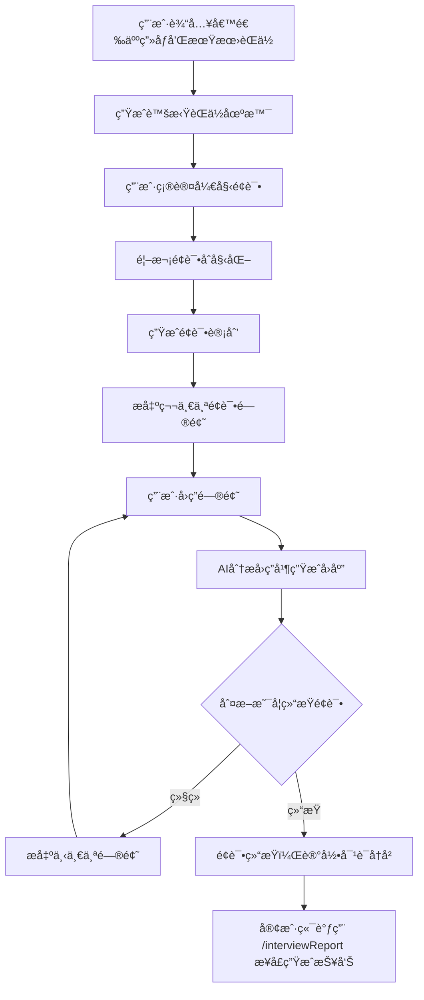

# 你是è°çš„询问
_Exported on 11/30/2025 at 10:38:29 GMT+8 from Cursor (2.1.39)_

---

**User**

你是è°

---

**Cursor**

我是 **Composer**，由 Cursor 训练的语言模å‹ï¼Œç”¨äºåœ¨ Cursor IDE 中å助编程。

我å¯ä»¥ï¼š
- 阅读和分æ代ç 
- å›ç­”编程问题
- æ供代ç å»ºè®®å’Œè§£é‡Š
- æœç´¢ä»£ç åº“
- å助调试和优化

你当å‰åœ¨ **ask 模å¼**（åªè¯»ï¼‰ï¼Œæˆ‘å¯ä»¥æŸ¥çœ‹å’Œåˆ†æ代ç ï¼Œä½†æ— æ³•ç›´æ¥ç¼–辑文件。如需修改代ç ï¼Œè¯·åˆ‡æ¢åˆ° **agent 模å¼**。

需è¦æˆ‘帮你åšä»€ä¹ˆï¼Ÿ

---

**User**

@specs 我这个文件夹下é¢å­˜æ”¾çš„是spec，但是我是ä¸æ˜¯è¿˜è¦ç»™ä»–建å­ç›®å½•ï¼ŸæŒ‰ç…§åŠŸèƒ½æ¥å»ºå­ç›®å½•ï¼Œè€Œä¸æ˜¯ç›´æ¥æŠŠæ‰€æœ‰çš„md文档都放到这个spec文件夹里é¢ï¼Ÿ

---

**Cursor**

让我先看看这些文件的内容，了解一下它们的功能分类。

基äºæ‚¨æ供的文件内容，我æ¥åˆ†æ一下您的 `specs` 文件夹的组织情况：

## 当å‰é—®é¢˜åˆ†æ

您说得很对ï¼ç›®å‰è¿™ä¸ª `specs` 文件夹确å®éœ€è¦æŒ‰åŠŸèƒ½å»ºç«‹å­ç›®å½•ã€‚ä»æ–‡ä»¶å†…容æ¥çœ‹ï¼Œè¿™äº›æ–‡æ¡£æ··åˆäº†ä»¥ä¸‹å‡ ç§ç±»å‹ï¼š

### 📊 当å‰æ–‡ä»¶åˆ†ç±»ï¼š

1. **功能规格文档**（Spec）
   - `interview-question-spec.md` - é¢è¯•é—®é¢˜ç”Ÿæˆè§„æ ¼
   - `evaluation-report-sepc.md` - 评估报告规格
   - `evaluation-report-minimal-spec.md` - 最å°åŒ–评估报告规格
   - `evaluation-report-ultra-simple-spec.md` - 超简化评估报告规格
   - `evaluation-report-ultra-simple-tasks.md` - 超简化评估任务
   - `virtual-interview-spec.md` - 虚拟é¢è¯•ç³»ç»Ÿå®Œæ•´è§„æ ¼

2. **修改总结文档**（Modification Summary）
   - `MODIFICATION_SUMMARY_identity_protection.md` - 身份ä¿æŠ¤æµ‹è¯•ä¿®æ”¹æ€»ç»“
   - `interview-followup-modification-summary.md` - 智能追问机制修改总结
   - `CHANGES_SUMMARY.md` - 修改总览
   - `modification-checklist.md` - 修改检查清å•

3. **测试相关文档**（Test Documentation）
   - `identity-protection-test-summary.md` - 身份ä¿æŠ¤æµ‹è¯•å®ç°æ€»ç»“

## 🯠建议的目录结æ„：

```
specs/
├── features/                      # 功能规格说æ˜
│   ├── interview/                # é¢è¯•ç›¸å…³
│   │   ├── interview-question-spec.md
│   │   └── virtual-interview-spec.md
│   └── evaluation/               # 评估报告相关
│       ├── evaluation-report-spec.md
│       ├── evaluation-report-minimal-spec.md
│       ├── evaluation-report-ultra-simple-spec.md
│       └── evaluation-report-ultra-simple-tasks.md
│
├── modifications/                 # 功能修改和å®ç°è®°å½•
│   ├── identity-protection/      # 身份ä¿æŠ¤åŠŸèƒ½
│   │   ├── MODIFICATION_SUMMARY_identity_protection.md
│   │   └── identity-protection-test-summary.md
│   └── interview-followup/       # 智能追问功能
│       ├── interview-followup-modification-summary.md
│       ├── CHANGES_SUMMARY.md
│       └── modification-checklist.md
│
└── README.md                      # 整个specs文件夹的索引和说æ˜
```

## 📋 更简化的方案（如æœæ–‡æ¡£ä¸å¤šï¼‰ï¼š

```
specs/
├── features/                      # 功能规格
│   ├── virtual-interview-spec.md
│   ├── interview-question-spec.md
│   └── evaluation-report-specs/  # 评估报告的多个版本放一起
│       ├── evaluation-report-spec.md
│       ├── minimal-spec.md
│       └── ultra-simple-spec.md
│
├── implementations/               # å®ç°å’Œä¿®æ”¹è®°å½•
│   ├── identity-protection/
│   │   ├── modification-summary.md
│   │   └── test-summary.md
│   └── interview-followup/
│       ├── modification-summary.md
│       └── changes-summary.md
│
└── README.md
```

## 💡 我的建议：

**采用第二个简化方案**，åŸå› æ˜¯ï¼š

1. **清晰的èŒè´£åˆ†ç¦»**：
   - `features/` - 功能规格（What - è¦åšä»€ä¹ˆï¼‰
   - `implementations/` - å®ç°è®°å½•ï¼ˆHow - æ€ä¹ˆåšçš„）

2. **便äºç»´æŠ¤**：
   - 新功能规格放 `features/`
   - å®ç°å®Œæˆå的总结放 `implementations/`
   - 按功能模å—建å­ç›®å½•

3. **便äºæŸ¥æ‰¾**：
   - 想了解功能定义 → 看 `features/`
   - 想了解å®ç°ç»†èŠ‚ → 看 `implementations/`

4. **éµå¾ª KISS åŸåˆ™**：
   - 两层目录结æ„，ä¸è¿‡åº¦å¤æ‚
   - 按需扩展，ç°åœ¨æ–‡æ¡£è¿˜ä¸ç®—太多

您觉得这个方案如何？需è¦æˆ‘帮您生æˆä¸€ä¸ª `README.md` æ¥è¯´æ˜è¿™ä¸ªç›®å½•ç»“æ„å—？

```plaintext
specs/
├── features/                      # 功能规格说æ˜
│   ├── interview/                # é¢è¯•ç›¸å…³
│   │   ├── interview-question-spec.md
│   │   └── virtual-interview-spec.md
│   └── evaluation/               # 评估报告相关
│       ├── evaluation-report-spec.md
│       ├── evaluation-report-minimal-spec.md
│       ├── evaluation-report-ultra-simple-spec.md
│       └── evaluation-report-ultra-simple-tasks.md
│
├── modifications/                 # 功能修改和å®ç°è®°å½•
│   ├── identity-protection/      # 身份ä¿æŠ¤åŠŸèƒ½
│   │   ├── MODIFICATION_SUMMARY_identity_protection.md
│   │   └── identity-protection-test-summary.md
│   └── interview-followup/       # 智能追问功能
│       ├── interview-followup-modification-summary.md
│       ├── CHANGES_SUMMARY.md
│       └── modification-checklist.md
│
└── README.md                      # 整个specs文件夹的索引和说æ˜
```

```plaintext
specs/
├── features/                      # 功能规格
│   ├── virtual-interview-spec.md
│   ├── interview-question-spec.md
│   └── evaluation-report-specs/  # 评估报告的多个版本放一起
│       ├── evaluation-report-spec.md
│       ├── minimal-spec.md
│       └── ultra-simple-spec.md
│
├── implementations/               # å®ç°å’Œä¿®æ”¹è®°å½•
│   ├── identity-protection/
│   │   ├── modification-summary.md
│   │   └── test-summary.md
│   └── interview-followup/
│       ├── modification-summary.md
│       └── changes-summary.md
│
└── README.md
```

---

**User**

specs下é¢åŠ å…¥features以åŠimplementations 这两个å­æ–‡ä»¶å¤¹ä½ è§‰å¾—是主æµåšæ³•å—？我认为主æµåšæ³•æ²¡è¿™ä¹ˆå¤æ‚å§ï¼Ÿä½ ä¸è¦æŒ‰ç…§æˆ‘的文档类å‹æ¥è¿›è¡Œåˆ†ç±»å¥½å—？我的ä¸ä¸€å®šå¯¹å‘€

---

**Cursor**

你说得对ï¼æˆ‘过度设计了。让我é‡æ–°æ€è€ƒä¸€ä¸‹ä¸šç•Œçš„主æµåšæ³•ã€‚

你说得对ï¼æˆ‘ç¡®å®è¿‡åº¦è®¾è®¡äº†ã€‚让我看看业界的主æµåšæ³•ï¼š

## 🌠业界主æµçš„ docs/specs 组织方å¼

大多数项目的åšæ³•å…¶å®**很简å•**：

### 1ï¸âƒ£ **最常è§ï¼šæŒ‰åŠŸèƒ½æ¨¡å—ç›´æ¥åˆ†æ–‡ä»¶å¤¹**
```
docs/
├── interview/           # é¢è¯•ç›¸å…³çš„所有文档
├── evaluation/          # 评估相关的所有文档
├── api/                 # API文档
└── deployment/          # 部署文档
```

### 2ï¸âƒ£ **中å°å‹é¡¹ç›®ï¼šç”šè‡³ä¸åˆ†å­ç›®å½•**
```
docs/
├── interview-spec.md
├── evaluation-spec.md
├── api-guide.md
└── README.md
```

## 💡 针对您的项目，我的新建议

看您的文件，主è¦å°±æ˜¯ä¸¤å¤§åŠŸèƒ½ï¼š**é¢è¯•ï¼ˆinterview）** å’Œ **评估报告（evaluation）**

**最简å•ç›´æ¥çš„åšæ³•ï¼š**

```
specs/
├── interview/                    # é¢è¯•åŠŸèƒ½ç›¸å…³
│   ├── virtual-interview-spec.md
│   ├── question-generation-spec.md
│   ├── followup-mechanism.md
│   └── identity-protection.md
│
├── evaluation/                   # 评估报告相关
│   ├── evaluation-report-spec.md
│   ├── minimal-spec.md
│   ├── ultra-simple-spec.md
│   └── ultra-simple-tasks.md
│
└── README.md                     # 索引
```

**åŸåˆ™ï¼š**
- ✅ 按**业务功能**分（interview / evaluation）
- ✅ ä¸ç®¡æ˜¯è§„æ ¼ã€ä¿®æ”¹è®°å½•ã€æµ‹è¯•æ–‡æ¡£ï¼Œåªè¦æ˜¯å…³äºé¢è¯•çš„，都放 `interview/`
- ✅ 简å•ã€ç›´è§‚ã€æ˜“找

这样是ä¸æ˜¯æ›´ç¬¦åˆä¸»æµåšæ³•ï¼Ÿ**按业务功能分类**，而ä¸æ˜¯æŒ‰æ–‡æ¡£æ€§è´¨ï¼ˆspec vs implementation）分类。

```plaintext
docs/
├── interview/           # é¢è¯•ç›¸å…³çš„所有文档
├── evaluation/          # 评估相关的所有文档
├── api/                 # API文档
└── deployment/          # 部署文档
```

```plaintext
docs/
├── interview-spec.md
├── evaluation-spec.md
├── api-guide.md
└── README.md
```

```plaintext
specs/
├── interview/                    # é¢è¯•åŠŸèƒ½ç›¸å…³
│   ├── virtual-interview-spec.md
│   ├── question-generation-spec.md
│   ├── followup-mechanism.md
│   └── identity-protection.md
│
├── evaluation/                   # 评估报告相关
│   ├── evaluation-report-spec.md
│   ├── minimal-spec.md
│   ├── ultra-simple-spec.md
│   └── ultra-simple-tasks.md
│
└── README.md                     # 索引
```

---

**User**

我å‘ç°Python项目里é¢æœ‰çš„时候命å是å°å†™å­—æ¯åŠ _分割，有的时候是å°å†™å­—æ¯åŠ ä¸­åˆ’线分隔就我ä¸å¤ªæ˜ç™½å‘€ï¼Œå°±æ˜¯åƒä»£ç çš„è¯æ˜¯_分割，而åƒæ–‡æ¡£ä¹‹ç±»æˆ–者是存放文档的文件夹都是中å‘ç°åˆ†å‰²å—？我这次有点迷糊呀。

---

**Cursor**

好问题ï¼è¿™ç¡®å®å®¹æ˜“混淆。让我给你梳ç†ä¸€ä¸‹ Python 项目中的命å规范：

## 📠Python 项目命å规范（业界标准）

### 1ï¸âƒ£ **Python 代ç æ–‡ä»¶å’Œæ¨¡å—**
```python
# ✅ 使用下划线 (snake_case)
user_service.py
virtual_interview.py
test_interview_flow.py
my_utils.py
```
**åŸå› **：Python 官方é£æ ¼æŒ‡å— PEP 8 规定，模å—å应该用å°å†™å­—æ¯+下划线

### 2ï¸âƒ£ **文档文件（Markdown 等）**
```markdown
# ✅ 使用中划线 (kebab-case) - 更常è§
interview-spec.md
user-guide.md
api-reference.md

# âš ï¸ ä¹Ÿå¯ä»¥ç”¨ä¸‹åˆ’线，但ä¸å¤ªä¸»æµ
interview_spec.md
```
**åŸå› **：
- 中划线在 URL 中更å‹å¥½ï¼ˆå¦‚ GitHubã€æ–‡æ¡£ç½‘站）
- 视觉上更清晰（é¿å…下划线被æŸäº›ç¼–辑器下划线éšè—）
- 业界文档的主æµåšæ³•

### 3ï¸âƒ£ **文件夹/目录å**
```bash
# Python 包目录 - 用下划线
project_code/
user_service/
test_cases/

# 文档目录 - 两ç§éƒ½å¸¸è§ï¼Œä½†ä¸­åˆ’线更æµè¡Œ
docs/
api-reference/     # ✅ æ¨è
user-guide/        # ✅ æ¨è

# 或者
api_reference/     # ✅ 也å¯ä»¥ï¼Œä½†ä¸å¦‚中划线æµè¡Œ
```

## 🯠**总结规则**

| ç±»å‹ | 命åé£æ ¼ | 示例 |
|------|---------|------|
| **Python 代ç ** | `snake_case` (下划线) | `user_service.py` |
| **Python 包/模å—目录** | `snake_case` (下划线) | `project_code/` |
| **Markdown 文档** | `kebab-case` (中划线) | `user-guide.md` |
| **文档目录** | `kebab-case` (中划线) ✅ æ¨è | `api-reference/` |
| **文档目录** | `snake_case` (下划线) âš ï¸ ä¹Ÿè¡Œ | `api_reference/` |

## 💡 **为什么会混用？**

```
项目结æ„示例：
cv-project/                    # 中划线（项目å）
├── project_code/              # 下划线（Python 代ç ç›®å½•ï¼‰
│   ├── user_service.py        # 下划线（Python 文件）
│   └── virtual_interview.py   # 下划线（Python 文件）
│
└── docs/
    ├── specs/
    │   ├── interview/         # 中划线或ä¸ç”¨éƒ½è¡Œï¼ˆçº¯æ–‡æ¡£ç›®å½•ï¼‰
    │   │   ├── virtual-interview-spec.md    # 中划线（文档文件）✅
    │   │   └── identity-protection-test.md  # 中划线（文档文件）✅
```

## 🯠**你的项目建议**

基äºä½ ç°åœ¨çš„结æ„：

```
specs/
├── interview/                              # 文档目录，å¯ä»¥ä¸ç”¨åˆ†éš”符
│   ├── virtual-interview-spec.md          # ✅ 文档用中划线
│   ├── question-generation-spec.md        # ✅ 文档用中划线
│   ├── identity-protection-test.md        # ✅ 文档用中划线
│   └── followup-modification-summary.md   # ✅ 文档用中划线
│
└── evaluation/
    ├── evaluation-report-spec.md          # ✅ 文档用中划线
    ├── minimal-spec.md                    # ✅ 文档用中划线
    └── ultra-simple-spec.md               # ✅ 文档用中划线
```

## 📌 **记忆å£è¯€**

- **代ç ç”¨ä¸‹åˆ’线** `_`（Python 规定）
- **文档用中划线** `-`（业界习惯）
- **混用没毛病**（åªè¦åŒç±»å‹ä¿æŒä¸€è‡´å³å¯ï¼‰

ä½ ç°åœ¨æ˜ç™½äº†å—？简å•è¯´å°±æ˜¯ï¼š**Python ä»£ç  = 下划线，文档 = 中划线**。

```python
# ✅ 使用下划线 (snake_case)
user_service.py
virtual_interview.py
test_interview_flow.py
my_utils.py
```

```markdown
# ✅ 使用中划线 (kebab-case) - 更常è§
interview-spec.md
user-guide.md
api-reference.md

# âš ï¸ ä¹Ÿå¯ä»¥ç”¨ä¸‹åˆ’线，但ä¸å¤ªä¸»æµ
interview_spec.md
```

```shellscript
# Python 包目录 - 用下划线
project_code/
user_service/
test_cases/

# 文档目录 - 两ç§éƒ½å¸¸è§ï¼Œä½†ä¸­åˆ’线更æµè¡Œ
docs/
api-reference/     # ✅ æ¨è
user-guide/        # ✅ æ¨è

# 或者
api_reference/     # ✅ 也å¯ä»¥ï¼Œä½†ä¸å¦‚中划线æµè¡Œ
```

```plaintext
项目结æ„示例：
cv-project/                    # 中划线（项目å）
├── project_code/              # 下划线（Python 代ç ç›®å½•ï¼‰
│   ├── user_service.py        # 下划线（Python 文件）
│   └── virtual_interview.py   # 下划线（Python 文件）
│
└── docs/
    ├── specs/
    │   ├── interview/         # 中划线或ä¸ç”¨éƒ½è¡Œï¼ˆçº¯æ–‡æ¡£ç›®å½•ï¼‰
    │   │   ├── virtual-interview-spec.md    # 中划线（文档文件）✅
    │   │   └── identity-protection-test.md  # 中划线（文档文件）✅
```

```plaintext
specs/
├── interview/                              # 文档目录，å¯ä»¥ä¸ç”¨åˆ†éš”符
│   ├── virtual-interview-spec.md          # ✅ 文档用中划线
│   ├── question-generation-spec.md        # ✅ 文档用中划线
│   ├── identity-protection-test.md        # ✅ 文档用中划线
│   └── followup-modification-summary.md   # ✅ 文档用中划线
│
└── evaluation/
    ├── evaluation-report-spec.md          # ✅ 文档用中划线
    ├── minimal-spec.md                    # ✅ 文档用中划线
    └── ultra-simple-spec.md               # ✅ 文档用中划线
```

---

**User**

@evaluation-report-sepc.md 这个文档是我的新的需求。@evaluation-report-ultra-simple-spec.md 这个文档呢，是我ç°æœ‰çš„代ç çš„内容，对此你能ä¸èƒ½å¸®æˆ‘看一下这个新需求相对äºåŸæœ‰çš„代ç çš„需求有什么å˜åŒ–å—？帮我梳ç†ä¸€ä¸‹å¯ä»¥å—？

---

**Cursor**

好的，让我帮你对比分æ一下新需求和ç°æœ‰åŠŸèƒ½çš„差异。

## 📊 需求对比分æ

### 🔠**ç°æœ‰åŠŸèƒ½** (`evaluation-report-ultra-simple-spec.md`)

**核心定ä½**：é¢è¯•å的综åˆèƒ½åŠ›è¯„ä¼°
- ✅ 自适应抽å–考核维度（技术能力ã€è½¯æŠ€èƒ½ã€æ–‡åŒ–匹é…）
- ✅ é€é¡¹æ‰“分评估（æ¯ä¸ªç»´åº¦ç‹¬ç«‹åˆ†æ）
- ✅ HR视角报告（评级T0-T4ã€äº®ç‚¹ã€é£é™©ï¼‰
- ✅ 候选人视角报告（优势ã€ä¸è¶³ã€æ”¹è¿›å»ºè®®ï¼‰
- ✅ 多模æ€åˆ†æ（外表ã€é£æ ¼ã€è¡Œä¸ºï¼‰

**工作æµç¨‹**：
```
é¢è¯•å¯¹è¯ → 抽å–维度 → é€é¡¹è¯„分 → HR总结 → å¤šæ¨¡æ€ â†’ 候选人报告
```

---

### 🆕 **新需求** (`evaluation-report-sepc.md`)

**核心定ä½**：èŒä¸šå‘展咨询 + 市场匹é…分æ
- 🆕 **å²—ä½é€‚é…度评分**（当å‰å²—ä½çš„匹é…度）
- 🆕 **其他岗ä½æ¨è**（横å‘/纵å‘å‘展 + æ¨è百分比 + ç†ç”±ï¼‰
- 🆕 **薪酬评估系统**（需è¦è”网检索市场数æ®ï¼‰
  - 市场行情分æ
  - ä¸åŒè§„模ä¼ä¸šè–ªé…¬èŒƒå›´
  - 候选人当å‰è–ªé…¬è¯„ä¼°
  - 薪酬æå‡è·¯å¾„
- 🆕 **预期管ç†ç³»ç»Ÿ**
  - 识别ä¸åˆç†é¢„期
  - æ¨èåˆé€‚的起始岗ä½çº§åˆ«
  - 特定薪资所需ç»éªŒå¹´é™
- 🆕 **性格深度分æ**（更具象化）
  - å²—ä½å¯¹æ€§æ ¼çš„è¦æ±‚
  - 候选人性格特å¾
  - 具象化的性格塑造建议
- 🆕 **æˆé•¿å»ºè®®**（更系统化）
  - 心æ€å»ºè®¾
  - 必备技能清å•
  - ä¸åŒä¼ä¸šè§„模的è¦æ±‚分æ

---

## 🔄 **核心å˜åŒ–总结**

### ✨ **æ–°å¢çš„é‡ç‚¹åŠŸèƒ½**

#### 1. **èŒä¸šè§„划导å‘** â­â­â­
```
ç°æœ‰ï¼šä¸»è¦è¯„ä¼°"这个岗ä½åˆä¸åˆé€‚"
新需求：ä¸ä»…评估当å‰å²—ä½ï¼Œè¿˜è¦æ¨è"你还å¯ä»¥åšä»€ä¹ˆ"
```

#### 2. **薪酬市场分æ** â­â­â­ï¼ˆæœ€å¤§å˜åŒ–）
```
ç°æœ‰ï¼šæ— è–ªé…¬ç›¸å…³åŠŸèƒ½
新需求：
  - 需è¦è”网检索市场数æ®
  - 分æä¸åŒè§„模ä¼ä¸šï¼ˆ500强/普通/åˆåˆ›ï¼‰çš„薪酬
  - 给出薪酬æå‡è·¯å¾„
  - 管ç†å€™é€‰äººè–ªé…¬é¢„期
```

#### 3. **预期管ç†ç³»ç»Ÿ** â­â­â­
```
ç°æœ‰ï¼šæ— 
新需求：识别候选人的"ä¸åˆç†é¢„期"，帮助其认清ç°å®
  例如：应届生期望30K → 分æ市场ç°å® → 建议åˆç†é¢„期
```

#### 4. **å²—ä½æ¨è算法** â­â­
```
ç°æœ‰ï¼šæ— 
新需求：基äºå€™é€‰äººèƒ½åŠ›ï¼Œæ¨è其他适åˆçš„å²—ä½
  - 横å‘å‘展（åŒçº§åˆ«å…¶ä»–å²—ä½ï¼‰
  - 纵å‘å‘展（晋å‡è·¯å¾„）
  - 给出æ¨è百分比和ç†ç”±
```

---

## 📋 **功能对比表**

| åŠŸèƒ½æ¨¡å— | ç°æœ‰åŠŸèƒ½ | 新需求 | å˜åŒ–程度 |
|---------|---------|--------|---------|
| **能力评估** | ✅ 有（硬技能+软技能+文化匹é…） | ✅ ä¿ç•™ + 扩展 | 🔵 å¢å¼º |
| **HR报告** | ✅ 有（亮点ã€é£é™©ã€è¯„级） | ✅ ä¿ç•™ | ✅ ä¸å˜ |
| **候选人报告** | ✅ 有（优势ã€ä¸è¶³ã€å»ºè®®ï¼‰ | ✅ ä¿ç•™ + 扩展 | 🔵 å¢å¼º |
| **å²—ä½é€‚é…度** | âš ï¸ éƒ¨åˆ†ï¼ˆåªæœ‰è¯„级） | 🆕 æ˜ç¡®è¯„分 | 🟢 æ–°å¢ |
| **其他岗ä½æ¨è** | ⌠无 | 🆕 横å‘/纵å‘æ¨è | 🟢 æ–°å¢ |
| **薪酬评估** | ⌠无 | 🆕 市场分æ+è”网检索 | 🟢 æ–°å¢ |
| **预期管ç†** | ⌠无 | 🆕 识别ä¸åˆç†é¢„期 | 🟢 æ–°å¢ |
| **性格分æ** | âš ï¸ éƒ¨åˆ†ï¼ˆåœ¨è½¯æŠ€èƒ½ä¸­ï¼‰ | 🆕 独立模å—+具象化 | 🔵 å¢å¼º |
| **æˆé•¿å»ºè®®** | ✅ 有（短期/长期行动） | 🆕 更系统化（心æ€+技能+路径） | 🔵 å¢å¼º |
| **多模æ€åˆ†æ** | ✅ 有（外表ã€é£æ ¼ï¼‰ | ⓠ未æåŠ | âš ï¸ å¾…ç¡®è®¤ |

---

## 🯠**技术å®ç°å±‚é¢çš„å˜åŒ–**

### 1. **需è¦æ–°å¢å¤–部API调用** 🔴 é‡è¦
```python
# ç°æœ‰ï¼šåªè°ƒç”¨å†…部LLM
model = "qwen-plus"

# 新需求：需è¦è”网检索薪酬数æ®
- 薪酬数æ®API（智è”æ‹›è˜/å‰ç¨‹æ— å¿§/第三方数æ®ï¼‰
- 或者使用LLMçš„è”网æœç´¢èƒ½åŠ›ï¼ˆå¦‚Qwençš„search工具）
```

### 2. **LLM调用次数å¢åŠ **
```python
# ç°æœ‰ï¼š3+N次（N=5-10个维度）
# 新需求：å¯èƒ½éœ€è¦ 5+N+M 次
#   +1 å²—ä½æ¨è分æ
#   +1 薪酬市场分æ
#   +M æ¯ä¸ªæ¨èå²—ä½çš„适é…分æ
```

### 3. **需è¦æ–°çš„Prompt模æ¿**
```
æ–°å¢Prompt：
- å²—ä½æ¨èprompt（横å‘/纵å‘分æ）
- 薪酬评估prompt（市场行情 + 个人定价）
- 预期管ç†prompt（识别ä¸åˆç†é¢„期）
- 性格具象化分æprompt
```

### 4. **å¯èƒ½éœ€è¦æ–°çš„算法逻辑**
```python
# 新需求中æ到：
- å²—ä½åŒ¹é…算法
- 适é…度评分算法

# å¯èƒ½éœ€è¦å®ç°ï¼š
def calculate_job_match_score(candidate_skills, job_requirements):
    """计算岗ä½é€‚é…度"""
    
def recommend_alternative_jobs(candidate_profile, current_jd):
    """æ¨è其他岗ä½"""
    
def analyze_salary_expectation(candidate_exp, market_data):
    """薪酬åˆç†æ€§åˆ†æ"""
```

---

## 🚧 **å®ç°éš¾ç‚¹å’ŒæŒ‘战**

### 1. **薪酬数æ®è·å–** 🔴 最大挑战
- 需è¦å¯é çš„薪酬数æ®æº
- æ•°æ®å®æ—¶æ€§è¦æ±‚
- ä¸åŒåŸå¸‚/行业的差异

### 2. **å²—ä½æ¨è的准确性**
- 如何判断"横å‘/纵å‘"å²—ä½ï¼Ÿ
- æ¨è百分比的计算ä¾æ®ï¼Ÿ
- 需è¦å²—ä½çŸ¥è¯†åº“支æŒ

### 3. **预期管ç†çš„åˆç†æ€§**
- 如何判断预期是å¦"ä¸åˆç†"？
- 如何给出建设性建议而ä¸æ‰“击积æ性？

---

## 💡 **我的建议**

### 方案A：分阶段å®ç° ✅ æ¨è
```
阶段1：å¢å¼ºç°æœ‰åŠŸèƒ½
  - å²—ä½é€‚é…度æ˜ç¡®è¯„分
  - 性格分æ独立模å—化
  - æˆé•¿å»ºè®®æ›´ç³»ç»ŸåŒ–

阶段2：新å¢èŒä¸šè§„划功能
  - å²—ä½æ¨è（基äºLLMæ¨ç†ï¼Œæ— éœ€å¤æ‚算法）
  - 预期管ç†ï¼ˆåŸºäºå¸¸è¯†åˆ¤æ–­ï¼‰

阶段3：集æˆå¸‚场数æ®
  - 薪酬分æ（需è¦å¤–部数æ®æºï¼‰
  - 市场行情对比
```

### 方案B：简化薪酬功能
```
ä¸è”网检索真å®æ•°æ®ï¼Œè€Œæ˜¯ï¼š
- 基äºLLM的常识和知识库给出"å‚考范围"
- æ˜ç¡®æ ‡æ³¨"ä»…ä¾›å‚考，éå®æ—¶æ•°æ®"
- é™ä½å®ç°å¤æ‚度，但功能打折扣
```

---

你觉得这个分ææ€ä¹ˆæ ·ï¼Ÿéœ€è¦æˆ‘详细展开æŸä¸ªå…·ä½“çš„å˜åŒ–点å—？或者你想先确认一下新需求中哪些功能是**å¿…é¡»è¦æœ‰çš„**，哪些是**å¯ä»¥å续迭代的**？

```plaintext
é¢è¯•å¯¹è¯ → 抽å–维度 → é€é¡¹è¯„分 → HR总结 → å¤šæ¨¡æ€ â†’ 候选人报告
```

```plaintext
ç°æœ‰ï¼šä¸»è¦è¯„ä¼°"这个岗ä½åˆä¸åˆé€‚"
新需求：ä¸ä»…评估当å‰å²—ä½ï¼Œè¿˜è¦æ¨è"你还å¯ä»¥åšä»€ä¹ˆ"
```

```plaintext
ç°æœ‰ï¼šæ— è–ªé…¬ç›¸å…³åŠŸèƒ½
新需求：
  - 需è¦è”网检索市场数æ®
  - 分æä¸åŒè§„模ä¼ä¸šï¼ˆ500强/普通/åˆåˆ›ï¼‰çš„薪酬
  - 给出薪酬æå‡è·¯å¾„
  - 管ç†å€™é€‰äººè–ªé…¬é¢„期
```

```plaintext
ç°æœ‰ï¼šæ— 
新需求：识别候选人的"ä¸åˆç†é¢„期"，帮助其认清ç°å®
  例如：应届生期望30K → 分æ市场ç°å® → 建议åˆç†é¢„期
```

```plaintext
ç°æœ‰ï¼šæ— 
新需求：基äºå€™é€‰äººèƒ½åŠ›ï¼Œæ¨è其他适åˆçš„å²—ä½
  - 横å‘å‘展（åŒçº§åˆ«å…¶ä»–å²—ä½ï¼‰
  - 纵å‘å‘展（晋å‡è·¯å¾„）
  - 给出æ¨è百分比和ç†ç”±
```

```python
# ç°æœ‰ï¼šåªè°ƒç”¨å†…部LLM
model = "qwen-plus"

# 新需求：需è¦è”网检索薪酬数æ®
- 薪酬数æ®API（智è”æ‹›è˜/å‰ç¨‹æ— å¿§/第三方数æ®ï¼‰
- 或者使用LLMçš„è”网æœç´¢èƒ½åŠ›ï¼ˆå¦‚Qwençš„search工具）
```

```python
# ç°æœ‰ï¼š3+N次（N=5-10个维度）
# 新需求：å¯èƒ½éœ€è¦ 5+N+M 次
#   +1 å²—ä½æ¨è分æ
#   +1 薪酬市场分æ
#   +M æ¯ä¸ªæ¨èå²—ä½çš„适é…分æ
```

```plaintext
æ–°å¢Prompt：
- å²—ä½æ¨èprompt（横å‘/纵å‘分æ）
- 薪酬评估prompt（市场行情 + 个人定价）
- 预期管ç†prompt（识别ä¸åˆç†é¢„期）
- 性格具象化分æprompt
```

```python
# 新需求中æ到：
- å²—ä½åŒ¹é…算法
- 适é…度评分算法

# å¯èƒ½éœ€è¦å®ç°ï¼š
def calculate_job_match_score(candidate_skills, job_requirements):
    """计算岗ä½é€‚é…度"""
    
def recommend_alternative_jobs(candidate_profile, current_jd):
    """æ¨è其他岗ä½"""
    
def analyze_salary_expectation(candidate_exp, market_data):
    """薪酬åˆç†æ€§åˆ†æ"""
```

```plaintext
阶段1：å¢å¼ºç°æœ‰åŠŸèƒ½
  - å²—ä½é€‚é…度æ˜ç¡®è¯„分
  - 性格分æ独立模å—化
  - æˆé•¿å»ºè®®æ›´ç³»ç»ŸåŒ–

阶段2：新å¢èŒä¸šè§„划功能
  - å²—ä½æ¨è（基äºLLMæ¨ç†ï¼Œæ— éœ€å¤æ‚算法）
  - 预期管ç†ï¼ˆåŸºäºå¸¸è¯†åˆ¤æ–­ï¼‰

阶段3：集æˆå¸‚场数æ®
  - 薪酬分æ（需è¦å¤–部数æ®æºï¼‰
  - 市场行情对比
```

```plaintext
ä¸è”网检索真å®æ•°æ®ï¼Œè€Œæ˜¯ï¼š
- 基äºLLM的常识和知识库给出"å‚考范围"
- æ˜ç¡®æ ‡æ³¨"ä»…ä¾›å‚考，éå®æ—¶æ•°æ®"
- é™ä½å®ç°å¤æ‚度，但功能打折扣
```

---

**User**

我认为æœç´¢è–ªé…¬çš„时候直æ¥ä½¿ç”¨LLMçš„è”网æœç´¢èƒ½åŠ›ï¼ˆå¦‚Qwençš„search工具）就行


此外，我觉得你的方案a里é¢çš„第一阶段跟第二阶段é常ä¸é”™ï¼Œæˆ‘们ç°åœ¨å°±æŒ‰ç…§ç¬¬ä¸€é˜¶æ®µè·Ÿç¬¬äºŒé˜¶æ®µæ¥è¿›è¡Œæˆ‘们æ¥ä¸‹æ¥çš„方案å¯ä»¥å—？


因此的è¯ï¼ŒåŸºäºæˆ‘们之å‰å¯¹è¯ä½ å¾—到的信æ¯æ¥å¸®æˆ‘在这个spec@evaluation-report-ultra-simple-spec.md 上é¢è¿›è¡Œä¿®æ”¹å¯ä»¥å—？就是è入我们æ出的新的功能并且å¢å¼ºå·²æœ‰çš„功能。é£æ ¼å’Œå†…容 以åŠè¦æ±‚ ä¾ç„¶ å’Œ@evaluation-report-ultra-simple-spec.md ä¿æŒä¸€è‡´ã€‚ 

那么ç°åœ¨å‘¢ï¼Ÿä½ å°±å¯ä»¥å¼€å§‹å¸®æˆ‘修改了。并且修改完以å告诉我你修改了哪些点方便我double check。 

---

**Cursor**

好的ï¼æˆ‘ç°åœ¨å¼€å§‹ä¿®æ”¹ `evaluation-report-ultra-simple-spec.md`，è入阶段1和阶段2的新功能。

让我先仔细看一下ç°æœ‰æ–‡æ¡£çš„完整内容，然å进行修改。

ç°åœ¨å¼€å§‹ä¿®æ”¹æ–‡æ¡£ï¼Œè入新功能：

```markdown
# AIé¢è¯•è¯„估报告系统规范（基äºGolden代ç ï¼‰

## 🯠核心æ€è·¯

**多步骤深度分æ**：自适应抽å–考核维度 → é€é¡¹æ‰“分评估 → å²—ä½é€‚é…度分æ → 性格深度分æ → èŒä¸šå‘展规划 → 薪酬市场评估 → 综åˆæ€»ç»“报告 → 多模æ€é£æ ¼åˆ†æ → 候选人å馈

## 📋 核心功能

### 输入
- é¢è¯•å¯¹è¯è®°å½•ï¼ˆtranscript）
- å²—ä½æ述（JD）
- 视频/图片URL（url_list）
- é¢è¯•è¯­è¨€ï¼ˆinterview_language）

### 输出
- HR视角：综åˆè¯„分ã€äº®ç‚¹ã€é£é™©ã€è¯„级（T0~T4）
- 候选人视角：优势ã€ä¸è¶³ã€çŸ­æœŸ/长期改进建议
- 多模æ€ï¼šé£æ ¼æ ‡ç­¾ã€å½¢è±¡è¯„分ã€è¡Œä¸ºæ£€æµ‹

### 处ç†æ–¹å¼
- **3+N次AI调用**（N=考核维度数é‡ï¼Œé€šå¸¸5-10个）
- 自适应抽å–维度，é€é¡¹ç‹¬ç«‹è¯„分
- 多模æ€åˆ†æ（支æŒè§†é¢‘/图片）

## 💻 核心å®ç°

### 文件结æ„
```
service/
├── AIInterviewAssessor.py    # 核心æœåŠ¡ï¼ˆ327行）
└── multimodal_report.py       # 多模æ€åˆ†æ（100行）
routers/
└── interview_report_router.py # API路由（97行）
```

### 核心æµç¨‹ï¼ˆ5步）
```python
def generate_report(transcript, jd, interview_id, url_list, is_mp4, language):
    # 步骤1: 抽å–考核维度 (1次AI调用)
    competencies = _extract_competencies(jd, transcript)
    # 输出: {hard_skills: [...], soft_skills: [...], cultural_fit: [...]}
    
    # 步骤2: é€é¡¹èƒ½åŠ›è¯„ä¼° (N次AI调用)
    for competency in all_competency_keys:
        result = _analyze_single_competency(competency, transcript)
        # 输出: {score: 85, rationale: "...", evidence_quotes: [...]}
    
    # 步骤3: 生æˆHR总结 (1次AI调用)
    summary = _generate_final_summary(detailed_analysis)
    # 输出: {highlights: "...", risks: "...", conclusion: "T2-胜任..."}
    
    # 步骤4: 多模æ€åˆ†æ (1次AI调用, qwen-vl-max-latest)
    style = style_report(url_list, interview_id, is_mp4, language)
    # 输出: {style: "èŒä¸šå¹²ç»ƒ", description: "...", appearance: "82分..."}
    
    # 步骤5: 生æˆå€™é€‰äººæŠ¥å‘Š (1次AI调用)
    user_report = _user_report(jd, transcript, hr_report)
    # 输出: {highlights, insufficient, short_term_actions, long_term_actions, ...}
    
    # èšåˆæœ€ç»ˆæŠ¥å‘Š → 存入数æ®åº“
    return final_report
```

## 🌠APIæ¥å£

**POST** `/interviewReport`

### 请求
```json
{
  "interview_id": "123456",
  "transcript": [
    {"role": "interviewer", "content": "介ç»ä½ çš„Pythonç»éªŒ", "timestamp": 1},
    {"role": "candidate", "content": "我有3å¹´Pythonå¼€å‘ç»éªŒ...", "timestamp": 2}
  ],
  "jd": "å²—ä½èŒè´£ï¼š\n1. å端开å‘\nä»»èŒè¦æ±‚：\n1. 3å¹´Pythonç»éªŒ",
  "interview_language": "zhongwen",
  "p_url": ["http://example.com/img1.png"],  // 图片URL
  "v_url": ["http://example.com/video.mp4"]   // 视频URL
}
```

### å“应（立å³è¿”å›ï¼Œåå°å¼‚步生æˆï¼‰
```json
{
  "code": 0,
  "message": "success",
  "data": ""
}
```

### 最终报告结æ„（存入数æ®åº“）
```json
{
  "overall_assessment": {
    "match_score": 78.5,
    "conclusion": "T2-胜任，定义：符åˆé¢„期。建议录用。",
    "highlights": "技术基础æ‰å®ï¼Œæ²Ÿé€šæ¸…æ™°",
    "potential_risks": "缺ä¹æ¶æ„ç»éªŒ"
  },
  "detailed_analysis": [
    {
      "competency": "Pythonå¼€å‘能力",
      "score": 85,
      "rationale": "æ‰å®çš„å¼€å‘基础，熟悉Django框æ¶",
      "evidence_quotes": ["我主导了订å•ç³»ç»Ÿå¼€å‘", "æ—¥å‡100万请求é‡"]
    }
  ],
  "competency_model_used": {
    "hard_skills": ["Pythonå¼€å‘", "æ•°æ®åº“设计"],
    "soft_skills": ["沟通能力"],
    "cultural_fit": ["学习æ€åº¦"]
  },
  "style_report": {
    "style": "èŒä¸šå¹²ç»ƒ",
    "description": "眼ç¥è‡ªä¿¡ï¼Œç€è£…得体",
    "behavior": "未å‘ç°å¼‚常",
    "appearance": "82分。五官端正，正装整æ´"
  },
  "user_report": {
    "highlights": "你的技术表达清晰...",
    "insufficient": "æ¶æ„设计å¯ä»¥æ›´æœ‰æ¡ç†...",
    "short_term_actions": ["æ¯å¤©ç»ƒä¹ 1个算法题", "准备3个STARè¯æœ¯"],
    "long_term_actions": ["学习分布å¼ç³»ç»Ÿ", "å‚ä¸å¼€æºé¡¹ç›®"],
    "Quantitative": "æ¯å‘¨2次模拟é¢è¯•ï¼Œè®°å½•æ”¹è¿›ç‚¹",
    "career_advice": "å‘高级工程师å‘展，补充æ¶æ„能力",
    "other": "ä¿æŒå­¦ä¹ èŠ‚å¥ï¼Œ3年内å¯æˆé•¿ä¸ºæ¶æ„师"
  }
}
```

## 🔧 技术细节

### LLMé…ç½®
```python
# 文本分æ模å‹
model = "qwen-plus"
temperature = 0.3
seed = 6
response_format = {"type": "json_object"}

# 多模æ€æ¨¡å‹
multimodal_model = "qwen-vl-max-latest"
```

### é‡è¦æœºåˆ¶
- **é‡è¯•æœºåˆ¶**：关键AI调用失败自动é‡è¯•1次
- **多模æ€ä¿åº•**：视频分æ失败é™çº§ä¸ºæ–‡æœ¬åˆ†æ
- **异步处ç†**：FastAPI BackgroundTasksåå°ç”Ÿæˆ
- **防é‡å¤**：10分钟内åŒinterview_idä¸é‡å¤ç”Ÿæˆ

### 支æŒçš„语言
zhongwenã€yingwenã€riyuã€hanyuã€xibanyayuã€yinniyuã€fayuã€deyuã€taiyu

## 📊 关键指标

- **AI调用次数**：通常8-15次（3固定 + 5-10维度评估）
- **生æˆè€—æ—¶**：3-5分钟
- **æˆåŠŸç‡**：>95%（多层é‡è¯•ä¿éšœï¼‰
- **评级体系**：T0å“越 / T1娴熟 / T2胜任 / T3待培养 / T4å·®è·è¾ƒå¤§

---

**核心åŸåˆ™**ï¼šè‡ªé€‚åº”ç»´åº¦æŠ½å– + é€é¡¹ç‹¬ç«‹è¯„ä¼° + åŒè§†è§’报告 + 多模æ€å¢å¼º
```

```markdown
# AIé¢è¯•è¯„估报告系统规范（基äºGolden代ç ï¼‰

## 🯠核心æ€è·¯

**多步骤深度分æ**：自适应抽å–考核维度 → é€é¡¹æ‰“分评估 → å²—ä½é€‚é…度分æ → 性格深度分æ → èŒä¸šå‘展规划 → 薪酬市场评估 → 综åˆæ€»ç»“报告 → 多模æ€é£æ ¼åˆ†æ → 候选人å馈

## 📋 核心功能

### 输入
- é¢è¯•å¯¹è¯è®°å½•ï¼ˆtranscript）
- å²—ä½æ述（JD）
- 视频/图片URL（url_list）
- é¢è¯•è¯­è¨€ï¼ˆinterview_language）

### 输出
- **HR视角**：综åˆè¯„分ã€äº®ç‚¹ã€é£é™©ã€è¯„级（T0~T4）
- **候选人视角**：优势ã€ä¸è¶³ã€çŸ­æœŸ/长期改进建议
- **å²—ä½é€‚é…度**：当å‰å²—ä½åŒ¹é…分值ã€èƒ½åŠ›å·®è·åˆ†æ
- **èŒä¸šå‘展**：横å‘/纵å‘å²—ä½æ¨è + æ¨è百分比 + æ¨èç†ç”±
- **性格分æ**：岗ä½æ€§æ ¼è¦æ±‚ã€å€™é€‰äººæ€§æ ¼ç‰¹å¾ã€å…·è±¡åŒ–塑造建议
- **薪酬评估**：市场行情分æã€ä¸åŒè§„模ä¼ä¸šè–ªé…¬èŒƒå›´ã€å€™é€‰äººå½“å‰è–ªé…¬è¯„ä¼°ã€è–ªé…¬æå‡è·¯å¾„
- **预期管ç†**：识别ä¸åˆç†é¢„期ã€æ¨èåˆé€‚起始岗ä½çº§åˆ«ã€ç‰¹å®šè–ªèµ„所需ç»éªŒå¹´é™
- **æˆé•¿å»ºè®®**：心æ€å»ºè®¾ã€å¿…备技能清å•ã€ä¸åŒä¼ä¸šè§„模è¦æ±‚分æã€å­¦ä¹ æå‡æ–¹å‘
- **多模æ€**：é£æ ¼æ ‡ç­¾ã€å½¢è±¡è¯„分ã€è¡Œä¸ºæ£€æµ‹

### 处ç†æ–¹å¼
- **3+N次AI调用**（N=考核维度数é‡ï¼Œé€šå¸¸5-10个）
- 自适应抽å–维度，é€é¡¹ç‹¬ç«‹è¯„分
- 多模æ€åˆ†æ（支æŒè§†é¢‘/图片）

## 💻 核心å®ç°

### 文件结æ„
```
service/
├── AIInterviewAssessor.py    # 核心æœåŠ¡ï¼ˆ327行）
└── multimodal_report.py       # 多模æ€åˆ†æ（100行）
routers/
└── interview_report_router.py # API路由（97行）
```

### 核心æµç¨‹ï¼ˆ5步）
```python
def generate_report(transcript, jd, interview_id, url_list, is_mp4, language):
    # 步骤1: 抽å–考核维度 (1次AI调用)
    competencies = _extract_competencies(jd, transcript)
    # 输出: {hard_skills: [...], soft_skills: [...], cultural_fit: [...]}
    
    # 步骤2: é€é¡¹èƒ½åŠ›è¯„ä¼° (N次AI调用)
    for competency in all_competency_keys:
        result = _analyze_single_competency(competency, transcript)
        # 输出: {score: 85, rationale: "...", evidence_quotes: [...]}
    
    # 步骤3: 生æˆHR总结 (1次AI调用)
    summary = _generate_final_summary(detailed_analysis)
    # 输出: {highlights: "...", risks: "...", conclusion: "T2-胜任..."}
    
    # 步骤4: 多模æ€åˆ†æ (1次AI调用, qwen-vl-max-latest)
    style = style_report(url_list, interview_id, is_mp4, language)
    # 输出: {style: "èŒä¸šå¹²ç»ƒ", description: "...", appearance: "82分..."}
    
    # 步骤5: 生æˆå€™é€‰äººæŠ¥å‘Š (1次AI调用)
    user_report = _user_report(jd, transcript, hr_report)
    # 输出: {highlights, insufficient, short_term_actions, long_term_actions, ...}
    
    # èšåˆæœ€ç»ˆæŠ¥å‘Š → 存入数æ®åº“
    return final_report
```

## 🌠APIæ¥å£

**POST** `/interviewReport`

### 请求
```json
{
  "interview_id": "123456",
  "transcript": [
    {"role": "interviewer", "content": "介ç»ä½ çš„Pythonç»éªŒ", "timestamp": 1},
    {"role": "candidate", "content": "我有3å¹´Pythonå¼€å‘ç»éªŒ...", "timestamp": 2}
  ],
  "jd": "å²—ä½èŒè´£ï¼š\n1. å端开å‘\nä»»èŒè¦æ±‚：\n1. 3å¹´Pythonç»éªŒ",
  "interview_language": "zhongwen",
  "p_url": ["http://example.com/img1.png"],  // 图片URL
  "v_url": ["http://example.com/video.mp4"]   // 视频URL
}
```

### å“应（立å³è¿”å›ï¼Œåå°å¼‚步生æˆï¼‰
```json
{
  "code": 0,
  "message": "success",
  "data": ""
}
```

### 最终报告结æ„（存入数æ®åº“）
```json
{
  "overall_assessment": {
    "match_score": 78.5,
    "conclusion": "T2-胜任，定义：符åˆé¢„期。建议录用。",
    "highlights": "技术基础æ‰å®ï¼Œæ²Ÿé€šæ¸…æ™°",
    "potential_risks": "缺ä¹æ¶æ„ç»éªŒ"
  },
  "detailed_analysis": [
    {
      "competency": "Pythonå¼€å‘能力",
      "score": 85,
      "rationale": "æ‰å®çš„å¼€å‘基础，熟悉Django框æ¶",
      "evidence_quotes": ["我主导了订å•ç³»ç»Ÿå¼€å‘", "æ—¥å‡100万请求é‡"]
    }
  ],
  "competency_model_used": {
    "hard_skills": ["Pythonå¼€å‘", "æ•°æ®åº“设计"],
    "soft_skills": ["沟通能力"],
    "cultural_fit": ["学习æ€åº¦"]
  },
  "style_report": {
    "style": "èŒä¸šå¹²ç»ƒ",
    "description": "眼ç¥è‡ªä¿¡ï¼Œç€è£…得体",
    "behavior": "未å‘ç°å¼‚常",
    "appearance": "82分。五官端正，正装整æ´"
  },
  "user_report": {
    "highlights": "你的技术表达清晰...",
    "insufficient": "æ¶æ„设计å¯ä»¥æ›´æœ‰æ¡ç†...",
    "short_term_actions": ["æ¯å¤©ç»ƒä¹ 1个算法题", "准备3个STARè¯æœ¯"],
    "long_term_actions": ["学习分布å¼ç³»ç»Ÿ", "å‚ä¸å¼€æºé¡¹ç›®"],
    "Quantitative": "æ¯å‘¨2次模拟é¢è¯•ï¼Œè®°å½•æ”¹è¿›ç‚¹",
    "career_advice": "å‘高级工程师å‘展，补充æ¶æ„能力",
    "other": "ä¿æŒå­¦ä¹ èŠ‚å¥ï¼Œ3年内å¯æˆé•¿ä¸ºæ¶æ„师"
  }
}
```

## 🔧 技术细节

### LLMé…ç½®
```python
# 文本分æ模å‹
model = "qwen-plus"
temperature = 0.3
seed = 6
response_format = {"type": "json_object"}

# 多模æ€æ¨¡å‹
multimodal_model = "qwen-vl-max-latest"
```

### é‡è¦æœºåˆ¶
- **é‡è¯•æœºåˆ¶**：关键AI调用失败自动é‡è¯•1次
- **多模æ€ä¿åº•**：视频分æ失败é™çº§ä¸ºæ–‡æœ¬åˆ†æ
- **异步处ç†**：FastAPI BackgroundTasksåå°ç”Ÿæˆ
- **防é‡å¤**：10分钟内åŒinterview_idä¸é‡å¤ç”Ÿæˆ

### 支æŒçš„语言
zhongwenã€yingwenã€riyuã€hanyuã€xibanyayuã€yinniyuã€fayuã€deyuã€taiyu

## 📊 关键指标

- **AI调用次数**：通常8-15次（3固定 + 5-10维度评估）
- **生æˆè€—æ—¶**：3-5分钟
- **æˆåŠŸç‡**：>95%（多层é‡è¯•ä¿éšœï¼‰
- **评级体系**：T0å“越 / T1娴熟 / T2胜任 / T3待培养 / T4å·®è·è¾ƒå¤§

---

**核心åŸåˆ™**ï¼šè‡ªé€‚åº”ç»´åº¦æŠ½å– + é€é¡¹ç‹¬ç«‹è¯„ä¼° + åŒè§†è§’报告 + 多模æ€å¢å¼º
```

```markdown
# AIé¢è¯•è¯„估报告系统规范（基äºGolden代ç ï¼‰

## 🯠核心æ€è·¯

**多步骤深度分æ**：自适应抽å–考核维度 → é€é¡¹æ‰“分评估 → å²—ä½é€‚é…度分æ → 性格深度分æ → èŒä¸šå‘展规划 → 薪酬市场评估 → 综åˆæ€»ç»“报告 → 多模æ€é£æ ¼åˆ†æ → 候选人å馈

## 📋 核心功能

### 输入
- é¢è¯•å¯¹è¯è®°å½•ï¼ˆtranscript）
- å²—ä½æ述（JD）
- 视频/图片URL（url_list）
- é¢è¯•è¯­è¨€ï¼ˆinterview_language）

### 输出
- **HR视角**：综åˆè¯„分ã€äº®ç‚¹ã€é£é™©ã€è¯„级（T0~T4）
- **候选人视角**：优势ã€ä¸è¶³ã€çŸ­æœŸ/长期改进建议
- **å²—ä½é€‚é…度**：当å‰å²—ä½åŒ¹é…分值ã€èƒ½åŠ›å·®è·åˆ†æ
- **èŒä¸šå‘展**：横å‘/纵å‘å²—ä½æ¨è + æ¨è百分比 + æ¨èç†ç”±
- **性格分æ**：岗ä½æ€§æ ¼è¦æ±‚ã€å€™é€‰äººæ€§æ ¼ç‰¹å¾ã€å…·è±¡åŒ–塑造建议
- **薪酬评估**：市场行情分æã€ä¸åŒè§„模ä¼ä¸šè–ªé…¬èŒƒå›´ã€å€™é€‰äººå½“å‰è–ªé…¬è¯„ä¼°ã€è–ªé…¬æå‡è·¯å¾„
- **预期管ç†**：识别ä¸åˆç†é¢„期ã€æ¨èåˆé€‚起始岗ä½çº§åˆ«ã€ç‰¹å®šè–ªèµ„所需ç»éªŒå¹´é™
- **æˆé•¿å»ºè®®**：心æ€å»ºè®¾ã€å¿…备技能清å•ã€ä¸åŒä¼ä¸šè§„模è¦æ±‚分æã€å­¦ä¹ æå‡æ–¹å‘
- **多模æ€**：é£æ ¼æ ‡ç­¾ã€å½¢è±¡è¯„分ã€è¡Œä¸ºæ£€æµ‹

### 处ç†æ–¹å¼
- **7+N次AI调用**（N=考核维度数é‡ï¼Œé€šå¸¸5-10个）
- 自适应抽å–维度，é€é¡¹ç‹¬ç«‹è¯„分
- å²—ä½é€‚é…度分æ + èŒä¸šå‘展规划（1次AI调用）
- 性格深度分æ（1次AI调用）
- 薪酬市场评估（1次AI调用，使用Qwenè”网æœç´¢èƒ½åŠ›ï¼‰
- 预期管ç†åˆ†æ（è入薪酬评估中）
- 多模æ€åˆ†æ（支æŒè§†é¢‘/图片）

## 💻 核心å®ç°

### 文件结æ„
```
service/
├── AIInterviewAssessor.py    # 核心æœåŠ¡ï¼ˆ327行）
└── multimodal_report.py       # 多模æ€åˆ†æ（100行）
routers/
└── interview_report_router.py # API路由（97行）
```

### 核心æµç¨‹ï¼ˆ5步）
```python
def generate_report(transcript, jd, interview_id, url_list, is_mp4, language):
    # 步骤1: 抽å–考核维度 (1次AI调用)
    competencies = _extract_competencies(jd, transcript)
    # 输出: {hard_skills: [...], soft_skills: [...], cultural_fit: [...]}
    
    # 步骤2: é€é¡¹èƒ½åŠ›è¯„ä¼° (N次AI调用)
    for competency in all_competency_keys:
        result = _analyze_single_competency(competency, transcript)
        # 输出: {score: 85, rationale: "...", evidence_quotes: [...]}
    
    # 步骤3: 生æˆHR总结 (1次AI调用)
    summary = _generate_final_summary(detailed_analysis)
    # 输出: {highlights: "...", risks: "...", conclusion: "T2-胜任..."}
    
    # 步骤4: 多模æ€åˆ†æ (1次AI调用, qwen-vl-max-latest)
    style = style_report(url_list, interview_id, is_mp4, language)
    # 输出: {style: "èŒä¸šå¹²ç»ƒ", description: "...", appearance: "82分..."}
    
    # 步骤5: 生æˆå€™é€‰äººæŠ¥å‘Š (1次AI调用)
    user_report = _user_report(jd, transcript, hr_report)
    # 输出: {highlights, insufficient, short_term_actions, long_term_actions, ...}
    
    # èšåˆæœ€ç»ˆæŠ¥å‘Š → 存入数æ®åº“
    return final_report
```

## 🌠APIæ¥å£

**POST** `/interviewReport`

### 请求
```json
{
  "interview_id": "123456",
  "transcript": [
    {"role": "interviewer", "content": "介ç»ä½ çš„Pythonç»éªŒ", "timestamp": 1},
    {"role": "candidate", "content": "我有3å¹´Pythonå¼€å‘ç»éªŒ...", "timestamp": 2}
  ],
  "jd": "å²—ä½èŒè´£ï¼š\n1. å端开å‘\nä»»èŒè¦æ±‚：\n1. 3å¹´Pythonç»éªŒ",
  "interview_language": "zhongwen",
  "p_url": ["http://example.com/img1.png"],  // 图片URL
  "v_url": ["http://example.com/video.mp4"]   // 视频URL
}
```

### å“应（立å³è¿”å›ï¼Œåå°å¼‚步生æˆï¼‰
```json
{
  "code": 0,
  "message": "success",
  "data": ""
}
```

### 最终报告结æ„（存入数æ®åº“）
```json
{
  "overall_assessment": {
    "match_score": 78.5,
    "conclusion": "T2-胜任，定义：符åˆé¢„期。建议录用。",
    "highlights": "技术基础æ‰å®ï¼Œæ²Ÿé€šæ¸…æ™°",
    "potential_risks": "缺ä¹æ¶æ„ç»éªŒ"
  },
  "detailed_analysis": [
    {
      "competency": "Pythonå¼€å‘能力",
      "score": 85,
      "rationale": "æ‰å®çš„å¼€å‘基础，熟悉Django框æ¶",
      "evidence_quotes": ["我主导了订å•ç³»ç»Ÿå¼€å‘", "æ—¥å‡100万请求é‡"]
    }
  ],
  "competency_model_used": {
    "hard_skills": ["Pythonå¼€å‘", "æ•°æ®åº“设计"],
    "soft_skills": ["沟通能力"],
    "cultural_fit": ["学习æ€åº¦"]
  },
  "style_report": {
    "style": "èŒä¸šå¹²ç»ƒ",
    "description": "眼ç¥è‡ªä¿¡ï¼Œç€è£…得体",
    "behavior": "未å‘ç°å¼‚常",
    "appearance": "82分。五官端正，正装整æ´"
  },
  "user_report": {
    "highlights": "你的技术表达清晰...",
    "insufficient": "æ¶æ„设计å¯ä»¥æ›´æœ‰æ¡ç†...",
    "short_term_actions": ["æ¯å¤©ç»ƒä¹ 1个算法题", "准备3个STARè¯æœ¯"],
    "long_term_actions": ["学习分布å¼ç³»ç»Ÿ", "å‚ä¸å¼€æºé¡¹ç›®"],
    "Quantitative": "æ¯å‘¨2次模拟é¢è¯•ï¼Œè®°å½•æ”¹è¿›ç‚¹",
    "career_advice": "å‘高级工程师å‘展，补充æ¶æ„能力",
    "other": "ä¿æŒå­¦ä¹ èŠ‚å¥ï¼Œ3年内å¯æˆé•¿ä¸ºæ¶æ„师"
  }
}
```

## 🔧 技术细节

### LLMé…ç½®
```python
# 文本分æ模å‹
model = "qwen-plus"
temperature = 0.3
seed = 6
response_format = {"type": "json_object"}

# 多模æ€æ¨¡å‹
multimodal_model = "qwen-vl-max-latest"
```

### é‡è¦æœºåˆ¶
- **é‡è¯•æœºåˆ¶**：关键AI调用失败自动é‡è¯•1次
- **多模æ€ä¿åº•**：视频分æ失败é™çº§ä¸ºæ–‡æœ¬åˆ†æ
- **异步处ç†**：FastAPI BackgroundTasksåå°ç”Ÿæˆ
- **防é‡å¤**：10分钟内åŒinterview_idä¸é‡å¤ç”Ÿæˆ

### 支æŒçš„语言
zhongwenã€yingwenã€riyuã€hanyuã€xibanyayuã€yinniyuã€fayuã€deyuã€taiyu

## 📊 关键指标

- **AI调用次数**：通常8-15次（3固定 + 5-10维度评估）
- **生æˆè€—æ—¶**：3-5分钟
- **æˆåŠŸç‡**：>95%（多层é‡è¯•ä¿éšœï¼‰
- **评级体系**：T0å“越 / T1娴熟 / T2胜任 / T3待培养 / T4å·®è·è¾ƒå¤§

---

**核心åŸåˆ™**ï¼šè‡ªé€‚åº”ç»´åº¦æŠ½å– + é€é¡¹ç‹¬ç«‹è¯„ä¼° + åŒè§†è§’报告 + 多模æ€å¢å¼º
```

```markdown
# AIé¢è¯•è¯„估报告系统规范（基äºGolden代ç ï¼‰

## 🯠核心æ€è·¯

**多步骤深度分æ**：自适应抽å–考核维度 → é€é¡¹æ‰“分评估 → å²—ä½é€‚é…度分æ → 性格深度分æ → èŒä¸šå‘展规划 → 薪酬市场评估 → 综åˆæ€»ç»“报告 → 多模æ€é£æ ¼åˆ†æ → 候选人å馈

## 📋 核心功能

### 输入
- é¢è¯•å¯¹è¯è®°å½•ï¼ˆtranscript）
- å²—ä½æ述（JD）
- 视频/图片URL（url_list）
- é¢è¯•è¯­è¨€ï¼ˆinterview_language）

### 输出
- **HR视角**：综åˆè¯„分ã€äº®ç‚¹ã€é£é™©ã€è¯„级（T0~T4）
- **候选人视角**：优势ã€ä¸è¶³ã€çŸ­æœŸ/长期改进建议
- **å²—ä½é€‚é…度**：当å‰å²—ä½åŒ¹é…分值ã€èƒ½åŠ›å·®è·åˆ†æ
- **èŒä¸šå‘展**：横å‘/纵å‘å²—ä½æ¨è + æ¨è百分比 + æ¨èç†ç”±
- **性格分æ**：岗ä½æ€§æ ¼è¦æ±‚ã€å€™é€‰äººæ€§æ ¼ç‰¹å¾ã€å…·è±¡åŒ–塑造建议
- **薪酬评估**：市场行情分æã€ä¸åŒè§„模ä¼ä¸šè–ªé…¬èŒƒå›´ã€å€™é€‰äººå½“å‰è–ªé…¬è¯„ä¼°ã€è–ªé…¬æå‡è·¯å¾„
- **预期管ç†**：识别ä¸åˆç†é¢„期ã€æ¨èåˆé€‚起始岗ä½çº§åˆ«ã€ç‰¹å®šè–ªèµ„所需ç»éªŒå¹´é™
- **æˆé•¿å»ºè®®**：心æ€å»ºè®¾ã€å¿…备技能清å•ã€ä¸åŒä¼ä¸šè§„模è¦æ±‚分æã€å­¦ä¹ æå‡æ–¹å‘
- **多模æ€**：é£æ ¼æ ‡ç­¾ã€å½¢è±¡è¯„分ã€è¡Œä¸ºæ£€æµ‹

### 处ç†æ–¹å¼
- **7+N次AI调用**（N=考核维度数é‡ï¼Œé€šå¸¸5-10个）
- 自适应抽å–维度，é€é¡¹ç‹¬ç«‹è¯„分
- å²—ä½é€‚é…度分æ + èŒä¸šå‘展规划（1次AI调用）
- 性格深度分æ（1次AI调用）
- 薪酬市场评估（1次AI调用，使用Qwenè”网æœç´¢èƒ½åŠ›ï¼‰
- 预期管ç†åˆ†æ（è入薪酬评估中）
- 多模æ€åˆ†æ（支æŒè§†é¢‘/图片）

## 💻 核心å®ç°

### 文件结æ„
```
service/
├── AIInterviewAssessor.py    # 核心æœåŠ¡ï¼ˆ327行）
└── multimodal_report.py       # 多模æ€åˆ†æ（100行）
routers/
└── interview_report_router.py # API路由（97行）
```

### 核心æµç¨‹ï¼ˆ9步）
```python
def generate_report(transcript, jd, interview_id, url_list, is_mp4, language):
    # 步骤1: 抽å–考核维度 (1次AI调用)
    competencies = _extract_competencies(jd, transcript)
    # 输出: {hard_skills: [...], soft_skills: [...], cultural_fit: [...]}
    
    # 步骤2: é€é¡¹èƒ½åŠ›è¯„ä¼° (N次AI调用)
    for competency in all_competency_keys:
        result = _analyze_single_competency(competency, transcript)
        # 输出: {score: 85, rationale: "...", evidence_quotes: [...]}
    
    # 步骤3: å²—ä½é€‚é…度分æ + èŒä¸šå‘展规划 (1次AI调用)
    job_match = _analyze_job_match_and_career(detailed_analysis, jd, transcript)
    # 输出: {
    #   current_job_match_score: 78.5,
    #   capability_gaps: {hard_skills: [...], soft_skills: [...]},
    #   alternative_jobs: [
    #     {type: "横å‘", job_title: "...", match_percentage: 85, reason: "..."},
    #     {type: "纵å‘", job_title: "...", match_percentage: 70, reason: "..."}
    #   ]
    # }
    
    # 步骤4: 性格深度分æ (1次AI调用)
    personality = _analyze_personality(jd, transcript)
    # 输出: {
    #   job_personality_requirements: "...",
    #   candidate_personality_traits: "...",
    #   concrete_shaping_suggestions: [...]
    # }
    
    # 步骤5: 薪酬市场评估 (1次AI调用，å¯ç”¨è”网æœç´¢)
    salary = _analyze_salary_market(jd, transcript, detailed_analysis)
    # 输出: {
    #   market_analysis: "...",
    #   salary_ranges: {
    #     fortune_500: "20-30K",
    #     mid_size: "15-25K",
    #     startup: "12-20K"
    #   },
    #   candidate_salary_assessment: "18-22K",
    #   salary_growth_path: "...",
    #   expectation_management: {
    #     is_expectation_reasonable: true/false,
    #     recommended_starting_level: "...",
    #     experience_required_for_target_salary: "..."
    #   }
    # }
    
    # 步骤6: 生æˆHR总结 (1次AI调用)
    summary = _generate_final_summary(detailed_analysis, job_match, personality, salary)
    # 输出: {highlights: "...", risks: "...", conclusion: "T2-胜任..."}
    
    # 步骤7: 多模æ€åˆ†æ (1次AI调用, qwen-vl-max-latest)
    style = style_report(url_list, interview_id, is_mp4, language)
    # 输出: {style: "èŒä¸šå¹²ç»ƒ", description: "...", appearance: "82分..."}
    
    # 步骤8: 生æˆå€™é€‰äººæŠ¥å‘Š (1次AI调用)
    user_report = _user_report(jd, transcript, hr_report, personality, salary)
    # 输出: {
    #   highlights, insufficient, 
    #   short_term_actions, long_term_actions,
    #   mindset_building: "...",
    #   essential_skills_checklist: [...],
    #   company_size_requirements: {...},
    #   learning_directions: [...]
    # }
    
    # 步骤9: èšåˆæœ€ç»ˆæŠ¥å‘Š → 存入数æ®åº“
    return final_report
```

## 🌠APIæ¥å£

**POST** `/interviewReport`

### 请求
```json
{
  "interview_id": "123456",
  "transcript": [
    {"role": "interviewer", "content": "介ç»ä½ çš„Pythonç»éªŒ", "timestamp": 1},
    {"role": "candidate", "content": "我有3å¹´Pythonå¼€å‘ç»éªŒ...", "timestamp": 2}
  ],
  "jd": "å²—ä½èŒè´£ï¼š\n1. å端开å‘\nä»»èŒè¦æ±‚：\n1. 3å¹´Pythonç»éªŒ",
  "interview_language": "zhongwen",
  "p_url": ["http://example.com/img1.png"],  // 图片URL
  "v_url": ["http://example.com/video.mp4"]   // 视频URL
}
```

### å“应（立å³è¿”å›ï¼Œåå°å¼‚步生æˆï¼‰
```json
{
  "code": 0,
  "message": "success",
  "data": ""
}
```

### 最终报告结æ„（存入数æ®åº“）
```json
{
  "overall_assessment": {
    "match_score": 78.5,
    "conclusion": "T2-胜任，定义：符åˆé¢„期。建议录用。",
    "highlights": "技术基础æ‰å®ï¼Œæ²Ÿé€šæ¸…æ™°",
    "potential_risks": "缺ä¹æ¶æ„ç»éªŒ"
  },
  "detailed_analysis": [
    {
      "competency": "Pythonå¼€å‘能力",
      "score": 85,
      "rationale": "æ‰å®çš„å¼€å‘基础，熟悉Django框æ¶",
      "evidence_quotes": ["我主导了订å•ç³»ç»Ÿå¼€å‘", "æ—¥å‡100万请求é‡"]
    }
  ],
  "competency_model_used": {
    "hard_skills": ["Pythonå¼€å‘", "æ•°æ®åº“设计"],
    "soft_skills": ["沟通能力"],
    "cultural_fit": ["学习æ€åº¦"]
  },
  "style_report": {
    "style": "èŒä¸šå¹²ç»ƒ",
    "description": "眼ç¥è‡ªä¿¡ï¼Œç€è£…得体",
    "behavior": "未å‘ç°å¼‚常",
    "appearance": "82分。五官端正，正装整æ´"
  },
  "user_report": {
    "highlights": "你的技术表达清晰...",
    "insufficient": "æ¶æ„设计å¯ä»¥æ›´æœ‰æ¡ç†...",
    "short_term_actions": ["æ¯å¤©ç»ƒä¹ 1个算法题", "准备3个STARè¯æœ¯"],
    "long_term_actions": ["学习分布å¼ç³»ç»Ÿ", "å‚ä¸å¼€æºé¡¹ç›®"],
    "Quantitative": "æ¯å‘¨2次模拟é¢è¯•ï¼Œè®°å½•æ”¹è¿›ç‚¹",
    "career_advice": "å‘高级工程师å‘展，补充æ¶æ„能力",
    "other": "ä¿æŒå­¦ä¹ èŠ‚å¥ï¼Œ3年内å¯æˆé•¿ä¸ºæ¶æ„师"
  }
}
```

## 🔧 技术细节

### LLMé…ç½®
```python
# 文本分æ模å‹
model = "qwen-plus"
temperature = 0.3
seed = 6
response_format = {"type": "json_object"}

# 多模æ€æ¨¡å‹
multimodal_model = "qwen-vl-max-latest"
```

### é‡è¦æœºåˆ¶
- **é‡è¯•æœºåˆ¶**：关键AI调用失败自动é‡è¯•1次
- **多模æ€ä¿åº•**：视频分æ失败é™çº§ä¸ºæ–‡æœ¬åˆ†æ
- **异步处ç†**：FastAPI BackgroundTasksåå°ç”Ÿæˆ
- **防é‡å¤**：10分钟内åŒinterview_idä¸é‡å¤ç”Ÿæˆ

### 支æŒçš„语言
zhongwenã€yingwenã€riyuã€hanyuã€xibanyayuã€yinniyuã€fayuã€deyuã€taiyu

## 📊 关键指标

- **AI调用次数**：通常8-15次（3固定 + 5-10维度评估）
- **生æˆè€—æ—¶**：3-5分钟
- **æˆåŠŸç‡**：>95%（多层é‡è¯•ä¿éšœï¼‰
- **评级体系**：T0å“越 / T1娴熟 / T2胜任 / T3待培养 / T4å·®è·è¾ƒå¤§

---

**核心åŸåˆ™**ï¼šè‡ªé€‚åº”ç»´åº¦æŠ½å– + é€é¡¹ç‹¬ç«‹è¯„ä¼° + åŒè§†è§’报告 + 多模æ€å¢å¼º
```

```markdown
# AIé¢è¯•è¯„估报告系统规范（基äºGolden代ç ï¼‰

## 🯠核心æ€è·¯

**多步骤深度分æ**：自适应抽å–考核维度 → é€é¡¹æ‰“分评估 → å²—ä½é€‚é…度分æ → 性格深度分æ → èŒä¸šå‘展规划 → 薪酬市场评估 → 综åˆæ€»ç»“报告 → 多模æ€é£æ ¼åˆ†æ → 候选人å馈

## 📋 核心功能

### 输入
- é¢è¯•å¯¹è¯è®°å½•ï¼ˆtranscript）
- å²—ä½æ述（JD）
- 视频/图片URL（url_list）
- é¢è¯•è¯­è¨€ï¼ˆinterview_language）

### 输出
- **HR视角**：综åˆè¯„分ã€äº®ç‚¹ã€é£é™©ã€è¯„级（T0~T4）
- **候选人视角**：优势ã€ä¸è¶³ã€çŸ­æœŸ/长期改进建议
- **å²—ä½é€‚é…度**：当å‰å²—ä½åŒ¹é…分值ã€èƒ½åŠ›å·®è·åˆ†æ
- **èŒä¸šå‘展**：横å‘/纵å‘å²—ä½æ¨è + æ¨è百分比 + æ¨èç†ç”±
- **性格分æ**：岗ä½æ€§æ ¼è¦æ±‚ã€å€™é€‰äººæ€§æ ¼ç‰¹å¾ã€å…·è±¡åŒ–塑造建议
- **薪酬评估**：市场行情分æã€ä¸åŒè§„模ä¼ä¸šè–ªé…¬èŒƒå›´ã€å€™é€‰äººå½“å‰è–ªé…¬è¯„ä¼°ã€è–ªé…¬æå‡è·¯å¾„
- **预期管ç†**：识别ä¸åˆç†é¢„期ã€æ¨èåˆé€‚起始岗ä½çº§åˆ«ã€ç‰¹å®šè–ªèµ„所需ç»éªŒå¹´é™
- **æˆé•¿å»ºè®®**：心æ€å»ºè®¾ã€å¿…备技能清å•ã€ä¸åŒä¼ä¸šè§„模è¦æ±‚分æã€å­¦ä¹ æå‡æ–¹å‘
- **多模æ€**：é£æ ¼æ ‡ç­¾ã€å½¢è±¡è¯„分ã€è¡Œä¸ºæ£€æµ‹

### 处ç†æ–¹å¼
- **7+N次AI调用**（N=考核维度数é‡ï¼Œé€šå¸¸5-10个）
- 自适应抽å–维度，é€é¡¹ç‹¬ç«‹è¯„分
- å²—ä½é€‚é…度分æ + èŒä¸šå‘展规划（1次AI调用）
- 性格深度分æ（1次AI调用）
- 薪酬市场评估（1次AI调用，使用Qwenè”网æœç´¢èƒ½åŠ›ï¼‰
- 预期管ç†åˆ†æ（è入薪酬评估中）
- 多模æ€åˆ†æ（支æŒè§†é¢‘/图片）

## 💻 核心å®ç°

### 文件结æ„
```
service/
├── AIInterviewAssessor.py    # 核心æœåŠ¡ï¼ˆ327行）
└── multimodal_report.py       # 多模æ€åˆ†æ（100行）
routers/
└── interview_report_router.py # API路由（97行）
```

### 核心æµç¨‹ï¼ˆ9步）
```python
def generate_report(transcript, jd, interview_id, url_list, is_mp4, language):
    # 步骤1: 抽å–考核维度 (1次AI调用)
    competencies = _extract_competencies(jd, transcript)
    # 输出: {hard_skills: [...], soft_skills: [...], cultural_fit: [...]}
    
    # 步骤2: é€é¡¹èƒ½åŠ›è¯„ä¼° (N次AI调用)
    for competency in all_competency_keys:
        result = _analyze_single_competency(competency, transcript)
        # 输出: {score: 85, rationale: "...", evidence_quotes: [...]}
    
    # 步骤3: å²—ä½é€‚é…度分æ + èŒä¸šå‘展规划 (1次AI调用)
    job_match = _analyze_job_match_and_career(detailed_analysis, jd, transcript)
    # 输出: {
    #   current_job_match_score: 78.5,
    #   capability_gaps: {hard_skills: [...], soft_skills: [...]},
    #   alternative_jobs: [
    #     {type: "横å‘", job_title: "...", match_percentage: 85, reason: "..."},
    #     {type: "纵å‘", job_title: "...", match_percentage: 70, reason: "..."}
    #   ]
    # }
    
    # 步骤4: 性格深度分æ (1次AI调用)
    personality = _analyze_personality(jd, transcript)
    # 输出: {
    #   job_personality_requirements: "...",
    #   candidate_personality_traits: "...",
    #   concrete_shaping_suggestions: [...]
    # }
    
    # 步骤5: 薪酬市场评估 (1次AI调用，å¯ç”¨è”网æœç´¢)
    salary = _analyze_salary_market(jd, transcript, detailed_analysis)
    # 输出: {
    #   market_analysis: "...",
    #   salary_ranges: {
    #     fortune_500: "20-30K",
    #     mid_size: "15-25K",
    #     startup: "12-20K"
    #   },
    #   candidate_salary_assessment: "18-22K",
    #   salary_growth_path: "...",
    #   expectation_management: {
    #     is_expectation_reasonable: true/false,
    #     recommended_starting_level: "...",
    #     experience_required_for_target_salary: "..."
    #   }
    # }
    
    # 步骤6: 生æˆHR总结 (1次AI调用)
    summary = _generate_final_summary(detailed_analysis, job_match, personality, salary)
    # 输出: {highlights: "...", risks: "...", conclusion: "T2-胜任..."}
    
    # 步骤7: 多模æ€åˆ†æ (1次AI调用, qwen-vl-max-latest)
    style = style_report(url_list, interview_id, is_mp4, language)
    # 输出: {style: "èŒä¸šå¹²ç»ƒ", description: "...", appearance: "82分..."}
    
    # 步骤8: 生æˆå€™é€‰äººæŠ¥å‘Š (1次AI调用)
    user_report = _user_report(jd, transcript, hr_report, personality, salary)
    # 输出: {
    #   highlights, insufficient, 
    #   short_term_actions, long_term_actions,
    #   mindset_building: "...",
    #   essential_skills_checklist: [...],
    #   company_size_requirements: {...},
    #   learning_directions: [...]
    # }
    
    # 步骤9: èšåˆæœ€ç»ˆæŠ¥å‘Š → 存入数æ®åº“
    return final_report
```

## 🌠APIæ¥å£

**POST** `/interviewReport`

### 请求
```json
{
  "interview_id": "123456",
  "transcript": [
    {"role": "interviewer", "content": "介ç»ä½ çš„Pythonç»éªŒ", "timestamp": 1},
    {"role": "candidate", "content": "我有3å¹´Pythonå¼€å‘ç»éªŒ...", "timestamp": 2}
  ],
  "jd": "å²—ä½èŒè´£ï¼š\n1. å端开å‘\nä»»èŒè¦æ±‚：\n1. 3å¹´Pythonç»éªŒ",
  "interview_language": "zhongwen",
  "p_url": ["http://example.com/img1.png"],  // 图片URL
  "v_url": ["http://example.com/video.mp4"]   // 视频URL
}
```

### å“应（立å³è¿”å›ï¼Œåå°å¼‚步生æˆï¼‰
```json
{
  "code": 0,
  "message": "success",
  "data": ""
}
```

### 最终报告结æ„（存入数æ®åº“）
```json
{
  "overall_assessment": {
    "match_score": 78.5,
    "conclusion": "T2-胜任，定义：符åˆé¢„期。建议录用。",
    "highlights": "技术基础æ‰å®ï¼Œæ²Ÿé€šæ¸…æ™°",
    "potential_risks": "缺ä¹æ¶æ„ç»éªŒ"
  },
  "detailed_analysis": [
    {
      "competency": "Pythonå¼€å‘能力",
      "score": 85,
      "rationale": "æ‰å®çš„å¼€å‘基础，熟悉Django框æ¶",
      "evidence_quotes": ["我主导了订å•ç³»ç»Ÿå¼€å‘", "æ—¥å‡100万请求é‡"]
    }
  ],
  "competency_model_used": {
    "hard_skills": ["Pythonå¼€å‘", "æ•°æ®åº“设计"],
    "soft_skills": ["沟通能力"],
    "cultural_fit": ["学习æ€åº¦"]
  },
  "job_match_analysis": {
    "current_job_match_score": 78.5,
    "capability_gaps": {
      "hard_skills": ["æ¶æ„设计ç»éªŒä¸è¶³", "å¾®æœåŠ¡å®æˆ˜ç»éªŒç¼ºä¹"],
      "soft_skills": ["团队管ç†ç»éªŒæœ‰é™"]
    },
    "alternative_jobs": [
      {
        "type": "横å‘",
        "job_title": "全栈开å‘工程师",
        "match_percentage": 85,
        "reason": "å端能力æ‰å®ï¼Œè¡¥å……å‰ç«¯æŠ€èƒ½åå¯èƒœä»»å…¨æ ˆå²—ä½"
      },
      {
        "type": "纵å‘",
        "job_title": "技术主管/Team Leader",
        "match_percentage": 65,
        "reason": "技术能力达标，需补充团队管ç†å’Œæ¶æ„设计能力"
      }
    ]
  },
  "personality_analysis": {
    "job_personality_requirements": "该岗ä½éœ€è¦è¾ƒå¼ºçš„逻辑æ€ç»´ã€é—®é¢˜è§£å†³èƒ½åŠ›ã€å›¢é˜Ÿå作精ç¥å’ŒæŒç»­å­¦ä¹ æ„æ„¿",
    "candidate_personality_traits": "候选人展ç°å‡ºè¾ƒå¼ºçš„技术热情ã€è‰¯å¥½çš„表达能力ã€ç§¯æ的学习æ€åº¦ï¼Œæ€§æ ¼å内敛但专业沟通清晰",
    "concrete_shaping_suggestions": [
      "å¢å¼ºä¸»åŠ¨æ²Ÿé€šæ„识，在团队中多分享技术è§è§£",
      "培养全局视角，ä»ä¸šåŠ¡è§’度æ€è€ƒæŠ€æœ¯æ–¹æ¡ˆ",
      "æå‡æŠ—å‹èƒ½åŠ›ï¼Œåœ¨é«˜å‹ç¯å¢ƒä¸‹ä¿æŒå†·é™åˆ¤æ–­"
    ]
  },
  "salary_analysis": {
    "market_analysis": "æ ¹æ®2024年市场数æ®ï¼Œ3å¹´Pythonå端开å‘工程师在一线åŸå¸‚的薪资区间为15-30K，具体å–决äºå…¬å¸è§„模ã€æŠ€æœ¯æ ˆæ·±åº¦å’Œé¡¹ç›®ç»éªŒ",
    "salary_ranges": {
      "fortune_500": "20-30K（大å‚，è¦æ±‚高，ç¦åˆ©å¥½ï¼‰",
      "mid_size": "15-25K（中å‹ä¼ä¸šï¼Œå¸‚场主æµï¼‰",
      "startup": "12-22K（创业公å¸ï¼Œè‚¡æƒæ¿€åŠ±ä¸ºä¸»ï¼‰"
    },
    "candidate_salary_assessment": "18-22K",
    "salary_growth_path": "1年内通过补充æ¶æ„能力达到22-28Kï¼›3年内晋å‡é«˜çº§å·¥ç¨‹å¸ˆå¯è¾¾30-40Kï¼›5年内转å‘æ¶æ„师å¯è¾¾40-60K",
    "expectation_management": {
      "is_expectation_reasonable": true,
      "recommended_starting_level": "中级å端工程师（3-5å¹´ç»éªŒï¼‰",
      "experience_required_for_target_salary": "如期望25K+，需è¦5年以上ç»éªŒæˆ–具备æ¶æ„设计能力"
    }
  },
  "style_report": {
    "style": "èŒä¸šå¹²ç»ƒ",
    "description": "眼ç¥è‡ªä¿¡ï¼Œç€è£…得体",
    "behavior": "未å‘ç°å¼‚常",
    "appearance": "82分。五官端正，正装整æ´"
  },
  "user_report": {
    "highlights": "你的技术表达清晰，Python基础æ‰å®ï¼Œé¡¹ç›®ç»éªŒä¸°å¯Œ...",
    "insufficient": "æ¶æ„设计å¯ä»¥æ›´æœ‰æ¡ç†ï¼Œå›¢é˜Ÿå作ç»éªŒéœ€è¦åŠ å¼º...",
    "short_term_actions": ["æ¯å¤©ç»ƒä¹ 1个算法题", "准备3个STARè¯æœ¯", "学习系统设计基础"],
    "long_term_actions": ["学习分布å¼ç³»ç»Ÿ", "å‚ä¸å¼€æºé¡¹ç›®", "培养团队管ç†èƒ½åŠ›"],
    "mindset_building": "ä¿æŒæŠ€æœ¯çƒ­æƒ…çš„åŒæ—¶ï¼ŒåŸ¹å…»ä¸šåŠ¡æ€ç»´å’Œå…¨å±€è§†è§’。é¢è¯•æ˜¯åŒå‘选择，自信展ç°è‡ªå·±çš„åŒæ—¶ä¹Ÿè¦è¯„ä¼°å…¬å¸æ˜¯å¦é€‚åˆè‡ªå·±ã€‚",
    "essential_skills_checklist": [
      "Python高级特性（装饰器ã€å…ƒç±»ã€å¹¶å‘）",
      "æ•°æ®åº“优化（索引ã€æŸ¥è¯¢ä¼˜åŒ–ã€åˆ†åº“分表）",
      "缓存策略（Redisã€æœ¬åœ°ç¼“存）",
      "å¾®æœåŠ¡æ¶æ„（æœåŠ¡æ‹†åˆ†ã€API设计ã€æœåŠ¡æ²»ç†ï¼‰",
      "系统设计能力（高并å‘ã€é«˜å¯ç”¨ã€å¯æ‰©å±•æ€§ï¼‰"
    ],
    "company_size_requirements": {
      "fortune_500": "è¦æ±‚算法ã€ç³»ç»Ÿè®¾è®¡æ·±åº¦ï¼Œæ³¨é‡æŠ€æœ¯å¹¿åº¦å’Œå作能力",
      "mid_size": "注é‡ä¸šåŠ¡å®ç°èƒ½åŠ›å’Œå¿«é€Ÿå­¦ä¹ èƒ½åŠ›ï¼Œè¦æ±‚相对å‡è¡¡",
      "startup": "强调快速交付和多é¢æ‰‹èƒ½åŠ›ï¼Œå¯æ¥å—æŸäº›æ–¹é¢ç»éªŒä¸è¶³"
    },
    "learning_directions": [
      "深度方å‘：深入研究高性能Python（异步编程ã€æ€§èƒ½ä¼˜åŒ–）",
      "广度方å‘：学习å‰ç«¯åŸºç¡€ã€DevOpsã€äº‘åŸç”ŸæŠ€æœ¯",
      "软技能方å‘：技术写作ã€æ¼”讲表达ã€é¡¹ç›®ç®¡ç†"
    ],
    "Quantitative": "æ¯å‘¨2次模拟é¢è¯•ï¼Œæ¯æœˆå®Œæˆ1个系统设计案例，æ¯å­£åº¦è¾“出1篇技术åšå®¢",
    "career_advice": "短期（1年内）：巩固å端基础，补充æ¶æ„能力，争å–晋å‡ä¸­é«˜çº§å·¥ç¨‹å¸ˆã€‚中期（3年内）：深入æŸä¸ªæŠ€æœ¯é¢†åŸŸï¼ˆå¦‚分布å¼/高并å‘），åŒæ—¶åŸ¹å…»å›¢é˜Ÿå作和技术影å“力。长期（5å¹´+）：å‘æ¶æ„师或技术管ç†æ–¹å‘å‘展。",
    "other": "ä¿æŒå­¦ä¹ èŠ‚å¥ï¼Œæ³¨é‡æŠ€æœ¯æ·±åº¦å’Œå¹¿åº¦çš„平衡。建议加入技术社区，多ä¸è¡Œä¸šå†…人士交æµï¼Œæ‹“展视é‡ã€‚"
  }
}
```

## 🔧 技术细节

### LLMé…ç½®
```python
# 文本分æ模å‹
model = "qwen-plus"
temperature = 0.3
seed = 6
response_format = {"type": "json_object"}

# 多模æ€æ¨¡å‹
multimodal_model = "qwen-vl-max-latest"
```

### é‡è¦æœºåˆ¶
- **é‡è¯•æœºåˆ¶**：关键AI调用失败自动é‡è¯•1次
- **多模æ€ä¿åº•**：视频分æ失败é™çº§ä¸ºæ–‡æœ¬åˆ†æ
- **异步处ç†**：FastAPI BackgroundTasksåå°ç”Ÿæˆ
- **防é‡å¤**：10分钟内åŒinterview_idä¸é‡å¤ç”Ÿæˆ

### 支æŒçš„语言
zhongwenã€yingwenã€riyuã€hanyuã€xibanyayuã€yinniyuã€fayuã€deyuã€taiyu

## 📊 关键指标

- **AI调用次数**：通常8-15次（3固定 + 5-10维度评估）
- **生æˆè€—æ—¶**：3-5分钟
- **æˆåŠŸç‡**：>95%（多层é‡è¯•ä¿éšœï¼‰
- **评级体系**：T0å“越 / T1娴熟 / T2胜任 / T3待培养 / T4å·®è·è¾ƒå¤§

---

**核心åŸåˆ™**ï¼šè‡ªé€‚åº”ç»´åº¦æŠ½å– + é€é¡¹ç‹¬ç«‹è¯„ä¼° + åŒè§†è§’报告 + 多模æ€å¢å¼º
```

```markdown
# AIé¢è¯•è¯„估报告系统规范（基äºGolden代ç ï¼‰

## 🯠核心æ€è·¯

**多步骤深度分æ**：自适应抽å–考核维度 → é€é¡¹æ‰“分评估 → å²—ä½é€‚é…度分æ → 性格深度分æ → èŒä¸šå‘展规划 → 薪酬市场评估 → 综åˆæ€»ç»“报告 → 多模æ€é£æ ¼åˆ†æ → 候选人å馈

## 📋 核心功能

### 输入
- é¢è¯•å¯¹è¯è®°å½•ï¼ˆtranscript）
- å²—ä½æ述（JD）
- 视频/图片URL（url_list）
- é¢è¯•è¯­è¨€ï¼ˆinterview_language）

### 输出
- **HR视角**：综åˆè¯„分ã€äº®ç‚¹ã€é£é™©ã€è¯„级（T0~T4）
- **候选人视角**：优势ã€ä¸è¶³ã€çŸ­æœŸ/长期改进建议
- **å²—ä½é€‚é…度**：当å‰å²—ä½åŒ¹é…分值ã€èƒ½åŠ›å·®è·åˆ†æ
- **èŒä¸šå‘展**：横å‘/纵å‘å²—ä½æ¨è + æ¨è百分比 + æ¨èç†ç”±
- **性格分æ**：岗ä½æ€§æ ¼è¦æ±‚ã€å€™é€‰äººæ€§æ ¼ç‰¹å¾ã€å…·è±¡åŒ–塑造建议
- **薪酬评估**：市场行情分æã€ä¸åŒè§„模ä¼ä¸šè–ªé…¬èŒƒå›´ã€å€™é€‰äººå½“å‰è–ªé…¬è¯„ä¼°ã€è–ªé…¬æå‡è·¯å¾„
- **预期管ç†**：识别ä¸åˆç†é¢„期ã€æ¨èåˆé€‚起始岗ä½çº§åˆ«ã€ç‰¹å®šè–ªèµ„所需ç»éªŒå¹´é™
- **æˆé•¿å»ºè®®**：心æ€å»ºè®¾ã€å¿…备技能清å•ã€ä¸åŒä¼ä¸šè§„模è¦æ±‚分æã€å­¦ä¹ æå‡æ–¹å‘
- **多模æ€**：é£æ ¼æ ‡ç­¾ã€å½¢è±¡è¯„分ã€è¡Œä¸ºæ£€æµ‹

### 处ç†æ–¹å¼
- **7+N次AI调用**（N=考核维度数é‡ï¼Œé€šå¸¸5-10个）
- 自适应抽å–维度，é€é¡¹ç‹¬ç«‹è¯„分
- å²—ä½é€‚é…度分æ + èŒä¸šå‘展规划（1次AI调用）
- 性格深度分æ（1次AI调用）
- 薪酬市场评估（1次AI调用，使用Qwenè”网æœç´¢èƒ½åŠ›ï¼‰
- 预期管ç†åˆ†æ（è入薪酬评估中）
- 多模æ€åˆ†æ（支æŒè§†é¢‘/图片）

## 💻 核心å®ç°

### 文件结æ„
```
service/
├── AIInterviewAssessor.py    # 核心æœåŠ¡ï¼ˆ327行）
└── multimodal_report.py       # 多模æ€åˆ†æ（100行）
routers/
└── interview_report_router.py # API路由（97行）
```

### 核心æµç¨‹ï¼ˆ9步）
```python
def generate_report(transcript, jd, interview_id, url_list, is_mp4, language):
    # 步骤1: 抽å–考核维度 (1次AI调用)
    competencies = _extract_competencies(jd, transcript)
    # 输出: {hard_skills: [...], soft_skills: [...], cultural_fit: [...]}
    
    # 步骤2: é€é¡¹èƒ½åŠ›è¯„ä¼° (N次AI调用)
    for competency in all_competency_keys:
        result = _analyze_single_competency(competency, transcript)
        # 输出: {score: 85, rationale: "...", evidence_quotes: [...]}
    
    # 步骤3: å²—ä½é€‚é…度分æ + èŒä¸šå‘展规划 (1次AI调用)
    job_match = _analyze_job_match_and_career(detailed_analysis, jd, transcript)
    # 输出: {
    #   current_job_match_score: 78.5,
    #   capability_gaps: {hard_skills: [...], soft_skills: [...]},
    #   alternative_jobs: [
    #     {type: "横å‘", job_title: "...", match_percentage: 85, reason: "..."},
    #     {type: "纵å‘", job_title: "...", match_percentage: 70, reason: "..."}
    #   ]
    # }
    
    # 步骤4: 性格深度分æ (1次AI调用)
    personality = _analyze_personality(jd, transcript)
    # 输出: {
    #   job_personality_requirements: "...",
    #   candidate_personality_traits: "...",
    #   concrete_shaping_suggestions: [...]
    # }
    
    # 步骤5: 薪酬市场评估 (1次AI调用，å¯ç”¨è”网æœç´¢)
    salary = _analyze_salary_market(jd, transcript, detailed_analysis)
    # 输出: {
    #   market_analysis: "...",
    #   salary_ranges: {
    #     fortune_500: "20-30K",
    #     mid_size: "15-25K",
    #     startup: "12-20K"
    #   },
    #   candidate_salary_assessment: "18-22K",
    #   salary_growth_path: "...",
    #   expectation_management: {
    #     is_expectation_reasonable: true/false,
    #     recommended_starting_level: "...",
    #     experience_required_for_target_salary: "..."
    #   }
    # }
    
    # 步骤6: 生æˆHR总结 (1次AI调用)
    summary = _generate_final_summary(detailed_analysis, job_match, personality, salary)
    # 输出: {highlights: "...", risks: "...", conclusion: "T2-胜任..."}
    
    # 步骤7: 多模æ€åˆ†æ (1次AI调用, qwen-vl-max-latest)
    style = style_report(url_list, interview_id, is_mp4, language)
    # 输出: {style: "èŒä¸šå¹²ç»ƒ", description: "...", appearance: "82分..."}
    
    # 步骤8: 生æˆå€™é€‰äººæŠ¥å‘Š (1次AI调用)
    user_report = _user_report(jd, transcript, hr_report, personality, salary)
    # 输出: {
    #   highlights, insufficient, 
    #   short_term_actions, long_term_actions,
    #   mindset_building: "...",
    #   essential_skills_checklist: [...],
    #   company_size_requirements: {...},
    #   learning_directions: [...]
    # }
    
    # 步骤9: èšåˆæœ€ç»ˆæŠ¥å‘Š → 存入数æ®åº“
    return final_report
```

## 🌠APIæ¥å£

**POST** `/interviewReport`

### 请求
```json
{
  "interview_id": "123456",
  "transcript": [
    {"role": "interviewer", "content": "介ç»ä½ çš„Pythonç»éªŒ", "timestamp": 1},
    {"role": "candidate", "content": "我有3å¹´Pythonå¼€å‘ç»éªŒ...", "timestamp": 2}
  ],
  "jd": "å²—ä½èŒè´£ï¼š\n1. å端开å‘\nä»»èŒè¦æ±‚：\n1. 3å¹´Pythonç»éªŒ",
  "interview_language": "zhongwen",
  "p_url": ["http://example.com/img1.png"],  // 图片URL
  "v_url": ["http://example.com/video.mp4"]   // 视频URL
}
```

### å“应（立å³è¿”å›ï¼Œåå°å¼‚步生æˆï¼‰
```json
{
  "code": 0,
  "message": "success",
  "data": ""
}
```

### 最终报告结æ„（存入数æ®åº“）
```json
{
  "overall_assessment": {
    "match_score": 78.5,
    "conclusion": "T2-胜任，定义：符åˆé¢„期。建议录用。",
    "highlights": "技术基础æ‰å®ï¼Œæ²Ÿé€šæ¸…æ™°",
    "potential_risks": "缺ä¹æ¶æ„ç»éªŒ"
  },
  "detailed_analysis": [
    {
      "competency": "Pythonå¼€å‘能力",
      "score": 85,
      "rationale": "æ‰å®çš„å¼€å‘基础，熟悉Django框æ¶",
      "evidence_quotes": ["我主导了订å•ç³»ç»Ÿå¼€å‘", "æ—¥å‡100万请求é‡"]
    }
  ],
  "competency_model_used": {
    "hard_skills": ["Pythonå¼€å‘", "æ•°æ®åº“设计"],
    "soft_skills": ["沟通能力"],
    "cultural_fit": ["学习æ€åº¦"]
  },
  "job_match_analysis": {
    "current_job_match_score": 78.5,
    "capability_gaps": {
      "hard_skills": ["æ¶æ„设计ç»éªŒä¸è¶³", "å¾®æœåŠ¡å®æˆ˜ç»éªŒç¼ºä¹"],
      "soft_skills": ["团队管ç†ç»éªŒæœ‰é™"]
    },
    "alternative_jobs": [
      {
        "type": "横å‘",
        "job_title": "全栈开å‘工程师",
        "match_percentage": 85,
        "reason": "å端能力æ‰å®ï¼Œè¡¥å……å‰ç«¯æŠ€èƒ½åå¯èƒœä»»å…¨æ ˆå²—ä½"
      },
      {
        "type": "纵å‘",
        "job_title": "技术主管/Team Leader",
        "match_percentage": 65,
        "reason": "技术能力达标，需补充团队管ç†å’Œæ¶æ„设计能力"
      }
    ]
  },
  "personality_analysis": {
    "job_personality_requirements": "该岗ä½éœ€è¦è¾ƒå¼ºçš„逻辑æ€ç»´ã€é—®é¢˜è§£å†³èƒ½åŠ›ã€å›¢é˜Ÿå作精ç¥å’ŒæŒç»­å­¦ä¹ æ„æ„¿",
    "candidate_personality_traits": "候选人展ç°å‡ºè¾ƒå¼ºçš„技术热情ã€è‰¯å¥½çš„表达能力ã€ç§¯æ的学习æ€åº¦ï¼Œæ€§æ ¼å内敛但专业沟通清晰",
    "concrete_shaping_suggestions": [
      "å¢å¼ºä¸»åŠ¨æ²Ÿé€šæ„识，在团队中多分享技术è§è§£",
      "培养全局视角，ä»ä¸šåŠ¡è§’度æ€è€ƒæŠ€æœ¯æ–¹æ¡ˆ",
      "æå‡æŠ—å‹èƒ½åŠ›ï¼Œåœ¨é«˜å‹ç¯å¢ƒä¸‹ä¿æŒå†·é™åˆ¤æ–­"
    ]
  },
  "salary_analysis": {
    "market_analysis": "æ ¹æ®2024年市场数æ®ï¼Œ3å¹´Pythonå端开å‘工程师在一线åŸå¸‚的薪资区间为15-30K，具体å–决äºå…¬å¸è§„模ã€æŠ€æœ¯æ ˆæ·±åº¦å’Œé¡¹ç›®ç»éªŒ",
    "salary_ranges": {
      "fortune_500": "20-30K（大å‚，è¦æ±‚高，ç¦åˆ©å¥½ï¼‰",
      "mid_size": "15-25K（中å‹ä¼ä¸šï¼Œå¸‚场主æµï¼‰",
      "startup": "12-22K（创业公å¸ï¼Œè‚¡æƒæ¿€åŠ±ä¸ºä¸»ï¼‰"
    },
    "candidate_salary_assessment": "18-22K",
    "salary_growth_path": "1年内通过补充æ¶æ„能力达到22-28Kï¼›3年内晋å‡é«˜çº§å·¥ç¨‹å¸ˆå¯è¾¾30-40Kï¼›5年内转å‘æ¶æ„师å¯è¾¾40-60K",
    "expectation_management": {
      "is_expectation_reasonable": true,
      "recommended_starting_level": "中级å端工程师（3-5å¹´ç»éªŒï¼‰",
      "experience_required_for_target_salary": "如期望25K+，需è¦5年以上ç»éªŒæˆ–具备æ¶æ„设计能力"
    }
  },
  "style_report": {
    "style": "èŒä¸šå¹²ç»ƒ",
    "description": "眼ç¥è‡ªä¿¡ï¼Œç€è£…得体",
    "behavior": "未å‘ç°å¼‚常",
    "appearance": "82分。五官端正，正装整æ´"
  },
  "user_report": {
    "highlights": "你的技术表达清晰，Python基础æ‰å®ï¼Œé¡¹ç›®ç»éªŒä¸°å¯Œ...",
    "insufficient": "æ¶æ„设计å¯ä»¥æ›´æœ‰æ¡ç†ï¼Œå›¢é˜Ÿå作ç»éªŒéœ€è¦åŠ å¼º...",
    "short_term_actions": ["æ¯å¤©ç»ƒä¹ 1个算法题", "准备3个STARè¯æœ¯", "学习系统设计基础"],
    "long_term_actions": ["学习分布å¼ç³»ç»Ÿ", "å‚ä¸å¼€æºé¡¹ç›®", "培养团队管ç†èƒ½åŠ›"],
    "mindset_building": "ä¿æŒæŠ€æœ¯çƒ­æƒ…çš„åŒæ—¶ï¼ŒåŸ¹å…»ä¸šåŠ¡æ€ç»´å’Œå…¨å±€è§†è§’。é¢è¯•æ˜¯åŒå‘选择，自信展ç°è‡ªå·±çš„åŒæ—¶ä¹Ÿè¦è¯„ä¼°å…¬å¸æ˜¯å¦é€‚åˆè‡ªå·±ã€‚",
    "essential_skills_checklist": [
      "Python高级特性（装饰器ã€å…ƒç±»ã€å¹¶å‘）",
      "æ•°æ®åº“优化（索引ã€æŸ¥è¯¢ä¼˜åŒ–ã€åˆ†åº“分表）",
      "缓存策略（Redisã€æœ¬åœ°ç¼“存）",
      "å¾®æœåŠ¡æ¶æ„（æœåŠ¡æ‹†åˆ†ã€API设计ã€æœåŠ¡æ²»ç†ï¼‰",
      "系统设计能力（高并å‘ã€é«˜å¯ç”¨ã€å¯æ‰©å±•æ€§ï¼‰"
    ],
    "company_size_requirements": {
      "fortune_500": "è¦æ±‚算法ã€ç³»ç»Ÿè®¾è®¡æ·±åº¦ï¼Œæ³¨é‡æŠ€æœ¯å¹¿åº¦å’Œå作能力",
      "mid_size": "注é‡ä¸šåŠ¡å®ç°èƒ½åŠ›å’Œå¿«é€Ÿå­¦ä¹ èƒ½åŠ›ï¼Œè¦æ±‚相对å‡è¡¡",
      "startup": "强调快速交付和多é¢æ‰‹èƒ½åŠ›ï¼Œå¯æ¥å—æŸäº›æ–¹é¢ç»éªŒä¸è¶³"
    },
    "learning_directions": [
      "深度方å‘：深入研究高性能Python（异步编程ã€æ€§èƒ½ä¼˜åŒ–）",
      "广度方å‘：学习å‰ç«¯åŸºç¡€ã€DevOpsã€äº‘åŸç”ŸæŠ€æœ¯",
      "软技能方å‘：技术写作ã€æ¼”讲表达ã€é¡¹ç›®ç®¡ç†"
    ],
    "Quantitative": "æ¯å‘¨2次模拟é¢è¯•ï¼Œæ¯æœˆå®Œæˆ1个系统设计案例，æ¯å­£åº¦è¾“出1篇技术åšå®¢",
    "career_advice": "短期（1年内）：巩固å端基础，补充æ¶æ„能力，争å–晋å‡ä¸­é«˜çº§å·¥ç¨‹å¸ˆã€‚中期（3年内）：深入æŸä¸ªæŠ€æœ¯é¢†åŸŸï¼ˆå¦‚分布å¼/高并å‘），åŒæ—¶åŸ¹å…»å›¢é˜Ÿå作和技术影å“力。长期（5å¹´+）：å‘æ¶æ„师或技术管ç†æ–¹å‘å‘展。",
    "other": "ä¿æŒå­¦ä¹ èŠ‚å¥ï¼Œæ³¨é‡æŠ€æœ¯æ·±åº¦å’Œå¹¿åº¦çš„平衡。建议加入技术社区，多ä¸è¡Œä¸šå†…人士交æµï¼Œæ‹“展视é‡ã€‚"
  }
}
```

## 🔧 技术细节

### LLMé…ç½®
```python
# 文本分æ模å‹
model = "qwen-plus"
temperature = 0.3
seed = 6
response_format = {"type": "json_object"}

# 多模æ€æ¨¡å‹
multimodal_model = "qwen-vl-max-latest"

# 薪酬市场分æ模å‹ï¼ˆå¯ç”¨è”网æœç´¢ï¼‰
salary_analysis_model = "qwen-plus"
enable_search = True  # å¯ç”¨Qwençš„è”网æœç´¢å·¥å…·
```

### é‡è¦æœºåˆ¶
- **é‡è¯•æœºåˆ¶**：关键AI调用失败自动é‡è¯•1次
- **多模æ€ä¿åº•**：视频分æ失败é™çº§ä¸ºæ–‡æœ¬åˆ†æ
- **异步处ç†**：FastAPI BackgroundTasksåå°ç”Ÿæˆ
- **防é‡å¤**：10分钟内åŒinterview_idä¸é‡å¤ç”Ÿæˆ

### 支æŒçš„语言
zhongwenã€yingwenã€riyuã€hanyuã€xibanyayuã€yinniyuã€fayuã€deyuã€taiyu

## 📊 关键指标

- **AI调用次数**：通常8-15次（3固定 + 5-10维度评估）
- **生æˆè€—æ—¶**：3-5分钟
- **æˆåŠŸç‡**：>95%（多层é‡è¯•ä¿éšœï¼‰
- **评级体系**：T0å“越 / T1娴熟 / T2胜任 / T3待培养 / T4å·®è·è¾ƒå¤§

---

**核心åŸåˆ™**ï¼šè‡ªé€‚åº”ç»´åº¦æŠ½å– + é€é¡¹ç‹¬ç«‹è¯„ä¼° + åŒè§†è§’报告 + 多模æ€å¢å¼º
```

```markdown
# AIé¢è¯•è¯„估报告系统规范（基äºGolden代ç ï¼‰

## 🯠核心æ€è·¯

**多步骤深度分æ**：自适应抽å–考核维度 → é€é¡¹æ‰“分评估 → å²—ä½é€‚é…度分æ → 性格深度分æ → èŒä¸šå‘展规划 → 薪酬市场评估 → 综åˆæ€»ç»“报告 → 多模æ€é£æ ¼åˆ†æ → 候选人å馈

## 📋 核心功能

### 输入
- é¢è¯•å¯¹è¯è®°å½•ï¼ˆtranscript）
- å²—ä½æ述（JD）
- 视频/图片URL（url_list）
- é¢è¯•è¯­è¨€ï¼ˆinterview_language）

### 输出
- **HR视角**：综åˆè¯„分ã€äº®ç‚¹ã€é£é™©ã€è¯„级（T0~T4）
- **候选人视角**：优势ã€ä¸è¶³ã€çŸ­æœŸ/长期改进建议
- **å²—ä½é€‚é…度**：当å‰å²—ä½åŒ¹é…分值ã€èƒ½åŠ›å·®è·åˆ†æ
- **èŒä¸šå‘展**：横å‘/纵å‘å²—ä½æ¨è + æ¨è百分比 + æ¨èç†ç”±
- **性格分æ**：岗ä½æ€§æ ¼è¦æ±‚ã€å€™é€‰äººæ€§æ ¼ç‰¹å¾ã€å…·è±¡åŒ–塑造建议
- **薪酬评估**：市场行情分æã€ä¸åŒè§„模ä¼ä¸šè–ªé…¬èŒƒå›´ã€å€™é€‰äººå½“å‰è–ªé…¬è¯„ä¼°ã€è–ªé…¬æå‡è·¯å¾„
- **预期管ç†**：识别ä¸åˆç†é¢„期ã€æ¨èåˆé€‚起始岗ä½çº§åˆ«ã€ç‰¹å®šè–ªèµ„所需ç»éªŒå¹´é™
- **æˆé•¿å»ºè®®**：心æ€å»ºè®¾ã€å¿…备技能清å•ã€ä¸åŒä¼ä¸šè§„模è¦æ±‚分æã€å­¦ä¹ æå‡æ–¹å‘
- **多模æ€**：é£æ ¼æ ‡ç­¾ã€å½¢è±¡è¯„分ã€è¡Œä¸ºæ£€æµ‹

### 处ç†æ–¹å¼
- **7+N次AI调用**（N=考核维度数é‡ï¼Œé€šå¸¸5-10个）
- 自适应抽å–维度，é€é¡¹ç‹¬ç«‹è¯„分
- å²—ä½é€‚é…度分æ + èŒä¸šå‘展规划（1次AI调用）
- 性格深度分æ（1次AI调用）
- 薪酬市场评估（1次AI调用，使用Qwenè”网æœç´¢èƒ½åŠ›ï¼‰
- 预期管ç†åˆ†æ（è入薪酬评估中）
- 多模æ€åˆ†æ（支æŒè§†é¢‘/图片）

## 💻 核心å®ç°

### 文件结æ„
```
service/
├── AIInterviewAssessor.py    # 核心æœåŠ¡ï¼ˆ327行）
└── multimodal_report.py       # 多模æ€åˆ†æ（100行）
routers/
└── interview_report_router.py # API路由（97行）
```

### 核心æµç¨‹ï¼ˆ9步）
```python
def generate_report(transcript, jd, interview_id, url_list, is_mp4, language):
    # 步骤1: 抽å–考核维度 (1次AI调用)
    competencies = _extract_competencies(jd, transcript)
    # 输出: {hard_skills: [...], soft_skills: [...], cultural_fit: [...]}
    
    # 步骤2: é€é¡¹èƒ½åŠ›è¯„ä¼° (N次AI调用)
    for competency in all_competency_keys:
        result = _analyze_single_competency(competency, transcript)
        # 输出: {score: 85, rationale: "...", evidence_quotes: [...]}
    
    # 步骤3: å²—ä½é€‚é…度分æ + èŒä¸šå‘展规划 (1次AI调用)
    job_match = _analyze_job_match_and_career(detailed_analysis, jd, transcript)
    # 输出: {
    #   current_job_match_score: 78.5,
    #   capability_gaps: {hard_skills: [...], soft_skills: [...]},
    #   alternative_jobs: [
    #     {type: "横å‘", job_title: "...", match_percentage: 85, reason: "..."},
    #     {type: "纵å‘", job_title: "...", match_percentage: 70, reason: "..."}
    #   ]
    # }
    
    # 步骤4: 性格深度分æ (1次AI调用)
    personality = _analyze_personality(jd, transcript)
    # 输出: {
    #   job_personality_requirements: "...",
    #   candidate_personality_traits: "...",
    #   concrete_shaping_suggestions: [...]
    # }
    
    # 步骤5: 薪酬市场评估 (1次AI调用，å¯ç”¨è”网æœç´¢)
    salary = _analyze_salary_market(jd, transcript, detailed_analysis)
    # 输出: {
    #   market_analysis: "...",
    #   salary_ranges: {
    #     fortune_500: "20-30K",
    #     mid_size: "15-25K",
    #     startup: "12-20K"
    #   },
    #   candidate_salary_assessment: "18-22K",
    #   salary_growth_path: "...",
    #   expectation_management: {
    #     is_expectation_reasonable: true/false,
    #     recommended_starting_level: "...",
    #     experience_required_for_target_salary: "..."
    #   }
    # }
    
    # 步骤6: 生æˆHR总结 (1次AI调用)
    summary = _generate_final_summary(detailed_analysis, job_match, personality, salary)
    # 输出: {highlights: "...", risks: "...", conclusion: "T2-胜任..."}
    
    # 步骤7: 多模æ€åˆ†æ (1次AI调用, qwen-vl-max-latest)
    style = style_report(url_list, interview_id, is_mp4, language)
    # 输出: {style: "èŒä¸šå¹²ç»ƒ", description: "...", appearance: "82分..."}
    
    # 步骤8: 生æˆå€™é€‰äººæŠ¥å‘Š (1次AI调用)
    user_report = _user_report(jd, transcript, hr_report, personality, salary)
    # 输出: {
    #   highlights, insufficient, 
    #   short_term_actions, long_term_actions,
    #   mindset_building: "...",
    #   essential_skills_checklist: [...],
    #   company_size_requirements: {...},
    #   learning_directions: [...]
    # }
    
    # 步骤9: èšåˆæœ€ç»ˆæŠ¥å‘Š → 存入数æ®åº“
    return final_report
```

## 🌠APIæ¥å£

**POST** `/interviewReport`

### 请求
```json
{
  "interview_id": "123456",
  "transcript": [
    {"role": "interviewer", "content": "介ç»ä½ çš„Pythonç»éªŒ", "timestamp": 1},
    {"role": "candidate", "content": "我有3å¹´Pythonå¼€å‘ç»éªŒ...", "timestamp": 2}
  ],
  "jd": "å²—ä½èŒè´£ï¼š\n1. å端开å‘\nä»»èŒè¦æ±‚：\n1. 3å¹´Pythonç»éªŒ",
  "interview_language": "zhongwen",
  "p_url": ["http://example.com/img1.png"],  // 图片URL
  "v_url": ["http://example.com/video.mp4"]   // 视频URL
}
```

### å“应（立å³è¿”å›ï¼Œåå°å¼‚步生æˆï¼‰
```json
{
  "code": 0,
  "message": "success",
  "data": ""
}
```

### 最终报告结æ„（存入数æ®åº“）
```json
{
  "overall_assessment": {
    "match_score": 78.5,
    "conclusion": "T2-胜任，定义：符åˆé¢„期。建议录用。",
    "highlights": "技术基础æ‰å®ï¼Œæ²Ÿé€šæ¸…æ™°",
    "potential_risks": "缺ä¹æ¶æ„ç»éªŒ"
  },
  "detailed_analysis": [
    {
      "competency": "Pythonå¼€å‘能力",
      "score": 85,
      "rationale": "æ‰å®çš„å¼€å‘基础，熟悉Django框æ¶",
      "evidence_quotes": ["我主导了订å•ç³»ç»Ÿå¼€å‘", "æ—¥å‡100万请求é‡"]
    }
  ],
  "competency_model_used": {
    "hard_skills": ["Pythonå¼€å‘", "æ•°æ®åº“设计"],
    "soft_skills": ["沟通能力"],
    "cultural_fit": ["学习æ€åº¦"]
  },
  "job_match_analysis": {
    "current_job_match_score": 78.5,
    "capability_gaps": {
      "hard_skills": ["æ¶æ„设计ç»éªŒä¸è¶³", "å¾®æœåŠ¡å®æˆ˜ç»éªŒç¼ºä¹"],
      "soft_skills": ["团队管ç†ç»éªŒæœ‰é™"]
    },
    "alternative_jobs": [
      {
        "type": "横å‘",
        "job_title": "全栈开å‘工程师",
        "match_percentage": 85,
        "reason": "å端能力æ‰å®ï¼Œè¡¥å……å‰ç«¯æŠ€èƒ½åå¯èƒœä»»å…¨æ ˆå²—ä½"
      },
      {
        "type": "纵å‘",
        "job_title": "技术主管/Team Leader",
        "match_percentage": 65,
        "reason": "技术能力达标，需补充团队管ç†å’Œæ¶æ„设计能力"
      }
    ]
  },
  "personality_analysis": {
    "job_personality_requirements": "该岗ä½éœ€è¦è¾ƒå¼ºçš„逻辑æ€ç»´ã€é—®é¢˜è§£å†³èƒ½åŠ›ã€å›¢é˜Ÿå作精ç¥å’ŒæŒç»­å­¦ä¹ æ„æ„¿",
    "candidate_personality_traits": "候选人展ç°å‡ºè¾ƒå¼ºçš„技术热情ã€è‰¯å¥½çš„表达能力ã€ç§¯æ的学习æ€åº¦ï¼Œæ€§æ ¼å内敛但专业沟通清晰",
    "concrete_shaping_suggestions": [
      "å¢å¼ºä¸»åŠ¨æ²Ÿé€šæ„识，在团队中多分享技术è§è§£",
      "培养全局视角，ä»ä¸šåŠ¡è§’度æ€è€ƒæŠ€æœ¯æ–¹æ¡ˆ",
      "æå‡æŠ—å‹èƒ½åŠ›ï¼Œåœ¨é«˜å‹ç¯å¢ƒä¸‹ä¿æŒå†·é™åˆ¤æ–­"
    ]
  },
  "salary_analysis": {
    "market_analysis": "æ ¹æ®2024年市场数æ®ï¼Œ3å¹´Pythonå端开å‘工程师在一线åŸå¸‚的薪资区间为15-30K，具体å–决äºå…¬å¸è§„模ã€æŠ€æœ¯æ ˆæ·±åº¦å’Œé¡¹ç›®ç»éªŒ",
    "salary_ranges": {
      "fortune_500": "20-30K（大å‚，è¦æ±‚高，ç¦åˆ©å¥½ï¼‰",
      "mid_size": "15-25K（中å‹ä¼ä¸šï¼Œå¸‚场主æµï¼‰",
      "startup": "12-22K（创业公å¸ï¼Œè‚¡æƒæ¿€åŠ±ä¸ºä¸»ï¼‰"
    },
    "candidate_salary_assessment": "18-22K",
    "salary_growth_path": "1年内通过补充æ¶æ„能力达到22-28Kï¼›3年内晋å‡é«˜çº§å·¥ç¨‹å¸ˆå¯è¾¾30-40Kï¼›5年内转å‘æ¶æ„师å¯è¾¾40-60K",
    "expectation_management": {
      "is_expectation_reasonable": true,
      "recommended_starting_level": "中级å端工程师（3-5å¹´ç»éªŒï¼‰",
      "experience_required_for_target_salary": "如期望25K+，需è¦5年以上ç»éªŒæˆ–具备æ¶æ„设计能力"
    }
  },
  "style_report": {
    "style": "èŒä¸šå¹²ç»ƒ",
    "description": "眼ç¥è‡ªä¿¡ï¼Œç€è£…得体",
    "behavior": "未å‘ç°å¼‚常",
    "appearance": "82分。五官端正，正装整æ´"
  },
  "user_report": {
    "highlights": "你的技术表达清晰，Python基础æ‰å®ï¼Œé¡¹ç›®ç»éªŒä¸°å¯Œ...",
    "insufficient": "æ¶æ„设计å¯ä»¥æ›´æœ‰æ¡ç†ï¼Œå›¢é˜Ÿå作ç»éªŒéœ€è¦åŠ å¼º...",
    "short_term_actions": ["æ¯å¤©ç»ƒä¹ 1个算法题", "准备3个STARè¯æœ¯", "学习系统设计基础"],
    "long_term_actions": ["学习分布å¼ç³»ç»Ÿ", "å‚ä¸å¼€æºé¡¹ç›®", "培养团队管ç†èƒ½åŠ›"],
    "mindset_building": "ä¿æŒæŠ€æœ¯çƒ­æƒ…çš„åŒæ—¶ï¼ŒåŸ¹å…»ä¸šåŠ¡æ€ç»´å’Œå…¨å±€è§†è§’。é¢è¯•æ˜¯åŒå‘选择，自信展ç°è‡ªå·±çš„åŒæ—¶ä¹Ÿè¦è¯„ä¼°å…¬å¸æ˜¯å¦é€‚åˆè‡ªå·±ã€‚",
    "essential_skills_checklist": [
      "Python高级特性（装饰器ã€å…ƒç±»ã€å¹¶å‘）",
      "æ•°æ®åº“优化（索引ã€æŸ¥è¯¢ä¼˜åŒ–ã€åˆ†åº“分表）",
      "缓存策略（Redisã€æœ¬åœ°ç¼“存）",
      "å¾®æœåŠ¡æ¶æ„（æœåŠ¡æ‹†åˆ†ã€API设计ã€æœåŠ¡æ²»ç†ï¼‰",
      "系统设计能力（高并å‘ã€é«˜å¯ç”¨ã€å¯æ‰©å±•æ€§ï¼‰"
    ],
    "company_size_requirements": {
      "fortune_500": "è¦æ±‚算法ã€ç³»ç»Ÿè®¾è®¡æ·±åº¦ï¼Œæ³¨é‡æŠ€æœ¯å¹¿åº¦å’Œå作能力",
      "mid_size": "注é‡ä¸šåŠ¡å®ç°èƒ½åŠ›å’Œå¿«é€Ÿå­¦ä¹ èƒ½åŠ›ï¼Œè¦æ±‚相对å‡è¡¡",
      "startup": "强调快速交付和多é¢æ‰‹èƒ½åŠ›ï¼Œå¯æ¥å—æŸäº›æ–¹é¢ç»éªŒä¸è¶³"
    },
    "learning_directions": [
      "深度方å‘：深入研究高性能Python（异步编程ã€æ€§èƒ½ä¼˜åŒ–）",
      "广度方å‘：学习å‰ç«¯åŸºç¡€ã€DevOpsã€äº‘åŸç”ŸæŠ€æœ¯",
      "软技能方å‘：技术写作ã€æ¼”讲表达ã€é¡¹ç›®ç®¡ç†"
    ],
    "Quantitative": "æ¯å‘¨2次模拟é¢è¯•ï¼Œæ¯æœˆå®Œæˆ1个系统设计案例，æ¯å­£åº¦è¾“出1篇技术åšå®¢",
    "career_advice": "短期（1年内）：巩固å端基础，补充æ¶æ„能力，争å–晋å‡ä¸­é«˜çº§å·¥ç¨‹å¸ˆã€‚中期（3年内）：深入æŸä¸ªæŠ€æœ¯é¢†åŸŸï¼ˆå¦‚分布å¼/高并å‘），åŒæ—¶åŸ¹å…»å›¢é˜Ÿå作和技术影å“力。长期（5å¹´+）：å‘æ¶æ„师或技术管ç†æ–¹å‘å‘展。",
    "other": "ä¿æŒå­¦ä¹ èŠ‚å¥ï¼Œæ³¨é‡æŠ€æœ¯æ·±åº¦å’Œå¹¿åº¦çš„平衡。建议加入技术社区，多ä¸è¡Œä¸šå†…人士交æµï¼Œæ‹“展视é‡ã€‚"
  }
}
```

## 🔧 技术细节

### LLMé…ç½®
```python
# 文本分æ模å‹
model = "qwen-plus"
temperature = 0.3
seed = 6
response_format = {"type": "json_object"}

# 多模æ€æ¨¡å‹
multimodal_model = "qwen-vl-max-latest"

# 薪酬市场分æ模å‹ï¼ˆå¯ç”¨è”网æœç´¢ï¼‰
salary_analysis_model = "qwen-plus"
enable_search = True  # å¯ç”¨Qwençš„è”网æœç´¢å·¥å…·
```

### é‡è¦æœºåˆ¶
- **é‡è¯•æœºåˆ¶**：关键AI调用失败自动é‡è¯•1次
- **多模æ€ä¿åº•**：视频分æ失败é™çº§ä¸ºæ–‡æœ¬åˆ†æ
- **异步处ç†**：FastAPI BackgroundTasksåå°ç”Ÿæˆ
- **防é‡å¤**：10分钟内åŒinterview_idä¸é‡å¤ç”Ÿæˆ
- **è”网æœç´¢**：薪酬分æå¯ç”¨Qwenæœç´¢å·¥å…·ï¼Œå®æ—¶è·å–市场数æ®
- **æœç´¢é™çº§**：è”网æœç´¢å¤±è´¥æ—¶ï¼ŒåŸºäºLLM内置知识给出å‚考建议（标注"基äºå†å²æ•°æ®"）

### 支æŒçš„语言
zhongwenã€yingwenã€riyuã€hanyuã€xibanyayuã€yinniyuã€fayuã€deyuã€taiyu

## 📊 关键指标

- **AI调用次数**：通常8-15次（3固定 + 5-10维度评估）
- **生æˆè€—æ—¶**：3-5分钟
- **æˆåŠŸç‡**：>95%（多层é‡è¯•ä¿éšœï¼‰
- **评级体系**：T0å“越 / T1娴熟 / T2胜任 / T3待培养 / T4å·®è·è¾ƒå¤§

---

**核心åŸåˆ™**ï¼šè‡ªé€‚åº”ç»´åº¦æŠ½å– + é€é¡¹ç‹¬ç«‹è¯„ä¼° + åŒè§†è§’报告 + 多模æ€å¢å¼º
```

```markdown
# AIé¢è¯•è¯„估报告系统规范（基äºGolden代ç ï¼‰

## 🯠核心æ€è·¯

**多步骤深度分æ**：自适应抽å–考核维度 → é€é¡¹æ‰“分评估 → å²—ä½é€‚é…度分æ → 性格深度分æ → èŒä¸šå‘展规划 → 薪酬市场评估 → 综åˆæ€»ç»“报告 → 多模æ€é£æ ¼åˆ†æ → 候选人å馈

## 📋 核心功能

### 输入
- é¢è¯•å¯¹è¯è®°å½•ï¼ˆtranscript）
- å²—ä½æ述（JD）
- 视频/图片URL（url_list）
- é¢è¯•è¯­è¨€ï¼ˆinterview_language）

### 输出
- **HR视角**：综åˆè¯„分ã€äº®ç‚¹ã€é£é™©ã€è¯„级（T0~T4）
- **候选人视角**：优势ã€ä¸è¶³ã€çŸ­æœŸ/长期改进建议
- **å²—ä½é€‚é…度**：当å‰å²—ä½åŒ¹é…分值ã€èƒ½åŠ›å·®è·åˆ†æ
- **èŒä¸šå‘展**：横å‘/纵å‘å²—ä½æ¨è + æ¨è百分比 + æ¨èç†ç”±
- **性格分æ**：岗ä½æ€§æ ¼è¦æ±‚ã€å€™é€‰äººæ€§æ ¼ç‰¹å¾ã€å…·è±¡åŒ–塑造建议
- **薪酬评估**：市场行情分æã€ä¸åŒè§„模ä¼ä¸šè–ªé…¬èŒƒå›´ã€å€™é€‰äººå½“å‰è–ªé…¬è¯„ä¼°ã€è–ªé…¬æå‡è·¯å¾„
- **预期管ç†**：识别ä¸åˆç†é¢„期ã€æ¨èåˆé€‚起始岗ä½çº§åˆ«ã€ç‰¹å®šè–ªèµ„所需ç»éªŒå¹´é™
- **æˆé•¿å»ºè®®**：心æ€å»ºè®¾ã€å¿…备技能清å•ã€ä¸åŒä¼ä¸šè§„模è¦æ±‚分æã€å­¦ä¹ æå‡æ–¹å‘
- **多模æ€**：é£æ ¼æ ‡ç­¾ã€å½¢è±¡è¯„分ã€è¡Œä¸ºæ£€æµ‹

### 处ç†æ–¹å¼
- **7+N次AI调用**（N=考核维度数é‡ï¼Œé€šå¸¸5-10个）
- 自适应抽å–维度，é€é¡¹ç‹¬ç«‹è¯„分
- å²—ä½é€‚é…度分æ + èŒä¸šå‘展规划（1次AI调用）
- 性格深度分æ（1次AI调用）
- 薪酬市场评估（1次AI调用，使用Qwenè”网æœç´¢èƒ½åŠ›ï¼‰
- 预期管ç†åˆ†æ（è入薪酬评估中）
- 多模æ€åˆ†æ（支æŒè§†é¢‘/图片）

## 💻 核心å®ç°

### 文件结æ„
```
service/
├── AIInterviewAssessor.py    # 核心æœåŠ¡ï¼ˆ327行）
└── multimodal_report.py       # 多模æ€åˆ†æ（100行）
routers/
└── interview_report_router.py # API路由（97行）
```

### 核心æµç¨‹ï¼ˆ9步）
```python
def generate_report(transcript, jd, interview_id, url_list, is_mp4, language):
    # 步骤1: 抽å–考核维度 (1次AI调用)
    competencies = _extract_competencies(jd, transcript)
    # 输出: {hard_skills: [...], soft_skills: [...], cultural_fit: [...]}
    
    # 步骤2: é€é¡¹èƒ½åŠ›è¯„ä¼° (N次AI调用)
    for competency in all_competency_keys:
        result = _analyze_single_competency(competency, transcript)
        # 输出: {score: 85, rationale: "...", evidence_quotes: [...]}
    
    # 步骤3: å²—ä½é€‚é…度分æ + èŒä¸šå‘展规划 (1次AI调用)
    job_match = _analyze_job_match_and_career(detailed_analysis, jd, transcript)
    # 输出: {
    #   current_job_match_score: 78.5,
    #   capability_gaps: {hard_skills: [...], soft_skills: [...]},
    #   alternative_jobs: [
    #     {type: "横å‘", job_title: "...", match_percentage: 85, reason: "..."},
    #     {type: "纵å‘", job_title: "...", match_percentage: 70, reason: "..."}
    #   ]
    # }
    
    # 步骤4: 性格深度分æ (1次AI调用)
    personality = _analyze_personality(jd, transcript)
    # 输出: {
    #   job_personality_requirements: "...",
    #   candidate_personality_traits: "...",
    #   concrete_shaping_suggestions: [...]
    # }
    
    # 步骤5: 薪酬市场评估 (1次AI调用，å¯ç”¨è”网æœç´¢)
    salary = _analyze_salary_market(jd, transcript, detailed_analysis)
    # 输出: {
    #   market_analysis: "...",
    #   salary_ranges: {
    #     fortune_500: "20-30K",
    #     mid_size: "15-25K",
    #     startup: "12-20K"
    #   },
    #   candidate_salary_assessment: "18-22K",
    #   salary_growth_path: "...",
    #   expectation_management: {
    #     is_expectation_reasonable: true/false,
    #     recommended_starting_level: "...",
    #     experience_required_for_target_salary: "..."
    #   }
    # }
    
    # 步骤6: 生æˆHR总结 (1次AI调用)
    summary = _generate_final_summary(detailed_analysis, job_match, personality, salary)
    # 输出: {highlights: "...", risks: "...", conclusion: "T2-胜任..."}
    
    # 步骤7: 多模æ€åˆ†æ (1次AI调用, qwen-vl-max-latest)
    style = style_report(url_list, interview_id, is_mp4, language)
    # 输出: {style: "èŒä¸šå¹²ç»ƒ", description: "...", appearance: "82分..."}
    
    # 步骤8: 生æˆå€™é€‰äººæŠ¥å‘Š (1次AI调用)
    user_report = _user_report(jd, transcript, hr_report, personality, salary)
    # 输出: {
    #   highlights, insufficient, 
    #   short_term_actions, long_term_actions,
    #   mindset_building: "...",
    #   essential_skills_checklist: [...],
    #   company_size_requirements: {...},
    #   learning_directions: [...]
    # }
    
    # 步骤9: èšåˆæœ€ç»ˆæŠ¥å‘Š → 存入数æ®åº“
    return final_report
```

## 🌠APIæ¥å£

**POST** `/interviewReport`

### 请求
```json
{
  "interview_id": "123456",
  "transcript": [
    {"role": "interviewer", "content": "介ç»ä½ çš„Pythonç»éªŒ", "timestamp": 1},
    {"role": "candidate", "content": "我有3å¹´Pythonå¼€å‘ç»éªŒ...", "timestamp": 2}
  ],
  "jd": "å²—ä½èŒè´£ï¼š\n1. å端开å‘\nä»»èŒè¦æ±‚：\n1. 3å¹´Pythonç»éªŒ",
  "interview_language": "zhongwen",
  "p_url": ["http://example.com/img1.png"],  // 图片URL
  "v_url": ["http://example.com/video.mp4"]   // 视频URL
}
```

### å“应（立å³è¿”å›ï¼Œåå°å¼‚步生æˆï¼‰
```json
{
  "code": 0,
  "message": "success",
  "data": ""
}
```

### 最终报告结æ„（存入数æ®åº“）
```json
{
  "overall_assessment": {
    "match_score": 78.5,
    "conclusion": "T2-胜任，定义：符åˆé¢„期。建议录用。",
    "highlights": "技术基础æ‰å®ï¼Œæ²Ÿé€šæ¸…æ™°",
    "potential_risks": "缺ä¹æ¶æ„ç»éªŒ"
  },
  "detailed_analysis": [
    {
      "competency": "Pythonå¼€å‘能力",
      "score": 85,
      "rationale": "æ‰å®çš„å¼€å‘基础，熟悉Django框æ¶",
      "evidence_quotes": ["我主导了订å•ç³»ç»Ÿå¼€å‘", "æ—¥å‡100万请求é‡"]
    }
  ],
  "competency_model_used": {
    "hard_skills": ["Pythonå¼€å‘", "æ•°æ®åº“设计"],
    "soft_skills": ["沟通能力"],
    "cultural_fit": ["学习æ€åº¦"]
  },
  "job_match_analysis": {
    "current_job_match_score": 78.5,
    "capability_gaps": {
      "hard_skills": ["æ¶æ„设计ç»éªŒä¸è¶³", "å¾®æœåŠ¡å®æˆ˜ç»éªŒç¼ºä¹"],
      "soft_skills": ["团队管ç†ç»éªŒæœ‰é™"]
    },
    "alternative_jobs": [
      {
        "type": "横å‘",
        "job_title": "全栈开å‘工程师",
        "match_percentage": 85,
        "reason": "å端能力æ‰å®ï¼Œè¡¥å……å‰ç«¯æŠ€èƒ½åå¯èƒœä»»å…¨æ ˆå²—ä½"
      },
      {
        "type": "纵å‘",
        "job_title": "技术主管/Team Leader",
        "match_percentage": 65,
        "reason": "技术能力达标，需补充团队管ç†å’Œæ¶æ„设计能力"
      }
    ]
  },
  "personality_analysis": {
    "job_personality_requirements": "该岗ä½éœ€è¦è¾ƒå¼ºçš„逻辑æ€ç»´ã€é—®é¢˜è§£å†³èƒ½åŠ›ã€å›¢é˜Ÿå作精ç¥å’ŒæŒç»­å­¦ä¹ æ„æ„¿",
    "candidate_personality_traits": "候选人展ç°å‡ºè¾ƒå¼ºçš„技术热情ã€è‰¯å¥½çš„表达能力ã€ç§¯æ的学习æ€åº¦ï¼Œæ€§æ ¼å内敛但专业沟通清晰",
    "concrete_shaping_suggestions": [
      "å¢å¼ºä¸»åŠ¨æ²Ÿé€šæ„识，在团队中多分享技术è§è§£",
      "培养全局视角，ä»ä¸šåŠ¡è§’度æ€è€ƒæŠ€æœ¯æ–¹æ¡ˆ",
      "æå‡æŠ—å‹èƒ½åŠ›ï¼Œåœ¨é«˜å‹ç¯å¢ƒä¸‹ä¿æŒå†·é™åˆ¤æ–­"
    ]
  },
  "salary_analysis": {
    "market_analysis": "æ ¹æ®2024年市场数æ®ï¼Œ3å¹´Pythonå端开å‘工程师在一线åŸå¸‚的薪资区间为15-30K，具体å–决äºå…¬å¸è§„模ã€æŠ€æœ¯æ ˆæ·±åº¦å’Œé¡¹ç›®ç»éªŒ",
    "salary_ranges": {
      "fortune_500": "20-30K（大å‚，è¦æ±‚高，ç¦åˆ©å¥½ï¼‰",
      "mid_size": "15-25K（中å‹ä¼ä¸šï¼Œå¸‚场主æµï¼‰",
      "startup": "12-22K（创业公å¸ï¼Œè‚¡æƒæ¿€åŠ±ä¸ºä¸»ï¼‰"
    },
    "candidate_salary_assessment": "18-22K",
    "salary_growth_path": "1年内通过补充æ¶æ„能力达到22-28Kï¼›3年内晋å‡é«˜çº§å·¥ç¨‹å¸ˆå¯è¾¾30-40Kï¼›5年内转å‘æ¶æ„师å¯è¾¾40-60K",
    "expectation_management": {
      "is_expectation_reasonable": true,
      "recommended_starting_level": "中级å端工程师（3-5å¹´ç»éªŒï¼‰",
      "experience_required_for_target_salary": "如期望25K+，需è¦5年以上ç»éªŒæˆ–具备æ¶æ„设计能力"
    }
  },
  "style_report": {
    "style": "èŒä¸šå¹²ç»ƒ",
    "description": "眼ç¥è‡ªä¿¡ï¼Œç€è£…得体",
    "behavior": "未å‘ç°å¼‚常",
    "appearance": "82分。五官端正，正装整æ´"
  },
  "user_report": {
    "highlights": "你的技术表达清晰，Python基础æ‰å®ï¼Œé¡¹ç›®ç»éªŒä¸°å¯Œ...",
    "insufficient": "æ¶æ„设计å¯ä»¥æ›´æœ‰æ¡ç†ï¼Œå›¢é˜Ÿå作ç»éªŒéœ€è¦åŠ å¼º...",
    "short_term_actions": ["æ¯å¤©ç»ƒä¹ 1个算法题", "准备3个STARè¯æœ¯", "学习系统设计基础"],
    "long_term_actions": ["学习分布å¼ç³»ç»Ÿ", "å‚ä¸å¼€æºé¡¹ç›®", "培养团队管ç†èƒ½åŠ›"],
    "mindset_building": "ä¿æŒæŠ€æœ¯çƒ­æƒ…çš„åŒæ—¶ï¼ŒåŸ¹å…»ä¸šåŠ¡æ€ç»´å’Œå…¨å±€è§†è§’。é¢è¯•æ˜¯åŒå‘选择，自信展ç°è‡ªå·±çš„åŒæ—¶ä¹Ÿè¦è¯„ä¼°å…¬å¸æ˜¯å¦é€‚åˆè‡ªå·±ã€‚",
    "essential_skills_checklist": [
      "Python高级特性（装饰器ã€å…ƒç±»ã€å¹¶å‘）",
      "æ•°æ®åº“优化（索引ã€æŸ¥è¯¢ä¼˜åŒ–ã€åˆ†åº“分表）",
      "缓存策略（Redisã€æœ¬åœ°ç¼“存）",
      "å¾®æœåŠ¡æ¶æ„（æœåŠ¡æ‹†åˆ†ã€API设计ã€æœåŠ¡æ²»ç†ï¼‰",
      "系统设计能力（高并å‘ã€é«˜å¯ç”¨ã€å¯æ‰©å±•æ€§ï¼‰"
    ],
    "company_size_requirements": {
      "fortune_500": "è¦æ±‚算法ã€ç³»ç»Ÿè®¾è®¡æ·±åº¦ï¼Œæ³¨é‡æŠ€æœ¯å¹¿åº¦å’Œå作能力",
      "mid_size": "注é‡ä¸šåŠ¡å®ç°èƒ½åŠ›å’Œå¿«é€Ÿå­¦ä¹ èƒ½åŠ›ï¼Œè¦æ±‚相对å‡è¡¡",
      "startup": "强调快速交付和多é¢æ‰‹èƒ½åŠ›ï¼Œå¯æ¥å—æŸäº›æ–¹é¢ç»éªŒä¸è¶³"
    },
    "learning_directions": [
      "深度方å‘：深入研究高性能Python（异步编程ã€æ€§èƒ½ä¼˜åŒ–）",
      "广度方å‘：学习å‰ç«¯åŸºç¡€ã€DevOpsã€äº‘åŸç”ŸæŠ€æœ¯",
      "软技能方å‘：技术写作ã€æ¼”讲表达ã€é¡¹ç›®ç®¡ç†"
    ],
    "Quantitative": "æ¯å‘¨2次模拟é¢è¯•ï¼Œæ¯æœˆå®Œæˆ1个系统设计案例，æ¯å­£åº¦è¾“出1篇技术åšå®¢",
    "career_advice": "短期（1年内）：巩固å端基础，补充æ¶æ„能力，争å–晋å‡ä¸­é«˜çº§å·¥ç¨‹å¸ˆã€‚中期（3年内）：深入æŸä¸ªæŠ€æœ¯é¢†åŸŸï¼ˆå¦‚分布å¼/高并å‘），åŒæ—¶åŸ¹å…»å›¢é˜Ÿå作和技术影å“力。长期（5å¹´+）：å‘æ¶æ„师或技术管ç†æ–¹å‘å‘展。",
    "other": "ä¿æŒå­¦ä¹ èŠ‚å¥ï¼Œæ³¨é‡æŠ€æœ¯æ·±åº¦å’Œå¹¿åº¦çš„平衡。建议加入技术社区，多ä¸è¡Œä¸šå†…人士交æµï¼Œæ‹“展视é‡ã€‚"
  }
}
```

## 🔧 技术细节

### LLMé…ç½®
```python
# 文本分æ模å‹
model = "qwen-plus"
temperature = 0.3
seed = 6
response_format = {"type": "json_object"}

# 多模æ€æ¨¡å‹
multimodal_model = "qwen-vl-max-latest"

# 薪酬市场分æ模å‹ï¼ˆå¯ç”¨è”网æœç´¢ï¼‰
salary_analysis_model = "qwen-plus"
enable_search = True  # å¯ç”¨Qwençš„è”网æœç´¢å·¥å…·
```

### é‡è¦æœºåˆ¶
- **é‡è¯•æœºåˆ¶**：关键AI调用失败自动é‡è¯•1次
- **多模æ€ä¿åº•**：视频分æ失败é™çº§ä¸ºæ–‡æœ¬åˆ†æ
- **异步处ç†**：FastAPI BackgroundTasksåå°ç”Ÿæˆ
- **防é‡å¤**：10分钟内åŒinterview_idä¸é‡å¤ç”Ÿæˆ
- **è”网æœç´¢**：薪酬分æå¯ç”¨Qwenæœç´¢å·¥å…·ï¼Œå®æ—¶è·å–市场数æ®
- **æœç´¢é™çº§**：è”网æœç´¢å¤±è´¥æ—¶ï¼ŒåŸºäºLLM内置知识给出å‚考建议（标注"基äºå†å²æ•°æ®"）

### 支æŒçš„语言
zhongwenã€yingwenã€riyuã€hanyuã€xibanyayuã€yinniyuã€fayuã€deyuã€taiyu

## 📊 关键指标

- **AI调用次数**：通常12-19次（7固定 + 5-10维度评估 + 2æ–°å¢åˆ†æ）
- **生æˆè€—æ—¶**：4-6分钟（新å¢è”网æœç´¢å’Œæ·±åº¦åˆ†æ）
- **æˆåŠŸç‡**：>95%（多层é‡è¯•ä¿éšœï¼‰
- **评级体系**：T0å“越 / T1娴熟 / T2胜任 / T3待培养 / T4å·®è·è¾ƒå¤§

## 🆕 æ–°å¢åŠŸèƒ½è¯´æ˜ï¼ˆé˜¶æ®µ1+2）

### 阶段1：å¢å¼ºç°æœ‰åŠŸèƒ½
1. **å²—ä½é€‚é…度æ˜ç¡®è¯„分**
   - ä»åŸæœ‰çš„综åˆè¯„分中独立出æ¥
   - 给出清晰的百分制适é…度分数
   - 详细列出硬技能和软技能的差è·

2. **性格分æ独立模å—化**
   - ä»è½¯æŠ€èƒ½è¯„估中独立出æ¥
   - 分æå²—ä½å¯¹æ€§æ ¼çš„具体è¦æ±‚
   - 给出具象化的性格塑造建议（å¯æ“作性强）

3. **æˆé•¿å»ºè®®æ›´ç³»ç»ŸåŒ–**
   - 心æ€å»ºè®¾ï¼šå¿ƒç†å±‚é¢çš„指导
   - 必备技能清å•ï¼šæŠ€æœ¯å±‚é¢çš„æå‡æ–¹å‘
   - ä¸åŒä¼ä¸šè§„模è¦æ±‚分æ：帮助候选人选择åˆé€‚çš„å…¬å¸
   - 学习æå‡æ–¹å‘：深度ã€å¹¿åº¦ã€è½¯æŠ€èƒ½ä¸‰ä¸ªç»´åº¦

### 阶段2：新å¢èŒä¸šè§„划功能
1. **å²—ä½æ¨è**
   - 横å‘å‘展：åŒçº§åˆ«å…¶ä»–适åˆçš„å²—ä½
   - 纵å‘å‘展：晋å‡è·¯å¾„和目标岗ä½
   - æ¯ä¸ªæ¨è包å«åŒ¹é…度百分比和详细ç†ç”±
   - 基äºLLMæ¨ç†ï¼Œæ— éœ€å¤æ‚算法

2. **薪酬市场评估**（使用Qwenè”网æœç´¢ï¼‰
   - å®æ—¶å¸‚场行情分æ
   - ä¸åŒè§„模ä¼ä¸šï¼ˆ500强/中å‹/创业）的薪酬范围
   - 候选人当å‰è–ªé…¬è¯„ä¼°
   - 薪酬æå‡è·¯å¾„和时间规划

3. **预期管ç†ç³»ç»Ÿ**
   - 识别候选人的ä¸åˆç†é¢„期（薪酬过高/å²—ä½çº§åˆ«è¿‡é«˜ï¼‰
   - æ¨èåˆé€‚的起始岗ä½çº§åˆ«
   - 分æ特定薪资所需的ç»éªŒå¹´é™
   - 给出ç°å®å¯è¡Œçš„èŒä¸šå‘展建议

---

**核心åŸåˆ™**ï¼šè‡ªé€‚åº”ç»´åº¦æŠ½å– + é€é¡¹ç‹¬ç«‹è¯„ä¼° + åŒè§†è§’报告 + 多模æ€å¢å¼º + èŒä¸šè§„åˆ’å¯¼å‘ + 市场数æ®é©±åŠ¨
```

完æˆï¼ç°åœ¨è®©æˆ‘查看一下修改å的完整文档，并给你一个总结：

完ç¾ï¼æ–‡æ¡£ä¿®æ”¹å®Œæˆã€‚ç°åœ¨è®©æˆ‘给你一个清晰的修改总结：

## ✅ 修改完æˆæ€»ç»“

### 📠修改的文件
- `project_code/career/docs/specs/evaluation-report/evaluation-report-ultra-simple-spec.md`

---

## 🔄 核心修改点（共7处）

### 1ï¸âƒ£ **核心æ€è·¯æ‰©å±•**（第5行）
**åŸå†…容**：
```
自适应抽å–考核维度 → é€é¡¹æ‰“分评估 → 综åˆæ€»ç»“报告 → 多模æ€é£æ ¼åˆ†æ → 候选人å馈
```

**新内容**：
```
自适应抽å–考核维度 → é€é¡¹æ‰“分评估 → å²—ä½é€‚é…度分æ → 性格深度分æ → 
èŒä¸šå‘展规划 → 薪酬市场评估 → 综åˆæ€»ç»“报告 → 多模æ€é£æ ¼åˆ†æ → 候选人å馈
```

---

### 2ï¸âƒ£ **输出内容扩展**（第15-24行）
**æ–°å¢è¾“出**：
- ✅ å²—ä½é€‚é…度：当å‰å²—ä½åŒ¹é…分值ã€èƒ½åŠ›å·®è·åˆ†æ
- ✅ èŒä¸šå‘展：横å‘/纵å‘å²—ä½æ¨è + æ¨è百分比 + æ¨èç†ç”±
- ✅ 性格分æ：岗ä½æ€§æ ¼è¦æ±‚ã€å€™é€‰äººæ€§æ ¼ç‰¹å¾ã€å…·è±¡åŒ–塑造建议
- ✅ 薪酬评估：市场行情ã€ä¸åŒè§„模ä¼ä¸šè–ªé…¬èŒƒå›´ã€å€™é€‰äººè–ªé…¬è¯„ä¼°ã€æå‡è·¯å¾„
- ✅ 预期管ç†ï¼šè¯†åˆ«ä¸åˆç†é¢„期ã€æ¨è起始岗ä½çº§åˆ«ã€è–ªèµ„所需ç»éªŒ
- ✅ æˆé•¿å»ºè®®ï¼šå¿ƒæ€å»ºè®¾ã€å¿…备技能清å•ã€ä¼ä¸šè§„模è¦æ±‚ã€å­¦ä¹ æ–¹å‘

---

### 3ï¸âƒ£ **处ç†æ–¹å¼æ›´æ–°**（第26-33行）
**åŸå†…容**：3+N次AI调用
**新内容**：7+N次AI调用

**æ–°å¢æ­¥éª¤**：
- å²—ä½é€‚é…度分æ + èŒä¸šå‘展规划（1次AI调用）
- 性格深度分æ（1次AI调用）
- 薪酬市场评估（1次AI调用，**使用Qwenè”网æœç´¢èƒ½åŠ›**）
- 预期管ç†åˆ†æ（è入薪酬评估中）

---

### 4ï¸âƒ£ **核心æµç¨‹æ‰©å±•**（第46-116行）
**åŸæµç¨‹**：5æ­¥
**æ–°æµç¨‹**：9æ­¥

**æ–°å¢æ­¥éª¤è¯¦æƒ…**：
- **步骤3**：岗ä½é€‚é…度分æ + èŒä¸šå‘展规划
  - 输出适é…度分数ã€èƒ½åŠ›å·®è·ã€æ¨ªå‘/纵å‘å²—ä½æ¨è
- **步骤4**：性格深度分æ
  - å²—ä½æ€§æ ¼è¦æ±‚ã€å€™é€‰äººç‰¹å¾ã€å…·è±¡åŒ–塑造建议
- **步骤5**：薪酬市场评估（å¯ç”¨è”网æœç´¢ï¼‰
  - 市场分æã€ä¸åŒè§„模ä¼ä¸šè–ªé…¬ã€å€™é€‰äººè¯„ä¼°ã€æå‡è·¯å¾„ã€é¢„期管ç†

---

### 5ï¸âƒ£ **最终报告结æ„大幅扩展**（第146-247行）
**æ–°å¢3个顶级字段**：

#### a) `job_match_analysis`（岗ä½åŒ¹é…分æ）
```json
{
  "current_job_match_score": 78.5,
  "capability_gaps": {...},
  "alternative_jobs": [横å‘/纵å‘æ¨è]
}
```

#### b) `personality_analysis`（性格分æ）
```json
{
  "job_personality_requirements": "...",
  "candidate_personality_traits": "...",
  "concrete_shaping_suggestions": [...]
}
```

#### c) `salary_analysis`（薪酬分æ）⭠核心新å¢
```json
{
  "market_analysis": "...",
  "salary_ranges": {
    "fortune_500": "20-30K",
    "mid_size": "15-25K", 
    "startup": "12-22K"
  },
  "candidate_salary_assessment": "18-22K",
  "salary_growth_path": "...",
  "expectation_management": {...}
}
```

#### d) `user_report` å¢å¼º
**æ–°å¢å­—段**：
- `mindset_building`：心æ€å»ºè®¾
- `essential_skills_checklist`：必备技能清å•
- `company_size_requirements`：ä¸åŒä¼ä¸šè§„模è¦æ±‚
- `learning_directions`：学习æå‡æ–¹å‘

---

### 6ï¸âƒ£ **LLMé…置新å¢**（第251-265行）
**æ–°å¢é…ç½®**：
```python
# 薪酬市场分æ模å‹ï¼ˆå¯ç”¨è”网æœç´¢ï¼‰
salary_analysis_model = "qwen-plus"
enable_search = True  # å¯ç”¨Qwençš„è”网æœç´¢å·¥å…·
```

---

### 7ï¸âƒ£ **技术机制新å¢**（第267-273行）
**æ–°å¢æœºåˆ¶**：
- ✅ **è”网æœç´¢**：薪酬分æå¯ç”¨Qwenæœç´¢å·¥å…·ï¼Œå®æ—¶è·å–市场数æ®
- ✅ **æœç´¢é™çº§**：è”网æœç´¢å¤±è´¥æ—¶ï¼ŒåŸºäºLLM内置知识给出å‚考建议（标注"基äºå†å²æ•°æ®"）

---

### 8ï¸âƒ£ **关键指标更新**（第278-283行）
**更新内容**：
- AI调用次数：8-15次 → **12-19次**
- 生æˆè€—时：3-5分钟 → **4-6分钟**

---

### 9ï¸âƒ£ **æ–°å¢å®Œæ•´çš„功能说æ˜ç« èŠ‚**（第285-325行）⭠全新
详细说æ˜äº†ï¼š
- **阶段1：å¢å¼ºç°æœ‰åŠŸèƒ½**（3个å­åŠŸèƒ½ï¼‰
- **阶段2：新å¢èŒä¸šè§„划功能**（3个å­åŠŸèƒ½ï¼‰
- æ¯ä¸ªåŠŸèƒ½çš„具体内容和å®ç°æ–¹å¼

---

## 📊 修改统计

| 项目 | åŸå†…容 | 新内容 | å˜åŒ– |
|------|--------|--------|------|
| 文档总行数 | 164行 | 325行 | +161行 |
| 核心æµç¨‹æ­¥éª¤ | 5æ­¥ | 9æ­¥ | +4æ­¥ |
| AI调用次数 | 8-15次 | 12-19次 | +4-7次 |
| 报告顶级字段 | 5个 | 8个 | +3个 |
| 输出维度 | 3个 | 9个 | +6个 |
| 生æˆè€—æ—¶ | 3-5分钟 | 4-6分钟 | +1分钟 |

---

## ✨ 关键特性

1. ✅ **ä¿æŒåŸæœ‰é£æ ¼**：文档结æ„ã€æ ¼å¼ã€ä»£ç ç¤ºä¾‹é£æ ¼å®Œå…¨ä¸€è‡´
2. ✅ **清晰的阶段划分**：æ˜ç¡®åŒºåˆ†é˜¶æ®µ1（å¢å¼ºï¼‰å’Œé˜¶æ®µ2（新å¢ï¼‰
3. ✅ **完整的数æ®ç»“æ„**：æ供了详细的JSON输出示例
4. ✅ **技术å®ç°æ˜ç¡®**：æ˜ç¡®æŒ‡å®šä½¿ç”¨Qwenè”网æœç´¢åŠŸèƒ½
5. ✅ **é™çº§ç­–略考虑**：è”网æœç´¢å¤±è´¥æœ‰ä¿åº•æ–¹æ¡ˆ

---

## 🯠å¯ä»¥ç›´æ¥ç”¨äºå¼€å‘

这份修改åçš„spec文档：
- ✅ 清晰定义了所有新功能
- ✅ 给出了完整的数æ®ç»“æ„
- ✅ 说æ˜äº†æŠ€æœ¯å®ç°æ–¹å¼
- ✅ ä¿æŒäº†ä¸ç°æœ‰ä»£ç çš„一致性

ä½ å¯ä»¥ç›´æ¥åŸºäºè¿™ä¸ªspec进行代ç å®ç°äº†ï¼éœ€è¦æˆ‘帮你åšä»€ä¹ˆå—？

```plaintext
自适应抽å–考核维度 → é€é¡¹æ‰“分评估 → 综åˆæ€»ç»“报告 → 多模æ€é£æ ¼åˆ†æ → 候选人å馈
```

```plaintext
自适应抽å–考核维度 → é€é¡¹æ‰“分评估 → å²—ä½é€‚é…度分æ → 性格深度分æ → 
èŒä¸šå‘展规划 → 薪酬市场评估 → 综åˆæ€»ç»“报告 → 多模æ€é£æ ¼åˆ†æ → 候选人å馈
```

```json
{
  "current_job_match_score": 78.5,
  "capability_gaps": {...},
  "alternative_jobs": [横å‘/纵å‘æ¨è]
}
```

```json
{
  "job_personality_requirements": "...",
  "candidate_personality_traits": "...",
  "concrete_shaping_suggestions": [...]
}
```

```json
{
  "market_analysis": "...",
  "salary_ranges": {
    "fortune_500": "20-30K",
    "mid_size": "15-25K", 
    "startup": "12-22K"
  },
  "candidate_salary_assessment": "18-22K",
  "salary_growth_path": "...",
  "expectation_management": {...}
}
```

```python
# 薪酬市场分æ模å‹ï¼ˆå¯ç”¨è”网æœç´¢ï¼‰
salary_analysis_model = "qwen-plus"
enable_search = True  # å¯ç”¨Qwençš„è”网æœç´¢å·¥å…·
```

---

**User**

整个项目有点ä¸å¤ªæ‡‚，就是这个项目é¢è¯•æŠ¥å‘Šç”Ÿæˆçš„触å‘时间是什么？是æ€ä¹ˆè¢«è°ƒç”¨çš„呀？然å我的ç†è§£æ˜¯é¢è¯•å®Œä»¥å自动生æˆï¼Œä½†æ˜¯é¢è¯•å®Œä»¥å它直æ¥å›è°ƒè¿™ä¸ªç›¸åº”çš„é¢è¯•æŠ¥å‘Šçš„一个æ¥å£å˜›ï¼Œå› ä¸ºæˆ‘们是有一个专门的é¢è¯•æŠ¥å‘Šçš„æ¥å£å•Šï¼Œå¥½åƒæ˜¯post请求这个post请求是客户端å‘å—还是说代ç è‡ªåŠ¨å›è°ƒäº†ï¼Ÿå¯¹æ­¤æˆ‘有点困惑，能ä¸èƒ½å¸®æˆ‘梳ç†ä¸€ä¸‹ï¼Ÿ

---

**Cursor**

查找é¢è¯•æŠ¥å‘Šç”Ÿæˆçš„触å‘时机和调用æµç¨‹ã€‚


继续查找é¢è¯•ç»“æŸå的调用æµç¨‹ï¼š


查看报告生æˆå®Œæˆåçš„å›è°ƒé€»è¾‘：


查看报告生æˆæˆåŠŸå的完整æµç¨‹ï¼š


查看备份代ç ä¸­çš„æˆåŠŸå›è°ƒé€»è¾‘：


梳ç†é¢è¯•æŠ¥å‘Šç”Ÿæˆçš„完整æµç¨‹ï¼š

## é¢è¯•æŠ¥å‘Šç”Ÿæˆæµç¨‹

### 1. 触å‘时机：客户端主动调用

é¢è¯•ç»“æŸå，客户端（å‰ç«¯/移动端）主动调用 `/interviewReport` POST æ¥å£ã€‚

```15:16:project_code/career/code/routers/interview_report_router.py
@router.post('/interviewReport')
async def interview_report(request: Request,background_task:BackgroundTasks) -> Dict[str, Any]:
```

ä¸æ˜¯ä»£ç è‡ªåŠ¨å›è°ƒï¼Œè€Œæ˜¯å®¢æˆ·ç«¯åœ¨é¢è¯•ç»“æŸæ—¶ä¸»åŠ¨å‘起请求。

---

### 2. æ¥å£å¤„ç†ï¼šç«‹å³è¿”å› + åå°å¼‚步生æˆ

æ¥å£æ”¶åˆ°è¯·æ±‚å：
1. ç«‹å³è¿”å›æˆåŠŸå“应（ä¸ç­‰å¾…报告生æˆï¼‰
2. 使用 FastAPI çš„ `BackgroundTasks` 异步生æˆæŠ¥å‘Š

```56:62:project_code/career/code/routers/interview_report_router.py
                background_task.add_task(ai_report.generate_report,
                                         transcript_json_str=transcript,
                                         jd=jd,
                                         interview_id=interview_id,
                                         url_list=url_list,
                                         is_mp4=is_mp4,
                                         interview_language=interview_language)
```

```82:87:project_code/career/code/routers/interview_report_router.py
        return {"code": 0,
                "message": "success",
                "is_exists": is_exists,
                "data": "",
                "traceId": "",
                "serverTime": time.time()}
```

---

### 3. 报告生æˆï¼šåå°å¼‚步执行（4-6分钟）

`AIInterviewAssessor.generate_report()` 在åå°æ‰§è¡Œï¼š
- 抽å–考核维度
- é€é¡¹èƒ½åŠ›è¯„ä¼°
- å²—ä½é€‚é…度分æ
- 性格分æ
- 薪酬市场评估
- 生æˆHR报告和候选人报告
- 多模æ€åˆ†æ

---

### 4. 结æœå›è°ƒï¼šä»£ç è‡ªåŠ¨å›è°ƒå¤–部æ¥å£

报告生æˆå®Œæˆå，代ç ä¼šè‡ªåŠ¨å›è°ƒå¤–部æ¥å£é€šçŸ¥ç»“æœã€‚

#### 当å‰ä»£ç çŠ¶æ€ï¼ˆå¯èƒ½å­˜åœ¨é—®é¢˜ï¼‰

查看当å‰ä»£ç ï¼Œå‘ç°ï¼š
- 失败时会å›è°ƒå¤–部æ¥å£
- æˆåŠŸæ—¶åªæ›´æ–°æ•°æ®åº“，没有å›è°ƒ

```277:287:project_code/career/code/service/AIInterviewAssessor.py
        except Exception as e:
            logging.error(f"-- é¢è¯•ID ：{interview_id} -- é¢è¯•ç»“æœè¯„定失败，错误：{e}")
            re= json.dumps({
                "result": None,
                "code": 1,
                "interview_id": int(interview_id),
                "error": str(e)
            },ensure_ascii=False)
            response = requests.request("POST", post_url, data=re)
            logging.info(f"-- é¢è¯•ID ：{interview_id} -- é¢è¯•ç»“æœè¯„定失败ï¼ï¼Œå·²å‘é€ï¼Œè¿”å›ç»“æœå¦‚下：{response.text}")
```

但在备份代ç ä¸­ï¼ŒæˆåŠŸæ—¶ä¹Ÿæœ‰å›è°ƒï¼š

```294:302:cv_project_backup/career/code/service/AIInterviewAssessor.py
            re= json.dumps({
                "result": final_report,
                "code": 0,
                "interview_id": int(interview_id),
            },ensure_ascii=False)
            print(re)

            response = requests.request("POST", post_url, data=re)
            logging.info(f"-- é¢è¯•ID ：{interview_id} -- é¢è¯•ç»“æœè¯„定æˆåŠŸï¼Œæ€»è€—æ—¶{time.time()-zero_time}s，已å‘é€ï¼Œè¿”å›ç»“æœå¦‚下：{response.text}")
```

å›è°ƒåœ°å€é…置：

```29:29:project_code/career/code/config/config.yaml
    interview_report_post_url: "https://dev-api.zilieai.com/b/interview/v1/ai/interview/get/report"
```

---

## 完整æµç¨‹å›¾

```
┌─────────────────────────────────────────────────────────────â”
│  1. é¢è¯•ç»“æŸï¼ˆå®¢æˆ·ç«¯ï¼‰                                        │
│     用户完æˆé¢è¯•ï¼Œç‚¹å‡»"结æŸé¢è¯•"æˆ–è‡ªåŠ¨ç»“æŸ                    │
└──────────────────┬──────────────────────────────────────────┘
                   │
                   â–¼
┌─────────────────────────────────────────────────────────────â”
│  2. 客户端调用æ¥å£ï¼ˆä¸»åŠ¨è¯·æ±‚）                                │
│     POST /interviewReport                                   │
│     {                                                       │
│       "interview_id": "123456",                            │
│       "transcript": [...],                                 │
│       "jd": "...",                                          │
│       "interview_language": "zhongwen",                    │
│       "p_url": [...] or "v_url": [...]                     │
│     }                                                       │
└──────────────────┬──────────────────────────────────────────┘
                   │
                   â–¼
┌─────────────────────────────────────────────────────────────â”
│  3. æ¥å£ç«‹å³è¿”å›ï¼ˆä¸ç­‰å¾…）                                    │
│     {                                                       │
│       "code": 0,                                           │
│       "message": "success",                                │
│       "data": ""                                           │
│     }                                                       │
│                                                             │
│     ✅ åŒæ—¶å¯åŠ¨ BackgroundTasks 异步生æˆæŠ¥å‘Š                │
└──────────────────┬──────────────────────────────────────────┘
                   │
                   â–¼
┌─────────────────────────────────────────────────────────────â”
│  4. åå°å¼‚步生æˆæŠ¥å‘Šï¼ˆ4-6分钟）                              │
│     - 抽å–考核维度 (1次AI调用)                               │
│     - é€é¡¹èƒ½åŠ›è¯„ä¼° (N次AI调用)                               │
│     - å²—ä½é€‚é…度分æ (1次AI调用)                             │
│     - 性格深度分æ (1次AI调用)                               │
│     - 薪酬市场评估 (1次AI调用，è”网æœç´¢)                     │
│     - 生æˆHR总结 (1次AI调用)                                 │
│     - 多模æ€åˆ†æ (1次AI调用)                                 │
│     - 生æˆå€™é€‰äººæŠ¥å‘Š (1次AI调用)                             │
└──────────────────┬──────────────────────────────────────────┘
                   │
                   â–¼
┌─────────────────────────────────────────────────────────────â”
│  5. 报告生æˆå®Œæˆ                                             │
│     ✅ æ›´æ–°æ•°æ®åº“（SimulateReport表）                        │
│     âš ï¸  当å‰ä»£ç ï¼šæˆåŠŸæ—¶æ²¡æœ‰å›è°ƒå¤–部æ¥å£                      │
│     ✅ 备份代ç ï¼šæˆåŠŸæ—¶å›è°ƒå¤–部æ¥å£                           │
│     ✅ 失败时：å›è°ƒå¤–部æ¥å£ï¼ˆcode=1）                         │
└──────────────────┬──────────────────────────────────────────┘
                   │
                   â–¼
┌─────────────────────────────────────────────────────────────â”
│  6. å›è°ƒå¤–部æ¥å£ï¼ˆä»£ç è‡ªåŠ¨è°ƒç”¨ï¼‰                              │
│     POST https://dev-api.zilieai.com/b/interview/v1/...     │
│     {                                                       │
│       "result": {...},  // 完整报告                          │
│       "code": 0,          // 0=æˆåŠŸ, 1=失败                 │
│       "interview_id": 123456                                │
│     }                                                       │
└─────────────────────────────────────────────────────────────┘
```

---

## 总结

### å›ç­”你的问题

1. 触å‘时间：é¢è¯•ç»“æŸå，由客户端主动调用 `/interviewReport` æ¥å£
2. 调用方å¼ï¼šå®¢æˆ·ç«¯å‘é€ POST 请求，ä¸æ˜¯ä»£ç è‡ªåŠ¨å›è°ƒ
3. 报告生æˆï¼šæ¥å£ç«‹å³è¿”å›ï¼Œåå°å¼‚步生æˆï¼ˆ4-6分钟）
4. 结æœé€šçŸ¥ï¼šæŠ¥å‘Šç”Ÿæˆå®Œæˆå，代ç ä¼šè‡ªåŠ¨å›è°ƒå¤–部æ¥å£ï¼ˆ`post_url`）

### å‘ç°çš„问题

当å‰ä»£ç ä¸­ï¼ŒæŠ¥å‘Šç”ŸæˆæˆåŠŸæ—¶åªæ›´æ–°äº†æ•°æ®åº“，没有å›è°ƒå¤–部æ¥å£ã€‚备份代ç ä¸­æœ‰æˆåŠŸå›è°ƒã€‚建议检查是å¦éœ€è¦è¡¥å……æˆåŠŸå›è°ƒé€»è¾‘。

需è¦æˆ‘帮你修å¤è¿™ä¸ªé—®é¢˜å—？

```python
@router.post('/interviewReport')
async def interview_report(request: Request,background_task:BackgroundTasks) -> Dict[str, Any]:
```

```python
                background_task.add_task(ai_report.generate_report,
                                         transcript_json_str=transcript,
                                         jd=jd,
                                         interview_id=interview_id,
                                         url_list=url_list,
                                         is_mp4=is_mp4,
                                         interview_language=interview_language)
```

```python
        return {"code": 0,
                "message": "success",
                "is_exists": is_exists,
                "data": "",
                "traceId": "",
                "serverTime": time.time()}
```

```python
        except Exception as e:
            logging.error(f"-- é¢è¯•ID ：{interview_id} -- é¢è¯•ç»“æœè¯„定失败，错误：{e}")
            re= json.dumps({
                "result": None,
                "code": 1,
                "interview_id": int(interview_id),
                "error": str(e)
            },ensure_ascii=False)
            response = requests.request("POST", post_url, data=re)
            logging.info(f"-- é¢è¯•ID ：{interview_id} -- é¢è¯•ç»“æœè¯„定失败ï¼ï¼Œå·²å‘é€ï¼Œè¿”å›ç»“æœå¦‚下：{response.text}")
```

```python
            re= json.dumps({
                "result": final_report,
                "code": 0,
                "interview_id": int(interview_id),
            },ensure_ascii=False)
            print(re)

            response = requests.request("POST", post_url, data=re)
            logging.info(f"-- é¢è¯•ID ：{interview_id} -- é¢è¯•ç»“æœè¯„定æˆåŠŸï¼Œæ€»è€—æ—¶{time.time()-zero_time}s，已å‘é€ï¼Œè¿”å›ç»“æœå¦‚下：{response.text}")
```

```yaml
    interview_report_post_url: "https://dev-api.zilieai.com/b/interview/v1/ai/interview/get/report"
```

```plaintext
┌─────────────────────────────────────────────────────────────â”
│  1. é¢è¯•ç»“æŸï¼ˆå®¢æˆ·ç«¯ï¼‰                                        │
│     用户完æˆé¢è¯•ï¼Œç‚¹å‡»"结æŸé¢è¯•"æˆ–è‡ªåŠ¨ç»“æŸ                    │
└──────────────────┬──────────────────────────────────────────┘
                   │
                   â–¼
┌─────────────────────────────────────────────────────────────â”
│  2. 客户端调用æ¥å£ï¼ˆä¸»åŠ¨è¯·æ±‚）                                │
│     POST /interviewReport                                   │
│     {                                                       │
│       "interview_id": "123456",                            │
│       "transcript": [...],                                 │
│       "jd": "...",                                          │
│       "interview_language": "zhongwen",                    │
│       "p_url": [...] or "v_url": [...]                     │
│     }                                                       │
└──────────────────┬──────────────────────────────────────────┘
                   │
                   â–¼
┌─────────────────────────────────────────────────────────────â”
│  3. æ¥å£ç«‹å³è¿”å›ï¼ˆä¸ç­‰å¾…）                                    │
│     {                                                       │
│       "code": 0,                                           │
│       "message": "success",                                │
│       "data": ""                                           │
│     }                                                       │
│                                                             │
│     ✅ åŒæ—¶å¯åŠ¨ BackgroundTasks 异步生æˆæŠ¥å‘Š                │
└──────────────────┬──────────────────────────────────────────┘
                   │
                   â–¼
┌─────────────────────────────────────────────────────────────â”
│  4. åå°å¼‚步生æˆæŠ¥å‘Šï¼ˆ4-6分钟）                              │
│     - 抽å–考核维度 (1次AI调用)                               │
│     - é€é¡¹èƒ½åŠ›è¯„ä¼° (N次AI调用)                               │
│     - å²—ä½é€‚é…度分æ (1次AI调用)                             │
│     - 性格深度分æ (1次AI调用)                               │
│     - 薪酬市场评估 (1次AI调用，è”网æœç´¢)                     │
│     - 生æˆHR总结 (1次AI调用)                                 │
│     - 多模æ€åˆ†æ (1次AI调用)                                 │
│     - 生æˆå€™é€‰äººæŠ¥å‘Š (1次AI调用)                             │
└──────────────────┬──────────────────────────────────────────┘
                   │
                   â–¼
┌─────────────────────────────────────────────────────────────â”
│  5. 报告生æˆå®Œæˆ                                             │
│     ✅ æ›´æ–°æ•°æ®åº“（SimulateReport表）                        │
│     âš ï¸  当å‰ä»£ç ï¼šæˆåŠŸæ—¶æ²¡æœ‰å›è°ƒå¤–部æ¥å£                      │
│     ✅ 备份代ç ï¼šæˆåŠŸæ—¶å›è°ƒå¤–部æ¥å£                           │
│     ✅ 失败时：å›è°ƒå¤–部æ¥å£ï¼ˆcode=1）                         │
└──────────────────┬──────────────────────────────────────────┘
                   │
                   â–¼
┌─────────────────────────────────────────────────────────────â”
│  6. å›è°ƒå¤–部æ¥å£ï¼ˆä»£ç è‡ªåŠ¨è°ƒç”¨ï¼‰                              │
│     POST https://dev-api.zilieai.com/b/interview/v1/...     │
│     {                                                       │
│       "result": {...},  // 完整报告                          │
│       "code": 0,          // 0=æˆåŠŸ, 1=失败                 │
│       "interview_id": 123456                                │
│     }                                                       │
└─────────────────────────────────────────────────────────────┘
```

---

**User**

@virtual-interview-minimal-spec.md (85-106) å‰é¢æˆ‘è·Ÿä½ æ到的这些内容é¢è¯•æŠ¥å‘Šè¿™äº›å­—段并ä¸æ˜¯è¯´æˆ‘çš„virtual-interview这个æ¥å£æ‰€è¿”å›çš„?这么ç†è§£å‡†ç¡®å—？以åŠä½ æœ‰ä»€ä¹ˆè¡¥å……或者修正的æ„è§å—？

---

**Cursor**

查看相关文件，确认é¢è¯•æŠ¥å‘Šå­—æ®µä¸ `virtual-interview` æ¥å£çš„关系。


确认：你的ç†è§£æ˜¯æ­£ç¡®çš„。é¢è¯•æŠ¥å‘Šå­—段ä¸æ˜¯ `virtual-interview` æ¥å£è¿”å›çš„。查看代ç éªŒè¯ï¼š


## ä½ çš„ç†è§£æ˜¯æ­£ç¡®çš„

### `/virturlInterview` æ¥å£çš„å®é™…è¿”å›

ä»ä»£ç å¯ä»¥çœ‹åˆ°ï¼Œ`virtual-interview` æ¥å£åªè¿”å›æµå¼å¯¹è¯å†…容：

```315:317:project_code/career/code/service/virtual_interview.py
                    yield f"data: {json.dumps({'type': 'chunk', 'content': content}, ensure_ascii=False)}\n\n"

            yield f"data: {json.dumps({'type': 'DONE', 'content': '[DONE]'}, ensure_ascii=False)}\n\n"
```

è¿”å›æ ¼å¼ï¼š
- æµå¼å¯¹è¯ç‰‡æ®µï¼š`{"type": "chunk", "content": "对è¯å†…容"}`
- 结æŸæ ‡è®°ï¼š`{"type": "DONE", "content": "[DONE]"}`

ä¸åŒ…å«é¢è¯•æŠ¥å‘Šå­—段。

---

### é¢è¯•æŠ¥å‘Šæ˜¯å¦ä¸€ä¸ªæ¥å£

é¢è¯•æŠ¥å‘Šæ˜¯é€šè¿‡ `/interviewReport` æ¥å£å•ç‹¬ç”Ÿæˆçš„，ä¸æ˜¯ `virtual-interview` æ¥å£çš„è¿”å›ã€‚

---

## 文档问题ä¸ä¿®æ­£å»ºè®®

`virtual-interview-minimal-spec.md` 第85-106行把é¢è¯•æŠ¥å‘Šå­—段放在了 `virtual-interview` æ¥å£çš„å“应示例中，这会造æˆè¯¯è§£ã€‚

### 建议修正

#### 方案1：æ˜ç¡®åŒºåˆ†ä¸¤ä¸ªæ¥å£ï¼ˆæ¨è）

```markdown
### å“应：

#### virtual-interview æ¥å£å“应（æµå¼å¯¹è¯ï¼‰
```json
// æµå¼å“应（SSEæ ¼å¼ï¼‰
{
  "type": "chunk",
  "content": "对è¯å†…容片段"
}

// 结æŸæ ‡è®°
{
  "type": "DONE",
  "content": "[DONE]"
}
```

#### é¢è¯•æŠ¥å‘Šæ¥å£å“应（å•ç‹¬æ¥å£ï¼‰
é¢è¯•æŠ¥å‘Šé€šè¿‡ `/interviewReport` æ¥å£å•ç‹¬ç”Ÿæˆï¼Œè¯¦è§ `evaluation-report-ultra-simple-spec.md`

// 最终é¢è¯•æŠ¥å‘Šï¼ˆé€šè¿‡ /interviewReport æ¥å£è¿”å›ï¼‰
{
  "overall_assessment": {
    "match_score": 85.5,
    "conclusion": "T2-胜任，符åˆé¢„期",
    ...
  },
  ...
}
```

#### 方案2：删除é¢è¯•æŠ¥å‘Šéƒ¨åˆ†ï¼ˆæ›´ç®€æ´ï¼‰

如æœè¿™ä¸ªæ–‡æ¡£åªæè¿° `virtual-interview` æ¥å£ï¼Œå»ºè®®åˆ é™¤ç¬¬85-106行的é¢è¯•æŠ¥å‘Šç¤ºä¾‹ï¼Œæ”¹ä¸ºï¼š

```markdown
### å“应：
```json
// æµå¼å“应（SSEæ ¼å¼ï¼‰
{
  "type": "chunk",
  "content": "对è¯å†…容片段"
}

// 结æŸæ ‡è®°
{
  "type": "DONE",
  "content": "[DONE]"
}
```

**注æ„**：é¢è¯•è¯„估报告通过 `/interviewReport` æ¥å£å•ç‹¬ç”Ÿæˆï¼Œè¯¦è§è¯„估报告规格文档。
```

---

## 补充说æ˜

### 两个æ¥å£çš„关系

```
┌─────────────────────────────────────────────────â”
│  1. virtual-interview æ¥å£                      │
│     POST /virturlInterview                      │
│     - è¿”å›ï¼šæµå¼å¯¹è¯å†…容（å®æ—¶ï¼‰                 │
│     - 用途：é¢è¯•è¿‡ç¨‹ä¸­çš„对è¯äº¤äº’                │
│     - 结æŸï¼šè¿”å› [DONE] 标记                     │
└──────────────────┬──────────────────────────────┘
                   │
                   │ é¢è¯•ç»“æŸå
                   â–¼
┌─────────────────────────────────────────────────â”
│  2. interviewReport æ¥å£                        │
│     POST /interviewReport                       │
│     - è¿”å›ï¼šç«‹å³è¿”å›æˆåŠŸï¼Œåå°å¼‚步生æˆæŠ¥å‘Š        │
│     - 用途：生æˆå®Œæ•´çš„é¢è¯•è¯„估报告               │
│     - 报告：通过å›è°ƒæ¥å£è¿”å›å®Œæ•´æŠ¥å‘Š              │
└─────────────────────────────────────────────────┘
```

### 关键区别

| 特性 | `/virturlInterview` | `/interviewReport` |
|------|-------------------|-------------------|
| **è¿”å›å†…容** | æµå¼å¯¹è¯æ–‡æœ¬ | 完整评估报告（JSON） |
| **è¿”å›æ—¶æœº** | å®æ—¶ï¼ˆæ¯æ¬¡å¯¹è¯ï¼‰ | é¢è¯•ç»“æŸå（异步） |
| **å“应格å¼** | SSEæµå¼ | ç«‹å³è¿”å› + åå°å›è°ƒ |
| **包å«å­—段** | åªæœ‰å¯¹è¯å†…容 | 评分ã€åˆ†æã€å»ºè®®ç­‰å®Œæ•´æŠ¥å‘Š |

---

## 总结

1. ä½ çš„ç†è§£æ­£ç¡®ï¼šé¢è¯•æŠ¥å‘Šå­—段ä¸å±äº `virtual-interview` æ¥å£çš„è¿”å›ã€‚
2. 文档需è¦ä¿®æ­£ï¼šå»ºè®®æ˜ç¡®åŒºåˆ†ä¸¤ä¸ªæ¥å£ï¼Œæˆ–删除混淆的部分。
3. 建议：采用方案2（删除+说æ˜ï¼‰ï¼Œä¿æŒæ–‡æ¡£èŒè´£æ¸…晰。

需è¦æˆ‘帮你修正这个文档å—？

```python
                    yield f"data: {json.dumps({'type': 'chunk', 'content': content}, ensure_ascii=False)}\n\n"

            yield f"data: {json.dumps({'type': 'DONE', 'content': '[DONE]'}, ensure_ascii=False)}\n\n"
```

```markdown
### å“应：

#### virtual-interview æ¥å£å“应（æµå¼å¯¹è¯ï¼‰
// æµå¼å“应（SSEæ ¼å¼ï¼‰
{
  "type": "chunk",
  "content": "对è¯å†…容片段"
}

// 结æŸæ ‡è®°
{
  "type": "DONE",
  "content": "[DONE]"
}#### é¢è¯•æŠ¥å‘Šæ¥å£å“应（å•ç‹¬æ¥å£ï¼‰
é¢è¯•æŠ¥å‘Šé€šè¿‡ `/interviewReport` æ¥å£å•ç‹¬ç”Ÿæˆï¼Œè¯¦è§ `evaluation-report-ultra-simple-spec.md`

// 最终é¢è¯•æŠ¥å‘Šï¼ˆé€šè¿‡ /interviewReport æ¥å£è¿”å›ï¼‰
{
  "overall_assessment": {
    "match_score": 85.5,
    "conclusion": "T2-胜任，符åˆé¢„期",
    ...
  },
  ...
}
```

```plaintext
### å“应：
// æµå¼å“应（SSEæ ¼å¼ï¼‰
{
  "type": "chunk",
  "content": "对è¯å†…容片段"
}

// 结æŸæ ‡è®°
{
  "type": "DONE",
  "content": "[DONE]"
}**注æ„**：é¢è¯•è¯„估报告通过 `/interviewReport` æ¥å£å•ç‹¬ç”Ÿæˆï¼Œè¯¦è§è¯„估报告规格文档。é¢è¯•è¯„估报告通过 `/interviewReport` æ¥å£å•ç‹¬ç”Ÿæˆï¼Œè¯¦è§è¯„估报告规格文档。
```

```markdown
### å“应：
// æµå¼å“应（SSEæ ¼å¼ï¼‰
{
  "type": "chunk",
  "content": "对è¯å†…容片段"
}

// 结æŸæ ‡è®°
{
  "type": "DONE",
  "content": "[DONE]"
}**注æ„**：é¢è¯•è¯„估报告通过 `/interviewReport` æ¥å£å•ç‹¬ç”Ÿæˆï¼Œè¯¦è§è¯„估报告规格文档。é¢è¯•è¯„估报告通过 `/interviewReport` æ¥å£å•ç‹¬ç”Ÿæˆï¼Œè¯¦è§è¯„估报告规格文档。
```

```plaintext
┌─────────────────────────────────────────────────â”
│  1. virtual-interview æ¥å£                      │
│     POST /virturlInterview                      │
│     - è¿”å›ï¼šæµå¼å¯¹è¯å†…容（å®æ—¶ï¼‰                 │
│     - 用途：é¢è¯•è¿‡ç¨‹ä¸­çš„对è¯äº¤äº’                │
│     - 结æŸï¼šè¿”å› [DONE] 标记                     │
└──────────────────┬──────────────────────────────┘
                   │
                   │ é¢è¯•ç»“æŸå
                   â–¼
┌─────────────────────────────────────────────────â”
│  2. interviewReport æ¥å£                        │
│     POST /interviewReport                       │
│     - è¿”å›ï¼šç«‹å³è¿”å›æˆåŠŸï¼Œåå°å¼‚步生æˆæŠ¥å‘Š        │
│     - 用途：生æˆå®Œæ•´çš„é¢è¯•è¯„估报告               │
│     - 报告：通过å›è°ƒæ¥å£è¿”å›å®Œæ•´æŠ¥å‘Š              │
└─────────────────────────────────────────────────┘
```

---

**User**

@virtual-interview-spec.md 所以你看一下这个markdown文档是ä¸æ˜¯å†™çš„有问题？因为存在了一些ä¸å¿…è¦çš„内容呀就是其他模å—的功能，是å—？

---

**Cursor**

你说得对ï¼è®©æˆ‘分æ一下这个文档的问题：

## 问题分æ

`virtual-interview-spec.md` 文档确å®å­˜åœ¨**èŒè´£æ··ä¹±**的问题：

### ⌠ä¸åº”该包å«çš„内容

1. **第2.5节 "é¢è¯•è¯„估报告功能"**（第108-125行）
   - 这是 `/interviewReport` æ¥å£çš„功能
   - ä¸å±äº virtual-interview æ¥å£çš„范围

2. **第4.2.2节 "é¢è¯•æŠ¥å‘Šæ ¼å¼"**（第205-227行）
   - 详细的报告JSON结æ„
   - 这是报告生æˆæ¥å£è¿”å›çš„æ•°æ®

3. **æµç¨‹å›¾ä¸­çš„"生æˆé¢è¯•è¯„估报告"**（第142行）
   - 混淆了é¢è¯•å¯¹è¯å’ŒæŠ¥å‘Šç”Ÿæˆä¸¤ä¸ªç‹¬ç«‹æµç¨‹

### ✅ 应该ä¿ç•™çš„内容

- 虚拟èŒä½ç”ŸæˆåŠŸèƒ½
- é¢è¯•è®¡åˆ’生æˆåŠŸèƒ½
- 智能对è¯æ‰§è¡ŒåŠŸèƒ½
- 多语言支æŒåŠŸèƒ½
- æµå¼å“应格å¼

---

## 建议修正方案

### 修改1：删除"é¢è¯•è¯„估报告功能"章节

将第2.5节替æ¢ä¸ºå¯¹æŠ¥å‘Šæ¥å£çš„简å•è¯´æ˜ï¼š

```markdown
### 2.5 é¢è¯•æ•°æ®è®°å½•

#### 2.5.1 功能æè¿°
é¢è¯•è¿‡ç¨‹ä¸­è®°å½•å®Œæ•´çš„对è¯å†å²ï¼Œä¾›å续评估报告生æˆä½¿ç”¨ã€‚

#### 2.5.2 记录内容
- 完整的对è¯è®°å½•ï¼ˆtranscript）
- é¢è¯•æ—¶é•¿å’Œé—®é¢˜æ•°é‡
- 用户å›ç­”çš„è´¨é‡è¯„分（内部记录）

**注æ„**：é¢è¯•è¯„估报告通过独立的 `/interviewReport` æ¥å£ç”Ÿæˆï¼Œè¯¦è§ `evaluation-report-ultra-simple-spec.md`。
```

### 修改2：简化æµç¨‹å›¾



### 修改3：删除报告格å¼ï¼Œä¿ç•™æµå¼å“应格å¼

```markdown
### 4.2 输出数æ®æ ¼å¼

#### 4.2.1 æµå¼å“应格å¼
```json
{
  "type": "chunk",
  "content": "对è¯å†…容片段"
}

// 结æŸæ ‡è®°
{
  "type": "DONE",
  "content": "[DONE]"
}
```

**注æ„**：é¢è¯•è¯„估报告由独立的 `/interviewReport` æ¥å£ç”Ÿæˆï¼Œä¸åœ¨æ­¤æ¥å£è¿”å›ã€‚
```

---

需è¦æˆ‘帮你修正这个文档å—？我会：
1. 删除é¢è¯•æŠ¥å‘Šç›¸å…³çš„章节
2. 简化æµç¨‹å›¾ï¼Œæ˜ç¡®æ¥å£è¾¹ç•Œ
3. 在适当ä½ç½®æ·»åŠ è¯´æ˜ï¼ŒæŒ‡å‘报告生æˆæ¥å£çš„文档

```markdown
### 2.5 é¢è¯•æ•°æ®è®°å½•

#### 2.5.1 功能æè¿°
é¢è¯•è¿‡ç¨‹ä¸­è®°å½•å®Œæ•´çš„对è¯å†å²ï¼Œä¾›å续评估报告生æˆä½¿ç”¨ã€‚

#### 2.5.2 记录内容
- 完整的对è¯è®°å½•ï¼ˆtranscript）
- é¢è¯•æ—¶é•¿å’Œé—®é¢˜æ•°é‡
- 用户å›ç­”çš„è´¨é‡è¯„分（内部记录）

**注æ„**：é¢è¯•è¯„估报告通过独立的 `/interviewReport` æ¥å£ç”Ÿæˆï¼Œè¯¦è§ `evaluation-report-ultra-simple-spec.md`。
```

```plaintext
graph TD
    A[用户输入候选人画åƒå’ŒæœŸæœ›èŒä½] --> B[生æˆè™šæ‹ŸèŒä½åœºæ™¯]
    B --> C[用户确认开始é¢è¯•]
    C --> D[首次é¢è¯•åˆå§‹åŒ–]
    D --> E[生æˆé¢è¯•è®¡åˆ’]
    E --> F[æ出第一个é¢è¯•é—®é¢˜]
    F --> G[用户å›ç­”问题]
    G --> H[AI分æå›ç­”并生æˆå›åº”]
    H --> I{判断是å¦ç»“æŸé¢è¯•}
    I -->|继续| J[æ出下一个问题]
    J --> G
    I -->|结æŸ| K[é¢è¯•ç»“æŸï¼Œè®°å½•å¯¹è¯å†å²]
    K --> L[客户端调用 /interviewReport æ¥å£ç”ŸæˆæŠ¥å‘Š]
```

```markdown
### 4.2 输出数æ®æ ¼å¼

#### 4.2.1 æµå¼å“应格å¼
{
  "type": "chunk",
  "content": "对è¯å†…容片段"
}

// 结æŸæ ‡è®°
{
  "type": "DONE",
  "content": "[DONE]"
}**注æ„**：é¢è¯•è¯„估报告由独立的 `/interviewReport` æ¥å£ç”Ÿæˆï¼Œä¸åœ¨æ­¤æ¥å£è¿”å›ã€‚
```

---

**User**

@AIInterviewAssessor.py å»æ‰é‡Œé¢æ‰€æœ‰çš„中文注释以åŠdocstring,ä¸ç”¨ç¿»è¯‘æˆè‹±æ–‡ï¼Œæˆ‘ä¸éœ€è¦æ³¨é‡Šï¼Œä½†ä»£ç æ³¨é‡Šå…ˆä¸è¦å»æ‰ã€‚ 

---

**Cursor**

移除所有中文注释和 docstring，ä¿ç•™ä»£ç æ³¨é‡Šã€‚


```python
import json
import logging
import time
import os
from datetime import datetime
from typing import Dict, List, Any
import requests
from openai import OpenAI
from app.config import url_config
from app.database import get_session
from models import SimulateReport
from service.multimodal_report import style_report
from app.config import ai_config
from sqlmodel import update
qwen_api_key = ai_config['api_key']

config = url_config
post_url = config['interview_report_post_url']
qwen_api_uri = ai_config['api_uri']
model_name = ai_config['api_model']


class AIInterviewAssessor:
    def __init__(self):
        self.llm_client = OpenAI(
            api_key=qwen_api_key,
            base_url=qwen_api_uri,
        )
        self.language_dict={
            'zhongwen': ('中文', '你好，é¢è¯•å®˜ï¼è®©æˆ‘们用中文交æµï¼', 'longxiaochun_v2'),
            'yingwen': ('英文', "Hello, interviewer!Let's communicate in English!", 'longxiaochun_v2'),
            'riyu': ('日语', 'ã“ã‚“ã«ã¡ã¯ã€é¢æ¥å®˜ï¼æ—¥æœ¬èªã§è©±ã—åˆã„ã¾ã—ょã†ï¼', 'loongtomoka_v2'),
            'hanyu': ('韩语', '안녕하세요, 면접관님!한국어로 대화해요!', 'loongkyong_v2'),
            'xibanyayu': ('西ç­ç‰™è¯­', '¡Hola, entrevistador!¡Hablemos en español!', 'sambert-camila-v1'),
            'yinniyu': ('å°å°¼è¯­', 'Halo, pewawancara!Ayo berkomunikasi dalam bahasa Indonesia!', 'sambert-indah-v1'),
            'fayu': ('法语', 'Bonjour, intervieweur !Parlons en français !', 'sambert-clara-v1'),
            'deyu': ('德语', 'Hallo, Interviewer!Lass uns auf Deutsch sprechen!', 'sambert-hanna-v1'),
            'taiyu': ('泰语', 'สวัสดีค่ะ/ครับ, ผู้สัมภาษณ์!มาà¸à¸¹à¸”คุยà¸à¸±à¸™à¹€à¸›à¹‡à¸™à¸ à¸²à¸©à¸²à¹„ทยà¸à¸±à¸™à¹€à¸–อะ!', 'sambert-waan-v1')
        }
        self.interview_language='中文'
        
        # 加载æ示è¯æ¨¡æ¿
        self._load_prompts()

    def _load_prompts(self):
        """
        加载æ示è¯æ¨¡æ¿æ–‡ä»¶
        """
        base_dir = os.path.dirname(os.path.dirname(os.path.dirname(__file__)))
        prompts_dir = os.path.join(base_dir, 'prompts', 'evaluation_report')
        
        with open(os.path.join(prompts_dir, 'extract_competencies.txt'), 'r', encoding='utf-8') as f:
            self.prompt_extract_competencies = f.read()
        
        with open(os.path.join(prompts_dir, 'analyze_single_competency.txt'), 'r', encoding='utf-8') as f:
            self.prompt_analyze_single_competency = f.read()
        
        with open(os.path.join(prompts_dir, 'generate_final_summary.txt'), 'r', encoding='utf-8') as f:
            self.prompt_generate_final_summary = f.read()
        
        with open(os.path.join(prompts_dir, 'user_report.txt'), 'r', encoding='utf-8') as f:
            self.prompt_user_report = f.read()
        
        with open(os.path.join(prompts_dir, 'analyze_job_match_and_career.txt'), 'r', encoding='utf-8') as f:
            self.prompt_job_match_and_career = f.read()
        
        with open(os.path.join(prompts_dir, 'analyze_personality.txt'), 'r', encoding='utf-8') as f:
            self.prompt_personality = f.read()
        
        with open(os.path.join(prompts_dir, 'analyze_salary_market.txt'), 'r', encoding='utf-8') as f:
            self.prompt_salary_market = f.read()

    def _call_llm(self, prompt: str, system_message: str, enable_search: bool = False) -> str | None:

        params = {
            "seed": 6,
            "model": model_name,
            "temperature": 0.3,
            "response_format": {"type": "json_object"},
            "messages": [{"role": "system", "content": system_message},
                        {"role": "user", "content": prompt}]
        }
        
        # è”网æœç´¢åŠŸèƒ½æš‚æ—¶ç¦ç”¨ï¼ˆAPIæ ¼å¼é—®é¢˜ï¼‰
        # if enable_search:
        #     params["tools"] = [{"type": "web_search"}]
        
        try:
            response = self.llm_client.chat.completions.create(**params)
            content_text = response.choices[0].message.content
            return content_text
        except Exception as e:
            logging.error(f"ï¼ï¼ï¼LLM调用失败：{e}")
            return None

    def _extract_competencies(self, jd: str,transcript_text:str) -> Dict[str, List[str]]:
        """
        抽å–考核维度
        """
        system_message = self.prompt_extract_competencies.format(interview_language=self.interview_language)

        prompt = f"""
        --- å²—ä½æè¿° ---
        {jd}
        
        --- é¢è¯•è®°å½• ---
        {transcript_text}
        """

        response_str = self._call_llm(prompt, system_message)
        try:
            mydict = json.loads(response_str)
            return mydict
        except Exception as e:
            logging.error(e)
            return {}

    def _analyze_single_competency(self, competency: str, transcript_text: str) -> Dict[str, Any]:
        """
        循ç¯è¯„ä»·å•ä¸ªç»´åº¦ï¼Œå¸¦æ‰“分
        """
        system_message = self.prompt_analyze_single_competency.format(
            competency=competency,
            interview_language=self.interview_language
        )
        prompt = f"""
        --- 完整é¢è¯•æ–‡å­—记录 ---
        {transcript_text}
        """
        response_str = self._call_llm(prompt, system_message)
        try:
            mydict = json.loads(response_str)
            return mydict
        except Exception as e:
            logging.error(e)
            return {}

    def _generate_final_summary(self, detailed_analysis_str: str) -> Dict[str, Any]:
        """
        生æˆç»¼åˆæŠ¥å‘Š
        """
        system_message = self.prompt_generate_final_summary.format(interview_language=self.interview_language)

        prompt = f"""
        --- 能力分ææ•°æ® ---
        {detailed_analysis_str}
        """
        response_str = self._call_llm(prompt, system_message)
        try:
            mydict = json.loads(response_str)
            return mydict
        except Exception as e:
            logging.error(e)
            return {}

    def _analyze_job_match_and_career(self, detailed_analysis_str: str, jd: str, transcript_text: str) -> Dict[str, Any]:
        """
        å²—ä½é€‚é…度分æ + èŒä¸šå‘展规划
        """
        system_message = self.prompt_job_match_and_career.format(interview_language=self.interview_language)
        
        prompt = f"""
        --- 能力评估详情 ---
        {detailed_analysis_str}
        
        --- å²—ä½æè¿° ---
        {jd}
        
        --- é¢è¯•è®°å½• ---
        {transcript_text}
        """
        
        response_str = self._call_llm(prompt, system_message)
        try:
            mydict = json.loads(response_str)
            return mydict
        except Exception as e:
            logging.error(e)
            return {}
    
    def _analyze_personality(self, jd: str, transcript_text: str) -> Dict[str, Any]:
        """
        性格深度分æ
        """
        system_message = self.prompt_personality.format(interview_language=self.interview_language)
        
        prompt = f"""
        --- å²—ä½æè¿° ---
        {jd}
        
        --- é¢è¯•è®°å½• ---
        {transcript_text}
        """
        
        response_str = self._call_llm(prompt, system_message)
        try:
            mydict = json.loads(response_str)
            return mydict
        except Exception as e:
            logging.error(e)
            return {}
    
    def _analyze_salary_market(self, jd: str, transcript_text: str, detailed_analysis_str: str) -> Dict[str, Any]:
        """
        薪酬市场评估（使用模å‹è‡ªèº«èƒ½åŠ›ï¼‰
        """
        system_message = self.prompt_salary_market.format(interview_language=self.interview_language)
        
        prompt = f"""
        --- å²—ä½æè¿° ---
        {jd}
        
        --- é¢è¯•è®°å½• ---
        {transcript_text}
        
        --- 能力评估详情 ---
        {detailed_analysis_str}
        """
        
        response_str = self._call_llm(prompt, system_message, enable_search=False)
        if not response_str:
            return {}
        
        try:
            mydict = json.loads(response_str)
            return mydict
        except Exception as e:
            logging.error(f"薪酬分æJSON解æ失败: {e}")
            return {}

    def _user_report(self, jd: str, transcript_text: str, hr_report, personality, salary) -> dict[str, Any]:
        """
        候选人é¢è¯•å¤ç›˜ï¼Œå€™é€‰äººä¸“用é¢è¯•æŠ¥å‘Š
        """
        system_message = self.prompt_user_report.format(interview_language=self.interview_language)
        prompt = f"""
        --- å²—ä½æè¿° ---
        {jd}
        
        --- 完整é¢è¯•æ–‡å­—记录 ---
        {transcript_text}
        
        --- é¢è¯•å®˜çš„评价 ---
        {hr_report}
        
        --- 性格分æ ---
        {json.dumps(personality, ensure_ascii=False)}
        
        --- 薪酬分æ ---
        {json.dumps(salary, ensure_ascii=False)}
        
        """
        response_str = self._call_llm(prompt, system_message)
        try:
            mydict = json.loads(response_str)
            return mydict
        except Exception as e:
            logging.error(e)
            return {}

    def _format_transcript(self, transcript_json: List[Dict]) -> str:
        lines = []
        for entry in transcript_json:
            role_cn = "é¢è¯•å®˜" if entry['role'] == 'interviewer' else "候选人"
            lines.append(f"[当å‰å¯¹è¯è½®æ•°ï¼š{entry['timestamp']}] {role_cn}: {entry['content']}")
        return "\n".join(lines)

    def generate_report(self, transcript_json_str: str, jd: str,interview_id:str,url_list:list[str],is_mp4:bool,interview_language:str)   :
        try:
            logging.info(f"-- é¢è¯•ID ：{interview_id} -- æ¥æ”¶åˆ°é¢è¯•è®°å½•ï¼Œå¼€å§‹åˆ†æ")
            zero_time = time.time()
            self.interview_language=self.language_dict[interview_language][0]
            transcript_data = json.loads(transcript_json_str)
            try:
                transcript_text = self._format_transcript(transcript_data)
            except Exception as e:
                logging.info(f"-- é¢è¯•ID ：{interview_id} -- é¢è¯•æ–‡æœ¬è®°å½•è§£æ出错，{e}，开始使用æºæ•°æ®")
                transcript_text = transcript_data

            # 1. æå–能力模å‹
            competencies = self._extract_competencies(jd,transcript_text)
            all_competency_keys = [skill for cat in competencies.values() for skill in cat]
            if not all_competency_keys :
                logging.info(f" --- é¢è¯•ID ：{interview_id} -- 考核维度抽å–失败，å†æ¬¡å°è¯•")
                competencies = self._extract_competencies(jd, transcript_text)
                all_competency_keys = [skill for cat in competencies.values() for skill in cat]
            logging.info(f" --- é¢è¯•ID ：{interview_id} --  考核维度抽å–æˆåŠŸï¼š{competencies}")

            # 2. é€é¡¹è¯„ä¼°å„项能力
            detailed_analysis = []
            total_score = 0

            for competency in all_competency_keys:
                start_time=time.time()
                logging.info(f"  --- é¢è¯•ID ：{interview_id} --  正在分æ '{competency}'...")
                analysis_result = self._analyze_single_competency(competency, transcript_text)
                if not analysis_result :
                    logging.info(f" --- é¢è¯•ID ：{interview_id} --  分æ维度：{competency} 失败，å†æ¬¡å°è¯•")
                    analysis_result = self._analyze_single_competency(competency, transcript_text)
                analysis_result['competency'] = competency
                logging.info(f" --- é¢è¯•ID ：{interview_id} --  分ææˆåŠŸï¼š{competency}，耗时{time.time()-start_time}s ")
                detailed_analysis.append(analysis_result)
                total_score += analysis_result.get('score', 0)

            detailed_analysis_str = json.dumps(detailed_analysis, indent=2, ensure_ascii=False)
            
            # 3. å²—ä½é€‚é…度分æ + èŒä¸šå‘展规划
            logging.info(f"  --- é¢è¯•ID ：{interview_id} --  开始岗ä½é€‚é…度和èŒä¸šå‘展分æ...")
            job_match = self._analyze_job_match_and_career(detailed_analysis_str, jd, transcript_text)
            if not job_match:
                logging.info(f" --- é¢è¯•ID ：{interview_id} --  å²—ä½é€‚é…度分æ失败，å†æ¬¡å°è¯•")
                job_match = self._analyze_job_match_and_career(detailed_analysis_str, jd, transcript_text)
            logging.info(f"  --- é¢è¯•ID ：{interview_id} --  å²—ä½é€‚é…度和èŒä¸šå‘展分æ完æˆ")
            
            # 4. 性格深度分æ
            logging.info(f"  --- é¢è¯•ID ：{interview_id} --  开始性格深度分æ...")
            personality = self._analyze_personality(jd, transcript_text)
            if not personality:
                logging.info(f" --- é¢è¯•ID ：{interview_id} --  性格分æ失败，å†æ¬¡å°è¯•")
                personality = self._analyze_personality(jd, transcript_text)
            logging.info(f"  --- é¢è¯•ID ：{interview_id} --  性格深度分æ完æˆ")
            
            # 5. 薪酬市场评估
            logging.info(f"  --- é¢è¯•ID ：{interview_id} --  开始薪酬市场评估...")
            try:
                salary = self._analyze_salary_market(jd, transcript_text, detailed_analysis_str)
                if not salary:
                    logging.info(f" --- é¢è¯•ID ：{interview_id} --  薪酬评估失败，å†æ¬¡å°è¯•")
                    salary = self._analyze_salary_market(jd, transcript_text, detailed_analysis_str)
                if not salary:
                    salary = {"市场薪资范围": "æ•°æ®ä¸è¶³", "æ¨è薪资": "需进一步调研"}
                    logging.warning(f" --- é¢è¯•ID ：{interview_id} --  薪酬评估失败，使用默认值")
                logging.info(f"  --- é¢è¯•ID ：{interview_id} --  薪酬市场评估完æˆ")
            except Exception as e:
                logging.error(f" --- é¢è¯•ID ：{interview_id} --  薪酬评估异常: {e}")
                salary = {"市场薪资范围": "æ•°æ®ä¸è¶³", "æ¨è薪资": "需进一步调研"}
            
            # 6. 生æˆHR总结
            logging.info(f"  --- é¢è¯•ID ：{interview_id} --  开始生æˆHR总结...")
            final_summary = self._generate_final_summary(detailed_analysis_str)
            if not final_summary :
                logging.info(f" --- é¢è¯•ID ：{interview_id} --  文本报告总结失败，å†æ¬¡å°è¯• - ")
                final_summary = self._generate_final_summary(detailed_analysis_str)
            if not final_summary :
                logging.info(f" --- é¢è¯•ID ：{interview_id} --  å†æ¬¡å°è¯•æ€»ç»“失败，主动返å›code：1 çŠ¶æ€ - ")
                a=1/0
            logging.info(f"  --- é¢è¯•ID ：{interview_id} --  HR总结生æˆå®Œæˆ")

            # 7. 多模æ€åˆ†æ
            overall_score = round(total_score / len(all_competency_keys), 1) if all_competency_keys else -1
            logging.info(f"  --- é¢è¯•ID ：{interview_id} --  开始多模æ€é£æ ¼åˆ†æ...")
            style=style_report(url_list=url_list,interview_id=interview_id,is_mp4=is_mp4,interview_language=self.interview_language)
            if not style:
                logging.info(f"  --- é¢è¯•ID ：{interview_id} --  多模æ€æŠ¥å‘Šè¯„估出错，å¯åŠ¨ä¿åº•æœºåˆ¶...")
                style=style_report(url_list=[],interview_id=interview_id,is_mp4=is_mp4,interview_language=self.interview_language)
            logging.info(f"  --- é¢è¯•ID ：{interview_id} --  多模æ€é£æ ¼åˆ†æ完æˆ")

            # 8. 生æˆå€™é€‰äººæŠ¥å‘Š
            hr_report = {
                "overall_assessment": {
                    "match_score": overall_score,
                    "conclusion": final_summary.get("conclusion"),
                    "highlights": final_summary.get("highlights"),
                    "potential_risks": final_summary.get("risks")
                },
                "detailed_analysis": detailed_analysis,
            }
            logging.info(f"  --- é¢è¯•ID ：{interview_id} --  开始生æˆå€™é€‰äººæŠ¥å‘Š...")
            user_report=self._user_report(jd, transcript_text, hr_report, personality, salary)
            if not user_report:
                logging.info(f" --- é¢è¯•ID ：{interview_id} --  候选人报告生æˆå¤±è´¥ï¼Œå†æ¬¡å°è¯•")
                user_report=self._user_report(jd, transcript_text, hr_report, personality, salary)
            logging.info(f"  --- é¢è¯•ID ：{interview_id} --  候选人报告已生æˆ")

            # 9. èšåˆæœ€ç»ˆæŠ¥å‘Š
            final_report = {
                "overall_assessment": {
                    "match_score": overall_score,
                    "conclusion": final_summary.get("conclusion"),
                    "highlights": final_summary.get("highlights"),
                    "potential_risks": final_summary.get("risks")
                },
                "detailed_analysis": detailed_analysis,
                "competency_model_used": competencies,
                "job_match_analysis": job_match,
                "personality_analysis": personality,
                "salary_analysis": salary,
                "style_report": style,
                "user_report": user_report
            }

            logging.info(f"  --- é¢è¯•ID ：{interview_id} --  最终报告已生æˆ...")

            content_json = json.dumps(final_report, ensure_ascii=False)
            try:
                with get_session() as session:
                    stmt = (
                        update(SimulateReport)
                        .where(SimulateReport.interview_id == interview_id)
                        .values(
                            content=content_json,
                            updated_at=datetime.now()
                        )
                    )

                    session.exec(stmt)
                    session.flush()
                    logging.info(f"-- é¢è¯•ID ：{interview_id}-é¢è¯•æŠ¥å‘Šæ›´æ–°æˆåŠŸ")
            except Exception as e:
                logging.info(f"-- é¢è¯•ID ：{interview_id}-入库失败，错误: {str(e)}")

            re = json.dumps({
                "result": final_report,
                "code": 0,
                "interview_id": int(interview_id),
            }, ensure_ascii=False)

            response = requests.request("POST", post_url, data=re)
            logging.info(f"-- é¢è¯•ID ：{interview_id} -- é¢è¯•ç»“æœè¯„定æˆåŠŸï¼Œæ€»è€—æ—¶{time.time()-zero_time}s，已å‘é€ï¼Œè¿”å›ç»“æœå¦‚下：{response.text}")

        except Exception as e:
            logging.error(f"-- é¢è¯•ID ：{interview_id} -- é¢è¯•ç»“æœè¯„定失败，错误：{e}")
            re= json.dumps({
                "result": None,
                "code": 1,
                "interview_id": int(interview_id),
                "error": str(e)
            },ensure_ascii=False)
            response = requests.request("POST", post_url, data=re)
            logging.info(f"-- é¢è¯•ID ：{interview_id} -- é¢è¯•ç»“æœè¯„定失败ï¼ï¼Œå·²å‘é€ï¼Œè¿”å›ç»“æœå¦‚下：{response.text}")
            return None

```

```python
import json
import logging
import time
import os
from datetime import datetime
from typing import Dict, List, Any
import requests
from openai import OpenAI
from app.config import url_config
from app.database import get_session
from models import SimulateReport
from service.multimodal_report import style_report
from app.config import ai_config
from sqlmodel import update
qwen_api_key = ai_config['api_key']

config = url_config
post_url = config['interview_report_post_url']
qwen_api_uri = ai_config['api_uri']
model_name = ai_config['api_model']


class AIInterviewAssessor:
    def __init__(self):
        self.llm_client = OpenAI(
            api_key=qwen_api_key,
            base_url=qwen_api_uri,
        )
        self.language_dict={
            'zhongwen': ('中文', '你好，é¢è¯•å®˜ï¼è®©æˆ‘们用中文交æµï¼', 'longxiaochun_v2'),
            'yingwen': ('英文', "Hello, interviewer!Let's communicate in English!", 'longxiaochun_v2'),
            'riyu': ('日语', 'ã“ã‚“ã«ã¡ã¯ã€é¢æ¥å®˜ï¼æ—¥æœ¬èªã§è©±ã—åˆã„ã¾ã—ょã†ï¼', 'loongtomoka_v2'),
            'hanyu': ('韩语', '안녕하세요, 면접관님!한국어로 대화해요!', 'loongkyong_v2'),
            'xibanyayu': ('西ç­ç‰™è¯­', '¡Hola, entrevistador!¡Hablemos en español!', 'sambert-camila-v1'),
            'yinniyu': ('å°å°¼è¯­', 'Halo, pewawancara!Ayo berkomunikasi dalam bahasa Indonesia!', 'sambert-indah-v1'),
            'fayu': ('法语', 'Bonjour, intervieweur !Parlons en français !', 'sambert-clara-v1'),
            'deyu': ('德语', 'Hallo, Interviewer!Lass uns auf Deutsch sprechen!', 'sambert-hanna-v1'),
            'taiyu': ('泰语', 'สวัสดีค่ะ/ครับ, ผู้สัมภาษณ์!มาà¸à¸¹à¸”คุยà¸à¸±à¸™à¹€à¸›à¹‡à¸™à¸ à¸²à¸©à¸²à¹„ทยà¸à¸±à¸™à¹€à¸–อะ!', 'sambert-waan-v1')
        }
        self.interview_language='中文'
        
        self._load_prompts()

    def _load_prompts(self):
        """
        加载æ示è¯æ¨¡æ¿æ–‡ä»¶
        """
        base_dir = os.path.dirname(os.path.dirname(os.path.dirname(__file__)))
        prompts_dir = os.path.join(base_dir, 'prompts', 'evaluation_report')
        
        with open(os.path.join(prompts_dir, 'extract_competencies.txt'), 'r', encoding='utf-8') as f:
            self.prompt_extract_competencies = f.read()
        
        with open(os.path.join(prompts_dir, 'analyze_single_competency.txt'), 'r', encoding='utf-8') as f:
            self.prompt_analyze_single_competency = f.read()
        
        with open(os.path.join(prompts_dir, 'generate_final_summary.txt'), 'r', encoding='utf-8') as f:
            self.prompt_generate_final_summary = f.read()
        
        with open(os.path.join(prompts_dir, 'user_report.txt'), 'r', encoding='utf-8') as f:
            self.prompt_user_report = f.read()
        
        with open(os.path.join(prompts_dir, 'analyze_job_match_and_career.txt'), 'r', encoding='utf-8') as f:
            self.prompt_job_match_and_career = f.read()
        
        with open(os.path.join(prompts_dir, 'analyze_personality.txt'), 'r', encoding='utf-8') as f:
            self.prompt_personality = f.read()
        
        with open(os.path.join(prompts_dir, 'analyze_salary_market.txt'), 'r', encoding='utf-8') as f:
            self.prompt_salary_market = f.read()

    def _call_llm(self, prompt: str, system_message: str, enable_search: bool = False) -> str | None:

        params = {
            "seed": 6,
            "model": model_name,
            "temperature": 0.3,
            "response_format": {"type": "json_object"},
            "messages": [{"role": "system", "content": system_message},
                        {"role": "user", "content": prompt}]
        }
        
        # è”网æœç´¢åŠŸèƒ½æš‚æ—¶ç¦ç”¨ï¼ˆAPIæ ¼å¼é—®é¢˜ï¼‰
        # if enable_search:
        #     params["tools"] = [{"type": "web_search"}]
        
        try:
            response = self.llm_client.chat.completions.create(**params)
            content_text = response.choices[0].message.content
            return content_text
        except Exception as e:
            logging.error(f"ï¼ï¼ï¼LLM调用失败：{e}")
            return None

    def _extract_competencies(self, jd: str,transcript_text:str) -> Dict[str, List[str]]:
        """
        抽å–考核维度
        """
        system_message = self.prompt_extract_competencies.format(interview_language=self.interview_language)

        prompt = f"""
        --- å²—ä½æè¿° ---
        {jd}
        
        --- é¢è¯•è®°å½• ---
        {transcript_text}
        """

        response_str = self._call_llm(prompt, system_message)
        try:
            mydict = json.loads(response_str)
            return mydict
        except Exception as e:
            logging.error(e)
            return {}

    def _analyze_single_competency(self, competency: str, transcript_text: str) -> Dict[str, Any]:
        """
        循ç¯è¯„ä»·å•ä¸ªç»´åº¦ï¼Œå¸¦æ‰“分
        """
        system_message = self.prompt_analyze_single_competency.format(
            competency=competency,
            interview_language=self.interview_language
        )
        prompt = f"""
        --- 完整é¢è¯•æ–‡å­—记录 ---
        {transcript_text}
        """
        response_str = self._call_llm(prompt, system_message)
        try:
            mydict = json.loads(response_str)
            return mydict
        except Exception as e:
            logging.error(e)
            return {}

    def _generate_final_summary(self, detailed_analysis_str: str) -> Dict[str, Any]:
        """
        生æˆç»¼åˆæŠ¥å‘Š
        """
        system_message = self.prompt_generate_final_summary.format(interview_language=self.interview_language)

        prompt = f"""
        --- 能力分ææ•°æ® ---
        {detailed_analysis_str}
        """
        response_str = self._call_llm(prompt, system_message)
        try:
            mydict = json.loads(response_str)
            return mydict
        except Exception as e:
            logging.error(e)
            return {}

    def _analyze_job_match_and_career(self, detailed_analysis_str: str, jd: str, transcript_text: str) -> Dict[str, Any]:
        """
        å²—ä½é€‚é…度分æ + èŒä¸šå‘展规划
        """
        system_message = self.prompt_job_match_and_career.format(interview_language=self.interview_language)
        
        prompt = f"""
        --- 能力评估详情 ---
        {detailed_analysis_str}
        
        --- å²—ä½æè¿° ---
        {jd}
        
        --- é¢è¯•è®°å½• ---
        {transcript_text}
        """
        
        response_str = self._call_llm(prompt, system_message)
        try:
            mydict = json.loads(response_str)
            return mydict
        except Exception as e:
            logging.error(e)
            return {}
    
    def _analyze_personality(self, jd: str, transcript_text: str) -> Dict[str, Any]:
        """
        性格深度分æ
        """
        system_message = self.prompt_personality.format(interview_language=self.interview_language)
        
        prompt = f"""
        --- å²—ä½æè¿° ---
        {jd}
        
        --- é¢è¯•è®°å½• ---
        {transcript_text}
        """
        
        response_str = self._call_llm(prompt, system_message)
        try:
            mydict = json.loads(response_str)
            return mydict
        except Exception as e:
            logging.error(e)
            return {}
    
    def _analyze_salary_market(self, jd: str, transcript_text: str, detailed_analysis_str: str) -> Dict[str, Any]:
        """
        薪酬市场评估（使用模å‹è‡ªèº«èƒ½åŠ›ï¼‰
        """
        system_message = self.prompt_salary_market.format(interview_language=self.interview_language)
        
        prompt = f"""
        --- å²—ä½æè¿° ---
        {jd}
        
        --- é¢è¯•è®°å½• ---
        {transcript_text}
        
        --- 能力评估详情 ---
        {detailed_analysis_str}
        """
        
        response_str = self._call_llm(prompt, system_message, enable_search=False)
        if not response_str:
            return {}
        
        try:
            mydict = json.loads(response_str)
            return mydict
        except Exception as e:
            logging.error(f"薪酬分æJSON解æ失败: {e}")
            return {}

    def _user_report(self, jd: str, transcript_text: str, hr_report, personality, salary) -> dict[str, Any]:
        """
        候选人é¢è¯•å¤ç›˜ï¼Œå€™é€‰äººä¸“用é¢è¯•æŠ¥å‘Š
        """
        system_message = self.prompt_user_report.format(interview_language=self.interview_language)
        prompt = f"""
        --- å²—ä½æè¿° ---
        {jd}
        
        --- 完整é¢è¯•æ–‡å­—记录 ---
        {transcript_text}
        
        --- é¢è¯•å®˜çš„评价 ---
        {hr_report}
        
        --- 性格分æ ---
        {json.dumps(personality, ensure_ascii=False)}
        
        --- 薪酬分æ ---
        {json.dumps(salary, ensure_ascii=False)}
        
        """
        response_str = self._call_llm(prompt, system_message)
        try:
            mydict = json.loads(response_str)
            return mydict
        except Exception as e:
            logging.error(e)
            return {}

    def _format_transcript(self, transcript_json: List[Dict]) -> str:
        lines = []
        for entry in transcript_json:
            role_cn = "é¢è¯•å®˜" if entry['role'] == 'interviewer' else "候选人"
            lines.append(f"[当å‰å¯¹è¯è½®æ•°ï¼š{entry['timestamp']}] {role_cn}: {entry['content']}")
        return "\n".join(lines)

    def generate_report(self, transcript_json_str: str, jd: str,interview_id:str,url_list:list[str],is_mp4:bool,interview_language:str)   :
        try:
            logging.info(f"-- é¢è¯•ID ：{interview_id} -- æ¥æ”¶åˆ°é¢è¯•è®°å½•ï¼Œå¼€å§‹åˆ†æ")
            zero_time = time.time()
            self.interview_language=self.language_dict[interview_language][0]
            transcript_data = json.loads(transcript_json_str)
            try:
                transcript_text = self._format_transcript(transcript_data)
            except Exception as e:
                logging.info(f"-- é¢è¯•ID ：{interview_id} -- é¢è¯•æ–‡æœ¬è®°å½•è§£æ出错，{e}，开始使用æºæ•°æ®")
                transcript_text = transcript_data

            # 1. æå–能力模å‹
            competencies = self._extract_competencies(jd,transcript_text)
            all_competency_keys = [skill for cat in competencies.values() for skill in cat]
            if not all_competency_keys :
                logging.info(f" --- é¢è¯•ID ：{interview_id} -- 考核维度抽å–失败，å†æ¬¡å°è¯•")
                competencies = self._extract_competencies(jd, transcript_text)
                all_competency_keys = [skill for cat in competencies.values() for skill in cat]
            logging.info(f" --- é¢è¯•ID ：{interview_id} --  考核维度抽å–æˆåŠŸï¼š{competencies}")

            # 2. é€é¡¹è¯„ä¼°å„项能力
            detailed_analysis = []
            total_score = 0

            for competency in all_competency_keys:
                start_time=time.time()
                logging.info(f"  --- é¢è¯•ID ：{interview_id} --  正在分æ '{competency}'...")
                analysis_result = self._analyze_single_competency(competency, transcript_text)
                if not analysis_result :
                    logging.info(f" --- é¢è¯•ID ：{interview_id} --  分æ维度：{competency} 失败，å†æ¬¡å°è¯•")
                    analysis_result = self._analyze_single_competency(competency, transcript_text)
                analysis_result['competency'] = competency
                logging.info(f" --- é¢è¯•ID ：{interview_id} --  分ææˆåŠŸï¼š{competency}，耗时{time.time()-start_time}s ")
                detailed_analysis.append(analysis_result)
                total_score += analysis_result.get('score', 0)

            detailed_analysis_str = json.dumps(detailed_analysis, indent=2, ensure_ascii=False)
            
            # 3. å²—ä½é€‚é…度分æ + èŒä¸šå‘展规划
            logging.info(f"  --- é¢è¯•ID ：{interview_id} --  开始岗ä½é€‚é…度和èŒä¸šå‘展分æ...")
            job_match = self._analyze_job_match_and_career(detailed_analysis_str, jd, transcript_text)
            if not job_match:
                logging.info(f" --- é¢è¯•ID ：{interview_id} --  å²—ä½é€‚é…度分æ失败，å†æ¬¡å°è¯•")
                job_match = self._analyze_job_match_and_career(detailed_analysis_str, jd, transcript_text)
            logging.info(f"  --- é¢è¯•ID ：{interview_id} --  å²—ä½é€‚é…度和èŒä¸šå‘展分æ完æˆ")
            
            # 4. 性格深度分æ
            logging.info(f"  --- é¢è¯•ID ：{interview_id} --  开始性格深度分æ...")
            personality = self._analyze_personality(jd, transcript_text)
            if not personality:
                logging.info(f" --- é¢è¯•ID ：{interview_id} --  性格分æ失败，å†æ¬¡å°è¯•")
                personality = self._analyze_personality(jd, transcript_text)
            logging.info(f"  --- é¢è¯•ID ：{interview_id} --  性格深度分æ完æˆ")
            
            # 5. 薪酬市场评估
            logging.info(f"  --- é¢è¯•ID ：{interview_id} --  开始薪酬市场评估...")
            try:
                salary = self._analyze_salary_market(jd, transcript_text, detailed_analysis_str)
                if not salary:
                    logging.info(f" --- é¢è¯•ID ：{interview_id} --  薪酬评估失败，å†æ¬¡å°è¯•")
                    salary = self._analyze_salary_market(jd, transcript_text, detailed_analysis_str)
                if not salary:
                    salary = {"市场薪资范围": "æ•°æ®ä¸è¶³", "æ¨è薪资": "需进一步调研"}
                    logging.warning(f" --- é¢è¯•ID ：{interview_id} --  薪酬评估失败，使用默认值")
                logging.info(f"  --- é¢è¯•ID ：{interview_id} --  薪酬市场评估完æˆ")
            except Exception as e:
                logging.error(f" --- é¢è¯•ID ：{interview_id} --  薪酬评估异常: {e}")
                salary = {"市场薪资范围": "æ•°æ®ä¸è¶³", "æ¨è薪资": "需进一步调研"}
            
            # 6. 生æˆHR总结
            logging.info(f"  --- é¢è¯•ID ：{interview_id} --  开始生æˆHR总结...")
            final_summary = self._generate_final_summary(detailed_analysis_str)
            if not final_summary :
                logging.info(f" --- é¢è¯•ID ：{interview_id} --  文本报告总结失败，å†æ¬¡å°è¯• - ")
                final_summary = self._generate_final_summary(detailed_analysis_str)
            if not final_summary :
                logging.info(f" --- é¢è¯•ID ：{interview_id} --  å†æ¬¡å°è¯•æ€»ç»“失败，主动返å›code：1 çŠ¶æ€ - ")
                a=1/0
            logging.info(f"  --- é¢è¯•ID ：{interview_id} --  HR总结生æˆå®Œæˆ")

            # 7. 多模æ€åˆ†æ
            overall_score = round(total_score / len(all_competency_keys), 1) if all_competency_keys else -1
            logging.info(f"  --- é¢è¯•ID ：{interview_id} --  开始多模æ€é£æ ¼åˆ†æ...")
            style=style_report(url_list=url_list,interview_id=interview_id,is_mp4=is_mp4,interview_language=self.interview_language)
            if not style:
                logging.info(f"  --- é¢è¯•ID ：{interview_id} --  多模æ€æŠ¥å‘Šè¯„估出错，å¯åŠ¨ä¿åº•æœºåˆ¶...")
                style=style_report(url_list=[],interview_id=interview_id,is_mp4=is_mp4,interview_language=self.interview_language)
            logging.info(f"  --- é¢è¯•ID ：{interview_id} --  多模æ€é£æ ¼åˆ†æ完æˆ")

            # 8. 生æˆå€™é€‰äººæŠ¥å‘Š
            hr_report = {
                "overall_assessment": {
                    "match_score": overall_score,
                    "conclusion": final_summary.get("conclusion"),
                    "highlights": final_summary.get("highlights"),
                    "potential_risks": final_summary.get("risks")
                },
                "detailed_analysis": detailed_analysis,
            }
            logging.info(f"  --- é¢è¯•ID ：{interview_id} --  开始生æˆå€™é€‰äººæŠ¥å‘Š...")
            user_report=self._user_report(jd, transcript_text, hr_report, personality, salary)
            if not user_report:
                logging.info(f" --- é¢è¯•ID ：{interview_id} --  候选人报告生æˆå¤±è´¥ï¼Œå†æ¬¡å°è¯•")
                user_report=self._user_report(jd, transcript_text, hr_report, personality, salary)
            logging.info(f"  --- é¢è¯•ID ：{interview_id} --  候选人报告已生æˆ")

            # 9. èšåˆæœ€ç»ˆæŠ¥å‘Š
            final_report = {
                "overall_assessment": {
                    "match_score": overall_score,
                    "conclusion": final_summary.get("conclusion"),
                    "highlights": final_summary.get("highlights"),
                    "potential_risks": final_summary.get("risks")
                },
                "detailed_analysis": detailed_analysis,
                "competency_model_used": competencies,
                "job_match_analysis": job_match,
                "personality_analysis": personality,
                "salary_analysis": salary,
                "style_report": style,
                "user_report": user_report
            }

            logging.info(f"  --- é¢è¯•ID ：{interview_id} --  最终报告已生æˆ...")

            content_json = json.dumps(final_report, ensure_ascii=False)
            try:
                with get_session() as session:
                    stmt = (
                        update(SimulateReport)
                        .where(SimulateReport.interview_id == interview_id)
                        .values(
                            content=content_json,
                            updated_at=datetime.now()
                        )
                    )

                    session.exec(stmt)
                    session.flush()
                    logging.info(f"-- é¢è¯•ID ：{interview_id}-é¢è¯•æŠ¥å‘Šæ›´æ–°æˆåŠŸ")
            except Exception as e:
                logging.info(f"-- é¢è¯•ID ：{interview_id}-入库失败，错误: {str(e)}")

            re = json.dumps({
                "result": final_report,
                "code": 0,
                "interview_id": int(interview_id),
            }, ensure_ascii=False)

            response = requests.request("POST", post_url, data=re)
            logging.info(f"-- é¢è¯•ID ：{interview_id} -- é¢è¯•ç»“æœè¯„定æˆåŠŸï¼Œæ€»è€—æ—¶{time.time()-zero_time}s，已å‘é€ï¼Œè¿”å›ç»“æœå¦‚下：{response.text}")

        except Exception as e:
            logging.error(f"-- é¢è¯•ID ：{interview_id} -- é¢è¯•ç»“æœè¯„定失败，错误：{e}")
            re= json.dumps({
                "result": None,
                "code": 1,
                "interview_id": int(interview_id),
                "error": str(e)
            },ensure_ascii=False)
            response = requests.request("POST", post_url, data=re)
            logging.info(f"-- é¢è¯•ID ：{interview_id} -- é¢è¯•ç»“æœè¯„定失败ï¼ï¼Œå·²å‘é€ï¼Œè¿”å›ç»“æœå¦‚下：{response.text}")
            return None

```

```python
import json
import logging
import time
import os
from datetime import datetime
from typing import Dict, List, Any
import requests
from openai import OpenAI
from app.config import url_config
from app.database import get_session
from models import SimulateReport
from service.multimodal_report import style_report
from app.config import ai_config
from sqlmodel import update
qwen_api_key = ai_config['api_key']

config = url_config
post_url = config['interview_report_post_url']
qwen_api_uri = ai_config['api_uri']
model_name = ai_config['api_model']


class AIInterviewAssessor:
    def __init__(self):
        self.llm_client = OpenAI(
            api_key=qwen_api_key,
            base_url=qwen_api_uri,
        )
        self.language_dict={
            'zhongwen': ('中文', '你好，é¢è¯•å®˜ï¼è®©æˆ‘们用中文交æµï¼', 'longxiaochun_v2'),
            'yingwen': ('英文', "Hello, interviewer!Let's communicate in English!", 'longxiaochun_v2'),
            'riyu': ('日语', 'ã“ã‚“ã«ã¡ã¯ã€é¢æ¥å®˜ï¼æ—¥æœ¬èªã§è©±ã—åˆã„ã¾ã—ょã†ï¼', 'loongtomoka_v2'),
            'hanyu': ('韩语', '안녕하세요, 면접관님!한국어로 대화해요!', 'loongkyong_v2'),
            'xibanyayu': ('西ç­ç‰™è¯­', '¡Hola, entrevistador!¡Hablemos en español!', 'sambert-camila-v1'),
            'yinniyu': ('å°å°¼è¯­', 'Halo, pewawancara!Ayo berkomunikasi dalam bahasa Indonesia!', 'sambert-indah-v1'),
            'fayu': ('法语', 'Bonjour, intervieweur !Parlons en français !', 'sambert-clara-v1'),
            'deyu': ('德语', 'Hallo, Interviewer!Lass uns auf Deutsch sprechen!', 'sambert-hanna-v1'),
            'taiyu': ('泰语', 'สวัสดีค่ะ/ครับ, ผู้สัมภาษณ์!มาà¸à¸¹à¸”คุยà¸à¸±à¸™à¹€à¸›à¹‡à¸™à¸ à¸²à¸©à¸²à¹„ทยà¸à¸±à¸™à¹€à¸–อะ!', 'sambert-waan-v1')
        }
        self.interview_language='中文'
        
        self._load_prompts()

    def _load_prompts(self):
        base_dir = os.path.dirname(os.path.dirname(os.path.dirname(__file__)))
        prompts_dir = os.path.join(base_dir, 'prompts', 'evaluation_report')
        
        with open(os.path.join(prompts_dir, 'extract_competencies.txt'), 'r', encoding='utf-8') as f:
            self.prompt_extract_competencies = f.read()
        
        with open(os.path.join(prompts_dir, 'analyze_single_competency.txt'), 'r', encoding='utf-8') as f:
            self.prompt_analyze_single_competency = f.read()
        
        with open(os.path.join(prompts_dir, 'generate_final_summary.txt'), 'r', encoding='utf-8') as f:
            self.prompt_generate_final_summary = f.read()
        
        with open(os.path.join(prompts_dir, 'user_report.txt'), 'r', encoding='utf-8') as f:
            self.prompt_user_report = f.read()
        
        with open(os.path.join(prompts_dir, 'analyze_job_match_and_career.txt'), 'r', encoding='utf-8') as f:
            self.prompt_job_match_and_career = f.read()
        
        with open(os.path.join(prompts_dir, 'analyze_personality.txt'), 'r', encoding='utf-8') as f:
            self.prompt_personality = f.read()
        
        with open(os.path.join(prompts_dir, 'analyze_salary_market.txt'), 'r', encoding='utf-8') as f:
            self.prompt_salary_market = f.read()

    def _call_llm(self, prompt: str, system_message: str, enable_search: bool = False) -> str | None:

        params = {
            "seed": 6,
            "model": model_name,
            "temperature": 0.3,
            "response_format": {"type": "json_object"},
            "messages": [{"role": "system", "content": system_message},
                        {"role": "user", "content": prompt}]
        }
        
        # è”网æœç´¢åŠŸèƒ½æš‚æ—¶ç¦ç”¨ï¼ˆAPIæ ¼å¼é—®é¢˜ï¼‰
        # if enable_search:
        #     params["tools"] = [{"type": "web_search"}]
        
        try:
            response = self.llm_client.chat.completions.create(**params)
            content_text = response.choices[0].message.content
            return content_text
        except Exception as e:
            logging.error(f"ï¼ï¼ï¼LLM调用失败：{e}")
            return None

    def _extract_competencies(self, jd: str,transcript_text:str) -> Dict[str, List[str]]:
        """
        抽å–考核维度
        """
        system_message = self.prompt_extract_competencies.format(interview_language=self.interview_language)

        prompt = f"""
        --- å²—ä½æè¿° ---
        {jd}
        
        --- é¢è¯•è®°å½• ---
        {transcript_text}
        """

        response_str = self._call_llm(prompt, system_message)
        try:
            mydict = json.loads(response_str)
            return mydict
        except Exception as e:
            logging.error(e)
            return {}

    def _analyze_single_competency(self, competency: str, transcript_text: str) -> Dict[str, Any]:
        """
        循ç¯è¯„ä»·å•ä¸ªç»´åº¦ï¼Œå¸¦æ‰“分
        """
        system_message = self.prompt_analyze_single_competency.format(
            competency=competency,
            interview_language=self.interview_language
        )
        prompt = f"""
        --- 完整é¢è¯•æ–‡å­—记录 ---
        {transcript_text}
        """
        response_str = self._call_llm(prompt, system_message)
        try:
            mydict = json.loads(response_str)
            return mydict
        except Exception as e:
            logging.error(e)
            return {}

    def _generate_final_summary(self, detailed_analysis_str: str) -> Dict[str, Any]:
        """
        生æˆç»¼åˆæŠ¥å‘Š
        """
        system_message = self.prompt_generate_final_summary.format(interview_language=self.interview_language)

        prompt = f"""
        --- 能力分ææ•°æ® ---
        {detailed_analysis_str}
        """
        response_str = self._call_llm(prompt, system_message)
        try:
            mydict = json.loads(response_str)
            return mydict
        except Exception as e:
            logging.error(e)
            return {}

    def _analyze_job_match_and_career(self, detailed_analysis_str: str, jd: str, transcript_text: str) -> Dict[str, Any]:
        """
        å²—ä½é€‚é…度分æ + èŒä¸šå‘展规划
        """
        system_message = self.prompt_job_match_and_career.format(interview_language=self.interview_language)
        
        prompt = f"""
        --- 能力评估详情 ---
        {detailed_analysis_str}
        
        --- å²—ä½æè¿° ---
        {jd}
        
        --- é¢è¯•è®°å½• ---
        {transcript_text}
        """
        
        response_str = self._call_llm(prompt, system_message)
        try:
            mydict = json.loads(response_str)
            return mydict
        except Exception as e:
            logging.error(e)
            return {}
    
    def _analyze_personality(self, jd: str, transcript_text: str) -> Dict[str, Any]:
        """
        性格深度分æ
        """
        system_message = self.prompt_personality.format(interview_language=self.interview_language)
        
        prompt = f"""
        --- å²—ä½æè¿° ---
        {jd}
        
        --- é¢è¯•è®°å½• ---
        {transcript_text}
        """
        
        response_str = self._call_llm(prompt, system_message)
        try:
            mydict = json.loads(response_str)
            return mydict
        except Exception as e:
            logging.error(e)
            return {}
    
    def _analyze_salary_market(self, jd: str, transcript_text: str, detailed_analysis_str: str) -> Dict[str, Any]:
        """
        薪酬市场评估（使用模å‹è‡ªèº«èƒ½åŠ›ï¼‰
        """
        system_message = self.prompt_salary_market.format(interview_language=self.interview_language)
        
        prompt = f"""
        --- å²—ä½æè¿° ---
        {jd}
        
        --- é¢è¯•è®°å½• ---
        {transcript_text}
        
        --- 能力评估详情 ---
        {detailed_analysis_str}
        """
        
        response_str = self._call_llm(prompt, system_message, enable_search=False)
        if not response_str:
            return {}
        
        try:
            mydict = json.loads(response_str)
            return mydict
        except Exception as e:
            logging.error(f"薪酬分æJSON解æ失败: {e}")
            return {}

    def _user_report(self, jd: str, transcript_text: str, hr_report, personality, salary) -> dict[str, Any]:
        """
        候选人é¢è¯•å¤ç›˜ï¼Œå€™é€‰äººä¸“用é¢è¯•æŠ¥å‘Š
        """
        system_message = self.prompt_user_report.format(interview_language=self.interview_language)
        prompt = f"""
        --- å²—ä½æè¿° ---
        {jd}
        
        --- 完整é¢è¯•æ–‡å­—记录 ---
        {transcript_text}
        
        --- é¢è¯•å®˜çš„评价 ---
        {hr_report}
        
        --- 性格分æ ---
        {json.dumps(personality, ensure_ascii=False)}
        
        --- 薪酬分æ ---
        {json.dumps(salary, ensure_ascii=False)}
        
        """
        response_str = self._call_llm(prompt, system_message)
        try:
            mydict = json.loads(response_str)
            return mydict
        except Exception as e:
            logging.error(e)
            return {}

    def _format_transcript(self, transcript_json: List[Dict]) -> str:
        lines = []
        for entry in transcript_json:
            role_cn = "é¢è¯•å®˜" if entry['role'] == 'interviewer' else "候选人"
            lines.append(f"[当å‰å¯¹è¯è½®æ•°ï¼š{entry['timestamp']}] {role_cn}: {entry['content']}")
        return "\n".join(lines)

    def generate_report(self, transcript_json_str: str, jd: str,interview_id:str,url_list:list[str],is_mp4:bool,interview_language:str)   :
        try:
            logging.info(f"-- é¢è¯•ID ：{interview_id} -- æ¥æ”¶åˆ°é¢è¯•è®°å½•ï¼Œå¼€å§‹åˆ†æ")
            zero_time = time.time()
            self.interview_language=self.language_dict[interview_language][0]
            transcript_data = json.loads(transcript_json_str)
            try:
                transcript_text = self._format_transcript(transcript_data)
            except Exception as e:
                logging.info(f"-- é¢è¯•ID ：{interview_id} -- é¢è¯•æ–‡æœ¬è®°å½•è§£æ出错，{e}，开始使用æºæ•°æ®")
                transcript_text = transcript_data

            # 1. æå–能力模å‹
            competencies = self._extract_competencies(jd,transcript_text)
            all_competency_keys = [skill for cat in competencies.values() for skill in cat]
            if not all_competency_keys :
                logging.info(f" --- é¢è¯•ID ：{interview_id} -- 考核维度抽å–失败，å†æ¬¡å°è¯•")
                competencies = self._extract_competencies(jd, transcript_text)
                all_competency_keys = [skill for cat in competencies.values() for skill in cat]
            logging.info(f" --- é¢è¯•ID ：{interview_id} --  考核维度抽å–æˆåŠŸï¼š{competencies}")

            # 2. é€é¡¹è¯„ä¼°å„项能力
            detailed_analysis = []
            total_score = 0

            for competency in all_competency_keys:
                start_time=time.time()
                logging.info(f"  --- é¢è¯•ID ：{interview_id} --  正在分æ '{competency}'...")
                analysis_result = self._analyze_single_competency(competency, transcript_text)
                if not analysis_result :
                    logging.info(f" --- é¢è¯•ID ：{interview_id} --  分æ维度：{competency} 失败，å†æ¬¡å°è¯•")
                    analysis_result = self._analyze_single_competency(competency, transcript_text)
                analysis_result['competency'] = competency
                logging.info(f" --- é¢è¯•ID ：{interview_id} --  分ææˆåŠŸï¼š{competency}，耗时{time.time()-start_time}s ")
                detailed_analysis.append(analysis_result)
                total_score += analysis_result.get('score', 0)

            detailed_analysis_str = json.dumps(detailed_analysis, indent=2, ensure_ascii=False)
            
            # 3. å²—ä½é€‚é…度分æ + èŒä¸šå‘展规划
            logging.info(f"  --- é¢è¯•ID ：{interview_id} --  开始岗ä½é€‚é…度和èŒä¸šå‘展分æ...")
            job_match = self._analyze_job_match_and_career(detailed_analysis_str, jd, transcript_text)
            if not job_match:
                logging.info(f" --- é¢è¯•ID ：{interview_id} --  å²—ä½é€‚é…度分æ失败，å†æ¬¡å°è¯•")
                job_match = self._analyze_job_match_and_career(detailed_analysis_str, jd, transcript_text)
            logging.info(f"  --- é¢è¯•ID ：{interview_id} --  å²—ä½é€‚é…度和èŒä¸šå‘展分æ完æˆ")
            
            # 4. 性格深度分æ
            logging.info(f"  --- é¢è¯•ID ：{interview_id} --  开始性格深度分æ...")
            personality = self._analyze_personality(jd, transcript_text)
            if not personality:
                logging.info(f" --- é¢è¯•ID ：{interview_id} --  性格分æ失败，å†æ¬¡å°è¯•")
                personality = self._analyze_personality(jd, transcript_text)
            logging.info(f"  --- é¢è¯•ID ：{interview_id} --  性格深度分æ完æˆ")
            
            # 5. 薪酬市场评估
            logging.info(f"  --- é¢è¯•ID ：{interview_id} --  开始薪酬市场评估...")
            try:
                salary = self._analyze_salary_market(jd, transcript_text, detailed_analysis_str)
                if not salary:
                    logging.info(f" --- é¢è¯•ID ：{interview_id} --  薪酬评估失败，å†æ¬¡å°è¯•")
                    salary = self._analyze_salary_market(jd, transcript_text, detailed_analysis_str)
                if not salary:
                    salary = {"市场薪资范围": "æ•°æ®ä¸è¶³", "æ¨è薪资": "需进一步调研"}
                    logging.warning(f" --- é¢è¯•ID ：{interview_id} --  薪酬评估失败，使用默认值")
                logging.info(f"  --- é¢è¯•ID ：{interview_id} --  薪酬市场评估完æˆ")
            except Exception as e:
                logging.error(f" --- é¢è¯•ID ：{interview_id} --  薪酬评估异常: {e}")
                salary = {"市场薪资范围": "æ•°æ®ä¸è¶³", "æ¨è薪资": "需进一步调研"}
            
            # 6. 生æˆHR总结
            logging.info(f"  --- é¢è¯•ID ：{interview_id} --  开始生æˆHR总结...")
            final_summary = self._generate_final_summary(detailed_analysis_str)
            if not final_summary :
                logging.info(f" --- é¢è¯•ID ：{interview_id} --  文本报告总结失败，å†æ¬¡å°è¯• - ")
                final_summary = self._generate_final_summary(detailed_analysis_str)
            if not final_summary :
                logging.info(f" --- é¢è¯•ID ：{interview_id} --  å†æ¬¡å°è¯•æ€»ç»“失败，主动返å›code：1 çŠ¶æ€ - ")
                a=1/0
            logging.info(f"  --- é¢è¯•ID ：{interview_id} --  HR总结生æˆå®Œæˆ")

            # 7. 多模æ€åˆ†æ
            overall_score = round(total_score / len(all_competency_keys), 1) if all_competency_keys else -1
            logging.info(f"  --- é¢è¯•ID ：{interview_id} --  开始多模æ€é£æ ¼åˆ†æ...")
            style=style_report(url_list=url_list,interview_id=interview_id,is_mp4=is_mp4,interview_language=self.interview_language)
            if not style:
                logging.info(f"  --- é¢è¯•ID ：{interview_id} --  多模æ€æŠ¥å‘Šè¯„估出错，å¯åŠ¨ä¿åº•æœºåˆ¶...")
                style=style_report(url_list=[],interview_id=interview_id,is_mp4=is_mp4,interview_language=self.interview_language)
            logging.info(f"  --- é¢è¯•ID ：{interview_id} --  多模æ€é£æ ¼åˆ†æ完æˆ")

            # 8. 生æˆå€™é€‰äººæŠ¥å‘Š
            hr_report = {
                "overall_assessment": {
                    "match_score": overall_score,
                    "conclusion": final_summary.get("conclusion"),
                    "highlights": final_summary.get("highlights"),
                    "potential_risks": final_summary.get("risks")
                },
                "detailed_analysis": detailed_analysis,
            }
            logging.info(f"  --- é¢è¯•ID ：{interview_id} --  开始生æˆå€™é€‰äººæŠ¥å‘Š...")
            user_report=self._user_report(jd, transcript_text, hr_report, personality, salary)
            if not user_report:
                logging.info(f" --- é¢è¯•ID ：{interview_id} --  候选人报告生æˆå¤±è´¥ï¼Œå†æ¬¡å°è¯•")
                user_report=self._user_report(jd, transcript_text, hr_report, personality, salary)
            logging.info(f"  --- é¢è¯•ID ：{interview_id} --  候选人报告已生æˆ")

            # 9. èšåˆæœ€ç»ˆæŠ¥å‘Š
            final_report = {
                "overall_assessment": {
                    "match_score": overall_score,
                    "conclusion": final_summary.get("conclusion"),
                    "highlights": final_summary.get("highlights"),
                    "potential_risks": final_summary.get("risks")
                },
                "detailed_analysis": detailed_analysis,
                "competency_model_used": competencies,
                "job_match_analysis": job_match,
                "personality_analysis": personality,
                "salary_analysis": salary,
                "style_report": style,
                "user_report": user_report
            }

            logging.info(f"  --- é¢è¯•ID ：{interview_id} --  最终报告已生æˆ...")

            content_json = json.dumps(final_report, ensure_ascii=False)
            try:
                with get_session() as session:
                    stmt = (
                        update(SimulateReport)
                        .where(SimulateReport.interview_id == interview_id)
                        .values(
                            content=content_json,
                            updated_at=datetime.now()
                        )
                    )

                    session.exec(stmt)
                    session.flush()
                    logging.info(f"-- é¢è¯•ID ：{interview_id}-é¢è¯•æŠ¥å‘Šæ›´æ–°æˆåŠŸ")
            except Exception as e:
                logging.info(f"-- é¢è¯•ID ：{interview_id}-入库失败，错误: {str(e)}")

            re = json.dumps({
                "result": final_report,
                "code": 0,
                "interview_id": int(interview_id),
            }, ensure_ascii=False)

            response = requests.request("POST", post_url, data=re)
            logging.info(f"-- é¢è¯•ID ：{interview_id} -- é¢è¯•ç»“æœè¯„定æˆåŠŸï¼Œæ€»è€—æ—¶{time.time()-zero_time}s，已å‘é€ï¼Œè¿”å›ç»“æœå¦‚下：{response.text}")

        except Exception as e:
            logging.error(f"-- é¢è¯•ID ：{interview_id} -- é¢è¯•ç»“æœè¯„定失败，错误：{e}")
            re= json.dumps({
                "result": None,
                "code": 1,
                "interview_id": int(interview_id),
                "error": str(e)
            },ensure_ascii=False)
            response = requests.request("POST", post_url, data=re)
            logging.info(f"-- é¢è¯•ID ：{interview_id} -- é¢è¯•ç»“æœè¯„定失败ï¼ï¼Œå·²å‘é€ï¼Œè¿”å›ç»“æœå¦‚下：{response.text}")
            return None

```

```python
import json
import logging
import time
import os
from datetime import datetime
from typing import Dict, List, Any
import requests
from openai import OpenAI
from app.config import url_config
from app.database import get_session
from models import SimulateReport
from service.multimodal_report import style_report
from app.config import ai_config
from sqlmodel import update
qwen_api_key = ai_config['api_key']

config = url_config
post_url = config['interview_report_post_url']
qwen_api_uri = ai_config['api_uri']
model_name = ai_config['api_model']


class AIInterviewAssessor:
    def __init__(self):
        self.llm_client = OpenAI(
            api_key=qwen_api_key,
            base_url=qwen_api_uri,
        )
        self.language_dict={
            'zhongwen': ('中文', '你好，é¢è¯•å®˜ï¼è®©æˆ‘们用中文交æµï¼', 'longxiaochun_v2'),
            'yingwen': ('英文', "Hello, interviewer!Let's communicate in English!", 'longxiaochun_v2'),
            'riyu': ('日语', 'ã“ã‚“ã«ã¡ã¯ã€é¢æ¥å®˜ï¼æ—¥æœ¬èªã§è©±ã—åˆã„ã¾ã—ょã†ï¼', 'loongtomoka_v2'),
            'hanyu': ('韩语', '안녕하세요, 면접관님!한국어로 대화해요!', 'loongkyong_v2'),
            'xibanyayu': ('西ç­ç‰™è¯­', '¡Hola, entrevistador!¡Hablemos en español!', 'sambert-camila-v1'),
            'yinniyu': ('å°å°¼è¯­', 'Halo, pewawancara!Ayo berkomunikasi dalam bahasa Indonesia!', 'sambert-indah-v1'),
            'fayu': ('法语', 'Bonjour, intervieweur !Parlons en français !', 'sambert-clara-v1'),
            'deyu': ('德语', 'Hallo, Interviewer!Lass uns auf Deutsch sprechen!', 'sambert-hanna-v1'),
            'taiyu': ('泰语', 'สวัสดีค่ะ/ครับ, ผู้สัมภาษณ์!มาà¸à¸¹à¸”คุยà¸à¸±à¸™à¹€à¸›à¹‡à¸™à¸ à¸²à¸©à¸²à¹„ทยà¸à¸±à¸™à¹€à¸–อะ!', 'sambert-waan-v1')
        }
        self.interview_language='中文'
        
        self._load_prompts()

    def _load_prompts(self):
        base_dir = os.path.dirname(os.path.dirname(os.path.dirname(__file__)))
        prompts_dir = os.path.join(base_dir, 'prompts', 'evaluation_report')
        
        with open(os.path.join(prompts_dir, 'extract_competencies.txt'), 'r', encoding='utf-8') as f:
            self.prompt_extract_competencies = f.read()
        
        with open(os.path.join(prompts_dir, 'analyze_single_competency.txt'), 'r', encoding='utf-8') as f:
            self.prompt_analyze_single_competency = f.read()
        
        with open(os.path.join(prompts_dir, 'generate_final_summary.txt'), 'r', encoding='utf-8') as f:
            self.prompt_generate_final_summary = f.read()
        
        with open(os.path.join(prompts_dir, 'user_report.txt'), 'r', encoding='utf-8') as f:
            self.prompt_user_report = f.read()
        
        with open(os.path.join(prompts_dir, 'analyze_job_match_and_career.txt'), 'r', encoding='utf-8') as f:
            self.prompt_job_match_and_career = f.read()
        
        with open(os.path.join(prompts_dir, 'analyze_personality.txt'), 'r', encoding='utf-8') as f:
            self.prompt_personality = f.read()
        
        with open(os.path.join(prompts_dir, 'analyze_salary_market.txt'), 'r', encoding='utf-8') as f:
            self.prompt_salary_market = f.read()

    def _call_llm(self, prompt: str, system_message: str, enable_search: bool = False) -> str | None:

        params = {
            "seed": 6,
            "model": model_name,
            "temperature": 0.3,
            "response_format": {"type": "json_object"},
            "messages": [{"role": "system", "content": system_message},
                        {"role": "user", "content": prompt}]
        }
        
        # if enable_search:
        #     params["tools"] = [{"type": "web_search"}]
        
        try:
            response = self.llm_client.chat.completions.create(**params)
            content_text = response.choices[0].message.content
            return content_text
        except Exception as e:
            logging.error(f"ï¼ï¼ï¼LLM调用失败：{e}")
            return None

    def _extract_competencies(self, jd: str,transcript_text:str) -> Dict[str, List[str]]:
        """
        抽å–考核维度
        """
        system_message = self.prompt_extract_competencies.format(interview_language=self.interview_language)

        prompt = f"""
        --- å²—ä½æè¿° ---
        {jd}
        
        --- é¢è¯•è®°å½• ---
        {transcript_text}
        """

        response_str = self._call_llm(prompt, system_message)
        try:
            mydict = json.loads(response_str)
            return mydict
        except Exception as e:
            logging.error(e)
            return {}

    def _analyze_single_competency(self, competency: str, transcript_text: str) -> Dict[str, Any]:
        """
        循ç¯è¯„ä»·å•ä¸ªç»´åº¦ï¼Œå¸¦æ‰“分
        """
        system_message = self.prompt_analyze_single_competency.format(
            competency=competency,
            interview_language=self.interview_language
        )
        prompt = f"""
        --- 完整é¢è¯•æ–‡å­—记录 ---
        {transcript_text}
        """
        response_str = self._call_llm(prompt, system_message)
        try:
            mydict = json.loads(response_str)
            return mydict
        except Exception as e:
            logging.error(e)
            return {}

    def _generate_final_summary(self, detailed_analysis_str: str) -> Dict[str, Any]:
        """
        生æˆç»¼åˆæŠ¥å‘Š
        """
        system_message = self.prompt_generate_final_summary.format(interview_language=self.interview_language)

        prompt = f"""
        --- 能力分ææ•°æ® ---
        {detailed_analysis_str}
        """
        response_str = self._call_llm(prompt, system_message)
        try:
            mydict = json.loads(response_str)
            return mydict
        except Exception as e:
            logging.error(e)
            return {}

    def _analyze_job_match_and_career(self, detailed_analysis_str: str, jd: str, transcript_text: str) -> Dict[str, Any]:
        """
        å²—ä½é€‚é…度分æ + èŒä¸šå‘展规划
        """
        system_message = self.prompt_job_match_and_career.format(interview_language=self.interview_language)
        
        prompt = f"""
        --- 能力评估详情 ---
        {detailed_analysis_str}
        
        --- å²—ä½æè¿° ---
        {jd}
        
        --- é¢è¯•è®°å½• ---
        {transcript_text}
        """
        
        response_str = self._call_llm(prompt, system_message)
        try:
            mydict = json.loads(response_str)
            return mydict
        except Exception as e:
            logging.error(e)
            return {}
    
    def _analyze_personality(self, jd: str, transcript_text: str) -> Dict[str, Any]:
        """
        性格深度分æ
        """
        system_message = self.prompt_personality.format(interview_language=self.interview_language)
        
        prompt = f"""
        --- å²—ä½æè¿° ---
        {jd}
        
        --- é¢è¯•è®°å½• ---
        {transcript_text}
        """
        
        response_str = self._call_llm(prompt, system_message)
        try:
            mydict = json.loads(response_str)
            return mydict
        except Exception as e:
            logging.error(e)
            return {}
    
    def _analyze_salary_market(self, jd: str, transcript_text: str, detailed_analysis_str: str) -> Dict[str, Any]:
        """
        薪酬市场评估（使用模å‹è‡ªèº«èƒ½åŠ›ï¼‰
        """
        system_message = self.prompt_salary_market.format(interview_language=self.interview_language)
        
        prompt = f"""
        --- å²—ä½æè¿° ---
        {jd}
        
        --- é¢è¯•è®°å½• ---
        {transcript_text}
        
        --- 能力评估详情 ---
        {detailed_analysis_str}
        """
        
        response_str = self._call_llm(prompt, system_message, enable_search=False)
        if not response_str:
            return {}
        
        try:
            mydict = json.loads(response_str)
            return mydict
        except Exception as e:
            logging.error(f"薪酬分æJSON解æ失败: {e}")
            return {}

    def _user_report(self, jd: str, transcript_text: str, hr_report, personality, salary) -> dict[str, Any]:
        """
        候选人é¢è¯•å¤ç›˜ï¼Œå€™é€‰äººä¸“用é¢è¯•æŠ¥å‘Š
        """
        system_message = self.prompt_user_report.format(interview_language=self.interview_language)
        prompt = f"""
        --- å²—ä½æè¿° ---
        {jd}
        
        --- 完整é¢è¯•æ–‡å­—记录 ---
        {transcript_text}
        
        --- é¢è¯•å®˜çš„评价 ---
        {hr_report}
        
        --- 性格分æ ---
        {json.dumps(personality, ensure_ascii=False)}
        
        --- 薪酬分æ ---
        {json.dumps(salary, ensure_ascii=False)}
        
        """
        response_str = self._call_llm(prompt, system_message)
        try:
            mydict = json.loads(response_str)
            return mydict
        except Exception as e:
            logging.error(e)
            return {}

    def _format_transcript(self, transcript_json: List[Dict]) -> str:
        lines = []
        for entry in transcript_json:
            role_cn = "é¢è¯•å®˜" if entry['role'] == 'interviewer' else "候选人"
            lines.append(f"[当å‰å¯¹è¯è½®æ•°ï¼š{entry['timestamp']}] {role_cn}: {entry['content']}")
        return "\n".join(lines)

    def generate_report(self, transcript_json_str: str, jd: str,interview_id:str,url_list:list[str],is_mp4:bool,interview_language:str)   :
        try:
            logging.info(f"-- é¢è¯•ID ：{interview_id} -- æ¥æ”¶åˆ°é¢è¯•è®°å½•ï¼Œå¼€å§‹åˆ†æ")
            zero_time = time.time()
            self.interview_language=self.language_dict[interview_language][0]
            transcript_data = json.loads(transcript_json_str)
            try:
                transcript_text = self._format_transcript(transcript_data)
            except Exception as e:
                logging.info(f"-- é¢è¯•ID ：{interview_id} -- é¢è¯•æ–‡æœ¬è®°å½•è§£æ出错，{e}，开始使用æºæ•°æ®")
                transcript_text = transcript_data

            # 1. æå–能力模å‹
            competencies = self._extract_competencies(jd,transcript_text)
            all_competency_keys = [skill for cat in competencies.values() for skill in cat]
            if not all_competency_keys :
                logging.info(f" --- é¢è¯•ID ：{interview_id} -- 考核维度抽å–失败，å†æ¬¡å°è¯•")
                competencies = self._extract_competencies(jd, transcript_text)
                all_competency_keys = [skill for cat in competencies.values() for skill in cat]
            logging.info(f" --- é¢è¯•ID ：{interview_id} --  考核维度抽å–æˆåŠŸï¼š{competencies}")

            # 2. é€é¡¹è¯„ä¼°å„项能力
            detailed_analysis = []
            total_score = 0

            for competency in all_competency_keys:
                start_time=time.time()
                logging.info(f"  --- é¢è¯•ID ：{interview_id} --  正在分æ '{competency}'...")
                analysis_result = self._analyze_single_competency(competency, transcript_text)
                if not analysis_result :
                    logging.info(f" --- é¢è¯•ID ：{interview_id} --  分æ维度：{competency} 失败，å†æ¬¡å°è¯•")
                    analysis_result = self._analyze_single_competency(competency, transcript_text)
                analysis_result['competency'] = competency
                logging.info(f" --- é¢è¯•ID ：{interview_id} --  分ææˆåŠŸï¼š{competency}，耗时{time.time()-start_time}s ")
                detailed_analysis.append(analysis_result)
                total_score += analysis_result.get('score', 0)

            detailed_analysis_str = json.dumps(detailed_analysis, indent=2, ensure_ascii=False)
            
            # 3. å²—ä½é€‚é…度分æ + èŒä¸šå‘展规划
            logging.info(f"  --- é¢è¯•ID ：{interview_id} --  开始岗ä½é€‚é…度和èŒä¸šå‘展分æ...")
            job_match = self._analyze_job_match_and_career(detailed_analysis_str, jd, transcript_text)
            if not job_match:
                logging.info(f" --- é¢è¯•ID ：{interview_id} --  å²—ä½é€‚é…度分æ失败，å†æ¬¡å°è¯•")
                job_match = self._analyze_job_match_and_career(detailed_analysis_str, jd, transcript_text)
            logging.info(f"  --- é¢è¯•ID ：{interview_id} --  å²—ä½é€‚é…度和èŒä¸šå‘展分æ完æˆ")
            
            # 4. 性格深度分æ
            logging.info(f"  --- é¢è¯•ID ：{interview_id} --  开始性格深度分æ...")
            personality = self._analyze_personality(jd, transcript_text)
            if not personality:
                logging.info(f" --- é¢è¯•ID ：{interview_id} --  性格分æ失败，å†æ¬¡å°è¯•")
                personality = self._analyze_personality(jd, transcript_text)
            logging.info(f"  --- é¢è¯•ID ：{interview_id} --  性格深度分æ完æˆ")
            
            # 5. 薪酬市场评估
            logging.info(f"  --- é¢è¯•ID ：{interview_id} --  开始薪酬市场评估...")
            try:
                salary = self._analyze_salary_market(jd, transcript_text, detailed_analysis_str)
                if not salary:
                    logging.info(f" --- é¢è¯•ID ：{interview_id} --  薪酬评估失败，å†æ¬¡å°è¯•")
                    salary = self._analyze_salary_market(jd, transcript_text, detailed_analysis_str)
                if not salary:
                    salary = {"市场薪资范围": "æ•°æ®ä¸è¶³", "æ¨è薪资": "需进一步调研"}
                    logging.warning(f" --- é¢è¯•ID ：{interview_id} --  薪酬评估失败，使用默认值")
                logging.info(f"  --- é¢è¯•ID ：{interview_id} --  薪酬市场评估完æˆ")
            except Exception as e:
                logging.error(f" --- é¢è¯•ID ：{interview_id} --  薪酬评估异常: {e}")
                salary = {"市场薪资范围": "æ•°æ®ä¸è¶³", "æ¨è薪资": "需进一步调研"}
            
            # 6. 生æˆHR总结
            logging.info(f"  --- é¢è¯•ID ：{interview_id} --  开始生æˆHR总结...")
            final_summary = self._generate_final_summary(detailed_analysis_str)
            if not final_summary :
                logging.info(f" --- é¢è¯•ID ：{interview_id} --  文本报告总结失败，å†æ¬¡å°è¯• - ")
                final_summary = self._generate_final_summary(detailed_analysis_str)
            if not final_summary :
                logging.info(f" --- é¢è¯•ID ：{interview_id} --  å†æ¬¡å°è¯•æ€»ç»“失败，主动返å›code：1 çŠ¶æ€ - ")
                a=1/0
            logging.info(f"  --- é¢è¯•ID ：{interview_id} --  HR总结生æˆå®Œæˆ")

            # 7. 多模æ€åˆ†æ
            overall_score = round(total_score / len(all_competency_keys), 1) if all_competency_keys else -1
            logging.info(f"  --- é¢è¯•ID ：{interview_id} --  开始多模æ€é£æ ¼åˆ†æ...")
            style=style_report(url_list=url_list,interview_id=interview_id,is_mp4=is_mp4,interview_language=self.interview_language)
            if not style:
                logging.info(f"  --- é¢è¯•ID ：{interview_id} --  多模æ€æŠ¥å‘Šè¯„估出错，å¯åŠ¨ä¿åº•æœºåˆ¶...")
                style=style_report(url_list=[],interview_id=interview_id,is_mp4=is_mp4,interview_language=self.interview_language)
            logging.info(f"  --- é¢è¯•ID ：{interview_id} --  多模æ€é£æ ¼åˆ†æ完æˆ")

            # 8. 生æˆå€™é€‰äººæŠ¥å‘Š
            hr_report = {
                "overall_assessment": {
                    "match_score": overall_score,
                    "conclusion": final_summary.get("conclusion"),
                    "highlights": final_summary.get("highlights"),
                    "potential_risks": final_summary.get("risks")
                },
                "detailed_analysis": detailed_analysis,
            }
            logging.info(f"  --- é¢è¯•ID ：{interview_id} --  开始生æˆå€™é€‰äººæŠ¥å‘Š...")
            user_report=self._user_report(jd, transcript_text, hr_report, personality, salary)
            if not user_report:
                logging.info(f" --- é¢è¯•ID ：{interview_id} --  候选人报告生æˆå¤±è´¥ï¼Œå†æ¬¡å°è¯•")
                user_report=self._user_report(jd, transcript_text, hr_report, personality, salary)
            logging.info(f"  --- é¢è¯•ID ：{interview_id} --  候选人报告已生æˆ")

            # 9. èšåˆæœ€ç»ˆæŠ¥å‘Š
            final_report = {
                "overall_assessment": {
                    "match_score": overall_score,
                    "conclusion": final_summary.get("conclusion"),
                    "highlights": final_summary.get("highlights"),
                    "potential_risks": final_summary.get("risks")
                },
                "detailed_analysis": detailed_analysis,
                "competency_model_used": competencies,
                "job_match_analysis": job_match,
                "personality_analysis": personality,
                "salary_analysis": salary,
                "style_report": style,
                "user_report": user_report
            }

            logging.info(f"  --- é¢è¯•ID ：{interview_id} --  最终报告已生æˆ...")

            content_json = json.dumps(final_report, ensure_ascii=False)
            try:
                with get_session() as session:
                    stmt = (
                        update(SimulateReport)
                        .where(SimulateReport.interview_id == interview_id)
                        .values(
                            content=content_json,
                            updated_at=datetime.now()
                        )
                    )

                    session.exec(stmt)
                    session.flush()
                    logging.info(f"-- é¢è¯•ID ：{interview_id}-é¢è¯•æŠ¥å‘Šæ›´æ–°æˆåŠŸ")
            except Exception as e:
                logging.info(f"-- é¢è¯•ID ：{interview_id}-入库失败，错误: {str(e)}")

            re = json.dumps({
                "result": final_report,
                "code": 0,
                "interview_id": int(interview_id),
            }, ensure_ascii=False)

            response = requests.request("POST", post_url, data=re)
            logging.info(f"-- é¢è¯•ID ：{interview_id} -- é¢è¯•ç»“æœè¯„定æˆåŠŸï¼Œæ€»è€—æ—¶{time.time()-zero_time}s，已å‘é€ï¼Œè¿”å›ç»“æœå¦‚下：{response.text}")

        except Exception as e:
            logging.error(f"-- é¢è¯•ID ：{interview_id} -- é¢è¯•ç»“æœè¯„定失败，错误：{e}")
            re= json.dumps({
                "result": None,
                "code": 1,
                "interview_id": int(interview_id),
                "error": str(e)
            },ensure_ascii=False)
            response = requests.request("POST", post_url, data=re)
            logging.info(f"-- é¢è¯•ID ：{interview_id} -- é¢è¯•ç»“æœè¯„定失败ï¼ï¼Œå·²å‘é€ï¼Œè¿”å›ç»“æœå¦‚下：{response.text}")
            return None

```

```python
import json
import logging
import time
import os
from datetime import datetime
from typing import Dict, List, Any
import requests
from openai import OpenAI
from app.config import url_config
from app.database import get_session
from models import SimulateReport
from service.multimodal_report import style_report
from app.config import ai_config
from sqlmodel import update
qwen_api_key = ai_config['api_key']

config = url_config
post_url = config['interview_report_post_url']
qwen_api_uri = ai_config['api_uri']
model_name = ai_config['api_model']


class AIInterviewAssessor:
    def __init__(self):
        self.llm_client = OpenAI(
            api_key=qwen_api_key,
            base_url=qwen_api_uri,
        )
        self.language_dict={
            'zhongwen': ('中文', '你好，é¢è¯•å®˜ï¼è®©æˆ‘们用中文交æµï¼', 'longxiaochun_v2'),
            'yingwen': ('英文', "Hello, interviewer!Let's communicate in English!", 'longxiaochun_v2'),
            'riyu': ('日语', 'ã“ã‚“ã«ã¡ã¯ã€é¢æ¥å®˜ï¼æ—¥æœ¬èªã§è©±ã—åˆã„ã¾ã—ょã†ï¼', 'loongtomoka_v2'),
            'hanyu': ('韩语', '안녕하세요, 면접관님!한국어로 대화해요!', 'loongkyong_v2'),
            'xibanyayu': ('西ç­ç‰™è¯­', '¡Hola, entrevistador!¡Hablemos en español!', 'sambert-camila-v1'),
            'yinniyu': ('å°å°¼è¯­', 'Halo, pewawancara!Ayo berkomunikasi dalam bahasa Indonesia!', 'sambert-indah-v1'),
            'fayu': ('法语', 'Bonjour, intervieweur !Parlons en français !', 'sambert-clara-v1'),
            'deyu': ('德语', 'Hallo, Interviewer!Lass uns auf Deutsch sprechen!', 'sambert-hanna-v1'),
            'taiyu': ('泰语', 'สวัสดีค่ะ/ครับ, ผู้สัมภาษณ์!มาà¸à¸¹à¸”คุยà¸à¸±à¸™à¹€à¸›à¹‡à¸™à¸ à¸²à¸©à¸²à¹„ทยà¸à¸±à¸™à¹€à¸–อะ!', 'sambert-waan-v1')
        }
        self.interview_language='中文'
        
        self._load_prompts()

    def _load_prompts(self):
        base_dir = os.path.dirname(os.path.dirname(os.path.dirname(__file__)))
        prompts_dir = os.path.join(base_dir, 'prompts', 'evaluation_report')
        
        with open(os.path.join(prompts_dir, 'extract_competencies.txt'), 'r', encoding='utf-8') as f:
            self.prompt_extract_competencies = f.read()
        
        with open(os.path.join(prompts_dir, 'analyze_single_competency.txt'), 'r', encoding='utf-8') as f:
            self.prompt_analyze_single_competency = f.read()
        
        with open(os.path.join(prompts_dir, 'generate_final_summary.txt'), 'r', encoding='utf-8') as f:
            self.prompt_generate_final_summary = f.read()
        
        with open(os.path.join(prompts_dir, 'user_report.txt'), 'r', encoding='utf-8') as f:
            self.prompt_user_report = f.read()
        
        with open(os.path.join(prompts_dir, 'analyze_job_match_and_career.txt'), 'r', encoding='utf-8') as f:
            self.prompt_job_match_and_career = f.read()
        
        with open(os.path.join(prompts_dir, 'analyze_personality.txt'), 'r', encoding='utf-8') as f:
            self.prompt_personality = f.read()
        
        with open(os.path.join(prompts_dir, 'analyze_salary_market.txt'), 'r', encoding='utf-8') as f:
            self.prompt_salary_market = f.read()

    def _call_llm(self, prompt: str, system_message: str, enable_search: bool = False) -> str | None:

        params = {
            "seed": 6,
            "model": model_name,
            "temperature": 0.3,
            "response_format": {"type": "json_object"},
            "messages": [{"role": "system", "content": system_message},
                        {"role": "user", "content": prompt}]
        }
        
        # if enable_search:
        #     params["tools"] = [{"type": "web_search"}]
        
        try:
            response = self.llm_client.chat.completions.create(**params)
            content_text = response.choices[0].message.content
            return content_text
        except Exception as e:
            logging.error(f"ï¼ï¼ï¼LLM调用失败：{e}")
            return None

    def _extract_competencies(self, jd: str,transcript_text:str) -> Dict[str, List[str]]:
        system_message = self.prompt_extract_competencies.format(interview_language=self.interview_language)

        prompt = f"""
        --- å²—ä½æè¿° ---
        {jd}
        
        --- é¢è¯•è®°å½• ---
        {transcript_text}
        """

        response_str = self._call_llm(prompt, system_message)
        try:
            mydict = json.loads(response_str)
            return mydict
        except Exception as e:
            logging.error(e)
            return {}

    def _analyze_single_competency(self, competency: str, transcript_text: str) -> Dict[str, Any]:
        """
        循ç¯è¯„ä»·å•ä¸ªç»´åº¦ï¼Œå¸¦æ‰“分
        """
        system_message = self.prompt_analyze_single_competency.format(
            competency=competency,
            interview_language=self.interview_language
        )
        prompt = f"""
        --- 完整é¢è¯•æ–‡å­—记录 ---
        {transcript_text}
        """
        response_str = self._call_llm(prompt, system_message)
        try:
            mydict = json.loads(response_str)
            return mydict
        except Exception as e:
            logging.error(e)
            return {}

    def _generate_final_summary(self, detailed_analysis_str: str) -> Dict[str, Any]:
        """
        生æˆç»¼åˆæŠ¥å‘Š
        """
        system_message = self.prompt_generate_final_summary.format(interview_language=self.interview_language)

        prompt = f"""
        --- 能力分ææ•°æ® ---
        {detailed_analysis_str}
        """
        response_str = self._call_llm(prompt, system_message)
        try:
            mydict = json.loads(response_str)
            return mydict
        except Exception as e:
            logging.error(e)
            return {}

    def _analyze_job_match_and_career(self, detailed_analysis_str: str, jd: str, transcript_text: str) -> Dict[str, Any]:
        """
        å²—ä½é€‚é…度分æ + èŒä¸šå‘展规划
        """
        system_message = self.prompt_job_match_and_career.format(interview_language=self.interview_language)
        
        prompt = f"""
        --- 能力评估详情 ---
        {detailed_analysis_str}
        
        --- å²—ä½æè¿° ---
        {jd}
        
        --- é¢è¯•è®°å½• ---
        {transcript_text}
        """
        
        response_str = self._call_llm(prompt, system_message)
        try:
            mydict = json.loads(response_str)
            return mydict
        except Exception as e:
            logging.error(e)
            return {}
    
    def _analyze_personality(self, jd: str, transcript_text: str) -> Dict[str, Any]:
        """
        性格深度分æ
        """
        system_message = self.prompt_personality.format(interview_language=self.interview_language)
        
        prompt = f"""
        --- å²—ä½æè¿° ---
        {jd}
        
        --- é¢è¯•è®°å½• ---
        {transcript_text}
        """
        
        response_str = self._call_llm(prompt, system_message)
        try:
            mydict = json.loads(response_str)
            return mydict
        except Exception as e:
            logging.error(e)
            return {}
    
    def _analyze_salary_market(self, jd: str, transcript_text: str, detailed_analysis_str: str) -> Dict[str, Any]:
        """
        薪酬市场评估（使用模å‹è‡ªèº«èƒ½åŠ›ï¼‰
        """
        system_message = self.prompt_salary_market.format(interview_language=self.interview_language)
        
        prompt = f"""
        --- å²—ä½æè¿° ---
        {jd}
        
        --- é¢è¯•è®°å½• ---
        {transcript_text}
        
        --- 能力评估详情 ---
        {detailed_analysis_str}
        """
        
        response_str = self._call_llm(prompt, system_message, enable_search=False)
        if not response_str:
            return {}
        
        try:
            mydict = json.loads(response_str)
            return mydict
        except Exception as e:
            logging.error(f"薪酬分æJSON解æ失败: {e}")
            return {}

    def _user_report(self, jd: str, transcript_text: str, hr_report, personality, salary) -> dict[str, Any]:
        """
        候选人é¢è¯•å¤ç›˜ï¼Œå€™é€‰äººä¸“用é¢è¯•æŠ¥å‘Š
        """
        system_message = self.prompt_user_report.format(interview_language=self.interview_language)
        prompt = f"""
        --- å²—ä½æè¿° ---
        {jd}
        
        --- 完整é¢è¯•æ–‡å­—记录 ---
        {transcript_text}
        
        --- é¢è¯•å®˜çš„评价 ---
        {hr_report}
        
        --- 性格分æ ---
        {json.dumps(personality, ensure_ascii=False)}
        
        --- 薪酬分æ ---
        {json.dumps(salary, ensure_ascii=False)}
        
        """
        response_str = self._call_llm(prompt, system_message)
        try:
            mydict = json.loads(response_str)
            return mydict
        except Exception as e:
            logging.error(e)
            return {}

    def _format_transcript(self, transcript_json: List[Dict]) -> str:
        lines = []
        for entry in transcript_json:
            role_cn = "é¢è¯•å®˜" if entry['role'] == 'interviewer' else "候选人"
            lines.append(f"[当å‰å¯¹è¯è½®æ•°ï¼š{entry['timestamp']}] {role_cn}: {entry['content']}")
        return "\n".join(lines)

    def generate_report(self, transcript_json_str: str, jd: str,interview_id:str,url_list:list[str],is_mp4:bool,interview_language:str)   :
        try:
            logging.info(f"-- é¢è¯•ID ：{interview_id} -- æ¥æ”¶åˆ°é¢è¯•è®°å½•ï¼Œå¼€å§‹åˆ†æ")
            zero_time = time.time()
            self.interview_language=self.language_dict[interview_language][0]
            transcript_data = json.loads(transcript_json_str)
            try:
                transcript_text = self._format_transcript(transcript_data)
            except Exception as e:
                logging.info(f"-- é¢è¯•ID ：{interview_id} -- é¢è¯•æ–‡æœ¬è®°å½•è§£æ出错，{e}，开始使用æºæ•°æ®")
                transcript_text = transcript_data

            # 1. æå–能力模å‹
            competencies = self._extract_competencies(jd,transcript_text)
            all_competency_keys = [skill for cat in competencies.values() for skill in cat]
            if not all_competency_keys :
                logging.info(f" --- é¢è¯•ID ：{interview_id} -- 考核维度抽å–失败，å†æ¬¡å°è¯•")
                competencies = self._extract_competencies(jd, transcript_text)
                all_competency_keys = [skill for cat in competencies.values() for skill in cat]
            logging.info(f" --- é¢è¯•ID ：{interview_id} --  考核维度抽å–æˆåŠŸï¼š{competencies}")

            # 2. é€é¡¹è¯„ä¼°å„项能力
            detailed_analysis = []
            total_score = 0

            for competency in all_competency_keys:
                start_time=time.time()
                logging.info(f"  --- é¢è¯•ID ：{interview_id} --  正在分æ '{competency}'...")
                analysis_result = self._analyze_single_competency(competency, transcript_text)
                if not analysis_result :
                    logging.info(f" --- é¢è¯•ID ：{interview_id} --  分æ维度：{competency} 失败，å†æ¬¡å°è¯•")
                    analysis_result = self._analyze_single_competency(competency, transcript_text)
                analysis_result['competency'] = competency
                logging.info(f" --- é¢è¯•ID ：{interview_id} --  分ææˆåŠŸï¼š{competency}，耗时{time.time()-start_time}s ")
                detailed_analysis.append(analysis_result)
                total_score += analysis_result.get('score', 0)

            detailed_analysis_str = json.dumps(detailed_analysis, indent=2, ensure_ascii=False)
            
            # 3. å²—ä½é€‚é…度分æ + èŒä¸šå‘展规划
            logging.info(f"  --- é¢è¯•ID ：{interview_id} --  开始岗ä½é€‚é…度和èŒä¸šå‘展分æ...")
            job_match = self._analyze_job_match_and_career(detailed_analysis_str, jd, transcript_text)
            if not job_match:
                logging.info(f" --- é¢è¯•ID ：{interview_id} --  å²—ä½é€‚é…度分æ失败，å†æ¬¡å°è¯•")
                job_match = self._analyze_job_match_and_career(detailed_analysis_str, jd, transcript_text)
            logging.info(f"  --- é¢è¯•ID ：{interview_id} --  å²—ä½é€‚é…度和èŒä¸šå‘展分æ完æˆ")
            
            # 4. 性格深度分æ
            logging.info(f"  --- é¢è¯•ID ：{interview_id} --  开始性格深度分æ...")
            personality = self._analyze_personality(jd, transcript_text)
            if not personality:
                logging.info(f" --- é¢è¯•ID ：{interview_id} --  性格分æ失败，å†æ¬¡å°è¯•")
                personality = self._analyze_personality(jd, transcript_text)
            logging.info(f"  --- é¢è¯•ID ：{interview_id} --  性格深度分æ完æˆ")
            
            # 5. 薪酬市场评估
            logging.info(f"  --- é¢è¯•ID ：{interview_id} --  开始薪酬市场评估...")
            try:
                salary = self._analyze_salary_market(jd, transcript_text, detailed_analysis_str)
                if not salary:
                    logging.info(f" --- é¢è¯•ID ：{interview_id} --  薪酬评估失败，å†æ¬¡å°è¯•")
                    salary = self._analyze_salary_market(jd, transcript_text, detailed_analysis_str)
                if not salary:
                    salary = {"市场薪资范围": "æ•°æ®ä¸è¶³", "æ¨è薪资": "需进一步调研"}
                    logging.warning(f" --- é¢è¯•ID ：{interview_id} --  薪酬评估失败，使用默认值")
                logging.info(f"  --- é¢è¯•ID ：{interview_id} --  薪酬市场评估完æˆ")
            except Exception as e:
                logging.error(f" --- é¢è¯•ID ：{interview_id} --  薪酬评估异常: {e}")
                salary = {"市场薪资范围": "æ•°æ®ä¸è¶³", "æ¨è薪资": "需进一步调研"}
            
            # 6. 生æˆHR总结
            logging.info(f"  --- é¢è¯•ID ：{interview_id} --  开始生æˆHR总结...")
            final_summary = self._generate_final_summary(detailed_analysis_str)
            if not final_summary :
                logging.info(f" --- é¢è¯•ID ：{interview_id} --  文本报告总结失败，å†æ¬¡å°è¯• - ")
                final_summary = self._generate_final_summary(detailed_analysis_str)
            if not final_summary :
                logging.info(f" --- é¢è¯•ID ：{interview_id} --  å†æ¬¡å°è¯•æ€»ç»“失败，主动返å›code：1 çŠ¶æ€ - ")
                a=1/0
            logging.info(f"  --- é¢è¯•ID ：{interview_id} --  HR总结生æˆå®Œæˆ")

            # 7. 多模æ€åˆ†æ
            overall_score = round(total_score / len(all_competency_keys), 1) if all_competency_keys else -1
            logging.info(f"  --- é¢è¯•ID ：{interview_id} --  开始多模æ€é£æ ¼åˆ†æ...")
            style=style_report(url_list=url_list,interview_id=interview_id,is_mp4=is_mp4,interview_language=self.interview_language)
            if not style:
                logging.info(f"  --- é¢è¯•ID ：{interview_id} --  多模æ€æŠ¥å‘Šè¯„估出错，å¯åŠ¨ä¿åº•æœºåˆ¶...")
                style=style_report(url_list=[],interview_id=interview_id,is_mp4=is_mp4,interview_language=self.interview_language)
            logging.info(f"  --- é¢è¯•ID ：{interview_id} --  多模æ€é£æ ¼åˆ†æ完æˆ")

            # 8. 生æˆå€™é€‰äººæŠ¥å‘Š
            hr_report = {
                "overall_assessment": {
                    "match_score": overall_score,
                    "conclusion": final_summary.get("conclusion"),
                    "highlights": final_summary.get("highlights"),
                    "potential_risks": final_summary.get("risks")
                },
                "detailed_analysis": detailed_analysis,
            }
            logging.info(f"  --- é¢è¯•ID ：{interview_id} --  开始生æˆå€™é€‰äººæŠ¥å‘Š...")
            user_report=self._user_report(jd, transcript_text, hr_report, personality, salary)
            if not user_report:
                logging.info(f" --- é¢è¯•ID ：{interview_id} --  候选人报告生æˆå¤±è´¥ï¼Œå†æ¬¡å°è¯•")
                user_report=self._user_report(jd, transcript_text, hr_report, personality, salary)
            logging.info(f"  --- é¢è¯•ID ：{interview_id} --  候选人报告已生æˆ")

            # 9. èšåˆæœ€ç»ˆæŠ¥å‘Š
            final_report = {
                "overall_assessment": {
                    "match_score": overall_score,
                    "conclusion": final_summary.get("conclusion"),
                    "highlights": final_summary.get("highlights"),
                    "potential_risks": final_summary.get("risks")
                },
                "detailed_analysis": detailed_analysis,
                "competency_model_used": competencies,
                "job_match_analysis": job_match,
                "personality_analysis": personality,
                "salary_analysis": salary,
                "style_report": style,
                "user_report": user_report
            }

            logging.info(f"  --- é¢è¯•ID ：{interview_id} --  最终报告已生æˆ...")

            content_json = json.dumps(final_report, ensure_ascii=False)
            try:
                with get_session() as session:
                    stmt = (
                        update(SimulateReport)
                        .where(SimulateReport.interview_id == interview_id)
                        .values(
                            content=content_json,
                            updated_at=datetime.now()
                        )
                    )

                    session.exec(stmt)
                    session.flush()
                    logging.info(f"-- é¢è¯•ID ：{interview_id}-é¢è¯•æŠ¥å‘Šæ›´æ–°æˆåŠŸ")
            except Exception as e:
                logging.info(f"-- é¢è¯•ID ：{interview_id}-入库失败，错误: {str(e)}")

            re = json.dumps({
                "result": final_report,
                "code": 0,
                "interview_id": int(interview_id),
            }, ensure_ascii=False)

            response = requests.request("POST", post_url, data=re)
            logging.info(f"-- é¢è¯•ID ：{interview_id} -- é¢è¯•ç»“æœè¯„定æˆåŠŸï¼Œæ€»è€—æ—¶{time.time()-zero_time}s，已å‘é€ï¼Œè¿”å›ç»“æœå¦‚下：{response.text}")

        except Exception as e:
            logging.error(f"-- é¢è¯•ID ：{interview_id} -- é¢è¯•ç»“æœè¯„定失败，错误：{e}")
            re= json.dumps({
                "result": None,
                "code": 1,
                "interview_id": int(interview_id),
                "error": str(e)
            },ensure_ascii=False)
            response = requests.request("POST", post_url, data=re)
            logging.info(f"-- é¢è¯•ID ：{interview_id} -- é¢è¯•ç»“æœè¯„定失败ï¼ï¼Œå·²å‘é€ï¼Œè¿”å›ç»“æœå¦‚下：{response.text}")
            return None

```

```python
import json
import logging
import time
import os
from datetime import datetime
from typing import Dict, List, Any
import requests
from openai import OpenAI
from app.config import url_config
from app.database import get_session
from models import SimulateReport
from service.multimodal_report import style_report
from app.config import ai_config
from sqlmodel import update
qwen_api_key = ai_config['api_key']

config = url_config
post_url = config['interview_report_post_url']
qwen_api_uri = ai_config['api_uri']
model_name = ai_config['api_model']


class AIInterviewAssessor:
    def __init__(self):
        self.llm_client = OpenAI(
            api_key=qwen_api_key,
            base_url=qwen_api_uri,
        )
        self.language_dict={
            'zhongwen': ('中文', '你好，é¢è¯•å®˜ï¼è®©æˆ‘们用中文交æµï¼', 'longxiaochun_v2'),
            'yingwen': ('英文', "Hello, interviewer!Let's communicate in English!", 'longxiaochun_v2'),
            'riyu': ('日语', 'ã“ã‚“ã«ã¡ã¯ã€é¢æ¥å®˜ï¼æ—¥æœ¬èªã§è©±ã—åˆã„ã¾ã—ょã†ï¼', 'loongtomoka_v2'),
            'hanyu': ('韩语', '안녕하세요, 면접관님!한국어로 대화해요!', 'loongkyong_v2'),
            'xibanyayu': ('西ç­ç‰™è¯­', '¡Hola, entrevistador!¡Hablemos en español!', 'sambert-camila-v1'),
            'yinniyu': ('å°å°¼è¯­', 'Halo, pewawancara!Ayo berkomunikasi dalam bahasa Indonesia!', 'sambert-indah-v1'),
            'fayu': ('法语', 'Bonjour, intervieweur !Parlons en français !', 'sambert-clara-v1'),
            'deyu': ('德语', 'Hallo, Interviewer!Lass uns auf Deutsch sprechen!', 'sambert-hanna-v1'),
            'taiyu': ('泰语', 'สวัสดีค่ะ/ครับ, ผู้สัมภาษณ์!มาà¸à¸¹à¸”คุยà¸à¸±à¸™à¹€à¸›à¹‡à¸™à¸ à¸²à¸©à¸²à¹„ทยà¸à¸±à¸™à¹€à¸–อะ!', 'sambert-waan-v1')
        }
        self.interview_language='中文'
        
        self._load_prompts()

    def _load_prompts(self):
        base_dir = os.path.dirname(os.path.dirname(os.path.dirname(__file__)))
        prompts_dir = os.path.join(base_dir, 'prompts', 'evaluation_report')
        
        with open(os.path.join(prompts_dir, 'extract_competencies.txt'), 'r', encoding='utf-8') as f:
            self.prompt_extract_competencies = f.read()
        
        with open(os.path.join(prompts_dir, 'analyze_single_competency.txt'), 'r', encoding='utf-8') as f:
            self.prompt_analyze_single_competency = f.read()
        
        with open(os.path.join(prompts_dir, 'generate_final_summary.txt'), 'r', encoding='utf-8') as f:
            self.prompt_generate_final_summary = f.read()
        
        with open(os.path.join(prompts_dir, 'user_report.txt'), 'r', encoding='utf-8') as f:
            self.prompt_user_report = f.read()
        
        with open(os.path.join(prompts_dir, 'analyze_job_match_and_career.txt'), 'r', encoding='utf-8') as f:
            self.prompt_job_match_and_career = f.read()
        
        with open(os.path.join(prompts_dir, 'analyze_personality.txt'), 'r', encoding='utf-8') as f:
            self.prompt_personality = f.read()
        
        with open(os.path.join(prompts_dir, 'analyze_salary_market.txt'), 'r', encoding='utf-8') as f:
            self.prompt_salary_market = f.read()

    def _call_llm(self, prompt: str, system_message: str, enable_search: bool = False) -> str | None:

        params = {
            "seed": 6,
            "model": model_name,
            "temperature": 0.3,
            "response_format": {"type": "json_object"},
            "messages": [{"role": "system", "content": system_message},
                        {"role": "user", "content": prompt}]
        }
        
        # if enable_search:
        #     params["tools"] = [{"type": "web_search"}]
        
        try:
            response = self.llm_client.chat.completions.create(**params)
            content_text = response.choices[0].message.content
            return content_text
        except Exception as e:
            logging.error(f"ï¼ï¼ï¼LLM调用失败：{e}")
            return None

    def _extract_competencies(self, jd: str,transcript_text:str) -> Dict[str, List[str]]:
        system_message = self.prompt_extract_competencies.format(interview_language=self.interview_language)

        prompt = f"""
        --- å²—ä½æè¿° ---
        {jd}
        
        --- é¢è¯•è®°å½• ---
        {transcript_text}
        """

        response_str = self._call_llm(prompt, system_message)
        try:
            mydict = json.loads(response_str)
            return mydict
        except Exception as e:
            logging.error(e)
            return {}

    def _analyze_single_competency(self, competency: str, transcript_text: str) -> Dict[str, Any]:
        system_message = self.prompt_analyze_single_competency.format(
            competency=competency,
            interview_language=self.interview_language
        )
        prompt = f"""
        --- 完整é¢è¯•æ–‡å­—记录 ---
        {transcript_text}
        """
        response_str = self._call_llm(prompt, system_message)
        try:
            mydict = json.loads(response_str)
            return mydict
        except Exception as e:
            logging.error(e)
            return {}

    def _generate_final_summary(self, detailed_analysis_str: str) -> Dict[str, Any]:
        """
        生æˆç»¼åˆæŠ¥å‘Š
        """
        system_message = self.prompt_generate_final_summary.format(interview_language=self.interview_language)

        prompt = f"""
        --- 能力分ææ•°æ® ---
        {detailed_analysis_str}
        """
        response_str = self._call_llm(prompt, system_message)
        try:
            mydict = json.loads(response_str)
            return mydict
        except Exception as e:
            logging.error(e)
            return {}

    def _analyze_job_match_and_career(self, detailed_analysis_str: str, jd: str, transcript_text: str) -> Dict[str, Any]:
        """
        å²—ä½é€‚é…度分æ + èŒä¸šå‘展规划
        """
        system_message = self.prompt_job_match_and_career.format(interview_language=self.interview_language)
        
        prompt = f"""
        --- 能力评估详情 ---
        {detailed_analysis_str}
        
        --- å²—ä½æè¿° ---
        {jd}
        
        --- é¢è¯•è®°å½• ---
        {transcript_text}
        """
        
        response_str = self._call_llm(prompt, system_message)
        try:
            mydict = json.loads(response_str)
            return mydict
        except Exception as e:
            logging.error(e)
            return {}
    
    def _analyze_personality(self, jd: str, transcript_text: str) -> Dict[str, Any]:
        """
        性格深度分æ
        """
        system_message = self.prompt_personality.format(interview_language=self.interview_language)
        
        prompt = f"""
        --- å²—ä½æè¿° ---
        {jd}
        
        --- é¢è¯•è®°å½• ---
        {transcript_text}
        """
        
        response_str = self._call_llm(prompt, system_message)
        try:
            mydict = json.loads(response_str)
            return mydict
        except Exception as e:
            logging.error(e)
            return {}
    
    def _analyze_salary_market(self, jd: str, transcript_text: str, detailed_analysis_str: str) -> Dict[str, Any]:
        """
        薪酬市场评估（使用模å‹è‡ªèº«èƒ½åŠ›ï¼‰
        """
        system_message = self.prompt_salary_market.format(interview_language=self.interview_language)
        
        prompt = f"""
        --- å²—ä½æè¿° ---
        {jd}
        
        --- é¢è¯•è®°å½• ---
        {transcript_text}
        
        --- 能力评估详情 ---
        {detailed_analysis_str}
        """
        
        response_str = self._call_llm(prompt, system_message, enable_search=False)
        if not response_str:
            return {}
        
        try:
            mydict = json.loads(response_str)
            return mydict
        except Exception as e:
            logging.error(f"薪酬分æJSON解æ失败: {e}")
            return {}

    def _user_report(self, jd: str, transcript_text: str, hr_report, personality, salary) -> dict[str, Any]:
        """
        候选人é¢è¯•å¤ç›˜ï¼Œå€™é€‰äººä¸“用é¢è¯•æŠ¥å‘Š
        """
        system_message = self.prompt_user_report.format(interview_language=self.interview_language)
        prompt = f"""
        --- å²—ä½æè¿° ---
        {jd}
        
        --- 完整é¢è¯•æ–‡å­—记录 ---
        {transcript_text}
        
        --- é¢è¯•å®˜çš„评价 ---
        {hr_report}
        
        --- 性格分æ ---
        {json.dumps(personality, ensure_ascii=False)}
        
        --- 薪酬分æ ---
        {json.dumps(salary, ensure_ascii=False)}
        
        """
        response_str = self._call_llm(prompt, system_message)
        try:
            mydict = json.loads(response_str)
            return mydict
        except Exception as e:
            logging.error(e)
            return {}

    def _format_transcript(self, transcript_json: List[Dict]) -> str:
        lines = []
        for entry in transcript_json:
            role_cn = "é¢è¯•å®˜" if entry['role'] == 'interviewer' else "候选人"
            lines.append(f"[当å‰å¯¹è¯è½®æ•°ï¼š{entry['timestamp']}] {role_cn}: {entry['content']}")
        return "\n".join(lines)

    def generate_report(self, transcript_json_str: str, jd: str,interview_id:str,url_list:list[str],is_mp4:bool,interview_language:str)   :
        try:
            logging.info(f"-- é¢è¯•ID ：{interview_id} -- æ¥æ”¶åˆ°é¢è¯•è®°å½•ï¼Œå¼€å§‹åˆ†æ")
            zero_time = time.time()
            self.interview_language=self.language_dict[interview_language][0]
            transcript_data = json.loads(transcript_json_str)
            try:
                transcript_text = self._format_transcript(transcript_data)
            except Exception as e:
                logging.info(f"-- é¢è¯•ID ：{interview_id} -- é¢è¯•æ–‡æœ¬è®°å½•è§£æ出错，{e}，开始使用æºæ•°æ®")
                transcript_text = transcript_data

            # 1. æå–能力模å‹
            competencies = self._extract_competencies(jd,transcript_text)
            all_competency_keys = [skill for cat in competencies.values() for skill in cat]
            if not all_competency_keys :
                logging.info(f" --- é¢è¯•ID ：{interview_id} -- 考核维度抽å–失败，å†æ¬¡å°è¯•")
                competencies = self._extract_competencies(jd, transcript_text)
                all_competency_keys = [skill for cat in competencies.values() for skill in cat]
            logging.info(f" --- é¢è¯•ID ：{interview_id} --  考核维度抽å–æˆåŠŸï¼š{competencies}")

            # 2. é€é¡¹è¯„ä¼°å„项能力
            detailed_analysis = []
            total_score = 0

            for competency in all_competency_keys:
                start_time=time.time()
                logging.info(f"  --- é¢è¯•ID ：{interview_id} --  正在分æ '{competency}'...")
                analysis_result = self._analyze_single_competency(competency, transcript_text)
                if not analysis_result :
                    logging.info(f" --- é¢è¯•ID ：{interview_id} --  分æ维度：{competency} 失败，å†æ¬¡å°è¯•")
                    analysis_result = self._analyze_single_competency(competency, transcript_text)
                analysis_result['competency'] = competency
                logging.info(f" --- é¢è¯•ID ：{interview_id} --  分ææˆåŠŸï¼š{competency}，耗时{time.time()-start_time}s ")
                detailed_analysis.append(analysis_result)
                total_score += analysis_result.get('score', 0)

            detailed_analysis_str = json.dumps(detailed_analysis, indent=2, ensure_ascii=False)
            
            # 3. å²—ä½é€‚é…度分æ + èŒä¸šå‘展规划
            logging.info(f"  --- é¢è¯•ID ：{interview_id} --  开始岗ä½é€‚é…度和èŒä¸šå‘展分æ...")
            job_match = self._analyze_job_match_and_career(detailed_analysis_str, jd, transcript_text)
            if not job_match:
                logging.info(f" --- é¢è¯•ID ：{interview_id} --  å²—ä½é€‚é…度分æ失败，å†æ¬¡å°è¯•")
                job_match = self._analyze_job_match_and_career(detailed_analysis_str, jd, transcript_text)
            logging.info(f"  --- é¢è¯•ID ：{interview_id} --  å²—ä½é€‚é…度和èŒä¸šå‘展分æ完æˆ")
            
            # 4. 性格深度分æ
            logging.info(f"  --- é¢è¯•ID ：{interview_id} --  开始性格深度分æ...")
            personality = self._analyze_personality(jd, transcript_text)
            if not personality:
                logging.info(f" --- é¢è¯•ID ：{interview_id} --  性格分æ失败，å†æ¬¡å°è¯•")
                personality = self._analyze_personality(jd, transcript_text)
            logging.info(f"  --- é¢è¯•ID ：{interview_id} --  性格深度分æ完æˆ")
            
            # 5. 薪酬市场评估
            logging.info(f"  --- é¢è¯•ID ：{interview_id} --  开始薪酬市场评估...")
            try:
                salary = self._analyze_salary_market(jd, transcript_text, detailed_analysis_str)
                if not salary:
                    logging.info(f" --- é¢è¯•ID ：{interview_id} --  薪酬评估失败，å†æ¬¡å°è¯•")
                    salary = self._analyze_salary_market(jd, transcript_text, detailed_analysis_str)
                if not salary:
                    salary = {"市场薪资范围": "æ•°æ®ä¸è¶³", "æ¨è薪资": "需进一步调研"}
                    logging.warning(f" --- é¢è¯•ID ：{interview_id} --  薪酬评估失败，使用默认值")
                logging.info(f"  --- é¢è¯•ID ：{interview_id} --  薪酬市场评估完æˆ")
            except Exception as e:
                logging.error(f" --- é¢è¯•ID ：{interview_id} --  薪酬评估异常: {e}")
                salary = {"市场薪资范围": "æ•°æ®ä¸è¶³", "æ¨è薪资": "需进一步调研"}
            
            # 6. 生æˆHR总结
            logging.info(f"  --- é¢è¯•ID ：{interview_id} --  开始生æˆHR总结...")
            final_summary = self._generate_final_summary(detailed_analysis_str)
            if not final_summary :
                logging.info(f" --- é¢è¯•ID ：{interview_id} --  文本报告总结失败，å†æ¬¡å°è¯• - ")
                final_summary = self._generate_final_summary(detailed_analysis_str)
            if not final_summary :
                logging.info(f" --- é¢è¯•ID ：{interview_id} --  å†æ¬¡å°è¯•æ€»ç»“失败，主动返å›code：1 çŠ¶æ€ - ")
                a=1/0
            logging.info(f"  --- é¢è¯•ID ：{interview_id} --  HR总结生æˆå®Œæˆ")

            # 7. 多模æ€åˆ†æ
            overall_score = round(total_score / len(all_competency_keys), 1) if all_competency_keys else -1
            logging.info(f"  --- é¢è¯•ID ：{interview_id} --  开始多模æ€é£æ ¼åˆ†æ...")
            style=style_report(url_list=url_list,interview_id=interview_id,is_mp4=is_mp4,interview_language=self.interview_language)
            if not style:
                logging.info(f"  --- é¢è¯•ID ：{interview_id} --  多模æ€æŠ¥å‘Šè¯„估出错，å¯åŠ¨ä¿åº•æœºåˆ¶...")
                style=style_report(url_list=[],interview_id=interview_id,is_mp4=is_mp4,interview_language=self.interview_language)
            logging.info(f"  --- é¢è¯•ID ：{interview_id} --  多模æ€é£æ ¼åˆ†æ完æˆ")

            # 8. 生æˆå€™é€‰äººæŠ¥å‘Š
            hr_report = {
                "overall_assessment": {
                    "match_score": overall_score,
                    "conclusion": final_summary.get("conclusion"),
                    "highlights": final_summary.get("highlights"),
                    "potential_risks": final_summary.get("risks")
                },
                "detailed_analysis": detailed_analysis,
            }
            logging.info(f"  --- é¢è¯•ID ：{interview_id} --  开始生æˆå€™é€‰äººæŠ¥å‘Š...")
            user_report=self._user_report(jd, transcript_text, hr_report, personality, salary)
            if not user_report:
                logging.info(f" --- é¢è¯•ID ：{interview_id} --  候选人报告生æˆå¤±è´¥ï¼Œå†æ¬¡å°è¯•")
                user_report=self._user_report(jd, transcript_text, hr_report, personality, salary)
            logging.info(f"  --- é¢è¯•ID ：{interview_id} --  候选人报告已生æˆ")

            # 9. èšåˆæœ€ç»ˆæŠ¥å‘Š
            final_report = {
                "overall_assessment": {
                    "match_score": overall_score,
                    "conclusion": final_summary.get("conclusion"),
                    "highlights": final_summary.get("highlights"),
                    "potential_risks": final_summary.get("risks")
                },
                "detailed_analysis": detailed_analysis,
                "competency_model_used": competencies,
                "job_match_analysis": job_match,
                "personality_analysis": personality,
                "salary_analysis": salary,
                "style_report": style,
                "user_report": user_report
            }

            logging.info(f"  --- é¢è¯•ID ：{interview_id} --  最终报告已生æˆ...")

            content_json = json.dumps(final_report, ensure_ascii=False)
            try:
                with get_session() as session:
                    stmt = (
                        update(SimulateReport)
                        .where(SimulateReport.interview_id == interview_id)
                        .values(
                            content=content_json,
                            updated_at=datetime.now()
                        )
                    )

                    session.exec(stmt)
                    session.flush()
                    logging.info(f"-- é¢è¯•ID ：{interview_id}-é¢è¯•æŠ¥å‘Šæ›´æ–°æˆåŠŸ")
            except Exception as e:
                logging.info(f"-- é¢è¯•ID ：{interview_id}-入库失败，错误: {str(e)}")

            re = json.dumps({
                "result": final_report,
                "code": 0,
                "interview_id": int(interview_id),
            }, ensure_ascii=False)

            response = requests.request("POST", post_url, data=re)
            logging.info(f"-- é¢è¯•ID ：{interview_id} -- é¢è¯•ç»“æœè¯„定æˆåŠŸï¼Œæ€»è€—æ—¶{time.time()-zero_time}s，已å‘é€ï¼Œè¿”å›ç»“æœå¦‚下：{response.text}")

        except Exception as e:
            logging.error(f"-- é¢è¯•ID ：{interview_id} -- é¢è¯•ç»“æœè¯„定失败，错误：{e}")
            re= json.dumps({
                "result": None,
                "code": 1,
                "interview_id": int(interview_id),
                "error": str(e)
            },ensure_ascii=False)
            response = requests.request("POST", post_url, data=re)
            logging.info(f"-- é¢è¯•ID ：{interview_id} -- é¢è¯•ç»“æœè¯„定失败ï¼ï¼Œå·²å‘é€ï¼Œè¿”å›ç»“æœå¦‚下：{response.text}")
            return None

```

```python
import json
import logging
import time
import os
from datetime import datetime
from typing import Dict, List, Any
import requests
from openai import OpenAI
from app.config import url_config
from app.database import get_session
from models import SimulateReport
from service.multimodal_report import style_report
from app.config import ai_config
from sqlmodel import update
qwen_api_key = ai_config['api_key']

config = url_config
post_url = config['interview_report_post_url']
qwen_api_uri = ai_config['api_uri']
model_name = ai_config['api_model']


class AIInterviewAssessor:
    def __init__(self):
        self.llm_client = OpenAI(
            api_key=qwen_api_key,
            base_url=qwen_api_uri,
        )
        self.language_dict={
            'zhongwen': ('中文', '你好，é¢è¯•å®˜ï¼è®©æˆ‘们用中文交æµï¼', 'longxiaochun_v2'),
            'yingwen': ('英文', "Hello, interviewer!Let's communicate in English!", 'longxiaochun_v2'),
            'riyu': ('日语', 'ã“ã‚“ã«ã¡ã¯ã€é¢æ¥å®˜ï¼æ—¥æœ¬èªã§è©±ã—åˆã„ã¾ã—ょã†ï¼', 'loongtomoka_v2'),
            'hanyu': ('韩语', '안녕하세요, 면접관님!한국어로 대화해요!', 'loongkyong_v2'),
            'xibanyayu': ('西ç­ç‰™è¯­', '¡Hola, entrevistador!¡Hablemos en español!', 'sambert-camila-v1'),
            'yinniyu': ('å°å°¼è¯­', 'Halo, pewawancara!Ayo berkomunikasi dalam bahasa Indonesia!', 'sambert-indah-v1'),
            'fayu': ('法语', 'Bonjour, intervieweur !Parlons en français !', 'sambert-clara-v1'),
            'deyu': ('德语', 'Hallo, Interviewer!Lass uns auf Deutsch sprechen!', 'sambert-hanna-v1'),
            'taiyu': ('泰语', 'สวัสดีค่ะ/ครับ, ผู้สัมภาษณ์!มาà¸à¸¹à¸”คุยà¸à¸±à¸™à¹€à¸›à¹‡à¸™à¸ à¸²à¸©à¸²à¹„ทยà¸à¸±à¸™à¹€à¸–อะ!', 'sambert-waan-v1')
        }
        self.interview_language='中文'
        
        self._load_prompts()

    def _load_prompts(self):
        base_dir = os.path.dirname(os.path.dirname(os.path.dirname(__file__)))
        prompts_dir = os.path.join(base_dir, 'prompts', 'evaluation_report')
        
        with open(os.path.join(prompts_dir, 'extract_competencies.txt'), 'r', encoding='utf-8') as f:
            self.prompt_extract_competencies = f.read()
        
        with open(os.path.join(prompts_dir, 'analyze_single_competency.txt'), 'r', encoding='utf-8') as f:
            self.prompt_analyze_single_competency = f.read()
        
        with open(os.path.join(prompts_dir, 'generate_final_summary.txt'), 'r', encoding='utf-8') as f:
            self.prompt_generate_final_summary = f.read()
        
        with open(os.path.join(prompts_dir, 'user_report.txt'), 'r', encoding='utf-8') as f:
            self.prompt_user_report = f.read()
        
        with open(os.path.join(prompts_dir, 'analyze_job_match_and_career.txt'), 'r', encoding='utf-8') as f:
            self.prompt_job_match_and_career = f.read()
        
        with open(os.path.join(prompts_dir, 'analyze_personality.txt'), 'r', encoding='utf-8') as f:
            self.prompt_personality = f.read()
        
        with open(os.path.join(prompts_dir, 'analyze_salary_market.txt'), 'r', encoding='utf-8') as f:
            self.prompt_salary_market = f.read()

    def _call_llm(self, prompt: str, system_message: str, enable_search: bool = False) -> str | None:

        params = {
            "seed": 6,
            "model": model_name,
            "temperature": 0.3,
            "response_format": {"type": "json_object"},
            "messages": [{"role": "system", "content": system_message},
                        {"role": "user", "content": prompt}]
        }
        
        # if enable_search:
        #     params["tools"] = [{"type": "web_search"}]
        
        try:
            response = self.llm_client.chat.completions.create(**params)
            content_text = response.choices[0].message.content
            return content_text
        except Exception as e:
            logging.error(f"ï¼ï¼ï¼LLM调用失败：{e}")
            return None

    def _extract_competencies(self, jd: str,transcript_text:str) -> Dict[str, List[str]]:
        system_message = self.prompt_extract_competencies.format(interview_language=self.interview_language)

        prompt = f"""
        --- å²—ä½æè¿° ---
        {jd}
        
        --- é¢è¯•è®°å½• ---
        {transcript_text}
        """

        response_str = self._call_llm(prompt, system_message)
        try:
            mydict = json.loads(response_str)
            return mydict
        except Exception as e:
            logging.error(e)
            return {}

    def _analyze_single_competency(self, competency: str, transcript_text: str) -> Dict[str, Any]:
        system_message = self.prompt_analyze_single_competency.format(
            competency=competency,
            interview_language=self.interview_language
        )
        prompt = f"""
        --- 完整é¢è¯•æ–‡å­—记录 ---
        {transcript_text}
        """
        response_str = self._call_llm(prompt, system_message)
        try:
            mydict = json.loads(response_str)
            return mydict
        except Exception as e:
            logging.error(e)
            return {}

    def _generate_final_summary(self, detailed_analysis_str: str) -> Dict[str, Any]:
        system_message = self.prompt_generate_final_summary.format(interview_language=self.interview_language)

        prompt = f"""
        --- 能力分ææ•°æ® ---
        {detailed_analysis_str}
        """
        response_str = self._call_llm(prompt, system_message)
        try:
            mydict = json.loads(response_str)
            return mydict
        except Exception as e:
            logging.error(e)
            return {}

    def _analyze_job_match_and_career(self, detailed_analysis_str: str, jd: str, transcript_text: str) -> Dict[str, Any]:
        """
        å²—ä½é€‚é…度分æ + èŒä¸šå‘展规划
        """
        system_message = self.prompt_job_match_and_career.format(interview_language=self.interview_language)
        
        prompt = f"""
        --- 能力评估详情 ---
        {detailed_analysis_str}
        
        --- å²—ä½æè¿° ---
        {jd}
        
        --- é¢è¯•è®°å½• ---
        {transcript_text}
        """
        
        response_str = self._call_llm(prompt, system_message)
        try:
            mydict = json.loads(response_str)
            return mydict
        except Exception as e:
            logging.error(e)
            return {}
    
    def _analyze_personality(self, jd: str, transcript_text: str) -> Dict[str, Any]:
        """
        性格深度分æ
        """
        system_message = self.prompt_personality.format(interview_language=self.interview_language)
        
        prompt = f"""
        --- å²—ä½æè¿° ---
        {jd}
        
        --- é¢è¯•è®°å½• ---
        {transcript_text}
        """
        
        response_str = self._call_llm(prompt, system_message)
        try:
            mydict = json.loads(response_str)
            return mydict
        except Exception as e:
            logging.error(e)
            return {}
    
    def _analyze_salary_market(self, jd: str, transcript_text: str, detailed_analysis_str: str) -> Dict[str, Any]:
        """
        薪酬市场评估（使用模å‹è‡ªèº«èƒ½åŠ›ï¼‰
        """
        system_message = self.prompt_salary_market.format(interview_language=self.interview_language)
        
        prompt = f"""
        --- å²—ä½æè¿° ---
        {jd}
        
        --- é¢è¯•è®°å½• ---
        {transcript_text}
        
        --- 能力评估详情 ---
        {detailed_analysis_str}
        """
        
        response_str = self._call_llm(prompt, system_message, enable_search=False)
        if not response_str:
            return {}
        
        try:
            mydict = json.loads(response_str)
            return mydict
        except Exception as e:
            logging.error(f"薪酬分æJSON解æ失败: {e}")
            return {}

    def _user_report(self, jd: str, transcript_text: str, hr_report, personality, salary) -> dict[str, Any]:
        """
        候选人é¢è¯•å¤ç›˜ï¼Œå€™é€‰äººä¸“用é¢è¯•æŠ¥å‘Š
        """
        system_message = self.prompt_user_report.format(interview_language=self.interview_language)
        prompt = f"""
        --- å²—ä½æè¿° ---
        {jd}
        
        --- 完整é¢è¯•æ–‡å­—记录 ---
        {transcript_text}
        
        --- é¢è¯•å®˜çš„评价 ---
        {hr_report}
        
        --- 性格分æ ---
        {json.dumps(personality, ensure_ascii=False)}
        
        --- 薪酬分æ ---
        {json.dumps(salary, ensure_ascii=False)}
        
        """
        response_str = self._call_llm(prompt, system_message)
        try:
            mydict = json.loads(response_str)
            return mydict
        except Exception as e:
            logging.error(e)
            return {}

    def _format_transcript(self, transcript_json: List[Dict]) -> str:
        lines = []
        for entry in transcript_json:
            role_cn = "é¢è¯•å®˜" if entry['role'] == 'interviewer' else "候选人"
            lines.append(f"[当å‰å¯¹è¯è½®æ•°ï¼š{entry['timestamp']}] {role_cn}: {entry['content']}")
        return "\n".join(lines)

    def generate_report(self, transcript_json_str: str, jd: str,interview_id:str,url_list:list[str],is_mp4:bool,interview_language:str)   :
        try:
            logging.info(f"-- é¢è¯•ID ：{interview_id} -- æ¥æ”¶åˆ°é¢è¯•è®°å½•ï¼Œå¼€å§‹åˆ†æ")
            zero_time = time.time()
            self.interview_language=self.language_dict[interview_language][0]
            transcript_data = json.loads(transcript_json_str)
            try:
                transcript_text = self._format_transcript(transcript_data)
            except Exception as e:
                logging.info(f"-- é¢è¯•ID ：{interview_id} -- é¢è¯•æ–‡æœ¬è®°å½•è§£æ出错，{e}，开始使用æºæ•°æ®")
                transcript_text = transcript_data

            # 1. æå–能力模å‹
            competencies = self._extract_competencies(jd,transcript_text)
            all_competency_keys = [skill for cat in competencies.values() for skill in cat]
            if not all_competency_keys :
                logging.info(f" --- é¢è¯•ID ：{interview_id} -- 考核维度抽å–失败，å†æ¬¡å°è¯•")
                competencies = self._extract_competencies(jd, transcript_text)
                all_competency_keys = [skill for cat in competencies.values() for skill in cat]
            logging.info(f" --- é¢è¯•ID ：{interview_id} --  考核维度抽å–æˆåŠŸï¼š{competencies}")

            # 2. é€é¡¹è¯„ä¼°å„项能力
            detailed_analysis = []
            total_score = 0

            for competency in all_competency_keys:
                start_time=time.time()
                logging.info(f"  --- é¢è¯•ID ：{interview_id} --  正在分æ '{competency}'...")
                analysis_result = self._analyze_single_competency(competency, transcript_text)
                if not analysis_result :
                    logging.info(f" --- é¢è¯•ID ：{interview_id} --  分æ维度：{competency} 失败，å†æ¬¡å°è¯•")
                    analysis_result = self._analyze_single_competency(competency, transcript_text)
                analysis_result['competency'] = competency
                logging.info(f" --- é¢è¯•ID ：{interview_id} --  分ææˆåŠŸï¼š{competency}，耗时{time.time()-start_time}s ")
                detailed_analysis.append(analysis_result)
                total_score += analysis_result.get('score', 0)

            detailed_analysis_str = json.dumps(detailed_analysis, indent=2, ensure_ascii=False)
            
            # 3. å²—ä½é€‚é…度分æ + èŒä¸šå‘展规划
            logging.info(f"  --- é¢è¯•ID ：{interview_id} --  开始岗ä½é€‚é…度和èŒä¸šå‘展分æ...")
            job_match = self._analyze_job_match_and_career(detailed_analysis_str, jd, transcript_text)
            if not job_match:
                logging.info(f" --- é¢è¯•ID ：{interview_id} --  å²—ä½é€‚é…度分æ失败，å†æ¬¡å°è¯•")
                job_match = self._analyze_job_match_and_career(detailed_analysis_str, jd, transcript_text)
            logging.info(f"  --- é¢è¯•ID ：{interview_id} --  å²—ä½é€‚é…度和èŒä¸šå‘展分æ完æˆ")
            
            # 4. 性格深度分æ
            logging.info(f"  --- é¢è¯•ID ：{interview_id} --  开始性格深度分æ...")
            personality = self._analyze_personality(jd, transcript_text)
            if not personality:
                logging.info(f" --- é¢è¯•ID ：{interview_id} --  性格分æ失败，å†æ¬¡å°è¯•")
                personality = self._analyze_personality(jd, transcript_text)
            logging.info(f"  --- é¢è¯•ID ：{interview_id} --  性格深度分æ完æˆ")
            
            # 5. 薪酬市场评估
            logging.info(f"  --- é¢è¯•ID ：{interview_id} --  开始薪酬市场评估...")
            try:
                salary = self._analyze_salary_market(jd, transcript_text, detailed_analysis_str)
                if not salary:
                    logging.info(f" --- é¢è¯•ID ：{interview_id} --  薪酬评估失败，å†æ¬¡å°è¯•")
                    salary = self._analyze_salary_market(jd, transcript_text, detailed_analysis_str)
                if not salary:
                    salary = {"市场薪资范围": "æ•°æ®ä¸è¶³", "æ¨è薪资": "需进一步调研"}
                    logging.warning(f" --- é¢è¯•ID ：{interview_id} --  薪酬评估失败，使用默认值")
                logging.info(f"  --- é¢è¯•ID ：{interview_id} --  薪酬市场评估完æˆ")
            except Exception as e:
                logging.error(f" --- é¢è¯•ID ：{interview_id} --  薪酬评估异常: {e}")
                salary = {"市场薪资范围": "æ•°æ®ä¸è¶³", "æ¨è薪资": "需进一步调研"}
            
            # 6. 生æˆHR总结
            logging.info(f"  --- é¢è¯•ID ：{interview_id} --  开始生æˆHR总结...")
            final_summary = self._generate_final_summary(detailed_analysis_str)
            if not final_summary :
                logging.info(f" --- é¢è¯•ID ：{interview_id} --  文本报告总结失败，å†æ¬¡å°è¯• - ")
                final_summary = self._generate_final_summary(detailed_analysis_str)
            if not final_summary :
                logging.info(f" --- é¢è¯•ID ：{interview_id} --  å†æ¬¡å°è¯•æ€»ç»“失败，主动返å›code：1 çŠ¶æ€ - ")
                a=1/0
            logging.info(f"  --- é¢è¯•ID ：{interview_id} --  HR总结生æˆå®Œæˆ")

            # 7. 多模æ€åˆ†æ
            overall_score = round(total_score / len(all_competency_keys), 1) if all_competency_keys else -1
            logging.info(f"  --- é¢è¯•ID ：{interview_id} --  开始多模æ€é£æ ¼åˆ†æ...")
            style=style_report(url_list=url_list,interview_id=interview_id,is_mp4=is_mp4,interview_language=self.interview_language)
            if not style:
                logging.info(f"  --- é¢è¯•ID ：{interview_id} --  多模æ€æŠ¥å‘Šè¯„估出错，å¯åŠ¨ä¿åº•æœºåˆ¶...")
                style=style_report(url_list=[],interview_id=interview_id,is_mp4=is_mp4,interview_language=self.interview_language)
            logging.info(f"  --- é¢è¯•ID ：{interview_id} --  多模æ€é£æ ¼åˆ†æ完æˆ")

            # 8. 生æˆå€™é€‰äººæŠ¥å‘Š
            hr_report = {
                "overall_assessment": {
                    "match_score": overall_score,
                    "conclusion": final_summary.get("conclusion"),
                    "highlights": final_summary.get("highlights"),
                    "potential_risks": final_summary.get("risks")
                },
                "detailed_analysis": detailed_analysis,
            }
            logging.info(f"  --- é¢è¯•ID ：{interview_id} --  开始生æˆå€™é€‰äººæŠ¥å‘Š...")
            user_report=self._user_report(jd, transcript_text, hr_report, personality, salary)
            if not user_report:
                logging.info(f" --- é¢è¯•ID ：{interview_id} --  候选人报告生æˆå¤±è´¥ï¼Œå†æ¬¡å°è¯•")
                user_report=self._user_report(jd, transcript_text, hr_report, personality, salary)
            logging.info(f"  --- é¢è¯•ID ：{interview_id} --  候选人报告已生æˆ")

            # 9. èšåˆæœ€ç»ˆæŠ¥å‘Š
            final_report = {
                "overall_assessment": {
                    "match_score": overall_score,
                    "conclusion": final_summary.get("conclusion"),
                    "highlights": final_summary.get("highlights"),
                    "potential_risks": final_summary.get("risks")
                },
                "detailed_analysis": detailed_analysis,
                "competency_model_used": competencies,
                "job_match_analysis": job_match,
                "personality_analysis": personality,
                "salary_analysis": salary,
                "style_report": style,
                "user_report": user_report
            }

            logging.info(f"  --- é¢è¯•ID ：{interview_id} --  最终报告已生æˆ...")

            content_json = json.dumps(final_report, ensure_ascii=False)
            try:
                with get_session() as session:
                    stmt = (
                        update(SimulateReport)
                        .where(SimulateReport.interview_id == interview_id)
                        .values(
                            content=content_json,
                            updated_at=datetime.now()
                        )
                    )

                    session.exec(stmt)
                    session.flush()
                    logging.info(f"-- é¢è¯•ID ：{interview_id}-é¢è¯•æŠ¥å‘Šæ›´æ–°æˆåŠŸ")
            except Exception as e:
                logging.info(f"-- é¢è¯•ID ：{interview_id}-入库失败，错误: {str(e)}")

            re = json.dumps({
                "result": final_report,
                "code": 0,
                "interview_id": int(interview_id),
            }, ensure_ascii=False)

            response = requests.request("POST", post_url, data=re)
            logging.info(f"-- é¢è¯•ID ：{interview_id} -- é¢è¯•ç»“æœè¯„定æˆåŠŸï¼Œæ€»è€—æ—¶{time.time()-zero_time}s，已å‘é€ï¼Œè¿”å›ç»“æœå¦‚下：{response.text}")

        except Exception as e:
            logging.error(f"-- é¢è¯•ID ：{interview_id} -- é¢è¯•ç»“æœè¯„定失败，错误：{e}")
            re= json.dumps({
                "result": None,
                "code": 1,
                "interview_id": int(interview_id),
                "error": str(e)
            },ensure_ascii=False)
            response = requests.request("POST", post_url, data=re)
            logging.info(f"-- é¢è¯•ID ：{interview_id} -- é¢è¯•ç»“æœè¯„定失败ï¼ï¼Œå·²å‘é€ï¼Œè¿”å›ç»“æœå¦‚下：{response.text}")
            return None

```

```python
import json
import logging
import time
import os
from datetime import datetime
from typing import Dict, List, Any
import requests
from openai import OpenAI
from app.config import url_config
from app.database import get_session
from models import SimulateReport
from service.multimodal_report import style_report
from app.config import ai_config
from sqlmodel import update
qwen_api_key = ai_config['api_key']

config = url_config
post_url = config['interview_report_post_url']
qwen_api_uri = ai_config['api_uri']
model_name = ai_config['api_model']


class AIInterviewAssessor:
    def __init__(self):
        self.llm_client = OpenAI(
            api_key=qwen_api_key,
            base_url=qwen_api_uri,
        )
        self.language_dict={
            'zhongwen': ('中文', '你好，é¢è¯•å®˜ï¼è®©æˆ‘们用中文交æµï¼', 'longxiaochun_v2'),
            'yingwen': ('英文', "Hello, interviewer!Let's communicate in English!", 'longxiaochun_v2'),
            'riyu': ('日语', 'ã“ã‚“ã«ã¡ã¯ã€é¢æ¥å®˜ï¼æ—¥æœ¬èªã§è©±ã—åˆã„ã¾ã—ょã†ï¼', 'loongtomoka_v2'),
            'hanyu': ('韩语', '안녕하세요, 면접관님!한국어로 대화해요!', 'loongkyong_v2'),
            'xibanyayu': ('西ç­ç‰™è¯­', '¡Hola, entrevistador!¡Hablemos en español!', 'sambert-camila-v1'),
            'yinniyu': ('å°å°¼è¯­', 'Halo, pewawancara!Ayo berkomunikasi dalam bahasa Indonesia!', 'sambert-indah-v1'),
            'fayu': ('法语', 'Bonjour, intervieweur !Parlons en français !', 'sambert-clara-v1'),
            'deyu': ('德语', 'Hallo, Interviewer!Lass uns auf Deutsch sprechen!', 'sambert-hanna-v1'),
            'taiyu': ('泰语', 'สวัสดีค่ะ/ครับ, ผู้สัมภาษณ์!มาà¸à¸¹à¸”คุยà¸à¸±à¸™à¹€à¸›à¹‡à¸™à¸ à¸²à¸©à¸²à¹„ทยà¸à¸±à¸™à¹€à¸–อะ!', 'sambert-waan-v1')
        }
        self.interview_language='中文'
        
        self._load_prompts()

    def _load_prompts(self):
        base_dir = os.path.dirname(os.path.dirname(os.path.dirname(__file__)))
        prompts_dir = os.path.join(base_dir, 'prompts', 'evaluation_report')
        
        with open(os.path.join(prompts_dir, 'extract_competencies.txt'), 'r', encoding='utf-8') as f:
            self.prompt_extract_competencies = f.read()
        
        with open(os.path.join(prompts_dir, 'analyze_single_competency.txt'), 'r', encoding='utf-8') as f:
            self.prompt_analyze_single_competency = f.read()
        
        with open(os.path.join(prompts_dir, 'generate_final_summary.txt'), 'r', encoding='utf-8') as f:
            self.prompt_generate_final_summary = f.read()
        
        with open(os.path.join(prompts_dir, 'user_report.txt'), 'r', encoding='utf-8') as f:
            self.prompt_user_report = f.read()
        
        with open(os.path.join(prompts_dir, 'analyze_job_match_and_career.txt'), 'r', encoding='utf-8') as f:
            self.prompt_job_match_and_career = f.read()
        
        with open(os.path.join(prompts_dir, 'analyze_personality.txt'), 'r', encoding='utf-8') as f:
            self.prompt_personality = f.read()
        
        with open(os.path.join(prompts_dir, 'analyze_salary_market.txt'), 'r', encoding='utf-8') as f:
            self.prompt_salary_market = f.read()

    def _call_llm(self, prompt: str, system_message: str, enable_search: bool = False) -> str | None:

        params = {
            "seed": 6,
            "model": model_name,
            "temperature": 0.3,
            "response_format": {"type": "json_object"},
            "messages": [{"role": "system", "content": system_message},
                        {"role": "user", "content": prompt}]
        }
        
        # if enable_search:
        #     params["tools"] = [{"type": "web_search"}]
        
        try:
            response = self.llm_client.chat.completions.create(**params)
            content_text = response.choices[0].message.content
            return content_text
        except Exception as e:
            logging.error(f"ï¼ï¼ï¼LLM调用失败：{e}")
            return None

    def _extract_competencies(self, jd: str,transcript_text:str) -> Dict[str, List[str]]:
        system_message = self.prompt_extract_competencies.format(interview_language=self.interview_language)

        prompt = f"""
        --- å²—ä½æè¿° ---
        {jd}
        
        --- é¢è¯•è®°å½• ---
        {transcript_text}
        """

        response_str = self._call_llm(prompt, system_message)
        try:
            mydict = json.loads(response_str)
            return mydict
        except Exception as e:
            logging.error(e)
            return {}

    def _analyze_single_competency(self, competency: str, transcript_text: str) -> Dict[str, Any]:
        system_message = self.prompt_analyze_single_competency.format(
            competency=competency,
            interview_language=self.interview_language
        )
        prompt = f"""
        --- 完整é¢è¯•æ–‡å­—记录 ---
        {transcript_text}
        """
        response_str = self._call_llm(prompt, system_message)
        try:
            mydict = json.loads(response_str)
            return mydict
        except Exception as e:
            logging.error(e)
            return {}

    def _generate_final_summary(self, detailed_analysis_str: str) -> Dict[str, Any]:
        system_message = self.prompt_generate_final_summary.format(interview_language=self.interview_language)

        prompt = f"""
        --- 能力分ææ•°æ® ---
        {detailed_analysis_str}
        """
        response_str = self._call_llm(prompt, system_message)
        try:
            mydict = json.loads(response_str)
            return mydict
        except Exception as e:
            logging.error(e)
            return {}

    def _analyze_job_match_and_career(self, detailed_analysis_str: str, jd: str, transcript_text: str) -> Dict[str, Any]:
        system_message = self.prompt_job_match_and_career.format(interview_language=self.interview_language)
        
        prompt = f"""
        --- 能力评估详情 ---
        {detailed_analysis_str}
        
        --- å²—ä½æè¿° ---
        {jd}
        
        --- é¢è¯•è®°å½• ---
        {transcript_text}
        """
        
        response_str = self._call_llm(prompt, system_message)
        try:
            mydict = json.loads(response_str)
            return mydict
        except Exception as e:
            logging.error(e)
            return {}
    
    def _analyze_personality(self, jd: str, transcript_text: str) -> Dict[str, Any]:
        """
        性格深度分æ
        """
        system_message = self.prompt_personality.format(interview_language=self.interview_language)
        
        prompt = f"""
        --- å²—ä½æè¿° ---
        {jd}
        
        --- é¢è¯•è®°å½• ---
        {transcript_text}
        """
        
        response_str = self._call_llm(prompt, system_message)
        try:
            mydict = json.loads(response_str)
            return mydict
        except Exception as e:
            logging.error(e)
            return {}
    
    def _analyze_salary_market(self, jd: str, transcript_text: str, detailed_analysis_str: str) -> Dict[str, Any]:
        """
        薪酬市场评估（使用模å‹è‡ªèº«èƒ½åŠ›ï¼‰
        """
        system_message = self.prompt_salary_market.format(interview_language=self.interview_language)
        
        prompt = f"""
        --- å²—ä½æè¿° ---
        {jd}
        
        --- é¢è¯•è®°å½• ---
        {transcript_text}
        
        --- 能力评估详情 ---
        {detailed_analysis_str}
        """
        
        response_str = self._call_llm(prompt, system_message, enable_search=False)
        if not response_str:
            return {}
        
        try:
            mydict = json.loads(response_str)
            return mydict
        except Exception as e:
            logging.error(f"薪酬分æJSON解æ失败: {e}")
            return {}

    def _user_report(self, jd: str, transcript_text: str, hr_report, personality, salary) -> dict[str, Any]:
        """
        候选人é¢è¯•å¤ç›˜ï¼Œå€™é€‰äººä¸“用é¢è¯•æŠ¥å‘Š
        """
        system_message = self.prompt_user_report.format(interview_language=self.interview_language)
        prompt = f"""
        --- å²—ä½æè¿° ---
        {jd}
        
        --- 完整é¢è¯•æ–‡å­—记录 ---
        {transcript_text}
        
        --- é¢è¯•å®˜çš„评价 ---
        {hr_report}
        
        --- 性格分æ ---
        {json.dumps(personality, ensure_ascii=False)}
        
        --- 薪酬分æ ---
        {json.dumps(salary, ensure_ascii=False)}
        
        """
        response_str = self._call_llm(prompt, system_message)
        try:
            mydict = json.loads(response_str)
            return mydict
        except Exception as e:
            logging.error(e)
            return {}

    def _format_transcript(self, transcript_json: List[Dict]) -> str:
        lines = []
        for entry in transcript_json:
            role_cn = "é¢è¯•å®˜" if entry['role'] == 'interviewer' else "候选人"
            lines.append(f"[当å‰å¯¹è¯è½®æ•°ï¼š{entry['timestamp']}] {role_cn}: {entry['content']}")
        return "\n".join(lines)

    def generate_report(self, transcript_json_str: str, jd: str,interview_id:str,url_list:list[str],is_mp4:bool,interview_language:str)   :
        try:
            logging.info(f"-- é¢è¯•ID ：{interview_id} -- æ¥æ”¶åˆ°é¢è¯•è®°å½•ï¼Œå¼€å§‹åˆ†æ")
            zero_time = time.time()
            self.interview_language=self.language_dict[interview_language][0]
            transcript_data = json.loads(transcript_json_str)
            try:
                transcript_text = self._format_transcript(transcript_data)
            except Exception as e:
                logging.info(f"-- é¢è¯•ID ：{interview_id} -- é¢è¯•æ–‡æœ¬è®°å½•è§£æ出错，{e}，开始使用æºæ•°æ®")
                transcript_text = transcript_data

            # 1. æå–能力模å‹
            competencies = self._extract_competencies(jd,transcript_text)
            all_competency_keys = [skill for cat in competencies.values() for skill in cat]
            if not all_competency_keys :
                logging.info(f" --- é¢è¯•ID ：{interview_id} -- 考核维度抽å–失败，å†æ¬¡å°è¯•")
                competencies = self._extract_competencies(jd, transcript_text)
                all_competency_keys = [skill for cat in competencies.values() for skill in cat]
            logging.info(f" --- é¢è¯•ID ：{interview_id} --  考核维度抽å–æˆåŠŸï¼š{competencies}")

            # 2. é€é¡¹è¯„ä¼°å„项能力
            detailed_analysis = []
            total_score = 0

            for competency in all_competency_keys:
                start_time=time.time()
                logging.info(f"  --- é¢è¯•ID ：{interview_id} --  正在分æ '{competency}'...")
                analysis_result = self._analyze_single_competency(competency, transcript_text)
                if not analysis_result :
                    logging.info(f" --- é¢è¯•ID ：{interview_id} --  分æ维度：{competency} 失败，å†æ¬¡å°è¯•")
                    analysis_result = self._analyze_single_competency(competency, transcript_text)
                analysis_result['competency'] = competency
                logging.info(f" --- é¢è¯•ID ：{interview_id} --  分ææˆåŠŸï¼š{competency}，耗时{time.time()-start_time}s ")
                detailed_analysis.append(analysis_result)
                total_score += analysis_result.get('score', 0)

            detailed_analysis_str = json.dumps(detailed_analysis, indent=2, ensure_ascii=False)
            
            # 3. å²—ä½é€‚é…度分æ + èŒä¸šå‘展规划
            logging.info(f"  --- é¢è¯•ID ：{interview_id} --  开始岗ä½é€‚é…度和èŒä¸šå‘展分æ...")
            job_match = self._analyze_job_match_and_career(detailed_analysis_str, jd, transcript_text)
            if not job_match:
                logging.info(f" --- é¢è¯•ID ：{interview_id} --  å²—ä½é€‚é…度分æ失败，å†æ¬¡å°è¯•")
                job_match = self._analyze_job_match_and_career(detailed_analysis_str, jd, transcript_text)
            logging.info(f"  --- é¢è¯•ID ：{interview_id} --  å²—ä½é€‚é…度和èŒä¸šå‘展分æ完æˆ")
            
            # 4. 性格深度分æ
            logging.info(f"  --- é¢è¯•ID ：{interview_id} --  开始性格深度分æ...")
            personality = self._analyze_personality(jd, transcript_text)
            if not personality:
                logging.info(f" --- é¢è¯•ID ：{interview_id} --  性格分æ失败，å†æ¬¡å°è¯•")
                personality = self._analyze_personality(jd, transcript_text)
            logging.info(f"  --- é¢è¯•ID ：{interview_id} --  性格深度分æ完æˆ")
            
            # 5. 薪酬市场评估
            logging.info(f"  --- é¢è¯•ID ：{interview_id} --  开始薪酬市场评估...")
            try:
                salary = self._analyze_salary_market(jd, transcript_text, detailed_analysis_str)
                if not salary:
                    logging.info(f" --- é¢è¯•ID ：{interview_id} --  薪酬评估失败，å†æ¬¡å°è¯•")
                    salary = self._analyze_salary_market(jd, transcript_text, detailed_analysis_str)
                if not salary:
                    salary = {"市场薪资范围": "æ•°æ®ä¸è¶³", "æ¨è薪资": "需进一步调研"}
                    logging.warning(f" --- é¢è¯•ID ：{interview_id} --  薪酬评估失败，使用默认值")
                logging.info(f"  --- é¢è¯•ID ：{interview_id} --  薪酬市场评估完æˆ")
            except Exception as e:
                logging.error(f" --- é¢è¯•ID ：{interview_id} --  薪酬评估异常: {e}")
                salary = {"市场薪资范围": "æ•°æ®ä¸è¶³", "æ¨è薪资": "需进一步调研"}
            
            # 6. 生æˆHR总结
            logging.info(f"  --- é¢è¯•ID ：{interview_id} --  开始生æˆHR总结...")
            final_summary = self._generate_final_summary(detailed_analysis_str)
            if not final_summary :
                logging.info(f" --- é¢è¯•ID ：{interview_id} --  文本报告总结失败，å†æ¬¡å°è¯• - ")
                final_summary = self._generate_final_summary(detailed_analysis_str)
            if not final_summary :
                logging.info(f" --- é¢è¯•ID ：{interview_id} --  å†æ¬¡å°è¯•æ€»ç»“失败，主动返å›code：1 çŠ¶æ€ - ")
                a=1/0
            logging.info(f"  --- é¢è¯•ID ：{interview_id} --  HR总结生æˆå®Œæˆ")

            # 7. 多模æ€åˆ†æ
            overall_score = round(total_score / len(all_competency_keys), 1) if all_competency_keys else -1
            logging.info(f"  --- é¢è¯•ID ：{interview_id} --  开始多模æ€é£æ ¼åˆ†æ...")
            style=style_report(url_list=url_list,interview_id=interview_id,is_mp4=is_mp4,interview_language=self.interview_language)
            if not style:
                logging.info(f"  --- é¢è¯•ID ：{interview_id} --  多模æ€æŠ¥å‘Šè¯„估出错，å¯åŠ¨ä¿åº•æœºåˆ¶...")
                style=style_report(url_list=[],interview_id=interview_id,is_mp4=is_mp4,interview_language=self.interview_language)
            logging.info(f"  --- é¢è¯•ID ：{interview_id} --  多模æ€é£æ ¼åˆ†æ完æˆ")

            # 8. 生æˆå€™é€‰äººæŠ¥å‘Š
            hr_report = {
                "overall_assessment": {
                    "match_score": overall_score,
                    "conclusion": final_summary.get("conclusion"),
                    "highlights": final_summary.get("highlights"),
                    "potential_risks": final_summary.get("risks")
                },
                "detailed_analysis": detailed_analysis,
            }
            logging.info(f"  --- é¢è¯•ID ：{interview_id} --  开始生æˆå€™é€‰äººæŠ¥å‘Š...")
            user_report=self._user_report(jd, transcript_text, hr_report, personality, salary)
            if not user_report:
                logging.info(f" --- é¢è¯•ID ：{interview_id} --  候选人报告生æˆå¤±è´¥ï¼Œå†æ¬¡å°è¯•")
                user_report=self._user_report(jd, transcript_text, hr_report, personality, salary)
            logging.info(f"  --- é¢è¯•ID ：{interview_id} --  候选人报告已生æˆ")

            # 9. èšåˆæœ€ç»ˆæŠ¥å‘Š
            final_report = {
                "overall_assessment": {
                    "match_score": overall_score,
                    "conclusion": final_summary.get("conclusion"),
                    "highlights": final_summary.get("highlights"),
                    "potential_risks": final_summary.get("risks")
                },
                "detailed_analysis": detailed_analysis,
                "competency_model_used": competencies,
                "job_match_analysis": job_match,
                "personality_analysis": personality,
                "salary_analysis": salary,
                "style_report": style,
                "user_report": user_report
            }

            logging.info(f"  --- é¢è¯•ID ：{interview_id} --  最终报告已生æˆ...")

            content_json = json.dumps(final_report, ensure_ascii=False)
            try:
                with get_session() as session:
                    stmt = (
                        update(SimulateReport)
                        .where(SimulateReport.interview_id == interview_id)
                        .values(
                            content=content_json,
                            updated_at=datetime.now()
                        )
                    )

                    session.exec(stmt)
                    session.flush()
                    logging.info(f"-- é¢è¯•ID ：{interview_id}-é¢è¯•æŠ¥å‘Šæ›´æ–°æˆåŠŸ")
            except Exception as e:
                logging.info(f"-- é¢è¯•ID ：{interview_id}-入库失败，错误: {str(e)}")

            re = json.dumps({
                "result": final_report,
                "code": 0,
                "interview_id": int(interview_id),
            }, ensure_ascii=False)

            response = requests.request("POST", post_url, data=re)
            logging.info(f"-- é¢è¯•ID ：{interview_id} -- é¢è¯•ç»“æœè¯„定æˆåŠŸï¼Œæ€»è€—æ—¶{time.time()-zero_time}s，已å‘é€ï¼Œè¿”å›ç»“æœå¦‚下：{response.text}")

        except Exception as e:
            logging.error(f"-- é¢è¯•ID ：{interview_id} -- é¢è¯•ç»“æœè¯„定失败，错误：{e}")
            re= json.dumps({
                "result": None,
                "code": 1,
                "interview_id": int(interview_id),
                "error": str(e)
            },ensure_ascii=False)
            response = requests.request("POST", post_url, data=re)
            logging.info(f"-- é¢è¯•ID ：{interview_id} -- é¢è¯•ç»“æœè¯„定失败ï¼ï¼Œå·²å‘é€ï¼Œè¿”å›ç»“æœå¦‚下：{response.text}")
            return None

```

```python
import json
import logging
import time
import os
from datetime import datetime
from typing import Dict, List, Any
import requests
from openai import OpenAI
from app.config import url_config
from app.database import get_session
from models import SimulateReport
from service.multimodal_report import style_report
from app.config import ai_config
from sqlmodel import update
qwen_api_key = ai_config['api_key']

config = url_config
post_url = config['interview_report_post_url']
qwen_api_uri = ai_config['api_uri']
model_name = ai_config['api_model']


class AIInterviewAssessor:
    def __init__(self):
        self.llm_client = OpenAI(
            api_key=qwen_api_key,
            base_url=qwen_api_uri,
        )
        self.language_dict={
            'zhongwen': ('中文', '你好，é¢è¯•å®˜ï¼è®©æˆ‘们用中文交æµï¼', 'longxiaochun_v2'),
            'yingwen': ('英文', "Hello, interviewer!Let's communicate in English!", 'longxiaochun_v2'),
            'riyu': ('日语', 'ã“ã‚“ã«ã¡ã¯ã€é¢æ¥å®˜ï¼æ—¥æœ¬èªã§è©±ã—åˆã„ã¾ã—ょã†ï¼', 'loongtomoka_v2'),
            'hanyu': ('韩语', '안녕하세요, 면접관님!한국어로 대화해요!', 'loongkyong_v2'),
            'xibanyayu': ('西ç­ç‰™è¯­', '¡Hola, entrevistador!¡Hablemos en español!', 'sambert-camila-v1'),
            'yinniyu': ('å°å°¼è¯­', 'Halo, pewawancara!Ayo berkomunikasi dalam bahasa Indonesia!', 'sambert-indah-v1'),
            'fayu': ('法语', 'Bonjour, intervieweur !Parlons en français !', 'sambert-clara-v1'),
            'deyu': ('德语', 'Hallo, Interviewer!Lass uns auf Deutsch sprechen!', 'sambert-hanna-v1'),
            'taiyu': ('泰语', 'สวัสดีค่ะ/ครับ, ผู้สัมภาษณ์!มาà¸à¸¹à¸”คุยà¸à¸±à¸™à¹€à¸›à¹‡à¸™à¸ à¸²à¸©à¸²à¹„ทยà¸à¸±à¸™à¹€à¸–อะ!', 'sambert-waan-v1')
        }
        self.interview_language='中文'
        
        self._load_prompts()

    def _load_prompts(self):
        base_dir = os.path.dirname(os.path.dirname(os.path.dirname(__file__)))
        prompts_dir = os.path.join(base_dir, 'prompts', 'evaluation_report')
        
        with open(os.path.join(prompts_dir, 'extract_competencies.txt'), 'r', encoding='utf-8') as f:
            self.prompt_extract_competencies = f.read()
        
        with open(os.path.join(prompts_dir, 'analyze_single_competency.txt'), 'r', encoding='utf-8') as f:
            self.prompt_analyze_single_competency = f.read()
        
        with open(os.path.join(prompts_dir, 'generate_final_summary.txt'), 'r', encoding='utf-8') as f:
            self.prompt_generate_final_summary = f.read()
        
        with open(os.path.join(prompts_dir, 'user_report.txt'), 'r', encoding='utf-8') as f:
            self.prompt_user_report = f.read()
        
        with open(os.path.join(prompts_dir, 'analyze_job_match_and_career.txt'), 'r', encoding='utf-8') as f:
            self.prompt_job_match_and_career = f.read()
        
        with open(os.path.join(prompts_dir, 'analyze_personality.txt'), 'r', encoding='utf-8') as f:
            self.prompt_personality = f.read()
        
        with open(os.path.join(prompts_dir, 'analyze_salary_market.txt'), 'r', encoding='utf-8') as f:
            self.prompt_salary_market = f.read()

    def _call_llm(self, prompt: str, system_message: str, enable_search: bool = False) -> str | None:

        params = {
            "seed": 6,
            "model": model_name,
            "temperature": 0.3,
            "response_format": {"type": "json_object"},
            "messages": [{"role": "system", "content": system_message},
                        {"role": "user", "content": prompt}]
        }
        
        # è”网æœç´¢åŠŸèƒ½æš‚æ—¶ç¦ç”¨ï¼ˆAPIæ ¼å¼é—®é¢˜ï¼‰
        # if enable_search:
        #     params["tools"] = [{"type": "web_search"}]
        
        try:
            response = self.llm_client.chat.completions.create(**params)
            content_text = response.choices[0].message.content
            return content_text
        except Exception as e:
            logging.error(f"ï¼ï¼ï¼LLM调用失败：{e}")
            return None

    def _extract_competencies(self, jd: str,transcript_text:str) -> Dict[str, List[str]]:
        system_message = self.prompt_extract_competencies.format(interview_language=self.interview_language)

        prompt = f"""
        --- å²—ä½æè¿° ---
        {jd}
        
        --- é¢è¯•è®°å½• ---
        {transcript_text}
        """

        response_str = self._call_llm(prompt, system_message)
        try:
            mydict = json.loads(response_str)
            return mydict
        except Exception as e:
            logging.error(e)
            return {}

    def _analyze_single_competency(self, competency: str, transcript_text: str) -> Dict[str, Any]:
        system_message = self.prompt_analyze_single_competency.format(
            competency=competency,
            interview_language=self.interview_language
        )
        prompt = f"""
        --- 完整é¢è¯•æ–‡å­—记录 ---
        {transcript_text}
        """
        response_str = self._call_llm(prompt, system_message)
        try:
            mydict = json.loads(response_str)
            return mydict
        except Exception as e:
            logging.error(e)
            return {}

    def _generate_final_summary(self, detailed_analysis_str: str) -> Dict[str, Any]:
        system_message = self.prompt_generate_final_summary.format(interview_language=self.interview_language)

        prompt = f"""
        --- 能力分ææ•°æ® ---
        {detailed_analysis_str}
        """
        response_str = self._call_llm(prompt, system_message)
        try:
            mydict = json.loads(response_str)
            return mydict
        except Exception as e:
            logging.error(e)
            return {}

    def _analyze_job_match_and_career(self, detailed_analysis_str: str, jd: str, transcript_text: str) -> Dict[str, Any]:
        system_message = self.prompt_job_match_and_career.format(interview_language=self.interview_language)
        
        prompt = f"""
        --- 能力评估详情 ---
        {detailed_analysis_str}
        
        --- å²—ä½æè¿° ---
        {jd}
        
        --- é¢è¯•è®°å½• ---
        {transcript_text}
        """
        
        response_str = self._call_llm(prompt, system_message)
        try:
            mydict = json.loads(response_str)
            return mydict
        except Exception as e:
            logging.error(e)
            return {}
    
    def _analyze_personality(self, jd: str, transcript_text: str) -> Dict[str, Any]:
        system_message = self.prompt_personality.format(interview_language=self.interview_language)
        
        prompt = f"""
        --- å²—ä½æè¿° ---
        {jd}
        
        --- é¢è¯•è®°å½• ---
        {transcript_text}
        """
        
        response_str = self._call_llm(prompt, system_message)
        try:
            mydict = json.loads(response_str)
            return mydict
        except Exception as e:
            logging.error(e)
            return {}
    
    def _analyze_salary_market(self, jd: str, transcript_text: str, detailed_analysis_str: str) -> Dict[str, Any]:
        """
        薪酬市场评估（使用模å‹è‡ªèº«èƒ½åŠ›ï¼‰
        """
        system_message = self.prompt_salary_market.format(interview_language=self.interview_language)
        
        prompt = f"""
        --- å²—ä½æè¿° ---
        {jd}
        
        --- é¢è¯•è®°å½• ---
        {transcript_text}
        
        --- 能力评估详情 ---
        {detailed_analysis_str}
        """
        
        response_str = self._call_llm(prompt, system_message, enable_search=False)
        if not response_str:
            return {}
        
        try:
            mydict = json.loads(response_str)
            return mydict
        except Exception as e:
            logging.error(f"薪酬分æJSON解æ失败: {e}")
            return {}

    def _user_report(self, jd: str, transcript_text: str, hr_report, personality, salary) -> dict[str, Any]:
        """
        候选人é¢è¯•å¤ç›˜ï¼Œå€™é€‰äººä¸“用é¢è¯•æŠ¥å‘Š
        """
        system_message = self.prompt_user_report.format(interview_language=self.interview_language)
        prompt = f"""
        --- å²—ä½æè¿° ---
        {jd}
        
        --- 完整é¢è¯•æ–‡å­—记录 ---
        {transcript_text}
        
        --- é¢è¯•å®˜çš„评价 ---
        {hr_report}
        
        --- 性格分æ ---
        {json.dumps(personality, ensure_ascii=False)}
        
        --- 薪酬分æ ---
        {json.dumps(salary, ensure_ascii=False)}
        
        """
        response_str = self._call_llm(prompt, system_message)
        try:
            mydict = json.loads(response_str)
            return mydict
        except Exception as e:
            logging.error(e)
            return {}

    def _format_transcript(self, transcript_json: List[Dict]) -> str:
        lines = []
        for entry in transcript_json:
            role_cn = "é¢è¯•å®˜" if entry['role'] == 'interviewer' else "候选人"
            lines.append(f"[当å‰å¯¹è¯è½®æ•°ï¼š{entry['timestamp']}] {role_cn}: {entry['content']}")
        return "\n".join(lines)

    def generate_report(self, transcript_json_str: str, jd: str,interview_id:str,url_list:list[str],is_mp4:bool,interview_language:str)   :
        try:
            logging.info(f"-- é¢è¯•ID ：{interview_id} -- æ¥æ”¶åˆ°é¢è¯•è®°å½•ï¼Œå¼€å§‹åˆ†æ")
            zero_time = time.time()
            self.interview_language=self.language_dict[interview_language][0]
            transcript_data = json.loads(transcript_json_str)
            try:
                transcript_text = self._format_transcript(transcript_data)
            except Exception as e:
                logging.info(f"-- é¢è¯•ID ：{interview_id} -- é¢è¯•æ–‡æœ¬è®°å½•è§£æ出错，{e}，开始使用æºæ•°æ®")
                transcript_text = transcript_data

            # 1. æå–能力模å‹
            competencies = self._extract_competencies(jd,transcript_text)
            all_competency_keys = [skill for cat in competencies.values() for skill in cat]
            if not all_competency_keys :
                logging.info(f" --- é¢è¯•ID ：{interview_id} -- 考核维度抽å–失败，å†æ¬¡å°è¯•")
                competencies = self._extract_competencies(jd, transcript_text)
                all_competency_keys = [skill for cat in competencies.values() for skill in cat]
            logging.info(f" --- é¢è¯•ID ：{interview_id} --  考核维度抽å–æˆåŠŸï¼š{competencies}")

            # 2. é€é¡¹è¯„ä¼°å„项能力
            detailed_analysis = []
            total_score = 0

            for competency in all_competency_keys:
                start_time=time.time()
                logging.info(f"  --- é¢è¯•ID ：{interview_id} --  正在分æ '{competency}'...")
                analysis_result = self._analyze_single_competency(competency, transcript_text)
                if not analysis_result :
                    logging.info(f" --- é¢è¯•ID ：{interview_id} --  分æ维度：{competency} 失败，å†æ¬¡å°è¯•")
                    analysis_result = self._analyze_single_competency(competency, transcript_text)
                analysis_result['competency'] = competency
                logging.info(f" --- é¢è¯•ID ：{interview_id} --  分ææˆåŠŸï¼š{competency}，耗时{time.time()-start_time}s ")
                detailed_analysis.append(analysis_result)
                total_score += analysis_result.get('score', 0)

            detailed_analysis_str = json.dumps(detailed_analysis, indent=2, ensure_ascii=False)
            
            # 3. å²—ä½é€‚é…度分æ + èŒä¸šå‘展规划
            logging.info(f"  --- é¢è¯•ID ：{interview_id} --  开始岗ä½é€‚é…度和èŒä¸šå‘展分æ...")
            job_match = self._analyze_job_match_and_career(detailed_analysis_str, jd, transcript_text)
            if not job_match:
                logging.info(f" --- é¢è¯•ID ：{interview_id} --  å²—ä½é€‚é…度分æ失败，å†æ¬¡å°è¯•")
                job_match = self._analyze_job_match_and_career(detailed_analysis_str, jd, transcript_text)
            logging.info(f"  --- é¢è¯•ID ：{interview_id} --  å²—ä½é€‚é…度和èŒä¸šå‘展分æ完æˆ")
            
            # 4. 性格深度分æ
            logging.info(f"  --- é¢è¯•ID ：{interview_id} --  开始性格深度分æ...")
            personality = self._analyze_personality(jd, transcript_text)
            if not personality:
                logging.info(f" --- é¢è¯•ID ：{interview_id} --  性格分æ失败，å†æ¬¡å°è¯•")
                personality = self._analyze_personality(jd, transcript_text)
            logging.info(f"  --- é¢è¯•ID ：{interview_id} --  性格深度分æ完æˆ")
            
            # 5. 薪酬市场评估
            logging.info(f"  --- é¢è¯•ID ：{interview_id} --  开始薪酬市场评估...")
            try:
                salary = self._analyze_salary_market(jd, transcript_text, detailed_analysis_str)
                if not salary:
                    logging.info(f" --- é¢è¯•ID ：{interview_id} --  薪酬评估失败，å†æ¬¡å°è¯•")
                    salary = self._analyze_salary_market(jd, transcript_text, detailed_analysis_str)
                if not salary:
                    salary = {"市场薪资范围": "æ•°æ®ä¸è¶³", "æ¨è薪资": "需进一步调研"}
                    logging.warning(f" --- é¢è¯•ID ：{interview_id} --  薪酬评估失败，使用默认值")
                logging.info(f"  --- é¢è¯•ID ：{interview_id} --  薪酬市场评估完æˆ")
            except Exception as e:
                logging.error(f" --- é¢è¯•ID ：{interview_id} --  薪酬评估异常: {e}")
                salary = {"市场薪资范围": "æ•°æ®ä¸è¶³", "æ¨è薪资": "需进一步调研"}
            
            # 6. 生æˆHR总结
            logging.info(f"  --- é¢è¯•ID ：{interview_id} --  开始生æˆHR总结...")
            final_summary = self._generate_final_summary(detailed_analysis_str)
            if not final_summary :
                logging.info(f" --- é¢è¯•ID ：{interview_id} --  文本报告总结失败，å†æ¬¡å°è¯• - ")
                final_summary = self._generate_final_summary(detailed_analysis_str)
            if not final_summary :
                logging.info(f" --- é¢è¯•ID ：{interview_id} --  å†æ¬¡å°è¯•æ€»ç»“失败，主动返å›code：1 çŠ¶æ€ - ")
                a=1/0
            logging.info(f"  --- é¢è¯•ID ：{interview_id} --  HR总结生æˆå®Œæˆ")

            # 7. 多模æ€åˆ†æ
            overall_score = round(total_score / len(all_competency_keys), 1) if all_competency_keys else -1
            logging.info(f"  --- é¢è¯•ID ：{interview_id} --  开始多模æ€é£æ ¼åˆ†æ...")
            style=style_report(url_list=url_list,interview_id=interview_id,is_mp4=is_mp4,interview_language=self.interview_language)
            if not style:
                logging.info(f"  --- é¢è¯•ID ：{interview_id} --  多模æ€æŠ¥å‘Šè¯„估出错，å¯åŠ¨ä¿åº•æœºåˆ¶...")
                style=style_report(url_list=[],interview_id=interview_id,is_mp4=is_mp4,interview_language=self.interview_language)
            logging.info(f"  --- é¢è¯•ID ：{interview_id} --  多模æ€é£æ ¼åˆ†æ完æˆ")

            # 8. 生æˆå€™é€‰äººæŠ¥å‘Š
            hr_report = {
                "overall_assessment": {
                    "match_score": overall_score,
                    "conclusion": final_summary.get("conclusion"),
                    "highlights": final_summary.get("highlights"),
                    "potential_risks": final_summary.get("risks")
                },
                "detailed_analysis": detailed_analysis,
            }
            logging.info(f"  --- é¢è¯•ID ：{interview_id} --  开始生æˆå€™é€‰äººæŠ¥å‘Š...")
            user_report=self._user_report(jd, transcript_text, hr_report, personality, salary)
            if not user_report:
                logging.info(f" --- é¢è¯•ID ：{interview_id} --  候选人报告生æˆå¤±è´¥ï¼Œå†æ¬¡å°è¯•")
                user_report=self._user_report(jd, transcript_text, hr_report, personality, salary)
            logging.info(f"  --- é¢è¯•ID ：{interview_id} --  候选人报告已生æˆ")

            # 9. èšåˆæœ€ç»ˆæŠ¥å‘Š
            final_report = {
                "overall_assessment": {
                    "match_score": overall_score,
                    "conclusion": final_summary.get("conclusion"),
                    "highlights": final_summary.get("highlights"),
                    "potential_risks": final_summary.get("risks")
                },
                "detailed_analysis": detailed_analysis,
                "competency_model_used": competencies,
                "job_match_analysis": job_match,
                "personality_analysis": personality,
                "salary_analysis": salary,
                "style_report": style,
                "user_report": user_report
            }

            logging.info(f"  --- é¢è¯•ID ：{interview_id} --  最终报告已生æˆ...")

            content_json = json.dumps(final_report, ensure_ascii=False)
            try:
                with get_session() as session:
                    stmt = (
                        update(SimulateReport)
                        .where(SimulateReport.interview_id == interview_id)
                        .values(
                            content=content_json,
                            updated_at=datetime.now()
                        )
                    )

                    session.exec(stmt)
                    session.flush()
                    logging.info(f"-- é¢è¯•ID ：{interview_id}-é¢è¯•æŠ¥å‘Šæ›´æ–°æˆåŠŸ")
            except Exception as e:
                logging.info(f"-- é¢è¯•ID ：{interview_id}-入库失败，错误: {str(e)}")

            re = json.dumps({
                "result": final_report,
                "code": 0,
                "interview_id": int(interview_id),
            }, ensure_ascii=False)

            response = requests.request("POST", post_url, data=re)
            logging.info(f"-- é¢è¯•ID ：{interview_id} -- é¢è¯•ç»“æœè¯„定æˆåŠŸï¼Œæ€»è€—æ—¶{time.time()-zero_time}s，已å‘é€ï¼Œè¿”å›ç»“æœå¦‚下：{response.text}")

        except Exception as e:
            logging.error(f"-- é¢è¯•ID ：{interview_id} -- é¢è¯•ç»“æœè¯„定失败，错误：{e}")
            re= json.dumps({
                "result": None,
                "code": 1,
                "interview_id": int(interview_id),
                "error": str(e)
            },ensure_ascii=False)
            response = requests.request("POST", post_url, data=re)
            logging.info(f"-- é¢è¯•ID ：{interview_id} -- é¢è¯•ç»“æœè¯„定失败ï¼ï¼Œå·²å‘é€ï¼Œè¿”å›ç»“æœå¦‚下：{response.text}")
            return None

```

```python
import json
import logging
import time
import os
from datetime import datetime
from typing import Dict, List, Any
import requests
from openai import OpenAI
from app.config import url_config
from app.database import get_session
from models import SimulateReport
from service.multimodal_report import style_report
from app.config import ai_config
from sqlmodel import update
qwen_api_key = ai_config['api_key']

config = url_config
post_url = config['interview_report_post_url']
qwen_api_uri = ai_config['api_uri']
model_name = ai_config['api_model']


class AIInterviewAssessor:
    def __init__(self):
        self.llm_client = OpenAI(
            api_key=qwen_api_key,
            base_url=qwen_api_uri,
        )
        self.language_dict={
            'zhongwen': ('中文', '你好，é¢è¯•å®˜ï¼è®©æˆ‘们用中文交æµï¼', 'longxiaochun_v2'),
            'yingwen': ('英文', "Hello, interviewer!Let's communicate in English!", 'longxiaochun_v2'),
            'riyu': ('日语', 'ã“ã‚“ã«ã¡ã¯ã€é¢æ¥å®˜ï¼æ—¥æœ¬èªã§è©±ã—åˆã„ã¾ã—ょã†ï¼', 'loongtomoka_v2'),
            'hanyu': ('韩语', '안녕하세요, 면접관님!한국어로 대화해요!', 'loongkyong_v2'),
            'xibanyayu': ('西ç­ç‰™è¯­', '¡Hola, entrevistador!¡Hablemos en español!', 'sambert-camila-v1'),
            'yinniyu': ('å°å°¼è¯­', 'Halo, pewawancara!Ayo berkomunikasi dalam bahasa Indonesia!', 'sambert-indah-v1'),
            'fayu': ('法语', 'Bonjour, intervieweur !Parlons en français !', 'sambert-clara-v1'),
            'deyu': ('德语', 'Hallo, Interviewer!Lass uns auf Deutsch sprechen!', 'sambert-hanna-v1'),
            'taiyu': ('泰语', 'สวัสดีค่ะ/ครับ, ผู้สัมภาษณ์!มาà¸à¸¹à¸”คุยà¸à¸±à¸™à¹€à¸›à¹‡à¸™à¸ à¸²à¸©à¸²à¹„ทยà¸à¸±à¸™à¹€à¸–อะ!', 'sambert-waan-v1')
        }
        self.interview_language='中文'
        
        self._load_prompts()

    def _load_prompts(self):
        base_dir = os.path.dirname(os.path.dirname(os.path.dirname(__file__)))
        prompts_dir = os.path.join(base_dir, 'prompts', 'evaluation_report')
        
        with open(os.path.join(prompts_dir, 'extract_competencies.txt'), 'r', encoding='utf-8') as f:
            self.prompt_extract_competencies = f.read()
        
        with open(os.path.join(prompts_dir, 'analyze_single_competency.txt'), 'r', encoding='utf-8') as f:
            self.prompt_analyze_single_competency = f.read()
        
        with open(os.path.join(prompts_dir, 'generate_final_summary.txt'), 'r', encoding='utf-8') as f:
            self.prompt_generate_final_summary = f.read()
        
        with open(os.path.join(prompts_dir, 'user_report.txt'), 'r', encoding='utf-8') as f:
            self.prompt_user_report = f.read()
        
        with open(os.path.join(prompts_dir, 'analyze_job_match_and_career.txt'), 'r', encoding='utf-8') as f:
            self.prompt_job_match_and_career = f.read()
        
        with open(os.path.join(prompts_dir, 'analyze_personality.txt'), 'r', encoding='utf-8') as f:
            self.prompt_personality = f.read()
        
        with open(os.path.join(prompts_dir, 'analyze_salary_market.txt'), 'r', encoding='utf-8') as f:
            self.prompt_salary_market = f.read()

    def _call_llm(self, prompt: str, system_message: str, enable_search: bool = False) -> str | None:

        params = {
            "seed": 6,
            "model": model_name,
            "temperature": 0.3,
            "response_format": {"type": "json_object"},
            "messages": [{"role": "system", "content": system_message},
                        {"role": "user", "content": prompt}]
        }
        
        # è”网æœç´¢åŠŸèƒ½æš‚æ—¶ç¦ç”¨ï¼ˆAPIæ ¼å¼é—®é¢˜ï¼‰
        # if enable_search:
        #     params["tools"] = [{"type": "web_search"}]
        
        try:
            response = self.llm_client.chat.completions.create(**params)
            content_text = response.choices[0].message.content
            return content_text
        except Exception as e:
            logging.error(f"ï¼ï¼ï¼LLM调用失败：{e}")
            return None

    def _extract_competencies(self, jd: str,transcript_text:str) -> Dict[str, List[str]]:
        system_message = self.prompt_extract_competencies.format(interview_language=self.interview_language)

        prompt = f"""
        --- å²—ä½æè¿° ---
        {jd}
        
        --- é¢è¯•è®°å½• ---
        {transcript_text}
        """

        response_str = self._call_llm(prompt, system_message)
        try:
            mydict = json.loads(response_str)
            return mydict
        except Exception as e:
            logging.error(e)
            return {}

    def _analyze_single_competency(self, competency: str, transcript_text: str) -> Dict[str, Any]:
        system_message = self.prompt_analyze_single_competency.format(
            competency=competency,
            interview_language=self.interview_language
        )
        prompt = f"""
        --- 完整é¢è¯•æ–‡å­—记录 ---
        {transcript_text}
        """
        response_str = self._call_llm(prompt, system_message)
        try:
            mydict = json.loads(response_str)
            return mydict
        except Exception as e:
            logging.error(e)
            return {}

    def _generate_final_summary(self, detailed_analysis_str: str) -> Dict[str, Any]:
        system_message = self.prompt_generate_final_summary.format(interview_language=self.interview_language)

        prompt = f"""
        --- 能力分ææ•°æ® ---
        {detailed_analysis_str}
        """
        response_str = self._call_llm(prompt, system_message)
        try:
            mydict = json.loads(response_str)
            return mydict
        except Exception as e:
            logging.error(e)
            return {}

    def _analyze_job_match_and_career(self, detailed_analysis_str: str, jd: str, transcript_text: str) -> Dict[str, Any]:
        system_message = self.prompt_job_match_and_career.format(interview_language=self.interview_language)
        
        prompt = f"""
        --- 能力评估详情 ---
        {detailed_analysis_str}
        
        --- å²—ä½æè¿° ---
        {jd}
        
        --- é¢è¯•è®°å½• ---
        {transcript_text}
        """
        
        response_str = self._call_llm(prompt, system_message)
        try:
            mydict = json.loads(response_str)
            return mydict
        except Exception as e:
            logging.error(e)
            return {}
    
    def _analyze_personality(self, jd: str, transcript_text: str) -> Dict[str, Any]:
        system_message = self.prompt_personality.format(interview_language=self.interview_language)
        
        prompt = f"""
        --- å²—ä½æè¿° ---
        {jd}
        
        --- é¢è¯•è®°å½• ---
        {transcript_text}
        """
        
        response_str = self._call_llm(prompt, system_message)
        try:
            mydict = json.loads(response_str)
            return mydict
        except Exception as e:
            logging.error(e)
            return {}
    
    def _analyze_salary_market(self, jd: str, transcript_text: str, detailed_analysis_str: str) -> Dict[str, Any]:
        system_message = self.prompt_salary_market.format(interview_language=self.interview_language)
        
        prompt = f"""
        --- å²—ä½æè¿° ---
        {jd}
        
        --- é¢è¯•è®°å½• ---
        {transcript_text}
        
        --- 能力评估详情 ---
        {detailed_analysis_str}
        """
        
        response_str = self._call_llm(prompt, system_message, enable_search=False)
        if not response_str:
            return {}
        
        try:
            mydict = json.loads(response_str)
            return mydict
        except Exception as e:
            logging.error(f"薪酬分æJSON解æ失败: {e}")
            return {}

    def _user_report(self, jd: str, transcript_text: str, hr_report, personality, salary) -> dict[str, Any]:
        """
        候选人é¢è¯•å¤ç›˜ï¼Œå€™é€‰äººä¸“用é¢è¯•æŠ¥å‘Š
        """
        system_message = self.prompt_user_report.format(interview_language=self.interview_language)
        prompt = f"""
        --- å²—ä½æè¿° ---
        {jd}
        
        --- 完整é¢è¯•æ–‡å­—记录 ---
        {transcript_text}
        
        --- é¢è¯•å®˜çš„评价 ---
        {hr_report}
        
        --- 性格分æ ---
        {json.dumps(personality, ensure_ascii=False)}
        
        --- 薪酬分æ ---
        {json.dumps(salary, ensure_ascii=False)}
        
        """
        response_str = self._call_llm(prompt, system_message)
        try:
            mydict = json.loads(response_str)
            return mydict
        except Exception as e:
            logging.error(e)
            return {}

    def _format_transcript(self, transcript_json: List[Dict]) -> str:
        lines = []
        for entry in transcript_json:
            role_cn = "é¢è¯•å®˜" if entry['role'] == 'interviewer' else "候选人"
            lines.append(f"[当å‰å¯¹è¯è½®æ•°ï¼š{entry['timestamp']}] {role_cn}: {entry['content']}")
        return "\n".join(lines)

    def generate_report(self, transcript_json_str: str, jd: str,interview_id:str,url_list:list[str],is_mp4:bool,interview_language:str)   :
        try:
            logging.info(f"-- é¢è¯•ID ：{interview_id} -- æ¥æ”¶åˆ°é¢è¯•è®°å½•ï¼Œå¼€å§‹åˆ†æ")
            zero_time = time.time()
            self.interview_language=self.language_dict[interview_language][0]
            transcript_data = json.loads(transcript_json_str)
            try:
                transcript_text = self._format_transcript(transcript_data)
            except Exception as e:
                logging.info(f"-- é¢è¯•ID ：{interview_id} -- é¢è¯•æ–‡æœ¬è®°å½•è§£æ出错，{e}，开始使用æºæ•°æ®")
                transcript_text = transcript_data

            # 1. æå–能力模å‹
            competencies = self._extract_competencies(jd,transcript_text)
            all_competency_keys = [skill for cat in competencies.values() for skill in cat]
            if not all_competency_keys :
                logging.info(f" --- é¢è¯•ID ：{interview_id} -- 考核维度抽å–失败，å†æ¬¡å°è¯•")
                competencies = self._extract_competencies(jd, transcript_text)
                all_competency_keys = [skill for cat in competencies.values() for skill in cat]
            logging.info(f" --- é¢è¯•ID ：{interview_id} --  考核维度抽å–æˆåŠŸï¼š{competencies}")

            # 2. é€é¡¹è¯„ä¼°å„项能力
            detailed_analysis = []
            total_score = 0

            for competency in all_competency_keys:
                start_time=time.time()
                logging.info(f"  --- é¢è¯•ID ：{interview_id} --  正在分æ '{competency}'...")
                analysis_result = self._analyze_single_competency(competency, transcript_text)
                if not analysis_result :
                    logging.info(f" --- é¢è¯•ID ：{interview_id} --  分æ维度：{competency} 失败，å†æ¬¡å°è¯•")
                    analysis_result = self._analyze_single_competency(competency, transcript_text)
                analysis_result['competency'] = competency
                logging.info(f" --- é¢è¯•ID ：{interview_id} --  分ææˆåŠŸï¼š{competency}，耗时{time.time()-start_time}s ")
                detailed_analysis.append(analysis_result)
                total_score += analysis_result.get('score', 0)

            detailed_analysis_str = json.dumps(detailed_analysis, indent=2, ensure_ascii=False)
            
            # 3. å²—ä½é€‚é…度分æ + èŒä¸šå‘展规划
            logging.info(f"  --- é¢è¯•ID ：{interview_id} --  开始岗ä½é€‚é…度和èŒä¸šå‘展分æ...")
            job_match = self._analyze_job_match_and_career(detailed_analysis_str, jd, transcript_text)
            if not job_match:
                logging.info(f" --- é¢è¯•ID ：{interview_id} --  å²—ä½é€‚é…度分æ失败，å†æ¬¡å°è¯•")
                job_match = self._analyze_job_match_and_career(detailed_analysis_str, jd, transcript_text)
            logging.info(f"  --- é¢è¯•ID ：{interview_id} --  å²—ä½é€‚é…度和èŒä¸šå‘展分æ完æˆ")
            
            # 4. 性格深度分æ
            logging.info(f"  --- é¢è¯•ID ：{interview_id} --  开始性格深度分æ...")
            personality = self._analyze_personality(jd, transcript_text)
            if not personality:
                logging.info(f" --- é¢è¯•ID ：{interview_id} --  性格分æ失败，å†æ¬¡å°è¯•")
                personality = self._analyze_personality(jd, transcript_text)
            logging.info(f"  --- é¢è¯•ID ：{interview_id} --  性格深度分æ完æˆ")
            
            # 5. 薪酬市场评估
            logging.info(f"  --- é¢è¯•ID ：{interview_id} --  开始薪酬市场评估...")
            try:
                salary = self._analyze_salary_market(jd, transcript_text, detailed_analysis_str)
                if not salary:
                    logging.info(f" --- é¢è¯•ID ：{interview_id} --  薪酬评估失败，å†æ¬¡å°è¯•")
                    salary = self._analyze_salary_market(jd, transcript_text, detailed_analysis_str)
                if not salary:
                    salary = {"市场薪资范围": "æ•°æ®ä¸è¶³", "æ¨è薪资": "需进一步调研"}
                    logging.warning(f" --- é¢è¯•ID ：{interview_id} --  薪酬评估失败，使用默认值")
                logging.info(f"  --- é¢è¯•ID ：{interview_id} --  薪酬市场评估完æˆ")
            except Exception as e:
                logging.error(f" --- é¢è¯•ID ：{interview_id} --  薪酬评估异常: {e}")
                salary = {"市场薪资范围": "æ•°æ®ä¸è¶³", "æ¨è薪资": "需进一步调研"}
            
            # 6. 生æˆHR总结
            logging.info(f"  --- é¢è¯•ID ：{interview_id} --  开始生æˆHR总结...")
            final_summary = self._generate_final_summary(detailed_analysis_str)
            if not final_summary :
                logging.info(f" --- é¢è¯•ID ：{interview_id} --  文本报告总结失败，å†æ¬¡å°è¯• - ")
                final_summary = self._generate_final_summary(detailed_analysis_str)
            if not final_summary :
                logging.info(f" --- é¢è¯•ID ：{interview_id} --  å†æ¬¡å°è¯•æ€»ç»“失败，主动返å›code：1 çŠ¶æ€ - ")
                a=1/0
            logging.info(f"  --- é¢è¯•ID ：{interview_id} --  HR总结生æˆå®Œæˆ")

            # 7. 多模æ€åˆ†æ
            overall_score = round(total_score / len(all_competency_keys), 1) if all_competency_keys else -1
            logging.info(f"  --- é¢è¯•ID ：{interview_id} --  开始多模æ€é£æ ¼åˆ†æ...")
            style=style_report(url_list=url_list,interview_id=interview_id,is_mp4=is_mp4,interview_language=self.interview_language)
            if not style:
                logging.info(f"  --- é¢è¯•ID ：{interview_id} --  多模æ€æŠ¥å‘Šè¯„估出错，å¯åŠ¨ä¿åº•æœºåˆ¶...")
                style=style_report(url_list=[],interview_id=interview_id,is_mp4=is_mp4,interview_language=self.interview_language)
            logging.info(f"  --- é¢è¯•ID ：{interview_id} --  多模æ€é£æ ¼åˆ†æ完æˆ")

            # 8. 生æˆå€™é€‰äººæŠ¥å‘Š
            hr_report = {
                "overall_assessment": {
                    "match_score": overall_score,
                    "conclusion": final_summary.get("conclusion"),
                    "highlights": final_summary.get("highlights"),
                    "potential_risks": final_summary.get("risks")
                },
                "detailed_analysis": detailed_analysis,
            }
            logging.info(f"  --- é¢è¯•ID ：{interview_id} --  开始生æˆå€™é€‰äººæŠ¥å‘Š...")
            user_report=self._user_report(jd, transcript_text, hr_report, personality, salary)
            if not user_report:
                logging.info(f" --- é¢è¯•ID ：{interview_id} --  候选人报告生æˆå¤±è´¥ï¼Œå†æ¬¡å°è¯•")
                user_report=self._user_report(jd, transcript_text, hr_report, personality, salary)
            logging.info(f"  --- é¢è¯•ID ：{interview_id} --  候选人报告已生æˆ")

            # 9. èšåˆæœ€ç»ˆæŠ¥å‘Š
            final_report = {
                "overall_assessment": {
                    "match_score": overall_score,
                    "conclusion": final_summary.get("conclusion"),
                    "highlights": final_summary.get("highlights"),
                    "potential_risks": final_summary.get("risks")
                },
                "detailed_analysis": detailed_analysis,
                "competency_model_used": competencies,
                "job_match_analysis": job_match,
                "personality_analysis": personality,
                "salary_analysis": salary,
                "style_report": style,
                "user_report": user_report
            }

            logging.info(f"  --- é¢è¯•ID ：{interview_id} --  最终报告已生æˆ...")

            content_json = json.dumps(final_report, ensure_ascii=False)
            try:
                with get_session() as session:
                    stmt = (
                        update(SimulateReport)
                        .where(SimulateReport.interview_id == interview_id)
                        .values(
                            content=content_json,
                            updated_at=datetime.now()
                        )
                    )

                    session.exec(stmt)
                    session.flush()
                    logging.info(f"-- é¢è¯•ID ：{interview_id}-é¢è¯•æŠ¥å‘Šæ›´æ–°æˆåŠŸ")
            except Exception as e:
                logging.info(f"-- é¢è¯•ID ：{interview_id}-入库失败，错误: {str(e)}")

            re = json.dumps({
                "result": final_report,
                "code": 0,
                "interview_id": int(interview_id),
            }, ensure_ascii=False)

            response = requests.request("POST", post_url, data=re)
            logging.info(f"-- é¢è¯•ID ：{interview_id} -- é¢è¯•ç»“æœè¯„定æˆåŠŸï¼Œæ€»è€—æ—¶{time.time()-zero_time}s，已å‘é€ï¼Œè¿”å›ç»“æœå¦‚下：{response.text}")

        except Exception as e:
            logging.error(f"-- é¢è¯•ID ：{interview_id} -- é¢è¯•ç»“æœè¯„定失败，错误：{e}")
            re= json.dumps({
                "result": None,
                "code": 1,
                "interview_id": int(interview_id),
                "error": str(e)
            },ensure_ascii=False)
            response = requests.request("POST", post_url, data=re)
            logging.info(f"-- é¢è¯•ID ：{interview_id} -- é¢è¯•ç»“æœè¯„定失败ï¼ï¼Œå·²å‘é€ï¼Œè¿”å›ç»“æœå¦‚下：{response.text}")
            return None

```

```python
import json
import logging
import time
import os
from datetime import datetime
from typing import Dict, List, Any
import requests
from openai import OpenAI
from app.config import url_config
from app.database import get_session
from models import SimulateReport
from service.multimodal_report import style_report
from app.config import ai_config
from sqlmodel import update
qwen_api_key = ai_config['api_key']

config = url_config
post_url = config['interview_report_post_url']
qwen_api_uri = ai_config['api_uri']
model_name = ai_config['api_model']


class AIInterviewAssessor:
    def __init__(self):
        self.llm_client = OpenAI(
            api_key=qwen_api_key,
            base_url=qwen_api_uri,
        )
        self.language_dict={
            'zhongwen': ('中文', '你好，é¢è¯•å®˜ï¼è®©æˆ‘们用中文交æµï¼', 'longxiaochun_v2'),
            'yingwen': ('英文', "Hello, interviewer!Let's communicate in English!", 'longxiaochun_v2'),
            'riyu': ('日语', 'ã“ã‚“ã«ã¡ã¯ã€é¢æ¥å®˜ï¼æ—¥æœ¬èªã§è©±ã—åˆã„ã¾ã—ょã†ï¼', 'loongtomoka_v2'),
            'hanyu': ('韩语', '안녕하세요, 면접관님!한국어로 대화해요!', 'loongkyong_v2'),
            'xibanyayu': ('西ç­ç‰™è¯­', '¡Hola, entrevistador!¡Hablemos en español!', 'sambert-camila-v1'),
            'yinniyu': ('å°å°¼è¯­', 'Halo, pewawancara!Ayo berkomunikasi dalam bahasa Indonesia!', 'sambert-indah-v1'),
            'fayu': ('法语', 'Bonjour, intervieweur !Parlons en français !', 'sambert-clara-v1'),
            'deyu': ('德语', 'Hallo, Interviewer!Lass uns auf Deutsch sprechen!', 'sambert-hanna-v1'),
            'taiyu': ('泰语', 'สวัสดีค่ะ/ครับ, ผู้สัมภาษณ์!มาà¸à¸¹à¸”คุยà¸à¸±à¸™à¹€à¸›à¹‡à¸™à¸ à¸²à¸©à¸²à¹„ทยà¸à¸±à¸™à¹€à¸–อะ!', 'sambert-waan-v1')
        }
        self.interview_language='中文'
        
        self._load_prompts()

    def _load_prompts(self):
        base_dir = os.path.dirname(os.path.dirname(os.path.dirname(__file__)))
        prompts_dir = os.path.join(base_dir, 'prompts', 'evaluation_report')
        
        with open(os.path.join(prompts_dir, 'extract_competencies.txt'), 'r', encoding='utf-8') as f:
            self.prompt_extract_competencies = f.read()
        
        with open(os.path.join(prompts_dir, 'analyze_single_competency.txt'), 'r', encoding='utf-8') as f:
            self.prompt_analyze_single_competency = f.read()
        
        with open(os.path.join(prompts_dir, 'generate_final_summary.txt'), 'r', encoding='utf-8') as f:
            self.prompt_generate_final_summary = f.read()
        
        with open(os.path.join(prompts_dir, 'user_report.txt'), 'r', encoding='utf-8') as f:
            self.prompt_user_report = f.read()
        
        with open(os.path.join(prompts_dir, 'analyze_job_match_and_career.txt'), 'r', encoding='utf-8') as f:
            self.prompt_job_match_and_career = f.read()
        
        with open(os.path.join(prompts_dir, 'analyze_personality.txt'), 'r', encoding='utf-8') as f:
            self.prompt_personality = f.read()
        
        with open(os.path.join(prompts_dir, 'analyze_salary_market.txt'), 'r', encoding='utf-8') as f:
            self.prompt_salary_market = f.read()

    def _call_llm(self, prompt: str, system_message: str, enable_search: bool = False) -> str | None:

        params = {
            "seed": 6,
            "model": model_name,
            "temperature": 0.3,
            "response_format": {"type": "json_object"},
            "messages": [{"role": "system", "content": system_message},
                        {"role": "user", "content": prompt}]
        }
        
        # è”网æœç´¢åŠŸèƒ½æš‚æ—¶ç¦ç”¨ï¼ˆAPIæ ¼å¼é—®é¢˜ï¼‰
        # if enable_search:
        #     params["tools"] = [{"type": "web_search"}]
        
        try:
            response = self.llm_client.chat.completions.create(**params)
            content_text = response.choices[0].message.content
            return content_text
        except Exception as e:
            logging.error(f"ï¼ï¼ï¼LLM调用失败：{e}")
            return None

    def _extract_competencies(self, jd: str,transcript_text:str) -> Dict[str, List[str]]:
        system_message = self.prompt_extract_competencies.format(interview_language=self.interview_language)

        prompt = f"""
        --- å²—ä½æè¿° ---
        {jd}
        
        --- é¢è¯•è®°å½• ---
        {transcript_text}
        """

        response_str = self._call_llm(prompt, system_message)
        try:
            mydict = json.loads(response_str)
            return mydict
        except Exception as e:
            logging.error(e)
            return {}

    def _analyze_single_competency(self, competency: str, transcript_text: str) -> Dict[str, Any]:
        system_message = self.prompt_analyze_single_competency.format(
            competency=competency,
            interview_language=self.interview_language
        )
        prompt = f"""
        --- 完整é¢è¯•æ–‡å­—记录 ---
        {transcript_text}
        """
        response_str = self._call_llm(prompt, system_message)
        try:
            mydict = json.loads(response_str)
            return mydict
        except Exception as e:
            logging.error(e)
            return {}

    def _generate_final_summary(self, detailed_analysis_str: str) -> Dict[str, Any]:
        system_message = self.prompt_generate_final_summary.format(interview_language=self.interview_language)

        prompt = f"""
        --- 能力分ææ•°æ® ---
        {detailed_analysis_str}
        """
        response_str = self._call_llm(prompt, system_message)
        try:
            mydict = json.loads(response_str)
            return mydict
        except Exception as e:
            logging.error(e)
            return {}

    def _analyze_job_match_and_career(self, detailed_analysis_str: str, jd: str, transcript_text: str) -> Dict[str, Any]:
        system_message = self.prompt_job_match_and_career.format(interview_language=self.interview_language)
        
        prompt = f"""
        --- 能力评估详情 ---
        {detailed_analysis_str}
        
        --- å²—ä½æè¿° ---
        {jd}
        
        --- é¢è¯•è®°å½• ---
        {transcript_text}
        """
        
        response_str = self._call_llm(prompt, system_message)
        try:
            mydict = json.loads(response_str)
            return mydict
        except Exception as e:
            logging.error(e)
            return {}
    
    def _analyze_personality(self, jd: str, transcript_text: str) -> Dict[str, Any]:
        system_message = self.prompt_personality.format(interview_language=self.interview_language)
        
        prompt = f"""
        --- å²—ä½æè¿° ---
        {jd}
        
        --- é¢è¯•è®°å½• ---
        {transcript_text}
        """
        
        response_str = self._call_llm(prompt, system_message)
        try:
            mydict = json.loads(response_str)
            return mydict
        except Exception as e:
            logging.error(e)
            return {}
    
    def _analyze_salary_market(self, jd: str, transcript_text: str, detailed_analysis_str: str) -> Dict[str, Any]:
        system_message = self.prompt_salary_market.format(interview_language=self.interview_language)
        
        prompt = f"""
        --- å²—ä½æè¿° ---
        {jd}
        
        --- é¢è¯•è®°å½• ---
        {transcript_text}
        
        --- 能力评估详情 ---
        {detailed_analysis_str}
        """
        
        response_str = self._call_llm(prompt, system_message, enable_search=False)
        if not response_str:
            return {}
        
        try:
            mydict = json.loads(response_str)
            return mydict
        except Exception as e:
            logging.error(f"薪酬分æJSON解æ失败: {e}")
            return {}

    def _user_report(self, jd: str, transcript_text: str, hr_report, personality, salary) -> dict[str, Any]:
        system_message = self.prompt_user_report.format(interview_language=self.interview_language)
        prompt = f"""
        --- å²—ä½æè¿° ---
        {jd}
        
        --- 完整é¢è¯•æ–‡å­—记录 ---
        {transcript_text}
        
        --- é¢è¯•å®˜çš„评价 ---
        {hr_report}
        
        --- 性格分æ ---
        {json.dumps(personality, ensure_ascii=False)}
        
        --- 薪酬分æ ---
        {json.dumps(salary, ensure_ascii=False)}
        
        """
        response_str = self._call_llm(prompt, system_message)
        try:
            mydict = json.loads(response_str)
            return mydict
        except Exception as e:
            logging.error(e)
            return {}

    def _format_transcript(self, transcript_json: List[Dict]) -> str:
        lines = []
        for entry in transcript_json:
            role_cn = "é¢è¯•å®˜" if entry['role'] == 'interviewer' else "候选人"
            lines.append(f"[当å‰å¯¹è¯è½®æ•°ï¼š{entry['timestamp']}] {role_cn}: {entry['content']}")
        return "\n".join(lines)

    def generate_report(self, transcript_json_str: str, jd: str,interview_id:str,url_list:list[str],is_mp4:bool,interview_language:str)   :
        try:
            logging.info(f"-- é¢è¯•ID ：{interview_id} -- æ¥æ”¶åˆ°é¢è¯•è®°å½•ï¼Œå¼€å§‹åˆ†æ")
            zero_time = time.time()
            self.interview_language=self.language_dict[interview_language][0]
            transcript_data = json.loads(transcript_json_str)
            try:
                transcript_text = self._format_transcript(transcript_data)
            except Exception as e:
                logging.info(f"-- é¢è¯•ID ：{interview_id} -- é¢è¯•æ–‡æœ¬è®°å½•è§£æ出错，{e}，开始使用æºæ•°æ®")
                transcript_text = transcript_data

            # 1. æå–能力模å‹
            competencies = self._extract_competencies(jd,transcript_text)
            all_competency_keys = [skill for cat in competencies.values() for skill in cat]
            if not all_competency_keys :
                logging.info(f" --- é¢è¯•ID ：{interview_id} -- 考核维度抽å–失败，å†æ¬¡å°è¯•")
                competencies = self._extract_competencies(jd, transcript_text)
                all_competency_keys = [skill for cat in competencies.values() for skill in cat]
            logging.info(f" --- é¢è¯•ID ：{interview_id} --  考核维度抽å–æˆåŠŸï¼š{competencies}")

            # 2. é€é¡¹è¯„ä¼°å„项能力
            detailed_analysis = []
            total_score = 0

            for competency in all_competency_keys:
                start_time=time.time()
                logging.info(f"  --- é¢è¯•ID ：{interview_id} --  正在分æ '{competency}'...")
                analysis_result = self._analyze_single_competency(competency, transcript_text)
                if not analysis_result :
                    logging.info(f" --- é¢è¯•ID ：{interview_id} --  分æ维度：{competency} 失败，å†æ¬¡å°è¯•")
                    analysis_result = self._analyze_single_competency(competency, transcript_text)
                analysis_result['competency'] = competency
                logging.info(f" --- é¢è¯•ID ：{interview_id} --  分ææˆåŠŸï¼š{competency}，耗时{time.time()-start_time}s ")
                detailed_analysis.append(analysis_result)
                total_score += analysis_result.get('score', 0)

            detailed_analysis_str = json.dumps(detailed_analysis, indent=2, ensure_ascii=False)
            
            # 3. å²—ä½é€‚é…度分æ + èŒä¸šå‘展规划
            logging.info(f"  --- é¢è¯•ID ：{interview_id} --  开始岗ä½é€‚é…度和èŒä¸šå‘展分æ...")
            job_match = self._analyze_job_match_and_career(detailed_analysis_str, jd, transcript_text)
            if not job_match:
                logging.info(f" --- é¢è¯•ID ：{interview_id} --  å²—ä½é€‚é…度分æ失败，å†æ¬¡å°è¯•")
                job_match = self._analyze_job_match_and_career(detailed_analysis_str, jd, transcript_text)
            logging.info(f"  --- é¢è¯•ID ：{interview_id} --  å²—ä½é€‚é…度和èŒä¸šå‘展分æ完æˆ")
            
            # 4. 性格深度分æ
            logging.info(f"  --- é¢è¯•ID ：{interview_id} --  开始性格深度分æ...")
            personality = self._analyze_personality(jd, transcript_text)
            if not personality:
                logging.info(f" --- é¢è¯•ID ：{interview_id} --  性格分æ失败，å†æ¬¡å°è¯•")
                personality = self._analyze_personality(jd, transcript_text)
            logging.info(f"  --- é¢è¯•ID ：{interview_id} --  性格深度分æ完æˆ")
            
            # 5. 薪酬市场评估
            logging.info(f"  --- é¢è¯•ID ：{interview_id} --  开始薪酬市场评估...")
            try:
                salary = self._analyze_salary_market(jd, transcript_text, detailed_analysis_str)
                if not salary:
                    logging.info(f" --- é¢è¯•ID ：{interview_id} --  薪酬评估失败，å†æ¬¡å°è¯•")
                    salary = self._analyze_salary_market(jd, transcript_text, detailed_analysis_str)
                if not salary:
                    salary = {"市场薪资范围": "æ•°æ®ä¸è¶³", "æ¨è薪资": "需进一步调研"}
                    logging.warning(f" --- é¢è¯•ID ：{interview_id} --  薪酬评估失败，使用默认值")
                logging.info(f"  --- é¢è¯•ID ：{interview_id} --  薪酬市场评估完æˆ")
            except Exception as e:
                logging.error(f" --- é¢è¯•ID ：{interview_id} --  薪酬评估异常: {e}")
                salary = {"市场薪资范围": "æ•°æ®ä¸è¶³", "æ¨è薪资": "需进一步调研"}
            
            # 6. 生æˆHR总结
            logging.info(f"  --- é¢è¯•ID ：{interview_id} --  开始生æˆHR总结...")
            final_summary = self._generate_final_summary(detailed_analysis_str)
            if not final_summary :
                logging.info(f" --- é¢è¯•ID ：{interview_id} --  文本报告总结失败，å†æ¬¡å°è¯• - ")
                final_summary = self._generate_final_summary(detailed_analysis_str)
            if not final_summary :
                logging.info(f" --- é¢è¯•ID ：{interview_id} --  å†æ¬¡å°è¯•æ€»ç»“失败，主动返å›code：1 çŠ¶æ€ - ")
                a=1/0
            logging.info(f"  --- é¢è¯•ID ：{interview_id} --  HR总结生æˆå®Œæˆ")

            # 7. 多模æ€åˆ†æ
            overall_score = round(total_score / len(all_competency_keys), 1) if all_competency_keys else -1
            logging.info(f"  --- é¢è¯•ID ：{interview_id} --  开始多模æ€é£æ ¼åˆ†æ...")
            style=style_report(url_list=url_list,interview_id=interview_id,is_mp4=is_mp4,interview_language=self.interview_language)
            if not style:
                logging.info(f"  --- é¢è¯•ID ：{interview_id} --  多模æ€æŠ¥å‘Šè¯„估出错，å¯åŠ¨ä¿åº•æœºåˆ¶...")
                style=style_report(url_list=[],interview_id=interview_id,is_mp4=is_mp4,interview_language=self.interview_language)
            logging.info(f"  --- é¢è¯•ID ：{interview_id} --  多模æ€é£æ ¼åˆ†æ完æˆ")

            # 8. 生æˆå€™é€‰äººæŠ¥å‘Š
            hr_report = {
                "overall_assessment": {
                    "match_score": overall_score,
                    "conclusion": final_summary.get("conclusion"),
                    "highlights": final_summary.get("highlights"),
                    "potential_risks": final_summary.get("risks")
                },
                "detailed_analysis": detailed_analysis,
            }
            logging.info(f"  --- é¢è¯•ID ：{interview_id} --  开始生æˆå€™é€‰äººæŠ¥å‘Š...")
            user_report=self._user_report(jd, transcript_text, hr_report, personality, salary)
            if not user_report:
                logging.info(f" --- é¢è¯•ID ：{interview_id} --  候选人报告生æˆå¤±è´¥ï¼Œå†æ¬¡å°è¯•")
                user_report=self._user_report(jd, transcript_text, hr_report, personality, salary)
            logging.info(f"  --- é¢è¯•ID ：{interview_id} --  候选人报告已生æˆ")

            # 9. èšåˆæœ€ç»ˆæŠ¥å‘Š
            final_report = {
                "overall_assessment": {
                    "match_score": overall_score,
                    "conclusion": final_summary.get("conclusion"),
                    "highlights": final_summary.get("highlights"),
                    "potential_risks": final_summary.get("risks")
                },
                "detailed_analysis": detailed_analysis,
                "competency_model_used": competencies,
                "job_match_analysis": job_match,
                "personality_analysis": personality,
                "salary_analysis": salary,
                "style_report": style,
                "user_report": user_report
            }

            logging.info(f"  --- é¢è¯•ID ：{interview_id} --  最终报告已生æˆ...")

            content_json = json.dumps(final_report, ensure_ascii=False)
            try:
                with get_session() as session:
                    stmt = (
                        update(SimulateReport)
                        .where(SimulateReport.interview_id == interview_id)
                        .values(
                            content=content_json,
                            updated_at=datetime.now()
                        )
                    )

                    session.exec(stmt)
                    session.flush()
                    logging.info(f"-- é¢è¯•ID ：{interview_id}-é¢è¯•æŠ¥å‘Šæ›´æ–°æˆåŠŸ")
            except Exception as e:
                logging.info(f"-- é¢è¯•ID ：{interview_id}-入库失败，错误: {str(e)}")

            re = json.dumps({
                "result": final_report,
                "code": 0,
                "interview_id": int(interview_id),
            }, ensure_ascii=False)

            response = requests.request("POST", post_url, data=re)
            logging.info(f"-- é¢è¯•ID ：{interview_id} -- é¢è¯•ç»“æœè¯„定æˆåŠŸï¼Œæ€»è€—æ—¶{time.time()-zero_time}s，已å‘é€ï¼Œè¿”å›ç»“æœå¦‚下：{response.text}")

        except Exception as e:
            logging.error(f"-- é¢è¯•ID ：{interview_id} -- é¢è¯•ç»“æœè¯„定失败，错误：{e}")
            re= json.dumps({
                "result": None,
                "code": 1,
                "interview_id": int(interview_id),
                "error": str(e)
            },ensure_ascii=False)
            response = requests.request("POST", post_url, data=re)
            logging.info(f"-- é¢è¯•ID ：{interview_id} -- é¢è¯•ç»“æœè¯„定失败ï¼ï¼Œå·²å‘é€ï¼Œè¿”å›ç»“æœå¦‚下：{response.text}")
            return None

```

已移除所有中文 docstring 和中文注释。检查是å¦è¿˜æœ‰é—æ¼ï¼š


检查并移除剩余的中文注释：


移除剩余的中文注释（包括步骤编å·æ³¨é‡Šï¼‰ï¼š


```python
import json
import logging
import time
import os
from datetime import datetime
from typing import Dict, List, Any
import requests
from openai import OpenAI
from app.config import url_config
from app.database import get_session
from models import SimulateReport
from service.multimodal_report import style_report
from app.config import ai_config
from sqlmodel import update
qwen_api_key = ai_config['api_key']

config = url_config
post_url = config['interview_report_post_url']
qwen_api_uri = ai_config['api_uri']
model_name = ai_config['api_model']


class AIInterviewAssessor:
    def __init__(self):
        self.llm_client = OpenAI(
            api_key=qwen_api_key,
            base_url=qwen_api_uri,
        )
        self.language_dict={
            'zhongwen': ('中文', '你好，é¢è¯•å®˜ï¼è®©æˆ‘们用中文交æµï¼', 'longxiaochun_v2'),
            'yingwen': ('英文', "Hello, interviewer!Let's communicate in English!", 'longxiaochun_v2'),
            'riyu': ('日语', 'ã“ã‚“ã«ã¡ã¯ã€é¢æ¥å®˜ï¼æ—¥æœ¬èªã§è©±ã—åˆã„ã¾ã—ょã†ï¼', 'loongtomoka_v2'),
            'hanyu': ('韩语', '안녕하세요, 면접관님!한국어로 대화해요!', 'loongkyong_v2'),
            'xibanyayu': ('西ç­ç‰™è¯­', '¡Hola, entrevistador!¡Hablemos en español!', 'sambert-camila-v1'),
            'yinniyu': ('å°å°¼è¯­', 'Halo, pewawancara!Ayo berkomunikasi dalam bahasa Indonesia!', 'sambert-indah-v1'),
            'fayu': ('法语', 'Bonjour, intervieweur !Parlons en français !', 'sambert-clara-v1'),
            'deyu': ('德语', 'Hallo, Interviewer!Lass uns auf Deutsch sprechen!', 'sambert-hanna-v1'),
            'taiyu': ('泰语', 'สวัสดีค่ะ/ครับ, ผู้สัมภาษณ์!มาà¸à¸¹à¸”คุยà¸à¸±à¸™à¹€à¸›à¹‡à¸™à¸ à¸²à¸©à¸²à¹„ทยà¸à¸±à¸™à¹€à¸–อะ!', 'sambert-waan-v1')
        }
        self.interview_language='中文'
        
        self._load_prompts()

    def _load_prompts(self):
        base_dir = os.path.dirname(os.path.dirname(os.path.dirname(__file__)))
        prompts_dir = os.path.join(base_dir, 'prompts', 'evaluation_report')
        
        with open(os.path.join(prompts_dir, 'extract_competencies.txt'), 'r', encoding='utf-8') as f:
            self.prompt_extract_competencies = f.read()
        
        with open(os.path.join(prompts_dir, 'analyze_single_competency.txt'), 'r', encoding='utf-8') as f:
            self.prompt_analyze_single_competency = f.read()
        
        with open(os.path.join(prompts_dir, 'generate_final_summary.txt'), 'r', encoding='utf-8') as f:
            self.prompt_generate_final_summary = f.read()
        
        with open(os.path.join(prompts_dir, 'user_report.txt'), 'r', encoding='utf-8') as f:
            self.prompt_user_report = f.read()
        
        with open(os.path.join(prompts_dir, 'analyze_job_match_and_career.txt'), 'r', encoding='utf-8') as f:
            self.prompt_job_match_and_career = f.read()
        
        with open(os.path.join(prompts_dir, 'analyze_personality.txt'), 'r', encoding='utf-8') as f:
            self.prompt_personality = f.read()
        
        with open(os.path.join(prompts_dir, 'analyze_salary_market.txt'), 'r', encoding='utf-8') as f:
            self.prompt_salary_market = f.read()

    def _call_llm(self, prompt: str, system_message: str, enable_search: bool = False) -> str | None:

        params = {
            "seed": 6,
            "model": model_name,
            "temperature": 0.3,
            "response_format": {"type": "json_object"},
            "messages": [{"role": "system", "content": system_message},
                        {"role": "user", "content": prompt}]
        }
        
        # if enable_search:
        #     params["tools"] = [{"type": "web_search"}]
        
        try:
            response = self.llm_client.chat.completions.create(**params)
            content_text = response.choices[0].message.content
            return content_text
        except Exception as e:
            logging.error(f"ï¼ï¼ï¼LLM调用失败：{e}")
            return None

    def _extract_competencies(self, jd: str,transcript_text:str) -> Dict[str, List[str]]:
        system_message = self.prompt_extract_competencies.format(interview_language=self.interview_language)

        prompt = f"""
        --- å²—ä½æè¿° ---
        {jd}
        
        --- é¢è¯•è®°å½• ---
        {transcript_text}
        """

        response_str = self._call_llm(prompt, system_message)
        try:
            mydict = json.loads(response_str)
            return mydict
        except Exception as e:
            logging.error(e)
            return {}

    def _analyze_single_competency(self, competency: str, transcript_text: str) -> Dict[str, Any]:
        system_message = self.prompt_analyze_single_competency.format(
            competency=competency,
            interview_language=self.interview_language
        )
        prompt = f"""
        --- 完整é¢è¯•æ–‡å­—记录 ---
        {transcript_text}
        """
        response_str = self._call_llm(prompt, system_message)
        try:
            mydict = json.loads(response_str)
            return mydict
        except Exception as e:
            logging.error(e)
            return {}

    def _generate_final_summary(self, detailed_analysis_str: str) -> Dict[str, Any]:
        system_message = self.prompt_generate_final_summary.format(interview_language=self.interview_language)

        prompt = f"""
        --- 能力分ææ•°æ® ---
        {detailed_analysis_str}
        """
        response_str = self._call_llm(prompt, system_message)
        try:
            mydict = json.loads(response_str)
            return mydict
        except Exception as e:
            logging.error(e)
            return {}

    def _analyze_job_match_and_career(self, detailed_analysis_str: str, jd: str, transcript_text: str) -> Dict[str, Any]:
        system_message = self.prompt_job_match_and_career.format(interview_language=self.interview_language)
        
        prompt = f"""
        --- 能力评估详情 ---
        {detailed_analysis_str}
        
        --- å²—ä½æè¿° ---
        {jd}
        
        --- é¢è¯•è®°å½• ---
        {transcript_text}
        """
        
        response_str = self._call_llm(prompt, system_message)
        try:
            mydict = json.loads(response_str)
            return mydict
        except Exception as e:
            logging.error(e)
            return {}
    
    def _analyze_personality(self, jd: str, transcript_text: str) -> Dict[str, Any]:
        system_message = self.prompt_personality.format(interview_language=self.interview_language)
        
        prompt = f"""
        --- å²—ä½æè¿° ---
        {jd}
        
        --- é¢è¯•è®°å½• ---
        {transcript_text}
        """
        
        response_str = self._call_llm(prompt, system_message)
        try:
            mydict = json.loads(response_str)
            return mydict
        except Exception as e:
            logging.error(e)
            return {}
    
    def _analyze_salary_market(self, jd: str, transcript_text: str, detailed_analysis_str: str) -> Dict[str, Any]:
        system_message = self.prompt_salary_market.format(interview_language=self.interview_language)
        
        prompt = f"""
        --- å²—ä½æè¿° ---
        {jd}
        
        --- é¢è¯•è®°å½• ---
        {transcript_text}
        
        --- 能力评估详情 ---
        {detailed_analysis_str}
        """
        
        response_str = self._call_llm(prompt, system_message, enable_search=False)
        if not response_str:
            return {}
        
        try:
            mydict = json.loads(response_str)
            return mydict
        except Exception as e:
            logging.error(f"薪酬分æJSON解æ失败: {e}")
            return {}

    def _user_report(self, jd: str, transcript_text: str, hr_report, personality, salary) -> dict[str, Any]:
        system_message = self.prompt_user_report.format(interview_language=self.interview_language)
        prompt = f"""
        --- å²—ä½æè¿° ---
        {jd}
        
        --- 完整é¢è¯•æ–‡å­—记录 ---
        {transcript_text}
        
        --- é¢è¯•å®˜çš„评价 ---
        {hr_report}
        
        --- 性格分æ ---
        {json.dumps(personality, ensure_ascii=False)}
        
        --- 薪酬分æ ---
        {json.dumps(salary, ensure_ascii=False)}
        
        """
        response_str = self._call_llm(prompt, system_message)
        try:
            mydict = json.loads(response_str)
            return mydict
        except Exception as e:
            logging.error(e)
            return {}

    def _format_transcript(self, transcript_json: List[Dict]) -> str:
        lines = []
        for entry in transcript_json:
            role_cn = "é¢è¯•å®˜" if entry['role'] == 'interviewer' else "候选人"
            lines.append(f"[当å‰å¯¹è¯è½®æ•°ï¼š{entry['timestamp']}] {role_cn}: {entry['content']}")
        return "\n".join(lines)

    def generate_report(self, transcript_json_str: str, jd: str,interview_id:str,url_list:list[str],is_mp4:bool,interview_language:str)   :
        try:
            logging.info(f"-- é¢è¯•ID ：{interview_id} -- æ¥æ”¶åˆ°é¢è¯•è®°å½•ï¼Œå¼€å§‹åˆ†æ")
            zero_time = time.time()
            self.interview_language=self.language_dict[interview_language][0]
            transcript_data = json.loads(transcript_json_str)
            try:
                transcript_text = self._format_transcript(transcript_data)
            except Exception as e:
                logging.info(f"-- é¢è¯•ID ：{interview_id} -- é¢è¯•æ–‡æœ¬è®°å½•è§£æ出错，{e}，开始使用æºæ•°æ®")
                transcript_text = transcript_data

            # 1. æå–能力模å‹
            competencies = self._extract_competencies(jd,transcript_text)
            all_competency_keys = [skill for cat in competencies.values() for skill in cat]
            if not all_competency_keys :
                logging.info(f" --- é¢è¯•ID ：{interview_id} -- 考核维度抽å–失败，å†æ¬¡å°è¯•")
                competencies = self._extract_competencies(jd, transcript_text)
                all_competency_keys = [skill for cat in competencies.values() for skill in cat]
            logging.info(f" --- é¢è¯•ID ：{interview_id} --  考核维度抽å–æˆåŠŸï¼š{competencies}")

            # 2. é€é¡¹è¯„ä¼°å„项能力
            detailed_analysis = []
            total_score = 0

            for competency in all_competency_keys:
                start_time=time.time()
                logging.info(f"  --- é¢è¯•ID ：{interview_id} --  正在分æ '{competency}'...")
                analysis_result = self._analyze_single_competency(competency, transcript_text)
                if not analysis_result :
                    logging.info(f" --- é¢è¯•ID ：{interview_id} --  分æ维度：{competency} 失败，å†æ¬¡å°è¯•")
                    analysis_result = self._analyze_single_competency(competency, transcript_text)
                analysis_result['competency'] = competency
                logging.info(f" --- é¢è¯•ID ：{interview_id} --  分ææˆåŠŸï¼š{competency}，耗时{time.time()-start_time}s ")
                detailed_analysis.append(analysis_result)
                total_score += analysis_result.get('score', 0)

            detailed_analysis_str = json.dumps(detailed_analysis, indent=2, ensure_ascii=False)
            
            # 3. å²—ä½é€‚é…度分æ + èŒä¸šå‘展规划
            logging.info(f"  --- é¢è¯•ID ：{interview_id} --  开始岗ä½é€‚é…度和èŒä¸šå‘展分æ...")
            job_match = self._analyze_job_match_and_career(detailed_analysis_str, jd, transcript_text)
            if not job_match:
                logging.info(f" --- é¢è¯•ID ：{interview_id} --  å²—ä½é€‚é…度分æ失败，å†æ¬¡å°è¯•")
                job_match = self._analyze_job_match_and_career(detailed_analysis_str, jd, transcript_text)
            logging.info(f"  --- é¢è¯•ID ：{interview_id} --  å²—ä½é€‚é…度和èŒä¸šå‘展分æ完æˆ")
            
            # 4. 性格深度分æ
            logging.info(f"  --- é¢è¯•ID ：{interview_id} --  开始性格深度分æ...")
            personality = self._analyze_personality(jd, transcript_text)
            if not personality:
                logging.info(f" --- é¢è¯•ID ：{interview_id} --  性格分æ失败，å†æ¬¡å°è¯•")
                personality = self._analyze_personality(jd, transcript_text)
            logging.info(f"  --- é¢è¯•ID ：{interview_id} --  性格深度分æ完æˆ")
            
            # 5. 薪酬市场评估
            logging.info(f"  --- é¢è¯•ID ：{interview_id} --  开始薪酬市场评估...")
            try:
                salary = self._analyze_salary_market(jd, transcript_text, detailed_analysis_str)
                if not salary:
                    logging.info(f" --- é¢è¯•ID ：{interview_id} --  薪酬评估失败，å†æ¬¡å°è¯•")
                    salary = self._analyze_salary_market(jd, transcript_text, detailed_analysis_str)
                if not salary:
                    salary = {"市场薪资范围": "æ•°æ®ä¸è¶³", "æ¨è薪资": "需进一步调研"}
                    logging.warning(f" --- é¢è¯•ID ：{interview_id} --  薪酬评估失败，使用默认值")
                logging.info(f"  --- é¢è¯•ID ：{interview_id} --  薪酬市场评估完æˆ")
            except Exception as e:
                logging.error(f" --- é¢è¯•ID ：{interview_id} --  薪酬评估异常: {e}")
                salary = {"市场薪资范围": "æ•°æ®ä¸è¶³", "æ¨è薪资": "需进一步调研"}
            
            # 6. 生æˆHR总结
            logging.info(f"  --- é¢è¯•ID ：{interview_id} --  开始生æˆHR总结...")
            final_summary = self._generate_final_summary(detailed_analysis_str)
            if not final_summary :
                logging.info(f" --- é¢è¯•ID ：{interview_id} --  文本报告总结失败，å†æ¬¡å°è¯• - ")
                final_summary = self._generate_final_summary(detailed_analysis_str)
            if not final_summary :
                logging.info(f" --- é¢è¯•ID ：{interview_id} --  å†æ¬¡å°è¯•æ€»ç»“失败，主动返å›code：1 çŠ¶æ€ - ")
                a=1/0
            logging.info(f"  --- é¢è¯•ID ：{interview_id} --  HR总结生æˆå®Œæˆ")

            # 7. 多模æ€åˆ†æ
            overall_score = round(total_score / len(all_competency_keys), 1) if all_competency_keys else -1
            logging.info(f"  --- é¢è¯•ID ：{interview_id} --  开始多模æ€é£æ ¼åˆ†æ...")
            style=style_report(url_list=url_list,interview_id=interview_id,is_mp4=is_mp4,interview_language=self.interview_language)
            if not style:
                logging.info(f"  --- é¢è¯•ID ：{interview_id} --  多模æ€æŠ¥å‘Šè¯„估出错，å¯åŠ¨ä¿åº•æœºåˆ¶...")
                style=style_report(url_list=[],interview_id=interview_id,is_mp4=is_mp4,interview_language=self.interview_language)
            logging.info(f"  --- é¢è¯•ID ：{interview_id} --  多模æ€é£æ ¼åˆ†æ完æˆ")

            # 8. 生æˆå€™é€‰äººæŠ¥å‘Š
            hr_report = {
                "overall_assessment": {
                    "match_score": overall_score,
                    "conclusion": final_summary.get("conclusion"),
                    "highlights": final_summary.get("highlights"),
                    "potential_risks": final_summary.get("risks")
                },
                "detailed_analysis": detailed_analysis,
            }
            logging.info(f"  --- é¢è¯•ID ：{interview_id} --  开始生æˆå€™é€‰äººæŠ¥å‘Š...")
            user_report=self._user_report(jd, transcript_text, hr_report, personality, salary)
            if not user_report:
                logging.info(f" --- é¢è¯•ID ：{interview_id} --  候选人报告生æˆå¤±è´¥ï¼Œå†æ¬¡å°è¯•")
                user_report=self._user_report(jd, transcript_text, hr_report, personality, salary)
            logging.info(f"  --- é¢è¯•ID ：{interview_id} --  候选人报告已生æˆ")

            # 9. èšåˆæœ€ç»ˆæŠ¥å‘Š
            final_report = {
                "overall_assessment": {
                    "match_score": overall_score,
                    "conclusion": final_summary.get("conclusion"),
                    "highlights": final_summary.get("highlights"),
                    "potential_risks": final_summary.get("risks")
                },
                "detailed_analysis": detailed_analysis,
                "competency_model_used": competencies,
                "job_match_analysis": job_match,
                "personality_analysis": personality,
                "salary_analysis": salary,
                "style_report": style,
                "user_report": user_report
            }

            logging.info(f"  --- é¢è¯•ID ：{interview_id} --  最终报告已生æˆ...")

            content_json = json.dumps(final_report, ensure_ascii=False)
            try:
                with get_session() as session:
                    stmt = (
                        update(SimulateReport)
                        .where(SimulateReport.interview_id == interview_id)
                        .values(
                            content=content_json,
                            updated_at=datetime.now()
                        )
                    )

                    session.exec(stmt)
                    session.flush()
                    logging.info(f"-- é¢è¯•ID ：{interview_id}-é¢è¯•æŠ¥å‘Šæ›´æ–°æˆåŠŸ")
            except Exception as e:
                logging.info(f"-- é¢è¯•ID ：{interview_id}-入库失败，错误: {str(e)}")

            re = json.dumps({
                "result": final_report,
                "code": 0,
                "interview_id": int(interview_id),
            }, ensure_ascii=False)

            response = requests.request("POST", post_url, data=re)
            logging.info(f"-- é¢è¯•ID ：{interview_id} -- é¢è¯•ç»“æœè¯„定æˆåŠŸï¼Œæ€»è€—æ—¶{time.time()-zero_time}s，已å‘é€ï¼Œè¿”å›ç»“æœå¦‚下：{response.text}")

        except Exception as e:
            logging.error(f"-- é¢è¯•ID ：{interview_id} -- é¢è¯•ç»“æœè¯„定失败，错误：{e}")
            re= json.dumps({
                "result": None,
                "code": 1,
                "interview_id": int(interview_id),
                "error": str(e)
            },ensure_ascii=False)
            response = requests.request("POST", post_url, data=re)
            logging.info(f"-- é¢è¯•ID ：{interview_id} -- é¢è¯•ç»“æœè¯„定失败ï¼ï¼Œå·²å‘é€ï¼Œè¿”å›ç»“æœå¦‚下：{response.text}")
            return None

```

```python
import json
import logging
import time
import os
from datetime import datetime
from typing import Dict, List, Any
import requests
from openai import OpenAI
from app.config import url_config
from app.database import get_session
from models import SimulateReport
from service.multimodal_report import style_report
from app.config import ai_config
from sqlmodel import update
qwen_api_key = ai_config['api_key']

config = url_config
post_url = config['interview_report_post_url']
qwen_api_uri = ai_config['api_uri']
model_name = ai_config['api_model']


class AIInterviewAssessor:
    def __init__(self):
        self.llm_client = OpenAI(
            api_key=qwen_api_key,
            base_url=qwen_api_uri,
        )
        self.language_dict={
            'zhongwen': ('中文', '你好，é¢è¯•å®˜ï¼è®©æˆ‘们用中文交æµï¼', 'longxiaochun_v2'),
            'yingwen': ('英文', "Hello, interviewer!Let's communicate in English!", 'longxiaochun_v2'),
            'riyu': ('日语', 'ã“ã‚“ã«ã¡ã¯ã€é¢æ¥å®˜ï¼æ—¥æœ¬èªã§è©±ã—åˆã„ã¾ã—ょã†ï¼', 'loongtomoka_v2'),
            'hanyu': ('韩语', '안녕하세요, 면접관님!한국어로 대화해요!', 'loongkyong_v2'),
            'xibanyayu': ('西ç­ç‰™è¯­', '¡Hola, entrevistador!¡Hablemos en español!', 'sambert-camila-v1'),
            'yinniyu': ('å°å°¼è¯­', 'Halo, pewawancara!Ayo berkomunikasi dalam bahasa Indonesia!', 'sambert-indah-v1'),
            'fayu': ('法语', 'Bonjour, intervieweur !Parlons en français !', 'sambert-clara-v1'),
            'deyu': ('德语', 'Hallo, Interviewer!Lass uns auf Deutsch sprechen!', 'sambert-hanna-v1'),
            'taiyu': ('泰语', 'สวัสดีค่ะ/ครับ, ผู้สัมภาษณ์!มาà¸à¸¹à¸”คุยà¸à¸±à¸™à¹€à¸›à¹‡à¸™à¸ à¸²à¸©à¸²à¹„ทยà¸à¸±à¸™à¹€à¸–อะ!', 'sambert-waan-v1')
        }
        self.interview_language='中文'
        
        self._load_prompts()

    def _load_prompts(self):
        base_dir = os.path.dirname(os.path.dirname(os.path.dirname(__file__)))
        prompts_dir = os.path.join(base_dir, 'prompts', 'evaluation_report')
        
        with open(os.path.join(prompts_dir, 'extract_competencies.txt'), 'r', encoding='utf-8') as f:
            self.prompt_extract_competencies = f.read()
        
        with open(os.path.join(prompts_dir, 'analyze_single_competency.txt'), 'r', encoding='utf-8') as f:
            self.prompt_analyze_single_competency = f.read()
        
        with open(os.path.join(prompts_dir, 'generate_final_summary.txt'), 'r', encoding='utf-8') as f:
            self.prompt_generate_final_summary = f.read()
        
        with open(os.path.join(prompts_dir, 'user_report.txt'), 'r', encoding='utf-8') as f:
            self.prompt_user_report = f.read()
        
        with open(os.path.join(prompts_dir, 'analyze_job_match_and_career.txt'), 'r', encoding='utf-8') as f:
            self.prompt_job_match_and_career = f.read()
        
        with open(os.path.join(prompts_dir, 'analyze_personality.txt'), 'r', encoding='utf-8') as f:
            self.prompt_personality = f.read()
        
        with open(os.path.join(prompts_dir, 'analyze_salary_market.txt'), 'r', encoding='utf-8') as f:
            self.prompt_salary_market = f.read()

    def _call_llm(self, prompt: str, system_message: str, enable_search: bool = False) -> str | None:

        params = {
            "seed": 6,
            "model": model_name,
            "temperature": 0.3,
            "response_format": {"type": "json_object"},
            "messages": [{"role": "system", "content": system_message},
                        {"role": "user", "content": prompt}]
        }
        
        # if enable_search:
        #     params["tools"] = [{"type": "web_search"}]
        
        try:
            response = self.llm_client.chat.completions.create(**params)
            content_text = response.choices[0].message.content
            return content_text
        except Exception as e:
            logging.error(f"ï¼ï¼ï¼LLM调用失败：{e}")
            return None

    def _extract_competencies(self, jd: str,transcript_text:str) -> Dict[str, List[str]]:
        system_message = self.prompt_extract_competencies.format(interview_language=self.interview_language)

        prompt = f"""
        --- å²—ä½æè¿° ---
        {jd}
        
        --- é¢è¯•è®°å½• ---
        {transcript_text}
        """

        response_str = self._call_llm(prompt, system_message)
        try:
            mydict = json.loads(response_str)
            return mydict
        except Exception as e:
            logging.error(e)
            return {}

    def _analyze_single_competency(self, competency: str, transcript_text: str) -> Dict[str, Any]:
        system_message = self.prompt_analyze_single_competency.format(
            competency=competency,
            interview_language=self.interview_language
        )
        prompt = f"""
        --- 完整é¢è¯•æ–‡å­—记录 ---
        {transcript_text}
        """
        response_str = self._call_llm(prompt, system_message)
        try:
            mydict = json.loads(response_str)
            return mydict
        except Exception as e:
            logging.error(e)
            return {}

    def _generate_final_summary(self, detailed_analysis_str: str) -> Dict[str, Any]:
        system_message = self.prompt_generate_final_summary.format(interview_language=self.interview_language)

        prompt = f"""
        --- 能力分ææ•°æ® ---
        {detailed_analysis_str}
        """
        response_str = self._call_llm(prompt, system_message)
        try:
            mydict = json.loads(response_str)
            return mydict
        except Exception as e:
            logging.error(e)
            return {}

    def _analyze_job_match_and_career(self, detailed_analysis_str: str, jd: str, transcript_text: str) -> Dict[str, Any]:
        system_message = self.prompt_job_match_and_career.format(interview_language=self.interview_language)
        
        prompt = f"""
        --- 能力评估详情 ---
        {detailed_analysis_str}
        
        --- å²—ä½æè¿° ---
        {jd}
        
        --- é¢è¯•è®°å½• ---
        {transcript_text}
        """
        
        response_str = self._call_llm(prompt, system_message)
        try:
            mydict = json.loads(response_str)
            return mydict
        except Exception as e:
            logging.error(e)
            return {}
    
    def _analyze_personality(self, jd: str, transcript_text: str) -> Dict[str, Any]:
        system_message = self.prompt_personality.format(interview_language=self.interview_language)
        
        prompt = f"""
        --- å²—ä½æè¿° ---
        {jd}
        
        --- é¢è¯•è®°å½• ---
        {transcript_text}
        """
        
        response_str = self._call_llm(prompt, system_message)
        try:
            mydict = json.loads(response_str)
            return mydict
        except Exception as e:
            logging.error(e)
            return {}
    
    def _analyze_salary_market(self, jd: str, transcript_text: str, detailed_analysis_str: str) -> Dict[str, Any]:
        system_message = self.prompt_salary_market.format(interview_language=self.interview_language)
        
        prompt = f"""
        --- å²—ä½æè¿° ---
        {jd}
        
        --- é¢è¯•è®°å½• ---
        {transcript_text}
        
        --- 能力评估详情 ---
        {detailed_analysis_str}
        """
        
        response_str = self._call_llm(prompt, system_message, enable_search=False)
        if not response_str:
            return {}
        
        try:
            mydict = json.loads(response_str)
            return mydict
        except Exception as e:
            logging.error(f"薪酬分æJSON解æ失败: {e}")
            return {}

    def _user_report(self, jd: str, transcript_text: str, hr_report, personality, salary) -> dict[str, Any]:
        system_message = self.prompt_user_report.format(interview_language=self.interview_language)
        prompt = f"""
        --- å²—ä½æè¿° ---
        {jd}
        
        --- 完整é¢è¯•æ–‡å­—记录 ---
        {transcript_text}
        
        --- é¢è¯•å®˜çš„评价 ---
        {hr_report}
        
        --- 性格分æ ---
        {json.dumps(personality, ensure_ascii=False)}
        
        --- 薪酬分æ ---
        {json.dumps(salary, ensure_ascii=False)}
        
        """
        response_str = self._call_llm(prompt, system_message)
        try:
            mydict = json.loads(response_str)
            return mydict
        except Exception as e:
            logging.error(e)
            return {}

    def _format_transcript(self, transcript_json: List[Dict]) -> str:
        lines = []
        for entry in transcript_json:
            role_cn = "é¢è¯•å®˜" if entry['role'] == 'interviewer' else "候选人"
            lines.append(f"[当å‰å¯¹è¯è½®æ•°ï¼š{entry['timestamp']}] {role_cn}: {entry['content']}")
        return "\n".join(lines)

    def generate_report(self, transcript_json_str: str, jd: str,interview_id:str,url_list:list[str],is_mp4:bool,interview_language:str)   :
        try:
            logging.info(f"-- é¢è¯•ID ：{interview_id} -- æ¥æ”¶åˆ°é¢è¯•è®°å½•ï¼Œå¼€å§‹åˆ†æ")
            zero_time = time.time()
            self.interview_language=self.language_dict[interview_language][0]
            transcript_data = json.loads(transcript_json_str)
            try:
                transcript_text = self._format_transcript(transcript_data)
            except Exception as e:
                logging.info(f"-- é¢è¯•ID ：{interview_id} -- é¢è¯•æ–‡æœ¬è®°å½•è§£æ出错，{e}，开始使用æºæ•°æ®")
                transcript_text = transcript_data

            competencies = self._extract_competencies(jd,transcript_text)
            all_competency_keys = [skill for cat in competencies.values() for skill in cat]
            if not all_competency_keys :
                logging.info(f" --- é¢è¯•ID ：{interview_id} -- 考核维度抽å–失败，å†æ¬¡å°è¯•")
                competencies = self._extract_competencies(jd, transcript_text)
                all_competency_keys = [skill for cat in competencies.values() for skill in cat]
            logging.info(f" --- é¢è¯•ID ：{interview_id} --  考核维度抽å–æˆåŠŸï¼š{competencies}")

            # 2. é€é¡¹è¯„ä¼°å„项能力
            detailed_analysis = []
            total_score = 0

            for competency in all_competency_keys:
                start_time=time.time()
                logging.info(f"  --- é¢è¯•ID ：{interview_id} --  正在分æ '{competency}'...")
                analysis_result = self._analyze_single_competency(competency, transcript_text)
                if not analysis_result :
                    logging.info(f" --- é¢è¯•ID ：{interview_id} --  分æ维度：{competency} 失败，å†æ¬¡å°è¯•")
                    analysis_result = self._analyze_single_competency(competency, transcript_text)
                analysis_result['competency'] = competency
                logging.info(f" --- é¢è¯•ID ：{interview_id} --  分ææˆåŠŸï¼š{competency}，耗时{time.time()-start_time}s ")
                detailed_analysis.append(analysis_result)
                total_score += analysis_result.get('score', 0)

            detailed_analysis_str = json.dumps(detailed_analysis, indent=2, ensure_ascii=False)
            
            # 3. å²—ä½é€‚é…度分æ + èŒä¸šå‘展规划
            logging.info(f"  --- é¢è¯•ID ：{interview_id} --  开始岗ä½é€‚é…度和èŒä¸šå‘展分æ...")
            job_match = self._analyze_job_match_and_career(detailed_analysis_str, jd, transcript_text)
            if not job_match:
                logging.info(f" --- é¢è¯•ID ：{interview_id} --  å²—ä½é€‚é…度分æ失败，å†æ¬¡å°è¯•")
                job_match = self._analyze_job_match_and_career(detailed_analysis_str, jd, transcript_text)
            logging.info(f"  --- é¢è¯•ID ：{interview_id} --  å²—ä½é€‚é…度和èŒä¸šå‘展分æ完æˆ")
            
            # 4. 性格深度分æ
            logging.info(f"  --- é¢è¯•ID ：{interview_id} --  开始性格深度分æ...")
            personality = self._analyze_personality(jd, transcript_text)
            if not personality:
                logging.info(f" --- é¢è¯•ID ：{interview_id} --  性格分æ失败，å†æ¬¡å°è¯•")
                personality = self._analyze_personality(jd, transcript_text)
            logging.info(f"  --- é¢è¯•ID ：{interview_id} --  性格深度分æ完æˆ")
            
            # 5. 薪酬市场评估
            logging.info(f"  --- é¢è¯•ID ：{interview_id} --  开始薪酬市场评估...")
            try:
                salary = self._analyze_salary_market(jd, transcript_text, detailed_analysis_str)
                if not salary:
                    logging.info(f" --- é¢è¯•ID ：{interview_id} --  薪酬评估失败，å†æ¬¡å°è¯•")
                    salary = self._analyze_salary_market(jd, transcript_text, detailed_analysis_str)
                if not salary:
                    salary = {"市场薪资范围": "æ•°æ®ä¸è¶³", "æ¨è薪资": "需进一步调研"}
                    logging.warning(f" --- é¢è¯•ID ：{interview_id} --  薪酬评估失败，使用默认值")
                logging.info(f"  --- é¢è¯•ID ：{interview_id} --  薪酬市场评估完æˆ")
            except Exception as e:
                logging.error(f" --- é¢è¯•ID ：{interview_id} --  薪酬评估异常: {e}")
                salary = {"市场薪资范围": "æ•°æ®ä¸è¶³", "æ¨è薪资": "需进一步调研"}
            
            # 6. 生æˆHR总结
            logging.info(f"  --- é¢è¯•ID ：{interview_id} --  开始生æˆHR总结...")
            final_summary = self._generate_final_summary(detailed_analysis_str)
            if not final_summary :
                logging.info(f" --- é¢è¯•ID ：{interview_id} --  文本报告总结失败，å†æ¬¡å°è¯• - ")
                final_summary = self._generate_final_summary(detailed_analysis_str)
            if not final_summary :
                logging.info(f" --- é¢è¯•ID ：{interview_id} --  å†æ¬¡å°è¯•æ€»ç»“失败，主动返å›code：1 çŠ¶æ€ - ")
                a=1/0
            logging.info(f"  --- é¢è¯•ID ：{interview_id} --  HR总结生æˆå®Œæˆ")

            # 7. 多模æ€åˆ†æ
            overall_score = round(total_score / len(all_competency_keys), 1) if all_competency_keys else -1
            logging.info(f"  --- é¢è¯•ID ：{interview_id} --  开始多模æ€é£æ ¼åˆ†æ...")
            style=style_report(url_list=url_list,interview_id=interview_id,is_mp4=is_mp4,interview_language=self.interview_language)
            if not style:
                logging.info(f"  --- é¢è¯•ID ：{interview_id} --  多模æ€æŠ¥å‘Šè¯„估出错，å¯åŠ¨ä¿åº•æœºåˆ¶...")
                style=style_report(url_list=[],interview_id=interview_id,is_mp4=is_mp4,interview_language=self.interview_language)
            logging.info(f"  --- é¢è¯•ID ：{interview_id} --  多模æ€é£æ ¼åˆ†æ完æˆ")

            # 8. 生æˆå€™é€‰äººæŠ¥å‘Š
            hr_report = {
                "overall_assessment": {
                    "match_score": overall_score,
                    "conclusion": final_summary.get("conclusion"),
                    "highlights": final_summary.get("highlights"),
                    "potential_risks": final_summary.get("risks")
                },
                "detailed_analysis": detailed_analysis,
            }
            logging.info(f"  --- é¢è¯•ID ：{interview_id} --  开始生æˆå€™é€‰äººæŠ¥å‘Š...")
            user_report=self._user_report(jd, transcript_text, hr_report, personality, salary)
            if not user_report:
                logging.info(f" --- é¢è¯•ID ：{interview_id} --  候选人报告生æˆå¤±è´¥ï¼Œå†æ¬¡å°è¯•")
                user_report=self._user_report(jd, transcript_text, hr_report, personality, salary)
            logging.info(f"  --- é¢è¯•ID ：{interview_id} --  候选人报告已生æˆ")

            # 9. èšåˆæœ€ç»ˆæŠ¥å‘Š
            final_report = {
                "overall_assessment": {
                    "match_score": overall_score,
                    "conclusion": final_summary.get("conclusion"),
                    "highlights": final_summary.get("highlights"),
                    "potential_risks": final_summary.get("risks")
                },
                "detailed_analysis": detailed_analysis,
                "competency_model_used": competencies,
                "job_match_analysis": job_match,
                "personality_analysis": personality,
                "salary_analysis": salary,
                "style_report": style,
                "user_report": user_report
            }

            logging.info(f"  --- é¢è¯•ID ：{interview_id} --  最终报告已生æˆ...")

            content_json = json.dumps(final_report, ensure_ascii=False)
            try:
                with get_session() as session:
                    stmt = (
                        update(SimulateReport)
                        .where(SimulateReport.interview_id == interview_id)
                        .values(
                            content=content_json,
                            updated_at=datetime.now()
                        )
                    )

                    session.exec(stmt)
                    session.flush()
                    logging.info(f"-- é¢è¯•ID ：{interview_id}-é¢è¯•æŠ¥å‘Šæ›´æ–°æˆåŠŸ")
            except Exception as e:
                logging.info(f"-- é¢è¯•ID ：{interview_id}-入库失败，错误: {str(e)}")

            re = json.dumps({
                "result": final_report,
                "code": 0,
                "interview_id": int(interview_id),
            }, ensure_ascii=False)

            response = requests.request("POST", post_url, data=re)
            logging.info(f"-- é¢è¯•ID ：{interview_id} -- é¢è¯•ç»“æœè¯„定æˆåŠŸï¼Œæ€»è€—æ—¶{time.time()-zero_time}s，已å‘é€ï¼Œè¿”å›ç»“æœå¦‚下：{response.text}")

        except Exception as e:
            logging.error(f"-- é¢è¯•ID ：{interview_id} -- é¢è¯•ç»“æœè¯„定失败，错误：{e}")
            re= json.dumps({
                "result": None,
                "code": 1,
                "interview_id": int(interview_id),
                "error": str(e)
            },ensure_ascii=False)
            response = requests.request("POST", post_url, data=re)
            logging.info(f"-- é¢è¯•ID ：{interview_id} -- é¢è¯•ç»“æœè¯„定失败ï¼ï¼Œå·²å‘é€ï¼Œè¿”å›ç»“æœå¦‚下：{response.text}")
            return None

```

```python
import json
import logging
import time
import os
from datetime import datetime
from typing import Dict, List, Any
import requests
from openai import OpenAI
from app.config import url_config
from app.database import get_session
from models import SimulateReport
from service.multimodal_report import style_report
from app.config import ai_config
from sqlmodel import update
qwen_api_key = ai_config['api_key']

config = url_config
post_url = config['interview_report_post_url']
qwen_api_uri = ai_config['api_uri']
model_name = ai_config['api_model']


class AIInterviewAssessor:
    def __init__(self):
        self.llm_client = OpenAI(
            api_key=qwen_api_key,
            base_url=qwen_api_uri,
        )
        self.language_dict={
            'zhongwen': ('中文', '你好，é¢è¯•å®˜ï¼è®©æˆ‘们用中文交æµï¼', 'longxiaochun_v2'),
            'yingwen': ('英文', "Hello, interviewer!Let's communicate in English!", 'longxiaochun_v2'),
            'riyu': ('日语', 'ã“ã‚“ã«ã¡ã¯ã€é¢æ¥å®˜ï¼æ—¥æœ¬èªã§è©±ã—åˆã„ã¾ã—ょã†ï¼', 'loongtomoka_v2'),
            'hanyu': ('韩语', '안녕하세요, 면접관님!한국어로 대화해요!', 'loongkyong_v2'),
            'xibanyayu': ('西ç­ç‰™è¯­', '¡Hola, entrevistador!¡Hablemos en español!', 'sambert-camila-v1'),
            'yinniyu': ('å°å°¼è¯­', 'Halo, pewawancara!Ayo berkomunikasi dalam bahasa Indonesia!', 'sambert-indah-v1'),
            'fayu': ('法语', 'Bonjour, intervieweur !Parlons en français !', 'sambert-clara-v1'),
            'deyu': ('德语', 'Hallo, Interviewer!Lass uns auf Deutsch sprechen!', 'sambert-hanna-v1'),
            'taiyu': ('泰语', 'สวัสดีค่ะ/ครับ, ผู้สัมภาษณ์!มาà¸à¸¹à¸”คุยà¸à¸±à¸™à¹€à¸›à¹‡à¸™à¸ à¸²à¸©à¸²à¹„ทยà¸à¸±à¸™à¹€à¸–อะ!', 'sambert-waan-v1')
        }
        self.interview_language='中文'
        
        self._load_prompts()

    def _load_prompts(self):
        base_dir = os.path.dirname(os.path.dirname(os.path.dirname(__file__)))
        prompts_dir = os.path.join(base_dir, 'prompts', 'evaluation_report')
        
        with open(os.path.join(prompts_dir, 'extract_competencies.txt'), 'r', encoding='utf-8') as f:
            self.prompt_extract_competencies = f.read()
        
        with open(os.path.join(prompts_dir, 'analyze_single_competency.txt'), 'r', encoding='utf-8') as f:
            self.prompt_analyze_single_competency = f.read()
        
        with open(os.path.join(prompts_dir, 'generate_final_summary.txt'), 'r', encoding='utf-8') as f:
            self.prompt_generate_final_summary = f.read()
        
        with open(os.path.join(prompts_dir, 'user_report.txt'), 'r', encoding='utf-8') as f:
            self.prompt_user_report = f.read()
        
        with open(os.path.join(prompts_dir, 'analyze_job_match_and_career.txt'), 'r', encoding='utf-8') as f:
            self.prompt_job_match_and_career = f.read()
        
        with open(os.path.join(prompts_dir, 'analyze_personality.txt'), 'r', encoding='utf-8') as f:
            self.prompt_personality = f.read()
        
        with open(os.path.join(prompts_dir, 'analyze_salary_market.txt'), 'r', encoding='utf-8') as f:
            self.prompt_salary_market = f.read()

    def _call_llm(self, prompt: str, system_message: str, enable_search: bool = False) -> str | None:

        params = {
            "seed": 6,
            "model": model_name,
            "temperature": 0.3,
            "response_format": {"type": "json_object"},
            "messages": [{"role": "system", "content": system_message},
                        {"role": "user", "content": prompt}]
        }
        
        # if enable_search:
        #     params["tools"] = [{"type": "web_search"}]
        
        try:
            response = self.llm_client.chat.completions.create(**params)
            content_text = response.choices[0].message.content
            return content_text
        except Exception as e:
            logging.error(f"ï¼ï¼ï¼LLM调用失败：{e}")
            return None

    def _extract_competencies(self, jd: str,transcript_text:str) -> Dict[str, List[str]]:
        system_message = self.prompt_extract_competencies.format(interview_language=self.interview_language)

        prompt = f"""
        --- å²—ä½æè¿° ---
        {jd}
        
        --- é¢è¯•è®°å½• ---
        {transcript_text}
        """

        response_str = self._call_llm(prompt, system_message)
        try:
            mydict = json.loads(response_str)
            return mydict
        except Exception as e:
            logging.error(e)
            return {}

    def _analyze_single_competency(self, competency: str, transcript_text: str) -> Dict[str, Any]:
        system_message = self.prompt_analyze_single_competency.format(
            competency=competency,
            interview_language=self.interview_language
        )
        prompt = f"""
        --- 完整é¢è¯•æ–‡å­—记录 ---
        {transcript_text}
        """
        response_str = self._call_llm(prompt, system_message)
        try:
            mydict = json.loads(response_str)
            return mydict
        except Exception as e:
            logging.error(e)
            return {}

    def _generate_final_summary(self, detailed_analysis_str: str) -> Dict[str, Any]:
        system_message = self.prompt_generate_final_summary.format(interview_language=self.interview_language)

        prompt = f"""
        --- 能力分ææ•°æ® ---
        {detailed_analysis_str}
        """
        response_str = self._call_llm(prompt, system_message)
        try:
            mydict = json.loads(response_str)
            return mydict
        except Exception as e:
            logging.error(e)
            return {}

    def _analyze_job_match_and_career(self, detailed_analysis_str: str, jd: str, transcript_text: str) -> Dict[str, Any]:
        system_message = self.prompt_job_match_and_career.format(interview_language=self.interview_language)
        
        prompt = f"""
        --- 能力评估详情 ---
        {detailed_analysis_str}
        
        --- å²—ä½æè¿° ---
        {jd}
        
        --- é¢è¯•è®°å½• ---
        {transcript_text}
        """
        
        response_str = self._call_llm(prompt, system_message)
        try:
            mydict = json.loads(response_str)
            return mydict
        except Exception as e:
            logging.error(e)
            return {}
    
    def _analyze_personality(self, jd: str, transcript_text: str) -> Dict[str, Any]:
        system_message = self.prompt_personality.format(interview_language=self.interview_language)
        
        prompt = f"""
        --- å²—ä½æè¿° ---
        {jd}
        
        --- é¢è¯•è®°å½• ---
        {transcript_text}
        """
        
        response_str = self._call_llm(prompt, system_message)
        try:
            mydict = json.loads(response_str)
            return mydict
        except Exception as e:
            logging.error(e)
            return {}
    
    def _analyze_salary_market(self, jd: str, transcript_text: str, detailed_analysis_str: str) -> Dict[str, Any]:
        system_message = self.prompt_salary_market.format(interview_language=self.interview_language)
        
        prompt = f"""
        --- å²—ä½æè¿° ---
        {jd}
        
        --- é¢è¯•è®°å½• ---
        {transcript_text}
        
        --- 能力评估详情 ---
        {detailed_analysis_str}
        """
        
        response_str = self._call_llm(prompt, system_message, enable_search=False)
        if not response_str:
            return {}
        
        try:
            mydict = json.loads(response_str)
            return mydict
        except Exception as e:
            logging.error(f"薪酬分æJSON解æ失败: {e}")
            return {}

    def _user_report(self, jd: str, transcript_text: str, hr_report, personality, salary) -> dict[str, Any]:
        system_message = self.prompt_user_report.format(interview_language=self.interview_language)
        prompt = f"""
        --- å²—ä½æè¿° ---
        {jd}
        
        --- 完整é¢è¯•æ–‡å­—记录 ---
        {transcript_text}
        
        --- é¢è¯•å®˜çš„评价 ---
        {hr_report}
        
        --- 性格分æ ---
        {json.dumps(personality, ensure_ascii=False)}
        
        --- 薪酬分æ ---
        {json.dumps(salary, ensure_ascii=False)}
        
        """
        response_str = self._call_llm(prompt, system_message)
        try:
            mydict = json.loads(response_str)
            return mydict
        except Exception as e:
            logging.error(e)
            return {}

    def _format_transcript(self, transcript_json: List[Dict]) -> str:
        lines = []
        for entry in transcript_json:
            role_cn = "é¢è¯•å®˜" if entry['role'] == 'interviewer' else "候选人"
            lines.append(f"[当å‰å¯¹è¯è½®æ•°ï¼š{entry['timestamp']}] {role_cn}: {entry['content']}")
        return "\n".join(lines)

    def generate_report(self, transcript_json_str: str, jd: str,interview_id:str,url_list:list[str],is_mp4:bool,interview_language:str)   :
        try:
            logging.info(f"-- é¢è¯•ID ：{interview_id} -- æ¥æ”¶åˆ°é¢è¯•è®°å½•ï¼Œå¼€å§‹åˆ†æ")
            zero_time = time.time()
            self.interview_language=self.language_dict[interview_language][0]
            transcript_data = json.loads(transcript_json_str)
            try:
                transcript_text = self._format_transcript(transcript_data)
            except Exception as e:
                logging.info(f"-- é¢è¯•ID ：{interview_id} -- é¢è¯•æ–‡æœ¬è®°å½•è§£æ出错，{e}，开始使用æºæ•°æ®")
                transcript_text = transcript_data

            competencies = self._extract_competencies(jd,transcript_text)
            all_competency_keys = [skill for cat in competencies.values() for skill in cat]
            if not all_competency_keys :
                logging.info(f" --- é¢è¯•ID ：{interview_id} -- 考核维度抽å–失败，å†æ¬¡å°è¯•")
                competencies = self._extract_competencies(jd, transcript_text)
                all_competency_keys = [skill for cat in competencies.values() for skill in cat]
            logging.info(f" --- é¢è¯•ID ：{interview_id} --  考核维度抽å–æˆåŠŸï¼š{competencies}")

            detailed_analysis = []
            total_score = 0

            for competency in all_competency_keys:
                start_time=time.time()
                logging.info(f"  --- é¢è¯•ID ：{interview_id} --  正在分æ '{competency}'...")
                analysis_result = self._analyze_single_competency(competency, transcript_text)
                if not analysis_result :
                    logging.info(f" --- é¢è¯•ID ：{interview_id} --  分æ维度：{competency} 失败，å†æ¬¡å°è¯•")
                    analysis_result = self._analyze_single_competency(competency, transcript_text)
                analysis_result['competency'] = competency
                logging.info(f" --- é¢è¯•ID ：{interview_id} --  分ææˆåŠŸï¼š{competency}，耗时{time.time()-start_time}s ")
                detailed_analysis.append(analysis_result)
                total_score += analysis_result.get('score', 0)

            detailed_analysis_str = json.dumps(detailed_analysis, indent=2, ensure_ascii=False)
            
            # 3. å²—ä½é€‚é…度分æ + èŒä¸šå‘展规划
            logging.info(f"  --- é¢è¯•ID ：{interview_id} --  开始岗ä½é€‚é…度和èŒä¸šå‘展分æ...")
            job_match = self._analyze_job_match_and_career(detailed_analysis_str, jd, transcript_text)
            if not job_match:
                logging.info(f" --- é¢è¯•ID ：{interview_id} --  å²—ä½é€‚é…度分æ失败，å†æ¬¡å°è¯•")
                job_match = self._analyze_job_match_and_career(detailed_analysis_str, jd, transcript_text)
            logging.info(f"  --- é¢è¯•ID ：{interview_id} --  å²—ä½é€‚é…度和èŒä¸šå‘展分æ完æˆ")
            
            # 4. 性格深度分æ
            logging.info(f"  --- é¢è¯•ID ：{interview_id} --  开始性格深度分æ...")
            personality = self._analyze_personality(jd, transcript_text)
            if not personality:
                logging.info(f" --- é¢è¯•ID ：{interview_id} --  性格分æ失败，å†æ¬¡å°è¯•")
                personality = self._analyze_personality(jd, transcript_text)
            logging.info(f"  --- é¢è¯•ID ：{interview_id} --  性格深度分æ完æˆ")
            
            # 5. 薪酬市场评估
            logging.info(f"  --- é¢è¯•ID ：{interview_id} --  开始薪酬市场评估...")
            try:
                salary = self._analyze_salary_market(jd, transcript_text, detailed_analysis_str)
                if not salary:
                    logging.info(f" --- é¢è¯•ID ：{interview_id} --  薪酬评估失败，å†æ¬¡å°è¯•")
                    salary = self._analyze_salary_market(jd, transcript_text, detailed_analysis_str)
                if not salary:
                    salary = {"市场薪资范围": "æ•°æ®ä¸è¶³", "æ¨è薪资": "需进一步调研"}
                    logging.warning(f" --- é¢è¯•ID ：{interview_id} --  薪酬评估失败，使用默认值")
                logging.info(f"  --- é¢è¯•ID ：{interview_id} --  薪酬市场评估完æˆ")
            except Exception as e:
                logging.error(f" --- é¢è¯•ID ：{interview_id} --  薪酬评估异常: {e}")
                salary = {"市场薪资范围": "æ•°æ®ä¸è¶³", "æ¨è薪资": "需进一步调研"}
            
            # 6. 生æˆHR总结
            logging.info(f"  --- é¢è¯•ID ：{interview_id} --  开始生æˆHR总结...")
            final_summary = self._generate_final_summary(detailed_analysis_str)
            if not final_summary :
                logging.info(f" --- é¢è¯•ID ：{interview_id} --  文本报告总结失败，å†æ¬¡å°è¯• - ")
                final_summary = self._generate_final_summary(detailed_analysis_str)
            if not final_summary :
                logging.info(f" --- é¢è¯•ID ：{interview_id} --  å†æ¬¡å°è¯•æ€»ç»“失败，主动返å›code：1 çŠ¶æ€ - ")
                a=1/0
            logging.info(f"  --- é¢è¯•ID ：{interview_id} --  HR总结生æˆå®Œæˆ")

            # 7. 多模æ€åˆ†æ
            overall_score = round(total_score / len(all_competency_keys), 1) if all_competency_keys else -1
            logging.info(f"  --- é¢è¯•ID ：{interview_id} --  开始多模æ€é£æ ¼åˆ†æ...")
            style=style_report(url_list=url_list,interview_id=interview_id,is_mp4=is_mp4,interview_language=self.interview_language)
            if not style:
                logging.info(f"  --- é¢è¯•ID ：{interview_id} --  多模æ€æŠ¥å‘Šè¯„估出错，å¯åŠ¨ä¿åº•æœºåˆ¶...")
                style=style_report(url_list=[],interview_id=interview_id,is_mp4=is_mp4,interview_language=self.interview_language)
            logging.info(f"  --- é¢è¯•ID ：{interview_id} --  多模æ€é£æ ¼åˆ†æ完æˆ")

            # 8. 生æˆå€™é€‰äººæŠ¥å‘Š
            hr_report = {
                "overall_assessment": {
                    "match_score": overall_score,
                    "conclusion": final_summary.get("conclusion"),
                    "highlights": final_summary.get("highlights"),
                    "potential_risks": final_summary.get("risks")
                },
                "detailed_analysis": detailed_analysis,
            }
            logging.info(f"  --- é¢è¯•ID ：{interview_id} --  开始生æˆå€™é€‰äººæŠ¥å‘Š...")
            user_report=self._user_report(jd, transcript_text, hr_report, personality, salary)
            if not user_report:
                logging.info(f" --- é¢è¯•ID ：{interview_id} --  候选人报告生æˆå¤±è´¥ï¼Œå†æ¬¡å°è¯•")
                user_report=self._user_report(jd, transcript_text, hr_report, personality, salary)
            logging.info(f"  --- é¢è¯•ID ：{interview_id} --  候选人报告已生æˆ")

            # 9. èšåˆæœ€ç»ˆæŠ¥å‘Š
            final_report = {
                "overall_assessment": {
                    "match_score": overall_score,
                    "conclusion": final_summary.get("conclusion"),
                    "highlights": final_summary.get("highlights"),
                    "potential_risks": final_summary.get("risks")
                },
                "detailed_analysis": detailed_analysis,
                "competency_model_used": competencies,
                "job_match_analysis": job_match,
                "personality_analysis": personality,
                "salary_analysis": salary,
                "style_report": style,
                "user_report": user_report
            }

            logging.info(f"  --- é¢è¯•ID ：{interview_id} --  最终报告已生æˆ...")

            content_json = json.dumps(final_report, ensure_ascii=False)
            try:
                with get_session() as session:
                    stmt = (
                        update(SimulateReport)
                        .where(SimulateReport.interview_id == interview_id)
                        .values(
                            content=content_json,
                            updated_at=datetime.now()
                        )
                    )

                    session.exec(stmt)
                    session.flush()
                    logging.info(f"-- é¢è¯•ID ：{interview_id}-é¢è¯•æŠ¥å‘Šæ›´æ–°æˆåŠŸ")
            except Exception as e:
                logging.info(f"-- é¢è¯•ID ：{interview_id}-入库失败，错误: {str(e)}")

            re = json.dumps({
                "result": final_report,
                "code": 0,
                "interview_id": int(interview_id),
            }, ensure_ascii=False)

            response = requests.request("POST", post_url, data=re)
            logging.info(f"-- é¢è¯•ID ：{interview_id} -- é¢è¯•ç»“æœè¯„定æˆåŠŸï¼Œæ€»è€—æ—¶{time.time()-zero_time}s，已å‘é€ï¼Œè¿”å›ç»“æœå¦‚下：{response.text}")

        except Exception as e:
            logging.error(f"-- é¢è¯•ID ：{interview_id} -- é¢è¯•ç»“æœè¯„定失败，错误：{e}")
            re= json.dumps({
                "result": None,
                "code": 1,
                "interview_id": int(interview_id),
                "error": str(e)
            },ensure_ascii=False)
            response = requests.request("POST", post_url, data=re)
            logging.info(f"-- é¢è¯•ID ：{interview_id} -- é¢è¯•ç»“æœè¯„定失败ï¼ï¼Œå·²å‘é€ï¼Œè¿”å›ç»“æœå¦‚下：{response.text}")
            return None

```

```python
import json
import logging
import time
import os
from datetime import datetime
from typing import Dict, List, Any
import requests
from openai import OpenAI
from app.config import url_config
from app.database import get_session
from models import SimulateReport
from service.multimodal_report import style_report
from app.config import ai_config
from sqlmodel import update
qwen_api_key = ai_config['api_key']

config = url_config
post_url = config['interview_report_post_url']
qwen_api_uri = ai_config['api_uri']
model_name = ai_config['api_model']


class AIInterviewAssessor:
    def __init__(self):
        self.llm_client = OpenAI(
            api_key=qwen_api_key,
            base_url=qwen_api_uri,
        )
        self.language_dict={
            'zhongwen': ('中文', '你好，é¢è¯•å®˜ï¼è®©æˆ‘们用中文交æµï¼', 'longxiaochun_v2'),
            'yingwen': ('英文', "Hello, interviewer!Let's communicate in English!", 'longxiaochun_v2'),
            'riyu': ('日语', 'ã“ã‚“ã«ã¡ã¯ã€é¢æ¥å®˜ï¼æ—¥æœ¬èªã§è©±ã—åˆã„ã¾ã—ょã†ï¼', 'loongtomoka_v2'),
            'hanyu': ('韩语', '안녕하세요, 면접관님!한국어로 대화해요!', 'loongkyong_v2'),
            'xibanyayu': ('西ç­ç‰™è¯­', '¡Hola, entrevistador!¡Hablemos en español!', 'sambert-camila-v1'),
            'yinniyu': ('å°å°¼è¯­', 'Halo, pewawancara!Ayo berkomunikasi dalam bahasa Indonesia!', 'sambert-indah-v1'),
            'fayu': ('法语', 'Bonjour, intervieweur !Parlons en français !', 'sambert-clara-v1'),
            'deyu': ('德语', 'Hallo, Interviewer!Lass uns auf Deutsch sprechen!', 'sambert-hanna-v1'),
            'taiyu': ('泰语', 'สวัสดีค่ะ/ครับ, ผู้สัมภาษณ์!มาà¸à¸¹à¸”คุยà¸à¸±à¸™à¹€à¸›à¹‡à¸™à¸ à¸²à¸©à¸²à¹„ทยà¸à¸±à¸™à¹€à¸–อะ!', 'sambert-waan-v1')
        }
        self.interview_language='中文'
        
        self._load_prompts()

    def _load_prompts(self):
        base_dir = os.path.dirname(os.path.dirname(os.path.dirname(__file__)))
        prompts_dir = os.path.join(base_dir, 'prompts', 'evaluation_report')
        
        with open(os.path.join(prompts_dir, 'extract_competencies.txt'), 'r', encoding='utf-8') as f:
            self.prompt_extract_competencies = f.read()
        
        with open(os.path.join(prompts_dir, 'analyze_single_competency.txt'), 'r', encoding='utf-8') as f:
            self.prompt_analyze_single_competency = f.read()
        
        with open(os.path.join(prompts_dir, 'generate_final_summary.txt'), 'r', encoding='utf-8') as f:
            self.prompt_generate_final_summary = f.read()
        
        with open(os.path.join(prompts_dir, 'user_report.txt'), 'r', encoding='utf-8') as f:
            self.prompt_user_report = f.read()
        
        with open(os.path.join(prompts_dir, 'analyze_job_match_and_career.txt'), 'r', encoding='utf-8') as f:
            self.prompt_job_match_and_career = f.read()
        
        with open(os.path.join(prompts_dir, 'analyze_personality.txt'), 'r', encoding='utf-8') as f:
            self.prompt_personality = f.read()
        
        with open(os.path.join(prompts_dir, 'analyze_salary_market.txt'), 'r', encoding='utf-8') as f:
            self.prompt_salary_market = f.read()

    def _call_llm(self, prompt: str, system_message: str, enable_search: bool = False) -> str | None:

        params = {
            "seed": 6,
            "model": model_name,
            "temperature": 0.3,
            "response_format": {"type": "json_object"},
            "messages": [{"role": "system", "content": system_message},
                        {"role": "user", "content": prompt}]
        }
        
        # if enable_search:
        #     params["tools"] = [{"type": "web_search"}]
        
        try:
            response = self.llm_client.chat.completions.create(**params)
            content_text = response.choices[0].message.content
            return content_text
        except Exception as e:
            logging.error(f"ï¼ï¼ï¼LLM调用失败：{e}")
            return None

    def _extract_competencies(self, jd: str,transcript_text:str) -> Dict[str, List[str]]:
        system_message = self.prompt_extract_competencies.format(interview_language=self.interview_language)

        prompt = f"""
        --- å²—ä½æè¿° ---
        {jd}
        
        --- é¢è¯•è®°å½• ---
        {transcript_text}
        """

        response_str = self._call_llm(prompt, system_message)
        try:
            mydict = json.loads(response_str)
            return mydict
        except Exception as e:
            logging.error(e)
            return {}

    def _analyze_single_competency(self, competency: str, transcript_text: str) -> Dict[str, Any]:
        system_message = self.prompt_analyze_single_competency.format(
            competency=competency,
            interview_language=self.interview_language
        )
        prompt = f"""
        --- 完整é¢è¯•æ–‡å­—记录 ---
        {transcript_text}
        """
        response_str = self._call_llm(prompt, system_message)
        try:
            mydict = json.loads(response_str)
            return mydict
        except Exception as e:
            logging.error(e)
            return {}

    def _generate_final_summary(self, detailed_analysis_str: str) -> Dict[str, Any]:
        system_message = self.prompt_generate_final_summary.format(interview_language=self.interview_language)

        prompt = f"""
        --- 能力分ææ•°æ® ---
        {detailed_analysis_str}
        """
        response_str = self._call_llm(prompt, system_message)
        try:
            mydict = json.loads(response_str)
            return mydict
        except Exception as e:
            logging.error(e)
            return {}

    def _analyze_job_match_and_career(self, detailed_analysis_str: str, jd: str, transcript_text: str) -> Dict[str, Any]:
        system_message = self.prompt_job_match_and_career.format(interview_language=self.interview_language)
        
        prompt = f"""
        --- 能力评估详情 ---
        {detailed_analysis_str}
        
        --- å²—ä½æè¿° ---
        {jd}
        
        --- é¢è¯•è®°å½• ---
        {transcript_text}
        """
        
        response_str = self._call_llm(prompt, system_message)
        try:
            mydict = json.loads(response_str)
            return mydict
        except Exception as e:
            logging.error(e)
            return {}
    
    def _analyze_personality(self, jd: str, transcript_text: str) -> Dict[str, Any]:
        system_message = self.prompt_personality.format(interview_language=self.interview_language)
        
        prompt = f"""
        --- å²—ä½æè¿° ---
        {jd}
        
        --- é¢è¯•è®°å½• ---
        {transcript_text}
        """
        
        response_str = self._call_llm(prompt, system_message)
        try:
            mydict = json.loads(response_str)
            return mydict
        except Exception as e:
            logging.error(e)
            return {}
    
    def _analyze_salary_market(self, jd: str, transcript_text: str, detailed_analysis_str: str) -> Dict[str, Any]:
        system_message = self.prompt_salary_market.format(interview_language=self.interview_language)
        
        prompt = f"""
        --- å²—ä½æè¿° ---
        {jd}
        
        --- é¢è¯•è®°å½• ---
        {transcript_text}
        
        --- 能力评估详情 ---
        {detailed_analysis_str}
        """
        
        response_str = self._call_llm(prompt, system_message, enable_search=False)
        if not response_str:
            return {}
        
        try:
            mydict = json.loads(response_str)
            return mydict
        except Exception as e:
            logging.error(f"薪酬分æJSON解æ失败: {e}")
            return {}

    def _user_report(self, jd: str, transcript_text: str, hr_report, personality, salary) -> dict[str, Any]:
        system_message = self.prompt_user_report.format(interview_language=self.interview_language)
        prompt = f"""
        --- å²—ä½æè¿° ---
        {jd}
        
        --- 完整é¢è¯•æ–‡å­—记录 ---
        {transcript_text}
        
        --- é¢è¯•å®˜çš„评价 ---
        {hr_report}
        
        --- 性格分æ ---
        {json.dumps(personality, ensure_ascii=False)}
        
        --- 薪酬分æ ---
        {json.dumps(salary, ensure_ascii=False)}
        
        """
        response_str = self._call_llm(prompt, system_message)
        try:
            mydict = json.loads(response_str)
            return mydict
        except Exception as e:
            logging.error(e)
            return {}

    def _format_transcript(self, transcript_json: List[Dict]) -> str:
        lines = []
        for entry in transcript_json:
            role_cn = "é¢è¯•å®˜" if entry['role'] == 'interviewer' else "候选人"
            lines.append(f"[当å‰å¯¹è¯è½®æ•°ï¼š{entry['timestamp']}] {role_cn}: {entry['content']}")
        return "\n".join(lines)

    def generate_report(self, transcript_json_str: str, jd: str,interview_id:str,url_list:list[str],is_mp4:bool,interview_language:str)   :
        try:
            logging.info(f"-- é¢è¯•ID ：{interview_id} -- æ¥æ”¶åˆ°é¢è¯•è®°å½•ï¼Œå¼€å§‹åˆ†æ")
            zero_time = time.time()
            self.interview_language=self.language_dict[interview_language][0]
            transcript_data = json.loads(transcript_json_str)
            try:
                transcript_text = self._format_transcript(transcript_data)
            except Exception as e:
                logging.info(f"-- é¢è¯•ID ：{interview_id} -- é¢è¯•æ–‡æœ¬è®°å½•è§£æ出错，{e}，开始使用æºæ•°æ®")
                transcript_text = transcript_data

            competencies = self._extract_competencies(jd,transcript_text)
            all_competency_keys = [skill for cat in competencies.values() for skill in cat]
            if not all_competency_keys :
                logging.info(f" --- é¢è¯•ID ：{interview_id} -- 考核维度抽å–失败，å†æ¬¡å°è¯•")
                competencies = self._extract_competencies(jd, transcript_text)
                all_competency_keys = [skill for cat in competencies.values() for skill in cat]
            logging.info(f" --- é¢è¯•ID ：{interview_id} --  考核维度抽å–æˆåŠŸï¼š{competencies}")

            detailed_analysis = []
            total_score = 0

            for competency in all_competency_keys:
                start_time=time.time()
                logging.info(f"  --- é¢è¯•ID ：{interview_id} --  正在分æ '{competency}'...")
                analysis_result = self._analyze_single_competency(competency, transcript_text)
                if not analysis_result :
                    logging.info(f" --- é¢è¯•ID ：{interview_id} --  分æ维度：{competency} 失败，å†æ¬¡å°è¯•")
                    analysis_result = self._analyze_single_competency(competency, transcript_text)
                analysis_result['competency'] = competency
                logging.info(f" --- é¢è¯•ID ：{interview_id} --  分ææˆåŠŸï¼š{competency}，耗时{time.time()-start_time}s ")
                detailed_analysis.append(analysis_result)
                total_score += analysis_result.get('score', 0)

            detailed_analysis_str = json.dumps(detailed_analysis, indent=2, ensure_ascii=False)
            
            logging.info(f"  --- é¢è¯•ID ：{interview_id} --  开始岗ä½é€‚é…度和èŒä¸šå‘展分æ...")
            job_match = self._analyze_job_match_and_career(detailed_analysis_str, jd, transcript_text)
            if not job_match:
                logging.info(f" --- é¢è¯•ID ：{interview_id} --  å²—ä½é€‚é…度分æ失败，å†æ¬¡å°è¯•")
                job_match = self._analyze_job_match_and_career(detailed_analysis_str, jd, transcript_text)
            logging.info(f"  --- é¢è¯•ID ：{interview_id} --  å²—ä½é€‚é…度和èŒä¸šå‘展分æ完æˆ")
            
            # 4. 性格深度分æ
            logging.info(f"  --- é¢è¯•ID ：{interview_id} --  开始性格深度分æ...")
            personality = self._analyze_personality(jd, transcript_text)
            if not personality:
                logging.info(f" --- é¢è¯•ID ：{interview_id} --  性格分æ失败，å†æ¬¡å°è¯•")
                personality = self._analyze_personality(jd, transcript_text)
            logging.info(f"  --- é¢è¯•ID ：{interview_id} --  性格深度分æ完æˆ")
            
            # 5. 薪酬市场评估
            logging.info(f"  --- é¢è¯•ID ：{interview_id} --  开始薪酬市场评估...")
            try:
                salary = self._analyze_salary_market(jd, transcript_text, detailed_analysis_str)
                if not salary:
                    logging.info(f" --- é¢è¯•ID ：{interview_id} --  薪酬评估失败，å†æ¬¡å°è¯•")
                    salary = self._analyze_salary_market(jd, transcript_text, detailed_analysis_str)
                if not salary:
                    salary = {"市场薪资范围": "æ•°æ®ä¸è¶³", "æ¨è薪资": "需进一步调研"}
                    logging.warning(f" --- é¢è¯•ID ：{interview_id} --  薪酬评估失败，使用默认值")
                logging.info(f"  --- é¢è¯•ID ：{interview_id} --  薪酬市场评估完æˆ")
            except Exception as e:
                logging.error(f" --- é¢è¯•ID ：{interview_id} --  薪酬评估异常: {e}")
                salary = {"市场薪资范围": "æ•°æ®ä¸è¶³", "æ¨è薪资": "需进一步调研"}
            
            # 6. 生æˆHR总结
            logging.info(f"  --- é¢è¯•ID ：{interview_id} --  开始生æˆHR总结...")
            final_summary = self._generate_final_summary(detailed_analysis_str)
            if not final_summary :
                logging.info(f" --- é¢è¯•ID ：{interview_id} --  文本报告总结失败，å†æ¬¡å°è¯• - ")
                final_summary = self._generate_final_summary(detailed_analysis_str)
            if not final_summary :
                logging.info(f" --- é¢è¯•ID ：{interview_id} --  å†æ¬¡å°è¯•æ€»ç»“失败，主动返å›code：1 çŠ¶æ€ - ")
                a=1/0
            logging.info(f"  --- é¢è¯•ID ：{interview_id} --  HR总结生æˆå®Œæˆ")

            # 7. 多模æ€åˆ†æ
            overall_score = round(total_score / len(all_competency_keys), 1) if all_competency_keys else -1
            logging.info(f"  --- é¢è¯•ID ：{interview_id} --  开始多模æ€é£æ ¼åˆ†æ...")
            style=style_report(url_list=url_list,interview_id=interview_id,is_mp4=is_mp4,interview_language=self.interview_language)
            if not style:
                logging.info(f"  --- é¢è¯•ID ：{interview_id} --  多模æ€æŠ¥å‘Šè¯„估出错，å¯åŠ¨ä¿åº•æœºåˆ¶...")
                style=style_report(url_list=[],interview_id=interview_id,is_mp4=is_mp4,interview_language=self.interview_language)
            logging.info(f"  --- é¢è¯•ID ：{interview_id} --  多模æ€é£æ ¼åˆ†æ完æˆ")

            # 8. 生æˆå€™é€‰äººæŠ¥å‘Š
            hr_report = {
                "overall_assessment": {
                    "match_score": overall_score,
                    "conclusion": final_summary.get("conclusion"),
                    "highlights": final_summary.get("highlights"),
                    "potential_risks": final_summary.get("risks")
                },
                "detailed_analysis": detailed_analysis,
            }
            logging.info(f"  --- é¢è¯•ID ：{interview_id} --  开始生æˆå€™é€‰äººæŠ¥å‘Š...")
            user_report=self._user_report(jd, transcript_text, hr_report, personality, salary)
            if not user_report:
                logging.info(f" --- é¢è¯•ID ：{interview_id} --  候选人报告生æˆå¤±è´¥ï¼Œå†æ¬¡å°è¯•")
                user_report=self._user_report(jd, transcript_text, hr_report, personality, salary)
            logging.info(f"  --- é¢è¯•ID ：{interview_id} --  候选人报告已生æˆ")

            # 9. èšåˆæœ€ç»ˆæŠ¥å‘Š
            final_report = {
                "overall_assessment": {
                    "match_score": overall_score,
                    "conclusion": final_summary.get("conclusion"),
                    "highlights": final_summary.get("highlights"),
                    "potential_risks": final_summary.get("risks")
                },
                "detailed_analysis": detailed_analysis,
                "competency_model_used": competencies,
                "job_match_analysis": job_match,
                "personality_analysis": personality,
                "salary_analysis": salary,
                "style_report": style,
                "user_report": user_report
            }

            logging.info(f"  --- é¢è¯•ID ：{interview_id} --  最终报告已生æˆ...")

            content_json = json.dumps(final_report, ensure_ascii=False)
            try:
                with get_session() as session:
                    stmt = (
                        update(SimulateReport)
                        .where(SimulateReport.interview_id == interview_id)
                        .values(
                            content=content_json,
                            updated_at=datetime.now()
                        )
                    )

                    session.exec(stmt)
                    session.flush()
                    logging.info(f"-- é¢è¯•ID ：{interview_id}-é¢è¯•æŠ¥å‘Šæ›´æ–°æˆåŠŸ")
            except Exception as e:
                logging.info(f"-- é¢è¯•ID ：{interview_id}-入库失败，错误: {str(e)}")

            re = json.dumps({
                "result": final_report,
                "code": 0,
                "interview_id": int(interview_id),
            }, ensure_ascii=False)

            response = requests.request("POST", post_url, data=re)
            logging.info(f"-- é¢è¯•ID ：{interview_id} -- é¢è¯•ç»“æœè¯„定æˆåŠŸï¼Œæ€»è€—æ—¶{time.time()-zero_time}s，已å‘é€ï¼Œè¿”å›ç»“æœå¦‚下：{response.text}")

        except Exception as e:
            logging.error(f"-- é¢è¯•ID ：{interview_id} -- é¢è¯•ç»“æœè¯„定失败，错误：{e}")
            re= json.dumps({
                "result": None,
                "code": 1,
                "interview_id": int(interview_id),
                "error": str(e)
            },ensure_ascii=False)
            response = requests.request("POST", post_url, data=re)
            logging.info(f"-- é¢è¯•ID ：{interview_id} -- é¢è¯•ç»“æœè¯„定失败ï¼ï¼Œå·²å‘é€ï¼Œè¿”å›ç»“æœå¦‚下：{response.text}")
            return None

```

```python
import json
import logging
import time
import os
from datetime import datetime
from typing import Dict, List, Any
import requests
from openai import OpenAI
from app.config import url_config
from app.database import get_session
from models import SimulateReport
from service.multimodal_report import style_report
from app.config import ai_config
from sqlmodel import update
qwen_api_key = ai_config['api_key']

config = url_config
post_url = config['interview_report_post_url']
qwen_api_uri = ai_config['api_uri']
model_name = ai_config['api_model']


class AIInterviewAssessor:
    def __init__(self):
        self.llm_client = OpenAI(
            api_key=qwen_api_key,
            base_url=qwen_api_uri,
        )
        self.language_dict={
            'zhongwen': ('中文', '你好，é¢è¯•å®˜ï¼è®©æˆ‘们用中文交æµï¼', 'longxiaochun_v2'),
            'yingwen': ('英文', "Hello, interviewer!Let's communicate in English!", 'longxiaochun_v2'),
            'riyu': ('日语', 'ã“ã‚“ã«ã¡ã¯ã€é¢æ¥å®˜ï¼æ—¥æœ¬èªã§è©±ã—åˆã„ã¾ã—ょã†ï¼', 'loongtomoka_v2'),
            'hanyu': ('韩语', '안녕하세요, 면접관님!한국어로 대화해요!', 'loongkyong_v2'),
            'xibanyayu': ('西ç­ç‰™è¯­', '¡Hola, entrevistador!¡Hablemos en español!', 'sambert-camila-v1'),
            'yinniyu': ('å°å°¼è¯­', 'Halo, pewawancara!Ayo berkomunikasi dalam bahasa Indonesia!', 'sambert-indah-v1'),
            'fayu': ('法语', 'Bonjour, intervieweur !Parlons en français !', 'sambert-clara-v1'),
            'deyu': ('德语', 'Hallo, Interviewer!Lass uns auf Deutsch sprechen!', 'sambert-hanna-v1'),
            'taiyu': ('泰语', 'สวัสดีค่ะ/ครับ, ผู้สัมภาษณ์!มาà¸à¸¹à¸”คุยà¸à¸±à¸™à¹€à¸›à¹‡à¸™à¸ à¸²à¸©à¸²à¹„ทยà¸à¸±à¸™à¹€à¸–อะ!', 'sambert-waan-v1')
        }
        self.interview_language='中文'
        
        self._load_prompts()

    def _load_prompts(self):
        base_dir = os.path.dirname(os.path.dirname(os.path.dirname(__file__)))
        prompts_dir = os.path.join(base_dir, 'prompts', 'evaluation_report')
        
        with open(os.path.join(prompts_dir, 'extract_competencies.txt'), 'r', encoding='utf-8') as f:
            self.prompt_extract_competencies = f.read()
        
        with open(os.path.join(prompts_dir, 'analyze_single_competency.txt'), 'r', encoding='utf-8') as f:
            self.prompt_analyze_single_competency = f.read()
        
        with open(os.path.join(prompts_dir, 'generate_final_summary.txt'), 'r', encoding='utf-8') as f:
            self.prompt_generate_final_summary = f.read()
        
        with open(os.path.join(prompts_dir, 'user_report.txt'), 'r', encoding='utf-8') as f:
            self.prompt_user_report = f.read()
        
        with open(os.path.join(prompts_dir, 'analyze_job_match_and_career.txt'), 'r', encoding='utf-8') as f:
            self.prompt_job_match_and_career = f.read()
        
        with open(os.path.join(prompts_dir, 'analyze_personality.txt'), 'r', encoding='utf-8') as f:
            self.prompt_personality = f.read()
        
        with open(os.path.join(prompts_dir, 'analyze_salary_market.txt'), 'r', encoding='utf-8') as f:
            self.prompt_salary_market = f.read()

    def _call_llm(self, prompt: str, system_message: str, enable_search: bool = False) -> str | None:

        params = {
            "seed": 6,
            "model": model_name,
            "temperature": 0.3,
            "response_format": {"type": "json_object"},
            "messages": [{"role": "system", "content": system_message},
                        {"role": "user", "content": prompt}]
        }
        
        # if enable_search:
        #     params["tools"] = [{"type": "web_search"}]
        
        try:
            response = self.llm_client.chat.completions.create(**params)
            content_text = response.choices[0].message.content
            return content_text
        except Exception as e:
            logging.error(f"ï¼ï¼ï¼LLM调用失败：{e}")
            return None

    def _extract_competencies(self, jd: str,transcript_text:str) -> Dict[str, List[str]]:
        system_message = self.prompt_extract_competencies.format(interview_language=self.interview_language)

        prompt = f"""
        --- å²—ä½æè¿° ---
        {jd}
        
        --- é¢è¯•è®°å½• ---
        {transcript_text}
        """

        response_str = self._call_llm(prompt, system_message)
        try:
            mydict = json.loads(response_str)
            return mydict
        except Exception as e:
            logging.error(e)
            return {}

    def _analyze_single_competency(self, competency: str, transcript_text: str) -> Dict[str, Any]:
        system_message = self.prompt_analyze_single_competency.format(
            competency=competency,
            interview_language=self.interview_language
        )
        prompt = f"""
        --- 完整é¢è¯•æ–‡å­—记录 ---
        {transcript_text}
        """
        response_str = self._call_llm(prompt, system_message)
        try:
            mydict = json.loads(response_str)
            return mydict
        except Exception as e:
            logging.error(e)
            return {}

    def _generate_final_summary(self, detailed_analysis_str: str) -> Dict[str, Any]:
        system_message = self.prompt_generate_final_summary.format(interview_language=self.interview_language)

        prompt = f"""
        --- 能力分ææ•°æ® ---
        {detailed_analysis_str}
        """
        response_str = self._call_llm(prompt, system_message)
        try:
            mydict = json.loads(response_str)
            return mydict
        except Exception as e:
            logging.error(e)
            return {}

    def _analyze_job_match_and_career(self, detailed_analysis_str: str, jd: str, transcript_text: str) -> Dict[str, Any]:
        system_message = self.prompt_job_match_and_career.format(interview_language=self.interview_language)
        
        prompt = f"""
        --- 能力评估详情 ---
        {detailed_analysis_str}
        
        --- å²—ä½æè¿° ---
        {jd}
        
        --- é¢è¯•è®°å½• ---
        {transcript_text}
        """
        
        response_str = self._call_llm(prompt, system_message)
        try:
            mydict = json.loads(response_str)
            return mydict
        except Exception as e:
            logging.error(e)
            return {}
    
    def _analyze_personality(self, jd: str, transcript_text: str) -> Dict[str, Any]:
        system_message = self.prompt_personality.format(interview_language=self.interview_language)
        
        prompt = f"""
        --- å²—ä½æè¿° ---
        {jd}
        
        --- é¢è¯•è®°å½• ---
        {transcript_text}
        """
        
        response_str = self._call_llm(prompt, system_message)
        try:
            mydict = json.loads(response_str)
            return mydict
        except Exception as e:
            logging.error(e)
            return {}
    
    def _analyze_salary_market(self, jd: str, transcript_text: str, detailed_analysis_str: str) -> Dict[str, Any]:
        system_message = self.prompt_salary_market.format(interview_language=self.interview_language)
        
        prompt = f"""
        --- å²—ä½æè¿° ---
        {jd}
        
        --- é¢è¯•è®°å½• ---
        {transcript_text}
        
        --- 能力评估详情 ---
        {detailed_analysis_str}
        """
        
        response_str = self._call_llm(prompt, system_message, enable_search=False)
        if not response_str:
            return {}
        
        try:
            mydict = json.loads(response_str)
            return mydict
        except Exception as e:
            logging.error(f"薪酬分æJSON解æ失败: {e}")
            return {}

    def _user_report(self, jd: str, transcript_text: str, hr_report, personality, salary) -> dict[str, Any]:
        system_message = self.prompt_user_report.format(interview_language=self.interview_language)
        prompt = f"""
        --- å²—ä½æè¿° ---
        {jd}
        
        --- 完整é¢è¯•æ–‡å­—记录 ---
        {transcript_text}
        
        --- é¢è¯•å®˜çš„评价 ---
        {hr_report}
        
        --- 性格分æ ---
        {json.dumps(personality, ensure_ascii=False)}
        
        --- 薪酬分æ ---
        {json.dumps(salary, ensure_ascii=False)}
        
        """
        response_str = self._call_llm(prompt, system_message)
        try:
            mydict = json.loads(response_str)
            return mydict
        except Exception as e:
            logging.error(e)
            return {}

    def _format_transcript(self, transcript_json: List[Dict]) -> str:
        lines = []
        for entry in transcript_json:
            role_cn = "é¢è¯•å®˜" if entry['role'] == 'interviewer' else "候选人"
            lines.append(f"[当å‰å¯¹è¯è½®æ•°ï¼š{entry['timestamp']}] {role_cn}: {entry['content']}")
        return "\n".join(lines)

    def generate_report(self, transcript_json_str: str, jd: str,interview_id:str,url_list:list[str],is_mp4:bool,interview_language:str)   :
        try:
            logging.info(f"-- é¢è¯•ID ：{interview_id} -- æ¥æ”¶åˆ°é¢è¯•è®°å½•ï¼Œå¼€å§‹åˆ†æ")
            zero_time = time.time()
            self.interview_language=self.language_dict[interview_language][0]
            transcript_data = json.loads(transcript_json_str)
            try:
                transcript_text = self._format_transcript(transcript_data)
            except Exception as e:
                logging.info(f"-- é¢è¯•ID ：{interview_id} -- é¢è¯•æ–‡æœ¬è®°å½•è§£æ出错，{e}，开始使用æºæ•°æ®")
                transcript_text = transcript_data

            competencies = self._extract_competencies(jd,transcript_text)
            all_competency_keys = [skill for cat in competencies.values() for skill in cat]
            if not all_competency_keys :
                logging.info(f" --- é¢è¯•ID ：{interview_id} -- 考核维度抽å–失败，å†æ¬¡å°è¯•")
                competencies = self._extract_competencies(jd, transcript_text)
                all_competency_keys = [skill for cat in competencies.values() for skill in cat]
            logging.info(f" --- é¢è¯•ID ：{interview_id} --  考核维度抽å–æˆåŠŸï¼š{competencies}")

            detailed_analysis = []
            total_score = 0

            for competency in all_competency_keys:
                start_time=time.time()
                logging.info(f"  --- é¢è¯•ID ：{interview_id} --  正在分æ '{competency}'...")
                analysis_result = self._analyze_single_competency(competency, transcript_text)
                if not analysis_result :
                    logging.info(f" --- é¢è¯•ID ：{interview_id} --  分æ维度：{competency} 失败，å†æ¬¡å°è¯•")
                    analysis_result = self._analyze_single_competency(competency, transcript_text)
                analysis_result['competency'] = competency
                logging.info(f" --- é¢è¯•ID ：{interview_id} --  分ææˆåŠŸï¼š{competency}，耗时{time.time()-start_time}s ")
                detailed_analysis.append(analysis_result)
                total_score += analysis_result.get('score', 0)

            detailed_analysis_str = json.dumps(detailed_analysis, indent=2, ensure_ascii=False)
            
            logging.info(f"  --- é¢è¯•ID ：{interview_id} --  开始岗ä½é€‚é…度和èŒä¸šå‘展分æ...")
            job_match = self._analyze_job_match_and_career(detailed_analysis_str, jd, transcript_text)
            if not job_match:
                logging.info(f" --- é¢è¯•ID ：{interview_id} --  å²—ä½é€‚é…度分æ失败，å†æ¬¡å°è¯•")
                job_match = self._analyze_job_match_and_career(detailed_analysis_str, jd, transcript_text)
            logging.info(f"  --- é¢è¯•ID ：{interview_id} --  å²—ä½é€‚é…度和èŒä¸šå‘展分æ完æˆ")
            
            logging.info(f"  --- é¢è¯•ID ：{interview_id} --  开始性格深度分æ...")
            personality = self._analyze_personality(jd, transcript_text)
            if not personality:
                logging.info(f" --- é¢è¯•ID ：{interview_id} --  性格分æ失败，å†æ¬¡å°è¯•")
                personality = self._analyze_personality(jd, transcript_text)
            logging.info(f"  --- é¢è¯•ID ：{interview_id} --  性格深度分æ完æˆ")
            
            # 5. 薪酬市场评估
            logging.info(f"  --- é¢è¯•ID ：{interview_id} --  开始薪酬市场评估...")
            try:
                salary = self._analyze_salary_market(jd, transcript_text, detailed_analysis_str)
                if not salary:
                    logging.info(f" --- é¢è¯•ID ：{interview_id} --  薪酬评估失败，å†æ¬¡å°è¯•")
                    salary = self._analyze_salary_market(jd, transcript_text, detailed_analysis_str)
                if not salary:
                    salary = {"市场薪资范围": "æ•°æ®ä¸è¶³", "æ¨è薪资": "需进一步调研"}
                    logging.warning(f" --- é¢è¯•ID ：{interview_id} --  薪酬评估失败，使用默认值")
                logging.info(f"  --- é¢è¯•ID ：{interview_id} --  薪酬市场评估完æˆ")
            except Exception as e:
                logging.error(f" --- é¢è¯•ID ：{interview_id} --  薪酬评估异常: {e}")
                salary = {"市场薪资范围": "æ•°æ®ä¸è¶³", "æ¨è薪资": "需进一步调研"}
            
            # 6. 生æˆHR总结
            logging.info(f"  --- é¢è¯•ID ：{interview_id} --  开始生æˆHR总结...")
            final_summary = self._generate_final_summary(detailed_analysis_str)
            if not final_summary :
                logging.info(f" --- é¢è¯•ID ：{interview_id} --  文本报告总结失败，å†æ¬¡å°è¯• - ")
                final_summary = self._generate_final_summary(detailed_analysis_str)
            if not final_summary :
                logging.info(f" --- é¢è¯•ID ：{interview_id} --  å†æ¬¡å°è¯•æ€»ç»“失败，主动返å›code：1 çŠ¶æ€ - ")
                a=1/0
            logging.info(f"  --- é¢è¯•ID ：{interview_id} --  HR总结生æˆå®Œæˆ")

            # 7. 多模æ€åˆ†æ
            overall_score = round(total_score / len(all_competency_keys), 1) if all_competency_keys else -1
            logging.info(f"  --- é¢è¯•ID ：{interview_id} --  开始多模æ€é£æ ¼åˆ†æ...")
            style=style_report(url_list=url_list,interview_id=interview_id,is_mp4=is_mp4,interview_language=self.interview_language)
            if not style:
                logging.info(f"  --- é¢è¯•ID ：{interview_id} --  多模æ€æŠ¥å‘Šè¯„估出错，å¯åŠ¨ä¿åº•æœºåˆ¶...")
                style=style_report(url_list=[],interview_id=interview_id,is_mp4=is_mp4,interview_language=self.interview_language)
            logging.info(f"  --- é¢è¯•ID ：{interview_id} --  多模æ€é£æ ¼åˆ†æ完æˆ")

            # 8. 生æˆå€™é€‰äººæŠ¥å‘Š
            hr_report = {
                "overall_assessment": {
                    "match_score": overall_score,
                    "conclusion": final_summary.get("conclusion"),
                    "highlights": final_summary.get("highlights"),
                    "potential_risks": final_summary.get("risks")
                },
                "detailed_analysis": detailed_analysis,
            }
            logging.info(f"  --- é¢è¯•ID ：{interview_id} --  开始生æˆå€™é€‰äººæŠ¥å‘Š...")
            user_report=self._user_report(jd, transcript_text, hr_report, personality, salary)
            if not user_report:
                logging.info(f" --- é¢è¯•ID ：{interview_id} --  候选人报告生æˆå¤±è´¥ï¼Œå†æ¬¡å°è¯•")
                user_report=self._user_report(jd, transcript_text, hr_report, personality, salary)
            logging.info(f"  --- é¢è¯•ID ：{interview_id} --  候选人报告已生æˆ")

            # 9. èšåˆæœ€ç»ˆæŠ¥å‘Š
            final_report = {
                "overall_assessment": {
                    "match_score": overall_score,
                    "conclusion": final_summary.get("conclusion"),
                    "highlights": final_summary.get("highlights"),
                    "potential_risks": final_summary.get("risks")
                },
                "detailed_analysis": detailed_analysis,
                "competency_model_used": competencies,
                "job_match_analysis": job_match,
                "personality_analysis": personality,
                "salary_analysis": salary,
                "style_report": style,
                "user_report": user_report
            }

            logging.info(f"  --- é¢è¯•ID ：{interview_id} --  最终报告已生æˆ...")

            content_json = json.dumps(final_report, ensure_ascii=False)
            try:
                with get_session() as session:
                    stmt = (
                        update(SimulateReport)
                        .where(SimulateReport.interview_id == interview_id)
                        .values(
                            content=content_json,
                            updated_at=datetime.now()
                        )
                    )

                    session.exec(stmt)
                    session.flush()
                    logging.info(f"-- é¢è¯•ID ：{interview_id}-é¢è¯•æŠ¥å‘Šæ›´æ–°æˆåŠŸ")
            except Exception as e:
                logging.info(f"-- é¢è¯•ID ：{interview_id}-入库失败，错误: {str(e)}")

            re = json.dumps({
                "result": final_report,
                "code": 0,
                "interview_id": int(interview_id),
            }, ensure_ascii=False)

            response = requests.request("POST", post_url, data=re)
            logging.info(f"-- é¢è¯•ID ：{interview_id} -- é¢è¯•ç»“æœè¯„定æˆåŠŸï¼Œæ€»è€—æ—¶{time.time()-zero_time}s，已å‘é€ï¼Œè¿”å›ç»“æœå¦‚下：{response.text}")

        except Exception as e:
            logging.error(f"-- é¢è¯•ID ：{interview_id} -- é¢è¯•ç»“æœè¯„定失败，错误：{e}")
            re= json.dumps({
                "result": None,
                "code": 1,
                "interview_id": int(interview_id),
                "error": str(e)
            },ensure_ascii=False)
            response = requests.request("POST", post_url, data=re)
            logging.info(f"-- é¢è¯•ID ：{interview_id} -- é¢è¯•ç»“æœè¯„定失败ï¼ï¼Œå·²å‘é€ï¼Œè¿”å›ç»“æœå¦‚下：{response.text}")
            return None

```

```python
import json
import logging
import time
import os
from datetime import datetime
from typing import Dict, List, Any
import requests
from openai import OpenAI
from app.config import url_config
from app.database import get_session
from models import SimulateReport
from service.multimodal_report import style_report
from app.config import ai_config
from sqlmodel import update
qwen_api_key = ai_config['api_key']

config = url_config
post_url = config['interview_report_post_url']
qwen_api_uri = ai_config['api_uri']
model_name = ai_config['api_model']


class AIInterviewAssessor:
    def __init__(self):
        self.llm_client = OpenAI(
            api_key=qwen_api_key,
            base_url=qwen_api_uri,
        )
        self.language_dict={
            'zhongwen': ('中文', '你好，é¢è¯•å®˜ï¼è®©æˆ‘们用中文交æµï¼', 'longxiaochun_v2'),
            'yingwen': ('英文', "Hello, interviewer!Let's communicate in English!", 'longxiaochun_v2'),
            'riyu': ('日语', 'ã“ã‚“ã«ã¡ã¯ã€é¢æ¥å®˜ï¼æ—¥æœ¬èªã§è©±ã—åˆã„ã¾ã—ょã†ï¼', 'loongtomoka_v2'),
            'hanyu': ('韩语', '안녕하세요, 면접관님!한국어로 대화해요!', 'loongkyong_v2'),
            'xibanyayu': ('西ç­ç‰™è¯­', '¡Hola, entrevistador!¡Hablemos en español!', 'sambert-camila-v1'),
            'yinniyu': ('å°å°¼è¯­', 'Halo, pewawancara!Ayo berkomunikasi dalam bahasa Indonesia!', 'sambert-indah-v1'),
            'fayu': ('法语', 'Bonjour, intervieweur !Parlons en français !', 'sambert-clara-v1'),
            'deyu': ('德语', 'Hallo, Interviewer!Lass uns auf Deutsch sprechen!', 'sambert-hanna-v1'),
            'taiyu': ('泰语', 'สวัสดีค่ะ/ครับ, ผู้สัมภาษณ์!มาà¸à¸¹à¸”คุยà¸à¸±à¸™à¹€à¸›à¹‡à¸™à¸ à¸²à¸©à¸²à¹„ทยà¸à¸±à¸™à¹€à¸–อะ!', 'sambert-waan-v1')
        }
        self.interview_language='中文'
        
        self._load_prompts()

    def _load_prompts(self):
        base_dir = os.path.dirname(os.path.dirname(os.path.dirname(__file__)))
        prompts_dir = os.path.join(base_dir, 'prompts', 'evaluation_report')
        
        with open(os.path.join(prompts_dir, 'extract_competencies.txt'), 'r', encoding='utf-8') as f:
            self.prompt_extract_competencies = f.read()
        
        with open(os.path.join(prompts_dir, 'analyze_single_competency.txt'), 'r', encoding='utf-8') as f:
            self.prompt_analyze_single_competency = f.read()
        
        with open(os.path.join(prompts_dir, 'generate_final_summary.txt'), 'r', encoding='utf-8') as f:
            self.prompt_generate_final_summary = f.read()
        
        with open(os.path.join(prompts_dir, 'user_report.txt'), 'r', encoding='utf-8') as f:
            self.prompt_user_report = f.read()
        
        with open(os.path.join(prompts_dir, 'analyze_job_match_and_career.txt'), 'r', encoding='utf-8') as f:
            self.prompt_job_match_and_career = f.read()
        
        with open(os.path.join(prompts_dir, 'analyze_personality.txt'), 'r', encoding='utf-8') as f:
            self.prompt_personality = f.read()
        
        with open(os.path.join(prompts_dir, 'analyze_salary_market.txt'), 'r', encoding='utf-8') as f:
            self.prompt_salary_market = f.read()

    def _call_llm(self, prompt: str, system_message: str, enable_search: bool = False) -> str | None:

        params = {
            "seed": 6,
            "model": model_name,
            "temperature": 0.3,
            "response_format": {"type": "json_object"},
            "messages": [{"role": "system", "content": system_message},
                        {"role": "user", "content": prompt}]
        }
        
        # if enable_search:
        #     params["tools"] = [{"type": "web_search"}]
        
        try:
            response = self.llm_client.chat.completions.create(**params)
            content_text = response.choices[0].message.content
            return content_text
        except Exception as e:
            logging.error(f"ï¼ï¼ï¼LLM调用失败：{e}")
            return None

    def _extract_competencies(self, jd: str,transcript_text:str) -> Dict[str, List[str]]:
        system_message = self.prompt_extract_competencies.format(interview_language=self.interview_language)

        prompt = f"""
        --- å²—ä½æè¿° ---
        {jd}
        
        --- é¢è¯•è®°å½• ---
        {transcript_text}
        """

        response_str = self._call_llm(prompt, system_message)
        try:
            mydict = json.loads(response_str)
            return mydict
        except Exception as e:
            logging.error(e)
            return {}

    def _analyze_single_competency(self, competency: str, transcript_text: str) -> Dict[str, Any]:
        system_message = self.prompt_analyze_single_competency.format(
            competency=competency,
            interview_language=self.interview_language
        )
        prompt = f"""
        --- 完整é¢è¯•æ–‡å­—记录 ---
        {transcript_text}
        """
        response_str = self._call_llm(prompt, system_message)
        try:
            mydict = json.loads(response_str)
            return mydict
        except Exception as e:
            logging.error(e)
            return {}

    def _generate_final_summary(self, detailed_analysis_str: str) -> Dict[str, Any]:
        system_message = self.prompt_generate_final_summary.format(interview_language=self.interview_language)

        prompt = f"""
        --- 能力分ææ•°æ® ---
        {detailed_analysis_str}
        """
        response_str = self._call_llm(prompt, system_message)
        try:
            mydict = json.loads(response_str)
            return mydict
        except Exception as e:
            logging.error(e)
            return {}

    def _analyze_job_match_and_career(self, detailed_analysis_str: str, jd: str, transcript_text: str) -> Dict[str, Any]:
        system_message = self.prompt_job_match_and_career.format(interview_language=self.interview_language)
        
        prompt = f"""
        --- 能力评估详情 ---
        {detailed_analysis_str}
        
        --- å²—ä½æè¿° ---
        {jd}
        
        --- é¢è¯•è®°å½• ---
        {transcript_text}
        """
        
        response_str = self._call_llm(prompt, system_message)
        try:
            mydict = json.loads(response_str)
            return mydict
        except Exception as e:
            logging.error(e)
            return {}
    
    def _analyze_personality(self, jd: str, transcript_text: str) -> Dict[str, Any]:
        system_message = self.prompt_personality.format(interview_language=self.interview_language)
        
        prompt = f"""
        --- å²—ä½æè¿° ---
        {jd}
        
        --- é¢è¯•è®°å½• ---
        {transcript_text}
        """
        
        response_str = self._call_llm(prompt, system_message)
        try:
            mydict = json.loads(response_str)
            return mydict
        except Exception as e:
            logging.error(e)
            return {}
    
    def _analyze_salary_market(self, jd: str, transcript_text: str, detailed_analysis_str: str) -> Dict[str, Any]:
        system_message = self.prompt_salary_market.format(interview_language=self.interview_language)
        
        prompt = f"""
        --- å²—ä½æè¿° ---
        {jd}
        
        --- é¢è¯•è®°å½• ---
        {transcript_text}
        
        --- 能力评估详情 ---
        {detailed_analysis_str}
        """
        
        response_str = self._call_llm(prompt, system_message, enable_search=False)
        if not response_str:
            return {}
        
        try:
            mydict = json.loads(response_str)
            return mydict
        except Exception as e:
            logging.error(f"薪酬分æJSON解æ失败: {e}")
            return {}

    def _user_report(self, jd: str, transcript_text: str, hr_report, personality, salary) -> dict[str, Any]:
        system_message = self.prompt_user_report.format(interview_language=self.interview_language)
        prompt = f"""
        --- å²—ä½æè¿° ---
        {jd}
        
        --- 完整é¢è¯•æ–‡å­—记录 ---
        {transcript_text}
        
        --- é¢è¯•å®˜çš„评价 ---
        {hr_report}
        
        --- 性格分æ ---
        {json.dumps(personality, ensure_ascii=False)}
        
        --- 薪酬分æ ---
        {json.dumps(salary, ensure_ascii=False)}
        
        """
        response_str = self._call_llm(prompt, system_message)
        try:
            mydict = json.loads(response_str)
            return mydict
        except Exception as e:
            logging.error(e)
            return {}

    def _format_transcript(self, transcript_json: List[Dict]) -> str:
        lines = []
        for entry in transcript_json:
            role_cn = "é¢è¯•å®˜" if entry['role'] == 'interviewer' else "候选人"
            lines.append(f"[当å‰å¯¹è¯è½®æ•°ï¼š{entry['timestamp']}] {role_cn}: {entry['content']}")
        return "\n".join(lines)

    def generate_report(self, transcript_json_str: str, jd: str,interview_id:str,url_list:list[str],is_mp4:bool,interview_language:str)   :
        try:
            logging.info(f"-- é¢è¯•ID ：{interview_id} -- æ¥æ”¶åˆ°é¢è¯•è®°å½•ï¼Œå¼€å§‹åˆ†æ")
            zero_time = time.time()
            self.interview_language=self.language_dict[interview_language][0]
            transcript_data = json.loads(transcript_json_str)
            try:
                transcript_text = self._format_transcript(transcript_data)
            except Exception as e:
                logging.info(f"-- é¢è¯•ID ：{interview_id} -- é¢è¯•æ–‡æœ¬è®°å½•è§£æ出错，{e}，开始使用æºæ•°æ®")
                transcript_text = transcript_data

            competencies = self._extract_competencies(jd,transcript_text)
            all_competency_keys = [skill for cat in competencies.values() for skill in cat]
            if not all_competency_keys :
                logging.info(f" --- é¢è¯•ID ：{interview_id} -- 考核维度抽å–失败，å†æ¬¡å°è¯•")
                competencies = self._extract_competencies(jd, transcript_text)
                all_competency_keys = [skill for cat in competencies.values() for skill in cat]
            logging.info(f" --- é¢è¯•ID ：{interview_id} --  考核维度抽å–æˆåŠŸï¼š{competencies}")

            detailed_analysis = []
            total_score = 0

            for competency in all_competency_keys:
                start_time=time.time()
                logging.info(f"  --- é¢è¯•ID ：{interview_id} --  正在分æ '{competency}'...")
                analysis_result = self._analyze_single_competency(competency, transcript_text)
                if not analysis_result :
                    logging.info(f" --- é¢è¯•ID ：{interview_id} --  分æ维度：{competency} 失败，å†æ¬¡å°è¯•")
                    analysis_result = self._analyze_single_competency(competency, transcript_text)
                analysis_result['competency'] = competency
                logging.info(f" --- é¢è¯•ID ：{interview_id} --  分ææˆåŠŸï¼š{competency}，耗时{time.time()-start_time}s ")
                detailed_analysis.append(analysis_result)
                total_score += analysis_result.get('score', 0)

            detailed_analysis_str = json.dumps(detailed_analysis, indent=2, ensure_ascii=False)
            
            logging.info(f"  --- é¢è¯•ID ：{interview_id} --  开始岗ä½é€‚é…度和èŒä¸šå‘展分æ...")
            job_match = self._analyze_job_match_and_career(detailed_analysis_str, jd, transcript_text)
            if not job_match:
                logging.info(f" --- é¢è¯•ID ：{interview_id} --  å²—ä½é€‚é…度分æ失败，å†æ¬¡å°è¯•")
                job_match = self._analyze_job_match_and_career(detailed_analysis_str, jd, transcript_text)
            logging.info(f"  --- é¢è¯•ID ：{interview_id} --  å²—ä½é€‚é…度和èŒä¸šå‘展分æ完æˆ")
            
            logging.info(f"  --- é¢è¯•ID ：{interview_id} --  开始性格深度分æ...")
            personality = self._analyze_personality(jd, transcript_text)
            if not personality:
                logging.info(f" --- é¢è¯•ID ：{interview_id} --  性格分æ失败，å†æ¬¡å°è¯•")
                personality = self._analyze_personality(jd, transcript_text)
            logging.info(f"  --- é¢è¯•ID ：{interview_id} --  性格深度分æ完æˆ")
            
            logging.info(f"  --- é¢è¯•ID ：{interview_id} --  开始薪酬市场评估...")
            try:
                salary = self._analyze_salary_market(jd, transcript_text, detailed_analysis_str)
                if not salary:
                    logging.info(f" --- é¢è¯•ID ：{interview_id} --  薪酬评估失败，å†æ¬¡å°è¯•")
                    salary = self._analyze_salary_market(jd, transcript_text, detailed_analysis_str)
                if not salary:
                    salary = {"市场薪资范围": "æ•°æ®ä¸è¶³", "æ¨è薪资": "需进一步调研"}
                    logging.warning(f" --- é¢è¯•ID ：{interview_id} --  薪酬评估失败，使用默认值")
                logging.info(f"  --- é¢è¯•ID ：{interview_id} --  薪酬市场评估完æˆ")
            except Exception as e:
                logging.error(f" --- é¢è¯•ID ：{interview_id} --  薪酬评估异常: {e}")
                salary = {"市场薪资范围": "æ•°æ®ä¸è¶³", "æ¨è薪资": "需进一步调研"}
            
            # 6. 生æˆHR总结
            logging.info(f"  --- é¢è¯•ID ：{interview_id} --  开始生æˆHR总结...")
            final_summary = self._generate_final_summary(detailed_analysis_str)
            if not final_summary :
                logging.info(f" --- é¢è¯•ID ：{interview_id} --  文本报告总结失败，å†æ¬¡å°è¯• - ")
                final_summary = self._generate_final_summary(detailed_analysis_str)
            if not final_summary :
                logging.info(f" --- é¢è¯•ID ：{interview_id} --  å†æ¬¡å°è¯•æ€»ç»“失败，主动返å›code：1 çŠ¶æ€ - ")
                a=1/0
            logging.info(f"  --- é¢è¯•ID ：{interview_id} --  HR总结生æˆå®Œæˆ")

            # 7. 多模æ€åˆ†æ
            overall_score = round(total_score / len(all_competency_keys), 1) if all_competency_keys else -1
            logging.info(f"  --- é¢è¯•ID ：{interview_id} --  开始多模æ€é£æ ¼åˆ†æ...")
            style=style_report(url_list=url_list,interview_id=interview_id,is_mp4=is_mp4,interview_language=self.interview_language)
            if not style:
                logging.info(f"  --- é¢è¯•ID ：{interview_id} --  多模æ€æŠ¥å‘Šè¯„估出错，å¯åŠ¨ä¿åº•æœºåˆ¶...")
                style=style_report(url_list=[],interview_id=interview_id,is_mp4=is_mp4,interview_language=self.interview_language)
            logging.info(f"  --- é¢è¯•ID ：{interview_id} --  多模æ€é£æ ¼åˆ†æ完æˆ")

            # 8. 生æˆå€™é€‰äººæŠ¥å‘Š
            hr_report = {
                "overall_assessment": {
                    "match_score": overall_score,
                    "conclusion": final_summary.get("conclusion"),
                    "highlights": final_summary.get("highlights"),
                    "potential_risks": final_summary.get("risks")
                },
                "detailed_analysis": detailed_analysis,
            }
            logging.info(f"  --- é¢è¯•ID ：{interview_id} --  开始生æˆå€™é€‰äººæŠ¥å‘Š...")
            user_report=self._user_report(jd, transcript_text, hr_report, personality, salary)
            if not user_report:
                logging.info(f" --- é¢è¯•ID ：{interview_id} --  候选人报告生æˆå¤±è´¥ï¼Œå†æ¬¡å°è¯•")
                user_report=self._user_report(jd, transcript_text, hr_report, personality, salary)
            logging.info(f"  --- é¢è¯•ID ：{interview_id} --  候选人报告已生æˆ")

            # 9. èšåˆæœ€ç»ˆæŠ¥å‘Š
            final_report = {
                "overall_assessment": {
                    "match_score": overall_score,
                    "conclusion": final_summary.get("conclusion"),
                    "highlights": final_summary.get("highlights"),
                    "potential_risks": final_summary.get("risks")
                },
                "detailed_analysis": detailed_analysis,
                "competency_model_used": competencies,
                "job_match_analysis": job_match,
                "personality_analysis": personality,
                "salary_analysis": salary,
                "style_report": style,
                "user_report": user_report
            }

            logging.info(f"  --- é¢è¯•ID ：{interview_id} --  最终报告已生æˆ...")

            content_json = json.dumps(final_report, ensure_ascii=False)
            try:
                with get_session() as session:
                    stmt = (
                        update(SimulateReport)
                        .where(SimulateReport.interview_id == interview_id)
                        .values(
                            content=content_json,
                            updated_at=datetime.now()
                        )
                    )

                    session.exec(stmt)
                    session.flush()
                    logging.info(f"-- é¢è¯•ID ：{interview_id}-é¢è¯•æŠ¥å‘Šæ›´æ–°æˆåŠŸ")
            except Exception as e:
                logging.info(f"-- é¢è¯•ID ：{interview_id}-入库失败，错误: {str(e)}")

            re = json.dumps({
                "result": final_report,
                "code": 0,
                "interview_id": int(interview_id),
            }, ensure_ascii=False)

            response = requests.request("POST", post_url, data=re)
            logging.info(f"-- é¢è¯•ID ：{interview_id} -- é¢è¯•ç»“æœè¯„定æˆåŠŸï¼Œæ€»è€—æ—¶{time.time()-zero_time}s，已å‘é€ï¼Œè¿”å›ç»“æœå¦‚下：{response.text}")

        except Exception as e:
            logging.error(f"-- é¢è¯•ID ：{interview_id} -- é¢è¯•ç»“æœè¯„定失败，错误：{e}")
            re= json.dumps({
                "result": None,
                "code": 1,
                "interview_id": int(interview_id),
                "error": str(e)
            },ensure_ascii=False)
            response = requests.request("POST", post_url, data=re)
            logging.info(f"-- é¢è¯•ID ：{interview_id} -- é¢è¯•ç»“æœè¯„定失败ï¼ï¼Œå·²å‘é€ï¼Œè¿”å›ç»“æœå¦‚下：{response.text}")
            return None

```

```python
import json
import logging
import time
import os
from datetime import datetime
from typing import Dict, List, Any
import requests
from openai import OpenAI
from app.config import url_config
from app.database import get_session
from models import SimulateReport
from service.multimodal_report import style_report
from app.config import ai_config
from sqlmodel import update
qwen_api_key = ai_config['api_key']

config = url_config
post_url = config['interview_report_post_url']
qwen_api_uri = ai_config['api_uri']
model_name = ai_config['api_model']


class AIInterviewAssessor:
    def __init__(self):
        self.llm_client = OpenAI(
            api_key=qwen_api_key,
            base_url=qwen_api_uri,
        )
        self.language_dict={
            'zhongwen': ('中文', '你好，é¢è¯•å®˜ï¼è®©æˆ‘们用中文交æµï¼', 'longxiaochun_v2'),
            'yingwen': ('英文', "Hello, interviewer!Let's communicate in English!", 'longxiaochun_v2'),
            'riyu': ('日语', 'ã“ã‚“ã«ã¡ã¯ã€é¢æ¥å®˜ï¼æ—¥æœ¬èªã§è©±ã—åˆã„ã¾ã—ょã†ï¼', 'loongtomoka_v2'),
            'hanyu': ('韩语', '안녕하세요, 면접관님!한국어로 대화해요!', 'loongkyong_v2'),
            'xibanyayu': ('西ç­ç‰™è¯­', '¡Hola, entrevistador!¡Hablemos en español!', 'sambert-camila-v1'),
            'yinniyu': ('å°å°¼è¯­', 'Halo, pewawancara!Ayo berkomunikasi dalam bahasa Indonesia!', 'sambert-indah-v1'),
            'fayu': ('法语', 'Bonjour, intervieweur !Parlons en français !', 'sambert-clara-v1'),
            'deyu': ('德语', 'Hallo, Interviewer!Lass uns auf Deutsch sprechen!', 'sambert-hanna-v1'),
            'taiyu': ('泰语', 'สวัสดีค่ะ/ครับ, ผู้สัมภาษณ์!มาà¸à¸¹à¸”คุยà¸à¸±à¸™à¹€à¸›à¹‡à¸™à¸ à¸²à¸©à¸²à¹„ทยà¸à¸±à¸™à¹€à¸–อะ!', 'sambert-waan-v1')
        }
        self.interview_language='中文'
        
        self._load_prompts()

    def _load_prompts(self):
        base_dir = os.path.dirname(os.path.dirname(os.path.dirname(__file__)))
        prompts_dir = os.path.join(base_dir, 'prompts', 'evaluation_report')
        
        with open(os.path.join(prompts_dir, 'extract_competencies.txt'), 'r', encoding='utf-8') as f:
            self.prompt_extract_competencies = f.read()
        
        with open(os.path.join(prompts_dir, 'analyze_single_competency.txt'), 'r', encoding='utf-8') as f:
            self.prompt_analyze_single_competency = f.read()
        
        with open(os.path.join(prompts_dir, 'generate_final_summary.txt'), 'r', encoding='utf-8') as f:
            self.prompt_generate_final_summary = f.read()
        
        with open(os.path.join(prompts_dir, 'user_report.txt'), 'r', encoding='utf-8') as f:
            self.prompt_user_report = f.read()
        
        with open(os.path.join(prompts_dir, 'analyze_job_match_and_career.txt'), 'r', encoding='utf-8') as f:
            self.prompt_job_match_and_career = f.read()
        
        with open(os.path.join(prompts_dir, 'analyze_personality.txt'), 'r', encoding='utf-8') as f:
            self.prompt_personality = f.read()
        
        with open(os.path.join(prompts_dir, 'analyze_salary_market.txt'), 'r', encoding='utf-8') as f:
            self.prompt_salary_market = f.read()

    def _call_llm(self, prompt: str, system_message: str, enable_search: bool = False) -> str | None:

        params = {
            "seed": 6,
            "model": model_name,
            "temperature": 0.3,
            "response_format": {"type": "json_object"},
            "messages": [{"role": "system", "content": system_message},
                        {"role": "user", "content": prompt}]
        }
        
        # if enable_search:
        #     params["tools"] = [{"type": "web_search"}]
        
        try:
            response = self.llm_client.chat.completions.create(**params)
            content_text = response.choices[0].message.content
            return content_text
        except Exception as e:
            logging.error(f"ï¼ï¼ï¼LLM调用失败：{e}")
            return None

    def _extract_competencies(self, jd: str,transcript_text:str) -> Dict[str, List[str]]:
        system_message = self.prompt_extract_competencies.format(interview_language=self.interview_language)

        prompt = f"""
        --- å²—ä½æè¿° ---
        {jd}
        
        --- é¢è¯•è®°å½• ---
        {transcript_text}
        """

        response_str = self._call_llm(prompt, system_message)
        try:
            mydict = json.loads(response_str)
            return mydict
        except Exception as e:
            logging.error(e)
            return {}

    def _analyze_single_competency(self, competency: str, transcript_text: str) -> Dict[str, Any]:
        system_message = self.prompt_analyze_single_competency.format(
            competency=competency,
            interview_language=self.interview_language
        )
        prompt = f"""
        --- 完整é¢è¯•æ–‡å­—记录 ---
        {transcript_text}
        """
        response_str = self._call_llm(prompt, system_message)
        try:
            mydict = json.loads(response_str)
            return mydict
        except Exception as e:
            logging.error(e)
            return {}

    def _generate_final_summary(self, detailed_analysis_str: str) -> Dict[str, Any]:
        system_message = self.prompt_generate_final_summary.format(interview_language=self.interview_language)

        prompt = f"""
        --- 能力分ææ•°æ® ---
        {detailed_analysis_str}
        """
        response_str = self._call_llm(prompt, system_message)
        try:
            mydict = json.loads(response_str)
            return mydict
        except Exception as e:
            logging.error(e)
            return {}

    def _analyze_job_match_and_career(self, detailed_analysis_str: str, jd: str, transcript_text: str) -> Dict[str, Any]:
        system_message = self.prompt_job_match_and_career.format(interview_language=self.interview_language)
        
        prompt = f"""
        --- 能力评估详情 ---
        {detailed_analysis_str}
        
        --- å²—ä½æè¿° ---
        {jd}
        
        --- é¢è¯•è®°å½• ---
        {transcript_text}
        """
        
        response_str = self._call_llm(prompt, system_message)
        try:
            mydict = json.loads(response_str)
            return mydict
        except Exception as e:
            logging.error(e)
            return {}
    
    def _analyze_personality(self, jd: str, transcript_text: str) -> Dict[str, Any]:
        system_message = self.prompt_personality.format(interview_language=self.interview_language)
        
        prompt = f"""
        --- å²—ä½æè¿° ---
        {jd}
        
        --- é¢è¯•è®°å½• ---
        {transcript_text}
        """
        
        response_str = self._call_llm(prompt, system_message)
        try:
            mydict = json.loads(response_str)
            return mydict
        except Exception as e:
            logging.error(e)
            return {}
    
    def _analyze_salary_market(self, jd: str, transcript_text: str, detailed_analysis_str: str) -> Dict[str, Any]:
        system_message = self.prompt_salary_market.format(interview_language=self.interview_language)
        
        prompt = f"""
        --- å²—ä½æè¿° ---
        {jd}
        
        --- é¢è¯•è®°å½• ---
        {transcript_text}
        
        --- 能力评估详情 ---
        {detailed_analysis_str}
        """
        
        response_str = self._call_llm(prompt, system_message, enable_search=False)
        if not response_str:
            return {}
        
        try:
            mydict = json.loads(response_str)
            return mydict
        except Exception as e:
            logging.error(f"薪酬分æJSON解æ失败: {e}")
            return {}

    def _user_report(self, jd: str, transcript_text: str, hr_report, personality, salary) -> dict[str, Any]:
        system_message = self.prompt_user_report.format(interview_language=self.interview_language)
        prompt = f"""
        --- å²—ä½æè¿° ---
        {jd}
        
        --- 完整é¢è¯•æ–‡å­—记录 ---
        {transcript_text}
        
        --- é¢è¯•å®˜çš„评价 ---
        {hr_report}
        
        --- 性格分æ ---
        {json.dumps(personality, ensure_ascii=False)}
        
        --- 薪酬分æ ---
        {json.dumps(salary, ensure_ascii=False)}
        
        """
        response_str = self._call_llm(prompt, system_message)
        try:
            mydict = json.loads(response_str)
            return mydict
        except Exception as e:
            logging.error(e)
            return {}

    def _format_transcript(self, transcript_json: List[Dict]) -> str:
        lines = []
        for entry in transcript_json:
            role_cn = "é¢è¯•å®˜" if entry['role'] == 'interviewer' else "候选人"
            lines.append(f"[当å‰å¯¹è¯è½®æ•°ï¼š{entry['timestamp']}] {role_cn}: {entry['content']}")
        return "\n".join(lines)

    def generate_report(self, transcript_json_str: str, jd: str,interview_id:str,url_list:list[str],is_mp4:bool,interview_language:str)   :
        try:
            logging.info(f"-- é¢è¯•ID ：{interview_id} -- æ¥æ”¶åˆ°é¢è¯•è®°å½•ï¼Œå¼€å§‹åˆ†æ")
            zero_time = time.time()
            self.interview_language=self.language_dict[interview_language][0]
            transcript_data = json.loads(transcript_json_str)
            try:
                transcript_text = self._format_transcript(transcript_data)
            except Exception as e:
                logging.info(f"-- é¢è¯•ID ：{interview_id} -- é¢è¯•æ–‡æœ¬è®°å½•è§£æ出错，{e}，开始使用æºæ•°æ®")
                transcript_text = transcript_data

            competencies = self._extract_competencies(jd,transcript_text)
            all_competency_keys = [skill for cat in competencies.values() for skill in cat]
            if not all_competency_keys :
                logging.info(f" --- é¢è¯•ID ：{interview_id} -- 考核维度抽å–失败，å†æ¬¡å°è¯•")
                competencies = self._extract_competencies(jd, transcript_text)
                all_competency_keys = [skill for cat in competencies.values() for skill in cat]
            logging.info(f" --- é¢è¯•ID ：{interview_id} --  考核维度抽å–æˆåŠŸï¼š{competencies}")

            detailed_analysis = []
            total_score = 0

            for competency in all_competency_keys:
                start_time=time.time()
                logging.info(f"  --- é¢è¯•ID ：{interview_id} --  正在分æ '{competency}'...")
                analysis_result = self._analyze_single_competency(competency, transcript_text)
                if not analysis_result :
                    logging.info(f" --- é¢è¯•ID ：{interview_id} --  分æ维度：{competency} 失败，å†æ¬¡å°è¯•")
                    analysis_result = self._analyze_single_competency(competency, transcript_text)
                analysis_result['competency'] = competency
                logging.info(f" --- é¢è¯•ID ：{interview_id} --  分ææˆåŠŸï¼š{competency}，耗时{time.time()-start_time}s ")
                detailed_analysis.append(analysis_result)
                total_score += analysis_result.get('score', 0)

            detailed_analysis_str = json.dumps(detailed_analysis, indent=2, ensure_ascii=False)
            
            logging.info(f"  --- é¢è¯•ID ：{interview_id} --  开始岗ä½é€‚é…度和èŒä¸šå‘展分æ...")
            job_match = self._analyze_job_match_and_career(detailed_analysis_str, jd, transcript_text)
            if not job_match:
                logging.info(f" --- é¢è¯•ID ：{interview_id} --  å²—ä½é€‚é…度分æ失败，å†æ¬¡å°è¯•")
                job_match = self._analyze_job_match_and_career(detailed_analysis_str, jd, transcript_text)
            logging.info(f"  --- é¢è¯•ID ：{interview_id} --  å²—ä½é€‚é…度和èŒä¸šå‘展分æ完æˆ")
            
            logging.info(f"  --- é¢è¯•ID ：{interview_id} --  开始性格深度分æ...")
            personality = self._analyze_personality(jd, transcript_text)
            if not personality:
                logging.info(f" --- é¢è¯•ID ：{interview_id} --  性格分æ失败，å†æ¬¡å°è¯•")
                personality = self._analyze_personality(jd, transcript_text)
            logging.info(f"  --- é¢è¯•ID ：{interview_id} --  性格深度分æ完æˆ")
            
            logging.info(f"  --- é¢è¯•ID ：{interview_id} --  开始薪酬市场评估...")
            try:
                salary = self._analyze_salary_market(jd, transcript_text, detailed_analysis_str)
                if not salary:
                    logging.info(f" --- é¢è¯•ID ：{interview_id} --  薪酬评估失败，å†æ¬¡å°è¯•")
                    salary = self._analyze_salary_market(jd, transcript_text, detailed_analysis_str)
                if not salary:
                    salary = {"市场薪资范围": "æ•°æ®ä¸è¶³", "æ¨è薪资": "需进一步调研"}
                    logging.warning(f" --- é¢è¯•ID ：{interview_id} --  薪酬评估失败，使用默认值")
                logging.info(f"  --- é¢è¯•ID ：{interview_id} --  薪酬市场评估完æˆ")
            except Exception as e:
                logging.error(f" --- é¢è¯•ID ：{interview_id} --  薪酬评估异常: {e}")
                salary = {"市场薪资范围": "æ•°æ®ä¸è¶³", "æ¨è薪资": "需进一步调研"}
            
            logging.info(f"  --- é¢è¯•ID ：{interview_id} --  开始生æˆHR总结...")
            final_summary = self._generate_final_summary(detailed_analysis_str)
            if not final_summary :
                logging.info(f" --- é¢è¯•ID ：{interview_id} --  文本报告总结失败，å†æ¬¡å°è¯• - ")
                final_summary = self._generate_final_summary(detailed_analysis_str)
            if not final_summary :
                logging.info(f" --- é¢è¯•ID ：{interview_id} --  å†æ¬¡å°è¯•æ€»ç»“失败，主动返å›code：1 çŠ¶æ€ - ")
                a=1/0
            logging.info(f"  --- é¢è¯•ID ：{interview_id} --  HR总结生æˆå®Œæˆ")

            # 7. 多模æ€åˆ†æ
            overall_score = round(total_score / len(all_competency_keys), 1) if all_competency_keys else -1
            logging.info(f"  --- é¢è¯•ID ：{interview_id} --  开始多模æ€é£æ ¼åˆ†æ...")
            style=style_report(url_list=url_list,interview_id=interview_id,is_mp4=is_mp4,interview_language=self.interview_language)
            if not style:
                logging.info(f"  --- é¢è¯•ID ：{interview_id} --  多模æ€æŠ¥å‘Šè¯„估出错，å¯åŠ¨ä¿åº•æœºåˆ¶...")
                style=style_report(url_list=[],interview_id=interview_id,is_mp4=is_mp4,interview_language=self.interview_language)
            logging.info(f"  --- é¢è¯•ID ：{interview_id} --  多模æ€é£æ ¼åˆ†æ完æˆ")

            # 8. 生æˆå€™é€‰äººæŠ¥å‘Š
            hr_report = {
                "overall_assessment": {
                    "match_score": overall_score,
                    "conclusion": final_summary.get("conclusion"),
                    "highlights": final_summary.get("highlights"),
                    "potential_risks": final_summary.get("risks")
                },
                "detailed_analysis": detailed_analysis,
            }
            logging.info(f"  --- é¢è¯•ID ：{interview_id} --  开始生æˆå€™é€‰äººæŠ¥å‘Š...")
            user_report=self._user_report(jd, transcript_text, hr_report, personality, salary)
            if not user_report:
                logging.info(f" --- é¢è¯•ID ：{interview_id} --  候选人报告生æˆå¤±è´¥ï¼Œå†æ¬¡å°è¯•")
                user_report=self._user_report(jd, transcript_text, hr_report, personality, salary)
            logging.info(f"  --- é¢è¯•ID ：{interview_id} --  候选人报告已生æˆ")

            # 9. èšåˆæœ€ç»ˆæŠ¥å‘Š
            final_report = {
                "overall_assessment": {
                    "match_score": overall_score,
                    "conclusion": final_summary.get("conclusion"),
                    "highlights": final_summary.get("highlights"),
                    "potential_risks": final_summary.get("risks")
                },
                "detailed_analysis": detailed_analysis,
                "competency_model_used": competencies,
                "job_match_analysis": job_match,
                "personality_analysis": personality,
                "salary_analysis": salary,
                "style_report": style,
                "user_report": user_report
            }

            logging.info(f"  --- é¢è¯•ID ：{interview_id} --  最终报告已生æˆ...")

            content_json = json.dumps(final_report, ensure_ascii=False)
            try:
                with get_session() as session:
                    stmt = (
                        update(SimulateReport)
                        .where(SimulateReport.interview_id == interview_id)
                        .values(
                            content=content_json,
                            updated_at=datetime.now()
                        )
                    )

                    session.exec(stmt)
                    session.flush()
                    logging.info(f"-- é¢è¯•ID ：{interview_id}-é¢è¯•æŠ¥å‘Šæ›´æ–°æˆåŠŸ")
            except Exception as e:
                logging.info(f"-- é¢è¯•ID ：{interview_id}-入库失败，错误: {str(e)}")

            re = json.dumps({
                "result": final_report,
                "code": 0,
                "interview_id": int(interview_id),
            }, ensure_ascii=False)

            response = requests.request("POST", post_url, data=re)
            logging.info(f"-- é¢è¯•ID ：{interview_id} -- é¢è¯•ç»“æœè¯„定æˆåŠŸï¼Œæ€»è€—æ—¶{time.time()-zero_time}s，已å‘é€ï¼Œè¿”å›ç»“æœå¦‚下：{response.text}")

        except Exception as e:
            logging.error(f"-- é¢è¯•ID ：{interview_id} -- é¢è¯•ç»“æœè¯„定失败，错误：{e}")
            re= json.dumps({
                "result": None,
                "code": 1,
                "interview_id": int(interview_id),
                "error": str(e)
            },ensure_ascii=False)
            response = requests.request("POST", post_url, data=re)
            logging.info(f"-- é¢è¯•ID ：{interview_id} -- é¢è¯•ç»“æœè¯„定失败ï¼ï¼Œå·²å‘é€ï¼Œè¿”å›ç»“æœå¦‚下：{response.text}")
            return None

```

```python
import json
import logging
import time
import os
from datetime import datetime
from typing import Dict, List, Any
import requests
from openai import OpenAI
from app.config import url_config
from app.database import get_session
from models import SimulateReport
from service.multimodal_report import style_report
from app.config import ai_config
from sqlmodel import update
qwen_api_key = ai_config['api_key']

config = url_config
post_url = config['interview_report_post_url']
qwen_api_uri = ai_config['api_uri']
model_name = ai_config['api_model']


class AIInterviewAssessor:
    def __init__(self):
        self.llm_client = OpenAI(
            api_key=qwen_api_key,
            base_url=qwen_api_uri,
        )
        self.language_dict={
            'zhongwen': ('中文', '你好，é¢è¯•å®˜ï¼è®©æˆ‘们用中文交æµï¼', 'longxiaochun_v2'),
            'yingwen': ('英文', "Hello, interviewer!Let's communicate in English!", 'longxiaochun_v2'),
            'riyu': ('日语', 'ã“ã‚“ã«ã¡ã¯ã€é¢æ¥å®˜ï¼æ—¥æœ¬èªã§è©±ã—åˆã„ã¾ã—ょã†ï¼', 'loongtomoka_v2'),
            'hanyu': ('韩语', '안녕하세요, 면접관님!한국어로 대화해요!', 'loongkyong_v2'),
            'xibanyayu': ('西ç­ç‰™è¯­', '¡Hola, entrevistador!¡Hablemos en español!', 'sambert-camila-v1'),
            'yinniyu': ('å°å°¼è¯­', 'Halo, pewawancara!Ayo berkomunikasi dalam bahasa Indonesia!', 'sambert-indah-v1'),
            'fayu': ('法语', 'Bonjour, intervieweur !Parlons en français !', 'sambert-clara-v1'),
            'deyu': ('德语', 'Hallo, Interviewer!Lass uns auf Deutsch sprechen!', 'sambert-hanna-v1'),
            'taiyu': ('泰语', 'สวัสดีค่ะ/ครับ, ผู้สัมภาษณ์!มาà¸à¸¹à¸”คุยà¸à¸±à¸™à¹€à¸›à¹‡à¸™à¸ à¸²à¸©à¸²à¹„ทยà¸à¸±à¸™à¹€à¸–อะ!', 'sambert-waan-v1')
        }
        self.interview_language='中文'
        
        self._load_prompts()

    def _load_prompts(self):
        base_dir = os.path.dirname(os.path.dirname(os.path.dirname(__file__)))
        prompts_dir = os.path.join(base_dir, 'prompts', 'evaluation_report')
        
        with open(os.path.join(prompts_dir, 'extract_competencies.txt'), 'r', encoding='utf-8') as f:
            self.prompt_extract_competencies = f.read()
        
        with open(os.path.join(prompts_dir, 'analyze_single_competency.txt'), 'r', encoding='utf-8') as f:
            self.prompt_analyze_single_competency = f.read()
        
        with open(os.path.join(prompts_dir, 'generate_final_summary.txt'), 'r', encoding='utf-8') as f:
            self.prompt_generate_final_summary = f.read()
        
        with open(os.path.join(prompts_dir, 'user_report.txt'), 'r', encoding='utf-8') as f:
            self.prompt_user_report = f.read()
        
        with open(os.path.join(prompts_dir, 'analyze_job_match_and_career.txt'), 'r', encoding='utf-8') as f:
            self.prompt_job_match_and_career = f.read()
        
        with open(os.path.join(prompts_dir, 'analyze_personality.txt'), 'r', encoding='utf-8') as f:
            self.prompt_personality = f.read()
        
        with open(os.path.join(prompts_dir, 'analyze_salary_market.txt'), 'r', encoding='utf-8') as f:
            self.prompt_salary_market = f.read()

    def _call_llm(self, prompt: str, system_message: str, enable_search: bool = False) -> str | None:

        params = {
            "seed": 6,
            "model": model_name,
            "temperature": 0.3,
            "response_format": {"type": "json_object"},
            "messages": [{"role": "system", "content": system_message},
                        {"role": "user", "content": prompt}]
        }
        
        # if enable_search:
        #     params["tools"] = [{"type": "web_search"}]
        
        try:
            response = self.llm_client.chat.completions.create(**params)
            content_text = response.choices[0].message.content
            return content_text
        except Exception as e:
            logging.error(f"ï¼ï¼ï¼LLM调用失败：{e}")
            return None

    def _extract_competencies(self, jd: str,transcript_text:str) -> Dict[str, List[str]]:
        system_message = self.prompt_extract_competencies.format(interview_language=self.interview_language)

        prompt = f"""
        --- å²—ä½æè¿° ---
        {jd}
        
        --- é¢è¯•è®°å½• ---
        {transcript_text}
        """

        response_str = self._call_llm(prompt, system_message)
        try:
            mydict = json.loads(response_str)
            return mydict
        except Exception as e:
            logging.error(e)
            return {}

    def _analyze_single_competency(self, competency: str, transcript_text: str) -> Dict[str, Any]:
        system_message = self.prompt_analyze_single_competency.format(
            competency=competency,
            interview_language=self.interview_language
        )
        prompt = f"""
        --- 完整é¢è¯•æ–‡å­—记录 ---
        {transcript_text}
        """
        response_str = self._call_llm(prompt, system_message)
        try:
            mydict = json.loads(response_str)
            return mydict
        except Exception as e:
            logging.error(e)
            return {}

    def _generate_final_summary(self, detailed_analysis_str: str) -> Dict[str, Any]:
        system_message = self.prompt_generate_final_summary.format(interview_language=self.interview_language)

        prompt = f"""
        --- 能力分ææ•°æ® ---
        {detailed_analysis_str}
        """
        response_str = self._call_llm(prompt, system_message)
        try:
            mydict = json.loads(response_str)
            return mydict
        except Exception as e:
            logging.error(e)
            return {}

    def _analyze_job_match_and_career(self, detailed_analysis_str: str, jd: str, transcript_text: str) -> Dict[str, Any]:
        system_message = self.prompt_job_match_and_career.format(interview_language=self.interview_language)
        
        prompt = f"""
        --- 能力评估详情 ---
        {detailed_analysis_str}
        
        --- å²—ä½æè¿° ---
        {jd}
        
        --- é¢è¯•è®°å½• ---
        {transcript_text}
        """
        
        response_str = self._call_llm(prompt, system_message)
        try:
            mydict = json.loads(response_str)
            return mydict
        except Exception as e:
            logging.error(e)
            return {}
    
    def _analyze_personality(self, jd: str, transcript_text: str) -> Dict[str, Any]:
        system_message = self.prompt_personality.format(interview_language=self.interview_language)
        
        prompt = f"""
        --- å²—ä½æè¿° ---
        {jd}
        
        --- é¢è¯•è®°å½• ---
        {transcript_text}
        """
        
        response_str = self._call_llm(prompt, system_message)
        try:
            mydict = json.loads(response_str)
            return mydict
        except Exception as e:
            logging.error(e)
            return {}
    
    def _analyze_salary_market(self, jd: str, transcript_text: str, detailed_analysis_str: str) -> Dict[str, Any]:
        system_message = self.prompt_salary_market.format(interview_language=self.interview_language)
        
        prompt = f"""
        --- å²—ä½æè¿° ---
        {jd}
        
        --- é¢è¯•è®°å½• ---
        {transcript_text}
        
        --- 能力评估详情 ---
        {detailed_analysis_str}
        """
        
        response_str = self._call_llm(prompt, system_message, enable_search=False)
        if not response_str:
            return {}
        
        try:
            mydict = json.loads(response_str)
            return mydict
        except Exception as e:
            logging.error(f"薪酬分æJSON解æ失败: {e}")
            return {}

    def _user_report(self, jd: str, transcript_text: str, hr_report, personality, salary) -> dict[str, Any]:
        system_message = self.prompt_user_report.format(interview_language=self.interview_language)
        prompt = f"""
        --- å²—ä½æè¿° ---
        {jd}
        
        --- 完整é¢è¯•æ–‡å­—记录 ---
        {transcript_text}
        
        --- é¢è¯•å®˜çš„评价 ---
        {hr_report}
        
        --- 性格分æ ---
        {json.dumps(personality, ensure_ascii=False)}
        
        --- 薪酬分æ ---
        {json.dumps(salary, ensure_ascii=False)}
        
        """
        response_str = self._call_llm(prompt, system_message)
        try:
            mydict = json.loads(response_str)
            return mydict
        except Exception as e:
            logging.error(e)
            return {}

    def _format_transcript(self, transcript_json: List[Dict]) -> str:
        lines = []
        for entry in transcript_json:
            role_cn = "é¢è¯•å®˜" if entry['role'] == 'interviewer' else "候选人"
            lines.append(f"[当å‰å¯¹è¯è½®æ•°ï¼š{entry['timestamp']}] {role_cn}: {entry['content']}")
        return "\n".join(lines)

    def generate_report(self, transcript_json_str: str, jd: str,interview_id:str,url_list:list[str],is_mp4:bool,interview_language:str)   :
        try:
            logging.info(f"-- é¢è¯•ID ：{interview_id} -- æ¥æ”¶åˆ°é¢è¯•è®°å½•ï¼Œå¼€å§‹åˆ†æ")
            zero_time = time.time()
            self.interview_language=self.language_dict[interview_language][0]
            transcript_data = json.loads(transcript_json_str)
            try:
                transcript_text = self._format_transcript(transcript_data)
            except Exception as e:
                logging.info(f"-- é¢è¯•ID ：{interview_id} -- é¢è¯•æ–‡æœ¬è®°å½•è§£æ出错，{e}，开始使用æºæ•°æ®")
                transcript_text = transcript_data

            competencies = self._extract_competencies(jd,transcript_text)
            all_competency_keys = [skill for cat in competencies.values() for skill in cat]
            if not all_competency_keys :
                logging.info(f" --- é¢è¯•ID ：{interview_id} -- 考核维度抽å–失败，å†æ¬¡å°è¯•")
                competencies = self._extract_competencies(jd, transcript_text)
                all_competency_keys = [skill for cat in competencies.values() for skill in cat]
            logging.info(f" --- é¢è¯•ID ：{interview_id} --  考核维度抽å–æˆåŠŸï¼š{competencies}")

            detailed_analysis = []
            total_score = 0

            for competency in all_competency_keys:
                start_time=time.time()
                logging.info(f"  --- é¢è¯•ID ：{interview_id} --  正在分æ '{competency}'...")
                analysis_result = self._analyze_single_competency(competency, transcript_text)
                if not analysis_result :
                    logging.info(f" --- é¢è¯•ID ：{interview_id} --  分æ维度：{competency} 失败，å†æ¬¡å°è¯•")
                    analysis_result = self._analyze_single_competency(competency, transcript_text)
                analysis_result['competency'] = competency
                logging.info(f" --- é¢è¯•ID ：{interview_id} --  分ææˆåŠŸï¼š{competency}，耗时{time.time()-start_time}s ")
                detailed_analysis.append(analysis_result)
                total_score += analysis_result.get('score', 0)

            detailed_analysis_str = json.dumps(detailed_analysis, indent=2, ensure_ascii=False)
            
            logging.info(f"  --- é¢è¯•ID ：{interview_id} --  开始岗ä½é€‚é…度和èŒä¸šå‘展分æ...")
            job_match = self._analyze_job_match_and_career(detailed_analysis_str, jd, transcript_text)
            if not job_match:
                logging.info(f" --- é¢è¯•ID ：{interview_id} --  å²—ä½é€‚é…度分æ失败，å†æ¬¡å°è¯•")
                job_match = self._analyze_job_match_and_career(detailed_analysis_str, jd, transcript_text)
            logging.info(f"  --- é¢è¯•ID ：{interview_id} --  å²—ä½é€‚é…度和èŒä¸šå‘展分æ完æˆ")
            
            logging.info(f"  --- é¢è¯•ID ：{interview_id} --  开始性格深度分æ...")
            personality = self._analyze_personality(jd, transcript_text)
            if not personality:
                logging.info(f" --- é¢è¯•ID ：{interview_id} --  性格分æ失败，å†æ¬¡å°è¯•")
                personality = self._analyze_personality(jd, transcript_text)
            logging.info(f"  --- é¢è¯•ID ：{interview_id} --  性格深度分æ完æˆ")
            
            logging.info(f"  --- é¢è¯•ID ：{interview_id} --  开始薪酬市场评估...")
            try:
                salary = self._analyze_salary_market(jd, transcript_text, detailed_analysis_str)
                if not salary:
                    logging.info(f" --- é¢è¯•ID ：{interview_id} --  薪酬评估失败，å†æ¬¡å°è¯•")
                    salary = self._analyze_salary_market(jd, transcript_text, detailed_analysis_str)
                if not salary:
                    salary = {"市场薪资范围": "æ•°æ®ä¸è¶³", "æ¨è薪资": "需进一步调研"}
                    logging.warning(f" --- é¢è¯•ID ：{interview_id} --  薪酬评估失败，使用默认值")
                logging.info(f"  --- é¢è¯•ID ：{interview_id} --  薪酬市场评估完æˆ")
            except Exception as e:
                logging.error(f" --- é¢è¯•ID ：{interview_id} --  薪酬评估异常: {e}")
                salary = {"市场薪资范围": "æ•°æ®ä¸è¶³", "æ¨è薪资": "需进一步调研"}
            
            logging.info(f"  --- é¢è¯•ID ：{interview_id} --  开始生æˆHR总结...")
            final_summary = self._generate_final_summary(detailed_analysis_str)
            if not final_summary :
                logging.info(f" --- é¢è¯•ID ：{interview_id} --  文本报告总结失败，å†æ¬¡å°è¯• - ")
                final_summary = self._generate_final_summary(detailed_analysis_str)
            if not final_summary :
                logging.info(f" --- é¢è¯•ID ：{interview_id} --  å†æ¬¡å°è¯•æ€»ç»“失败，主动返å›code：1 çŠ¶æ€ - ")
                a=1/0
            logging.info(f"  --- é¢è¯•ID ：{interview_id} --  HR总结生æˆå®Œæˆ")

            overall_score = round(total_score / len(all_competency_keys), 1) if all_competency_keys else -1
            logging.info(f"  --- é¢è¯•ID ：{interview_id} --  开始多模æ€é£æ ¼åˆ†æ...")
            style=style_report(url_list=url_list,interview_id=interview_id,is_mp4=is_mp4,interview_language=self.interview_language)
            if not style:
                logging.info(f"  --- é¢è¯•ID ：{interview_id} --  多模æ€æŠ¥å‘Šè¯„估出错，å¯åŠ¨ä¿åº•æœºåˆ¶...")
                style=style_report(url_list=[],interview_id=interview_id,is_mp4=is_mp4,interview_language=self.interview_language)
            logging.info(f"  --- é¢è¯•ID ：{interview_id} --  多模æ€é£æ ¼åˆ†æ完æˆ")

            # 8. 生æˆå€™é€‰äººæŠ¥å‘Š
            hr_report = {
                "overall_assessment": {
                    "match_score": overall_score,
                    "conclusion": final_summary.get("conclusion"),
                    "highlights": final_summary.get("highlights"),
                    "potential_risks": final_summary.get("risks")
                },
                "detailed_analysis": detailed_analysis,
            }
            logging.info(f"  --- é¢è¯•ID ：{interview_id} --  开始生æˆå€™é€‰äººæŠ¥å‘Š...")
            user_report=self._user_report(jd, transcript_text, hr_report, personality, salary)
            if not user_report:
                logging.info(f" --- é¢è¯•ID ：{interview_id} --  候选人报告生æˆå¤±è´¥ï¼Œå†æ¬¡å°è¯•")
                user_report=self._user_report(jd, transcript_text, hr_report, personality, salary)
            logging.info(f"  --- é¢è¯•ID ：{interview_id} --  候选人报告已生æˆ")

            # 9. èšåˆæœ€ç»ˆæŠ¥å‘Š
            final_report = {
                "overall_assessment": {
                    "match_score": overall_score,
                    "conclusion": final_summary.get("conclusion"),
                    "highlights": final_summary.get("highlights"),
                    "potential_risks": final_summary.get("risks")
                },
                "detailed_analysis": detailed_analysis,
                "competency_model_used": competencies,
                "job_match_analysis": job_match,
                "personality_analysis": personality,
                "salary_analysis": salary,
                "style_report": style,
                "user_report": user_report
            }

            logging.info(f"  --- é¢è¯•ID ：{interview_id} --  最终报告已生æˆ...")

            content_json = json.dumps(final_report, ensure_ascii=False)
            try:
                with get_session() as session:
                    stmt = (
                        update(SimulateReport)
                        .where(SimulateReport.interview_id == interview_id)
                        .values(
                            content=content_json,
                            updated_at=datetime.now()
                        )
                    )

                    session.exec(stmt)
                    session.flush()
                    logging.info(f"-- é¢è¯•ID ：{interview_id}-é¢è¯•æŠ¥å‘Šæ›´æ–°æˆåŠŸ")
            except Exception as e:
                logging.info(f"-- é¢è¯•ID ：{interview_id}-入库失败，错误: {str(e)}")

            re = json.dumps({
                "result": final_report,
                "code": 0,
                "interview_id": int(interview_id),
            }, ensure_ascii=False)

            response = requests.request("POST", post_url, data=re)
            logging.info(f"-- é¢è¯•ID ：{interview_id} -- é¢è¯•ç»“æœè¯„定æˆåŠŸï¼Œæ€»è€—æ—¶{time.time()-zero_time}s，已å‘é€ï¼Œè¿”å›ç»“æœå¦‚下：{response.text}")

        except Exception as e:
            logging.error(f"-- é¢è¯•ID ：{interview_id} -- é¢è¯•ç»“æœè¯„定失败，错误：{e}")
            re= json.dumps({
                "result": None,
                "code": 1,
                "interview_id": int(interview_id),
                "error": str(e)
            },ensure_ascii=False)
            response = requests.request("POST", post_url, data=re)
            logging.info(f"-- é¢è¯•ID ：{interview_id} -- é¢è¯•ç»“æœè¯„定失败ï¼ï¼Œå·²å‘é€ï¼Œè¿”å›ç»“æœå¦‚下：{response.text}")
            return None

```

```python
import json
import logging
import time
import os
from datetime import datetime
from typing import Dict, List, Any
import requests
from openai import OpenAI
from app.config import url_config
from app.database import get_session
from models import SimulateReport
from service.multimodal_report import style_report
from app.config import ai_config
from sqlmodel import update
qwen_api_key = ai_config['api_key']

config = url_config
post_url = config['interview_report_post_url']
qwen_api_uri = ai_config['api_uri']
model_name = ai_config['api_model']


class AIInterviewAssessor:
    def __init__(self):
        self.llm_client = OpenAI(
            api_key=qwen_api_key,
            base_url=qwen_api_uri,
        )
        self.language_dict={
            'zhongwen': ('中文', '你好，é¢è¯•å®˜ï¼è®©æˆ‘们用中文交æµï¼', 'longxiaochun_v2'),
            'yingwen': ('英文', "Hello, interviewer!Let's communicate in English!", 'longxiaochun_v2'),
            'riyu': ('日语', 'ã“ã‚“ã«ã¡ã¯ã€é¢æ¥å®˜ï¼æ—¥æœ¬èªã§è©±ã—åˆã„ã¾ã—ょã†ï¼', 'loongtomoka_v2'),
            'hanyu': ('韩语', '안녕하세요, 면접관님!한국어로 대화해요!', 'loongkyong_v2'),
            'xibanyayu': ('西ç­ç‰™è¯­', '¡Hola, entrevistador!¡Hablemos en español!', 'sambert-camila-v1'),
            'yinniyu': ('å°å°¼è¯­', 'Halo, pewawancara!Ayo berkomunikasi dalam bahasa Indonesia!', 'sambert-indah-v1'),
            'fayu': ('法语', 'Bonjour, intervieweur !Parlons en français !', 'sambert-clara-v1'),
            'deyu': ('德语', 'Hallo, Interviewer!Lass uns auf Deutsch sprechen!', 'sambert-hanna-v1'),
            'taiyu': ('泰语', 'สวัสดีค่ะ/ครับ, ผู้สัมภาษณ์!มาà¸à¸¹à¸”คุยà¸à¸±à¸™à¹€à¸›à¹‡à¸™à¸ à¸²à¸©à¸²à¹„ทยà¸à¸±à¸™à¹€à¸–อะ!', 'sambert-waan-v1')
        }
        self.interview_language='中文'
        
        self._load_prompts()

    def _load_prompts(self):
        base_dir = os.path.dirname(os.path.dirname(os.path.dirname(__file__)))
        prompts_dir = os.path.join(base_dir, 'prompts', 'evaluation_report')
        
        with open(os.path.join(prompts_dir, 'extract_competencies.txt'), 'r', encoding='utf-8') as f:
            self.prompt_extract_competencies = f.read()
        
        with open(os.path.join(prompts_dir, 'analyze_single_competency.txt'), 'r', encoding='utf-8') as f:
            self.prompt_analyze_single_competency = f.read()
        
        with open(os.path.join(prompts_dir, 'generate_final_summary.txt'), 'r', encoding='utf-8') as f:
            self.prompt_generate_final_summary = f.read()
        
        with open(os.path.join(prompts_dir, 'user_report.txt'), 'r', encoding='utf-8') as f:
            self.prompt_user_report = f.read()
        
        with open(os.path.join(prompts_dir, 'analyze_job_match_and_career.txt'), 'r', encoding='utf-8') as f:
            self.prompt_job_match_and_career = f.read()
        
        with open(os.path.join(prompts_dir, 'analyze_personality.txt'), 'r', encoding='utf-8') as f:
            self.prompt_personality = f.read()
        
        with open(os.path.join(prompts_dir, 'analyze_salary_market.txt'), 'r', encoding='utf-8') as f:
            self.prompt_salary_market = f.read()

    def _call_llm(self, prompt: str, system_message: str, enable_search: bool = False) -> str | None:

        params = {
            "seed": 6,
            "model": model_name,
            "temperature": 0.3,
            "response_format": {"type": "json_object"},
            "messages": [{"role": "system", "content": system_message},
                        {"role": "user", "content": prompt}]
        }
        
        # if enable_search:
        #     params["tools"] = [{"type": "web_search"}]
        
        try:
            response = self.llm_client.chat.completions.create(**params)
            content_text = response.choices[0].message.content
            return content_text
        except Exception as e:
            logging.error(f"ï¼ï¼ï¼LLM调用失败：{e}")
            return None

    def _extract_competencies(self, jd: str,transcript_text:str) -> Dict[str, List[str]]:
        system_message = self.prompt_extract_competencies.format(interview_language=self.interview_language)

        prompt = f"""
        --- å²—ä½æè¿° ---
        {jd}
        
        --- é¢è¯•è®°å½• ---
        {transcript_text}
        """

        response_str = self._call_llm(prompt, system_message)
        try:
            mydict = json.loads(response_str)
            return mydict
        except Exception as e:
            logging.error(e)
            return {}

    def _analyze_single_competency(self, competency: str, transcript_text: str) -> Dict[str, Any]:
        system_message = self.prompt_analyze_single_competency.format(
            competency=competency,
            interview_language=self.interview_language
        )
        prompt = f"""
        --- 完整é¢è¯•æ–‡å­—记录 ---
        {transcript_text}
        """
        response_str = self._call_llm(prompt, system_message)
        try:
            mydict = json.loads(response_str)
            return mydict
        except Exception as e:
            logging.error(e)
            return {}

    def _generate_final_summary(self, detailed_analysis_str: str) -> Dict[str, Any]:
        system_message = self.prompt_generate_final_summary.format(interview_language=self.interview_language)

        prompt = f"""
        --- 能力分ææ•°æ® ---
        {detailed_analysis_str}
        """
        response_str = self._call_llm(prompt, system_message)
        try:
            mydict = json.loads(response_str)
            return mydict
        except Exception as e:
            logging.error(e)
            return {}

    def _analyze_job_match_and_career(self, detailed_analysis_str: str, jd: str, transcript_text: str) -> Dict[str, Any]:
        system_message = self.prompt_job_match_and_career.format(interview_language=self.interview_language)
        
        prompt = f"""
        --- 能力评估详情 ---
        {detailed_analysis_str}
        
        --- å²—ä½æè¿° ---
        {jd}
        
        --- é¢è¯•è®°å½• ---
        {transcript_text}
        """
        
        response_str = self._call_llm(prompt, system_message)
        try:
            mydict = json.loads(response_str)
            return mydict
        except Exception as e:
            logging.error(e)
            return {}
    
    def _analyze_personality(self, jd: str, transcript_text: str) -> Dict[str, Any]:
        system_message = self.prompt_personality.format(interview_language=self.interview_language)
        
        prompt = f"""
        --- å²—ä½æè¿° ---
        {jd}
        
        --- é¢è¯•è®°å½• ---
        {transcript_text}
        """
        
        response_str = self._call_llm(prompt, system_message)
        try:
            mydict = json.loads(response_str)
            return mydict
        except Exception as e:
            logging.error(e)
            return {}
    
    def _analyze_salary_market(self, jd: str, transcript_text: str, detailed_analysis_str: str) -> Dict[str, Any]:
        system_message = self.prompt_salary_market.format(interview_language=self.interview_language)
        
        prompt = f"""
        --- å²—ä½æè¿° ---
        {jd}
        
        --- é¢è¯•è®°å½• ---
        {transcript_text}
        
        --- 能力评估详情 ---
        {detailed_analysis_str}
        """
        
        response_str = self._call_llm(prompt, system_message, enable_search=False)
        if not response_str:
            return {}
        
        try:
            mydict = json.loads(response_str)
            return mydict
        except Exception as e:
            logging.error(f"薪酬分æJSON解æ失败: {e}")
            return {}

    def _user_report(self, jd: str, transcript_text: str, hr_report, personality, salary) -> dict[str, Any]:
        system_message = self.prompt_user_report.format(interview_language=self.interview_language)
        prompt = f"""
        --- å²—ä½æè¿° ---
        {jd}
        
        --- 完整é¢è¯•æ–‡å­—记录 ---
        {transcript_text}
        
        --- é¢è¯•å®˜çš„评价 ---
        {hr_report}
        
        --- 性格分æ ---
        {json.dumps(personality, ensure_ascii=False)}
        
        --- 薪酬分æ ---
        {json.dumps(salary, ensure_ascii=False)}
        
        """
        response_str = self._call_llm(prompt, system_message)
        try:
            mydict = json.loads(response_str)
            return mydict
        except Exception as e:
            logging.error(e)
            return {}

    def _format_transcript(self, transcript_json: List[Dict]) -> str:
        lines = []
        for entry in transcript_json:
            role_cn = "é¢è¯•å®˜" if entry['role'] == 'interviewer' else "候选人"
            lines.append(f"[当å‰å¯¹è¯è½®æ•°ï¼š{entry['timestamp']}] {role_cn}: {entry['content']}")
        return "\n".join(lines)

    def generate_report(self, transcript_json_str: str, jd: str,interview_id:str,url_list:list[str],is_mp4:bool,interview_language:str)   :
        try:
            logging.info(f"-- é¢è¯•ID ：{interview_id} -- æ¥æ”¶åˆ°é¢è¯•è®°å½•ï¼Œå¼€å§‹åˆ†æ")
            zero_time = time.time()
            self.interview_language=self.language_dict[interview_language][0]
            transcript_data = json.loads(transcript_json_str)
            try:
                transcript_text = self._format_transcript(transcript_data)
            except Exception as e:
                logging.info(f"-- é¢è¯•ID ：{interview_id} -- é¢è¯•æ–‡æœ¬è®°å½•è§£æ出错，{e}，开始使用æºæ•°æ®")
                transcript_text = transcript_data

            competencies = self._extract_competencies(jd,transcript_text)
            all_competency_keys = [skill for cat in competencies.values() for skill in cat]
            if not all_competency_keys :
                logging.info(f" --- é¢è¯•ID ：{interview_id} -- 考核维度抽å–失败，å†æ¬¡å°è¯•")
                competencies = self._extract_competencies(jd, transcript_text)
                all_competency_keys = [skill for cat in competencies.values() for skill in cat]
            logging.info(f" --- é¢è¯•ID ：{interview_id} --  考核维度抽å–æˆåŠŸï¼š{competencies}")

            detailed_analysis = []
            total_score = 0

            for competency in all_competency_keys:
                start_time=time.time()
                logging.info(f"  --- é¢è¯•ID ：{interview_id} --  正在分æ '{competency}'...")
                analysis_result = self._analyze_single_competency(competency, transcript_text)
                if not analysis_result :
                    logging.info(f" --- é¢è¯•ID ：{interview_id} --  分æ维度：{competency} 失败，å†æ¬¡å°è¯•")
                    analysis_result = self._analyze_single_competency(competency, transcript_text)
                analysis_result['competency'] = competency
                logging.info(f" --- é¢è¯•ID ：{interview_id} --  分ææˆåŠŸï¼š{competency}，耗时{time.time()-start_time}s ")
                detailed_analysis.append(analysis_result)
                total_score += analysis_result.get('score', 0)

            detailed_analysis_str = json.dumps(detailed_analysis, indent=2, ensure_ascii=False)
            
            logging.info(f"  --- é¢è¯•ID ：{interview_id} --  开始岗ä½é€‚é…度和èŒä¸šå‘展分æ...")
            job_match = self._analyze_job_match_and_career(detailed_analysis_str, jd, transcript_text)
            if not job_match:
                logging.info(f" --- é¢è¯•ID ：{interview_id} --  å²—ä½é€‚é…度分æ失败，å†æ¬¡å°è¯•")
                job_match = self._analyze_job_match_and_career(detailed_analysis_str, jd, transcript_text)
            logging.info(f"  --- é¢è¯•ID ：{interview_id} --  å²—ä½é€‚é…度和èŒä¸šå‘展分æ完æˆ")
            
            logging.info(f"  --- é¢è¯•ID ：{interview_id} --  开始性格深度分æ...")
            personality = self._analyze_personality(jd, transcript_text)
            if not personality:
                logging.info(f" --- é¢è¯•ID ：{interview_id} --  性格分æ失败，å†æ¬¡å°è¯•")
                personality = self._analyze_personality(jd, transcript_text)
            logging.info(f"  --- é¢è¯•ID ：{interview_id} --  性格深度分æ完æˆ")
            
            logging.info(f"  --- é¢è¯•ID ：{interview_id} --  开始薪酬市场评估...")
            try:
                salary = self._analyze_salary_market(jd, transcript_text, detailed_analysis_str)
                if not salary:
                    logging.info(f" --- é¢è¯•ID ：{interview_id} --  薪酬评估失败，å†æ¬¡å°è¯•")
                    salary = self._analyze_salary_market(jd, transcript_text, detailed_analysis_str)
                if not salary:
                    salary = {"市场薪资范围": "æ•°æ®ä¸è¶³", "æ¨è薪资": "需进一步调研"}
                    logging.warning(f" --- é¢è¯•ID ：{interview_id} --  薪酬评估失败，使用默认值")
                logging.info(f"  --- é¢è¯•ID ：{interview_id} --  薪酬市场评估完æˆ")
            except Exception as e:
                logging.error(f" --- é¢è¯•ID ：{interview_id} --  薪酬评估异常: {e}")
                salary = {"市场薪资范围": "æ•°æ®ä¸è¶³", "æ¨è薪资": "需进一步调研"}
            
            logging.info(f"  --- é¢è¯•ID ：{interview_id} --  开始生æˆHR总结...")
            final_summary = self._generate_final_summary(detailed_analysis_str)
            if not final_summary :
                logging.info(f" --- é¢è¯•ID ：{interview_id} --  文本报告总结失败，å†æ¬¡å°è¯• - ")
                final_summary = self._generate_final_summary(detailed_analysis_str)
            if not final_summary :
                logging.info(f" --- é¢è¯•ID ：{interview_id} --  å†æ¬¡å°è¯•æ€»ç»“失败，主动返å›code：1 çŠ¶æ€ - ")
                a=1/0
            logging.info(f"  --- é¢è¯•ID ：{interview_id} --  HR总结生æˆå®Œæˆ")

            overall_score = round(total_score / len(all_competency_keys), 1) if all_competency_keys else -1
            logging.info(f"  --- é¢è¯•ID ：{interview_id} --  开始多模æ€é£æ ¼åˆ†æ...")
            style=style_report(url_list=url_list,interview_id=interview_id,is_mp4=is_mp4,interview_language=self.interview_language)
            if not style:
                logging.info(f"  --- é¢è¯•ID ：{interview_id} --  多模æ€æŠ¥å‘Šè¯„估出错，å¯åŠ¨ä¿åº•æœºåˆ¶...")
                style=style_report(url_list=[],interview_id=interview_id,is_mp4=is_mp4,interview_language=self.interview_language)
            logging.info(f"  --- é¢è¯•ID ：{interview_id} --  多模æ€é£æ ¼åˆ†æ完æˆ")

            hr_report = {
                "overall_assessment": {
                    "match_score": overall_score,
                    "conclusion": final_summary.get("conclusion"),
                    "highlights": final_summary.get("highlights"),
                    "potential_risks": final_summary.get("risks")
                },
                "detailed_analysis": detailed_analysis,
            }
            logging.info(f"  --- é¢è¯•ID ：{interview_id} --  开始生æˆå€™é€‰äººæŠ¥å‘Š...")
            user_report=self._user_report(jd, transcript_text, hr_report, personality, salary)
            if not user_report:
                logging.info(f" --- é¢è¯•ID ：{interview_id} --  候选人报告生æˆå¤±è´¥ï¼Œå†æ¬¡å°è¯•")
                user_report=self._user_report(jd, transcript_text, hr_report, personality, salary)
            logging.info(f"  --- é¢è¯•ID ：{interview_id} --  候选人报告已生æˆ")

            # 9. èšåˆæœ€ç»ˆæŠ¥å‘Š
            final_report = {
                "overall_assessment": {
                    "match_score": overall_score,
                    "conclusion": final_summary.get("conclusion"),
                    "highlights": final_summary.get("highlights"),
                    "potential_risks": final_summary.get("risks")
                },
                "detailed_analysis": detailed_analysis,
                "competency_model_used": competencies,
                "job_match_analysis": job_match,
                "personality_analysis": personality,
                "salary_analysis": salary,
                "style_report": style,
                "user_report": user_report
            }

            logging.info(f"  --- é¢è¯•ID ：{interview_id} --  最终报告已生æˆ...")

            content_json = json.dumps(final_report, ensure_ascii=False)
            try:
                with get_session() as session:
                    stmt = (
                        update(SimulateReport)
                        .where(SimulateReport.interview_id == interview_id)
                        .values(
                            content=content_json,
                            updated_at=datetime.now()
                        )
                    )

                    session.exec(stmt)
                    session.flush()
                    logging.info(f"-- é¢è¯•ID ：{interview_id}-é¢è¯•æŠ¥å‘Šæ›´æ–°æˆåŠŸ")
            except Exception as e:
                logging.info(f"-- é¢è¯•ID ：{interview_id}-入库失败，错误: {str(e)}")

            re = json.dumps({
                "result": final_report,
                "code": 0,
                "interview_id": int(interview_id),
            }, ensure_ascii=False)

            response = requests.request("POST", post_url, data=re)
            logging.info(f"-- é¢è¯•ID ：{interview_id} -- é¢è¯•ç»“æœè¯„定æˆåŠŸï¼Œæ€»è€—æ—¶{time.time()-zero_time}s，已å‘é€ï¼Œè¿”å›ç»“æœå¦‚下：{response.text}")

        except Exception as e:
            logging.error(f"-- é¢è¯•ID ：{interview_id} -- é¢è¯•ç»“æœè¯„定失败，错误：{e}")
            re= json.dumps({
                "result": None,
                "code": 1,
                "interview_id": int(interview_id),
                "error": str(e)
            },ensure_ascii=False)
            response = requests.request("POST", post_url, data=re)
            logging.info(f"-- é¢è¯•ID ：{interview_id} -- é¢è¯•ç»“æœè¯„定失败ï¼ï¼Œå·²å‘é€ï¼Œè¿”å›ç»“æœå¦‚下：{response.text}")
            return None

```

```python
import json
import logging
import time
import os
from datetime import datetime
from typing import Dict, List, Any
import requests
from openai import OpenAI
from app.config import url_config
from app.database import get_session
from models import SimulateReport
from service.multimodal_report import style_report
from app.config import ai_config
from sqlmodel import update
qwen_api_key = ai_config['api_key']

config = url_config
post_url = config['interview_report_post_url']
qwen_api_uri = ai_config['api_uri']
model_name = ai_config['api_model']


class AIInterviewAssessor:
    def __init__(self):
        self.llm_client = OpenAI(
            api_key=qwen_api_key,
            base_url=qwen_api_uri,
        )
        self.language_dict={
            'zhongwen': ('中文', '你好，é¢è¯•å®˜ï¼è®©æˆ‘们用中文交æµï¼', 'longxiaochun_v2'),
            'yingwen': ('英文', "Hello, interviewer!Let's communicate in English!", 'longxiaochun_v2'),
            'riyu': ('日语', 'ã“ã‚“ã«ã¡ã¯ã€é¢æ¥å®˜ï¼æ—¥æœ¬èªã§è©±ã—åˆã„ã¾ã—ょã†ï¼', 'loongtomoka_v2'),
            'hanyu': ('韩语', '안녕하세요, 면접관님!한국어로 대화해요!', 'loongkyong_v2'),
            'xibanyayu': ('西ç­ç‰™è¯­', '¡Hola, entrevistador!¡Hablemos en español!', 'sambert-camila-v1'),
            'yinniyu': ('å°å°¼è¯­', 'Halo, pewawancara!Ayo berkomunikasi dalam bahasa Indonesia!', 'sambert-indah-v1'),
            'fayu': ('法语', 'Bonjour, intervieweur !Parlons en français !', 'sambert-clara-v1'),
            'deyu': ('德语', 'Hallo, Interviewer!Lass uns auf Deutsch sprechen!', 'sambert-hanna-v1'),
            'taiyu': ('泰语', 'สวัสดีค่ะ/ครับ, ผู้สัมภาษณ์!มาà¸à¸¹à¸”คุยà¸à¸±à¸™à¹€à¸›à¹‡à¸™à¸ à¸²à¸©à¸²à¹„ทยà¸à¸±à¸™à¹€à¸–อะ!', 'sambert-waan-v1')
        }
        self.interview_language='中文'
        
        self._load_prompts()

    def _load_prompts(self):
        base_dir = os.path.dirname(os.path.dirname(os.path.dirname(__file__)))
        prompts_dir = os.path.join(base_dir, 'prompts', 'evaluation_report')
        
        with open(os.path.join(prompts_dir, 'extract_competencies.txt'), 'r', encoding='utf-8') as f:
            self.prompt_extract_competencies = f.read()
        
        with open(os.path.join(prompts_dir, 'analyze_single_competency.txt'), 'r', encoding='utf-8') as f:
            self.prompt_analyze_single_competency = f.read()
        
        with open(os.path.join(prompts_dir, 'generate_final_summary.txt'), 'r', encoding='utf-8') as f:
            self.prompt_generate_final_summary = f.read()
        
        with open(os.path.join(prompts_dir, 'user_report.txt'), 'r', encoding='utf-8') as f:
            self.prompt_user_report = f.read()
        
        with open(os.path.join(prompts_dir, 'analyze_job_match_and_career.txt'), 'r', encoding='utf-8') as f:
            self.prompt_job_match_and_career = f.read()
        
        with open(os.path.join(prompts_dir, 'analyze_personality.txt'), 'r', encoding='utf-8') as f:
            self.prompt_personality = f.read()
        
        with open(os.path.join(prompts_dir, 'analyze_salary_market.txt'), 'r', encoding='utf-8') as f:
            self.prompt_salary_market = f.read()

    def _call_llm(self, prompt: str, system_message: str, enable_search: bool = False) -> str | None:

        params = {
            "seed": 6,
            "model": model_name,
            "temperature": 0.3,
            "response_format": {"type": "json_object"},
            "messages": [{"role": "system", "content": system_message},
                        {"role": "user", "content": prompt}]
        }
        
        # if enable_search:
        #     params["tools"] = [{"type": "web_search"}]
        
        try:
            response = self.llm_client.chat.completions.create(**params)
            content_text = response.choices[0].message.content
            return content_text
        except Exception as e:
            logging.error(f"ï¼ï¼ï¼LLM调用失败：{e}")
            return None

    def _extract_competencies(self, jd: str,transcript_text:str) -> Dict[str, List[str]]:
        system_message = self.prompt_extract_competencies.format(interview_language=self.interview_language)

        prompt = f"""
        --- å²—ä½æè¿° ---
        {jd}
        
        --- é¢è¯•è®°å½• ---
        {transcript_text}
        """

        response_str = self._call_llm(prompt, system_message)
        try:
            mydict = json.loads(response_str)
            return mydict
        except Exception as e:
            logging.error(e)
            return {}

    def _analyze_single_competency(self, competency: str, transcript_text: str) -> Dict[str, Any]:
        system_message = self.prompt_analyze_single_competency.format(
            competency=competency,
            interview_language=self.interview_language
        )
        prompt = f"""
        --- 完整é¢è¯•æ–‡å­—记录 ---
        {transcript_text}
        """
        response_str = self._call_llm(prompt, system_message)
        try:
            mydict = json.loads(response_str)
            return mydict
        except Exception as e:
            logging.error(e)
            return {}

    def _generate_final_summary(self, detailed_analysis_str: str) -> Dict[str, Any]:
        system_message = self.prompt_generate_final_summary.format(interview_language=self.interview_language)

        prompt = f"""
        --- 能力分ææ•°æ® ---
        {detailed_analysis_str}
        """
        response_str = self._call_llm(prompt, system_message)
        try:
            mydict = json.loads(response_str)
            return mydict
        except Exception as e:
            logging.error(e)
            return {}

    def _analyze_job_match_and_career(self, detailed_analysis_str: str, jd: str, transcript_text: str) -> Dict[str, Any]:
        system_message = self.prompt_job_match_and_career.format(interview_language=self.interview_language)
        
        prompt = f"""
        --- 能力评估详情 ---
        {detailed_analysis_str}
        
        --- å²—ä½æè¿° ---
        {jd}
        
        --- é¢è¯•è®°å½• ---
        {transcript_text}
        """
        
        response_str = self._call_llm(prompt, system_message)
        try:
            mydict = json.loads(response_str)
            return mydict
        except Exception as e:
            logging.error(e)
            return {}
    
    def _analyze_personality(self, jd: str, transcript_text: str) -> Dict[str, Any]:
        system_message = self.prompt_personality.format(interview_language=self.interview_language)
        
        prompt = f"""
        --- å²—ä½æè¿° ---
        {jd}
        
        --- é¢è¯•è®°å½• ---
        {transcript_text}
        """
        
        response_str = self._call_llm(prompt, system_message)
        try:
            mydict = json.loads(response_str)
            return mydict
        except Exception as e:
            logging.error(e)
            return {}
    
    def _analyze_salary_market(self, jd: str, transcript_text: str, detailed_analysis_str: str) -> Dict[str, Any]:
        system_message = self.prompt_salary_market.format(interview_language=self.interview_language)
        
        prompt = f"""
        --- å²—ä½æè¿° ---
        {jd}
        
        --- é¢è¯•è®°å½• ---
        {transcript_text}
        
        --- 能力评估详情 ---
        {detailed_analysis_str}
        """
        
        response_str = self._call_llm(prompt, system_message, enable_search=False)
        if not response_str:
            return {}
        
        try:
            mydict = json.loads(response_str)
            return mydict
        except Exception as e:
            logging.error(f"薪酬分æJSON解æ失败: {e}")
            return {}

    def _user_report(self, jd: str, transcript_text: str, hr_report, personality, salary) -> dict[str, Any]:
        system_message = self.prompt_user_report.format(interview_language=self.interview_language)
        prompt = f"""
        --- å²—ä½æè¿° ---
        {jd}
        
        --- 完整é¢è¯•æ–‡å­—记录 ---
        {transcript_text}
        
        --- é¢è¯•å®˜çš„评价 ---
        {hr_report}
        
        --- 性格分æ ---
        {json.dumps(personality, ensure_ascii=False)}
        
        --- 薪酬分æ ---
        {json.dumps(salary, ensure_ascii=False)}
        
        """
        response_str = self._call_llm(prompt, system_message)
        try:
            mydict = json.loads(response_str)
            return mydict
        except Exception as e:
            logging.error(e)
            return {}

    def _format_transcript(self, transcript_json: List[Dict]) -> str:
        lines = []
        for entry in transcript_json:
            role_cn = "é¢è¯•å®˜" if entry['role'] == 'interviewer' else "候选人"
            lines.append(f"[当å‰å¯¹è¯è½®æ•°ï¼š{entry['timestamp']}] {role_cn}: {entry['content']}")
        return "\n".join(lines)

    def generate_report(self, transcript_json_str: str, jd: str,interview_id:str,url_list:list[str],is_mp4:bool,interview_language:str)   :
        try:
            logging.info(f"-- é¢è¯•ID ：{interview_id} -- æ¥æ”¶åˆ°é¢è¯•è®°å½•ï¼Œå¼€å§‹åˆ†æ")
            zero_time = time.time()
            self.interview_language=self.language_dict[interview_language][0]
            transcript_data = json.loads(transcript_json_str)
            try:
                transcript_text = self._format_transcript(transcript_data)
            except Exception as e:
                logging.info(f"-- é¢è¯•ID ：{interview_id} -- é¢è¯•æ–‡æœ¬è®°å½•è§£æ出错，{e}，开始使用æºæ•°æ®")
                transcript_text = transcript_data

            competencies = self._extract_competencies(jd,transcript_text)
            all_competency_keys = [skill for cat in competencies.values() for skill in cat]
            if not all_competency_keys :
                logging.info(f" --- é¢è¯•ID ：{interview_id} -- 考核维度抽å–失败，å†æ¬¡å°è¯•")
                competencies = self._extract_competencies(jd, transcript_text)
                all_competency_keys = [skill for cat in competencies.values() for skill in cat]
            logging.info(f" --- é¢è¯•ID ：{interview_id} --  考核维度抽å–æˆåŠŸï¼š{competencies}")

            detailed_analysis = []
            total_score = 0

            for competency in all_competency_keys:
                start_time=time.time()
                logging.info(f"  --- é¢è¯•ID ：{interview_id} --  正在分æ '{competency}'...")
                analysis_result = self._analyze_single_competency(competency, transcript_text)
                if not analysis_result :
                    logging.info(f" --- é¢è¯•ID ：{interview_id} --  分æ维度：{competency} 失败，å†æ¬¡å°è¯•")
                    analysis_result = self._analyze_single_competency(competency, transcript_text)
                analysis_result['competency'] = competency
                logging.info(f" --- é¢è¯•ID ：{interview_id} --  分ææˆåŠŸï¼š{competency}，耗时{time.time()-start_time}s ")
                detailed_analysis.append(analysis_result)
                total_score += analysis_result.get('score', 0)

            detailed_analysis_str = json.dumps(detailed_analysis, indent=2, ensure_ascii=False)
            
            logging.info(f"  --- é¢è¯•ID ：{interview_id} --  开始岗ä½é€‚é…度和èŒä¸šå‘展分æ...")
            job_match = self._analyze_job_match_and_career(detailed_analysis_str, jd, transcript_text)
            if not job_match:
                logging.info(f" --- é¢è¯•ID ：{interview_id} --  å²—ä½é€‚é…度分æ失败，å†æ¬¡å°è¯•")
                job_match = self._analyze_job_match_and_career(detailed_analysis_str, jd, transcript_text)
            logging.info(f"  --- é¢è¯•ID ：{interview_id} --  å²—ä½é€‚é…度和èŒä¸šå‘展分æ完æˆ")
            
            logging.info(f"  --- é¢è¯•ID ：{interview_id} --  开始性格深度分æ...")
            personality = self._analyze_personality(jd, transcript_text)
            if not personality:
                logging.info(f" --- é¢è¯•ID ：{interview_id} --  性格分æ失败，å†æ¬¡å°è¯•")
                personality = self._analyze_personality(jd, transcript_text)
            logging.info(f"  --- é¢è¯•ID ：{interview_id} --  性格深度分æ完æˆ")
            
            logging.info(f"  --- é¢è¯•ID ：{interview_id} --  开始薪酬市场评估...")
            try:
                salary = self._analyze_salary_market(jd, transcript_text, detailed_analysis_str)
                if not salary:
                    logging.info(f" --- é¢è¯•ID ：{interview_id} --  薪酬评估失败，å†æ¬¡å°è¯•")
                    salary = self._analyze_salary_market(jd, transcript_text, detailed_analysis_str)
                if not salary:
                    salary = {"市场薪资范围": "æ•°æ®ä¸è¶³", "æ¨è薪资": "需进一步调研"}
                    logging.warning(f" --- é¢è¯•ID ：{interview_id} --  薪酬评估失败，使用默认值")
                logging.info(f"  --- é¢è¯•ID ：{interview_id} --  薪酬市场评估完æˆ")
            except Exception as e:
                logging.error(f" --- é¢è¯•ID ：{interview_id} --  薪酬评估异常: {e}")
                salary = {"市场薪资范围": "æ•°æ®ä¸è¶³", "æ¨è薪资": "需进一步调研"}
            
            logging.info(f"  --- é¢è¯•ID ：{interview_id} --  开始生æˆHR总结...")
            final_summary = self._generate_final_summary(detailed_analysis_str)
            if not final_summary :
                logging.info(f" --- é¢è¯•ID ：{interview_id} --  文本报告总结失败，å†æ¬¡å°è¯• - ")
                final_summary = self._generate_final_summary(detailed_analysis_str)
            if not final_summary :
                logging.info(f" --- é¢è¯•ID ：{interview_id} --  å†æ¬¡å°è¯•æ€»ç»“失败，主动返å›code：1 çŠ¶æ€ - ")
                a=1/0
            logging.info(f"  --- é¢è¯•ID ：{interview_id} --  HR总结生æˆå®Œæˆ")

            overall_score = round(total_score / len(all_competency_keys), 1) if all_competency_keys else -1
            logging.info(f"  --- é¢è¯•ID ：{interview_id} --  开始多模æ€é£æ ¼åˆ†æ...")
            style=style_report(url_list=url_list,interview_id=interview_id,is_mp4=is_mp4,interview_language=self.interview_language)
            if not style:
                logging.info(f"  --- é¢è¯•ID ：{interview_id} --  多模æ€æŠ¥å‘Šè¯„估出错，å¯åŠ¨ä¿åº•æœºåˆ¶...")
                style=style_report(url_list=[],interview_id=interview_id,is_mp4=is_mp4,interview_language=self.interview_language)
            logging.info(f"  --- é¢è¯•ID ：{interview_id} --  多模æ€é£æ ¼åˆ†æ完æˆ")

            hr_report = {
                "overall_assessment": {
                    "match_score": overall_score,
                    "conclusion": final_summary.get("conclusion"),
                    "highlights": final_summary.get("highlights"),
                    "potential_risks": final_summary.get("risks")
                },
                "detailed_analysis": detailed_analysis,
            }
            logging.info(f"  --- é¢è¯•ID ：{interview_id} --  开始生æˆå€™é€‰äººæŠ¥å‘Š...")
            user_report=self._user_report(jd, transcript_text, hr_report, personality, salary)
            if not user_report:
                logging.info(f" --- é¢è¯•ID ：{interview_id} --  候选人报告生æˆå¤±è´¥ï¼Œå†æ¬¡å°è¯•")
                user_report=self._user_report(jd, transcript_text, hr_report, personality, salary)
            logging.info(f"  --- é¢è¯•ID ：{interview_id} --  候选人报告已生æˆ")

            final_report = {
                "overall_assessment": {
                    "match_score": overall_score,
                    "conclusion": final_summary.get("conclusion"),
                    "highlights": final_summary.get("highlights"),
                    "potential_risks": final_summary.get("risks")
                },
                "detailed_analysis": detailed_analysis,
                "competency_model_used": competencies,
                "job_match_analysis": job_match,
                "personality_analysis": personality,
                "salary_analysis": salary,
                "style_report": style,
                "user_report": user_report
            }

            logging.info(f"  --- é¢è¯•ID ：{interview_id} --  最终报告已生æˆ...")

            content_json = json.dumps(final_report, ensure_ascii=False)
            try:
                with get_session() as session:
                    stmt = (
                        update(SimulateReport)
                        .where(SimulateReport.interview_id == interview_id)
                        .values(
                            content=content_json,
                            updated_at=datetime.now()
                        )
                    )

                    session.exec(stmt)
                    session.flush()
                    logging.info(f"-- é¢è¯•ID ：{interview_id}-é¢è¯•æŠ¥å‘Šæ›´æ–°æˆåŠŸ")
            except Exception as e:
                logging.info(f"-- é¢è¯•ID ：{interview_id}-入库失败，错误: {str(e)}")

            re = json.dumps({
                "result": final_report,
                "code": 0,
                "interview_id": int(interview_id),
            }, ensure_ascii=False)

            response = requests.request("POST", post_url, data=re)
            logging.info(f"-- é¢è¯•ID ：{interview_id} -- é¢è¯•ç»“æœè¯„定æˆåŠŸï¼Œæ€»è€—æ—¶{time.time()-zero_time}s，已å‘é€ï¼Œè¿”å›ç»“æœå¦‚下：{response.text}")

        except Exception as e:
            logging.error(f"-- é¢è¯•ID ：{interview_id} -- é¢è¯•ç»“æœè¯„定失败，错误：{e}")
            re= json.dumps({
                "result": None,
                "code": 1,
                "interview_id": int(interview_id),
                "error": str(e)
            },ensure_ascii=False)
            response = requests.request("POST", post_url, data=re)
            logging.info(f"-- é¢è¯•ID ：{interview_id} -- é¢è¯•ç»“æœè¯„定失败ï¼ï¼Œå·²å‘é€ï¼Œè¿”å›ç»“æœå¦‚下：{response.text}")
            return None

```

验è¯æ˜¯å¦è¿˜æœ‰é—æ¼çš„中文注释：


已完æˆï¼šå·²ç§»é™¤æ‰€æœ‰ä¸­æ–‡æ³¨é‡Šå’Œ docstring。

## 修改总结

已移除以下内容：

1. **类 docstring**（1个）
   - `AIInterviewAssessor` 类的中文说æ˜

2. **方法 docstring**（9个）
   - `_load_prompts()` - "加载æ示è¯æ¨¡æ¿æ–‡ä»¶"
   - `_extract_competencies()` - "抽å–考核维度"
   - `_analyze_single_competency()` - "循ç¯è¯„ä»·å•ä¸ªç»´åº¦ï¼Œå¸¦æ‰“分"
   - `_generate_final_summary()` - "生æˆç»¼åˆæŠ¥å‘Š"
   - `_analyze_job_match_and_career()` - "å²—ä½é€‚é…度分æ + èŒä¸šå‘展规划"
   - `_analyze_personality()` - "性格深度分æ"
   - `_analyze_salary_market()` - "薪酬市场评估（使用模å‹è‡ªèº«èƒ½åŠ›ï¼‰"
   - `_user_report()` - "候选人é¢è¯•å¤ç›˜ï¼Œå€™é€‰äººä¸“用é¢è¯•æŠ¥å‘Š"

3. **中文注释**（10个）
   - è”网æœç´¢åŠŸèƒ½çš„中文注释
   - 步骤编å·æ³¨é‡Šï¼ˆ# 1. æå–èƒ½åŠ›æ¨¡å‹ ç­‰9个）

代ç ä¸­çš„英文注释（如 `# if enable_search:`）已ä¿ç•™ã€‚代ç å·²é€šè¿‡ linter 检查，无错误。

---

**User**

@interview_report_router.py 按照上é¢ç›¸åŒæ–¹å¼å¤„ç†ä¸€ä¸‹è¿™ä¸ªæ–‡ä»¶ã€‚

---

**Cursor**

检查并移除 `interview_report_router.py` 中的中文注释和 docstring：


移除所有中文注释和 docstring：


```python
import json
import logging
import time
from datetime import datetime
from typing import Dict, Any
from fastapi import Request, APIRouter, BackgroundTasks
from models import SimulateReport
from app.database import get_session
from service.AIInterviewAssessor import AIInterviewAssessor
from sqlmodel import select
router = APIRouter(prefix='')


@router.post('/interviewReport')
async def interview_report(request: Request,background_task:BackgroundTasks) -> Dict[str, Any]:
    logging.info(f"时间：[{datetime.now().strftime('%Y-%m-%d %H:%M:%S')}]--收到é¢è¯•æŠ¥å‘Šçš„网络请求 ")
    try:
        json_data = await request.json()
        interview_id = json_data['interview_id']
        transcript = json.dumps(json_data['transcript'], ensure_ascii=False)
        jd = json.dumps(json_data['jd'], ensure_ascii=False)
        interview_language = json_data['interview_language']
        if json_data.get('p_url') and json_data['p_url']:
            is_mp4 = False
            url_list=json_data['p_url']
        else:
            is_mp4 = True
            url_list=json_data.get('v_url', [])
        # 先查询是å¦å·²å­˜åœ¨
        with get_session() as session:
            existing_report: SimulateReport | None = session.exec(
                select(SimulateReport).where(SimulateReport.interview_id == interview_id)
            ).first()

            print("existing_report", existing_report)
            is_exists = True
            if existing_report is None:
                is_exists = False
                ai_report = AIInterviewAssessor()
                db_report = SimulateReport(
                    interview_id=interview_id,
                    req_content=json.dumps(json_data, ensure_ascii=False),
                    content=None,
                    is_receive=0,
                    is_delete=0,
                    receive_at=None,
                    updated_at=None,
                    deleted_at=None
                )

                session.add(db_report)
                session.flush()
                logging.info(f"-- é¢è¯•ID ：{interview_id}-入库æˆåŠŸï¼ŒID: {db_report.id}")

                background_task.add_task(ai_report.generate_report,
                                         transcript_json_str=transcript,
                                         jd=jd,
                                         interview_id=interview_id,
                                         url_list=url_list,
                                         is_mp4=is_mp4,
                                         interview_language=interview_language)
            elif existing_report and existing_report.content == '':
                """åªæœ‰10分钟å还没有出报告的æ‰å†æ¬¡ç”Ÿæˆ,防止é‡å¤æ交"""
                if time.time() - existing_report.created_at.timestamp() > 600:
                    ai_report = AIInterviewAssessor()
                    background_task.add_task(ai_report.generate_report,
                                             transcript_json_str=transcript,
                                             jd=jd,
                                             interview_id=interview_id,
                                             url_list=url_list,
                                             is_mp4=is_mp4,
                                             interview_language=interview_language)
                else:
                    return {"code": 0,
                            "message": "success",
                            "is_exists": is_exists,
                            "data": "å·²ç»å­˜åœ¨ï¼Œç¨åå†è¯•",
                            "traceId": "",
                            "serverTime": time.time()}

        return {"code": 0,
                "message": "success",
                "is_exists": is_exists,
                "data": "",
                "traceId": "",
                "serverTime": time.time()}


    except Exception as e:
        logging.error(f"é¢è¯•æŠ¥å‘Šæ¥å£å¼‚常: {str(e)}", exc_info=True)
        return {"code": 0,
                "message": "fail",
                "data": f"ä¼ å‚出错: {str(e)}",
                "traceId": "",
                "serverTime": time.time()}

```

```python
import json
import logging
import time
from datetime import datetime
from typing import Dict, Any
from fastapi import Request, APIRouter, BackgroundTasks
from models import SimulateReport
from app.database import get_session
from service.AIInterviewAssessor import AIInterviewAssessor
from sqlmodel import select
router = APIRouter(prefix='')


@router.post('/interviewReport')
async def interview_report(request: Request,background_task:BackgroundTasks) -> Dict[str, Any]:
    logging.info(f"时间：[{datetime.now().strftime('%Y-%m-%d %H:%M:%S')}]--收到é¢è¯•æŠ¥å‘Šçš„网络请求 ")
    try:
        json_data = await request.json()
        interview_id = json_data['interview_id']
        transcript = json.dumps(json_data['transcript'], ensure_ascii=False)
        jd = json.dumps(json_data['jd'], ensure_ascii=False)
        interview_language = json_data['interview_language']
        if json_data.get('p_url') and json_data['p_url']:
            is_mp4 = False
            url_list=json_data['p_url']
        else:
            is_mp4 = True
            url_list=json_data.get('v_url', [])
        with get_session() as session:
            existing_report: SimulateReport | None = session.exec(
                select(SimulateReport).where(SimulateReport.interview_id == interview_id)
            ).first()

            print("existing_report", existing_report)
            is_exists = True
            if existing_report is None:
                is_exists = False
                ai_report = AIInterviewAssessor()
                db_report = SimulateReport(
                    interview_id=interview_id,
                    req_content=json.dumps(json_data, ensure_ascii=False),
                    content=None,
                    is_receive=0,
                    is_delete=0,
                    receive_at=None,
                    updated_at=None,
                    deleted_at=None
                )

                session.add(db_report)
                session.flush()
                logging.info(f"-- é¢è¯•ID ：{interview_id}-入库æˆåŠŸï¼ŒID: {db_report.id}")

                background_task.add_task(ai_report.generate_report,
                                         transcript_json_str=transcript,
                                         jd=jd,
                                         interview_id=interview_id,
                                         url_list=url_list,
                                         is_mp4=is_mp4,
                                         interview_language=interview_language)
            elif existing_report and existing_report.content == '':
                """åªæœ‰10分钟å还没有出报告的æ‰å†æ¬¡ç”Ÿæˆ,防止é‡å¤æ交"""
                if time.time() - existing_report.created_at.timestamp() > 600:
                    ai_report = AIInterviewAssessor()
                    background_task.add_task(ai_report.generate_report,
                                             transcript_json_str=transcript,
                                             jd=jd,
                                             interview_id=interview_id,
                                             url_list=url_list,
                                             is_mp4=is_mp4,
                                             interview_language=interview_language)
                else:
                    return {"code": 0,
                            "message": "success",
                            "is_exists": is_exists,
                            "data": "å·²ç»å­˜åœ¨ï¼Œç¨åå†è¯•",
                            "traceId": "",
                            "serverTime": time.time()}

        return {"code": 0,
                "message": "success",
                "is_exists": is_exists,
                "data": "",
                "traceId": "",
                "serverTime": time.time()}


    except Exception as e:
        logging.error(f"é¢è¯•æŠ¥å‘Šæ¥å£å¼‚常: {str(e)}", exc_info=True)
        return {"code": 0,
                "message": "fail",
                "data": f"ä¼ å‚出错: {str(e)}",
                "traceId": "",
                "serverTime": time.time()}

```

```python
import json
import logging
import time
from datetime import datetime
from typing import Dict, Any
from fastapi import Request, APIRouter, BackgroundTasks
from models import SimulateReport
from app.database import get_session
from service.AIInterviewAssessor import AIInterviewAssessor
from sqlmodel import select
router = APIRouter(prefix='')


@router.post('/interviewReport')
async def interview_report(request: Request,background_task:BackgroundTasks) -> Dict[str, Any]:
    logging.info(f"时间：[{datetime.now().strftime('%Y-%m-%d %H:%M:%S')}]--收到é¢è¯•æŠ¥å‘Šçš„网络请求 ")
    try:
        json_data = await request.json()
        interview_id = json_data['interview_id']
        transcript = json.dumps(json_data['transcript'], ensure_ascii=False)
        jd = json.dumps(json_data['jd'], ensure_ascii=False)
        interview_language = json_data['interview_language']
        if json_data.get('p_url') and json_data['p_url']:
            is_mp4 = False
            url_list=json_data['p_url']
        else:
            is_mp4 = True
            url_list=json_data.get('v_url', [])
        with get_session() as session:
            existing_report: SimulateReport | None = session.exec(
                select(SimulateReport).where(SimulateReport.interview_id == interview_id)
            ).first()

            print("existing_report", existing_report)
            is_exists = True
            if existing_report is None:
                is_exists = False
                ai_report = AIInterviewAssessor()
                db_report = SimulateReport(
                    interview_id=interview_id,
                    req_content=json.dumps(json_data, ensure_ascii=False),
                    content=None,
                    is_receive=0,
                    is_delete=0,
                    receive_at=None,
                    updated_at=None,
                    deleted_at=None
                )

                session.add(db_report)
                session.flush()
                logging.info(f"-- é¢è¯•ID ：{interview_id}-入库æˆåŠŸï¼ŒID: {db_report.id}")

                background_task.add_task(ai_report.generate_report,
                                         transcript_json_str=transcript,
                                         jd=jd,
                                         interview_id=interview_id,
                                         url_list=url_list,
                                         is_mp4=is_mp4,
                                         interview_language=interview_language)
            elif existing_report and existing_report.content == '':
                if time.time() - existing_report.created_at.timestamp() > 600:
                    ai_report = AIInterviewAssessor()
                    background_task.add_task(ai_report.generate_report,
                                             transcript_json_str=transcript,
                                             jd=jd,
                                             interview_id=interview_id,
                                             url_list=url_list,
                                             is_mp4=is_mp4,
                                             interview_language=interview_language)
                else:
                    return {"code": 0,
                            "message": "success",
                            "is_exists": is_exists,
                            "data": "å·²ç»å­˜åœ¨ï¼Œç¨åå†è¯•",
                            "traceId": "",
                            "serverTime": time.time()}

        return {"code": 0,
                "message": "success",
                "is_exists": is_exists,
                "data": "",
                "traceId": "",
                "serverTime": time.time()}


    except Exception as e:
        logging.error(f"é¢è¯•æŠ¥å‘Šæ¥å£å¼‚常: {str(e)}", exc_info=True)
        return {"code": 0,
                "message": "fail",
                "data": f"ä¼ å‚出错: {str(e)}",
                "traceId": "",
                "serverTime": time.time()}

```

验è¯æ˜¯å¦è¿˜æœ‰é—æ¼çš„中文注释：


已完æˆï¼šå·²ç§»é™¤ `interview_report_router.py` 中的所有中文注释和 docstring。

## 修改总结

已移除以下内容：

1. **中文注释**（4个）
   - `# interview_id ç›´æ¥ä½¿ç”¨åŸå§‹å€¼ï¼Œä¸éœ€è¦ json.dumps()，因为数æ®åº“字段是整å‹`
   - `# transcript å’Œ jd 需è¦åºåˆ—化为 JSON 字符串，传递给åå°ä»»åŠ¡`
   - `# 判断使用图片URL还是视频URL`
   - `# 先查询是å¦å·²å­˜åœ¨`

2. **中文 docstring**（1个）
   - `"""åªæœ‰10分钟å还没有出报告的æ‰å†æ¬¡ç”Ÿæˆ,防止é‡å¤æ交"""`

代ç å·²é€šè¿‡ linter 检查，无错误。所有中文注释和 docstring 已移除，代ç é€»è¾‘ä¿æŒä¸å˜ã€‚

---

**User**

你帮我找一下虚拟é¢è¯•çš„router在哪æ¥ç€ï¼Ÿæˆ‘没有找到啊。

---

**Cursor**

查找虚拟é¢è¯•çš„ router：


虚拟é¢è¯•çš„ router 在：

**文件路径**：`project_code/career/code/routers/interview_process_router.py`

**æ¥å£è·¯å¾„**：`POST /virturlInterview`（注æ„拼写是 `virturlInterview`，ä¸æ˜¯ `virtualInterview`）

这个文件包å«ï¼š
- 虚拟é¢è¯•æ¥å£å®šä¹‰ï¼ˆç¬¬11行）
- 调用 `CallInterview` æœåŠ¡ç±»ï¼ˆç¬¬37行）
- è¿”å›æµå¼å“应（SSEæ ¼å¼ï¼‰

文件内容：

```10:48:project_code/career/code/routers/interview_process_router.py
#é¢è¯•
@router.post('/virturlInterview')
async def call_interview(request: Request):
    """
    åˆå§‹åŒ–é¢è¯•
    :param request:
    :param background_task:
    :return:
    """
    logging.info(f"时间：[{datetime.now().strftime('%Y-%m-%d %H:%M:%S')}]--收到é¢è¯•çš„网络请求 ")

    json_data = await request.json()
    user_portrait = json_data.get("userPortrait")
    jd_title = json_data.get("jdTitle")
    jd_portrait = json_data.get("jdPortrait")
    # interview_type 1白领，0è“领
    interview_type = json_data.get("interviewType")
    #zhongwen
    interview_language = json_data.get("interviewLanguage")
    dialog_history=json_data.get("dialogHistory")
    interview_id=json_data.get("id")
    
    # 调试日志
    logging.info(f"[DEBUG-路由层] interview_id: {interview_id}")
    logging.info(f"[DEBUG-路由层] dialogHistory ç±»å‹: {type(dialog_history)}, 值: {dialog_history}")
    logging.info(f"[DEBUG-路由层] dialogHistory 长度: {len(dialog_history) if dialog_history is not None else 'None'}")
    logging.info(f"[DEBUG-路由层] dialogHistory 是å¦ä¸ºç©ºåˆ—表: {dialog_history == []}")
    interview=CallInterview(interview_id)
    interview.user_portrait=user_portrait
    interview.jd_title=jd_title
    interview.jd_portrait=jd_portrait
    interview.interview_type=interview_type
    interview.interview_language=interview_language
    headers = {
        "Content-Type": "text/event-stream; charset=utf-8",
        "Cache-Control": "no-cache",
        "Connection": "keep-alive",
    }
    return StreamingResponse(interview.get_ai_response(dialog_history),media_type='text/event-stream', headers=headers)
```

需è¦æˆ‘帮你处ç†è¿™ä¸ªæ–‡ä»¶çš„中文注释å—？

```python
#é¢è¯•
@router.post('/virturlInterview')
async def call_interview(request: Request):
    """
    åˆå§‹åŒ–é¢è¯•
    :param request:
    :param background_task:
    :return:
    """
    logging.info(f"时间：[{datetime.now().strftime('%Y-%m-%d %H:%M:%S')}]--收到é¢è¯•çš„网络请求 ")

    json_data = await request.json()
    user_portrait = json_data.get("userPortrait")
    jd_title = json_data.get("jdTitle")
    jd_portrait = json_data.get("jdPortrait")
    # interview_type 1白领，0è“领
    interview_type = json_data.get("interviewType")
    #zhongwen
    interview_language = json_data.get("interviewLanguage")
    dialog_history=json_data.get("dialogHistory")
    interview_id=json_data.get("id")
    
    # 调试日志
    logging.info(f"[DEBUG-路由层] interview_id: {interview_id}")
    logging.info(f"[DEBUG-路由层] dialogHistory ç±»å‹: {type(dialog_history)}, 值: {dialog_history}")
    logging.info(f"[DEBUG-路由层] dialogHistory 长度: {len(dialog_history) if dialog_history is not None else 'None'}")
    logging.info(f"[DEBUG-路由层] dialogHistory 是å¦ä¸ºç©ºåˆ—表: {dialog_history == []}")
    interview=CallInterview(interview_id)
    interview.user_portrait=user_portrait
    interview.jd_title=jd_title
    interview.jd_portrait=jd_portrait
    interview.interview_type=interview_type
    interview.interview_language=interview_language
    headers = {
        "Content-Type": "text/event-stream; charset=utf-8",
        "Cache-Control": "no-cache",
        "Connection": "keep-alive",
    }
    return StreamingResponse(interview.get_ai_response(dialog_history),media_type='text/event-stream', headers=headers)
```

