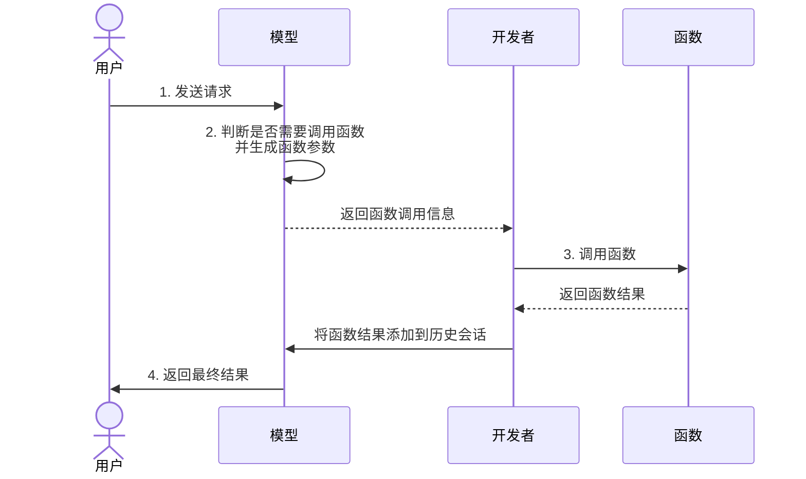

我来帮你创建一个描述 function calling 流程的时序图。下面是用 mermaid 语法表示的时序图：



这个时序图展示了：
1. 用户发送请求到模型
2. 模型进行函数调用判断和参数生成
3. 开发者执行函数调用并处理返回结果
4. 模型根据更新后的会话记录生成最终响应

图中使用了不同类型的箭头来表示不同的交互：
- `->>` 表示主动请求
- `-->>` 表示返回响应


### 2. 在RAG中的应用位置

Sentence-BERT通常用于**粗排阶段**，原因如下：

1. **效率考虑**
   ```python
   # Sentence-BERT的典型使用方式
   from sentence_transformers import SentenceTransformer, util

   model = SentenceTransformer('all-MiniLM-L6-v2')
   
   # 预计算文档嵌入
   doc_embeddings = model.encode(documents, convert_to_tensor=True)
   
   # 查询时快速计算相似度
   query_embedding = model.encode(query, convert_to_tensor=True)
   scores = util.cos_sim(query_embedding, doc_embeddings)
   ```

2. **性能特点**
   - 可以预计算文档向量
   - 查询时只需计算相似度
   - 支持批量处理

### 3. 推荐的英文环境完整排序方案

```python
class EnglishRAGReranker:
    def __init__(self):
        # 粗排：使用Sentence-BERT
        self.coarse_ranker = SentenceTransformer('all-MiniLM-L6-v2')
        
        # 精排：使用Cross-Encoder
        self.fine_ranker = CrossEncoder('cross-encoder/ms-marco-deberta-v3-large')
    
    def rerank(self, query, documents):
        # 1. 粗排阶段
        embeddings = self.coarse_ranker.encode(documents)
        query_embedding = self.coarse_ranker.encode(query)
        
        # 计算相似度并获取top_k
        similarities = util.cos_sim(query_embedding, embeddings)
        top_k_results = self.get_top_k(documents, similarities, k=100)
        
        # 2. 精排阶段
        final_scores = self.fine_ranker.predict([(query, doc) for doc in top_k_results])
        
        return self.get_top_k(top_k_results, final_scores, k=10)
```

### 4. 为什么选择SBERT做粗排

1. **优势**
   - 计算效率高
   - 可以预计算文档向量
   - 内存占用相对较小

2. **局限性**
   ```
   - 双塔结构，无法捕捉查询和文档的深度交互
   - 相比Cross-Encoder精度略低
   - 适合初筛，不适合最终排序
   ```

### 5. 常用的SBERT模型变体

```python
推荐模型：
- 'all-MiniLM-L6-v2'        # 轻量级通用模型
- 'all-mpnet-base-v2'       # 性能更好但较大
- 'multi-qa-MiniLM-L6-cos-v1'  # 专门针对QA优化
```

### 6. 性能优化建议

1. **向量索引优化**
   ```python
   from faiss import IndexFlatIP
   import numpy as np

   # 使用FAISS加速相似度搜索
   index = IndexFlatIP(768)  # 768是向量维度
   doc_embeddings = model.encode(documents)
   index.add(doc_embeddings)
   ```

2. **批处理优化**
   ```python
   # 批量编码文档
   doc_embeddings = model.encode(
       documents,
       batch_size=32,
       show_progress_bar=True,
       convert_to_tensor=True
   )
   ```

3. **缓存策略**
   ```python
   # 缓存文档向量
   import pickle

   def cache_embeddings(documents, model, cache_file):
       if os.path.exists(cache_file):
           return pickle.load(open(cache_file, 'rb'))
       embeddings = model.encode(documents)
       pickle.dump(embeddings, open(cache_file, 'wb'))
       return embeddings
   ```

### 7. 实际应用建议

1. **选择合适的模型大小**
   ```
   - all-MiniLM-L6-v2: 小型模型，适合资源受限场景
   - all-mpnet-base-v2: 中型模型，性能更好
   ```

2. **根据数据量调整策略**
   - 小数据集：可以直接使用余弦相似度
   - 大数据集：建议使用FAISS等向量索引

3. **监控指标**
   - 响应时间
   - 内存使用
   - 召回准确率

总的来说，Sentence-BERT是一个非常好的选择，特别适合作为RAG系统的粗排模型。它能够在保持较好效果的同时，提供很高的计算效率。但建议配合Cross-Encoder等模型作为精排，以获得最佳的排序效果。


是的，RAG系统中的重排序确实需要指定排序模型。让我详细解释不同语言环境下的模型选择：

### 1. 中文环境推荐模型

1. **粗排阶段**
   ```
   推荐模型：
   - BERT-Chinese
   - RoBERTa-Chinese
   - MacBERT
   
   具体示例：
   - chinese-roberta-wwm-ext
   - hfl/chinese-macbert-base
   - hfl/chinese-bert-wwm-ext
   ```

2. **精排阶段**
   ```
   推荐模型：
   - ERNIE
   - DeBERTa-Chinese
   - T5-Chinese
   
   具体示例：
   - ernie-3.0-base-zh
   - deberta-v3-large-chinese
   - mengzi-t5-base
   ```

### 2. 英文环境推荐模型

1. **粗排阶段**
   ```
   推荐模型：
   - DistilBERT
   - MiniLM
   - TinyBERT
   
   具体示例：
   - cross-encoder/ms-marco-MiniLM-L-6-v2
   - sentence-transformers/all-MiniLM-L6-v2
   - distilbert-base-uncased
   ```

2. **精排阶段**
   ```
   推荐模型：
   - DeBERTa
   - T5
   - BERT-large
   
   具体示例：
   - cross-encoder/ms-marco-deberta-v3-large
   - cross-encoder/qnli-deberta-v3-large
   - cross-encoder/ms-marco-T5-large
   ```

### 3. 实现示例

```python
class RAGReranker:
    def __init__(self):
        # 中文环境
        self.zh_coarse_ranker = AutoModelForSequenceClassification.from_pretrained(
            "hfl/chinese-roberta-wwm-ext"
        )
        self.zh_fine_ranker = AutoModelForSequenceClassification.from_pretrained(
            "ernie-3.0-base-zh"
        )
        
        # 英文环境
        self.en_coarse_ranker = AutoModelForSequenceClassification.from_pretrained(
            "cross-encoder/ms-marco-MiniLM-L-6-v2"
        )
        self.en_fine_ranker = AutoModelForSequenceClassification.from_pretrained(
            "cross-encoder/ms-marco-deberta-v3-large"
        )
    
    def rerank(self, query, documents, language="zh"):
        if language == "zh":
            # 中文重排序
            coarse_results = self.coarse_rank(query, documents, self.zh_coarse_ranker)
            fine_results = self.fine_rank(query, coarse_results, self.zh_fine_ranker)
        else:
            # 英文重排序
            coarse_results = self.coarse_rank(query, documents, self.en_coarse_ranker)
            fine_results = self.fine_rank(query, coarse_results, self.en_fine_ranker)
            
        return fine_results
```

### 4. 选择考虑因素

1. **语言特性**
   - 中文：需要考虑分词
   - 英文：需要考虑词形变化

2. **模型大小**
   ```
   粗排：
   - 模型要小（<500MB）
   - 推理速度快
   
   精排：
   - 可以使用更大模型
   - 注重准确性
   ```

3. **计算资源**
   - 根据硬件条件选择
   - 考虑批处理能力
   - 权衡延迟要求

### 5. 优化建议

1. **模型量化**
   ```python
   # 模型量化示例
   from transformers import AutoModelForSequenceClassification
   import torch
   
   model = AutoModelForSequenceClassification.from_pretrained("model_name")
   quantized_model = torch.quantization.quantize_dynamic(
       model, {torch.nn.Linear}, dtype=torch.qint8
   )
   ```

2. **批处理优化**
   ```python
   # 批处理示例
   def batch_rerank(queries, documents, batch_size=32):
       results = []
       for i in range(0, len(documents), batch_size):
           batch = documents[i:i + batch_size]
           batch_scores = model(queries, batch)
           results.extend(batch_scores)
       return results
   ```

3. **缓存策略**
   ```python
   # 缓存示例
   from functools import lru_cache
   
   @lru_cache(maxsize=1000)
   def cached_rerank(query, document):
       return model.predict(query, document)
   ```

### 6. 注意事项

1. **模型更新**
   - 定期检查新模型发布
   - 评估模型性能
   - 考虑特定领域微调

2. **评估指标**
   - MRR (Mean Reciprocal Rank)
   - NDCG (Normalized Discounted Cumulative Gain)
   - Precision@K

3. **资源管理**
   - 内存使用监控
   - GPU利用率优化
   - 批处理大小调整

选择合适的重排序模型时，需要综合考虑语言特性、计算资源、性能要求等多个因素，并在实际应用中进行充分测试和优化。


```
查询处理 -> 召回阶段 -> 重排序 -> 上下文组装 -> 生成回答
```

### 2. 详细流程解析

1. **召回阶段**
   ```
   用户查询
     ↓
   文本检索（关键词匹配）
     +
   语义检索（向量检索）
     ↓
   召回结果合并
   ```

2. **重排序阶段**
   ```
   召回结果
     ↓
   交叉编码器重排序
   （如：cross-encoder模型）
     ↓
   获得更精确的相关性排序
   ```

3. **上下文组装**
   ```
   重排序后的文档
     ↓
   选择top-k文档
     ↓
   组装为提示词上下文
   ```

### 3. RAG中重排序的特点

1. **与传统搜索的区别**
   - 更注重语义相关性
   - 考虑文档间的互补性
   - 关注信息的完整性

2. **常用的重排序方法**
   ```
   - 交叉编码器（Cross-Encoder）
   - 多特征排序模型
   - 基于任务的重排序
   ```

### 4. 具体实现示例

```python
# RAG系统重排序示例伪代码
class RAGSystem:
    def retrieve_and_rerank(self, query):
        # 1. 召回阶段
        text_results = text_retriever.search(query)
        semantic_results = vector_retriever.search(query)
        combined_results = merge_results(text_results, semantic_results)
        
        # 2. 重排序阶段
        reranked_results = cross_encoder.rerank(
            query=query,
            documents=combined_results,
            top_k=10
        )
        
        # 3. 上下文组装
        context = assemble_context(reranked_results)
        
        return context
```

### 5. 重要考虑因素

1. **效率平衡**
   - 召回数量要适中
   - 重排序计算成本较高
   - 需要权衡准确性和响应时间

2. **质量保证**
   - 重排序模型的选择
   - 相关性评估标准
   - 上下文长度限制

3. **实践建议**
   ```
   - 召回阶段：保持较高召回率（如top-100）
   - 重排序：选择合适的top-k（如top-10）
   - 上下文：控制总长度在模型限制内
   ```

### 6. 优化策略

1. **分层重排序**
   ```
   召回结果
     ↓
   轻量级初筛（可选）
     ↓
   精确重排序
   ```

2. **批处理优化**
   ```
   - 批量处理召回结果
   - 并行计算重排序分数
   - 使用模型量化加速
   ```

3. **缓存机制**
   ```
   - 缓存常见查询的重排序结果
   - 缓存文档的中间表示
   - 增量更新策略
   ```

总的来说，在RAG系统中，重排序是一个独立的重要阶段，它发生在召回阶段之后，目的是为了进一步提升检索结果的质量，为后续的生成阶段提供更好的上下文信息。这个阶段的处理质量直接影响最终生成答案的准确性和相关性。


让我详细解释RAG中的二次重排序（Rerank）：

**详细书面版本：**

1. **为什么需要重排序？**
```python
class RetrievalSystem:
    def retrieve(self, query):
        # 1. 初始向量检索（召回）
        initial_results = self.vector_search(query, top_k=100)
        
        # 2. 二次重排序（精排）
        reranked_results = self.reranker.rerank(
            query=query,
            documents=initial_results,
            top_k=10
        )
        
        return reranked_results
```


主要原因：
- 向量检索是粗粒度的（相似度计算较简单）
- 可能出现语义漂移
- 需要更精确的相关性判断

2. **重排序的工作原理**：
- 对初始检索结果进行更深入的语义分析
- 使用更复杂的模型计算相关性
- 重新排序，筛选最相关的文档

3. **重要性体现**：
- 提高检索精度
- 减少无关信息
- 优化上下文质量
- 提升最终答案质量

4. **具体实现方式**：
```python
class Reranker:
    def rerank(self, query, documents):
        # 1. 构建query-document对
        pairs = [(query, doc) for doc in documents]
        
        # 2. 计算相关性分数
        scores = self.cross_encoder(pairs)
        
        # 3. 重新排序
        reranked = sorted(zip(documents, scores), 
                         key=lambda x: x[1], 
                         reverse=True)
        
        return reranked
```


**面试口语版本：**

重排序就像是一个"二次筛选"的过程，我用一个具体例子来解释：

假设用户问："苹果公司的创始人是谁？"

1. **第一次检索**（向量检索）可能找到：
- 关于苹果公司的创始人
- 关于苹果水果的信息
- 包含"苹果"的其他文档

2. **为什么需要重排序**：
- 初始检索可能不够精确
- 可能有主题相近但不相关的文档
- 需要更准确地判断相关性

3. **重排序的好处**：
- 能更好地理解查询意图
- 更精确地评估文档相关性
- 提供更高质量的上下文

4. **实际效果**：
- 过滤掉不相关内容
- 将最相关的文档排在前面
- 提高最终答案的质量

重排序的重要性体现在：
1. 提高准确性
2. 减少噪音
3. 节省token
4. 提升回答质量

这就像是：
- 第一次检索是"大海捞针"
- 重排序是"精挑细选"
- 确保最终用到的信息都是高相关的

所以在RAG系统中，重排序是提升性能的关键环节之一。


是的，您的理解基本正确，让我进一步补充和完善：

**详细书面版本：**

RAG系统中的提示词构建流程：

```python
class RAGPromptBuilder:
    def __init__(self):
        self.template = """
        背景信息：
        {contexts}
        
        用户问题：
        {query}
        
        请基于以上背景信息回答问题。如果背景信息不足，可以使用你的基础知识，但请明确指出。
        """
    
    def build_prompt(self, query, retrieved_contexts):
        # 1. 处理检索到的上下文
        formatted_contexts = self.format_contexts(retrieved_contexts)
        
        # 2. 构建完整提示词
        prompt = self.template.format(
            contexts=formatted_contexts,
            query=query
        )
        
        # 3. 可能需要的长度控制
        prompt = self.truncate_if_needed(prompt)
        
        return prompt
```


关键点说明：

1. **提示词组成部分**：
   - 检索到的上下文（context）
   - 用户查询（query）
   - 指导性提示（instruction）
   - 格式控制（format）

2. **增强效果来源**：
   - 相关背景信息的注入
   - 结构化的提示模板
   - 明确的任务指导

3. **注意事项**：
   - 上下文相关性
   - 提示词长度控制
   - 格式的一致性

**面试口语版本：**

对，您理解得很准确。我可以用一个具体例子来说明：

假设用户问："北京有什么著名景点？"

RAG系统会：
1. 先检索相关信息（比如关于故宫、长城的描述）
2. 然后用模板把这些信息组织起来，可能是这样：
```
背景信息：
故宫是中国明清两代的皇家宫殿...
长城是中国古代伟大的防御工程...

用户问题：
北京有什么著名景点？

请基于以上背景信息回答问题。
```

这样做的好处是：
- 模型有了具体的参考信息
- 回答更准确、更详细
- 减少了幻觉问题

所以这个过程就像是：
- 给模型提供了"参考资料"（context）
- 告诉它具体问题（query）
- 指导它如何回答（template）

这确实能显著提升模型的回答质量，因为模型不是凭空回答，而是基于检索到的具体信息来生成回答。


是的，您的理解很准确。让我进一步展开说明：

**详细书面版本：**

RAG中的索引系统本质上是一个结构化的存储系统，包含三个核心要素：

1. **向量表示（核心）**
```python
class VectorStore:
    def store_document(self, doc, metadata):
        # 1. 文档向量化
        vector = self.encoder.encode(doc)
        
        # 2. 存储结构
        document_entry = {
            'id': generate_id(),
            'vector': vector,          # 向量表示
            'content': doc,            # 原始文本
            'metadata': metadata       # 元数据
        }
        
        # 3. 添加到数据库
        self.vector_db.add(document_entry)
```


2. **存储的具体内容**：
- 文档的向量表示（用于相似度检索）
- 原始文本内容（用于生成回答）
- 元数据信息（用于过滤和管理）
  - 文档来源
  - 时间戳
  - 文档类型
  - 分块位置
  - 其他自定义信息

3. **检索时的应用**：
- 通过向量相似度快速找到相关文档
- 使用元数据进行筛选
- 获取原始文本用于上下文构建

**面试口语版本：**

对，您理解得很准确。可以用图书馆来打个比方：

想象一个现代化的图书馆：
- 向量表示就像是图书的主题分类系统，帮我们快速找到相似内容
- 原始文本就是书本内容本身
- 元数据就像图书卡片，记录了作者、出版日期、位置等信息

当我们要找书时：
1. 先用主题（向量）快速定位相关书籍
2. 通过卡片信息（元数据）进一步筛选
3. 最后取出具体内容（原文）来使用

所以索引系统就是把这些信息组织起来，让我们能又快又准地找到需要的信息。这就是为什么说它是RAG系统的"大脑"，因为它决定了我们能多快多准地找到相关信息。

是的，RAG系统可以使用混合检索策略。让我详细解释：

**详细书面版本：**

混合检索通常包含以下几种策略组合：

1. **基本检索方式**
```python
class HybridRetriever:
    def retrieve(self, query):
        # 1. 向量检索
        vector_results = self.vector_search(query)
        
        # 2. 关键词检索
        keyword_results = self.keyword_search(query)
        
        # 3. 元数据过滤
        filtered_results = self.metadata_filter(query)
        
        # 4. 结果融合
        final_results = self.merge_results([
            vector_results,
            keyword_results,
            filtered_results
        ])
        
        return final_results
```

2. **具体检索策略**：
- **向量检索**：基于语义相似度
- **关键词检索**：基于BM25等算法
- **元数据过滤**：基于时间、来源等
- **规则匹配**：基于特定业务规则

3. **结果融合方法**：
```python
def merge_results(self, result_lists):
    # 1. 排序分数归一化
    normalized_scores = self.normalize_scores(result_lists)
    
    # 2. 加权组合
    weights = {
        'vector': 0.6,
        'keyword': 0.3,
        'metadata': 0.1
    }
    
    # 3. 去重和排序
    merged = self.weighted_merge(normalized_scores, weights)
    
    return merged
```

4. **优化策略**：
- 动态权重调整
- 结果多样性保证
- 查询意图识别
- 上下文相关性评估

**面试口语版本：**

混合检索就是把多种检索方式组合起来，取长补短。主要包含这么几种方式：

首先是向量检索，这个是基于语义的，能理解查询的深层含义。比如用户问"苹果公司的创始人是谁"，即使文档里没有完全相同的词，也能找到相关内容。

然后是关键词检索，就是传统的搜索方式，找包含特定词的文档。这个方式在处理专有名词时特别有用。

还有元数据过滤，比如可以限定时间范围、文档来源等。

最后是规则匹配，这个是根据具体业务设置的一些规则来筛选。

这些方式结合使用的时候，关键是要解决两个问题：
1. 怎么给不同检索方式分配权重
2. 怎么把不同来源的结果合并起来

通常我们会：
- 先对各种检索结果打分
- 然后归一化这些分数
- 再根据权重组合
- 最后去重和排序

这样的混合检索比单一检索方式效果要好得多，因为它既保证了语义相关性，又不会漏掉关键词匹配的结果。

实际应用中，还可以根据查询类型动态调整各种检索方式的权重，这样就能更好地满足不同类型的查询需求。


在RAG的上下文融合阶段，融合的是**自然语言文本**，而不是嵌入向量。让我详细解释一下：

1. **向量的作用范围**
- 向量编码主要用在检索阶段
- 用于计算相似度，找到相关文档
- 检索完成后，我们使用原始文本内容

2. **文本融合示例**
```python
# 实际融合的是文本内容
prompt_template = """
问题：{query}
参考信息：{context}
请基于以上参考信息回答问题。
"""

# 例如：
query = "北京有什么著名景点？"
context = "故宫是中国明清两代的皇家宫殿..."
```

3. **为什么用文本而不是向量？**
- 大语言模型接收的输入是文本，不是向量
- 文本更容易理解和调试
- 保持了信息的完整性和可解释性

4. **实际流程**
```
检索阶段：文本→向量→相似度计算→找到相关文档
融合阶段：原始问题文本 + 检索到的文档文本 → 组合成提示词
生成阶段：将文本提示词输入模型
```

所以，虽然RAG系统中确实使用了向量表示，但在上下文融合阶段，我们处理的就是普通的自然语言文本。这样可以充分利用大语言模型对自然语言的理解能力。


CASREL模型使用的是完整的BERT模型（包括编码器层），而不是仅仅使用BERT的嵌入层。让我详细解释：

1. **正确的架构**：
- BERT是CASREL的基础编码器，**完整使用**了BERT的所有层
- 输入文本经过BERT的完整处理流程：
  - 词嵌入层（Embedding Layer）
  - 位置编码（Position Encoding）
  - 多层Transformer编码器
- BERT输出的隐藏状态（hidden states）作为CASREL后续任务的输入

2. **为什么需要完整的BERT**：
- 仅使用嵌入层无法捕捉上下文信息
- 实体识别和关系抽取需要深层的语义理解
- Transformer层能够建模长距离依赖

3. **具体流程**：
```
输入文本 
→ BERT完整处理（嵌入层+编码器层）
→ 获取上下文表示 
→ 主体识别模块
→ 客体识别模块
```

所以，您的第一个理解更接近正确：CASREL使用完整的BERT进行编码，而不是仅使用嵌入层。这是因为关系抽取任务需要深层的语义理解，仅仅使用词嵌入是不够的。

**面试回答版本**：

CASREL模型是完整使用了BERT模型的，不是只用了嵌入层。因为关系抽取这个任务需要理解句子的完整语义，比如"张三喜欢李四"和"李四喜欢张三"这样的句子，如果只用词嵌入层，是没法区分谁是主体谁是客体的。所以需要BERT的整个编码器来处理上下文信息，然后再基于这个深层语义表示去做主体和客体的识别。这样的设计能够更好地理解句子中实体之间的关系。


我来分别给出两个版本的回答：

**详细书面版本：**

CASREL (Cascade Binary Tagging)是一个用于关系抽取的级联二分类模型，其主要创新点在于将关系抽取问题分解为两个级联的子任务。

1. **模型架构**
- **编码层**：使用BERT作为基础编码器，将输入文本转换为上下文相关的表示
- **主体识别层**：识别句子中的所有主体实体
- **级联对象识别层**：基于已识别的主体实体，为每个关系类型分别识别对应的客体实体

2. **具体流程**
```python
# 简化的处理流程
class CASREL:
    def forward(self, text):
        # 1. BERT编码
        hidden_states = self.bert_encoder(text)
        
        # 2. 主体识别
        subject_start, subject_end = self.subject_tagger(hidden_states)
        subjects = self.decode_subjects(subject_start, subject_end)
        
        # 3. 对每个主体进行客体识别
        for subject in subjects:
            for relation in relations:
                object_start, object_end = self.object_tagger(
                    hidden_states, subject, relation
                )
```

3. **创新点**
- 采用级联式架构，降低了任务复杂度
- 能够处理一对多关系
- 避免了传统方法中的关系重叠问题

4. **训练策略**
- 两个子任务分别使用二分类损失
- 端到端联合训练
- 支持多GPU并行训练

**面试口语版本：**

CASREL模型是一个做关系抽取的模型，它最大的特点就是把复杂的关系抽取任务拆成了两步来做。

第一步呢，就是找出句子里所有的主体，比如说"张三在北京大学上学"这句话，先找出"张三"这个主体。

第二步呢，就是针对已经找到的主体，再去找它对应的客体。比如知道了"张三"是主体，就去找跟"张三"有关系的客体"北京大学"。

这个模型最厉害的地方在于：
1. 它把复杂问题变简单了，不用一次性找所有的关系
2. 它能处理一个主体对应多个客体的情况
3. 用的是BERT做编码，效果比较好

在实际应用中，这个模型的效果还不错，特别是在处理复杂的多关系场景时比较有优势。

如果要问具体实现的话，主要就是用了BERT做特征提取，然后用两个二分类器分别做主体识别和客体识别。整个模型是端到端训练的，两个任务是联合优化的。

这个回答够清晰吗？如果您想了解更具体的细节，我可以展开说说实现细节或者训练策略。


让我为您详细解释知识蒸馏（Knowledge Distillation）相关内容：

### 知识蒸馏的基本概念
知识蒸馏是一种模型压缩技术，核心思想是将一个大模型（教师模型）的"知识"迁移到一个小模型（学生模型）中。这个过程类似于"教师教学生"，让小模型学习大模型的行为特征。

### 基本原理
1. **软标签传递**
   - 教师模型输出概率分布（软标签）
   - 这些软标签包含类别间的关系信息
   - 比硬标签（one-hot）包含更丰富的知识

2. **温度调节**
   - 使用温度参数T调节软标签的平滑程度
   - 较高的温度会产生更软的概率分布
   - 有助于传递类别间的相似性信息

3. **损失函数设计**
   - 通常结合两种损失：
     - 蒸馏损失：学生模型与教师模型输出的差异
     - 学生损失：学生模型与真实标签的差异

### 高频面试题及答案

#### 1. 问：知识蒸馏中的温度参数T有什么作用？为什么要使用软标签？
答：
- **温度参数T的作用**：
  - 控制概率分布的平滑程度
  - 当T=1时，输出原始概率分布
  - 当T>1时，分布变得更平滑，突出次要类别的信息
  - 当T<1时，分布变得更尖锐，更接近硬标签

- **使用软标签的原因**：
  - 包含类别间的相似度信息
  - 提供更丰富的监督信号
  - 有助于模型泛化能力的提升
  - 能够传递教师模型学到的细粒度知识

#### 2. 问：知识蒸馏的损失函数是如何设计的？各部分的作用是什么？
答：
- **总体损失函数**：
  ```
  L_total = α * L_distill + (1-α) * L_student
  ```

- **蒸馏损失(L_distill)**：
  - 衡量学生模型输出与教师模型软标签的差异
  - 通常使用KL散度或交叉熵
  - 帮助学生模型学习教师模型的决策边界

- **学生损失(L_student)**：
  - 衡量学生模型输出与真实标签的差异
  - 确保基本分类准确性
  - 防止过度依赖教师模型

- **平衡参数α**：
  - 控制两种损失的相对重要性
  - 通常需要根据具体任务调整

#### 3. 问：知识蒸馏面临哪些主要挑战？如何解决？
答：
- **主要挑战**：
  1. **容量差距**：
     - 学生模型容量可能不足以学习所有知识
     - 解决方案：渐进式蒸馏、选择性知识迁移

  2. **特征空间不匹配**：
     - 教师和学生模型架构差异导致特征不对齐
     - 解决方案：添加适配层、使用注意力迁移

  3. **知识选择**：
     - 并非所有教师知识都对学生有用
     - 解决方案：知识筛选机制、重要性加权

- **解决策略**：
  1. **架构设计**：
     - 合理设计学生模型结构
     - 考虑任务特点和资源限制

  2. **训练策略**：
     - 采用多阶段训练
     - 使用课程学习方式
     - 动态调整温度参数

  3. **知识选择**：
     - 设计知识重要性评估机制
     - 有选择地进行知识迁移

这些问题涵盖了知识蒸馏中的核心概念和关键技术点，对于理解和应用知识蒸馏技术非常重要。在实际应用中，需要根据具体任务和场景选择合适的策略和方法。


这个理解不太准确，让我为您详细解释：

### 正确理解教师模型和学生模型的输出

#### 1. 教师模型（Teacher Model）
- 输出**软标签**（soft labels）：概率分布
- 例如：[0.7, 0.2, 0.1] 表示对三个类别的预测概率
- 通过温度参数T调整后的概率分布会更平滑

#### 2. 学生模型（Student Model）
- 会产生**两种输出**：
  - 对真实标签的预测（硬标签训练）
  - 对软标签的模仿（软标签训练）
- **不是**只输出硬标签

### 举例说明
假设是一个图像分类任务（猫、狗、鸟三个类别）：

1. **教师模型输出**：
   - 原始输出：[0.7, 0.2, 0.1]
   - 表示：70%可能是猫，20%可能是狗，10%可能是鸟

2. **学生模型训练目标**：
   - 学习真实标签：[1, 0, 0]（硬标签）
   - 同时学习教师模型的软标签：[0.7, 0.2, 0.1]

### 知识蒸馏的核心思想

1. **双重学习目标**
   - 学生模型同时学习硬标签和软标签
   - 综合损失函数：结合蒸馏损失和普通分类损失

2. **温度缩放**
```
softmax(logits/T)
```
   - T越大，分布越平滑
   - T=1时是标准softmax
   - 教师和学生使用相同的温度T

3. **知识迁移过程**
   - 教师模型提供软标签指导
   - 学生模型同时接受两种监督信号
   - 软标签包含类别间的相似度信息

### 实际训练过程

1. **第一步：准备阶段**
   - 训练好教师模型
   - 设计合适的学生模型
   - 确定温度参数T

2. **第二步：训练学生模型**
   - 计算教师模型的软标签输出
   - 计算学生模型对应的两个损失
   - 使用加权后的总损失进行优化

3. **第三步：损失计算**
```
总损失 = α * 蒸馏损失(软标签) + (1-α) * 分类损失(硬标签)
```

### 重要补充说明

1. **为什么需要软标签**
   - 包含更丰富的知识信息
   - 反映类别间的相似关系
   - 提供更细粒度的学习目标

2. **温度参数的作用**
   - 控制知识迁移的"软硬程度"
   - 影响类别概率分布的平滑度
   - 帮助提取教师模型的"暗知识"

3. **实际应用建议**
   - 根据任务特点选择合适的温度
   - 平衡硬标签和软标签的权重
   - 考虑模型容量差异进行调整

通过这样的理解，我们可以看到知识蒸馏是一个双重学习的过程，学生模型既要学习真实标签，也要学习教师模型的"经验"。这种方式能够帮助学生模型获得更好的泛化能力和性能表现。


让我为您详细解释混合精度训练（Mixed Precision Training）：

### 一、基本概念
混合精度训练是一种同时使用FP32（单精度浮点）和FP16（半精度浮点）的训练技术，目的是：
1. **加快训练速度**
2. **减少显存占用**
3. **保持模型精度**

### 二、数据格式说明

1. **FP32（单精度）**
- 32位表示一个浮点数
- 1位符号位
- 8位指数位
- 23位尾数位
- 精度高，范围大

2. **FP16（半精度）**
- 16位表示一个浮点数
- 1位符号位
- 5位指数位
- 10位尾数位
- 计算快，占用内存小

### 三、混合精度训练原理

1. **前向传播**
   - 权重以FP32存储
   - 计算时转换为FP16
   - 激活值使用FP16存储和计算

2. **反向传播**
   - 梯度以FP16计算
   - 权重更新时转回FP32
   - 保持主权重在FP32精度

3. **损失缩放（Loss Scaling）**
   - 解决FP16梯度下溢问题
   - 前向传播前将损失乘以缩放因子
   - 反向传播后将梯度除以相同因子

### 四、具体实现步骤

1. **模型转换**
   - 将模型权重复制为FP16版本
   - 保留FP32主权重副本
   - 创建FP16优化器

2. **前向计算流程**
   - 权重FP32→FP16转换
   - 使用FP16进行计算
   - 存储FP16激活值

3. **反向传播流程**
   - 计算FP16梯度
   - 应用损失缩放
   - 更新FP32主权重

4. **动态损失缩放**
   - 监控梯度值范围
   - 动态调整缩放因子
   - 处理梯度溢出情况

### 五、关键技术点

1. **权重更新策略**
   ```
   FP32主权重 → FP16计算 → FP32更新 → FP32主权重
   ```

2. **损失缩放机制**
   ```
   原始损失 × 缩放因子 → 反向传播 → 梯度 ÷ 缩放因子
   ```

3. **梯度裁剪**
   - 防止梯度爆炸
   - 确保数值稳定性

### 六、优势与挑战

1. **优势**
   - 训练速度提升（通常1.5-2倍）
   - 显存使用减少（约50%）
   - 保持模型精度

2. **挑战**
   - 数值稳定性管理
   - 损失缩放因子调整
   - 溢出检测和处理

### 七、最佳实践建议

1. **初始设置**
   - 选择合适的初始损失缩放因子
   - 设置梯度裁剪阈值
   - 配置溢出检测机制

2. **监控指标**
   - 梯度范围
   - 损失值变化
   - 训练精度
   - 溢出频率

3. **优化策略**
   - 根据溢出情况调整缩放因子
   - 适时调整学习率
   - 监控模型性能

### 八、应用场景

1. **大规模模型训练**
   - 降低显存需求
   - 加快训练速度

2. **资源受限环境**
   - 充分利用有限硬件
   - 提高训练效率

3. **实时应用**
   - 加速推理过程
   - 减少资源消耗

通过以上详细说明，我们可以看到混合精度训练是一种在保持模型性能的同时，显著提升训练效率的重要技术。它通过巧妙地结合FP32和FP16的优势，解决了深度学习中的计算效率问题。


让我分别给出两个版本的回答：

### 一、书面详细版本

大模型幻觉问题的解决方案可以从以下几个方面展开：

1. **数据层面优化**
   - 提高训练数据质量和可靠性
   - 构建事实性知识库进行对齐
   - 增加对抗样本训练
   - 引入结构化和半结构化数据

2. **模型架构优化**
   - 引入外部知识库检索机制
   - 设计多模态验证机制
   - 增强模型的推理能力
   - 实现自验证机制

3. **训练策略优化**
   - 采用对比学习方法
   - 强化学习中加入真实性奖励
   - 实施不确定性建模
   - 引入知识图谱指导

4. **推理阶段优化**
   - 实现多轮验证机制
   - 添加置信度评估
   - 设置安全边界
   - 引入外部工具验证

5. **系统层面优化**
   - 建立事实核查系统
   - 实现多模型交叉验证
   - 设计反馈纠正机制
   - 构建可解释性分析系统

### 二、面试口语版本

"关于大模型幻觉问题的解决，我认为可以从三个主要方向来回答：

首先是数据端，我们需要确保训练数据的质量和真实性。比如说，我们可以建立可靠的知识库，用高质量数据做对齐，还可以加入一些对抗样本来增强模型的鲁棒性。

其次是模型端，这里我们主要采用两种方法：一是引入外部知识库做实时检索，让模型在回答时能够基于可靠的信息源；二是设计自验证机制，让模型学会质疑和验证自己的输出。

最后是应用端，我们会设计多轮验证机制，比如说让模型先生成答案，然后再让它检查答案的准确性。同时，我们也会加入置信度评估，当模型不确定时，会主动表达出来而不是随意编造。

在实践中，这些方法往往是组合使用的。比如我们公司就在做的一个项目中，通过结合知识库检索和多轮验证，幻觉问题的出现率降低了很多。当然，这是个持续优化的过程，我们还在不断探索新的解决方案。"

### 补充说明：
面试版本的特点：
1. 语言更口语化，更容易理解
2. 结构清晰：问题-解决方案-实践经验
3. 加入了个人经验，显得更真实
4. 时长适中，大约2-3分钟
5. 最后留有开放性，表示还在持续改进

这样的回答既展示了专业知识，又避免了过于学术化，同时通过加入实践经验增加了可信度。


### 二、面试口语版本

"RAG是Retrieval-Augmented Generation的缩写，简单来说就是检索增强生成。我可以从原理、应用和优势三个方面来介绍：

首先说原理，RAG就像是给大模型配了个'小助手'。当我们问问题时，它会先去知识库里找相关的资料，然后再结合这些资料来回答问题。这有点像我们人类解决问题，需要什么就查什么，而不是完全靠记忆。

具体流程是这样的：比如你问一个问题，系统会先把这个问题转换成向量，然后去知识库里找相关的内容，找到后再结合问题生成答案。这样的好处是答案既有大模型的理解能力，又有知识库的准确性。

在实际应用中，我之前参与过一个项目，就是用RAG来做企业的智能客服。我们把公司的产品手册、常见问题等都放在知识库里，这样客服机器人回答问题就特别准确，而且能及时更新最新的产品信息。

RAG最大的优势是能解决大模型的几个典型问题：
1. 解决信息实时性的问题，因为知识库可以随时更新
2. 解决幻觉问题，因为回答都是基于实际文档
3. 解决专业领域适应的问题，换个知识库就能服务不同领域

当然，RAG也有需要注意的地方，比如知识库的质量很关键，检索精度也需要不断优化。我们在实践中就是通过不断调整检索策略和排序方法来提升效果的。

目前这个技术发展很快，像向量数据库、Embedding模型都在不断进步，我也在持续关注这方面的新发展。"

### 补充说明：
面试版本的特点：
1. 用通俗的比喻开头
2. 结构清晰：原理-流程-应用-优势
3. 加入个人项目经验
4. 展示了技术洞察力
5. 表现出持续学习的态度

这样的回答既展示了专业能力，又容易让面试官理解，同时通过实际项目经验增加了说服力。


让我继续详细解释RAG的两个核心模块：

### 检索模块 (Retrieval)
- **主要职责**：
  - 从知识库中找出与用户查询最相关的信息片段
  - 对文档进行向量化和相似度匹配
  - 实现高效的信息检索和筛选

- **具体功能**：
  - 文档分块（Chunking）
  - 向量嵌入（Embedding）
  - 相似度计算
  - 排序和过滤

### 生成模块 (Generation)
- **主要职责**：
  - 将检索到的相关信息与用户查询结合
  - 生成连贯、准确且符合上下文的回答

- **具体功能**：
  - 上下文整合
  - 信息综合
  - 自然语言生成
  - 确保输出的准确性和可靠性

### 补充说明
1. **协同工作**：
   - 两个模块不是独立运作的，而是紧密配合
   - 检索质量直接影响生成质量
   - 生成模块需要智能处理检索结果

2. **优势**：
   - 减少幻觉（Hallucination）
   - 提高回答的准确性
   - 能够处理最新信息
   - 可追溯性强

3. **注意事项**：
   - 检索结果的相关性至关重要
   - 需要平衡检索的数量和质量
   - 生成模块需要具备强大的理解和推理能力

这种架构使得AI系统能够提供更可靠、更准确的回答，特别是在需要专业知识或最新信息的场景中。


