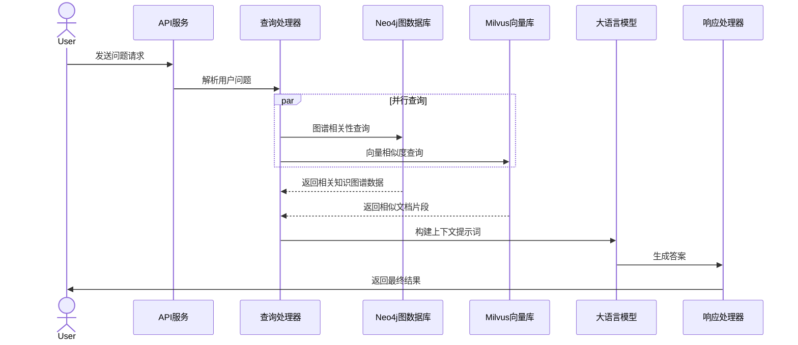
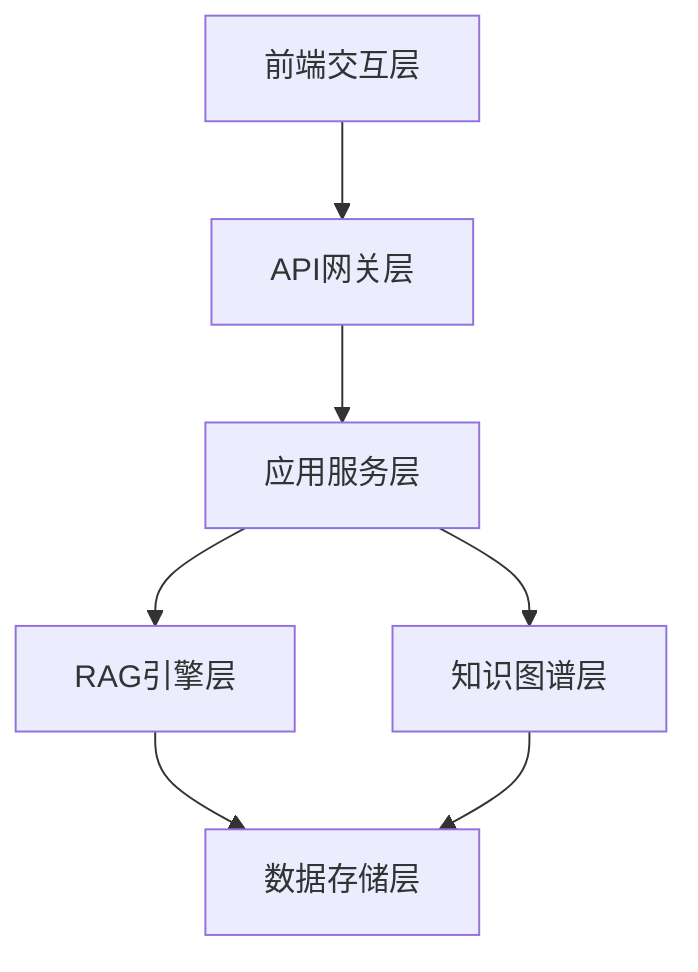
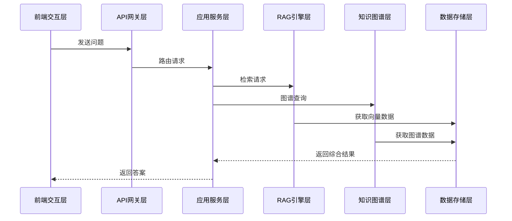
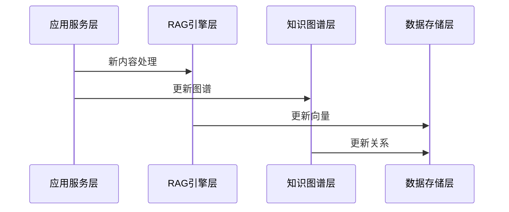

我来详细说明用户请求的处理流程：

### 详细处理流程



### 具体步骤说明

1. **请求预处理阶段**
```python
def preprocess_query(user_query):
    # 1. 问题分析
    query_type = analyze_query_type(user_query)
    
    # 2. 文本清洗
    cleaned_query = clean_text(user_query)
    
    # 3. 关键词提取
    keywords = extract_keywords(cleaned_query)
    
    # 4. 向量化处理
    query_vector = get_embedding(cleaned_query)
    
    return {
        'query_type': query_type,
        'cleaned_query': cleaned_query,
        'keywords': keywords,
        'query_vector': query_vector
    }
```

2. **并行检索阶段**
```python
async def parallel_search(processed_query):
    # 1. 向量检索
    vector_results = await search_milvus(
        processed_query['query_vector'],
        top_k=5,
        threshold=0.75
    )
    
    # 2. 图谱检索
    graph_results = await search_neo4j(
        processed_query['keywords'],
        processed_query['query_type']
    )
    
    return vector_results, graph_results
```

3. **结果融合阶段**
```python
def merge_results(vector_results, graph_results):
    # 1. 结果评分
    scored_results = score_results(vector_results, graph_results)
    
    # 2. 结果排序
    ranked_results = rank_results(scored_results)
    
    # 3. 结果过滤
    filtered_results = filter_results(ranked_results)
    
    # 4. 构建上下文
    context = build_context(filtered_results)
    
    return context
```

4. **答案生成阶段**
```python
def generate_answer(context, original_query):
    # 1. 构建提示词
    prompt = build_prompt(context, original_query)
    
    # 2. LLM调用
    response = call_llm(prompt)
    
    # 3. 答案优化
    optimized_response = optimize_response(response)
    
    # 4. 添加引用源
    final_response = add_references(optimized_response, context)
    
    return final_response
```

### 关键技术要点

1. **查询优化**
- Neo4j查询使用Cypher优化
- Milvus使用HNSW索引
- 并行查询提高效率

2. **结果融合策略**
- 基于相关度评分
- 考虑时效性权重
- 来源可靠性权重

3. **上下文构建**
- 动态窗口大小
- 相关度阈值控制
- 内容去重处理

4. **错误处理**
```python
def error_handling():
    try:
        # 数据库连接重试
        retry_strategy = {
            'max_attempts': 3,
            'delay': 1,
            'backoff': 2
        }
        
        # 结果验证
        validation_rules = {
            'min_results': 1,
            'max_tokens': 2000,
            'similarity_threshold': 0.6
        }
        
        # 异常恢复
        recovery_steps = [
            'check_connection',
            'validate_data',
            'backup_query'
        ]
    except Exception as e:
        handle_exception(e)
```

5. **性能优化**
- 查询缓存
- 结果预热
- 批量处理
- 异步操作

### 示例查询流程

假设用户问题："请介绍一下新房购买流程和注意事项"

1. **Neo4j查询**：
```cypher
MATCH (start:Process {type: '购房流程'})
-[:NEXT*]->(step)
-[:HAS_NOTICE]->(notice)
RETURN step, notice
ORDER BY step.order
LIMIT 10
```

2. **Milvus查询**：
```python
search_params = {
    'vector': query_vector,
    'collection': 'real_estate_docs',
    'partition': 'purchase_process',
    'top_k': 5
}
```

3. **结果融合示例**：
```python
def merge_search_results(neo4j_results, milvus_results):
    merged_results = []
    
    # 添加图谱结果
    for result in neo4j_results:
        merged_results.append({
            'content': result['content'],
            'source': 'knowledge_graph',
            'confidence': result['relevance'],
            'type': 'process_step'
        })
    
    # 添加向量结果
    for result in milvus_results:
        merged_results.append({
            'content': result['content'],
            'source': 'document',
            'confidence': result['similarity'],
            'type': 'detail_info'
        })
    
    return merged_results
```
我来介绍整体架构设计：

### 核心模块及其关联



#### 1. 前端交互层（Frontend Layer）
- 用户界面模块
  - 问答交互界面
  - 知识浏览界面
  - 管理后台界面
- 用户认证模块
- 实时反馈模块

#### 2. API网关层（Gateway Layer）
- 请求路由
- 负载均衡
- 安全认证
- 流量控制
- 日志监控

#### 3. 应用服务层（Application Layer）
- 用户服务
  - 权限管理
  - 用户画像
- 问答服务
  - 问题解析
  - 答案生成
  - 历史记录
- 知识管理服务
  - 内容更新
  - 知识审核

#### 4. RAG引擎层（RAG Engine Layer）
- 文本向量化模块
  - Embedding生成
  - 向量索引
- 检索模块
  - 相似度计算
  - 结果排序
- 生成模块
  - 提示词构建
  - 内容生成
  - 答案优化

#### 5. 知识图谱层（Knowledge Graph Layer）
- 图谱管理模块
  - 实体管理
  - 关系管理
- 图查询模块
  - 路径查询
  - 关系推理
- 图谱更新模块
  - 自动抽取
  - 人工维护

#### 6. 数据存储层（Storage Layer）
- 结构化存储
  - Neo4j图数据库
  - MySQL关系数据库
- 非结构化存储
  - 文档存储
  - 向量存储
- 缓存系统
  - Redis缓存
  - 本地缓存

### 模块间的关联流程

1. **查询流程**


2. **数据更新流程**


### 关键技术特点

1. **松耦合设计**
- 各模块独立部署
- 服务间通过API通信
- 便于扩展和维护

2. **数据一致性**
- 分布式事务
- 数据同步机制
- 缓存一致性保证

3. **高可用设计**
- 服务冗余
- 负载均衡
- 故障转移

4. **安全机制**
- 多层认证
- 数据加密
- 访问控制

这个架构设计充分考虑了系统的可扩展性、可维护性和性能需求，您觉得还需要在哪些方面补充或调整吗？
我来为您提供两个版本的回答:

### 书面详细版本

RAG(检索增强生成)结合Neo4j的房地产培训问答系统架构设计可分为以下几个核心模块:

1. 数据层
- Neo4j图数据库存储:
  - 培训知识点之间的关联关系
  - 员工角色与权限
  - 培训课程体系
  - 房地产专业知识图谱
- 文档存储:
  - 培训文档
  - 案例库
  - 政策法规
  - 操作手册

2. 检索增强层
- 文本向量化模块
  - 使用embedding模型将文本转换为向量
  - 构建向量索引用于相似度检索
- 知识图谱检索模块
  - 基于Neo4j的图查询
  - 知识实体关系推理
- 混合检索策略
  - 结合向量相似度和图关系进行多模态检索
  
3. 生成层
- 大语言模型
- 提示词工程优化
- 结果组装与润色

4. 应用层
- Web界面
- 权限管理
- 问答历史记录
- 反馈收集

5. 运维监控
- 性能监控
- 日志分析
- 模型效果评估

### 面试口语版本

"这个系统我会这样设计:首先,核心是把房地产培训资料存在两个地方 - Neo4j图数据库存专业知识之间的关联,比如不同类型房产之间的关系、开发流程的先后顺序等;另外就是存原始的培训文档。

检索的时候会双管齐下,一方面用向量去找相似的内容,另一方面用Neo4j去找相关的知识点。这样既能找到直接相关的答案,也能找到延伸的知识。

然后用大语言模型把检索到的内容组织成通顺的回答。整个过程就像有个专业老师在回答问题,既能说到点子上,又能适当延伸扩展。

系统会部署成Web应用,员工可以直接在上面提问。后台还会记录问答历史,这样可以持续优化系统。

这个架构的优势在于:既保证了专业性(通过Neo4j的知识图谱),又保证了回答的准确性(通过RAG),而且能够个性化(根据员工角色和历史记录)。"

这两个版本您觉得如何?需要我在某些方面补充更多细节吗?


您觉得这个处理流程是否清晰？需要我在某些环节补充更多细节吗？


我来提供一个结构化的回答思路：

**面试回答版本：**

"我们的RAG系统上线经过了几个关键阶段：

1. 前期调研和架构设计
- 首先评估了业务需求，确定了使用RAG的具体场景
- 对比了不同的向量数据库，最终选择了Milvus（或其他），原因是它在我们的数据规模下性能表现最好
- 设计了整体架构，包括文档处理、向量索引、检索和排序等模块

2. 数据准备和预处理
- 对现有文档进行清洗，去除无效信息
- 建立文档分段策略，我们采用了滑动窗口方式，每段512个token，重叠128个token
- 使用text-embedding-ada-002（或其他）模型生成文档向量
- 建立了文档更新机制，确保知识库能够及时更新

3. 检索优化
- 实现了多路召回策略：
  * 向量相似度检索
  * 关键词匹配
  * Query改写扩展
- 针对性能要求，设置了合适的向量召回数量（比如top-k=5）
- 实现了检索结果的重排序机制

4. 系统集成和部署
- 采用了微服务架构，主要包括：
  * 文档处理服务
  * 向量计算服务
  * 检索服务
  * LLM对话服务
- 使用K8s进行容器编排
- 实现了服务的负载均衡和熔断机制

5. 监控和优化
- 建立了完整的监控体系：
  * 服务响应时间
  * 检索准确率
  * 资源使用情况
- 设置了关键指标告警
- 实现了日志收集和分析系统

6. 灰度发布和上线
- 首先在内部小范围测试
- 然后选择部分用户进行灰度测试
- 收集反馈并持续优化
- 最后全量上线

7. 效果评估和持续优化
- 建立了评估指标体系：
  * 检索准确率
  * 回答相关性
  * 系统响应时间
- 定期进行A/B测试
- 持续收集用户反馈进行优化

具体的技术细节补充：

1. 性能优化方面：
```python
# 向量检索服务示例
class VectorSearchService:
    def __init__(self):
        # 初始化向量数据库连接
        self.vector_db = Milvus(
            host='localhost',
            port='19530',
            pool_size=10  # 连接池优化
        )
        
    @cached(ttl=3600)  # 使用缓存优化
    def search(self, query_vector, top_k=5):
        try:
            results = self.vector_db.search(
                collection_name="documents",
                query_vectors=[query_vector],
                top_k=top_k,
                params={"nprobe": 10}  # 性能调优参数
            )
            return results
        except Exception as e:
            logger.error(f"Search failed: {e}")
            return None
```

2. 文档处理方面：
```python
# 文档分段处理示例
def process_document(text, window_size=512, overlap=128):
    segments = []
    tokens = tokenizer(text)
    
    for i in range(0, len(tokens), window_size - overlap):
        segment = tokens[i:i + window_size]
        if len(segment) >= min_segment_length:
            segments.append(segment)
            
    return segments
```

3. 监控方面：
```python
# 性能监控示例
@monitor_time
def retrieve_and_rank(query):
    start_time = time.time()
    
    # 向量检索
    vector_results = vector_search(query)
    
    # 关键词匹配
    keyword_results = keyword_search(query)
    
    # 结果合并和排序
    final_results = merge_and_rank(vector_results, keyword_results)
    
    # 记录延迟
    latency = time.time() - start_time
    metrics.record_latency(latency)
    
    return final_results
```

这个回答展示了：
1. 完整的上线流程
2. 关键技术细节
3. 性能优化考虑
4. 监控和运维方案

根据面试官的关注点，可以深入展开任何一个环节的细节。"

这个回答框架比较完整，既有宏观视角，又有具体实现细节。面试时可以根据面试官的兴趣点和提问，灵活调整内容的侧重点。同时，建议在回答时结合自己的实际经验，用具体的例子来支撑论述。
