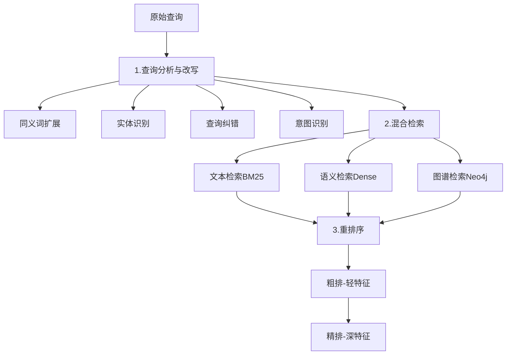
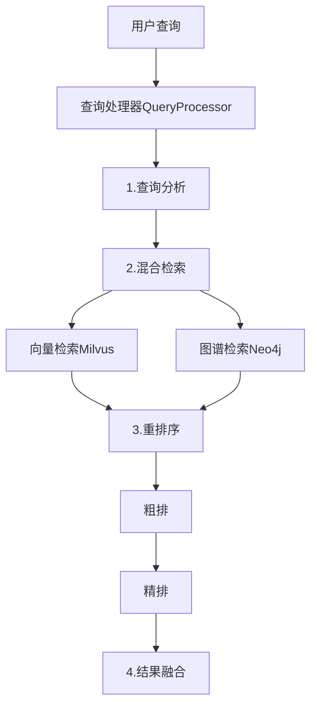
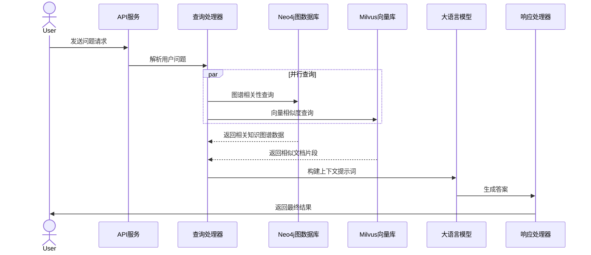
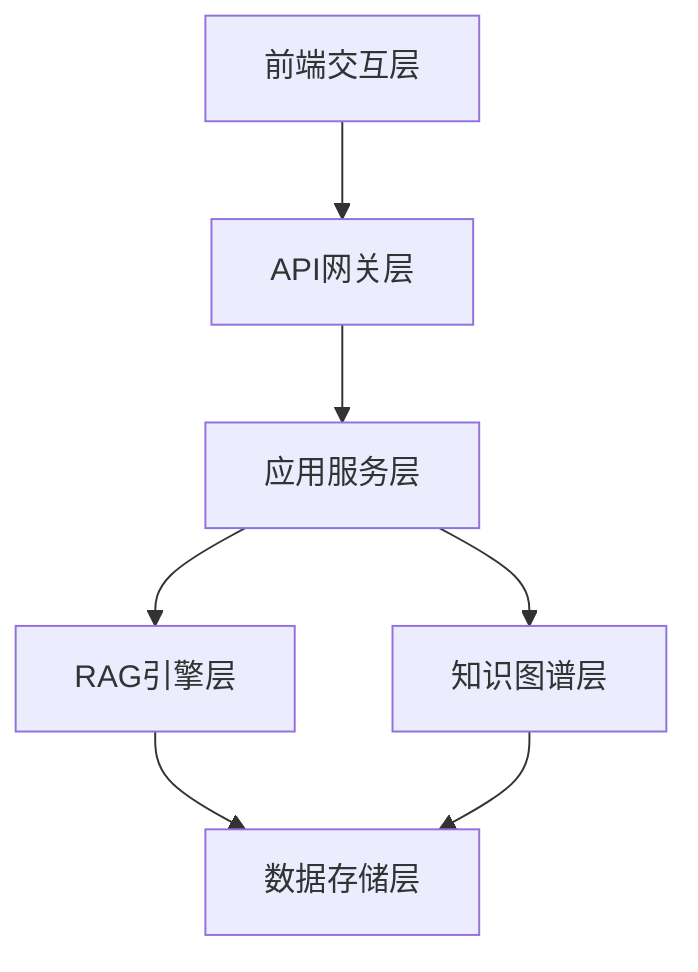
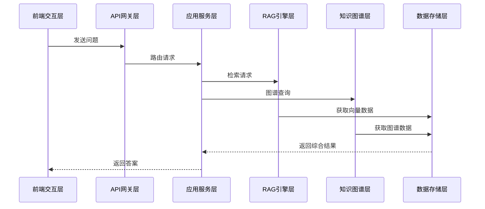
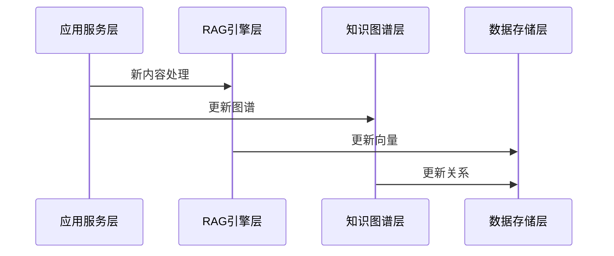

让我分析一下Query改写和生成回答使用模型选择的问题：

**主流做法分析：**

1. **使用不同模型的原因：**
- Query改写和生成回答的任务特点不同
- Query改写更注重理解和改写，生成更注重知识和创作
- 可以针对性优化各自的模型

2. **使用相同模型的原因：**
- 部署维护更简单
- 资源利用更集中
- 成本相对较低

**具体对比：**

```python
# 方案1：使用不同模型
class RAGSystem:
    def __init__(self):
        # Query改写模型：轻量级，快速响应
        self.rewrite_model = load_model("chatglm2-6b-rewrite-fine-tuned")
        
        # 生成模型：更强的知识整合和生成能力
        self.generation_model = load_model("baichuan-13b-generation")

# 方案2：使用相同模型
class RAGSystem:
    def __init__(self):
        # 同一个模型，不同的提示词
        self.model = load_model("chatglm2-7b")
```

**建议方案：**

对于房地产培训系统，我建议使用不同的模型，原因如下：

1. **Query改写模型需求：**
```python
class QueryRewriter:
    def __init__(self):
        # 使用较小的模型，如7B
        self.model = load_model("chatglm2-7b-rewrite")
        
    def rewrite(self, query):
        prompt = """
        作为房地产培训查询专家，请将以下查询改写为更专业的形式：
        1. 使用标准术语
        2. 保持简洁明确
        3. 限制改写结果长度
        
        查询: {query}
        """
        return self.model.generate(prompt)
```

2. **生成回答模型需求：**
```python
class AnswerGenerator:
    def __init__(self):
        # 使用较大的模型，如13B
        self.model = load_model("baichuan-13b")
        
    def generate(self, query, context):
        prompt = """
        作为房地产培训专家，请基于提供的上下文，详细回答问题：
        1. 确保专业准确性
        2. 提供具体例子
        3. 可以展开详细解释
        
        上下文: {context}
        问题: {query}
        """
        return self.model.generate(prompt)
```

**选择建议：**

1. **如果资源充足：**
- Query改写：使用7B模型（如ChatGLM2-7B）
- 生成回答：使用13B或更大模型（如Baichuan-13B）

2. **如果资源受限：**
- 可以使用同一个7B模型
- 通过不同的提示词模板来优化不同任务

**实际案例：**
```python
# 使用不同模型的完整示例
class RealEstateRAG:
    def __init__(self):
        # Query改写模型：快速、准确
        self.rewrite_model = ChatGLM2_7B(
            model_path="rewrite_model",
            temperature=0.3  # 保持改写稳定性
        )
        
        # 生成模型：知识丰富、表达能力强
        self.generation_model = Baichuan_13B(
            model_path="generation_model",
            temperature=0.7  # 允许更多创造性
        )
    
    def process_query(self, user_query):
        # 1. 查询改写
        rewritten_query = self.rewrite_model.generate(
            self.get_rewrite_prompt(user_query)
        )
        
        # 2. 检索相关文档
        relevant_docs = self.retrieve_docs(rewritten_query)
        
        # 3. 生成回答
        final_answer = self.generation_model.generate(
            self.get_generation_prompt(rewritten_query, relevant_docs)
        )
        
        return final_answer
```

**最终建议：**

1. 如果是正式产品环境：
- 建议使用不同的模型
- Query改写用7B级别
- 生成回答用13B或更大级别

2. 如果是测试或预算有限：
- 可以先用同一个7B模型
- 通过提示词优化来区分不同任务
- 后续根据效果决定是否升级

3. 关键考虑因素：
- 系统的性能要求
- 预算限制
- 用户体验要求
- 维护成本

这样的设计既能保证系统效果，又能平衡资源使用，是比较理想的实践方案。


好的，我来详细分析一下主流的query改写方法，并结合房地产培训系统给出具体示例。

**主流Query改写方法：**

1. **规则基础改写**
```python
# 基础规则改写示例
def basic_rewrite(query):
    # 同义词替换
    synonyms = {
        "房子": "房产",
        "两居室": "2居室",
        "首付": "首付款"
    }
    
    # 专业术语标准化
    standards = {
        "毛坯房": "毛坯住宅",
        "精装修": "精装住宅"
    }
    
    # 应用规则
    for key, value in synonyms.items():
        query = query.replace(key, value)
    return query
```

2. **基于统计的改写**
```python
# 基于用户历史查询日志的改写
def statistical_rewrite(query):
    # 查询共现词表
    cooccurrence = get_query_pairs()
    # 查询替换模式
    replacement_patterns = get_common_patterns()
    # 根据历史数据进行改写
    return modified_query
```

3. **混合方案（目前最主流）**
```python
def hybrid_query_rewrite(query):
    # 1. 基础规则处理
    query = basic_rules_process(query)
    
    # 2. 统计模型改写
    if has_historical_pattern(query):
        query = statistical_rewrite(query)
    
    # 3. 特定场景下使用LLM
    if needs_complex_understanding(query):
        query = llm_rewrite(query)
    
    return query
```

**实际案例分析：**

以房地产培训系统为例，来看几个具体的查询改写场景：

1. **简单规则改写**
```
原始查询："两居室的房子怎么卖"
改写结果："2居室住宅销售技巧"
改写方法：规则替换
```

2. **统计基础改写**
```
原始查询："房子卖不动怎么办"
改写结果：["房产销售困境解决方案", "市场低迷期销售策略"]
改写依据：基于历史高频查询模式
```

3. **需要LLM的复杂改写**
```
原始查询："客户一直砍价怎么办"
改写结果：[
    "房地产销售谈判技巧",
    "价格异议处理方法",
    "客户价值沟通话术",
    "房产定价策略解析"
]
改写方法：LLM理解意图并扩展相关主题
```

**建议实施方案：**

对于房地产培训系统，建议采用分层改写策略：

1. **第一层：基础规则处理**
- 专业术语标准化
- 同义词转换
- 缩写展开

2. **第二层：统计模型改写**
- 基于历史查询日志
- 高频模式匹配
- 共现词扩展

3. **第三层：LLM辅助改写**
- 复杂意图理解
- 多维度扩展
- 场景化补充

```python
# 具体实现示例
def real_estate_query_rewrite(query):
    # 1. 基础处理
    query = standardize_terms(query)
    
    # 2. 判断是否需要统计改写
    if has_common_pattern(query):
        query = apply_statistical_patterns(query)
    
    # 3. 复杂场景使用LLM
    if is_complex_query(query):
        context = "房地产销售培训系统，面向内部员工"
        query = llm_rewrite(query, context)
    
    return query
```

**使用建议：**
1. 优先使用规则和统计方法，这些方法成本低、效率高
2. 建立完善的专业术语库和同义词库
3. LLM作为补充，处理复杂查询
4. 持续收集用户反馈优化改写效果

这样的分层设计既保证了改写质量，又控制了系统成本，是目前比较理想的实践方案。


我来分别给出详细版本和面试回答版本。

**详细书面版本：**

在房地产公司内部培训问答系统中，Query改写(Query Rewriting)需要考虑以下几个关键方面：

1. 专业术语标准化
- 将口语化的房地产术语转换为标准专业用语
- 统一同义词表达（如"户型"/"房型"统一为标准用语）
- 处理缩写词（如"ROI"、"GFA"等）

2. 上下文补充
- 添加房地产领域特定背景信息
- 补充必要的专业限定词
- 考虑公司具体业务场景

3. 查询意图明确化
- 将模糊查询转换为明确的培训需求
- 细分查询类型（如政策法规、销售技巧、项目管理等）
- 提取关键培训主题

4. 语义扩展
- 扩展相关联的培训主题
- 添加相关法规要求
- 包含常见问题场景

5. 格式规范化
- 结构化查询语句
- 去除无关词语
- 保留核心关键词

**面试口语版本：**

"对于房地产培训系统的Query改写，我觉得主要要考虑四个方面：

首先是专业性，因为房地产行业有很多专业术语，我们需要把用户的口语化表达转成标准专业用语，比如把'两室一厅'这种口语化表达转成'2+1户型'这样的标准说法。

第二是场景化，因为是内部培训系统，我们要结合公司实际业务场景来补充查询内容。比如用户问'怎么定价'，我们就需要把它具体化为'新房定价策略'或'二手房评估定价方法'这样的专业问题。

第三是结构化，要把用户零散的问题转成更有条理的查询。比如用户问'合同有什么要注意的'，我们可以把它拆分为'销售合同关键条款'、'合同签订流程'、'风险防控要点'等具体方面。

最后是完整性，因为培训系统要考虑到相关法规和公司制度，所以在改写时要适当扩展查询范围，把相关的必要信息都覆盖到。

这样改写后的查询就能更好地匹配到我们的培训资料，给用户更准确的答案。"

这两个版本的主要区别在于：
- 书面版本更系统完整，层次分明，适合文档记录
- 口语版本更通俗易懂，举例具体，适合面试现场表达


啊，抱歉我之前理解有偏差。让我重新梳理一下完整流程：

### 书面详细版本

查询处理器的准确流程应该是：



关键模块实现：

1. **查询分析与改写**
```python
class QueryRewriter:
    def __init__(self):
        self.synonym_expander = SynonymExpander()
        self.entity_recognizer = EntityRecognizer()
        self.spell_checker = SpellChecker()
        self.intent_classifier = IntentClassifier()
    
    def rewrite(self, query: str) -> List[str]:
        # 1. 拼写纠错
        corrected_query = self.spell_checker.check(query)
        
        # 2. 实体识别
        entities = self.entity_recognizer.extract(corrected_query)
        
        # 3. 同义词扩展
        expanded_queries = self.synonym_expander.expand(
            corrected_query, 
            entities
        )
        
        # 4. 意图识别
        intent = self.intent_classifier.classify(corrected_query)
        
        return {
            'original': query,
            'corrected': corrected_query,
            'expanded': expanded_queries,
            'entities': entities,
            'intent': intent
        }
```

2. **混合检索**
```python
class HybridRetriever:
    def __init__(self):
        self.text_retriever = BM25Retriever()      # 文本检索
        self.semantic_retriever = DenseRetriever() # 语义检索
        self.graph_retriever = Neo4jRetriever()    # 图谱检索
    
    async def retrieve(self, query_info: Dict):
        # 并行检索
        results = await asyncio.gather(
            self.text_retriever.search(
                query_info['corrected'],
                top_k=100
            ),
            self.semantic_retriever.search(
                query_info['corrected'],
                top_k=100
            ),
            self.graph_retriever.search(
                query_info['entities'],
                query_info['intent']
            )
        )
        
        return {
            'text_results': results[0],
            'semantic_results': results[1],
            'graph_results': results[2]
        }
```

### 口语化面试版本

"让我重新理清这个流程。查询处理器主要包含三大阶段：

第一阶段是查询分析与改写：
- 这个阶段会对原始查询做增强和优化
- 包括拼写纠错、同义词扩展、实体识别等
- 比如用户输入'北京二手房买卖'，系统会扩展出'北京二手房交易'、'北京二手房过户'等相关查询

第二阶段是混合检索，这里确实是三种检索方式：
- 文本检索：用BM25这类算法，找关键词匹配的文档
- 语义检索：用向量模型，找语义相似的文档
- 图谱检索：通过知识图谱，找结构化的知识

这三种检索各有优势：
- 文本检索准确度高，特别是对关键词匹配
- 语义检索理解更深入，可以找到表达不同但含义相近的内容
- 图谱检索能提供结构化的专业知识

第三阶段是重排序：
- 粗排：用简单特征快速筛选
- 精排：用深度特征精确排序

这样设计的原因是：
1. 查询改写能提升召回的全面性
2. 三种检索互补，提高召回的质量
3. 两阶段排序平衡效率和精度

您觉得这样的流程说明更准确了吗？"


是的，让我更清晰地解释一下：

### 书面详细版本

查询处理器(QueryProcessor)的完整处理流程：



具体实现结构：
```python
class QueryProcessor:
    def __init__(self):
        self.retriever = HybridRetriever()  # 混合检索器
        self.ranker = RankingProcessor()    # 重排序处理器
        self.merger = ResultMerger()        # 结果融合器
    
    async def process(self, query: str):
        # 1. 查询分析
        analyzed_query = self.analyze_query(query)
        
        # 2. 混合检索
        retrieval_results = await self.retriever.search(analyzed_query)
        
        # 3. 重排序
        ranked_results = self.ranker.rank_results(retrieval_results)
        
        # 4. 结果融合
        final_results = self.merger.merge(ranked_results)
        
        return final_results
```

### 口语化面试版本

"是的，查询处理器确实同时包含了混合检索和重排序这两个重要阶段。我来解释下它的工作流程：

首先是混合检索阶段：
- 同时调用向量库和图数据库
- 向量检索找相似内容
- 图谱检索找结构化知识

紧接着就是重排序阶段：
- 对检索到的结果先做粗排，快速筛选
- 再做精排，深入分析筛选出最优结果

这两个阶段是紧密相连的，因为：
1. 检索的结果直接影响重排的质量
2. 它们共享一些特征计算
3. 都需要考虑效率和质量的平衡

比如用户问'北京二手房交易流程'：
1. 混合检索会同时找到：
   - 相似的政策文档（向量检索）
   - 标准流程步骤（图谱检索）
2. 重排序会考虑：
   - 内容的时效性（最新政策优先）
   - 来源可靠性（官方信息优先）
   - 内容完整性（完整流程优先）

这样设计的好处是流程紧凑，数据传递效率高，而且便于统一调优。"

补充说明：实际上，查询处理器更像是一个"协调者"，它把混合检索、重排序、结果融合这些关键步骤组织在一起，确保整个处理流程的顺畅和效率。每个步骤都可以独立优化，又能保持良好的协同。

您觉得这样的解释更清晰了吗？


啊，确实遗漏了重要的重排序环节。让我重新梳理一下：

### 书面详细版本

重排序应该在查询处理器(QueryProcessor)中，具体是在结果融合阶段进行。完整流程如下：

```python
# query_processor/ranking/
class RankingProcessor:
    def __init__(self):
        self.coarse_ranker = CoarseRanker()
        self.fine_ranker = FineRanker()
    
    def rank_results(self, merged_results: List[Dict]):
        # 1. 粗排阶段
        coarse_ranked = self.coarse_ranking(merged_results)
        # 2. 精排阶段
        fine_ranked = self.fine_ranking(coarse_ranked)
        return fine_ranked

    def coarse_ranking(self, results):
        """粗排阶段：快速过滤和初步排序"""
        return self.coarse_ranker.rank(results, {
            'similarity_weight': 0.4,
            'source_weight': 0.3,
            'time_weight': 0.3
        })

    def fine_ranking(self, coarse_results):
        """精排阶段：深度特征提取和精确排序"""
        return self.fine_ranker.rank(coarse_results, {
            'relevance_score': 0.3,
            'quality_score': 0.2,
            'authority_score': 0.2,
            'diversity_score': 0.15,
            'freshness_score': 0.15
        })
```

具体实现：

1. **粗排阶段(Coarse Ranking)**
```python
class CoarseRanker:
    def rank(self, results, weights):
        ranked_results = []
        for result in results:
            # 快速特征计算
            score = (
                result.similarity * weights['similarity_weight'] +
                result.source_reliability * weights['source_weight'] +
                result.time_decay * weights['time_weight']
            )
            ranked_results.append((result, score))
        
        # 只保留top K结果
        return sorted(ranked_results, key=lambda x: x[1], reverse=True)[:100]
```

2. **精排阶段(Fine Ranking)**
```python
class FineRanker:
    def rank(self, coarse_results, weights):
        fine_ranked = []
        for result, _ in coarse_results:
            # 深度特征提取
            features = self.extract_deep_features(result)
            
            # 计算多维度分数
            score = (
                features.relevance * weights['relevance_score'] +
                features.quality * weights['quality_score'] +
                features.authority * weights['authority_score'] +
                features.diversity * weights['diversity_score'] +
                features.freshness * weights['freshness_score']
            )
            fine_ranked.append((result, score))
        
        return sorted(fine_ranked, key=lambda x: x[1], reverse=True)[:10]
```

### 口语化面试版本

"关于重排序，这是我们系统中很关键的一环，主要分两个阶段：

首先是粗排阶段：
- 用一些简单快速的特征，比如相似度分数、来源可靠性等
- 快速筛选出Top 100左右的候选结果
- 这个阶段重在'快'，用最小的计算代价筛掉明显不相关的内容

然后是精排阶段：
- 对粗排的结果做更深入的特征提取
- 考虑更多维度，比如内容质量、权威性、多样性等
- 最终筛选出Top 10作为最终结果

举个例子：
假设用户问'首套房贷款政策'
1. 粗排阶段会快速找出100个相关度高的文档
2. 精排阶段会仔细分析这些文档：
   - 是否来自官方渠道
   - 政策是否最新
   - 解释是否详细
   - 是否有实际案例

这样做的好处是：
1. 两阶段排序既保证效率又保证质量
2. 不同阶段可以使用不同的特征和算法
3. 便于针对性优化和调整

这个重排序模块是在查询处理器中的结果融合阶段进行的，是整个检索系统的关键环节。"

您觉得这样解释清楚了吗？需要我详细说明某个部分吗？


### 书面详细版本

在RAG+知识图谱系统中，这三个处理器是独立的服务模块，每个模块包含多个相关文件和功能：

1. **API服务模块** (`api_service/`)
```python
# api_service/main.py
from fastapi import FastAPI
from .routers import qa_router, auth_router
from .middleware import auth_middleware, rate_limit

app = FastAPI()

# 注册中间件
app.add_middleware(auth_middleware)
app.add_middleware(rate_limit)

# 注册路由
app.include_router(qa_router)
app.include_router(auth_router)
```

```python
# api_service/routers/qa_router.py
from fastapi import APIRouter, Depends
from .models import QuestionRequest, AnswerResponse

router = APIRouter()

@router.post("/qa")
async def handle_question(request: QuestionRequest):
    # 请求验证
    # 调用查询处理器
    return response
```

2. **查询处理器模块** (`query_processor/`)
```python
# query_processor/processor.py
class QueryProcessor:
    def __init__(self):
        self.neo4j_client = Neo4jClient()
        self.milvus_client = MilvusClient()
        self.embedding_model = EmbeddingModel()
    
    async def process_query(self, query: str):
        # 查询预处理
        processed_query = self.preprocess(query)
        
        # 并行检索
        vector_results, graph_results = await self.parallel_search(
            processed_query
        )
        
        # 结果融合
        merged_results = self.merge_results(
            vector_results, 
            graph_results
        )
        
        return merged_results
```

3. **响应处理器模块** (`response_processor/`)
```python
# response_processor/processor.py
class ResponseProcessor:
    def __init__(self):
        self.llm_client = LLMClient()
        self.template_engine = TemplateEngine()
    
    def generate_response(self, merged_results, query):
        # 构建提示词
        prompt = self.template_engine.build_prompt(
            merged_results, 
            query
        )
        
        # 生成答案
        raw_response = self.llm_client.generate(prompt)
        
        # 后处理
        final_response = self.post_process(
            raw_response, 
            merged_results
        )
        
        return final_response
```

### 口语化面试版本

"这三个部分其实是我们系统中的三个核心服务模块，它们各自负责不同的职责：

首先是API服务，它就像系统的大门，主要负责：
- 接收用户的HTTP请求
- 做一些基础的权限验证、限流
- 请求的路由分发
我们用FastAPI框架来实现，它性能好，而且支持异步。

然后是查询处理器，它是我们的'大脑'，主要工作是：
- 对用户问题进行分析和向量化
- 调用Neo4j和Milvus做并行检索
- 对检索结果进行评分和融合
这个模块是独立的服务，因为要处理比较复杂的业务逻辑。

最后是响应处理器，它就像是我们的'文字编辑'，负责：
- 构建提示词模板
- 调用大语言模型生成答案
- 对答案进行优化和格式化

这三个模块是独立的服务而不是简单的函数，主要考虑：
1. 职责分离，每个模块专注自己的工作
2. 便于扩展，比如以后要加新功能
3. 容错性好，一个模块出问题不会影响整个系统
4. 方便做性能优化，可以针对性地扩展某个模块

在实际部署时，我们用Docker把它们分别容器化，用K8s来管理，这样更灵活可靠。"

您觉得这个解释清晰吗？需要我在某些方面补充更多细节吗？


我来详细说明用户请求的处理流程：

### 详细处理流程



### 具体步骤说明

1. **请求预处理阶段**
```python
def preprocess_query(user_query):
    # 1. 问题分析
    query_type = analyze_query_type(user_query)
    
    # 2. 文本清洗
    cleaned_query = clean_text(user_query)
    
    # 3. 关键词提取
    keywords = extract_keywords(cleaned_query)
    
    # 4. 向量化处理
    query_vector = get_embedding(cleaned_query)
    
    return {
        'query_type': query_type,
        'cleaned_query': cleaned_query,
        'keywords': keywords,
        'query_vector': query_vector
    }
```

2. **并行检索阶段**
```python
async def parallel_search(processed_query):
    # 1. 向量检索
    vector_results = await search_milvus(
        processed_query['query_vector'],
        top_k=5,
        threshold=0.75
    )
    
    # 2. 图谱检索
    graph_results = await search_neo4j(
        processed_query['keywords'],
        processed_query['query_type']
    )
    
    return vector_results, graph_results
```

3. **结果融合阶段**
```python
def merge_results(vector_results, graph_results):
    # 1. 结果评分
    scored_results = score_results(vector_results, graph_results)
    
    # 2. 结果排序
    ranked_results = rank_results(scored_results)
    
    # 3. 结果过滤
    filtered_results = filter_results(ranked_results)
    
    # 4. 构建上下文
    context = build_context(filtered_results)
    
    return context
```

4. **答案生成阶段**
```python
def generate_answer(context, original_query):
    # 1. 构建提示词
    prompt = build_prompt(context, original_query)
    
    # 2. LLM调用
    response = call_llm(prompt)
    
    # 3. 答案优化
    optimized_response = optimize_response(response)
    
    # 4. 添加引用源
    final_response = add_references(optimized_response, context)
    
    return final_response
```

### 关键技术要点

1. **查询优化**
- Neo4j查询使用Cypher优化
- Milvus使用HNSW索引
- 并行查询提高效率

2. **结果融合策略**
- 基于相关度评分
- 考虑时效性权重
- 来源可靠性权重

3. **上下文构建**
- 动态窗口大小
- 相关度阈值控制
- 内容去重处理

4. **错误处理**
```python
def error_handling():
    try:
        # 数据库连接重试
        retry_strategy = {
            'max_attempts': 3,
            'delay': 1,
            'backoff': 2
        }
        
        # 结果验证
        validation_rules = {
            'min_results': 1,
            'max_tokens': 2000,
            'similarity_threshold': 0.6
        }
        
        # 异常恢复
        recovery_steps = [
            'check_connection',
            'validate_data',
            'backup_query'
        ]
    except Exception as e:
        handle_exception(e)
```

5. **性能优化**
- 查询缓存
- 结果预热
- 批量处理
- 异步操作

### 示例查询流程

假设用户问题："请介绍一下新房购买流程和注意事项"

1. **Neo4j查询**：
```cypher
MATCH (start:Process {type: '购房流程'})
-[:NEXT*]->(step)
-[:HAS_NOTICE]->(notice)
RETURN step, notice
ORDER BY step.order
LIMIT 10
```

2. **Milvus查询**：
```python
search_params = {
    'vector': query_vector,
    'collection': 'real_estate_docs',
    'partition': 'purchase_process',
    'top_k': 5
}
```

3. **结果融合示例**：
```python
def merge_search_results(neo4j_results, milvus_results):
    merged_results = []
    
    # 添加图谱结果
    for result in neo4j_results:
        merged_results.append({
            'content': result['content'],
            'source': 'knowledge_graph',
            'confidence': result['relevance'],
            'type': 'process_step'
        })
    
    # 添加向量结果
    for result in milvus_results:
        merged_results.append({
            'content': result['content'],
            'source': 'document',
            'confidence': result['similarity'],
            'type': 'detail_info'
        })
    
    return merged_results
```
我来介绍整体架构设计：

### 核心模块及其关联



#### 1. 前端交互层（Frontend Layer）
- 用户界面模块
  - 问答交互界面
  - 知识浏览界面
  - 管理后台界面
- 用户认证模块
- 实时反馈模块

#### 2. API网关层（Gateway Layer）
- 请求路由
- 负载均衡
- 安全认证
- 流量控制
- 日志监控

#### 3. 应用服务层（Application Layer）
- 用户服务
  - 权限管理
  - 用户画像
- 问答服务
  - 问题解析
  - 答案生成
  - 历史记录
- 知识管理服务
  - 内容更新
  - 知识审核

#### 4. RAG引擎层（RAG Engine Layer）
- 文本向量化模块
  - Embedding生成
  - 向量索引
- 检索模块
  - 相似度计算
  - 结果排序
- 生成模块
  - 提示词构建
  - 内容生成
  - 答案优化

#### 5. 知识图谱层（Knowledge Graph Layer）
- 图谱管理模块
  - 实体管理
  - 关系管理
- 图查询模块
  - 路径查询
  - 关系推理
- 图谱更新模块
  - 自动抽取
  - 人工维护

#### 6. 数据存储层（Storage Layer）
- 结构化存储
  - Neo4j图数据库
  - MySQL关系数据库
- 非结构化存储
  - 文档存储
  - 向量存储
- 缓存系统
  - Redis缓存
  - 本地缓存

### 模块间的关联流程

1. **查询流程**


2. **数据更新流程**


### 关键技术特点

1. **松耦合设计**
- 各模块独立部署
- 服务间通过API通信
- 便于扩展和维护

2. **数据一致性**
- 分布式事务
- 数据同步机制
- 缓存一致性保证

3. **高可用设计**
- 服务冗余
- 负载均衡
- 故障转移

4. **安全机制**
- 多层认证
- 数据加密
- 访问控制

这个架构设计充分考虑了系统的可扩展性、可维护性和性能需求，您觉得还需要在哪些方面补充或调整吗？
我来为您提供两个版本的回答:

### 书面详细版本

RAG(检索增强生成)结合Neo4j的房地产培训问答系统架构设计可分为以下几个核心模块:

1. 数据层
- Neo4j图数据库存储:
  - 培训知识点之间的关联关系
  - 员工角色与权限
  - 培训课程体系
  - 房地产专业知识图谱
- 文档存储:
  - 培训文档
  - 案例库
  - 政策法规
  - 操作手册

2. 检索增强层
- 文本向量化模块
  - 使用embedding模型将文本转换为向量
  - 构建向量索引用于相似度检索
- 知识图谱检索模块
  - 基于Neo4j的图查询
  - 知识实体关系推理
- 混合检索策略
  - 结合向量相似度和图关系进行多模态检索
  
3. 生成层
- 大语言模型
- 提示词工程优化
- 结果组装与润色

4. 应用层
- Web界面
- 权限管理
- 问答历史记录
- 反馈收集

5. 运维监控
- 性能监控
- 日志分析
- 模型效果评估

### 面试口语版本

"这个系统我会这样设计:首先,核心是把房地产培训资料存在两个地方 - Neo4j图数据库存专业知识之间的关联,比如不同类型房产之间的关系、开发流程的先后顺序等;另外就是存原始的培训文档。

检索的时候会双管齐下,一方面用向量去找相似的内容,另一方面用Neo4j去找相关的知识点。这样既能找到直接相关的答案,也能找到延伸的知识。

然后用大语言模型把检索到的内容组织成通顺的回答。整个过程就像有个专业老师在回答问题,既能说到点子上,又能适当延伸扩展。

系统会部署成Web应用,员工可以直接在上面提问。后台还会记录问答历史,这样可以持续优化系统。

这个架构的优势在于:既保证了专业性(通过Neo4j的知识图谱),又保证了回答的准确性(通过RAG),而且能够个性化(根据员工角色和历史记录)。"

这两个版本您觉得如何?需要我在某些方面补充更多细节吗?


您觉得这个处理流程是否清晰？需要我在某些环节补充更多细节吗？


我来提供一个结构化的回答思路：

**面试回答版本：**

"我们的RAG系统上线经过了几个关键阶段：

1. 前期调研和架构设计
- 首先评估了业务需求，确定了使用RAG的具体场景
- 对比了不同的向量数据库，最终选择了Milvus（或其他），原因是它在我们的数据规模下性能表现最好
- 设计了整体架构，包括文档处理、向量索引、检索和排序等模块

2. 数据准备和预处理
- 对现有文档进行清洗，去除无效信息
- 建立文档分段策略，我们采用了滑动窗口方式，每段512个token，重叠128个token
- 使用text-embedding-ada-002（或其他）模型生成文档向量
- 建立了文档更新机制，确保知识库能够及时更新

3. 检索优化
- 实现了多路召回策略：
  * 向量相似度检索
  * 关键词匹配
  * Query改写扩展
- 针对性能要求，设置了合适的向量召回数量（比如top-k=5）
- 实现了检索结果的重排序机制

4. 系统集成和部署
- 采用了微服务架构，主要包括：
  * 文档处理服务
  * 向量计算服务
  * 检索服务
  * LLM对话服务
- 使用K8s进行容器编排
- 实现了服务的负载均衡和熔断机制

5. 监控和优化
- 建立了完整的监控体系：
  * 服务响应时间
  * 检索准确率
  * 资源使用情况
- 设置了关键指标告警
- 实现了日志收集和分析系统

6. 灰度发布和上线
- 首先在内部小范围测试
- 然后选择部分用户进行灰度测试
- 收集反馈并持续优化
- 最后全量上线

7. 效果评估和持续优化
- 建立了评估指标体系：
  * 检索准确率
  * 回答相关性
  * 系统响应时间
- 定期进行A/B测试
- 持续收集用户反馈进行优化

具体的技术细节补充：

1. 性能优化方面：
```python
# 向量检索服务示例
class VectorSearchService:
    def __init__(self):
        # 初始化向量数据库连接
        self.vector_db = Milvus(
            host='localhost',
            port='19530',
            pool_size=10  # 连接池优化
        )
        
    @cached(ttl=3600)  # 使用缓存优化
    def search(self, query_vector, top_k=5):
        try:
            results = self.vector_db.search(
                collection_name="documents",
                query_vectors=[query_vector],
                top_k=top_k,
                params={"nprobe": 10}  # 性能调优参数
            )
            return results
        except Exception as e:
            logger.error(f"Search failed: {e}")
            return None
```

2. 文档处理方面：
```python
# 文档分段处理示例
def process_document(text, window_size=512, overlap=128):
    segments = []
    tokens = tokenizer(text)
    
    for i in range(0, len(tokens), window_size - overlap):
        segment = tokens[i:i + window_size]
        if len(segment) >= min_segment_length:
            segments.append(segment)
            
    return segments
```

3. 监控方面：
```python
# 性能监控示例
@monitor_time
def retrieve_and_rank(query):
    start_time = time.time()
    
    # 向量检索
    vector_results = vector_search(query)
    
    # 关键词匹配
    keyword_results = keyword_search(query)
    
    # 结果合并和排序
    final_results = merge_and_rank(vector_results, keyword_results)
    
    # 记录延迟
    latency = time.time() - start_time
    metrics.record_latency(latency)
    
    return final_results
```

这个回答展示了：
1. 完整的上线流程
2. 关键技术细节
3. 性能优化考虑
4. 监控和运维方案

根据面试官的关注点，可以深入展开任何一个环节的细节。"

这个回答框架比较完整，既有宏观视角，又有具体实现细节。面试时可以根据面试官的兴趣点和提问，灵活调整内容的侧重点。同时，建议在回答时结合自己的实际经验，用具体的例子来支撑论述。
