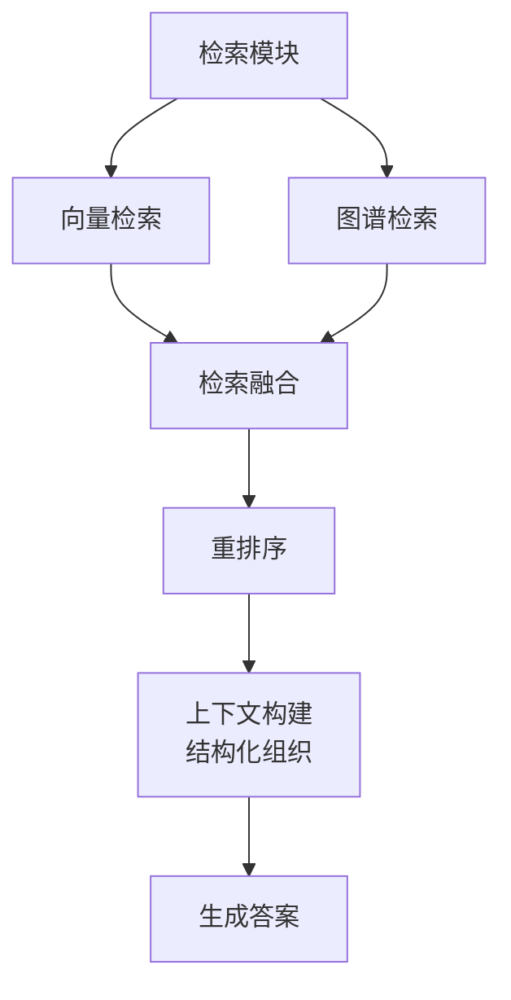
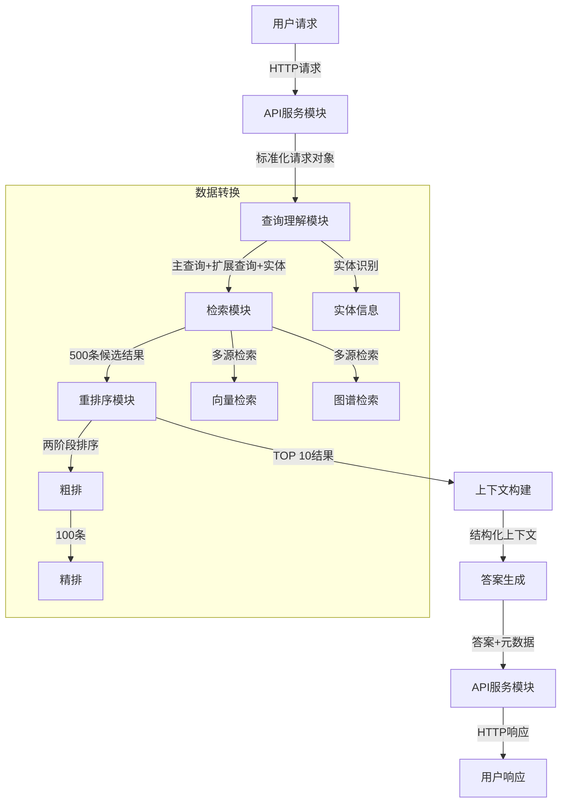
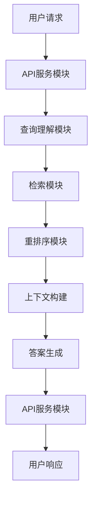

让我来解释一下这个容易混淆的概念：

### 关键理解点：
"上下文窗口"(Context Window)而不是"输入限制"才是准确的说法。这是因为：

1. **模型的工作原理**
```python
# 简化的示例来理解模型是如何工作的
context = "今天天气很好。"  # 第一个token的预测基于这个上下文
next_token = "我"          # 预测出的token
context += next_token     # 新token被加入上下文
# 现在上下文变成了："今天天气很好。我"
next_token = "准备"        # 基于更新后的上下文预测下一个token
context += next_token     # 继续更新上下文
# 上下文变成："今天天气很好。我准备"
```

### 形象的比喻：
想象一个滑动窗口：
```
初始状态（prompt）：
[今天天气很好。_____] <- 2048个格子的窗口
                    
第一次生成：
[今天天气很好。我____] <- "我"占用了一个位置
                    
第二次生成：
[今天天气很好。我准备___] <- "准备"又占用了一个位置
```

### 为什么是这样：
1. **模型的本质**
- 模型每次只是在预测下一个token
- 每预测一个token，它就会被加入到上下文中
- 模型需要看到之前的所有内容才能继续预测

2. **技术限制**
```python
class TransformerModel:
    def __init__(self, context_window=2048):
        self.context_window = context_window
        self.attention_matrix_size = context_window * context_window
        # 注意力矩阵大小是上下文长度的平方
        # 2048 * 2048 = 4,194,304 个注意力计算
```

### 实际应用示例：
```python
def generate_with_context(self, prompt, max_new_tokens):
    current_context = prompt
    generated_tokens = []
    
    while len(generated_tokens) < max_new_tokens:
        if len(current_context) >= self.context_window:
            break  # 达到上下文窗口限制
            
        next_token = self.predict_next_token(current_context)
        generated_tokens.append(next_token)
        current_context += next_token  # 关键点：生成的内容会占用上下文空间
```

### 面试回答版本：
"这个确实容易造成混淆。其实我们说的'最大输入token数'这个说法不够准确，更准确的说法是'上下文窗口大小'。

这是因为模型在生成文本时，是通过不断预测下一个token来完成的。每预测出一个新token，它就会被加入到上下文中，成为预测下一个token的依据。这就像是一个滑动窗口，窗口的总大小是固定的（比如2048），包含了已知的内容（prompt）和正在生成的内容。

举个例子，如果我们输入'今天天气很好'，模型可能预测下一个词是'我'。这个'我'字会立即被加入到上下文中，然后模型基于'今天天气很好。我'这个完整上下文来预测下一个词。这个过程会一直持续，直到达到上下文窗口的限制或生成完成。

所以说，这个限制不是简单的输入限制，而是模型在任何时刻能够处理的总token数量的限制，包括了输入和生成的内容。这是由模型的架构和计算方式决定的。"


抱歉我之前的解释有误。您说得对，我需要纠正我的理解：

### 正确的理解：
模型的上下文长度（Context Window）确实是包含了输入（prompt）和输出（completion）的总和。这意味着：

```python
class ModelContext:
    def __init__(self):
        self.total_context_length = 2048  # 总上下文窗口
        
    def calculate_available_completion_tokens(self, prompt_tokens):
        # 可用于生成的token数 = 总长度 - prompt长度
        return self.total_context_length - prompt_tokens
        
    def prepare_generation(self, prompt):
        prompt_token_count = count_tokens(prompt)
        available_completion_tokens = self.calculate_available_completion_tokens(prompt_token_count)
        
        if available_completion_tokens <= 0:
            raise ValueError("Prompt too long, no space for completion")
            
        return available_completion_tokens
```

### 实际示例：
假设模型上下文长度为2048 tokens：
```python
# 场景1：较长prompt
prompt_tokens = 1800
available_for_completion = 2048 - 1800  # 只剩248 tokens用于生成

# 场景2：适中prompt
prompt_tokens = 1000
available_for_completion = 2048 - 1000  # 有1048 tokens用于生成
```

### 优化建议：

1. **合理分配token预算**
```python
def allocate_token_budget(self, desired_completion_length=500):
    # 预留足够空间给生成内容
    max_prompt_tokens = self.total_context_length - desired_completion_length
    
    return {
        'system_prompt': min(200, max_prompt_tokens * 0.1),
        'query': min(100, max_prompt_tokens * 0.1),
        'context': min(max_prompt_tokens * 0.7, max_prompt_tokens - 300),
        'formatting': min(100, max_prompt_tokens * 0.1)
    }
```

2. **动态裁剪上下文**
```python
def optimize_context(self, context, query, desired_output_length=500):
    # 计算可用于上下文的token数
    available_for_context = (
        self.total_context_length 
        - desired_output_length  # 预留生成空间
        - count_tokens(query)    # 查询占用空间
        - 300                    # 系统提示词和格式化占用
    )
    
    return self.trim_context_to_fit(context, available_for_context)
```

3. **分批处理策略**
```python
def process_long_input(self, long_context, query):
    # 如果上下文太长，需要分批处理
    chunks = self.split_context(long_context)
    responses = []
    
    for chunk in chunks:
        # 确保每个批次都留有足够的生成空间
        prompt = self.create_prompt(chunk, query)
        if count_tokens(prompt) > self.total_context_length - 500:
            prompt = self.trim_prompt(prompt, self.total_context_length - 500)
        responses.append(self.generate(prompt))
    
    return self.merge_responses(responses)
```

### 面试回答版本：

"是的，我需要纠正之前的说法。模型的上下文窗口确实是包含了输入和输出的总和。这意味着如果我们有2048个tokens的限制，用了1800个tokens的prompt，那确实只剩下248个tokens用于生成输出了。

基于这个限制，在实践中我们需要做好token预算的分配。我通常会根据期望的输出长度，预先保留足够的空间。比如说，如果我们期望生成500个tokens的回答，那么用于prompt的部分就不能超过1548个tokens。

具体实现时，我会：
1. 预估所需的输出长度
2. 为系统提示词和查询预留固定空间
3. 根据剩余空间动态调整上下文的大小
4. 必要时采用分批处理的策略

这样可以确保我们既能提供足够的上下文信息，又能保证模型有足够的空间生成完整的回答。"

这个理解和实现方案更准确，感谢您的指出！


这个理解不太准确。让我来解释一下：

### 模型的输入和输出限制

1. **输入上下文窗口(Context Window)**
- 这是指模型能够同时处理的总token数（输入内容）
- 比如GPT-3.5是4k tokens，Claude是100k tokens

2. **输出生成限制(Maximum Generation Length)**
- 这是模型可以生成的最大token数（输出内容）
- 输出长度限制是独立于输入上下文窗口的
- 生成的内容不占用输入窗口的空间

### 正确的理解方式：
```python
class ModelHandler:
    def __init__(self):
        self.max_context_length = 2048    # 输入上下文窗口限制
        self.max_output_length = 1000     # 输出长度限制
        
    def prepare_prompt(self, context, query):
        prompt_template = "..."  # 约500 tokens
        context_limit = self.max_context_length - len(prompt_template)
        
        # 为context预留空间
        optimized_context = self.optimize_context(context, context_limit)
        
        return self.format_prompt(prompt_template, optimized_context, query)
        
    def generate_response(self, prompt):
        # 输出长度是独立的限制
        response = model.generate(
            prompt,
            max_new_tokens=self.max_output_length  # 这不会占用输入窗口空间
        )
        return response
```

### 实际应用示例：
假设模型限制如下：
- 输入上下文窗口：2048 tokens
- 输出长度限制：1000 tokens

你可以：
```python
# 有效的使用方式
prompt_tokens = 1800  # 接近输入限制
response = model.generate(
    prompt,
    max_new_tokens=1000  # 仍然可以生成完整的输出
)
```

### 优化建议：

1. **合理分配输入空间**
```python
def allocate_context_space(self):
    # 预留空间分配
    return {
        'system_prompt': 200,    # 系统提示
        'query': 100,           # 用户查询
        'context': 1600,        # 上下文信息
        'format_tokens': 148    # 格式化标记、分隔符等
    }
```

2. **动态调整策略**
```python
def optimize_context_dynamically(self, context, query):
    # 根据实际内容长度动态调整
    query_tokens = count_tokens(query)
    available_space = self.max_context_length - (
        self.system_prompt_tokens +
        query_tokens +
        self.format_tokens
    )
    
    return self.trim_context(context, available_space)
```

3. **分批处理长文本**
```python
def process_long_context(self, long_context):
    # 如果上下文太长，可以分批处理
    chunks = self.split_into_chunks(long_context)
    results = []
    
    for chunk in chunks:
        response = self.generate_response(chunk)
        results.append(response)
    
    return self.merge_results(results)
```

### 面试回答版本：

"这个理解不太准确。模型的最大输入token数（上下文窗口）和它能生成的最大输出长度是两个独立的限制。比如说，即使我们的prompt用了1800个tokens，模型仍然可以生成完整的输出，因为输出长度是单独限制的。

不过在实践中，我们确实需要合理规划输入空间的使用。我通常会预留固定空间给系统提示词和格式化标记，然后根据实际的查询长度，动态调整分配给上下文的空间。如果上下文实在太长，我们还可以采用分批处理的策略，确保生成的答案既完整又准确。

这样的处理方式既保证了生成质量，又充分利用了模型的能力。"


### 书面详细版本：

上下文构建阶段的主要目标是将重排序后的10条高价值信息转化为结构化且高效的上下文。具体实现包含以下关键步骤和优化点：

1. **信息分类与结构化**
```python
class ContextBuilder:
    def build_structured_context(self, ranked_results):
        structured_info = {
            "core_facts": [],      # 核心事实
            "price_info": [],      # 价格信息
            "location_details": [], # 位置详情
            "market_analysis": []   # 市场分析
        }
        
        for result in ranked_results:
            self.categorize_and_extract(result, structured_info)
        
        return structured_info
```

2. **信息去重与合并**
```python
def deduplicate_and_merge(self, structured_info):
    # 使用余弦相似度检测近似重复
    for category in structured_info:
        unique_info = []
        for info in structured_info[category]:
            if not self.is_similar_to_existing(info, unique_info):
                unique_info.append(info)
        structured_info[category] = unique_info
```

3. **上下文长度控制**
```python
def optimize_context_length(self, structured_info, max_tokens=3000):
    total_tokens = 0
    optimized_context = []
    
    # 按重要性排序
    for category in ["core_facts", "price_info", "location_details", "market_analysis"]:
        for info in structured_info[category]:
            tokens = self.count_tokens(info)
            if total_tokens + tokens <= max_tokens:
                optimized_context.append(info)
                total_tokens += tokens
            else:
                break
                
    return optimized_context
```

4. **信息关联性优化**
```python
def optimize_relevance(self, context, query):
    # 计算每条信息与查询的相关性得分
    scored_info = [(info, self.calculate_relevance(info, query)) 
                   for info in context]
    
    # 保持信息多样性的同时确保相关性
    return self.diverse_sampling(scored_info)
```

### 口语化面试版本：

"在上下文构建这个环节，我主要考虑了四个方面的优化：

首先是信息的结构化处理。我们会把这10条信息按照不同维度进行分类，比如核心事实、价格信息、位置详情等，这样可以让后续的生成模型能更好地理解和利用这些信息。

第二是信息的去重和合并。因为这10条信息可能会有内容上的重叠，我们使用了基于余弦相似度的去重策略，同时也会将互补的信息进行合并，提高信息密度。

第三点特别重要，就是考虑到了模型的上下文窗口限制。我们会根据不同模型的token限制，比如说GPT-3.5是4k的限制，我们会预留一定的空间给prompt和生成内容。具体做法是，我们会对每条信息进行token计数，按照信息的重要性进行优先级排序，确保最重要的信息能被包含在上下文中。

最后是信息的关联性优化。我们会计算每条信息与用户查询的相关性得分，在保证信息多样性的同时，优先保留与查询最相关的信息。

这些优化措施综合起来，既确保了上下文的质量和相关性，又解决了模型输入长度的限制问题，最终能够帮助模型生成更准确、更相关的回答。"

这样的回答既展示了技术深度，又能让面试官清晰地理解你的思路和实现方案。根据面试官的反应，你还可以深入展开讨论具体的实现细节或优化效果。


你说得对,但需要稍微调整理解。让我详细解释这两个"融合"的区别：

### 1. 检索阶段的融合
这是第一个真正的"融合"过程：
```python
class HybridRetriever:
    def __init__(self):
        self.vector_retriever = VectorRetriever()
        self.graph_retriever = GraphRetriever()
        
    async def retrieve(self, query, entities):
        # 并行执行不同来源的检索
        vector_results, graph_results = await asyncio.gather(
            self.vector_retriever.search(query),
            self.graph_retriever.search(entities)
        )
        
        # 融合策略
        merged_results = self.merge_results(
            vector_results=vector_results,  # 文本语义相似度检索结果
            graph_results=graph_results     # 知识图谱检索结果
        )
        
        return merged_results[:500]  # 返回top 500结果
        
    def merge_results(self, vector_results, graph_results):
        # 实现融合策略，例如：
        # 1. 分数归一化
        # 2. 权重分配
        # 3. 去重处理
        # 4. 排序整合
```

### 2. 上下文构建阶段
这个其实不是"融合"，而是"组织"或"结构化"：
```python
class ContextBuilder:
    def build_context(self, ranked_results):
        # 这不是融合，而是将排序后的结果进行结构化组织
        structured_context = {
            "price_info": self.extract_price_info(ranked_results),
            "location_info": self.extract_location_info(ranked_results),
            "market_analysis": self.extract_market_analysis(ranked_results),
            "property_details": self.extract_property_details(ranked_results)
        }
        
        return structured_context
```

### 主要区别：

1. **检索融合**
- 目的：合并不同来源、不同性质的检索结果
- 特点：需要处理不同格式、不同分数体系
- 难点：如何平衡不同来源的权重

2. **上下文构建**
- 目的：将已排序的同质化信息进行结构化组织
- 特点：是一个信息提取和组织的过程
- 难点：如何提取关键信息并合理组织

### 正确的理解方式：


所以说，整个流程中真正的"融合"只发生在检索阶段，而上下文构建阶段更准确地说是一个"结构化组织"的过程。这个理解对于实现系统和向面试官解释都会更加准确。

在面试中，你可以这样说：
"我们系统中有一个关键的融合环节，就是在检索阶段，我们需要融合来自向量检索和图谱检索的异构结果。而在上下文构建阶段，我们做的是对重排序后的同质化结果进行结构化的信息组织，这个过程更像是信息的提取和重组，而不是融合。"


好的,让我继续详细讲解各模块间的数据流转:

### 文字版本
"我们的系统是一个端到端的房地产问答系统,让我详细说明下数据是如何在各个模块间流转的:

1. **API服务模块(入口)**
- 输入:用户的HTTP请求,包含查询文本
- 输出:经过验证和预处理的标准化请求对象
```python
# 输入示例
{
    "query": "北京海淀区2000万预算能买多大的房子？",
    "user_id": "12345",
    "timestamp": "2024-03-21 10:00:00"
}
```

2. **查询理解模块**
- 输入:标准化的查询文本
- 输出:主查询和扩展查询列表,以及识别出的实体信息
```python
{
    "main_query": "北京海淀区 2000万 房屋面积",
    "expanded_queries": [
        "海淀区二手房均价",
        "海淀区2000万房源分布"
    ],
    "entities": {
        "location": "北京海淀区",
        "budget": 2000_0000,
        "property_type": "住宅"
    }
}
```

3. **检索模块**
- 输入:查询理解模块的输出结果
- 输出:从多个源检索到的候选结果(500条)
```python
{
    "candidates": [
        {
            "text": "海淀区均价80000/平米...",
            "source": "vector_db",
            "score": 0.95,
            "metadata": {...}
        },
        {
            "text": "2000万在海淀可购买约250平米...",
            "source": "knowledge_graph",
            "score": 0.88,
            "metadata": {...}
        }
    ]
}
```

4. **重排序模块**
- 输入:500条候选结果
- 输出:经过粗排和精排后的TOP 10结果
```python
{
    "ranked_results": [
        {
            "text": "...",
            "final_score": 0.98,
            "relevance_score": 0.95,
            "quality_score": 0.96
        }
    ],
    "ranking_features": {...}
}
```

5. **上下文构建模块**
- 输入:TOP 10排序结果
- 输出:结构化的上下文信息
```python
{
    "context": {
        "price_info": "海淀区均价约8-10万/平方米",
        "area_range": "200-250平方米",
        "location_details": "...",
        "market_analysis": "..."
    },
    "reference_sources": [...]
}
```

6. **答案生成模块**
- 输入:原始查询 + 结构化上下文
- 输出:生成的答案文本
```python
{
    "answer": "以2000万预算在北京海淀区,您大约可以购买220-250平米的住宅...",
    "references": [...],
    "confidence_score": 0.92
}
```

7. **API服务模块(出口)**
- 输入:生成的答案及元数据
- 输出:标准化的HTTP响应
```python
{
    "code": 200,
    "data": {
        "answer": "...",
        "references": [...],
        "processing_time": 1.5
    },
    "request_id": "req_123456"
}
```

### Mermaid流程图


这种模块化的设计不仅保证了系统的可维护性和可扩展性,每个模块都有明确的职责和标准化的输入输出接口,也便于我们对各个环节进行独立的优化和监控。在实际生产环境中,我们还会在各个模块间加入监控、日志、异常处理等机制,确保系统的稳定性和可观测性。


让我先用口语化的方式来详细讲解各个模块间的关系和数据流转：

### 文字版本
"我们的系统是一个端到端的房地产问答系统，让我详细说明下数据是如何在各个模块间流转的：

首先，当用户输入一个问题，比如'北京海淀区2000万预算能买多大的房子？'，这个问题会先进入API服务模块。这里会进行请求验证、用户认证等预处理工作，确保请求的合法性。

接着，查询理解模块会接收到这个原始问题。它会做两件重要的事：一是将问题改写成更利于检索的形式，可能会产生'北京海淀区 2000万 房屋面积'这样的主查询，以及'海淀区二手房价格'、'海淀区房


好的，我来列举5个FastAPI的高频面试题，通过这些问题可以快速掌握FastAPI的核心概念：

### 1. FastAPI相比Flask等框架有什么优势？为什么选择FastAPI？

**答案：**
FastAPI的主要优势包括：

1. **性能优势**
```python
# FastAPI基于Starlette，支持异步处理
from fastapi import FastAPI
app = FastAPI()

@app.get("/async-example")
async def async_endpoint():
    result = await some_async_operation()
    return result
```

2. **自动API文档**
- 自动生成Swagger UI (/docs)和ReDoc (/redoc)
- 无需额外配置

3. **类型检查和验证**
```python
from pydantic import BaseModel

class Item(BaseModel):
    name: str
    price: float
    is_offer: bool = None

@app.post("/items/")
async def create_item(item: Item):
    # Pydantic自动进行类型验证
    return item
```

4. **开发效率高**
- 代码简洁
- 自动参数验证
- 更好的IDE支持

### 2. 如何在FastAPI中实现依赖注入？

**答案：**
FastAPI提供了强大的依赖注入系统：

```python
from fastapi import Depends, HTTPException
from typing import Optional

# 1. 基础依赖项
async def get_db():
    db = DBConnection()
    try:
        yield db
    finally:
        db.close()

# 2. 类作为依赖项
class CommonQueryParams:
    def __init__(self, q: Optional[str] = None, skip: int = 0, limit: int = 100):
        self.q = q
        self.skip = skip
        self.limit = limit

# 3. 使用依赖项
@app.get("/items/")
async def read_items(
    commons: CommonQueryParams = Depends(CommonQueryParams),
    db: Database = Depends(get_db)
):
    items = db.query(skip=commons.skip, limit=commons.limit)
    return items
```

### 3. FastAPI中如何处理异常和错误？

**答案：**
FastAPI提供了多种错误处理机制：

```python
from fastapi import HTTPException
from fastapi.responses import JSONResponse
from fastapi.requests import Request

# 1. 使用HTTPException
@app.get("/items/{item_id}")
async def read_item(item_id: int):
    if item_id not in items:
        raise HTTPException(
            status_code=404,
            detail="Item not found",
            headers={"X-Error": "Item not found"},
        )
    return items[item_id]

# 2. 自定义异常处理器
@app.exception_handler(ValueError)
async def value_error_handler(request: Request, exc: ValueError):
    return JSONResponse(
        status_code=400,
        content={"message": str(exc)},
    )

# 3. 全局异常处理
@app.middleware("http")
async def error_handling(request: Request, call_next):
    try:
        return await call_next(request)
    except Exception as exc:
        return JSONResponse(
            status_code=500,
            content={"message": f"发生未知错误: {str(exc)}"}
        )
```

### 4. 如何在FastAPI中实现身份验证和授权？

**答案：**
FastAPI提供了多种认证方式：

```python
from fastapi.security import OAuth2PasswordBearer, OAuth2PasswordRequestForm
from jose import JWTError, jwt

# 1. 基础认证设置
oauth2_scheme = OAuth2PasswordBearer(tokenUrl="token")

# 2. JWT认证实现
async def get_current_user(token: str = Depends(oauth2_scheme)):
    credentials_exception = HTTPException(
        status_code=401,
        detail="Could not validate credentials",
        headers={"WWW-Authenticate": "Bearer"},
    )
    try:
        payload = jwt.decode(token, SECRET_KEY, algorithms=[ALGORITHM])
        username: str = payload.get("sub")
        if username is None:
            raise credentials_exception
    except JWTError:
        raise credentials_exception
    return username

# 3. 在端点中使用认证
@app.get("/users/me")
async def read_users_me(current_user: str = Depends(get_current_user)):
    return {"username": current_user}
```

### 5. FastAPI中如何处理CORS（跨域资源共享）？

**答案：**
FastAPI提供了简单的CORS配置：

```python
from fastapi.middleware.cors import CORSMiddleware

app = FastAPI()

# 1. 基础CORS配置
app.add_middleware(
    CORSMiddleware,
    allow_origins=["http://localhost:3000"],  # 前端域名
    allow_credentials=True,
    allow_methods=["*"],  # 允许所有方法
    allow_headers=["*"],  # 允许所有头部
)

# 2. 更细致的CORS配置
app.add_middleware(
    CORSMiddleware,
    allow_origins=[
        "http://localhost:3000",
        "https://frontend.example.com"
    ],
    allow_credentials=True,
    allow_methods=["GET", "POST", "PUT", "DELETE"],
    allow_headers=["Authorization", "Content-Type"],
    expose_headers=["X-Custom-Header"],
    max_age=600,  # 预检请求缓存时间
)
```

### 补充建议

1. **实际开发中的最佳实践**
   - 使用Pydantic模型进行数据验证
   - 合理使用异步功能
   - 适当使用依赖注入
   - 做好错误处理
   - 注意API文档的维护

2. **性能优化考虑**
   - 使用适当的并发设置
   - 合理使用缓存
   - 注意数据库连接池管理
   - 考虑使用后台任务

这些问题涵盖了FastAPI的主要特性和常见使用场景。建议在实际项目中多加练习这些概念，特别是异步处理和依赖注入这两个特性，它们是FastAPI的重要优势。


在Python后端开发中，FastAPI和Flask都是很好的选择，但对于现代的RAG问答系统，我更推荐使用FastAPI，以下是详细分析：

### FastAPI vs Flask 对比
1. **性能方面**
   - FastAPI基于Starlette和Pydantic，性能比Flask更好
   - 原生支持异步处理，特别适合RAG系统的长时间运算
   - 并发处理能力更强

2. **开发效率**
   - FastAPI自带API文档（Swagger/ReDoc）
   - 类型提示支持更好
   - 参数校验更方便

### FastAPI实现示例

```python
from fastapi import FastAPI, HTTPException, Depends
from pydantic import BaseModel
from typing import Optional, List
import asyncio

# 请求模型
class QueryRequest(BaseModel):
    query: str
    user_id: str
    parameters: Optional[dict] = None

# 响应模型
class QueryResponse(BaseModel):
    answer: str
    references: List[dict]
    processing_time: float

# API实现
app = FastAPI(title="房地产问答系统")

@app.post("/api/v1/qa", response_model=QueryResponse)
async def query_endpoint(
    request: QueryRequest,
    auth: AuthDependency = Depends(get_auth_dependency)
):
    try:
        # 1. 请求预处理
        await rate_limiter.check(request.user_id)
        
        # 2. 创建请求上下文
        context = RequestContext(
            query=request.query,
            user_id=request.user_id,
            start_time=time.time()
        )
        
        # 3. 异步处理查询
        result = await process_query_pipeline(context)
        
        # 4. 构建响应
        return QueryResponse(
            answer=result.answer,
            references=result.references,
            processing_time=time.time() - context.start_time
        )
        
    except RateLimitExceeded:
        raise HTTPException(status_code=429, detail="请求频率超限")
    except Exception as e:
        raise HTTPException(status_code=500, detail=str(e))

# 健康检查接口
@app.get("/health")
async def health_check():
    return {"status": "healthy"}

# 批量查询接口
@app.post("/api/v1/batch-qa")
async def batch_query_endpoint(
    requests: List[QueryRequest],
    auth: AuthDependency = Depends(get_auth_dependency)
):
    tasks = [process_query_pipeline(req) for req in requests]
    results = await asyncio.gather(*tasks)
    return results
```

### 中间件实现

```python
from fastapi import Request
from time import time

@app.middleware("http")
async def add_process_time_header(request: Request, call_next):
    start_time = time()
    response = await call_next(request)
    process_time = time() - start_time
    response.headers["X-Process-Time"] = str(process_time)
    return response

@app.middleware("http")
async def error_handler(request: Request, call_next):
    try:
        return await call_next(request)
    except Exception as e:
        return JSONResponse(
            status_code=500,
            content={
                "code": 500,
                "message": "服务器内部错误",
                "detail": str(e)
            }
        )
```

### 依赖注入示例

```python
from fastapi import Depends, Security
from fastapi.security import APIKeyHeader

api_key_header = APIKeyHeader(name="X-API-Key")

async def get_auth_dependency(
    api_key: str = Security(api_key_header)
):
    if not await verify_api_key(api_key):
        raise HTTPException(
            status_code=403,
            detail="Invalid API Key"
        )
    return api_key
```

### 为什么选择FastAPI的原因

1. **技术优势**
   - 原生异步支持
   - 自动API文档生成
   - 更好的类型提示
   - 内置参数校验
   - 性能更优

2. **开发效率**
   - 代码更简洁
   - 错误处理更方便
   - 依赖注入系统
   - 中间件支持

3. **生态系统**
   - 与现代Python工具链集成更好
   - 活跃的社区支持
   - 丰富的第三方库

4. **生产环境考虑**
   - 更好的并发处理
   - 更容易扩展
   - 更好的监控支持

### 部署配置示例

```python
# uvicorn配置
config = {
    "app": "main:app",
    "host": "0.0.0.0",
    "port": 8000,
    "workers": 4,
    "loop": "uvloop",
    "limit_concurrency": 1000,
    "timeout_keep_alive": 5,
    "log_level": "info"
}

# 使用gunicorn管理uvicorn
# gunicorn配置
gunicorn_conf = {
    "workers": 4,
    "worker_class": "uvicorn.workers.UvicornWorker",
    "bind": "0.0.0.0:8000",
    "timeout": 30,
    "keepalive": 5
}
```

在实际项目中，FastAPI已经成为Python后端API开发的主流选择，特别是对于需要处理异步操作和高并发的现代应用。它的性能优势和开发友好性使其特别适合RAG这类需要处理复杂异步操作的系统。

当然，如果是一个简单的原型系统或者特别轻量级的应用，Flask仍然是一个不错的选择。但对于生产环境的RAG系统，FastAPI会是更好的选择。


是的，API服务模块实际上是整个系统的"门面"，它同时处理入口和出口的流量。让我详细解释一下：

### API服务模块的位置和作用



### 1. 入口处的API服务（请求处理）
```python
class RealEstateQAAPI:
    def __init__(self):
        self.rate_limiter = RateLimiter()
        self.auth_service = AuthService()
        
    async def handle_incoming_request(self, request):
        # 1. 请求预处理
        if not self.rate_limiter.allow():
            return self.create_error_response("请求频率超限")
            
        # 2. 用户认证
        if not self.auth_service.validate(request):
            return self.create_error_response("认证失败")
            
        # 3. 参数验证
        if not self.validate_params(request.query):
            return self.create_error_response("参数无效")
            
        # 4. 创建请求上下文
        context = RequestContext(
            user_id=request.user_id,
            query=request.query,
            timestamp=time.now()
        )
        
        # 5. 转发到业务处理流程
        return await self.process_pipeline(context)
```

### 2. 出口处的API服务（响应处理）
```python
class RealEstateQAAPI:
    async def handle_outgoing_response(self, result, context):
        try:
            # 1. 响应格式化
            formatted_response = {
                "code": 200,
                "data": {
                    "answer": result.answer,
                    "references": result.references
                },
                "request_id": context.request_id,
                "processing_time": time.now() - context.timestamp
            }
            
            # 2. 响应日志记录
            self.logger.info(f"Request {context.request_id} completed successfully")
            
            # 3. 性能指标记录
            self.metrics.record_success(context.processing_time)
            
            return formatted_response
            
        except Exception as e:
            # 异常处理
            self.logger.error(f"Error processing response: {str(e)}")
            return self.create_error_response("服务器内部错误")
```

### 完整流程示例
```python
class RealEstateQAAPI:
    async def process_request(self, http_request):
        try:
            # 入口处理
            context = await self.handle_incoming_request(http_request)
            if isinstance(context, ErrorResponse):
                return context
                
            # 业务流程处理
            result = await self.business_pipeline(context)
            
            # 出口处理
            return await self.handle_outgoing_response(result, context)
            
        except Exception as e:
            return self.handle_exception(e)
            
    async def business_pipeline(self, context):
        # 1. 查询理解
        query_info = await self.query_understanding.process(context.query)
        
        # 2. 检索
        search_results = await self.retriever.search(query_info)
        
        # 3. 重排序
        ranked_results = await self.ranker.rank(search_results)
        
        # 4. 上下文构建
        context = await self.context_builder.build(ranked_results)
        
        # 5. 答案生成
        return await self.answer_generator.generate(context)
```

### API服务模块的主要职责

1. **入口处理：**
   - 请求验证和认证
   - 流量控制
   - 参数校验
   - 请求日志记录
   - 创建请求上下文

2. **出口处理：**
   - 响应格式化
   - 错误处理
   - 性能指标记录
   - 响应日志记录
   - 响应压缩（如需要）

3. **全局功能：**
   - 服务监控
   - 链路追踪
   - 性能统计
   - 错误报警

### 为什么需要统一的入口和出口？

1. **标准化处理**
   - 统一的请求/响应格式
   - 统一的错误处理机制
   - 统一的日志记录方式

2. **安全性**
   - 集中的认证授权
   - 统一的攻击防护
   - 请求来源验证

3. **可维护性**
   - 集中的监控点
   - 统一的问题排查入口
   - 便于系统升级和维护

这样的设计使得系统更加健壮和可维护，同时也便于后续的功能扩展和性能优化。在面试中，这种架构设计也能展示你对企业级应用开发的深入理解。


