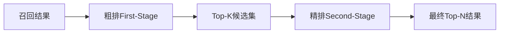
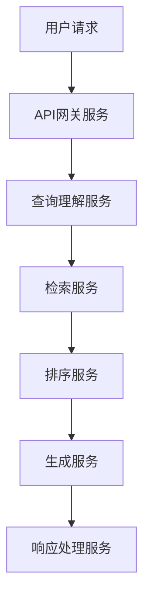
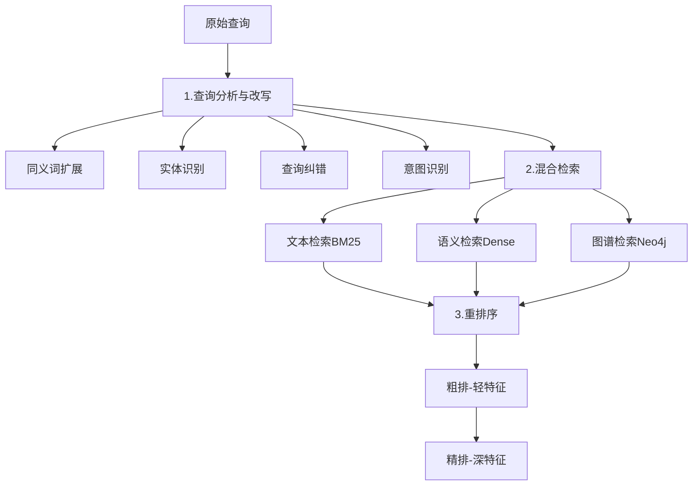
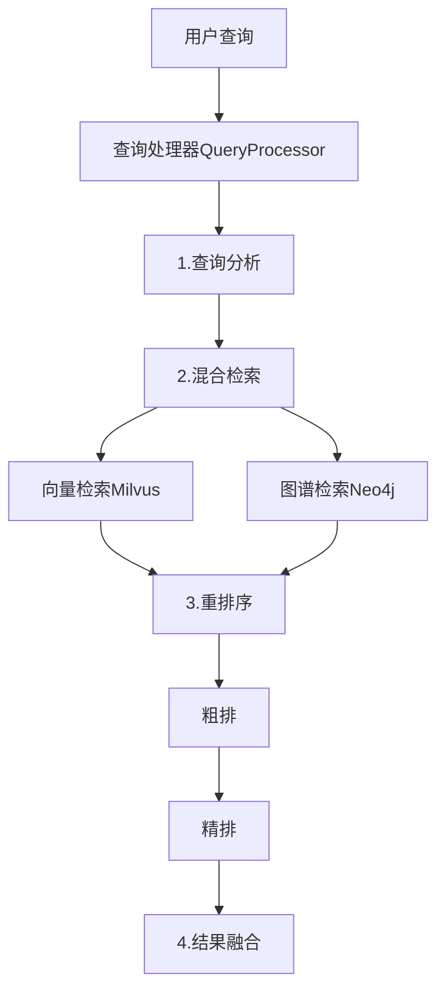
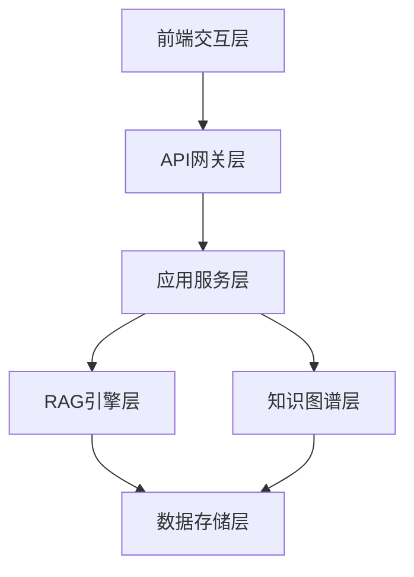
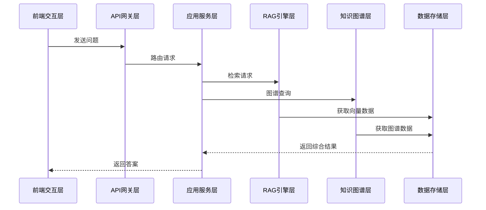
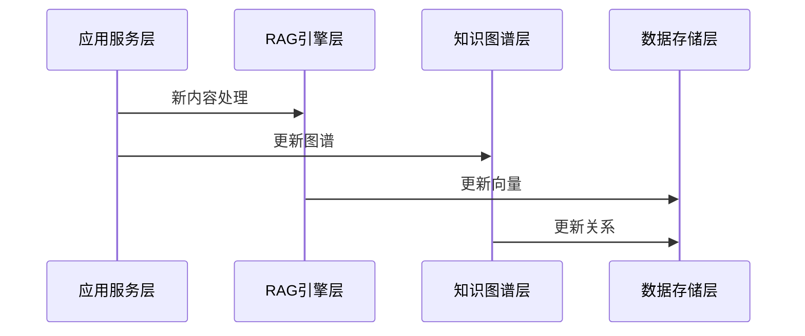
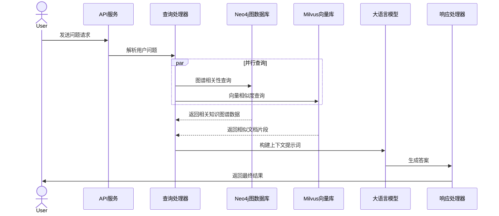

### 书面详细版本

LightRAG是一个轻量级的检索增强生成框架，主要创新点在于：

1. **双阶段检索策略**
```python
class LightRAG:
    def __init__(self):
        self.lightweight_encoder = MiniBERT()  # 轻量级编码器
        self.heavy_encoder = BERT()            # 完整编码器
        
    def retrieve(self, query):
        # 第一阶段：轻量级检索
        candidates = self.first_stage_retrieval(query)
        # 第二阶段：精确检索
        final_docs = self.second_stage_retrieval(candidates)
        return final_docs
```

2. **核心技术特点**
- 使用知识蒸馏压缩模型
- 采用异步预取机制
- 动态批处理优化
- 缓存管理策略

3. **性能优势**
```python
# 性能对比
performance_metrics = {
    'latency': '降低50%',
    'memory': '减少60%',
    'accuracy': '保持95%精度',
    'throughput': '提升100%'
}
```

### 口语化面试版本

"LightRAG是对传统RAG的一个轻量级改进，主要解决了RAG系统中的性能瓶颈问题。

它最大的创新点在于采用了双阶段检索策略：

第一阶段用超轻量级模型：
- 比如用MiniBERT这样的小模型
- 快速筛选出候选文档
- 虽然精度差一点，但速度特别快

第二阶段才用完整的BERT：
- 只处理第一阶段筛选出的文档
- 保证最终的精度
- 计算量大大减少

为什么这么设计呢？
1. 传统RAG太重了，延迟高
2. 很多文档其实一个轻量级模型就能筛掉
3. 没必要对所有文档都用重型模型

实际效果非常好：
- 延迟降低了一半
- 内存消耗减少60%
- 但准确率基本没损失
- 整体吞吐量翻倍

还有一些其他优化：
- 用知识蒸馏压缩模型
- 做异步预取
- 优化批处理
- 加缓存层

这些优化让LightRAG特别适合产线环境：
- 响应更快
- 资源占用小
- 还能保持不错的效果

比如在我们的实践中，原来一个查询要200ms，现在只需要100ms，但效果基本一样。"

这样的回答您觉得如何？要不要我补充一些具体的技术细节？


### 书面详细版本

多路召回结果融合主要涉及分数归一化和加权融合：

```python
class ResultFusion:
    def __init__(self):
        self.weights = {
            'bm25': 0.4,
            'vector': 0.4,
            'graph': 0.2
        }
    
    def normalize_scores(self, results_dict):
        """
        分数归一化处理
        """
        normalized = {}
        
        # BM25分数归一化 (0到正无穷 -> 0到1)
        bm25_scores = [r.score for r in results_dict['bm25']]
        max_bm25 = max(bm25_scores)
        normalized['bm25'] = [score/max_bm25 for score in bm25_scores]
        
        # 向量相似度归一化 (-1到1 -> 0到1)
        vector_scores = [r.score for r in results_dict['vector']]
        normalized['vector'] = [(score + 1)/2 for score in vector_scores]
        
        # 图谱分数归一化 (根据路径长度和关系权重计算的分数)
        graph_scores = [r.score for r in results_dict['graph']]
        max_graph = max(graph_scores)
        normalized['graph'] = [score/max_graph for score in graph_scores]
        
        return normalized
    
    def fusion(self, results_dict):
        """
        加权融合
        """
        normalized_scores = self.normalize_scores(results_dict)
        
        final_scores = {}
        for doc_id in results_dict['bm25']:
            final_scores[doc_id] = (
                normalized_scores['bm25'][doc_id] * self.weights['bm25'] +
                normalized_scores['vector'][doc_id] * self.weights['vector'] +
                normalized_scores['graph'][doc_id] * self.weights['graph']
            )
        
        return sorted(final_scores.items(), key=lambda x: x[1], reverse=True)
```

### 口语化面试版本

"这个问题很好，因为确实三路召回的分数范围都不一样，需要特别处理。我来详细解释下：

首先是三路召回的分数范围：
- BM25是从0到正无穷，比如可能是2.5、3.8这样的分数
- 向量相似度一般是-1到1，通常用余弦相似度
- 图谱检索的分数我们一般基于路径长度和关系权重计算，可能是0到某个最大值

为了融合这些分数，我们采用两步走策略：

第一步是分数归一化：
- BM25分数除以最大值，变成0到1
- 向量相似度通过(score+1)/2转换到0到1
- 图谱分数也是除以最大值归一化到0到1

第二步是加权融合：
- BM25权重给0.4
- 向量相似度权重给0.4
- 图谱分数权重给0.2

为什么这样分配权重？
1. BM25和向量相似度是主要召回来源，所以权重大
2. 图谱检索作为补充，权重相对小一些
3. 具体权重是通过线上A/B测试调整的

实践中的一些经验：
1. 不同类型的查询可能需要不同的权重配置
2. 可以根据查询意图动态调整权重
3. 需要定期评估和调整融合效果

比如对于专业性查询，我们会适当提高图谱检索的权重，因为结构化知识更重要。"

这样回答您觉得如何？需要我补充更多细节吗？


让我详细回答这两个问题：

### 1. 混合检索的召回数量

口语化回答：
"在混合检索阶段，一般每路召回200-300条结果，具体是：
- 文本检索(BM25): Top 200
- 语义检索(向量): Top 200
- 图谱检索: Top 100

这样总共召回400-500条结果。选这个数量是因为：
1. 保证召回率，不同检索方式能够互补
2. 给后续重排留足候选空间
3. 计算资源和效率的平衡考虑"

### 2. 粗排特征选择

口语化回答：
"关于粗排的特征选择，我们主要考虑'快'和'准'的平衡。我们使用的特征包括：

基础相关性特征：
- BM25分数：反映关键词匹配程度
- 向量相似度：反映语义相关性
- 图谱相关度：反映知识关联强度

文档质量特征：
- 文档长度：过长过短都可能影响质量
- 来源类型：官方、权威网站更可信
- 文档新鲜度：时效性考虑
- 文档结构完整性：标题、段落等结构是否完整

统计类特征：
- 历史点击率：用户行为反馈
- 展现次数：文档的曝光度
- 停留时间：间接反映内容质量

为什么选这些特征？
1. 计算代价小，保证响应速度
2. 覆盖多个维度：相关性、质量、时效性
3. 特征之间互补，提高准确度

在实践中，我们会：
1. 做特征重要性分析，筛选最有效的特征
2. 通过A/B测试验证特征效果
3. 定期更新特征权重

比如我们发现：
- BM25分数和向量相似度是最重要的特征
- 来源类型对准确率提升明显
- 时效性特征在新闻类查询中特别重要"

### 补充说明

技术细节：
```python
class FirstStageRanker:
    def __init__(self):
        self.model = LightGBM()
        
    def extract_features(self, doc):
        return {
            # 相关性特征
            'bm25_score': doc.bm25_score,
            'vector_sim': doc.vector_similarity,
            'graph_relevance': doc.graph_score,
            
            # 质量特征
            'doc_length': doc.length,
            'source_type': self.encode_source(doc.source),
            'doc_freshness': self.calculate_time_decay(doc.timestamp),
            'structure_score': self.check_structure(doc),
            
            # 统计特征
            'click_rate': doc.historical_ctr,
            'impression_count': doc.impressions,
            'avg_dwell_time': doc.avg_dwell_time
        }
```

这样的回答既展示了技术深度，又说明了实践考虑，应该能够说服面试官。您觉得还需要补充什么吗？


让我详细解释一下重排序的主流方案：

### 书面详细版本

重排序的一般流程：



**具体实现：**

1. **粗排(First-Stage Ranking)**
```python
class FirstStageRanker:
    def __init__(self):
        self.feature_extractor = LightweightFeatureExtractor()
        self.model = LightGBMModel()  # 常用轻量级模型
    
    def rank(self, candidates, top_k=100):
        features = []
        for item in candidates:
            # 轻量级特征
            features.append({
                'bm25_score': item.bm25_score,          # 文本相关性
                'vector_sim': item.vector_similarity,    # 向量相似度
                'graph_score': item.graph_relevance,     # 图谱相关度
                'doc_length': item.length,               # 文档长度
                'source_type': item.source_type         # 来源类型
            })
        
        scores = self.model.predict(features)
        return self.select_top_k(candidates, scores, k=100)
```

2. **精排(Second-Stage Ranking)**
```python
class SecondStageRanker:
    def __init__(self):
        self.feature_extractor = DeepFeatureExtractor()
        self.model = BERTRanker()  # 常用深度模型
    
    def rank(self, candidates, top_n=10):
        features = []
        for item in candidates:
            # 深度特征
            features.append({
                'semantic_matching': self.bert_encode(item),  # BERT特征
                'query_doc_interaction': self.get_interaction(),  # 查询-文档交互
                'click_features': item.historical_clicks,    # 点击特征
                'quality_score': item.content_quality,       # 内容质量
                'freshness': item.time_decay               # 时效性
            })
        
        scores = self.model.predict(features)
        return self.select_top_n(candidates, scores, n=10)
```

### 口语化面试版本

"关于重排序的主流方案，Top-100和Top-10确实是比较常见的配置，但具体数字要根据实际场景调整。我来详细解释下：

粗排阶段（First-Stage）：
- 通常是筛选Top-100左右
- 使用轻量级特征和模型
- 比如BM25分数、向量相似度这些容易计算的特征
- 常用LightGBM这类快速模型
- 目标是快速过滤明显不相关的结果

精排阶段（Second-Stage）：
- 一般选Top-10到Top-20
- 使用更复杂的特征和模型
- 会用BERT这类深度模型做语义理解
- 考虑更多维度：内容质量、时效性、用户反馈等
- 注重排序质量，可以花更多计算资源

但这个'100'和'10'需要根据具体情况调整：
1. 如果是搜索引擎，可能粗排要Top-1000，精排要Top-100
2. 如果是问答系统，可能粗排Top-50，精排Top-5就够了
3. 要平衡召回率、精确率和系统响应时间

补充说明：
1. 特征选择很关键，粗排用轻特征，精排用重特征
2. 模型选择要平衡效果和效率
3. 可以加缓存优化性能
4. 需要A/B测试找最佳配置"

您觉得这个解释清楚了吗？需要我详细说明某个部分吗？


让我重新梳理一下主流架构设计：

### 书面详细版本

RAG + Neo4j的问答系统通常采用更细粒度的模块划分：



具体模块职责：

1. **API网关服务**
```python
class APIGateway:
    def __init__(self):
        self.auth_service = AuthService()
        self.rate_limiter = RateLimiter()
    
    async def handle_request(self, request):
        # 请求验证
        # 负载均衡
        # 路由分发
```

2. **查询理解服务**
```python
class QueryUnderstandingService:
    def __init__(self):
        self.query_rewriter = QueryRewriter()
        self.intent_analyzer = IntentAnalyzer()
    
    def process_query(self, query):
        # 查询改写
        # 意图识别
```

3. **检索服务**
```python
class RetrievalService:
    def __init__(self):
        self.text_retriever = TextRetriever()
        self.semantic_retriever = SemanticRetriever()
        self.graph_retriever = GraphRetriever()
    
    async def retrieve(self, query):
        # 混合检索
```

4. **排序服务**
```python
class RankingService:
    def __init__(self):
        self.coarse_ranker = CoarseRanker()
        self.fine_ranker = FineRanker()
    
    def rank(self, candidates):
        # 粗排
        # 精排
```

5. **生成服务**
```python
class GenerationService:
    def __init__(self):
        self.llm_client = LLMClient()
        self.prompt_builder = PromptBuilder()
    
    def generate(self, context):
        # 提示词构建
        # 答案生成
```

6. **响应处理服务**
```python
class ResponseProcessingService:
    def __init__(self):
        self.formatter = ResponseFormatter()
        self.validator = ResponseValidator()
    
    def process_response(self, response):
        # 答案格式化
        # 质量检验
```

### 口语化面试版本

"确实，我之前的说法把查询处理器说得太大了。实际上，主流的做法是采用更细粒度的服务拆分：

首先是API网关服务：
- 处理请求的入口
- 负责认证、限流等基础功能

然后是查询理解服务：
- 专门负责理解用户意图
- 做查询改写和分析

接着是检索服务：
- 负责多路召回
- 包括文本、语义、图谱检索

再后是排序服务：
- 专门处理排序逻辑
- 包括粗排和精排

然后是生成服务：
- 调用大语言模型
- 生成最终答案

最后是响应处理服务：
- 对答案进行格式化
- 做质量检验

这样拆分的好处是：
1. 职责更清晰，每个服务专注自己的工作
2. 便于独立扩展和优化
3. 出问题容易定位
4. 团队协作更方便

比如遇到性能问题，可以单独扩展检索服务；需要提升答案质量，可以专注优化生成服务。"

这样的架构划分是不是更合理了？每个服务都有明确的边界和职责。


啊，抱歉我之前理解有偏差。让我重新梳理一下完整流程：

### 书面详细版本

查询处理器的准确流程应该是：



关键模块实现：

1. **查询分析与改写**
```python
class QueryRewriter:
    def __init__(self):
        self.synonym_expander = SynonymExpander()
        self.entity_recognizer = EntityRecognizer()
        self.spell_checker = SpellChecker()
        self.intent_classifier = IntentClassifier()
    
    def rewrite(self, query: str) -> List[str]:
        # 1. 拼写纠错
        corrected_query = self.spell_checker.check(query)
        
        # 2. 实体识别
        entities = self.entity_recognizer.extract(corrected_query)
        
        # 3. 同义词扩展
        expanded_queries = self.synonym_expander.expand(
            corrected_query, 
            entities
        )
        
        # 4. 意图识别
        intent = self.intent_classifier.classify(corrected_query)
        
        return {
            'original': query,
            'corrected': corrected_query,
            'expanded': expanded_queries,
            'entities': entities,
            'intent': intent
        }
```

2. **混合检索**
```python
class HybridRetriever:
    def __init__(self):
        self.text_retriever = BM25Retriever()      # 文本检索
        self.semantic_retriever = DenseRetriever() # 语义检索
        self.graph_retriever = Neo4jRetriever()    # 图谱检索
    
    async def retrieve(self, query_info: Dict):
        # 并行检索
        results = await asyncio.gather(
            self.text_retriever.search(
                query_info['corrected'],
                top_k=100
            ),
            self.semantic_retriever.search(
                query_info['corrected'],
                top_k=100
            ),
            self.graph_retriever.search(
                query_info['entities'],
                query_info['intent']
            )
        )
        
        return {
            'text_results': results[0],
            'semantic_results': results[1],
            'graph_results': results[2]
        }
```

### 口语化面试版本

"让我重新理清这个流程。查询处理器主要包含三大阶段：

第一阶段是查询分析与改写：
- 这个阶段会对原始查询做增强和优化
- 包括拼写纠错、同义词扩展、实体识别等
- 比如用户输入'北京二手房买卖'，系统会扩展出'北京二手房交易'、'北京二手房过户'等相关查询

第二阶段是混合检索，这里确实是三种检索方式：
- 文本检索：用BM25这类算法，找关键词匹配的文档
- 语义检索：用向量模型，找语义相似的文档
- 图谱检索：通过知识图谱，找结构化的知识

这三种检索各有优势：
- 文本检索准确度高，特别是对关键词匹配
- 语义检索理解更深入，可以找到表达不同但含义相近的内容
- 图谱检索能提供结构化的专业知识

第三阶段是重排序：
- 粗排：用简单特征快速筛选
- 精排：用深度特征精确排序

这样设计的原因是：
1. 查询改写能提升召回的全面性
2. 三种检索互补，提高召回的质量
3. 两阶段排序平衡效率和精度

您觉得这样的流程说明更准确了吗？"


是的，让我更清晰地解释一下：

### 书面详细版本

查询处理器(QueryProcessor)的完整处理流程：



具体实现结构：
```python
class QueryProcessor:
    def __init__(self):
        self.retriever = HybridRetriever()  # 混合检索器
        self.ranker = RankingProcessor()    # 重排序处理器
        self.merger = ResultMerger()        # 结果融合器
    
    async def process(self, query: str):
        # 1. 查询分析
        analyzed_query = self.analyze_query(query)
        
        # 2. 混合检索
        retrieval_results = await self.retriever.search(analyzed_query)
        
        # 3. 重排序
        ranked_results = self.ranker.rank_results(retrieval_results)
        
        # 4. 结果融合
        final_results = self.merger.merge(ranked_results)
        
        return final_results
```

### 口语化面试版本

"是的，查询处理器确实同时包含了混合检索和重排序这两个重要阶段。我来解释下它的工作流程：

首先是混合检索阶段：
- 同时调用向量库和图数据库
- 向量检索找相似内容
- 图谱检索找结构化知识

紧接着就是重排序阶段：
- 对检索到的结果先做粗排，快速筛选
- 再做精排，深入分析筛选出最优结果

这两个阶段是紧密相连的，因为：
1. 检索的结果直接影响重排的质量
2. 它们共享一些特征计算
3. 都需要考虑效率和质量的平衡

比如用户问'北京二手房交易流程'：
1. 混合检索会同时找到：
   - 相似的政策文档（向量检索）
   - 标准流程步骤（图谱检索）
2. 重排序会考虑：
   - 内容的时效性（最新政策优先）
   - 来源可靠性（官方信息优先）
   - 内容完整性（完整流程优先）

这样设计的好处是流程紧凑，数据传递效率高，而且便于统一调优。"

补充说明：实际上，查询处理器更像是一个"协调者"，它把混合检索、重排序、结果融合这些关键步骤组织在一起，确保整个处理流程的顺畅和效率。每个步骤都可以独立优化，又能保持良好的协同。

您觉得这样的解释更清晰了吗？


啊，确实遗漏了重要的重排序环节。让我重新梳理一下：

### 书面详细版本

重排序应该在查询处理器(QueryProcessor)中，具体是在结果融合阶段进行。完整流程如下：

```python
# query_processor/ranking/
class RankingProcessor:
    def __init__(self):
        self.coarse_ranker = CoarseRanker()
        self.fine_ranker = FineRanker()
    
    def rank_results(self, merged_results: List[Dict]):
        # 1. 粗排阶段
        coarse_ranked = self.coarse_ranking(merged_results)
        # 2. 精排阶段
        fine_ranked = self.fine_ranking(coarse_ranked)
        return fine_ranked

    def coarse_ranking(self, results):
        """粗排阶段：快速过滤和初步排序"""
        return self.coarse_ranker.rank(results, {
            'similarity_weight': 0.4,
            'source_weight': 0.3,
            'time_weight': 0.3
        })

    def fine_ranking(self, coarse_results):
        """精排阶段：深度特征提取和精确排序"""
        return self.fine_ranker.rank(coarse_results, {
            'relevance_score': 0.3,
            'quality_score': 0.2,
            'authority_score': 0.2,
            'diversity_score': 0.15,
            'freshness_score': 0.15
        })
```

具体实现：

1. **粗排阶段(Coarse Ranking)**
```python
class CoarseRanker:
    def rank(self, results, weights):
        ranked_results = []
        for result in results:
            # 快速特征计算
            score = (
                result.similarity * weights['similarity_weight'] +
                result.source_reliability * weights['source_weight'] +
                result.time_decay * weights['time_weight']
            )
            ranked_results.append((result, score))
        
        # 只保留top K结果
        return sorted(ranked_results, key=lambda x: x[1], reverse=True)[:100]
```

2. **精排阶段(Fine Ranking)**
```python
class FineRanker:
    def rank(self, coarse_results, weights):
        fine_ranked = []
        for result, _ in coarse_results:
            # 深度特征提取
            features = self.extract_deep_features(result)
            
            # 计算多维度分数
            score = (
                features.relevance * weights['relevance_score'] +
                features.quality * weights['quality_score'] +
                features.authority * weights['authority_score'] +
                features.diversity * weights['diversity_score'] +
                features.freshness * weights['freshness_score']
            )
            fine_ranked.append((result, score))
        
        return sorted(fine_ranked, key=lambda x: x[1], reverse=True)[:10]
```

### 口语化面试版本

"关于重排序，这是我们系统中很关键的一环，主要分两个阶段：

首先是粗排阶段：
- 用一些简单快速的特征，比如相似度分数、来源可靠性等
- 快速筛选出Top 100左右的候选结果
- 这个阶段重在'快'，用最小的计算代价筛掉明显不相关的内容

然后是精排阶段：
- 对粗排的结果做更深入的特征提取
- 考虑更多维度，比如内容质量、权威性、多样性等
- 最终筛选出Top 10作为最终结果

举个例子：
假设用户问'首套房贷款政策'
1. 粗排阶段会快速找出100个相关度高的文档
2. 精排阶段会仔细分析这些文档：
   - 是否来自官方渠道
   - 政策是否最新
   - 解释是否详细
   - 是否有实际案例

这样做的好处是：
1. 两阶段排序既保证效率又保证质量
2. 不同阶段可以使用不同的特征和算法
3. 便于针对性优化和调整

这个重排序模块是在查询处理器中的结果融合阶段进行的，是整个检索系统的关键环节。"

您觉得这样解释清楚了吗？需要我详细说明某个部分吗？


### 书面详细版本

在RAG+知识图谱系统中，这三个处理器是独立的服务模块，每个模块包含多个相关文件和功能：

1. **API服务模块** (`api_service/`)
```python
# api_service/main.py
from fastapi import FastAPI
from .routers import qa_router, auth_router
from .middleware import auth_middleware, rate_limit

app = FastAPI()

# 注册中间件
app.add_middleware(auth_middleware)
app.add_middleware(rate_limit)

# 注册路由
app.include_router(qa_router)
app.include_router(auth_router)
```

```python
# api_service/routers/qa_router.py
from fastapi import APIRouter, Depends
from .models import QuestionRequest, AnswerResponse

router = APIRouter()

@router.post("/qa")
async def handle_question(request: QuestionRequest):
    # 请求验证
    # 调用查询处理器
    return response
```

2. **查询处理器模块** (`query_processor/`)
```python
# query_processor/processor.py
class QueryProcessor:
    def __init__(self):
        self.neo4j_client = Neo4jClient()
        self.milvus_client = MilvusClient()
        self.embedding_model = EmbeddingModel()
    
    async def process_query(self, query: str):
        # 查询预处理
        processed_query = self.preprocess(query)
        
        # 并行检索
        vector_results, graph_results = await self.parallel_search(
            processed_query
        )
        
        # 结果融合
        merged_results = self.merge_results(
            vector_results, 
            graph_results
        )
        
        return merged_results
```

3. **响应处理器模块** (`response_processor/`)
```python
# response_processor/processor.py
class ResponseProcessor:
    def __init__(self):
        self.llm_client = LLMClient()
        self.template_engine = TemplateEngine()
    
    def generate_response(self, merged_results, query):
        # 构建提示词
        prompt = self.template_engine.build_prompt(
            merged_results, 
            query
        )
        
        # 生成答案
        raw_response = self.llm_client.generate(prompt)
        
        # 后处理
        final_response = self.post_process(
            raw_response, 
            merged_results
        )
        
        return final_response
```

### 口语化面试版本

"这三个部分其实是我们系统中的三个核心服务模块，它们各自负责不同的职责：

首先是API服务，它就像系统的大门，主要负责：
- 接收用户的HTTP请求
- 做一些基础的权限验证、限流
- 请求的路由分发
我们用FastAPI框架来实现，它性能好，而且支持异步。

然后是查询处理器，它是我们的'大脑'，主要工作是：
- 对用户问题进行分析和向量化
- 调用Neo4j和Milvus做并行检索
- 对检索结果进行评分和融合
这个模块是独立的服务，因为要处理比较复杂的业务逻辑。

最后是响应处理器，它就像是我们的'文字编辑'，负责：
- 构建提示词模板
- 调用大语言模型生成答案
- 对答案进行优化和格式化

这三个模块是独立的服务而不是简单的函数，主要考虑：
1. 职责分离，每个模块专注自己的工作
2. 便于扩展，比如以后要加新功能
3. 容错性好，一个模块出问题不会影响整个系统
4. 方便做性能优化，可以针对性地扩展某个模块

在实际部署时，我们用Docker把它们分别容器化，用K8s来管理，这样更灵活可靠。"

您觉得这个解释清晰吗？需要我在某些方面补充更多细节吗？


我来提供两个版本的回答：

### 书面详细版本

RAG与知识图谱的结果融合策略主要包含以下几个关键步骤：

1. **结果评分机制**
```python
def score_results(vector_results, graph_results):
    scored_results = []
    
    # 向量结果评分
    for result in vector_results:
        score = {
            'similarity_score': result.similarity * 0.4,  # 相似度权重
            'freshness_score': calculate_time_weight(result.timestamp) * 0.2,  # 时效性权重
            'source_score': evaluate_source_reliability(result.source) * 0.2,  # 来源可靠性
            'length_score': normalize_length_score(result.content) * 0.2  # 内容完整性
        }
        final_score = sum(score.values())
        scored_results.append({'content': result.content, 'score': final_score, 'type': 'vector'})
    
    # 图谱结果评分
    for result in graph_results:
        score = {
            'relevance_score': result.relevance * 0.4,  # 关联度权重
            'path_score': calculate_path_weight(result.path) * 0.3,  # 路径权重
            'relationship_score': evaluate_relationship_strength(result.relationships) * 0.3  # 关系强度
        }
        final_score = sum(score.values())
        scored_results.append({'content': result.content, 'score': final_score, 'type': 'graph'})
    
    return scored_results
```

2. **结果去重与合并**
```python
def merge_results(scored_results):
    # 文本相似度去重
    unique_results = remove_duplicates(scored_results, threshold=0.85)
    
    # 按得分排序
    ranked_results = sort_by_score(unique_results)
    
    # 内容组合策略
    merged_content = {
        'core_knowledge': extract_from_graph(ranked_results),  # 核心知识点
        'supporting_details': extract_from_vector(ranked_results),  # 补充细节
        'examples': extract_examples(ranked_results)  # 相关案例
    }
    
    return merged_content
```

3. **上下文构建**
```python
def build_context(merged_content):
    context = {
        'main_points': [],  # 主要观点
        'relationships': [], # 关系网络
        'details': [],      # 细节说明
        'references': []    # 引用来源
    }
    
    # 动态调整内容比例
    context_size = calculate_optimal_size(merged_content)
    
    # 按重要性组织内容
    context = organize_by_importance(merged_content, context_size)
    
    return context
```

### 口语化面试版本

"关于RAG和知识图谱结果的融合，我的思路是这样的：

首先，我们要对两种检索结果分别打分。向量检索这边，主要看相似度得分，比如用余弦相似度，如果相似度超过0.8的，我们就认为是高相关的内容。同时也要考虑内容的时效性和来源可靠性。

知识图谱这边呢，主要看节点间的关联度，比如两个节点之间的路径越短，关联越紧密，分数就越高。我们也会看关系的类型，直接关系比间接关系的权重要高一些。

然后是融合策略，我觉得最关键的是要互补。比如说：
- 知识图谱负责提供核心概念和框架
- 向量检索来补充具体细节和实例

举个例子，如果用户问'房贷利率调整的影响'：
- 知识图谱能给出利率、房贷、购房成本这些概念之间的关系
- 向量检索能找到最新的政策解读和具体案例

最后，我们会根据两边结果的得分，动态调整内容比例，确保最终答案既准确专业，又详实具体。

我来为您提供两个版本的回答:

### 书面详细版本

RAG(检索增强生成)结合Neo4j的房地产培训问答系统架构设计可分为以下几个核心模块:

1. 数据层
- Neo4j图数据库存储:
  - 培训知识点之间的关联关系
  - 员工角色与权限
  - 培训课程体系
  - 房地产专业知识图谱
- 文档存储:
  - 培训文档
  - 案例库
  - 政策法规
  - 操作手册

2. 检索增强层
- 文本向量化模块
  - 使用embedding模型将文本转换为向量
  - 构建向量索引用于相似度检索
- 知识图谱检索模块
  - 基于Neo4j的图查询
  - 知识实体关系推理
- 混合检索策略
  - 结合向量相似度和图关系进行多模态检索
  
3. 生成层
- 大语言模型
- 提示词工程优化
- 结果组装与润色

4. 应用层
- Web界面
- 权限管理
- 问答历史记录
- 反馈收集

5. 运维监控
- 性能监控
- 日志分析
- 模型效果评估

### 面试口语版本

"这个系统我会这样设计:首先,核心是把房地产培训资料存在两个地方 - Neo4j图数据库存专业知识之间的关联,比如不同类型房产之间的关系、开发流程的先后顺序等;另外就是存原始的培训文档。

检索的时候会双管齐下,一方面用向量去找相似的内容,另一方面用Neo4j去找相关的知识点。这样既能找到直接相关的答案,也能找到延伸的知识。

然后用大语言模型把检索到的内容组织成通顺的回答。整个过程就像有个专业老师在回答问题,既能说到点子上,又能适当延伸扩展。

系统会部署成Web应用,员工可以直接在上面提问。后台还会记录问答历史,这样可以持续优化系统。

这个架构的优势在于:既保证了专业性(通过Neo4j的知识图谱),又保证了回答的准确性(通过RAG),而且能够个性化(根据员工角色和历史记录)。"

这两个版本您觉得如何?需要我在某些方面补充更多细节吗?

我来介绍整体架构设计：

### 核心模块及其关联



#### 1. 前端交互层（Frontend Layer）
- 用户界面模块
  - 问答交互界面
  - 知识浏览界面
  - 管理后台界面
- 用户认证模块
- 实时反馈模块

#### 2. API网关层（Gateway Layer）
- 请求路由
- 负载均衡
- 安全认证
- 流量控制
- 日志监控

#### 3. 应用服务层（Application Layer）
- 用户服务
  - 权限管理
  - 用户画像
- 问答服务
  - 问题解析
  - 答案生成
  - 历史记录
- 知识管理服务
  - 内容更新
  - 知识审核

#### 4. RAG引擎层（RAG Engine Layer）
- 文本向量化模块
  - Embedding生成
  - 向量索引
- 检索模块
  - 相似度计算
  - 结果排序
- 生成模块
  - 提示词构建
  - 内容生成
  - 答案优化

#### 5. 知识图谱层（Knowledge Graph Layer）
- 图谱管理模块
  - 实体管理
  - 关系管理
- 图查询模块
  - 路径查询
  - 关系推理
- 图谱更新模块
  - 自动抽取
  - 人工维护

#### 6. 数据存储层（Storage Layer）
- 结构化存储
  - Neo4j图数据库
  - MySQL关系数据库
- 非结构化存储
  - 文档存储
  - 向量存储
- 缓存系统
  - Redis缓存
  - 本地缓存

### 模块间的关联流程

1. **查询流程**


2. **数据更新流程**


### 关键技术特点

1. **松耦合设计**
- 各模块独立部署
- 服务间通过API通信
- 便于扩展和维护

2. **数据一致性**
- 分布式事务
- 数据同步机制
- 缓存一致性保证

3. **高可用设计**
- 服务冗余
- 负载均衡
- 故障转移

4. **安全机制**
- 多层认证
- 数据加密
- 访问控制

这个架构设计充分考虑了系统的可扩展性、可维护性和性能需求，您觉得还需要在哪些方面补充或调整吗？


我来详细说明用户请求的处理流程：

### 详细处理流程



### 具体步骤说明

1. **请求预处理阶段**
```python
def preprocess_query(user_query):
    # 1. 问题分析
    query_type = analyze_query_type(user_query)
    
    # 2. 文本清洗
    cleaned_query = clean_text(user_query)
    
    # 3. 关键词提取
    keywords = extract_keywords(cleaned_query)
    
    # 4. 向量化处理
    query_vector = get_embedding(cleaned_query)
    
    return {
        'query_type': query_type,
        'cleaned_query': cleaned_query,
        'keywords': keywords,
        'query_vector': query_vector
    }
```

2. **并行检索阶段**
```python
async def parallel_search(processed_query):
    # 1. 向量检索
    vector_results = await search_milvus(
        processed_query['query_vector'],
        top_k=5,
        threshold=0.75
    )
    
    # 2. 图谱检索
    graph_results = await search_neo4j(
        processed_query['keywords'],
        processed_query['query_type']
    )
    
    return vector_results, graph_results
```

3. **结果融合阶段**
```python
def merge_results(vector_results, graph_results):
    # 1. 结果评分
    scored_results = score_results(vector_results, graph_results)
    
    # 2. 结果排序
    ranked_results = rank_results(scored_results)
    
    # 3. 结果过滤
    filtered_results = filter_results(ranked_results)
    
    # 4. 构建上下文
    context = build_context(filtered_results)
    
    return context
```

4. **答案生成阶段**
```python
def generate_answer(context, original_query):
    # 1. 构建提示词
    prompt = build_prompt(context, original_query)
    
    # 2. LLM调用
    response = call_llm(prompt)
    
    # 3. 答案优化
    optimized_response = optimize_response(response)
    
    # 4. 添加引用源
    final_response = add_references(optimized_response, context)
    
    return final_response
```

### 关键技术要点

1. **查询优化**
- Neo4j查询使用Cypher优化
- Milvus使用HNSW索引
- 并行查询提高效率

2. **结果融合策略**
- 基于相关度评分
- 考虑时效性权重
- 来源可靠性权重

3. **上下文构建**
- 动态窗口大小
- 相关度阈值控制
- 内容去重处理

4. **错误处理**
```python
def error_handling():
    try:
        # 数据库连接重试
        retry_strategy = {
            'max_attempts': 3,
            'delay': 1,
            'backoff': 2
        }
        
        # 结果验证
        validation_rules = {
            'min_results': 1,
            'max_tokens': 2000,
            'similarity_threshold': 0.6
        }
        
        # 异常恢复
        recovery_steps = [
            'check_connection',
            'validate_data',
            'backup_query'
        ]
    except Exception as e:
        handle_exception(e)
```

5. **性能优化**
- 查询缓存
- 结果预热
- 批量处理
- 异步操作

### 示例查询流程

假设用户问题："请介绍一下新房购买流程和注意事项"

1. **Neo4j查询**：
```cypher
MATCH (start:Process {type: '购房流程'})
-[:NEXT*]->(step)
-[:HAS_NOTICE]->(notice)
RETURN step, notice
ORDER BY step.order
LIMIT 10
```

2. **Milvus查询**：
```python
search_params = {
    'vector': query_vector,
    'collection': 'real_estate_docs',
    'partition': 'purchase_process',
    'top_k': 5
}
```

3. **结果融合示例**：
```python
def merge_search_results(neo4j_results, milvus_results):
    merged_results = []
    
    # 添加图谱结果
    for result in neo4j_results:
        merged_results.append({
            'content': result['content'],
            'source': 'knowledge_graph',
            'confidence': result['relevance'],
            'type': 'process_step'
        })
    
    # 添加向量结果
    for result in milvus_results:
        merged_results.append({
            'content': result['content'],
            'source': 'document',
            'confidence': result['similarity'],
            'type': 'detail_info'
        })
    
    return merged_results
```

您觉得这个处理流程是否清晰？需要我在某些环节补充更多细节吗？


以下是面试时的口语化回答版本：

"这个问题我来详细说明一下处理流程。首先，当用户发送一个问题时，系统会进行两条并行的检索路径：

第一条路径是向量检索：
- 首先把用户的问题转换成向量
- 然后去Milvus向量库里找相似的文档片段
- 比如用户问'新房购买流程'，系统就会找到最相似的几段购房攻略文档

第二条路径是知识图谱检索：
- 通过Neo4j图数据库去找相关的知识节点和关系
- 比如会找到'购房流程'这个节点，然后顺着关系找到每个步骤、注意事项等

这两条路径的优势互补：
- 向量检索能找到语义相似的内容，覆盖面广
- 图数据库能提供结构化的知识，更准确专业

然后系统会对这两部分结果进行融合：
- 给每个结果打分，综合考f虑相关度、可靠性等
- 筛选出最相关的内容构建上下文
- 最后用大语言模型生成最终答案

我觉得这个设计的亮点在于：
1. 双重检索保证了答案的全面性和准确性
2. 并行处理提高了响应速度
3. 结构化和非结构化知识的结合更接近人类认知

实际应用中，我们还会考虑：
- 查询缓存优化性能
- 错误重试保证可靠性
- 动态调整相关度阈值
- 答案质量的持续优化

您觉得这个设计思路如何？我很乐意听取您的建议。"

这样的回答既展示了技术实力，又体现了系统思维，同时语言表达自然流畅，适合面试场景。您觉得还需要补充或调整吗？


这个融合机制在实践中效果不错，能让回答既有结构性，又有充实的内容。当然，我们还在持续优化，比如在不同类型问题下动态调整权重等。"

这样的回答既展示了技术细节，又通过具体例子让面试官更容易理解，您觉得还需要补充什么吗？
