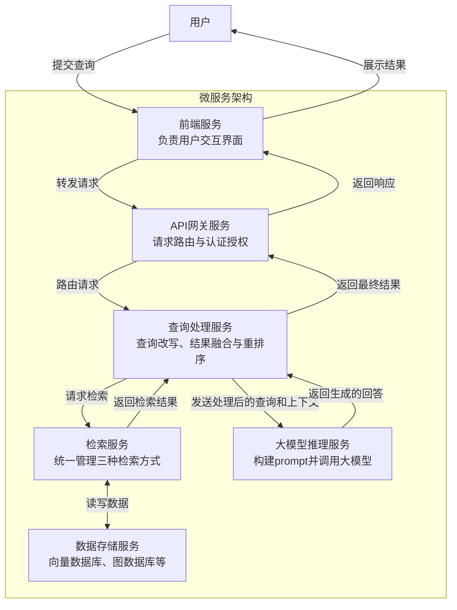

# 基于税后工资£2,554.50的月度差异示例

既然您的税后工资基准是£2,554.50，我将基于这个数值为您提供一个更贴合实际的月度差异示例。

## 基本情况分析

税后月薪£2,554.50对应的税前工资约为£3,450左右(根据标准扣除计算)。

## 月度差异示例表

以下是基于您提供的基准税后工资£2,554.50的月度差异示例：

| 月份 | 税前工资 | 原因 | 税后工资 | 与基准差异 |
|------|---------|------|---------|----------|
| 4月  | £3,450  | 标准月 | £2,554.50 | 基准 |
| 5月  | £3,450  | 标准月 | £2,554.50 | £0 |
| 6月  | £3,600  | 加班10小时 | £2,664.50 | +£110 |
| 7月  | £3,450  | 标准月 | £2,554.50 | -£110 |
| 8月  | £3,350  | 银行假日减少工作日 | £2,484.50 | -£70 |
| 9月  | £3,450  | 标准月 | £2,554.50 | +£70 |
| 10月 | £3,650  | 季度绩效奖金 | £2,714.50 | +£160 |
| 11月 | £3,450  | 标准月 | £2,554.50 | -£160 |
| 12月 | £3,750  | 圣诞节奖金 | £2,794.50 | +£240 |

## 可能导致实际差异的其他因素

1. **税收调整**：
   - 如果税务局调整您的税码，可能导致某个月的税后工资突然变化
   - 例如：10月税码调整，税后工资可能增加£30-£50

2. **养老金缴纳变化**：
   - 如果您调整养老金缴纳比例
   - 例如：从5%增加到6%，税后工资可能减少约£35

3. **额外福利扣除**：
   - 公司福利计划的季度或年度扣款
   - 例如：健康保险年度调整，可能导致某月减少£25-£40

4. **加班费率变化**：
   - 周末或节假日加班可能有更高费率
   - 例如：圣诞节期间加班，12月税后工资可能增加£100-£200

## 实际银行流水可能显示的月度工资

基于上述分析，您的银行流水中可能显示的实际月度工资大致如下：

| 月份 | 预计银行流水显示金额 |
|------|-------------------|
| 4月  | £2,554.50 |
| 5月  | £2,554.50 |
| 6月  | £2,664.50 |
| 7月  | £2,554.50 |
| 8月  | £2,484.50 |
| 9月  | £2,554.50 |
| 10月 | £2,714.50 |
| 11月 | £2,554.50 |
| 12月 | £2,794.50 |

请注意，这些数值是基于典型情况的估计。实际工资可能因公司政策、个人情况和具体工作安排而有所不同。如果您需要更精确的预测，建议咨询您公司的人力资源部门或财务部门。


# 英国税后工资月度差异分析

您提出了一个很好的问题。我之前确实提到税后工资可能有差异，但在计算示例中给出了相同的数值。让我来解释这些潜在差异及其特点：

## 税后工资月度差异的主要原因

1. **税收计算方式**：
   - 英国采用累计税收系统(Cumulative Tax System)
   - PAYE(Pay As You Earn)系统会根据您当年累计收入调整每月税收

2. **工作日数量不同**：
   - 不同月份的工作日数量不同(如2月比其他月份少)
   - 如果您按小时或按天计薪，这会导致差异

3. **季节性调整**：
   - 某些行业在不同月份有不同的工作强度

## 差异模式示例

假设您的基本月薪是£3,500，以下是可能的月度差异示例：

| 月份 | 税前工资 | 原因 | 税后工资 | 差异 |
|------|---------|------|---------|------|
| 4月  | £3,500  | 标准月 | £2,589.30 | 基准 |
| 5月  | £3,500  | 标准月 | £2,589.30 | £0 |
| 6月  | £3,650  | 加班5小时 | £2,699.30 | +£110 |
| 7月  | £3,500  | 标准月 | £2,589.30 | -£110 |
| 8月  | £3,400  | 公共假日减少工作日 | £2,519.30 | -£70 |
| 9月  | £3,500  | 标准月 | £2,589.30 | +£70 |
| 10月 | £3,700  | 季度奖金 | £2,769.30 | +£180 |
| 11月 | £3,500  | 标准月 | £2,589.30 | -£180 |
| 12月 | £3,800  | 圣诞奖金 | £2,839.30 | +£250 |

## 税收累计效应示例

即使每月税前工资相同，税后工资也可能有微小差异，这是因为PAYE系统的累计性质：

| 月份 | 累计应税收入 | 累计应缴税款 | 当月扣税 | 税后工资 |
|------|------------|------------|---------|---------|
| 4月  | £2,452.50  | £490.50    | £490.50 | £2,589.30 |
| 5月  | £4,905.00  | £981.00    | £490.50 | £2,589.30 |
| 6月  | £7,357.50  | £1,471.50  | £490.50 | £2,589.30 |
| 7月  | £9,810.00  | £1,962.00  | £490.50 | £2,589.30 |
| 8月  | £12,262.50 | £2,452.50  | £490.50 | £2,589.30 |
| 9月  | £14,715.00 | £2,943.00  | £490.50 | £2,589.30 |
| 10月 | £17,167.50 | £3,433.50  | £490.50 | £2,589.30 |
| 11月 | £19,620.00 | £3,924.00  | £490.50 | £2,589.30 |
| 12月 | £22,072.50 | £4,414.50  | £490.50 | £2,589.30 |

## 实际情况中的差异

在实际情况下，如果您的基本工资固定且没有加班、奖金等变动因素，税后工资的差异通常很小，可能只有几英镑。这些微小差异主要来自：

1. **税码调整**：税务局可能在年中调整您的税码
2. **四舍五入**：计算过程中的四舍五入差异
3. **税率变化**：如果跨税年(4月初)，税率和阈值可能变化

总结来说，如果您的工作性质稳定，没有加班、奖金等变动因素，那么每月税后工资的差异会非常小，几乎可以忽略不计。但如果有加班、奖金或其他变动因素，差异可能会比较明显，如上表所示。


# RAG系统微服务架构流程图

以下是将您的RAG系统简化为6个微服务的架构流程图，使用Mermaid格式绘制，并附带了每个节点的注释和解读。



## 微服务架构详细解读

### 1. 前端服务 (Frontend)
- **功能**：提供用户界面，接收用户查询，展示回答结果
- **技术**：Vue/React等前端框架
- **职责**：
  - 提供友好的用户交互界面
  - 将用户查询发送到API网关
  - 接收并展示最终结果
  - 可能包含简单的查询历史记录功能

### 2. API网关服务 (Gateway)
- **功能**：请求路由、负载均衡、认证授权
- **技术**：Nginx、Kong、Spring Cloud Gateway等
- **职责**：
  - 作为系统的统一入口
  - 将请求路由到相应的后端服务
  - 处理用户认证和授权
  - 可实现简单的限流和监控

### 3. 查询处理服务 (QueryService)
- **功能**：查询改写、结果融合、重排序
- **技术**：Python + NLP相关库
- **职责**：
  - 接收原始查询并进行改写（生成主查询和扩展查询）
  - 调用检索服务获取相关文档
  - 对检索结果进行加权融合
  - 实现粗排和精排算法
  - 构建结构化上下文
  - 协调整个查询处理流程

### 4. 检索服务 (RetrievalService)
- **功能**：统一管理三种检索方式
- **技术**：Python + 检索相关库
- **职责**：
  - 接收查询并执行文本检索（关键词匹配）
  - 执行语义检索（向量相似度）
  - 执行图谱检索（Neo4j查询）
  - 与各类数据库交互
  - 返回检索结果给查询处理服务

### 5. 大模型推理服务 (InferenceService)
- **功能**：构建prompt，调用大模型，生成回答
- **技术**：Python + LLM相关库
- **职责**：
  - 接收处理后的查询和上下文
  - 根据模板构建prompt
  - 调用大语言模型进行推理
  - 处理模型输出并返回最终回答
  - 可能包含多模型支持和回答优化

### 6. 数据存储服务 (DataStorage)
- **功能**：管理各类数据库
- **技术**：向量数据库、图数据库、关系型数据库等
- **职责**：
  - 存储文档和向量嵌入
  - 维护知识图谱数据
  - 提供高效的数据检索能力
  - 可能包含数据更新和同步机制

## 数据流程解读

1. **用户查询流程**：
   - 用户在前端输入问题
   - 前端将查询发送到API网关
   - API网关验证请求并路由到查询处理服务

2. **查询处理流程**：
   - 查询处理服务接收原始查询
   - 进行查询改写，生成主查询和扩展查询
   - 将改写后的查询发送到检索服务

3. **检索流程**：
   - 检索服务接收查询
   - 同时执行三种检索（文本、语义、图谱）
   - 从数据存储服务中获取相关数据
   - 将检索结果返回给查询处理服务

4. **结果处理流程**：
   - 查询处理服务对检索结果进行加权融合
   - 执行重排序（粗排和精排）
   - 选取前N条结果构建结构化上下文
   - 将查询和上下文发送到大模型推理服务

5. **推理流程**：
   - 大模型推理服务构建prompt
   - 调用大语言模型生成回答
   - 将生成的回答返回给查询处理服务

6. **响应流程**：
   - 查询处理服务可能对回答进行后处理
   - 将最终结果返回给API网关
   - API网关将结果返回给前端
   - 前端展示结果给用户

## 部署建议

1. **容器化**：每个服务打包成独立的Docker容器
2. **Kubernetes部署**：使用K8s管理容器的部署、扩展和更新
3. **资源分配**：根据服务负载特点分配合适的CPU和内存资源
4. **扩展策略**：设置自动扩缩容规则，特别是对检索服务和推理服务
5. **监控**：部署监控工具监控各服务的健康状态和性能指标

这种架构既保持了微服务的优势，又避免了过度拆分带来的复杂性，适合作为微服务架构的起点。随着系统的发展和团队的成长，可以在此基础上进一步细化服务。
# 微服务架构简单解释

好的，我来用简单的语言解释一下微服务架构，以及如何应用到您的RAG系统中。

## 什么是微服务？

微服务就像是把一个大型应用拆分成多个小型、独立的应用。每个小应用负责一项具体功能，它们之间通过网络通信协作完成整个系统的功能。

想象一下，如果您的RAG系统是一家餐厅：
- 传统方式：一个厨师负责所有工作（接单、洗菜、切菜、烹饪、装盘、送餐）
- 微服务方式：有专门的接待员、洗菜工、切菜师、厨师、服务员等，每人专注于自己的工作

## 是否需要把每个环节都拆分成微服务？

**不一定**。拆分的粒度取决于：
1. 系统复杂度
2. 团队规模
3. 各部分的独立性和重用性
4. 性能和扩展需求

## 适合您RAG系统的简化微服务方案

根据您作为小白的情况，我建议从较粗粒度的拆分开始：

### 1. 前端服务
- 功能：提供用户界面，接收用户查询，展示结果
- 技术：可以用Vue、React等前端框架
- 容器化：打包成一个Docker镜像

### 2. API网关服务
- 功能：接收所有请求，路由到相应服务，处理认证授权
- 技术：可以用Nginx、Kong等
- 容器化：打包成一个Docker镜像

### 3. 查询处理服务
- 功能：查询改写、检索结果融合、重排序
- 技术：Python + 相关NLP库
- 容器化：打包成一个Docker镜像

### 4. 检索服务
- 功能：统一管理三种检索方式（文本、语义、图谱）
- 技术：Python + 相关检索库
- 容器化：打包成一个Docker镜像

### 5. 大模型推理服务
- 功能：构建prompt，调用大模型，生成回答
- 技术：Python + LLM相关库
- 容器化：打包成一个Docker镜像

### 6. 数据存储服务
- 功能：管理向量数据库、图数据库等
- 技术：各类数据库
- 容器化：每种数据库一个Docker镜像

## 具体操作步骤

### 第一步：确定服务边界
决定哪些功能放在一起，哪些功能分开。上面我给出了一个建议方案。

### 第二步：为每个服务创建Docker镜像
1. 编写Dockerfile，例如查询处理服务：
```dockerfile
FROM python:3.9
WORKDIR /app
COPY requirements.txt .
RUN pip install -r requirements.txt
COPY . .
CMD ["python", "app.py"]
```

2. 构建镜像：
```
docker build -t query-service:v1 .
```

### 第三步：编写Kubernetes配置
为每个服务创建部署配置，例如：

```yaml
apiVersion: apps/v1
kind: Deployment
metadata:
  name: query-service
spec:
  replicas: 2
  selector:
    matchLabels:
      app: query-service
  template:
    metadata:
      labels:
        app: query-service
    spec:
      containers:
      - name: query-service
        image: query-service:v1
        ports:
        - containerPort: 8080
```

### 第四步：服务间通信
服务之间通过HTTP或gRPC等方式通信。例如：
- 前端调用API网关
- API网关调用查询处理服务
- 查询处理服务调用检索服务和大模型推理服务

## 简单示例：查询流程

1. 用户在前端输入问题
2. 前端发送请求到API网关
3. API网关转发到查询处理服务
4. 查询处理服务：
   - 改写查询
   - 调用检索服务获取相关文档
   - 对结果进行重排序
   - 调用大模型推理服务生成回答
5. 结果返回给用户

## 优势

1. **独立开发和部署**：各服务可以单独更新，不影响其他部分
2. **技术多样性**：不同服务可以使用最适合的技术
3. **可扩展性**：热门服务可以单独扩展，而不是扩展整个系统
4. **故障隔离**：一个服务出问题不会导致整个系统崩溃

## 建议

作为小白，您可以：
1. 先从较粗粒度的服务拆分开始
2. 随着对系统理解加深，再进一步细化
3. 使用Docker Compose在本地测试，然后再部署到K8s

希望这个解释对您有帮助！如果有任何不清楚的地方，请随时提问。
# RAG系统微服务架构设计

根据您描述的RAG系统流程，我可以帮您设计一个基于微服务的架构，使用K8s进行管理。您已经提到了几个关键微服务，我们可以进一步细化和补充。

## 您当前RAG系统流程

1. 用户查询进入系统
2. 查询改写（通过嵌入模型生成主查询和扩展查询）
3. 混合检索（文本检索、语义检索、Neo4j图谱检索）
4. 检索结果加权融合
5. 重排序（粗排和精排）
6. 获取前10条结果构建结构化上下文
7. 构建prompt指令
8. 大模型推理
9. 输出最终答案

## 建议的微服务架构

### 1. 已提到的微服务
- 向量数据库检索服务
- 大模型推理服务
- API网关
- 前端应用

### 2. 建议增加的微服务

#### 查询处理服务
负责接收原始查询并进行查询改写，生成主查询和扩展查询。

#### 检索编排服务
协调不同检索方式（文本、语义、图谱），并将结果进行融合。

#### 文本检索服务
专门处理基于关键词的文本检索。

#### 语义检索服务
处理基于向量的语义检索。

#### 图谱检索服务
专门与Neo4j交互，进行图谱检索。

#### 重排序服务
负责对检索结果进行粗排和精排。

#### 上下文构建服务
将排序后的结果构建成结构化上下文。

#### Prompt构建服务
根据上下文和用户查询构建最终的prompt。

#### 用户管理服务
处理用户认证、授权和个性化设置。

#### 监控与日志服务
收集系统各部分的性能指标和日志。

#### 缓存服务
缓存常见查询结果，提高响应速度。

#### 反馈分析服务
收集用户反馈，用于系统改进。

## 微服务架构图

```
用户 → 前端应用 → API网关
                    ↓
      ┌───────────────────────────┐
      ↓                           ↓
查询处理服务                  用户管理服务
      ↓                           ↑
检索编排服务 ←→ 缓存服务           │
      ↓                           │
┌─────┼─────┬─────────┐           │
↓     ↓     ↓         ↓           │
文本检索 语义检索 图谱检索  反馈分析服务
服务   服务   服务      ↑           │
      ↓                │           │
重排序服务              │           │
      ↓                │           │
上下文构建服务           │           │
      ↓                │           │
Prompt构建服务          │           │
      ↓                │           │
大模型推理服务 ─────────┘           │
      ↓                            │
      └────────────→ 监控与日志服务 ←┘
```

## 各微服务职责详解

### 1. 查询处理服务
- 接收原始查询
- 使用嵌入模型进行查询改写
- 生成主查询和扩展查询
- 可以包含查询理解、意图识别等功能

### 2. 检索编排服务
- 协调不同检索方式
- 调用各检索服务并收集结果
- 进行结果加权融合
- 实现检索策略的动态调整

### 3. 文本检索服务
- 与全文索引系统交互
- 基于关键词进行检索
- 处理精确匹配和模糊匹配

### 4. 语义检索服务
- 与向量数据库交互
- 处理向量相似度检索
- 管理向量索引

### 5. 图谱检索服务
- 与Neo4j图数据库交互
- 执行图查询
- 处理实体关系检索

### 6. 重排序服务
- 实现粗排算法
- 实现精排算法
- 可配置不同的排序策略

### 7. 上下文构建服务
- 从排序结果中提取关键信息
- 构建结构化上下文
- 处理上下文长度限制

### 8. Prompt构建服务
- 根据用户查询和上下文构建prompt
- 应用不同的prompt模板
- 优化prompt以获得更好的回答

### 9. 用户管理服务
- 用户认证与授权
- 用户偏好设置
- 用户历史查询管理

### 10. 监控与日志服务
- 收集各服务性能指标
- 聚合系统日志
- 提供告警机制
- 可视化系统状态

### 11. 缓存服务
- 缓存常见查询结果
- 缓存中间处理结果
- 实现缓存失效策略

### 12. 反馈分析服务
- 收集用户对回答的反馈
- 分析系统性能
- 提供改进建议

## K8s部署考虑因素

1. **资源分配**：为计算密集型服务（如大模型推理、向量检索）分配更多资源

2. **水平扩展**：设计服务支持水平扩展，特别是检索和推理服务

3. **服务网格**：考虑使用Istio等服务网格管理服务间通信

4. **存储**：为向量数据库、图数据库等配置持久化存储

5. **自动扩缩容**：基于负载自动调整Pod数量

6. **健康检查**：为每个服务配置适当的健康检查

7. **配置管理**：使用ConfigMap和Secret管理配置

8. **CI/CD**：建立自动化部署流程

希望这个微服务架构设计对您有所帮助！您可以根据实际需求和资源情况进行调整和优化。
